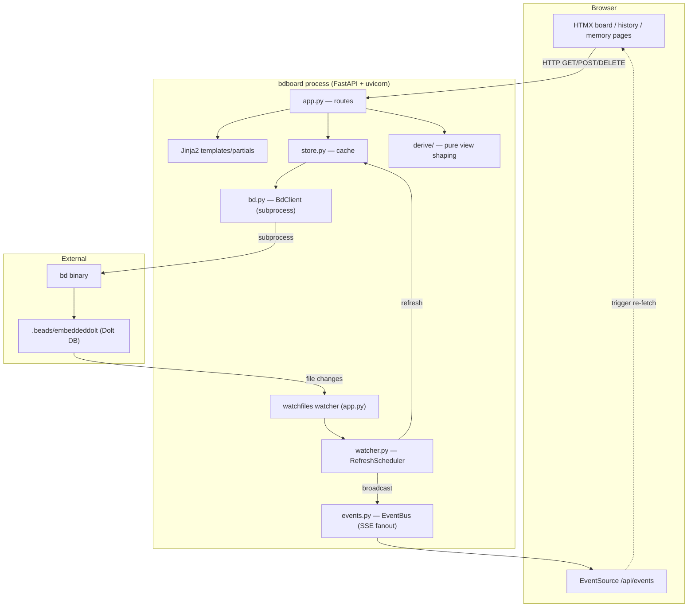
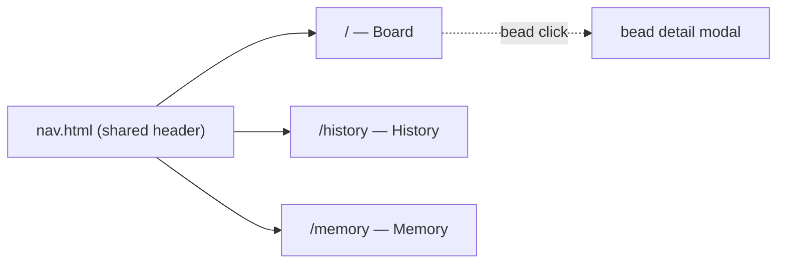

# bdboard — Architecture (maintainer edition)

> Audience: **maintainers**. This document explains what bdboard *does* and how
> its pieces fit together, with file paths so you can jump straight to the code.
> For per-item deep dives, follow the links into `Features/`, `Flows/`,
> `Endpoints/`, `Views/`, and `Concepts/` (see [`_Manifest.md`](./_Manifest.md)).

## Quick Start for Maintainers

- **Clone & enter:** `git clone <origin> && cd bdboard`
- **Install (dev):** `uv venv && uv sync` — Python ≥ 3.11 required.
- **Run against a workspace:** `cd <any dir with .beads/> && bdboard`
  (a browser tab opens on a free port automatically).
- **Run the tests:** `make test` (or `uv run pytest`).
- **Lint & format:** `make lint` → `ruff check --fix .` then `ruff format .`.
- **Where to look first:**
  - all HTTP routes + app wiring → [`src/bdboard/app.py`](../src/bdboard/app.py)
  - every `bd` subprocess call → [`src/bdboard/bd.py`](../src/bdboard/bd.py)
  - the in-memory cache → [`src/bdboard/store.py`](../src/bdboard/store.py)
  - raw-snapshot → view shaping → [`src/bdboard/derive/`](../src/bdboard/derive/)

## Tech Stack

| Layer | Choice | Why this choice |
| --- | --- | --- |
| Language | Python ≥ 3.11 | Matches `bd` tooling ecosystem; modern typing/async. |
| Web framework | FastAPI | Async routes, dependency injection, form parsing for HTMX posts. |
| ASGI server | uvicorn | Lightweight single-process server launched from the CLI. |
| Templating | Jinja2 | Server-rendered HTML fragments swapped by HTMX. |
| Front-end interactivity | HTMX + SSE | Live updates without an SPA or client framework. |
| Charts | Chart.js | Created-vs-closed history chart with no build step. |
| CLI | Typer | Declarative `bdboard` entry point with options. |
| Markdown rendering | markdown-it-py | Render bead descriptions/notes to HTML. |
| FS watching | watchfiles | Detect `.beads/` changes to trigger live refresh. |
| Form parsing | python-multipart | Parse HTMX form POSTs (field edits, pour). |
| Data backend | `bd` CLI → Dolt DB | Single runtime source of truth; never touch `.beads/` directly. |
| Tests | pytest | Unit + behavior tests under `tests/`. |
| Lint/format | ruff | Single fast linter+formatter; config in `pyproject.toml`. |

## System Diagram

## Features at a Glance

| Feature | What it does | Docs link |
| --- | --- | --- |
| Swim-lane board | Deferred/Blocked/Ready/In-Progress/Closed lanes + activity | [SwimLaneBoard](./Features/SwimLaneBoard.md) |
| Bead detail & inline edit | Modal with every bd field; edit in place | [BeadDetailAndInlineEditing](./Features/BeadDetailAndInlineEditing.md) |
| History & trends | Created-vs-closed chart, stats, record list | [HistoryAndTrends](./Features/HistoryAndTrends.md) |
| Memory management | List/search/create/delete persistent insights | [MemoryManagement](./Features/MemoryManagement.md) |
| Formula pour | Spawn bead graphs from `bd` formulas via a dialog | [FormulaPour](./Features/FormulaPour.md) |
| Live auto-refresh | Push UI updates when `.beads/` changes | [LiveAutoRefresh](./Features/LiveAutoRefresh.md) |

## Key Flows

1. **Startup & workspace resolution** — `bdboard` → resolve workspace (cwd /
   `$PWD` / `--dir`) → pick a free port → launch uvicorn → open browser when
   the socket is live. See [Flow: ServerStartup](./Flows/ServerStartup.md).
2. **Live-refresh pipeline** — `.beads/` write → watcher batch → debounce +
   cooldown → `store.refresh()` (with self-feedback skip) → SSE broadcast →
   HTMX swap. See [Flow: LiveRefreshPipeline](./Flows/LiveRefreshPipeline.md).
3. **Inline field edit** — form POST → CSRF check → status-gate → `bd update`
   → cache invalidate → re-render row. See [Flow: FieldEditWritePath](./Flows/FieldEditWritePath.md).
4. **Formula pour fan-out** — pick formula → render form → POST values → `bd`
   pour subprocess → spawned-bead summary partial. See [Flow: FormulaPourFanout](./Flows/FormulaPourFanout.md).

## External Dependencies

| Dependency | Used for | Failure Impact |
| --- | --- | --- |
| `bd` binary (on `PATH` or `--bd`) | Every bead read/write (subprocess) | Board comes up but all data views fail. |
| Dolt DB (`.beads/embeddeddolt/`, gitignored) | Actual bead storage, via `bd` only | No data; `bd` errors propagate to the UI. |
| Public PyPI / npm (CI) | Dependency install in CI | CI install fails; private mirrors opt-in via `PY_INDEX_URL`. |
| Browser with EventSource + HTMX | Live UI + fragment swaps | Falls back to static, non-live pages. |

## Directory Guide

| Path | Responsibility |
| --- | --- |
| `src/bdboard/cli.py` | Typer entry point: env setup, port pick, uvicorn, browser launch |
| `src/bdboard/app.py` | FastAPI app: all routes, lifespan, watcher wiring, field registry |
| `src/bdboard/bd.py` | `BdClient` — every `bd` subprocess call, JSON parse, caching, revision signature |
| `src/bdboard/store.py` | `Store` — three-way snapshot cache + change detection |
| `src/bdboard/derive/` | Pure functions turning raw snapshots into lanes/counts/history views |
| `src/bdboard/watcher.py` | `RefreshScheduler` — debounce/cooldown coalescing |
| `src/bdboard/events.py` | `EventBus` — in-process pub/sub for SSE fanout |
| `src/bdboard/md.py` | Markdown → HTML rendering wrapper |
| `src/bdboard/templates/` | Jinja2 pages + HTMX partials |
| `src/bdboard/static/styles.css` | All styling (light/dark, WCAG-AA contrast) |

## API Surface

| Method | Path | Purpose | Doc |
| --- | --- | --- | --- |
| GET | `/api/events` | SSE stream of `beads_changed` events | [SseEvents](./Endpoints/SseEvents.md) |
| GET | `/api/lanes`, `/api/lanes/closed`, `/api/counts` | Board lane + count partials | [LanesApi](./Endpoints/LanesApi.md) |
| GET | `/api/history` | History chart/stats/record partials | [HistoryApi](./Endpoints/HistoryApi.md) |
| GET/POST/DELETE | `/api/memory` | List/search/create/delete memories | [MemoryApi](./Endpoints/MemoryApi.md) |
| GET/POST | `/api/formulas`, `/api/formulas/{name}/form`, `/api/formulas/{name}/pour` | List formulas, render form, pour | [FormulasApi](./Endpoints/FormulasApi.md) |
| GET | `/api/bead/{id}`, `/api/bead/{id}/audit`, `/api/bead/{id}/raw` | Bead detail, audit trail, raw JSON | [BeadDetailApi](./Endpoints/BeadDetailApi.md) |
| POST | `/api/bead/{id}/field` | Inline field edit (write path) | [BeadFieldEditApi](./Endpoints/BeadFieldEditApi.md) |

### API Conventions

- **Response shape:** routes return **HTML fragments** (HTMX swap targets), not
  JSON — except `/api/bead/{id}/raw` which returns raw `bd ... --json` text.
- **Auth:** none (localhost single-user tool); mutating POSTs are guarded by a
  **double-submit CSRF token** (cookie + form field), not a login.
- **Errors:** failures render an `error.html` fragment / inline error rather
  than a JSON error envelope; the swap simply shows the message.
- **Versioning / pagination:** unversioned; time-window filtering is via query
  params (e.g. history range), not cursor pagination.

## Views & Pages

| Route | View | Purpose | Doc |
| --- | --- | --- | --- |
| `/` | Board page | Swim-lane board + live activity | [BoardPage](./Views/BoardPage.md) |
| `/history` | History page | Created-vs-closed chart, stats, records | [HistoryPage](./Views/HistoryPage.md) |
| `/memory` | Memory page | List/search/create/delete memories | [MemoryPage](./Views/MemoryPage.md) |

### Navigation Structure

### Shared Layouts

All pages extend [`templates/base.html`](../src/bdboard/templates/base.html),
which carries the `<head>`, HTMX + SSE wiring, the shared `nav.html` header, and
the theme toggle. Page templates (`dashboard.html`, `history.html`,
`memory.html`) fill the content block; HTMX partials under
`templates/partials/` are swapped in on demand.

## Where Decisions Live

Architectural decisions are recorded as ADRs under `docs/decisions/` (e.g.
0002 dashboard architecture, 0003 dolt sync, 0004 runtime source of truth, 0005
live-refresh). This `__docs/` tree documents *behavior*; the ADRs document *why
the behavior is shaped that way*. Cross-link rather than duplicate.
