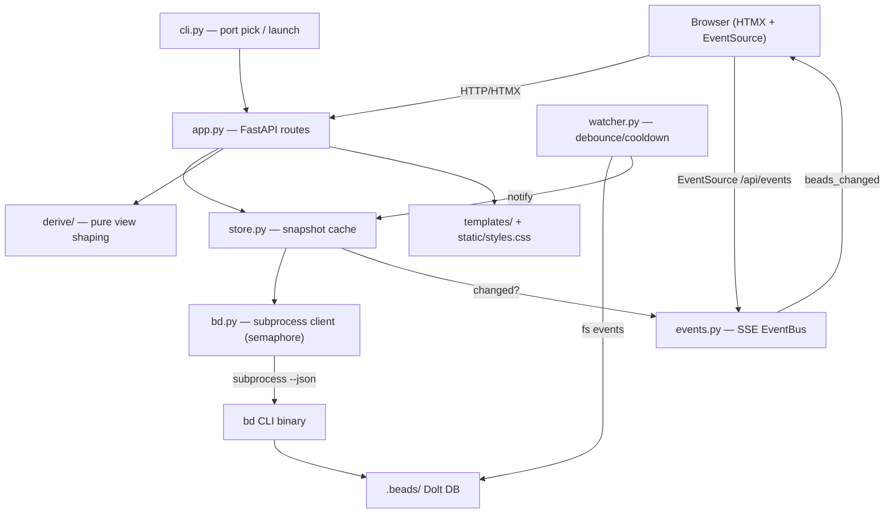
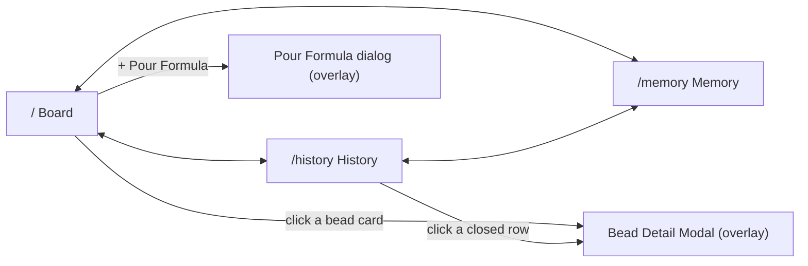

# bdboard — Architecture

A Python + FastAPI + HTMX dashboard that gives `bd` (beads) workspaces a live,
always-fresh web view: swim lanes, activity, history analytics, memory
curation, formula pours, and full bead detail with every field bd exposes.
bdboard is a **read-mostly observer** on the dolt-native source of truth — it
shells out to the `bd` CLI and never reads `.beads/issues.jsonl`.

## (a) Quick Start for Maintainers

```sh
git clone https://github.com/weegens-aaron/bdboard.git
cd bdboard
bd bootstrap --yes          # hydrate the bead DB (fresh clones ship none)
make install                # uv venv + editable install
source .venv/bin/activate
make test                   # full pytest suite
bdboard                     # binds 127.0.0.1:7332 and opens a browser
make code-health            # lint + fmt-check + dead-code + tests + dup + audit
```

**Where to look:**

- Routes / app wiring -> `src/bdboard/app.py`
- bd CLI subprocess client -> `src/bdboard/bd.py`
- Snapshot cache + change detection -> `src/bdboard/store.py`
- Pure view shaping -> `src/bdboard/derive/` (`lanes.py`, `history.py`, `timeutil.py`)
- Filesystem watcher (debounce/cooldown) -> `src/bdboard/watcher.py`
- SSE pub/sub bus -> `src/bdboard/events.py`
- CLI entry / port pick / browser launch -> `src/bdboard/cli.py`
- Templates (Jinja + HTMX) -> `src/bdboard/templates/` (+ `static/styles.css`)
- Tests -> `tests/`

## (b) Tech Stack

| Layer | Choice | Why this choice |
| --- | --- | --- |
| Language | Python ≥ 3.11 | Modern typing (`X \| None`), `UTC`, match-friendly; `pyproject.toml` pins it |
| Web framework | FastAPI | Async routes, dependency-light, returns HTML partials cleanly |
| Templating | Jinja2 | Server-rendered HTML + partials; one `md` filter for prose |
| Interactivity | HTMX | Partial swaps without a JS framework or build step |
| Live updates | Server-Sent Events | One-way server->browser push; native `EventSource` auto-reconnect |
| FS watching | watchfiles | Cross-platform; observes dolt `noms/` dirs non-recursively |
| CLI | Typer | Declarative flags for `bdboard` entry point |
| Server | uvicorn | ASGI server for FastAPI |
| Markdown | markdown-it-py | Renders bd prose with `html=False` (XSS-safe) |
| Data source | `bd` CLI over Dolt | The single, always-fresh source of truth |

## (c) System Diagram



## (d) Features at a Glance

| Feature | What it does | Docs link |
| --- | --- | --- |
| Live Board | Swim lanes (Deferred/Ready/In-Progress/Blocked/Closed) + epic strip + activity | [LiveBoard](Features/LiveBoard.md) |
| Bead Detail Modal | Full bead detail with every bd field + audit timeline | [BeadDetailModal](Features/BeadDetailModal.md) |
| Manual Field Editing | In-place edit of whitelisted fields via `bd update` | [ManualFieldEditing](Features/ManualFieldEditing.md) |
| Memory Curation | List/search/create/delete bd memories | [MemoryCuration](Features/MemoryCuration.md) |
| Formula Pour | Pick a formula, fill vars, pour beads onto the board | [FormulaPour](Features/FormulaPour.md) |
| History & Analytics | Throughput/lead-time charts, paginated closed record | [HistoryAnalytics](Features/HistoryAnalytics.md) |
| Live Updates | Filesystem-watch -> SSE push -> HTMX re-fetch | [LiveUpdates](Features/LiveUpdates.md) |

## (e) Key Flows

- [BoardFirstPaint](Flows/BoardFirstPaint.md) — cheap shell, async hydration
- [WatcherRefreshCycle](Flows/WatcherRefreshCycle.md) — fs event -> refresh -> broadcast
- [SseLiveUpdate](Flows/SseLiveUpdate.md) — broadcast -> EventSource -> partial re-fetch
- [FieldEditWritePath](Flows/FieldEditWritePath.md) — CSRF + optimistic lock + `bd update`
- [FormulaPourPipeline](Flows/FormulaPourPipeline.md) — preflight -> pour -> rename -> refresh

## (f) External Dependencies

| Dependency | Used for | Failure Impact |
| --- | --- | --- |
| `bd` (beads) binary | Every bead read/write (shelled via `bd.py`) | Board renders but all lanes/detail/memory/history views fail |
| Dolt DB (`.beads/embeddeddolt/`) | The bead store bd reads | `bd list` reports "no beads database found"; empty board |
| FastAPI / uvicorn | HTTP serving | App won't start |
| Jinja2 | Template rendering | No HTML output |
| watchfiles | FS change detection | Live updates stop; board only refreshes on manual reload |
| markdown-it-py | Rendering bd prose fields | Markdown fields render raw / unrendered |
| Typer | CLI entry point | `bdboard` command won't launch |

## (g) Directory Guide

| Path | Responsibility |
| --- | --- |
| `src/bdboard/cli.py` | Typer entry; workspace resolve, free-port pick, browser launch |
| `src/bdboard/app.py` | FastAPI app; all routes, CSRF, field registry, lifespan watcher |
| `src/bdboard/store.py` | In-memory snapshot caches (active/closed/history) + change detection |
| `src/bdboard/bd.py` | Async `bd` subprocess client; semaphore gate, TTL cache, in-flight dedup |
| `src/bdboard/derive/` | Pure functions shaping snapshots into lanes/activity/counts/history |
| `src/bdboard/watcher.py` | `RefreshScheduler` debounce/cooldown logic (unit-tested in isolation) |
| `src/bdboard/events.py` | `EventBus` SSE pub/sub (per-subscriber bounded queues) |
| `src/bdboard/md.py` | Markdown -> HTML wrapper (`html=False`, linkify) |
| `src/bdboard/templates/` | Jinja templates + HTMX partials |
| `src/bdboard/static/styles.css` | All styling (light/dark themes) |
| `tests/` | pytest suite |

## (h) API Surface

| Method | Path | Purpose | Doc |
| --- | --- | --- | --- |
| GET | `/api/events` | SSE stream of `beads_changed` events | [Events](Endpoints/GetApiEvents.md) |
| GET | `/api/lanes` | Active swim lanes + epic strip + activity | [Lanes](Endpoints/GetApiLanes.md) |
| GET | `/api/lanes/closed` | Closed lane (loaded after first paint) | [LanesClosed](Endpoints/GetApiLanesClosed.md) |
| GET | `/api/counts` | Header KPI counts strip | [Counts](Endpoints/GetApiCounts.md) |
| GET | `/api/history` | History region (charts + paginated closed list) | [History](Endpoints/GetApiHistory.md) |
| GET | `/api/memory` | Memory list (server-side search via `q`) | [GetMemory](Endpoints/GetApiMemory.md) |
| POST | `/api/memory` | Create/update a memory (`bd remember`) | [CreateMemory](Endpoints/PostApiMemory.md) |
| DELETE | `/api/memory/{key}` | Delete a memory (`bd forget`) | [DeleteMemory](Endpoints/DeleteApiMemory.md) |
| GET | `/api/formulas` | Formula picker list | [Formulas](Endpoints/GetApiFormulas.md) |
| GET | `/api/formulas/{name}/form` | Variable form for one formula | [FormulaForm](Endpoints/GetApiFormulaForm.md) |
| POST | `/api/formulas/{name}/pour` | Pour a formula onto the board | [FormulaPour](Endpoints/PostApiFormulaPour.md) |
| GET | `/api/bead/{id}` | Bead detail modal | [Bead](Endpoints/GetApiBead.md) |
| GET | `/api/bead/{id}/audit` | Bead audit trail + status timeline | [BeadAudit](Endpoints/GetApiBeadAudit.md) |
| GET | `/api/bead/{id}/raw` | Raw bead JSON escape hatch | [BeadRaw](Endpoints/GetApiBeadRaw.md) |
| POST | `/api/bead/{id}/field` | Edit one bead field via `bd update` | [BeadField](Endpoints/PostApiBeadField.md) |

### API Conventions

- **Auth scheme:** none. bdboard binds `127.0.0.1` only and is a single-user
  localhost tool. There are no sessions, cookies, or bearer tokens.
- **CSRF:** all mutating routes (POST/DELETE) require a per-process token
  (`secrets.token_urlsafe(32)` minted at startup), sent via the
  `X-CSRF-Token` header (HTMX `hx-headers`) OR a `csrf_token` form field.
  A mismatch returns `403`. See [CsrfProtection](Concepts/CsrfProtection.md).
- **Response envelope:** there is no JSON envelope. Every route except
  `/api/bead/{id}/raw` (JSON) and `/api/events` (SSE `text/event-stream`)
  returns an **HTML partial** for direct HTMX swap. Errors render as small
  inline HTML fragments with `role="alert"` plus an HTTP status
  (`400/403/404/409/500`), not JSON error objects.
- **Versioning:** unversioned. The app version (`0.1.0`) lives on the
  FastAPI app, not in URL paths. Static assets are cache-busted with an
  `?v=<startup-epoch>` query param.
- **Pagination:** only `/api/history` paginates — `page` (1-based) +
  `page_size` clamped to `{25, 50, 100}` (default 50). Lanes/memory/formulas
  are unpaginated (date/window-bounded instead).

## (i) Views & Pages

| Route | View | Purpose | Doc |
| --- | --- | --- | --- |
| `/` | Board | Live swim lanes, epic strip, activity, formula pour | [BoardView](Views/BoardView.md) |
| `/history` | History | Throughput/lead-time analytics + paginated closed record | [HistoryView](Views/HistoryView.md) |
| `/memory` | Memory | List/search/create/delete bd memories | [MemoryView](Views/MemoryView.md) |

### Navigation Structure



### Shared Layouts

All three pages extend `templates/base.html`, which provides the two-row
masthead (brand + counts on row 1; `partials/nav.html` + theme toggle +
actions on row 2), the theme system (light/dark, `aria-pressed` toggle),
the single `EventSource('/api/events')` subscription that fans out
`refresh from:body` HTMX triggers, and the `#bead-modal` overlay host. Each
page is a *cheap shell* that hydrates its data region via HTMX `load`
fetches, so time-to-first-paint never blocks on a `bd` subprocess.
