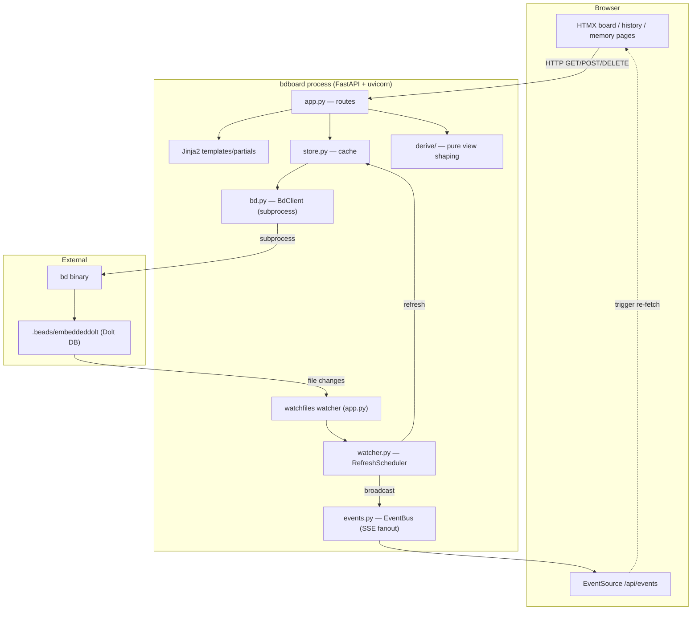

# bdboard — Architecture (maintainer edition)

> Audience: **maintainers**. This document explains what bdboard *does* and how
> its pieces fit together, with file paths so you can jump straight to the code.
> For per-item deep dives, follow the links into `Features/`, `Flows/`,
> `Endpoints/`, `Views/`, and `Concepts/` (see [`_Manifest.md`](./_Manifest.md)).

## Executive summary

**bdboard** is a single-binary, read-mostly web dashboard for
[`bd` (beads)](https://github.com/gastownhall/beads) workspaces. You `cd` into
any directory containing `.beads/`, run `bdboard`, and a browser tab opens onto
a live swim-lane board, a history/trends page, a memory page, and full bead
detail with inline field editing.

The defining architectural choices:

- **The `bd` CLI is the single runtime source of truth.** bdboard never reads
  `.beads/issues.jsonl` and never writes to `.beads/`. Every bead read shells
  out to `bd ... --json`; every write is a `bd update`/`bd memory`/formula
  `pour` subprocess. See [Concept: bd CLI source of truth](./Concepts/bd-cli-source-of-truth.md).
- **Read-mostly, cached in memory.** A `Store` keeps last-known-good snapshots
  so HTTP routes don't pay a ~700ms subprocess on every request. A `watchfiles`
  watcher refreshes the cache when `.beads/` actually changes.
- **Live without polling.** Filesystem change → debounced refresh → SSE
  `beads_changed` event → HTMX re-fetches the affected partials.
- **Server-rendered partials over HTMX.** No SPA, no client framework. Jinja2
  templates render HTML fragments; HTMX swaps them in. Charts use Chart.js.

## Tech stack

| Layer | Choice | Where |
| --- | --- | --- |
| Language | Python ≥ 3.11 | `pyproject.toml` |
| Web framework | FastAPI | `src/bdboard/app.py` |
| ASGI server | uvicorn | `src/bdboard/cli.py` |
| Templating | Jinja2 | `src/bdboard/templates/` |
| Front-end interactivity | HTMX + SSE | `templates/base.html` |
| Charts | Chart.js | `templates/partials/history.html` |
| CLI | Typer | `src/bdboard/cli.py` |
| Markdown rendering | markdown-it-py | `src/bdboard/md.py` |
| FS watching | watchfiles | `src/bdboard/watcher.py`, `app.py` |
| Form parsing | python-multipart | (FastAPI form deps) |
| Data backend | `bd` CLI → Dolt DB | `src/bdboard/bd.py` |
| Tests | pytest | `tests/` |
| Lint/format | ruff | `pyproject.toml` `[tool.ruff]` |

## System diagram

## Features at a glance

| Feature | What it does | Entry points |
| --- | --- | --- |
| Swim-lane board | Deferred/Blocked/Ready/In-Progress/Closed lanes + activity | `GET /`, `/api/lanes`, `/api/lanes/closed`, `derive/lanes.py` |
| Bead detail & inline edit | Modal with every bd field; edit in place | `/api/bead/{id}`, `POST /api/bead/{id}/field` |
| History & trends | Created-vs-closed chart, stats, record list | `GET /history`, `/api/history`, `derive/history.py` |
| Memory management | List/search/create/delete persistent insights | `/memory`, `GET/POST/DELETE /api/memory` |
| Formula pour | Spawn bead graphs from `bd` formulas via a dialog | `/api/formulas...`, `POST /api/formulas/{name}/pour` |
| Live auto-refresh | Push UI updates when `.beads/` changes | `/api/events`, `watcher.py` |
| Light/dark theme | Persistent theme toggle | `templates/partials/theme_toggle.html` |

## Key flows

1. **Startup & workspace resolution** — `bdboard` → resolve workspace (cwd /
   `$PWD` / `--dir`) → pick a free port → launch uvicorn → open browser when
   the socket is live. See [Flow: server startup](./Flows/server-startup.md).
2. **Live-refresh pipeline** — `.beads/` write → watcher batch → debounce +
   cooldown → `store.refresh()` (with self-feedback skip) → SSE broadcast →
   HTMX swap. See [Flow: live-refresh pipeline](./Flows/live-refresh-pipeline.md).
3. **Inline field edit** — form POST → CSRF check → status-gate → `bd update`
   → cache invalidate → re-render row. See [Flow: field-edit write path](./Flows/field-edit-write-path.md).
4. **Formula pour** — pick formula → render form → POST values → `bd` pour
   subprocess → spawned-bead summary partial. See [Flow: formula pour fan-out](./Flows/formula-pour-fanout.md).

## Module map

| Module | Responsibility |
| --- | --- |
| `src/bdboard/cli.py` | Typer entry point: env setup, port pick, uvicorn, browser launch |
| `src/bdboard/app.py` | FastAPI app: all routes, lifespan, watcher wiring, field registry |
| `src/bdboard/bd.py` | `BdClient` — every `bd` subprocess call, JSON parse, caching, revision signature |
| `src/bdboard/store.py` | `Store` — three-way snapshot cache + change detection |
| `src/bdboard/derive/` | Pure functions turning raw snapshots into lanes/counts/history views |
| `src/bdboard/watcher.py` | `RefreshScheduler` — debounce/cooldown coalescing |
| `src/bdboard/events.py` | `EventBus` — in-process pub/sub for SSE fanout |
| `src/bdboard/md.py` | Markdown → HTML rendering wrapper |
| `src/bdboard/templates/` | Jinja2 pages + HTMX partials |
| `src/bdboard/static/styles.css` | All styling (light/dark, WCAG-AA contrast) |

## External dependencies & integration points

- **`bd` binary** — required at runtime on `PATH` (or via `--bd`). Without it,
  the board comes up but all data views fail.
- **Dolt DB** (`.beads/embeddeddolt/`, gitignored) — the actual storage,
  accessed only through `bd`. Replicated off-machine via Dolt's git-compatible
  wire protocol under `refs/dolt/data` (see repo `README.md` and ADR 0003).
- **Public PyPI / npm** — CI installs against public indexes; private mirrors
  are opt-in via `PY_INDEX_URL` in the Makefile.

## Where decisions live

Architectural decisions are recorded as ADRs under `docs/decisions/` (e.g.
0002 dashboard architecture, 0003 dolt sync, 0004 runtime source of truth, 0005
live-refresh). This `__docs/` tree documents *behavior*; the ADRs document *why
the behavior is shaped that way*. Cross-link rather than duplicate.
