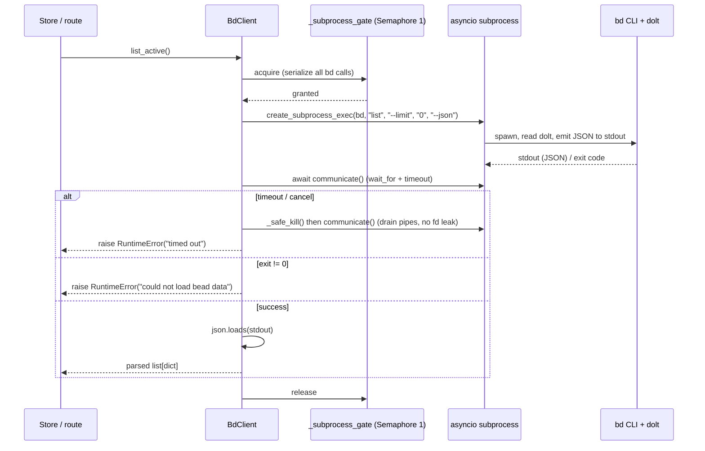

# bd CLI as runtime source of truth

## What Is It

[`BdClient`](../../src/bdboard/bd.py) is bdboard's **only** doorway to bead
data: a thin async wrapper that shells out to the **`bd` command-line tool**
(`bd list`, `bd show`, `bd history`, `bd status`, `bd memories`, `bd update`,
`bd mol pour`, …) with `--json` and parses stdout. The architectural rule it
embodies is: **the live `bd` CLI is the single runtime source of truth, and the
`.beads/issues.jsonl` export is deliberately NOT consulted.**

Concretely that means:

1. **Reads go through subprocesses, not files.** Every bead the board renders
   came out of a `bd … --json` invocation parsed in
   [`BdClient._run_json`](../../src/bdboard/bd.py) — never from reading
   `.beads/issues.jsonl` (a secondary, possibly-stale export) and never from
   poking the dolt store directly.
2. **Writes go through `bd` too.** Inline field edits, memory upserts, and
   formula pours shell `bd update` / `bd remember` / `bd mol pour` via
   [`BdClient._run_mutate`](../../src/bdboard/bd.py) /
   [`BdClient.pour_formula`](../../src/bdboard/bd.py) — bdboard never mutates the
   dolt database itself, so `bd`'s own validation, audit trail, and dolt commit
   semantics stay authoritative.
3. **One writer, serialized.** `bd`'s embedded dolt server is single-writer, so
   every subprocess — read or write — passes through a single
   `asyncio.Semaphore(1)` (`_subprocess_gate`) so concurrent CLI invocations
   can't lock-wait against each other.

bdboard is therefore a pure **observer-and-thin-controller** over a `bd`
workspace: `BdClient` is the boundary, [`Store`](StoreSnapshotCache.md) caches
its output, the [derive layer](DeriveLayer.md) shapes it, and the
[watcher](WatcherScheduling.md) decides when to re-ask.

## Why This Approach

The tempting alternative — read `.beads/issues.jsonl` directly, or open the
dolt database ourselves — was rejected for measured, specific reasons that the
CLI-as-truth posture each answer:

- **The JSONL export is a secondary artifact, not the store.** Modern `bd`
  workspaces are dolt-backed; `issues.jsonl` is a passive export that may be
  **absent or stale** (it only refreshes on an explicit export). Treating it as
  truth would render a board that silently disagrees with what `bd ready` /
  `bd show` report on the same machine. [`BdClient.validate`](../../src/bdboard/bd.py)
  deliberately does **not** require `issues.jsonl` to exist — only a `.beads/`
  dir and a working `bd` binary.
- **`bd` owns the schema, validation, and audit trail.** Field edits must
  respect `bd`'s validation rules and write to its audit log so
  [`bd history`](../Endpoints/BeadDetailApi.md) stays truthful. Re-implementing
  dolt writes in bdboard would duplicate (and inevitably drift from) `bd`'s
  rules. Shelling `bd update` makes `bd` the one validator and the one writer.
- **dolt is single-writer; concurrent CLI calls lock-wait.** A fan of parallel
  `bd` subprocesses (or a write racing a read) contends on dolt's lock and can
  deadlock peers. The process-wide `_subprocess_gate` semaphore turns the whole
  app into a disciplined single caller, so one slow command can't starve the
  rest.
- **Subprocesses are slow, so caching is mandatory.** A `bd list --json` on a
  real workspace is ~700ms (process spawn + dolt read + JSON serialize). The
  CLI-as-truth design is only viable *because* [`Store`](StoreSnapshotCache.md)
  caches the output and the [watcher](WatcherScheduling.md) keeps it warm — the
  CLI is the source of truth, the cache is the read path.

The cost of this posture is the operational machinery in `bd.py`: timeouts per
command, TTL caches for detail reads, in-flight dedup, careful fd hygiene, and
a content-fingerprint loop-breaker. Those exist precisely *because* every datum
is a subprocess.

> [!NOTE]
> This concept describes *behavior and policy*. The fd-leak hardening
> (`_safe_kill` + always-`communicate()`) traces to the kqueue fd-exhaustion
> story documented on [`watch_targets`](../../src/bdboard/bd.py); the
> revision-fingerprint loop-breaker is `bdboard-ywep`; the count-uncapped vs
> window-bounded list split is `bdboard-a194` / `bdboard-gp06` / `bdboard-p8v`.
> See also [Architecture](../Architecture.md) → "Tech Stack" (the "bd CLI
> (subprocess)" data layer).

## How It Works

There is one wrapper object (`BdClient`), one serializing gate, one JSON runner
for reads, one runner for mutations, a TTL+dedup cache layer for detail reads,
and two cheap filesystem fingerprints the [watcher](WatcherScheduling.md) /
[store](StoreSnapshotCache.md) consult to avoid needless subprocesses.

### The command catalog

Every method maps to a real `bd` invocation. These are the exact argv lists
(`--json` is appended by `_run_json`; mutations run without it):

| `BdClient` method | `bd` command run | Kind | JSON shape returned |
| --- | --- | --- | --- |
| `list_active` | `bd list --no-pager --limit 0 --json` | read | array of issue dicts |
| `list_closed` | `bd list --status closed --closed-after <iso> --sort closed --no-pager --limit 0 --json` | read | array of issue dicts |
| `list_closed_history` | `bd list --status closed --sort closed --no-pager --limit <cap> [--closed-after <iso>] --json` | read | array of issue dicts |
| `show_long` | `bd show <id> --long --json` | read (cached) | one-element array → unwrapped dict |
| `history` | `bd history <id> --json` | read (cached) | array of audit-event dicts |
| `status_summary` | `bd status --json` | read (cached) | object with a `summary` sub-object |
| `memories` | `bd memories [term] --json` | read (cached) | flat `{key: body}` object + `schema_version` |
| `list_formulas` | `bd formula list --json` | read | array of formula dicts |
| `remember` | `bd remember <body> --key <key>` | mutate | (exit code only) |
| `forget` | `bd forget <key>` | mutate | (exit code only) |
| `update_field` | `bd update <id> <flag> <value> [--actor <a>]` | mutate | (exit code only) |
| `rename_bead` | `bd update <id> --title <title>` | mutate | (exit code only) |
| `pour_formula` | `bd mol pour <name> --var k=v … --json` | mutate **+** read | object: `new_epic_id`, `id_mapping`, `created` |

> [!NOTE]
> `--no-pager` and `--limit 0` (no cap) appear on the list reads because the
> board needs the *whole* active set in one shot, not a paged human view.
> `list_closed` bounds by **date** (`--closed-after`), never by a static count —
> a count cap would make older closures unreachable (`bdboard-a194`).

### The raw bead JSON shape

`bd list --json` / `bd show --long --json` return bead records bdboard treats as
the canonical shape (the [derive layer](DeriveLayer.md) reshapes them at read
time; `BdClient` passes them through untouched). The fields downstream code
depends on:

```json
{
  "id": "bdboard-mol-bfs.21",
  "title": "Concept: bd CLI as runtime source of truth",
  "status": "in_progress",
  "issue_type": "task",
  "priority": 2,
  "assignee": "Aaron Weegens",
  "created_by": "Aaron Weegens",
  "created_at": "2026-06-04T00:00:00Z",
  "started_at": "2026-06-04T00:00:00Z",
  "updated_at": "2026-06-04T00:00:00Z",
  "closed_at": null,
  "dependencies": []
}
```

`bd memories --json` is a different shape — a flat object plus a sentinel that
must be stripped:

```json
{
  "schema_version": "1",
  "dep-edge-direction": "bd reports 'blocks' on both sides; label depends on direction AND type",
  "self-feedback": "read-only bd list re-touches noms/; gate refresh on revision_signature()"
}
```

`bd mol pour --json` returns the materialization result:

```json
{
  "new_epic_id": "bdboard-mol-9xx",
  "id_mapping": { "step-1": "bdboard-mol-9xx.1", "step-2": "bdboard-mol-9xx.2" },
  "created": 3
}
```

### The read path (`_run_json`)



### Concrete example — an inline field edit, end to end

1. The user changes a bead's priority in the modal. The
   [field-edit write path](../Flows/FieldEditWritePath.md) calls
   `bd.update_field(id, "--priority", "1", actor="Aaron Weegens")`.
2. `update_field` builds argv `["update", id, "--priority", "1", "--actor",
   "Aaron Weegens"]` and hands it to `_run_mutate`, which acquires
   `_subprocess_gate`, spawns `bd update …` (no `--json`), and checks the exit
   code — surfacing `bd`'s **stderr verbatim** on failure so a rejected value
   shows the real reason.
3. On success `update_field` clears `_show_cache` and calls `invalidate_caches()`
   so the route's follow-up `show_long(id, fresh=True)` re-reads live state
   rather than a ≤10s-stale cache entry.
4. `bd`'s dolt commit re-touches `.beads/embeddeddolt/<db>/.dolt/noms/`, so the
   [watcher](WatcherScheduling.md) fires; [`Store.refresh()`](StoreSnapshotCache.md)
   compares `revision_signature()` against the last one, sees a *real* root-hash
   change, re-runs `list_active`/`list_closed`, diffs, and broadcasts
   `beads_changed`. The new priority appears on the board.

> [!NOTE]
> Long markdown fields (`--description`, `--design`) are streamed on **stdin**
> via `bd`'s `--body-file -` / `--design-file -` variants
> (`_STDIN_FLAG_ALIASES`) to dodge shell-arg length limits — `create_subprocess_exec`
> is used everywhere (no shell), so the other flag values are already injection-safe.

### The cheap fingerprints (avoiding subprocesses entirely)

Two methods read tiny files directly — the **only** place bdboard touches
`.beads/` without going through `bd` — purely as cheap signals so the expensive
CLI call can be skipped:

- [`revision_signature()`](../../src/bdboard/bd.py) reads each dolt
  `.dolt/noms/manifest` (~150 bytes; its payload is dolt's **root hash**). It
  changes **iff** the database content actually changed, so
  [`Store`](StoreSnapshotCache.md) uses it to tell "a real write happened" from
  "our own read-only `bd list` jiggled the files" — the self-feedback
  loop-breaker (`bdboard-ywep`).
- [`watch_targets()`](../../src/bdboard/bd.py) /
  [`watch_signature()`](../../src/bdboard/bd.py) enumerate the `noms/` dirs the
  [watcher](WatcherScheduling.md) observes non-recursively (and detect new/replaced
  dolt dbs), avoiding the macOS kqueue fd blowout that recursive `.beads/`
  watching causes.

### Implementation map

| Responsibility | File path | Symbol |
| --- | --- | --- |
| The async `bd` CLI wrapper (the boundary) | `src/bdboard/bd.py` | `BdClient` |
| Run `bd … --json`, parse stdout, fd-safe cleanup | `src/bdboard/bd.py` | `BdClient._run_json` |
| Run a `bd` mutation (no `--json`, exit-code + stderr) | `src/bdboard/bd.py` | `BdClient._run_mutate` |
| Serialize every subprocess (dolt single-writer) | `src/bdboard/bd.py` | `BdClient._subprocess_gate` |
| TTL cache + in-flight dedup around `_run_json` | `src/bdboard/bd.py` | `BdClient._cached`, `CacheEntry` |
| Kill-an-already-dead-proc helper (uvloop safety) | `src/bdboard/bd.py` | `_safe_kill` |
| Active list read (`bd list --limit 0`) | `src/bdboard/bd.py` | `BdClient.list_active` |
| Board-closed read (date-windowed) | `src/bdboard/bd.py` | `BdClient.list_closed` |
| History read (count-uncapped, window-bounded) | `src/bdboard/bd.py` | `BdClient.list_closed_history` |
| Bead detail read (`bd show --long`, cached) | `src/bdboard/bd.py` | `BdClient.show_long` |
| Audit history read (`bd history`, cached) | `src/bdboard/bd.py` | `BdClient.history` |
| Aggregate KPI read (`bd status`, cached) | `src/bdboard/bd.py` | `BdClient.status_summary` |
| Memory browse/search (`bd memories`, cached) | `src/bdboard/bd.py` | `BdClient.memories` |
| Memory upsert / delete writes | `src/bdboard/bd.py` | `BdClient.remember`, `BdClient.forget` |
| Single field edit write (stdin for long md) | `src/bdboard/bd.py` | `BdClient.update_field`, `_STDIN_FLAG_ALIASES` |
| Title rename write (pour wrapper retitle) | `src/bdboard/bd.py` | `BdClient.rename_bead` |
| Formula pour (mutate + JSON result) | `src/bdboard/bd.py` | `BdClient.pour_formula` |
| Formula list + on-disk variable/step parse | `src/bdboard/bd.py` | `BdClient.list_formulas`, `read_formula_detail`, `read_formula_variables` |
| Drop detail caches after a mutation/refresh | `src/bdboard/bd.py` | `BdClient.invalidate_caches` |
| Workspace guard (needs `.beads/` + `bd` on PATH; NOT jsonl) | `src/bdboard/bd.py` | `BdClient.validate` |
| Content fingerprint (root hash) for refresh skip | `src/bdboard/bd.py` | `BdClient.revision_signature` |
| Watch-target enumeration + identity fingerprint | `src/bdboard/bd.py` | `BdClient.watch_targets`, `watch_signature` |
| Constructs the singleton `BdClient(bd_bin, workspace)` | `src/bdboard/app.py` | module-level `bd = BdClient(...)`, `create_app` |
| Resolves `--bd` binary + `--dir`/cwd workspace, sets env | `src/bdboard/cli.py` | `_run`, `_resolve_workspace` |

### Failure & edge handling

| Trigger | Behavior | Result |
| --- | --- | --- |
| `bd` binary not on PATH / no `.beads/` dir | `validate()` raises a helpful RuntimeError | Startup surfaces a friendly fix, not a traceback (`_validate_or_warn`) |
| `bd` subprocess exceeds its timeout | `_run_json`/`_run_mutate` `_safe_kill` + drain, then raise "timed out" | Pipes drained (no fd leak); caller serves stale or shows retry |
| `bd` exits non-zero on a read | `_run_json` raises "could not load bead data" | `Store.refresh` keeps prior snapshot; detail routes show error partial |
| `bd` exits non-zero on a write | `_run_mutate` surfaces `bd`'s **stderr verbatim** | User sees the real validation reason (e.g. bad priority) |
| `bd … --json` returns malformed JSON | `json.loads` raises → "unexpected response" | Treated as a transient failure; cached briefly under `ERROR_TTL_S` |
| Refresh cancelled mid-`communicate()` (debounce) | `except BaseException` → `_safe_kill` + drain, re-raise | Cancellation honored, no leaked stdin/stdout/stderr fds |
| Killing an already-exited proc (uvloop) | `_safe_kill` swallows `ProcessLookupError` | Doesn't mask the real `CancelledError`; draining `communicate()` still runs |
| `.beads/issues.jsonl` absent or stale | Ignored entirely — never read | Board reflects live `bd` state, not the export |
| Legacy JSONL-only workspace (no embedded dolt) | `revision_signature()` returns empty set | "No signal" ⇒ always refresh (safe direction), live-sync still works |
| Concurrent reads + a write from two tabs | All funnel through `_subprocess_gate` | Exactly one `bd` runs at a time; no dolt-lock deadlock |
| `bd formula list` reports `vars: 0` (unreliable) | Code reads the `*.formula.json` source instead | Variables enumerated from disk, not the wrong CLI count |

## Where Used

- **Flows:**
  [ServerStartup](../Flows/ServerStartup.md) — `cli._resolve_workspace` →
  `app` constructs `BdClient(bd_bin, workspace)` and calls `validate()`;
  [LiveRefreshPipeline](../Flows/LiveRefreshPipeline.md) —
  `list_active`/`list_closed` are the subprocesses `Store.refresh` runs, gated by
  `revision_signature()`;
  [FieldEditWritePath](../Flows/FieldEditWritePath.md) — `update_field` (and
  `show_long(fresh=True)`) is the `bd update` write/verify hop;
  [FormulaPourFanout](../Flows/FormulaPourFanout.md) — `pour_formula` +
  `rename_bead` materialize a formula tree via `bd mol pour`.
- **Features:**
  [SwimLaneBoard](../Features/SwimLaneBoard.md) — rendered from `list_active`/
  `list_closed` output;
  [BeadDetailAndInlineEditing](../Features/BeadDetailAndInlineEditing.md) —
  `show_long` + `history` reads and `update_field` writes;
  [HistoryAndTrends](../Features/HistoryAndTrends.md) — `list_closed_history` +
  `status_summary`;
  [MemoryManagement](../Features/MemoryManagement.md) — `memories` /
  `remember` / `forget`;
  [FormulaPour](../Features/FormulaPour.md) — `list_formulas` +
  `read_formula_detail` + `pour_formula`.
- **Endpoints:**
  [LanesApi](../Endpoints/LanesApi.md) · [HistoryApi](../Endpoints/HistoryApi.md)
  · [BeadDetailApi](../Endpoints/BeadDetailApi.md) ·
  [MemoryApi](../Endpoints/MemoryApi.md) ·
  [FormulasApi](../Endpoints/FormulasApi.md) ·
  [BeadFieldEditApi](../Endpoints/BeadFieldEditApi.md) — every data route bottoms
  out in a `BdClient` call (directly or via `Store`).
- **Related concepts:**
  [StoreSnapshotCache](StoreSnapshotCache.md) — caches `BdClient` output so the
  ~700ms subprocess isn't paid per request, and consults `revision_signature()`;
  [WatcherScheduling](WatcherScheduling.md) — uses `watch_targets`/`watch_signature`
  to observe `noms/` and decides *when* to re-run `bd list`;
  [DeriveLayer](DeriveLayer.md) — reshapes the raw bead dicts this layer returns;
  [HtmxPartialsArchitecture](HtmxPartialsArchitecture.md) — renders the shaped
  output into the partials a `bd`-driven change ultimately re-swaps.

## Conventions

> [!IMPORTANT]
> **All bead data — reads AND writes — goes through the `bd` CLI.** Never read
> `.beads/issues.jsonl` and never open the dolt store directly. The CLI owns the
> schema, validation, audit trail, and dolt commit semantics; bypassing it
> produces a board that disagrees with `bd` on the same machine.

> [!IMPORTANT]
> **Serialize every subprocess through `_subprocess_gate`.** `bd`'s embedded
> dolt is single-writer; one shared `asyncio.Semaphore(1)` for reads and writes
> alike is what prevents lock-wait deadlocks between concurrent CLI calls.

> [!IMPORTANT]
> **Always `communicate()` on every exit path, and use `_safe_kill`.** A
> timed-out or cancelled subprocess that isn't drained leaks ~3 fds; under
> `RLIMIT_NOFILE` exhaustion `create_subprocess_exec` itself starts failing and
> the board stops syncing. Killing an already-dead pid must be a no-op so it
> can't mask a `CancelledError`.

> [!IMPORTANT]
> **Use `create_subprocess_exec` (no shell) and pass values as argv.** Long
> markdown (`--description`/`--design`) streams on stdin via `--body-file -` /
> `--design-file -`; everything else is a direct argv element, which is already
> injection-safe without a shell.

> [!IMPORTANT]
> **After any mutation, invalidate the affected caches before re-reading.**
> `update_field`/`remember`/`forget`/`pour_formula` clear the relevant TTL caches
> (and `show_long(fresh=True)` drops the per-bead entry) so a follow-up read
> can't serve a ≤10s-stale value and clobber a concurrent edit.

> [!IMPORTANT]
> **`validate()` requires only `.beads/` + a `bd` binary — never the JSONL.**
> Modern workspaces are dolt-backed and the export may be missing or stale;
> demanding it would refuse perfectly valid workspaces.

## Anti-Patterns

> [!CAUTION]
> **Don't read `.beads/issues.jsonl` as a runtime source.** It's a passive,
> possibly-stale secondary export. The board would silently drift from `bd`'s
> real state. (The only direct file reads allowed are the tiny dolt `manifest`
> fingerprint and the `*.formula.json` templates the CLI hands us by path.)

> [!CAUTION]
> **Don't write to the dolt store yourself.** Re-implementing edits skips `bd`'s
> validation and audit logging and will drift from its schema. Shell `bd update`
> / `bd remember` / `bd mol pour` so `bd` stays the one writer.

> [!CAUTION]
> **Don't fire `bd` subprocesses concurrently without the gate.** Parallel CLI
> calls contend on dolt's single-writer lock and can deadlock; a read racing a
> write is the classic offender. Funnel everything through `_subprocess_gate`.

> [!CAUTION]
> **Don't shell `bd list --json` per HTTP request.** Each call is ~700ms; doing
> it per route makes the board sluggish and starves real writes. Read
> [`Store`](StoreSnapshotCache.md)'s cache and let the watcher keep it warm.

> [!CAUTION]
> **Don't use mtime/inode to detect "did the data change".** Read-only `bd list`
> re-touches `journal.idx`/`noms/`, so timestamp/inode oracles mistake our own
> echo for a write. Compare the dolt `manifest` **content** via
> `revision_signature()` instead.

> [!CAUTION]
> **Don't trust the `vars` count from `bd formula list --json` (it's always 0)
> and don't expect `bd formula show --json` to carry variables (it omits them).**
> Read the `*.formula.json` source file for variables/steps/full description.

## Related

- [Architecture](../Architecture.md) — the "bd CLI (subprocess)" data layer in
  the Tech Stack table and System Diagram.
- [Concepts index](index.md) — sibling cross-cutting concepts.
- [Manifest](../_Manifest.md) — catalog of every documented item.
- [StoreSnapshotCache](StoreSnapshotCache.md) — caches this layer's output and
  consults its revision fingerprint.
- [WatcherScheduling](WatcherScheduling.md) — uses `watch_targets`/`watch_signature`
  and decides when to re-run `bd list`.
- [DeriveLayer](DeriveLayer.md) — reshapes the raw bead JSON this layer returns.
- [HtmxPartialsArchitecture](HtmxPartialsArchitecture.md) — renders the shaped
  output into partials.
- [ServerStartup](../Flows/ServerStartup.md) — constructs + validates the
  `BdClient`.
- [LiveRefreshPipeline](../Flows/LiveRefreshPipeline.md) — the `bd list` refresh
  loop.
- [FieldEditWritePath](../Flows/FieldEditWritePath.md) — the `bd update` write
  path.
- [FormulaPourFanout](../Flows/FormulaPourFanout.md) — the `bd mol pour` write
  path.
- [LanesApi](../Endpoints/LanesApi.md) · [HistoryApi](../Endpoints/HistoryApi.md)
  · [BeadDetailApi](../Endpoints/BeadDetailApi.md) ·
  [MemoryApi](../Endpoints/MemoryApi.md) ·
  [FormulasApi](../Endpoints/FormulasApi.md) ·
  [BeadFieldEditApi](../Endpoints/BeadFieldEditApi.md) — endpoints that bottom out
  in a `BdClient` call.
