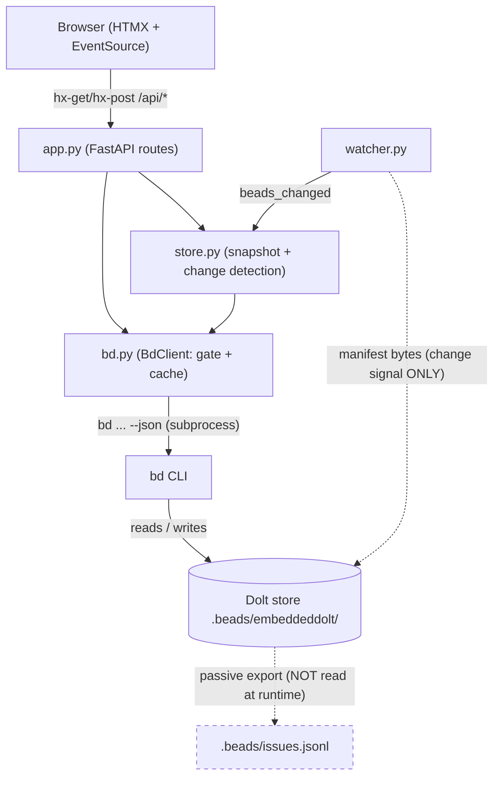
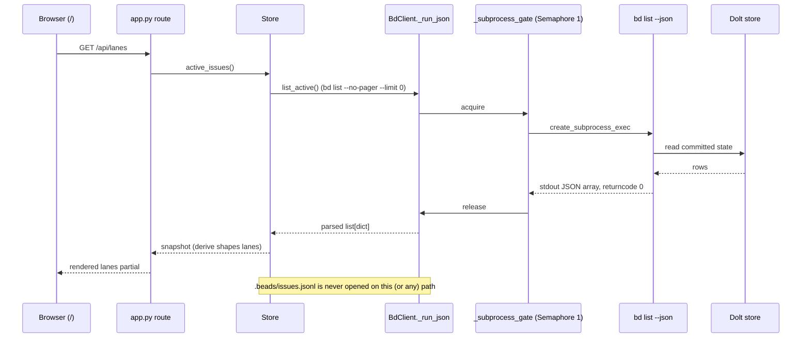

# bd CLI as Source of Truth

## What Is It

bd CLI as Source of Truth is bdboard's founding posture: **the `bd` (beads)
command-line tool over its embedded Dolt database is the one and only runtime
authority for issue data.** bdboard never opens, parses, or mutates the
`.beads/` issue store directly. It shells out — `bd list --json`, `bd show
<id> --long --json`, `bd history <id> --json`, `bd memories --json`,
`bd status --json`, `bd formula list --json` for reads; `bd remember`,
`bd forget`, `bd update`, `bd mol pour` for writes — and treats the JSON on
stdout as gospel.

This makes bdboard a **read-mostly observer**. Every screen, count, lane,
modal and live refresh ultimately resolves to a `bd` subprocess; the dashboard
holds no independent model of the issue graph, owns no parser for Dolt's
on-disk format, and writes to the workspace *only* through sanctioned `bd`
mutation commands. The passive `.beads/issues.jsonl` export is explicitly
**not** consulted at runtime.

## Why This Approach

bd's data lives in an embedded Dolt store under
`.beads/embeddeddolt/<db>/.dolt/` — a content-addressed, git-like, versioned
SQL database. Reaching into it directly would mean reimplementing Dolt's noms
object-store reader, mirroring bd's schema, dependency-resolution, lane and
status logic, and chasing every bd release that changes any of it. The CLI
already encapsulates all of that behind a stable, documented `--json`
contract, so bdboard treats the CLI as its data-access layer:

1. **One schema owner, zero drift.** bd defines what a bead *is* — fields,
   dependency edge semantics, lane bucketing, closed-window math. Consuming
   `bd … --json` means bdboard inherits that definition for free and can never
   disagree with the CLI a human runs in the same workspace.

2. **Dolt is single-writer and lock-prone.** The embedded Dolt server
   serializes writes; firing several `bd` invocations at once contends on its
   lock and can deadlock. Going through one client (`BdClient`) lets bdboard
   funnel every call through a process-wide `asyncio.Semaphore(1)` gate — see
   [Subprocess Serialization & Caching](SubprocessSerializationAndCaching.md) —
   which is only possible *because* the CLI is the sole access path.

3. **The JSONL export is a trap, not a source.** `.beads/issues.jsonl` is a
   secondary, best-effort export that may be absent, stale, or mid-write. It is
   a passive export, not the wire protocol. `BdClient.validate()` deliberately
   does **not** require it; the Dolt-backed CLI is the truth and the JSONL is
   ignored at runtime.

4. **Auditability and single-pane parity.** Writing through `bd update` (with
   `--actor`), `bd remember`, `bd forget` and `bd mol pour` means every bdboard
   mutation lands in the same audit trail, dependency machinery, and atomic
   pour semantics as a hand-run command. A human and the dashboard editing the
   same workspace stay perfectly consistent.

The one deliberate exception proves the rule: the watcher reads a handful of
raw Dolt **manifest** bytes to *detect change*, and the formula layer reads
on-disk `*.formula.json` **template** files to enumerate variables — neither
touches issue data, and both are spelled out in the Conventions below.

## How It Works

bdboard wires the CLI in as a layer and never bypasses it:

- **Configuration.** `cli.py` resolves the workspace (`--dir` → `cwd` → `$PWD`)
  and the bd binary (`--bd`, default `"bd"`), then exports them as
  `BDBOARD_WORKSPACE` / `BDBOARD_BD_BIN`. `app.py` reads those env vars and
  builds a single `BdClient(bd_bin=_BD_BIN, workspace=_WORKSPACE)` for the
  process, wrapped by one `Store(bd)`.
- **Validation.** `BdClient.validate()` requires only a `.beads/` directory and
  a `bd` binary on `PATH` — pointedly **not** `issues.jsonl`.
- **Reads.** `BdClient._run_json()` runs `bd <args> --json` under the gate,
  enforces a timeout, drains pipes on every exit path, and `json.loads()` the
  stdout. The board's `list_active` / `list_closed` feed the `Store` snapshot;
  `show_long` / `history` / `memories` / `status_summary` are TTL-cached detail
  reads.
- **Writes.** `BdClient._run_mutate()` runs a mutation (no `--json`, exit-code
  only), then the method invalidates the relevant caches so the next read
  reflects the write. `pour_formula` is a hybrid: it mutates *and* parses JSON.
- **Change detection without re-reading.** `revision_signature()` reads each
  Dolt db's `.dolt/noms/manifest` (a ~150-byte file whose payload is the
  current root hash) so the [Filesystem Watcher](FilesystemWatcher.md) can tell
  "Dolt actually changed" from "our own read jiggled the files" — and skip a
  redundant `bd list` entirely.

The hard invariant: **data flows one way** — Dolt → `bd … --json` → `BdClient`
→ `Store` / `derive` → Jinja/HTMX templates. Nothing downstream ever reaches
back around the CLI to the store.

### The layering and where truth lives



### A representative read: board first paint



### A concrete example

A maintainer opens a bead modal for `bdboard-mol-q7j.31`:

1. The browser issues `hx-get /api/bead/bdboard-mol-q7j.31`.
2. The route calls `bd.show_long("bdboard-mol-q7j.31")`, which (cache miss)
   runs `bd show bdboard-mol-q7j.31 --long --json` through the gate.
3. bd reads its Dolt store and returns a one-element JSON array; `show_long`
   unwraps it to the bead dict. bdboard parsed *nothing* from `.beads/`
   itself — it only parsed bd's stdout.
4. The maintainer edits the priority. The route calls
   `bd.update_field(..., "--priority", "1", actor)`, which shells
   `bd update bdboard-mol-q7j.31 --priority 1 --actor …` and then invalidates
   the show cache.
5. That `bd update` touches Dolt's `noms/` files; the watcher sees the manifest
   root hash flip, fires `beads_changed`, and the [SSE Event Bus](SseEventBus.md)
   re-fetches every open tab — each re-fetch being, once more, a `bd … --json`
   call. At no point did bdboard write a byte to `.beads/` except through `bd`.

### Key Data Shapes

Every shape bdboard consumes is the *verbatim* JSON `bd … --json` emits. A bead
from `bd list --json` / `bd show --long --json` (real field names):

```json
{
  "id": "bdboard-mol-q7j.31",
  "title": "FlowDoc maintainer: Concept: bd CLI as Source of Truth",
  "status": "in_progress",
  "priority": 2,
  "issue_type": "task",
  "created_at": "2026-06-05T00:00:00Z",
  "updated_at": "2026-06-05T00:00:00Z",
  "closed_at": null,
  "dependencies": [],
  "dependents": []
}
```

`bd memories --json` is a flat `key -> body` object plus a `schema_version`
sentinel that `memories()` strips (a payload of *only* the sentinel means zero
results):

```json
{
  "schema_version": "1",
  "dep-edge-direction": "bd reports 'blocks' on both sides of a blocks edge…",
  "flowdoc-pour-gate": "re-pour spawns a disconnected generation epic…"
}
```

`bd status --json` carries the optional headline KPI sub-object the History
page reads via `status_summary()`:

```json
{
  "summary": {
    "total_issues": 412,
    "closed_issues": 380,
    "in_progress_issues": 4,
    "average_lead_time_hours": 26.5
  }
}
```

`bd mol pour <name> --json` returns the pour result the formula route consumes:

```json
{
  "new_epic_id": "bdboard-mol-abc",
  "id_mapping": { "step-1": "bdboard-mol-abc.1", "step-2": "bdboard-mol-abc.2" },
  "created": 7
}
```

### Command Surface

Every data access maps to exactly one `bd` invocation behind one `BdClient`
method. There is no other door to the store.

| Direction | bd invocation | BdClient symbol | Consumed by |
| --- | --- | --- | --- |
| Read | `bd list --no-pager --limit 0 --json` | `BdClient.list_active` | Board active lanes |
| Read | `bd list --status closed --closed-after <iso> --sort closed --no-pager --limit 0 --json` | `BdClient.list_closed` | Closed lane + CLOSED KPI |
| Read | `bd list --status closed --sort closed --no-pager --limit 0 [--closed-after <iso>] --json` | `BdClient.list_closed_history` | History page |
| Read | `bd show <id> --long --json` | `BdClient.show_long` | Bead detail modal |
| Read | `bd history <id> --json` | `BdClient.history` | Bead audit trail |
| Read | `bd memories [term] --json` | `BdClient.memories` | Memory page / search |
| Read | `bd status --json` | `BdClient.status_summary` | History headline KPI |
| Read | `bd formula list --json` | `BdClient.list_formulas` | Formula picker |
| Read (file) | `*.formula.json` direct read (CLI omits `variables`) | `BdClient.read_formula_variables`, `BdClient.read_formula_detail` | Formula pour form |
| Write | `bd remember "<body>" --key <key>` | `BdClient.remember` | Memory curation |
| Write | `bd forget <key>` | `BdClient.forget` | Memory deletion |
| Write | `bd update <id> <flag> <value> [--actor …]` | `BdClient.update_field` | Manual field editing |
| Write | `bd update <id> --title <title>` | `BdClient.rename_bead` | Pour epic rename |
| Write+Read | `bd mol pour <name> --var k=v … --json` | `BdClient.pour_formula` | Formula pour |
| Signal | `.dolt/noms/manifest` byte read (change detection only) | `BdClient.revision_signature`, `BdClient.watch_signature` | Watcher skip / restart |

### Implementation Map

| Responsibility | File path | Symbol |
| --- | --- | --- |
| Async wrapper that *is* the data-access layer | `src/bdboard/bd.py` | `BdClient` |
| Resolve workspace + bd binary, export to env | `src/bdboard/cli.py` | `_run`, `_resolve_workspace` |
| Build the one process-wide client + store | `src/bdboard/app.py` | `bd = BdClient(...)`, `store = Store(bd)` |
| Workspace check (needs `.beads/` + bd, NOT jsonl) | `src/bdboard/bd.py` | `BdClient.validate` |
| Lazy workspace validation for the routes | `src/bdboard/app.py` | `_validate_or_warn` |
| Run `bd … --json`, gate + timeout + fd-safe drain + parse | `src/bdboard/bd.py` | `BdClient._run_json` |
| Run a mutation (exit-only), fd-safe | `src/bdboard/bd.py` | `BdClient._run_mutate` |
| Process-wide single-writer gate | `src/bdboard/bd.py` | `BdClient._subprocess_gate` |
| Active issue read | `src/bdboard/bd.py` | `BdClient.list_active` |
| Board closed-window read | `src/bdboard/bd.py` | `BdClient.list_closed` |
| History closed read (count-uncapped) | `src/bdboard/bd.py` | `BdClient.list_closed_history` |
| Bead detail / audit / memories / status reads | `src/bdboard/bd.py` | `BdClient.show_long`, `BdClient.history`, `BdClient.memories`, `BdClient.status_summary` |
| Memory / field / pour / rename writes | `src/bdboard/bd.py` | `BdClient.remember`, `BdClient.forget`, `BdClient.update_field`, `BdClient.pour_formula`, `BdClient.rename_bead` |
| Formula template file reads (CLI gap) | `src/bdboard/bd.py` | `BdClient.read_formula_variables`, `BdClient.read_formula_detail`, `BdClient._load_formula_json` |
| Dolt manifest change-signal reads | `src/bdboard/bd.py` | `BdClient.revision_signature`, `BdClient.watch_signature`, `BdClient.watch_targets` |
| Snapshot cache layered over the CLI reads | `src/bdboard/store.py` | `Store` |
| Post-watcher cache invalidation hook | `src/bdboard/store.py` | `Store.refresh` (calls `bd.invalidate_caches`) |

### Configuration

| Key | Default | Effect |
| --- | --- | --- |
| `BDBOARD_BD_BIN` (env, set by `cli.py` `--bd`) | `"bd"` | Path to the bd binary every subprocess invokes. Override to pin a specific build. |
| `BDBOARD_WORKSPACE` (env, set by `cli.py` `--dir`) | `cwd` → `$PWD` | The directory containing `.beads/` that bd runs against (`cwd=` of every subprocess). |
| `BDBOARD_ACTOR` (env) | `None` | Forwarded as `--actor` on `update_field` so manual edits attribute to a human, distinct from any agent writing the same workspace. When unset bd falls back to `$BEADS_ACTOR` / git `user.name` / `$USER`. |
| `LIST_TIMEOUT_S` (`src/bdboard/bd.py`) | `15.0` s | Timeout for the `bd list` reads — generous for large workspaces. |
| `SHOW_TIMEOUT_S` / `HISTORY_TIMEOUT_S` / `MEMORIES_TIMEOUT_S` / `STATUS_TIMEOUT_S` (`src/bdboard/bd.py`) | `8.0` s | Per-command timeouts for the cached detail reads. |
| `UPDATE_TIMEOUT_S` / `REMEMBER_TIMEOUT_S` / `FORGET_TIMEOUT_S` (`src/bdboard/bd.py`) | `10.0` s | Timeouts for the write commands (a Dolt commit is slower than a read). |
| `POUR_TIMEOUT_S` (`src/bdboard/bd.py`) | `30.0` s | Timeout for `bd mol pour` — it cooks the formula inline and materializes a whole bead tree. |

## Where Used

Because this concept *is* the data layer, every feature, flow, endpoint and
view depends on it. The most direct consumers:

- **Live Board** ([Features index](../Features/index.md)) — `list_active` +
  `list_closed` are the entire board snapshot.
- **Bead Detail Modal** ([Features index](../Features/index.md)) — `show_long`
  + `history`.
- **Manual Field Editing** ([Features index](../Features/index.md)) —
  `update_field`, the canonical sanctioned write.
- **Memory Curation** ([Features index](../Features/index.md)) — `memories`
  read plus `remember` / `forget` writes.
- **Formula Pour** ([Features index](../Features/index.md)) — `list_formulas`,
  the `*.formula.json` template reads, and the hybrid `pour_formula` +
  `rename_bead`.
- **History & Analytics** ([Features index](../Features/index.md)) —
  `status_summary` + `list_closed_history`.
- **Board First Paint / Field Edit Write Path / Formula Pour Pipeline**
  ([Flows index](../Flows/index.md)) — the end-to-end journeys built on these
  reads and writes.
- **GET /api/lanes, GET /api/bead/{id}, GET/POST /api/memory, POST
  /api/bead/{id}/field, POST /api/formulas/{name}/pour**
  ([Endpoints index](../Endpoints/index.md)) — each a thin shell over one
  `BdClient` method.
- **Board / History / Memory views** ([Views index](../Views/index.md)) — every
  page hydrates exclusively from the CLI-backed `/api/*` surface.
- **Subprocess Serialization & Caching**
  ([Subprocess Serialization & Caching](SubprocessSerializationAndCaching.md)) —
  the gate + cache discipline that makes "CLI is the only door" performant and
  deadlock-free.
- **Store Snapshot & Change Detection**
  ([Store Snapshot & Change Detection](StoreSnapshotChangeDetection.md)) — caches
  the output of `bd list --json`; never reads `.beads/` files directly.
- **Filesystem Watcher** ([Filesystem Watcher](FilesystemWatcher.md)) — the
  manifest-byte reads that detect change without re-reading issue data.

## Conventions

> [!IMPORTANT]
> - **The CLI is the only door to issue data.** Read with `bd … --json` and
>   `json.loads` the stdout; write with a `bd` mutation command. Never open,
>   parse, or write `.beads/` issue files directly.
> - **Never read `.beads/issues.jsonl` at runtime.** It is a passive export
>   that can be absent or stale. `validate()` does not require it; the
>   Dolt-backed CLI is the truth.
> - **Always run with `cwd=self.workspace`.** bd is workspace-relative; every
>   subprocess sets `cwd=` to the resolved workspace so the right `.beads/` is
>   used.
> - **Route all calls through the single `BdClient` + its gate.** One client
>   per process, one `Semaphore(1)`. Dolt is single-writer — serialize first,
>   optimize with caching second.
> - **Write through `bd update`/`remember`/`forget`/`mol pour`, with
>   `--actor` for human edits.** This keeps bdboard's mutations in the same
>   audit trail and atomic semantics as a hand-run command.
> - **The two file-read exceptions are change-signal and template only.**
>   `revision_signature()` reads Dolt's `manifest` bytes purely to detect
>   change; `read_formula_variables()` reads `*.formula.json` because the CLI
>   omits `variables` from `formula show --json` (and `formula list`'s `vars`
>   count is always 0). Neither reads issue data — if a future bd release
>   exposes variables, switch back to the CLI and drop the file read.

## Anti-Patterns

> [!CAUTION]
> - **Don't read or parse the Dolt store directly.** Reimplementing the noms
>   object store / bd schema guarantees drift from the CLI a human runs, and
>   breaks on every bd release.
> - **Don't treat `issues.jsonl` as authoritative.** It may not exist, may be
>   stale, or may be mid-write; deriving any displayed state from it will
>   silently disagree with bd.
> - **Don't write to `.beads/` outside a `bd` command.** A direct write skips
>   bd's dependency machinery and audit trail, corrupts Dolt's versioned state,
>   and races the embedded single-writer server.
> - **Don't construct a second `BdClient` or bypass the gate.** Parallel `bd`
>   processes contend on Dolt's lock and can deadlock the board — the exact
>   failure the single gated client exists to prevent.
> - **Don't trust `--dry-run` or the formula `vars` count.** `bd create
>   --graph --dry-run` is silently ignored (per project memory) and `formula
>   list --json`'s `vars` is always `0`; read the template file for variables
>   and validate plans by hand.
> - **Don't use the manifest-byte read as a data source.** It carries only the
>   root hash for change detection; issue *content* must still come from
>   `bd … --json`.

## Related

- [Concepts index](index.md) — the other cross-cutting concepts.
- [Subprocess Serialization & Caching](SubprocessSerializationAndCaching.md) —
  the gate + TTL cache + in-flight dedup that make the CLI-only posture fast
  and deadlock-free.
- [Store Snapshot & Change Detection](StoreSnapshotChangeDetection.md) — the
  snapshot lifecycle layered over `bd list --json`.
- [Filesystem Watcher](FilesystemWatcher.md) — the dolt-native source the
  watcher observes (via manifest bytes) rather than owns.
- [SSE Event Bus](SseEventBus.md) — the fan-out a real change drives once the
  caches are invalidated.
- [Features index](../Features/index.md) — Live Board, Bead Detail Modal,
  Manual Field Editing, Memory Curation, Formula Pour, History & Analytics.
- [Flows index](../Flows/index.md) — Board First Paint, Field Edit Write Path,
  Formula Pour Pipeline.
- [Endpoints index](../Endpoints/index.md) — GET /api/lanes, GET /api/bead/{id},
  GET/POST /api/memory, POST /api/bead/{id}/field, POST /api/formulas/{name}/pour.
- [Views index](../Views/index.md) — Board, History, Memory.
- [Memory (/memory)](../Views/MemoryView.md) — the page that shells
  `bd memories`/`remember`/`forget` through this CLI-only posture.
- [Architecture](../Architecture.md) — the system overview this posture anchors.
- [Back to docs index](../index.md)
