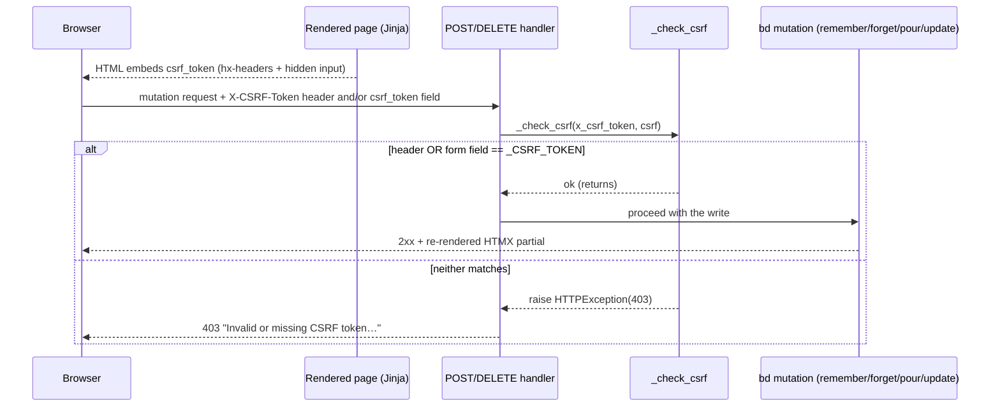
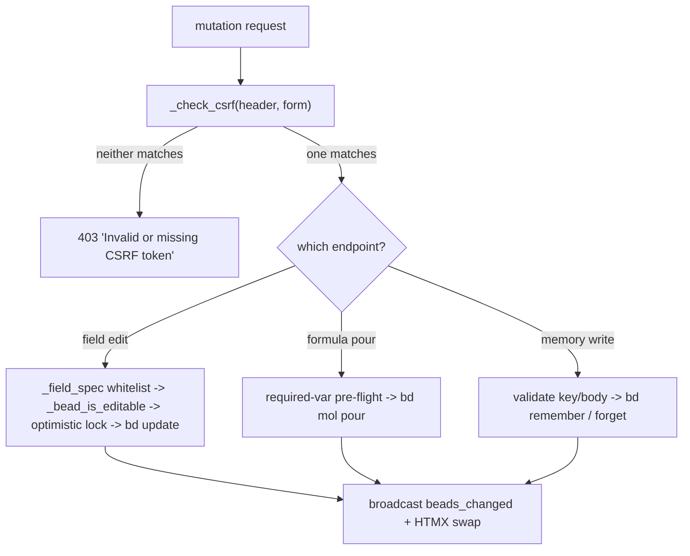

# CSRF Protection

## What Is It

CSRF Protection is the **single guard that fronts every state-changing request
in bdboard** — the first line executed inside each `POST`/`DELETE` handler,
before any business logic runs. It is a per-process secret token
(`_CSRF_TOKEN` in `src/bdboard/app.py`) minted once at startup with
`secrets.token_urlsafe(32)`, injected into every rendered page via the Jinja
global `csrf_token`, and re-presented by the browser on each mutation — either
as the `X-CSRF-Token` request header (the HTMX path) or as a `csrf_token` form
field (the no-JS fallback). The shared helper `_check_csrf(csrf_header,
csrf_form)` accepts the request iff **at least one** of the two matches the
process token, and otherwise raises `HTTPException(status_code=403)`. Reads
(`GET`) are never gated; writes always are.

## Why This Approach

bdboard is a deliberately **read-mostly observer** of the `bd`/Dolt source of
truth that nonetheless exposes a handful of write paths (memory curation,
formula pours, manual field edits). Those writes shell out to `bd ... ` mutation
commands, so a forged cross-origin request that reached a handler could
`bd remember`, `bd forget`, `bd update`, or pour a whole formula on the user's
behalf. A per-process token solves that for this exact threat model with the
least possible machinery:

1. **The threat is cross-origin form submission, not session hijacking.**
   bdboard has **no cookie auth and no session** — it is a single-user
   localhost dashboard. A malicious page in another tab can `POST` to
   `http://localhost:<port>/api/...`, but it **cannot read** bdboard's HTML
   (same-origin policy), so it cannot learn the embedded token. Requiring the
   token on every write is therefore sufficient to defeat blind cross-origin
   submits.
2. **No DB, no expiry, no rotation logic.** Because the token lives only for the
   process lifetime, there is nothing to persist, invalidate, or schedule. A
   server restart mints a fresh token; any stale page simply gets a friendly
   403 telling the user to refresh. Simplicity beats a session store that this
   app would otherwise never need (YAGNI).
3. **One helper, one wire contract.** `_check_csrf` is the *only* validator and
   every write path calls it identically, so the four mutation endpoints can
   never drift in how they accept the token. The two acceptable carriers
   (header OR form field) cover both HTMX (`hx-headers`) and a degraded
   no-JavaScript form post from the same source of truth.

## How It Works

The token is generated **once** at module import and published to templates:

```python
_CSRF_TOKEN = secrets.token_urlsafe(32)
TEMPLATES.env.globals["csrf_token"] = _CSRF_TOKEN
```

Every mutation form in the templates carries the token twice — once as an HTMX
header and once as a hidden input — so the request succeeds whether or not
JavaScript ran. The shared Jinja macro `field_form` (in
`partials/field_row.html`) pins that pairing so the two field-write forms
(edit + add-note) can never disagree:

```html
<form hx-post="/api/bead/{{ bead_id }}/field"
      hx-headers='{"X-CSRF-Token": "{{ csrf_token }}"}'>
  <input type="hidden" name="csrf_token" value="{{ csrf_token }}" />
  ...
</form>
```

The validator is a small, symmetric check — accept if **either** carrier
matches, else reject:

```python
def _check_csrf(csrf_header=None, csrf_form=None):
    if csrf_header == _CSRF_TOKEN or csrf_form == _CSRF_TOKEN:
        return
    raise HTTPException(
        status_code=403,
        detail="Invalid or missing CSRF token. Please refresh the page and try again.",
    )
```

### The wire contract

Each protected handler binds the two carriers from the request with FastAPI
parameter injection — `Form(None, alias="csrf_token")` for the body field and
`Header(None)` for the header (`X-CSRF-Token` → `x_csrf_token`) — then calls the
helper first thing. A representative protected `POST` body looks like:

```json
{
  "csrf_token": "Xb3...32-byte-url-safe-token",
  "field": "title",
  "value": "New title",
  "expected_updated_at": "2026-06-05T12:00:00Z"
}
```

…and/or the equivalent header `X-CSRF-Token: Xb3...`. Only the `csrf_token` /
`X-CSRF-Token` pair is the concern of this concept; the other fields belong to
each endpoint's own contract.

### Carrier-acceptance matrix

| Header `X-CSRF-Token` | Form `csrf_token` | Result | Why |
| --- | --- | --- | --- |
| matches `_CSRF_TOKEN` | anything | **accept** | header is enough |
| anything | matches `_CSRF_TOKEN` | **accept** | form field is enough (no-JS path) |
| `None` / wrong | `None` / wrong | **403** | neither carrier proves same-origin |

### Protected write paths

| Method | Path | Handler | Carriers checked |
| --- | --- | --- | --- |
| `POST` | `/api/memory` | `api_memory_create` | `x_csrf_token`, `csrf` (form) |
| `DELETE` | `/api/memory/{key}` | `api_memory_delete` | `x_csrf_token` only (no body) |
| `POST` | `/api/formulas/{name}/pour` | `api_formula_pour` | `x_csrf_token`, `csrf` (form) |
| `POST` | `/api/bead/{bead_id}/field` | `api_bead_field_update` | `x_csrf_token`, `csrf` (form) |

> [!NOTE]
> The delete path calls `_check_csrf(x_csrf_token, None)` — a `DELETE` request
> has no form body, so the only carrier is the header injected by
> `hx-headers` on the "Yes, Forget It" button in `memory.html`. The other three
> write paths pass both carriers.



### Where the guard sits in a full write

CSRF is always the **outermost** gate; per-endpoint checks (registry whitelist,
status gate, optimistic lock, formula pre-flight) only run after it passes:



### A concrete example

A user clicks **save** on an inline priority edit in the bead modal:

1. The modal row was rendered through the `field_form` macro, so the `<form>`
   carries `hx-headers='{"X-CSRF-Token": "<token>"}'` **and** a hidden
   `<input name="csrf_token" value="<token>">`. Both hold the same per-process
   token published via `TEMPLATES.env.globals["csrf_token"]`.
2. HTMX `POST`s to `/api/bead/{id}/field`. FastAPI binds the header into
   `x_csrf_token` and the form field into `csrf` (alias `csrf_token`).
3. `api_bead_field_update` runs `_check_csrf(x_csrf_token, csrf)` **before**
   touching the registry. The header matches `_CSRF_TOKEN`, so the helper
   returns and the registry whitelist + status gate + optimistic-lock checks
   proceed.
4. Had the user left the page open across a server restart, the embedded token
   would no longer match the freshly-minted `_CSRF_TOKEN`; `_check_csrf` raises
   403 with *"Invalid or missing CSRF token. Please refresh the page and try
   again."* and no `bd update` ever runs.

Contrast the **forget** path: the confirm button issues an `hx-delete` with only
the `hx-headers` carrier (a `DELETE` has no body), so `api_memory_delete` calls
`_check_csrf(x_csrf_token, None)` and relies solely on the header.

### Implementation Map

| Responsibility | File path | Symbol |
| --- | --- | --- |
| Per-process token (single source of truth) | `src/bdboard/app.py` | `_CSRF_TOKEN` |
| Publish token to all templates | `src/bdboard/app.py` | `TEMPLATES.env.globals["csrf_token"]` |
| The one validator (header OR form) | `src/bdboard/app.py` | `_check_csrf` |
| Memory create guard | `src/bdboard/app.py` | `api_memory_create` |
| Memory delete guard (header-only) | `src/bdboard/app.py` | `api_memory_delete` |
| Formula pour guard | `src/bdboard/app.py` | `api_formula_pour` |
| Field edit guard | `src/bdboard/app.py` | `api_bead_field_update` |
| Shared field-form CSRF wiring (DRY) | `src/bdboard/templates/partials/field_row.html` | `field_form` macro |
| Memory form/delete CSRF wiring | `src/bdboard/templates/memory.html` | (hidden input + `hx-headers`) |
| Formula form CSRF wiring | `src/bdboard/templates/partials/formula_form.html` | (hidden input + `hx-headers`) |
| Memory-write CSRF regression coverage | `tests/test_memory_mutations.py` | `test_create_memory_requires_csrf_token`, `test_create_memory_accepts_valid_csrf_header`, `test_create_memory_accepts_valid_csrf_form_field`, `test_delete_memory_requires_csrf_token` |
| Formula-pour CSRF regression coverage | `tests/test_formula_pour.py` | `test_pour_requires_csrf` |

## Where Used

- **Memory Curation** ([Features index](../Features/index.md)) — the first
  feature to introduce writes; both `bd remember` and `bd forget` go through
  `_check_csrf`.
- **Formula Pour** ([Features index](../Features/index.md)) — the pour endpoint
  guards with the same posture before any `bd mol pour`.
- **Manual Field Editing** ([Features index](../Features/index.md)) — every
  field write is CSRF-checked before the registry whitelist runs.
- **Field Edit Write Path** ([Flows index](../Flows/index.md)) — the flow whose
  very first step is the CSRF guard.
- **Formula Pour Pipeline** ([Flows index](../Flows/index.md)) — the pour flow
  fronted by the same check.
- **POST /api/bead/{id}/field** ([Endpoints index](../Endpoints/index.md)),
  **POST /api/memory** / **DELETE /api/memory/{key}**
  ([Endpoints index](../Endpoints/index.md)),
  **POST /api/formulas/{name}/pour** ([Endpoints index](../Endpoints/index.md))
  — the four endpoints that call `_check_csrf`.
- **Field Editability Registry** ([Field Editability Registry](FieldEditabilityRegistry.md))
  — the field-write guard that runs immediately *after* this CSRF check passes.

## Conventions

> [!IMPORTANT]
> - **Guard every write; never guard a read.** Every `POST`/`DELETE` handler
>   calls `_check_csrf` as its first line; `GET` endpoints are never gated.
> - **`_check_csrf` is the ONLY validator.** Never inline a token comparison in
>   a handler — call the shared helper so all write paths accept the token
>   identically.
> - **Accept the token via header OR form field.** HTMX sends `X-CSRF-Token`
>   via `hx-headers`; the hidden `csrf_token` input is the no-JS fallback. Keep
>   both carriers so a degraded form post still works.
> - **Templates inject the token from the Jinja global.** Always render
>   `{{ csrf_token }}` (from `TEMPLATES.env.globals`) — never hard-code or
>   recompute a token in a template.
> - **Use the `field_form` macro for field writes.** It pins the
>   `hx-headers` + hidden-input pairing in one place so the edit and add-note
>   forms can't drift.

## Anti-Patterns

> [!CAUTION]
> - **Don't add a write path without `_check_csrf`.** A new `POST`/`DELETE`
>   handler that skips the guard reopens the cross-origin write hole for the
>   single endpoint that forgot it.
> - **Don't rely on cookies or sessions.** bdboard has none by design; the
>   token's secrecy comes from same-origin read protection, not from a session.
>   Don't bolt on a session store this app doesn't need.
> - **Don't move the CSRF check after business logic.** It must be the
>   outermost gate — running registry/status/optimistic-lock checks (or worse, a
>   `bd` mutation) before validating the token defeats the purpose.
> - **Don't echo the token into logs or error bodies.** The 403 detail is a
>   generic "refresh the page" message on purpose; leaking the token would hand
>   it to exactly the cross-origin caller it's meant to stop.
> - **Don't assume the token survives a restart.** It is per-process; a stale
>   page legitimately gets a 403. Surface the friendly refresh message rather
>   than "fixing" it by persisting or weakening the token.

## Related

- [Concepts index](index.md) — the other cross-cutting concepts.
- [Field Editability Registry](FieldEditabilityRegistry.md) — the write-path
  guard that runs immediately after this CSRF check.
- [SSE Event Bus](SseEventBus.md) — the broadcast each guarded write path fires
  (`bus.broadcast("beads_changed")`) once this CSRF check passes.
- [Features index](../Features/index.md) — Memory Curation, Formula Pour,
  Manual Field Editing.
- [Flows index](../Flows/index.md) — Field Edit Write Path, Formula Pour
  Pipeline.
- [Endpoints index](../Endpoints/index.md) — POST /api/memory, DELETE
  /api/memory/{key}, POST /api/formulas/{name}/pour, POST /api/bead/{id}/field.
- [Back to docs index](../index.md)
