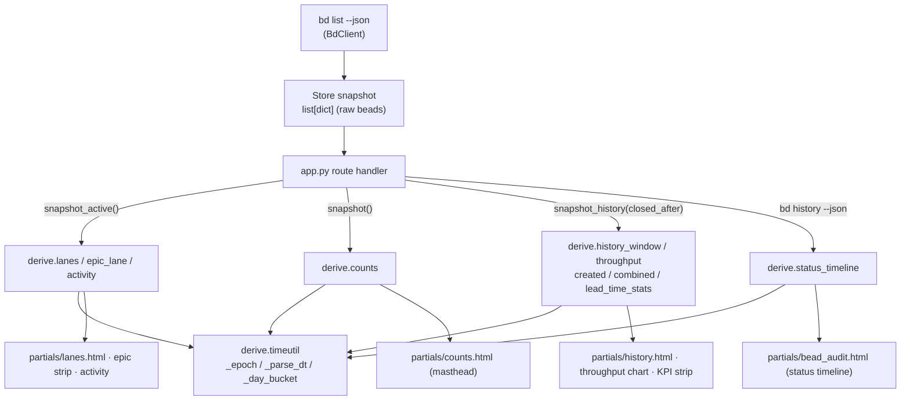

# Derive Layer (pure view shaping)

## What Is It

The **derive layer** is the package
[`src/bdboard/derive/`](../../src/bdboard/derive/): a set of **pure functions**
that turn a raw bead snapshot — the plain `list[dict]` that
[`bd list --json`](BdCliSourceOfTruth.md) returns, cached by
[`Store`](StoreSnapshotCache.md) — into the exact view-shaped data the board,
history, and modal templates render. It is the *V-shaping* tier between "what
`bd` stores" and "what the page shows":

- **swim lanes** — bucket non-epic beads into Deferred / Ready / In-Progress /
  Blocked / Closed and sort each bucket
  ([`derive/lanes.py`](../../src/bdboard/derive/lanes.py) `lanes`).
- **the epic strip** — topologically order active epics left-to-right and tag
  each with a status badge (`epic_lane`).
- **masthead counts** and the synthetic **activity feed** (`counts`,
  `activity`).
- **history derivations** — window/paginate closed beads, build the
  created-vs-closed daily series, and compute lead/cycle-time KPIs
  ([`derive/history.py`](../../src/bdboard/derive/history.py) `history_window`,
  `throughput`, `created`, `combined`, `lead_time_stats`, `status_timeline`).
- **time helpers** — ISO parsing and humanization shared by both
  ([`derive/timeutil.py`](../../src/bdboard/derive/timeutil.py) `_parse_dt`,
  `_epoch`, `_day_bucket`, `humanize_ts`, `humanize_hours`).

Every function takes data in and returns data out. There is **no I/O** — no
`bd` subprocess, no file read, no cache, no `datetime.now()` that can't be
injected for tests. The single invariant of the whole layer is: *given the same
snapshot, you get the same view, every time.*

## Why This Approach

A `bd`-backed dashboard has two very different concerns tangled together if you
let them be: **fetching/caching** bead data (slow, stateful, subprocess-bound)
and **shaping** it into lanes/charts/KPIs (fast, stateless, rule-heavy). Mixing
them produces handlers that are impossible to test without a live workspace and
impossible to reason about when a lane sorts "wrong."

Splitting the shaping rules into a layer of pure functions buys:

- **Trivial testability.** Lane assignment, topo ordering, percentile math, and
  window bounds are exercised with hand-built dict literals and an injected
  `now=` — no FastAPI, no `bd`, no `.beads/` workspace. See
  [`tests/test_derive_epics.py`](../../tests/test_derive_epics.py),
  [`tests/test_derive_counts.py`](../../tests/test_derive_counts.py),
  [`tests/test_derive_history.py`](../../tests/test_derive_history.py).
- **One rule, one place (DRY).** The "what counts as closed" rule
  (`CLOSED_STATUSES`), the History window resolver (`_resolve_bounds`), the
  per-day tally (`_bucket_by_day`), the gap-fill (`_fill_daily_series`), and the
  page-size clamp (`clamp_page_size`) each have exactly one definition that the
  route, the bd-query bound, and every chart series all share — so the
  server-side fetch filter and the in-memory slice can never disagree.
- **Determinism.** No hidden clock or ordering means the same snapshot always
  produces byte-identical markup, which is what lets
  [`Store.refresh()`](StoreSnapshotCache.md) dedup with a plain `==` and the
  [live-refresh pipeline](../Flows/LiveRefreshPipeline.md) broadcast only on
  real change.

> [!NOTE]
> The layer was originally a single `derive.py` module; it was split into the
> `timeutil` / `lanes` / `history` submodules once it crossed the project's
> 600-line guideline. The public import surface is preserved **verbatim** by
> re-exporting every symbol (including the `_`-prefixed test helpers) from
> [`derive/__init__.py`](../../src/bdboard/derive/__init__.py), so
> `from bdboard import derive` and `from bdboard.derive import <name>` keep
> working exactly as before. The split is organizational, not behavioral.

## How It Works

`app.py` route handlers fetch a snapshot from `Store`, then call the relevant
`derive.*` function(s) and hand the result straight to a Jinja partial. The
derive layer itself never touches `Store` or `bd` — the arrow only ever points
*into* it.



### Lane assignment rules

`lanes()` excludes epics (they live in the strip) and `molecule` wrappers (the
redundant formula-pour grouping node), then buckets every remaining bead:

| Lane | Rule | Sort order |
| --- | --- | --- |
| `in_progress` | `status == "in_progress"` | `priority` asc, then `updated_at` desc |
| `blocked` | `status == "blocked"` **OR** (`status == "open"` AND an unmet `blocks`/`blocked-by` dep target is not yet closed) | `priority` asc, then `updated_at` desc |
| `ready` | `status == "open"` AND no unmet blocking dep | `priority` asc, then `updated_at` desc |
| `deferred` | any other open-ish status | `priority` asc, then `updated_at` desc |
| `closed` | `status in {"closed", "resolved", "done"}` (`CLOSED_STATUSES`) | `closed_at` desc (falls back to `updated_at`) |

The closed bucket is **window-bounded at fetch time** by
`BOARD_CLOSED_WINDOW_DAYS` (3) — not capped by a static count here — so the
masthead CLOSED KPI and the Closed-lane count reflect the same date-bounded set
(`bdboard-p8v`). `epic_lane()` runs a stable topological sort
(`_topo_component_order`, a `heapq`-driven Kahn's algorithm with a
`(created_at, id)` tie-break), then promotes the in-progress (or next-ready)
epic to position 0 via `_epic_lane_rank`.

### History windowing

Every history derivation resolves its bounds through the single
`_resolve_bounds(range_key, from_date, to_date, now=)` resolver: an explicit
`from`/`to` custom selection supersedes the `range_key` preset
(`7d`/`30d`/`90d`/`all`), and `resolve_history_bounds` is the public alias the
route uses so the `--closed-after` bd-query bound and the in-memory slice agree
on the exact same `(cutoff, ceiling)` (`bdboard-gp06`). `throughput` and
`created` are `functools.partial` specializations of one
`_daily_count_series` pipeline (window → `_bucket_by_day` →
`_fill_daily_series`), so the two charts stay in lock-step by construction.

### Concrete example — rendering the board's Ready lane

1. A request hits `GET /api/lanes`. The handler calls
   `store.snapshot_active()` → a `list[dict]` of open/in-progress/blocked/
   deferred beads.
2. It calls `derive.lanes(beads)`. For a bead
   `{"id": "bdboard-mol-bfs.23", "issue_type": "task", "status": "open",
   "priority": 2, "deps": []}` with no unmet blocking dep, the function buckets
   it into `ready`.
3. A second bead `{"id": "bdboard-x", "status": "open", "deps":
   [{"type": "blocks", "depends_on_id": "bdboard-y"}]}` whose target
   `bdboard-y` is still open → `_has_unmet_blocking_dep` returns `True` → it
   lands in `blocked` instead, even though its raw status is `open`.
4. Each bucket is sorted `(priority asc, -updated_at)` and the resulting dict
   `{"deferred": [...], "ready": [...], "in_progress": [...], "blocked": [...],
   "closed": [...]}` is passed to `partials/lanes.html`, which iterates the
   buckets into cards. No further `bd` call happens — it was all pure shaping.

### Key data shapes

The derive layer reads a raw bead dict (the relevant fields it keys on) and
emits view-shaped dicts. The fields it actually touches on an input bead:

```json
{
  "id": "bdboard-mol-bfs.23",
  "title": "FlowDoc maintainer: Concept: Derive layer",
  "issue_type": "task",
  "status": "open",
  "priority": 2,
  "assignee": "Aaron Weegens",
  "created_by": "Aaron Weegens",
  "created_at": "2026-06-04T12:00:00Z",
  "updated_at": "2026-06-04T13:00:00Z",
  "started_at": "2026-06-04T12:30:00Z",
  "closed_at": null,
  "deps": [{ "type": "blocks", "depends_on_id": "bdboard-y" }]
}
```

`lanes()` output — the swim-lane buckets dict (keys are the `LANES` tuple):

```json
{
  "deferred": [],
  "ready": [{ "id": "bdboard-mol-bfs.23", "...": "raw bead, unmodified" }],
  "in_progress": [],
  "blocked": [],
  "closed": []
}
```

`epic_lane()` enriches each epic dict with three extra keys:

```json
{
  "id": "bdboard-mol-bfs",
  "status": "in_progress",
  "status_key": "in_progress",
  "status_icon": "▶",
  "status_label": "In Progress"
}
```

`counts()` — fixed-order masthead totals (zero-valued keys kept for layout
stability; `in_progress` intentionally omitted):

```json
{ "open": 12, "blocked": 3, "deferred": 1, "closed": 47 }
```

`activity()` — synthetic one-event-per-bead feed (newest first):

```json
{
  "id": "bdboard-mol-bfs.23",
  "title": "FlowDoc maintainer: Concept: Derive layer",
  "actor": "Aaron Weegens",
  "verb": "in progress",
  "ts": "2026-06-04T13:00:00Z",
  "ts_epoch": 1780923600.0,
  "priority": 2
}
```

`history_window()` — paginated closed-bead page:

```json
{
  "items": [{ "id": "bdboard-old", "...": "raw closed bead" }],
  "page": 1,
  "page_size": 50,
  "total": 137,
  "has_more": true
}
```

`combined()` — created+closed merged daily series; `throughput`/`created`
return the same shape minus the sibling key (`count` instead):

```json
[{ "day": "2026-06-04", "created": 5, "closed": 3 }]
```

`lead_time_stats()` — lead/cycle-time KPIs in hours (or `null` when no data):

```json
{
  "n": 137,
  "median_lead_h": 26.4,
  "p90_lead_h": 91.0,
  "median_cycle_h": 4.2,
  "p90_cycle_h": 18.7,
  "avg_cycle_h": 6.1
}
```

`status_timeline()` — per-bead status stops, oldest→newest, from
`bd history <id> --json`:

```json
[
  { "status": "open", "when": "2026-06-04T12:00:00Z", "who": "Aaron Weegens", "commit": "4272e1f0", "dwell_h": 0.5 },
  { "status": "in_progress", "when": "2026-06-04T12:30:00Z", "who": "Aaron Weegens", "commit": "a1b2c3d4", "dwell_h": null }
]
```

### Implementation map

| Responsibility | File path | Symbol |
| --- | --- | --- |
| Re-export the whole public + test-helper surface (preserve import contract) | `src/bdboard/derive/__init__.py` | `__all__` |
| Bucket non-epic/non-molecule beads into swim lanes + sort | `src/bdboard/derive/lanes.py` | `lanes` |
| Topo-order active epics + promote anchor + status badges | `src/bdboard/derive/lanes.py` | `epic_lane` |
| Stable per-component topo sort (Kahn's algorithm, heapq) | `src/bdboard/derive/lanes.py` | `_topo_component_order` |
| "Closed" status rule (single source) | `src/bdboard/derive/lanes.py` | `CLOSED_STATUSES`, `_is_closed` |
| Functional-block detection via deps | `src/bdboard/derive/lanes.py` | `_has_unmet_blocking_dep` |
| Normalize dep field-name variants (`deps`/`dependencies`, `type`/`dependency_type`, `depends_on_id`/`target`/`id`/`dependsOnId`) | `src/bdboard/derive/lanes.py` | `get_dependency_list`, `get_dependency_type`, `get_dependency_target_id` |
| Masthead counts (fixed order, zero-filled) | `src/bdboard/derive/lanes.py` | `counts` |
| Synthetic activity feed | `src/bdboard/derive/lanes.py` | `activity` |
| Board closed-window cap (fetch-time bound) | `src/bdboard/derive/lanes.py` | `BOARD_CLOSED_WINDOW_DAYS` |
| Single window-bounds resolver (custom supersedes preset) | `src/bdboard/derive/history.py` | `_resolve_bounds`, `resolve_history_bounds` |
| Range presets + default | `src/bdboard/derive/history.py` | `HISTORY_RANGES`, `DEFAULT_HISTORY_RANGE` |
| Page-size clamp (single source of truth) | `src/bdboard/derive/history.py` | `clamp_page_size`, `HISTORY_PAGE_SIZES` |
| Paginated closed-bead slice | `src/bdboard/derive/history.py` | `history_window` |
| Shared per-day-count pipeline + partials | `src/bdboard/derive/history.py` | `_daily_count_series`, `throughput`, `created` |
| Per-day bucket + gap-free fill | `src/bdboard/derive/history.py` | `_bucket_by_day`, `_fill_daily_series`, `_iter_day_span` |
| Merged created+closed series | `src/bdboard/derive/history.py` | `combined` |
| Lead/cycle-time KPIs + percentile | `src/bdboard/derive/history.py` | `lead_time_stats`, `_percentile` |
| Status-transition timeline from `bd history` | `src/bdboard/derive/history.py` | `status_timeline` |
| ISO parsing / epoch / day-bucket helpers | `src/bdboard/derive/timeutil.py` | `_parse_dt`, `_epoch`, `_day_bucket` |
| Human-readable timestamp/duration filters (registered on Jinja env) | `src/bdboard/derive/timeutil.py` | `humanize_ts`, `humanize_hours` |

### Edge & failure handling

| Trigger | Behavior | Result |
| --- | --- | --- |
| Bead `status == "open"` with an unmet `blocks` dep | `_has_unmet_blocking_dep` → effective status `blocked` | Card shows in the Blocked lane / epic carries a blocked badge despite raw `open` |
| Dep target id unknown in `by_id` | Treated as unmet (conservative) | Bead is shown blocked rather than falsely ready |
| Dependency cycle among active epics | `_topo_component_order` appends leftovers by `(created_at, id)` | Rendering stays deterministic; no crash, no dropped epic |
| Missing/unparseable timestamp | `_parse_dt`/`_epoch`/`_day_bucket` return `None`/`0.0` | Bead is skipped from timelines / sorted to the end, never raises |
| `range_key` empty or bogus | `_range_to_cutoff` falls back to `DEFAULT_HISTORY_RANGE` | Bad query param degrades to the 30d window instead of erroring |
| `from` after `to` in a custom range | `custom_bounds` swaps the pair | Window stays meaningful rather than collapsing to empty |
| Out-of-range `page` requested | `history_window` returns empty `items`, `has_more=False` | Pagination past the end renders an empty page cleanly |
| Negative/zero durations (clock skew) in KPIs | Dropped before percentile math | Lead/cycle stats stay sane; metrics with no data return `null` |

## Where Used

- **Features:**
  [SwimLaneBoard](../Features/SwimLaneBoard.md) — `lanes`, `epic_lane`,
  `activity`, and `counts` shape the entire board surface;
  [HistoryAndTrends](../Features/HistoryAndTrends.md) — `history_window`,
  `throughput`, `created`, `combined`, and `lead_time_stats` power the chart,
  KPI strip, and record list;
  [BeadDetailAndInlineEditing](../Features/BeadDetailAndInlineEditing.md) —
  `status_timeline` and `get_dependency_list` enrich the detail modal/audit.
- **Flows:**
  [LiveRefreshPipeline](../Flows/LiveRefreshPipeline.md) — the deterministic
  shaping is re-run on each refresh; identical output is what lets the broadcast
  dedup on real change;
  [FieldEditWritePath](../Flows/FieldEditWritePath.md) — after a `bd update` the
  affected row/lane is re-derived from the fresh snapshot.
- **Endpoints:**
  [LanesApi](../Endpoints/LanesApi.md) — calls `derive.lanes`/`epic_lane`/
  `activity`/`counts`;
  [HistoryApi](../Endpoints/HistoryApi.md) — calls the history derivations and
  `resolve_history_bounds`;
  [BeadDetailApi](../Endpoints/BeadDetailApi.md) — calls `status_timeline` and
  `get_dependency_list`.
- **Views:**
  [BoardPage](../Views/BoardPage.md) — renders the lane/epic/activity/counts
  derivations;
  [HistoryPage](../Views/HistoryPage.md) — renders the history series + KPIs.
- **Related concepts:**
  [StoreSnapshotCache](StoreSnapshotCache.md) — supplies the raw snapshot the
  derive layer consumes and relies on derive's determinism to dedup with `==`;
  [BdCliSourceOfTruth](BdCliSourceOfTruth.md) — defines the raw bead JSON shape
  derive reads (and the field-name variants it normalizes);
  [HtmxPartialsArchitecture](HtmxPartialsArchitecture.md) — the partials that
  render the view dicts derive produces;
  [WatcherScheduling](WatcherScheduling.md) — drives the `Store.refresh()` whose
  output derive re-shapes on every live update.

## Conventions

> [!IMPORTANT]
> **Keep every derive function pure.** No `bd` subprocess, no file/network I/O,
> no `Store` access, no module-level mutable state. Anything time-dependent
> (`now`) must be an injectable parameter so tests can pin it. A snapshot in →
> a view out, deterministically, is the contract the whole layer rests on.

> [!IMPORTANT]
> **One rule, one definition (DRY).** The "closed" rule lives in
> `CLOSED_STATUSES`/`_is_closed`; the History window in `_resolve_bounds`; the
> per-day tally in `_bucket_by_day`; the gap-fill in `_fill_daily_series`; the
> page-size clamp in `clamp_page_size`. Call these — never re-implement them in
> a route or a sibling derive function. `throughput`/`created` are `partial`s of
> one pipeline precisely so they can't drift.

> [!IMPORTANT]
> **Push the route and the bd query through the SAME resolver.** Use
> `resolve_history_bounds(...)` to get `(cutoff, ceiling)` for both the
> `--closed-after` bd-query bound and the in-memory `history_window` slice.
> Sharing the resolver is what guarantees zero off-by-one between the fetch
> filter and the displayed window (`bdboard-gp06`).

> [!IMPORTANT]
> **Read bead fields through the normalizing accessors.** `bd` emits dependency
> data under several field names (`deps`/`dependencies`, `type`/
> `dependency_type`, `depends_on_id`/`target`/`id`/`dependsOnId`). Always go
> through `get_dependency_list` / `get_dependency_type` /
> `get_dependency_target_id` so a schema variant doesn't silently mis-bucket a
> bead.

> [!IMPORTANT]
> **Keep submodules under the 600-line guideline and re-export from
> `__init__`.** New derivations slot into `lanes.py` or `history.py` (or a new
> focused submodule) and must be added to `derive/__init__.py`'s `__all__` so
> the `from bdboard import derive` import contract — including the `_`-prefixed
> helpers the tests import — stays intact.

## Anti-Patterns

> [!CAUTION]
> **Don't fetch or cache inside a derive function.** The moment a shaping
> function calls `bd`, reads a file, or hits `Store`, it stops being testable
> with a dict literal and re-couples fetching to shaping — the exact tangle this
> layer exists to prevent.

> [!CAUTION]
> **Don't call `datetime.now()` directly in a derivation.** Use the injectable
> `now=` parameter. A hard-coded clock makes window/KPI tests flaky and
> non-deterministic, and breaks the "same snapshot → same output" guarantee the
> refresh dedup depends on.

> [!CAUTION]
> **Don't re-derive the "closed" set or the window bounds ad hoc.** Hand-rolling
> `status in (...)` or `now - timedelta(...)` in a route re-introduces the
> off-by-one between the KPI, the lane count, the chart, and the fetch filter
> that `CLOSED_STATUSES` and `_resolve_bounds` were created to eliminate.

> [!CAUTION]
> **Don't read raw `bead["deps"]`/`bead["dependency_type"]` directly.** Bypassing
> the accessors means the first time `bd` emits the field under its alternate
> name, the bead is silently treated as having no dependency and lands in the
> wrong lane.

> [!CAUTION]
> **Don't mutate the input snapshot.** `lanes()` returns raw bead dicts by
> reference and `epic_lane()` builds a `dict(b)` copy before enriching for a
> reason — mutating shared bead dicts would corrupt the `Store` cache and poison
> the next refresh's `==` comparison.

## Related

- [Architecture](../Architecture.md) — system diagram (`derive/ — pure view
  shaping` node) and the directory guide entry this concept expands.
- [Concepts index](index.md) — sibling cross-cutting concepts.
- [Manifest](../_Manifest.md) — catalog of every documented item.
- [StoreSnapshotCache](StoreSnapshotCache.md) — the cache feeding derive its raw
  snapshots.
- [BdCliSourceOfTruth](BdCliSourceOfTruth.md) — the raw bead JSON shape derive
  reads and normalizes.
- [HtmxPartialsArchitecture](HtmxPartialsArchitecture.md) — the partials that
  render derive's view dicts.
- [WatcherScheduling](WatcherScheduling.md) — the refresh loop whose output
  derive re-shapes on every live update.
- [SwimLaneBoard](../Features/SwimLaneBoard.md) — the board feature built on
  `lanes`/`epic_lane`/`activity`/`counts`.
- [HistoryAndTrends](../Features/HistoryAndTrends.md) — the history feature built
  on the `derive.history` derivations.
- [LanesApi](../Endpoints/LanesApi.md) / [HistoryApi](../Endpoints/HistoryApi.md)
  / [BeadDetailApi](../Endpoints/BeadDetailApi.md) — the endpoints that invoke
  these functions.
