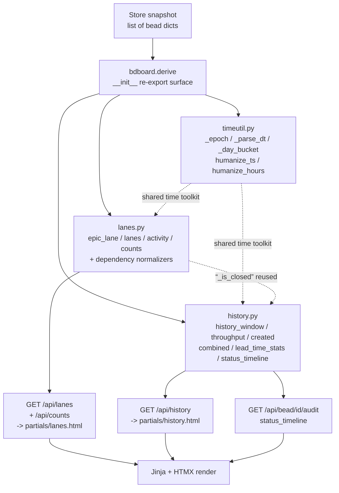

# Derive Layer

## What Is It

The **Derive Layer** is bdboard's pure view-shaping tier — the `bdboard.derive`
package — that turns a raw list of bead dicts (the snapshot the Store caches
from `bd ... --json`) into the exact, UI-ready shapes the routes and Jinja
templates render: the epic strip, the five swim lanes, the masthead counts, the
activity feed, the History page's paginated closed list, its throughput /
created / combined day-series charts, its lead-time KPIs, and the per-bead
status timeline. Every function here takes a snapshot (and a few scalar params)
and **returns data** — no I/O, no subprocess calls, no caching, no `.beads/`
writes. It sits between `store.py` (freshness) and `templates/` (render) in the
layering `cli.py → app.py → store.py → bd.py → derive/ → templates/`.

## Why This Approach

The board, History page, and bead modal each need the *same* bead records
projected into *different* shapes, and they re-render constantly (every SSE
`refresh`, every watcher tick). Three forces shaped the design:

1. **Separation of concerns / testability.** Fetching and freshness are hard,
   stateful, and subprocess-bound (that's `bd.py` + `store.py`). *Shaping* is
   pure arithmetic over dicts. Keeping shaping pure means every derivation is a
   deterministic `input list → output` function that the test suite can hit
   directly with hand-built snapshots — no server, no Dolt, no mocks. The
   package docstring is explicit: "all functions remain pure over the snapshot
   list with no I/O."

2. **DRY single-definition of cross-cutting rules.** What counts as "closed"
   (`CLOSED_STATUSES`), what the board's recent-window is
   (`BOARD_CLOSED_WINDOW_DAYS`), how a History window's bounds resolve
   (`resolve_history_bounds`), how an arbitrary page size is clamped
   (`clamp_page_size`) — each lives in exactly one place here and is imported by
   `app.py` / `bd.py` so the server-side fetch filter and the in-memory slice
   can never disagree (e.g. bdboard-p8v, bdboard-gp06, bdboard-a194).

3. **Determinism for a live surface.** A jittering board is a buggy board. Every
   ordering uses a **stable tie-break** (`_stable_key` = `created_at` asc then
   `id` asc; closed lists add `id` after `closed_at` desc) so identical
   snapshots always produce byte-identical output.

The package was **split** from a single `derive.py` once it crossed the
project's 600-line guideline, into `timeutil` / `lanes` / `history`, while
`__init__.py` re-exports every public symbol (and the underscore helpers the
tests import) so `from bdboard import derive` and `from bdboard.derive import
<name>` keep working verbatim.

## How It Works

The layer is a flat namespace of pure functions grouped into three submodules,
all re-exported from `bdboard/derive/__init__.py`. A route calls one or more
derive functions on the Store snapshot, then hands the shaped result to a
template.



### The three submodules

- **`timeutil.py`** — the shared time toolkit both other submodules lean on,
  kept separate so `lanes` and `history` don't have to import each other.
  `_epoch` parses ISO (optional `Z`) to a float epoch (0.0 on miss);
  `_parse_dt` returns a tz-aware `datetime` (naive assumed UTC); `_day_bucket`
  collapses a timestamp to a **local-calendar-day** `YYYY-MM-DD` key (design
  §D6, so "today" matches the user's wall clock); `humanize_ts` renders
  `'14m ago'` / `'2h ago'` / `'May 19'`; `humanize_hours` renders durations
  (`0.4 → '24m'`, `2.5 → '2.5h'`, `36.0 → '1.5d'`). The last two are wired into
  Jinja as the `humanize_ts` / `humanize_hours` filters.

- **`lanes.py`** — board-facing derivations plus the dependency-field
  normalizers. `epic_lane` sequences the epic strip (its own deep-dive lives in
  [Epic Lane Sequencing](EpicLaneSequencing.md)); `lanes` buckets non-epic,
  non-molecule beads into the five swim lanes; `activity` synthesizes a
  "current-state-as-event" feed; `counts` builds the masthead status tallies.
  It also owns the constants `LANES`, `CLOSED_STATUSES`,
  `BOARD_CLOSED_WINDOW_DAYS`, `_STATUS_META`.

- **`history.py`** — long-window retrospective derivations over the *full*
  closed record. `history_window` paginates the closed list within a resolved
  window; `throughput` / `created` are `functools.partial` specializations of a
  shared `_daily_count_series` pipeline (closed-per-day vs created-per-day);
  `combined` zips both onto one gap-free timeline; `lead_time_stats` computes
  median/p90 lead & cycle times; `status_timeline` collapses a
  `bd history <id>` stream to status-transition stops with dwell times. The
  window-bounds resolver (`resolve_history_bounds` / `_resolve_bounds`) is the
  single source the route reuses to push `--closed-after` down to bd.

### Dependency-field normalization

bd serializes dependency edges under varying field names across versions. The
three normalizers are the **only** sanctioned way to read them, so every caller
survives the variation:

| Helper | Reads (fallback chain) | Returns |
| --- | --- | --- |
| `get_dependency_list(bead)` | `deps` → `dependencies` | `list[dict]` (empty if neither) |
| `get_dependency_type(dep)` | `type` → `dependency_type` | lowercased `str` (`""` if absent) |
| `get_dependency_target_id(dep)` | `depends_on_id` → `target` → `id` → `dependsOnId` | first non-None, else `None` |

### The full derivation surface

| Function | Submodule | Input → Output | Consumed by |
| --- | --- | --- | --- |
| `epic_lane(beads)` | `lanes` | snapshot → ordered, status-enriched epic list | `GET /api/lanes` → `partials/lanes.html` |
| `lanes(beads)` | `lanes` | snapshot → `{deferred, ready, in_progress, blocked, closed}` bucket dict | `GET /api/lanes`, `GET /api/lanes/closed` |
| `activity(beads, limit=25)` | `lanes` | snapshot → newest-first event list | dashboard activity feed |
| `counts(beads)` | `lanes` | snapshot → `{open, blocked, deferred, closed, ...}` | `GET /api/counts` → masthead |
| `history_window(beads, range_key, page, page_size, ...)` | `history` | snapshot → `{items, page, page_size, total, has_more}` | `GET /api/history` |
| `throughput(beads, range_key, ...)` | `history` | snapshot → `[{day, count}, ...]` (closed/day) | History throughput chart |
| `created(beads, range_key, ...)` | `history` | snapshot → `[{day, count}, ...]` (created/day) | History created chart |
| `combined(beads, range_key, ...)` | `history` | snapshot → `[{day, created, closed}, ...]` | History combined chart |
| `lead_time_stats(beads, range_key, ...)` | `history` | snapshot → `{n, median_lead_h, p90_lead_h, median_cycle_h, p90_cycle_h, avg_cycle_h}` | History KPI strip |
| `status_timeline(history)` | `history` | `bd history` payload → ordered status stops | `GET /api/bead/{id}/audit` |
| `clamp_page_size(value)` | `history` | any → member of `{25, 50, 100}` | `GET /api/history` |
| `resolve_history_bounds(range_key, from, to)` | `history` | params → `(cutoff, ceiling)` | route + every history series |
| `custom_bounds(from, to)` | `history` | date strings → `(cutoff, ceiling)` | route precedence display |
| `humanize_ts(ts)` / `humanize_hours(h)` | `timeutil` | scalar → display string | Jinja filters |

### Key data shapes (real fields)

A swim-lane bucket map from `lanes(beads)`:

```json
{
  "deferred": [],
  "ready": [{ "id": "bdboard-mol-q7j", "title": "...", "status": "open", "priority": 2 }],
  "in_progress": [],
  "blocked": [],
  "closed": [{ "id": "bdboard-fjk", "status": "closed", "closed_at": "2026-06-04T14:36:18Z" }]
}
```

An enriched epic from `epic_lane(beads)` (note the *derived* fields appended to
the original bead copy):

```json
{
  "id": "bdboard-mol-q7j",
  "title": "FlowDoc maintainer: discover & scaffold",
  "issue_type": "epic",
  "status": "in_progress",
  "priority": 1,
  "dependencies": [{ "depends_on_id": "bdboard-mol-abc", "dependency_type": "blocks" }],
  "status_key": "in_progress",
  "status_icon": "▶",
  "status_label": "In Progress"
}
```

The paginated window from `history_window(...)`:

```json
{
  "items": [{ "id": "bdboard-a194", "status": "closed", "closed_at": "2026-06-03T23:52:32Z" }],
  "page": 1,
  "page_size": 50,
  "total": 137,
  "has_more": true
}
```

The KPI bundle from `lead_time_stats(...)`:

```json
{
  "n": 42,
  "median_lead_h": 6.5,
  "p90_lead_h": 41.2,
  "median_cycle_h": 2.1,
  "p90_cycle_h": 9.8,
  "avg_cycle_h": 3.4
}
```

A status stop from `status_timeline(history)`:

```json
{ "status": "in_progress", "when": "2026-06-05T09:00:00Z", "who": "Aaron Weegens", "commit": "ce242a87", "dwell_h": 4.5 }
```

### A concrete example

`GET /api/lanes` (`app.py:api_lanes`) calls
`derive.epic_lane(await _hydrate_epic_dependencies(beads))` for the strip and
`derive.lanes(beads)` + `derive.activity(beads)` for the swim lanes and feed —
three pure projections of the **same** snapshot, no extra bd calls for the
non-epic shaping. Meanwhile `GET /api/history` (`app.py:api_history`) resolves
the window once via `derive.resolve_history_bounds(...)`, pushes the `cutoff`
into the bd query as `--closed-after`, then feeds the returned snapshot through
`derive.history_window`, `derive.throughput`, `derive.created`,
`derive.combined`, and `derive.lead_time_stats` — all bounded by that same
resolver so the server fetch filter and every in-memory slice agree with no
off-by-one.

### Implementation Map

| Responsibility | File path | Symbol |
| --- | --- | --- |
| Public re-export surface (`__all__`) | `src/bdboard/derive/__init__.py` | module-level re-exports |
| ISO → epoch float | `src/bdboard/derive/timeutil.py` | `_epoch` |
| ISO → tz-aware datetime | `src/bdboard/derive/timeutil.py` | `_parse_dt` |
| Local-day bucket key | `src/bdboard/derive/timeutil.py` | `_day_bucket` |
| Relative-time / duration strings | `src/bdboard/derive/timeutil.py` | `humanize_ts`, `humanize_hours` |
| Dependency field normalizers | `src/bdboard/derive/lanes.py` | `get_dependency_list`, `get_dependency_type`, `get_dependency_target_id` |
| Epic strip sequencing | `src/bdboard/derive/lanes.py` | `epic_lane` |
| Swim-lane bucketing | `src/bdboard/derive/lanes.py` | `lanes` |
| Activity feed synthesis | `src/bdboard/derive/lanes.py` | `activity` |
| Masthead counts | `src/bdboard/derive/lanes.py` | `counts` |
| Closed-status predicate / set | `src/bdboard/derive/lanes.py` | `_is_closed`, `CLOSED_STATUSES` |
| Board recent-window constant | `src/bdboard/derive/lanes.py` | `BOARD_CLOSED_WINDOW_DAYS` |
| Status icon/label lookup | `src/bdboard/derive/lanes.py` | `_STATUS_META` |
| Window-bounds resolver (one source) | `src/bdboard/derive/history.py` | `resolve_history_bounds`, `_resolve_bounds` |
| Range/custom-date parsing | `src/bdboard/derive/history.py` | `_range_to_cutoff`, `custom_bounds`, `_parse_date` |
| Page-size clamp | `src/bdboard/derive/history.py` | `clamp_page_size` |
| Paginated closed window | `src/bdboard/derive/history.py` | `history_window` |
| Shared per-day-count pipeline | `src/bdboard/derive/history.py` | `_daily_count_series`, `_bucket_by_day`, `_fill_daily_series`, `_iter_day_span` |
| Throughput / created series | `src/bdboard/derive/history.py` | `throughput`, `created` (partials) |
| Combined created+closed series | `src/bdboard/derive/history.py` | `combined` |
| Lead/cycle-time stats | `src/bdboard/derive/history.py` | `lead_time_stats`, `_percentile` |
| Status-transition timeline | `src/bdboard/derive/history.py` | `status_timeline` |
| Board route invoking the layer | `src/bdboard/app.py` | `api_lanes`, `api_counts` |
| History route invoking the layer | `src/bdboard/app.py` | `api_history` |
| Audit route invoking the layer | `src/bdboard/app.py` | `api_bead_audit` |
| Jinja filter registration | `src/bdboard/app.py` | `TEMPLATES.env.filters[...]` |
| `BOARD_CLOSED_WINDOW_DAYS` consumer | `src/bdboard/bd.py` | `Client.list_closed` |
| Regression coverage | `tests/test_derive_epics.py`, `tests/test_derive_history.py` | `test_*` |

## Where Used

- **GET /api/lanes** ([Endpoints index](../Endpoints/index.md)) — calls
  `epic_lane`, `lanes`, `activity` to build the board payload.
- **GET /api/counts** ([GET /api/counts](../Endpoints/GetApiCounts.md)) — calls
  `counts` for the masthead.
- **GET /api/history** ([Endpoints index](../Endpoints/index.md)) — calls
  `resolve_history_bounds`, `history_window`, `throughput`, `created`,
  `combined`, `lead_time_stats`, `clamp_page_size`.
- **GET /api/bead/{id}/audit** ([GET /api/bead/{id}/audit](../Endpoints/GetApiBeadAudit.md)) —
  calls `status_timeline` over the already-fetched history payload.
- **[Board First Paint](../Flows/BoardFirstPaint.md)** — the first paint
  builds the strip and lanes from these derivations.
- **History & Analytics** ([History & Analytics](../Features/HistoryAnalytics.md)) — the
  feature whose charts/KPIs are the `history.py` series.
- **Board (/)** & **History (/history)** ([Views index](../Views/index.md)) —
  the views that render the derived shapes.
- **Epic Lane Sequencing** ([Epic Lane Sequencing](EpicLaneSequencing.md)) —
  the deep-dive on `epic_lane`, the most intricate member of this layer.
- **Store Snapshot & Change Detection**
  ([Store Snapshot & Change Detection](StoreSnapshotChangeDetection.md)) — the upstream tier that supplies the snapshot
  this layer is pure over.

## Conventions

> [!IMPORTANT]
> - **Keep it pure.** Every function takes a snapshot (+ scalars) and returns
>   data. No I/O, no subprocess, no caching, no `.beads/` writes. Freshness is
>   the Store's job; hydration (e.g. epic dependencies) happens *upstream* in
>   `app.py`, not here.
> - **One definition per cross-cutting rule.** Import `CLOSED_STATUSES`,
>   `BOARD_CLOSED_WINDOW_DAYS`, `resolve_history_bounds`, `clamp_page_size`
>   from here — never re-implement them in `app.py` or `bd.py`. Sharing the
>   bounds resolver is what guarantees the bd query filter and the in-memory
>   slice agree.
> - **Read dependency fields only through the normalizers**
>   (`get_dependency_list` / `get_dependency_type` /
>   `get_dependency_target_id`) — never `bead["deps"]` or `dep["depends_on_id"]`
>   directly — so the code survives bd's field-name variations.
> - **Every order must be deterministic.** Use `_stable_key` (`created_at` asc,
>   then `id`); closed lists sort `closed_at` desc then `id`. Identical
>   snapshots must produce identical output to avoid live-render jitter.
> - **Parse all timestamps through `timeutil`.** Don't hand-roll
>   `datetime.fromisoformat`; `_epoch` / `_parse_dt` / `_day_bucket` already
>   handle the trailing-`Z`, naive-as-UTC, and local-day edge cases.
> - **Preserve the re-export surface.** New public helpers must be added to
>   `__init__.__all__` so `from bdboard.derive import <name>` keeps working.

## Anti-Patterns

> [!CAUTION]
> - **Don't do I/O in a derive function.** No `bd` subprocess, no file reads,
>   no network. The moment a derivation reaches outside its arguments it stops
>   being testable as a pure projection and breaks the layering contract.
> - **Don't mutate the input beads.** Enrichment uses `dict(b)` copies on
>   purpose (see `epic_lane`); writing derived fields like `status_key` onto the
>   shared snapshot would corrupt the other derivations reading the same
>   objects.
> - **Don't duplicate the closed/window/page-size rules.** A second definition
>   of "closed" or a re-parsed window in the route is exactly the drift bug
>   (bdboard-p8v / bdboard-a194 / bdboard-gp06) this layer's single-source
>   helpers exist to prevent.
> - **Don't let bad input raise.** Missing/unparseable timestamps must be
>   *skipped* (they can't be placed on a timeline), bad page sizes must
>   *clamp*, and unknown ranges must *fall back* to the default — degrade
>   gracefully rather than 500 a live page.
> - **Don't call `epic_lane` on a raw `bd list` snapshot.** It needs
>   `_hydrate_epic_dependencies` to have run first or there are no edges to
>   sequence on (see [Epic Lane Sequencing](EpicLaneSequencing.md)).

## Related

- [Epic Lane Sequencing](EpicLaneSequencing.md) — deep-dive on `epic_lane`.
- [Store Snapshot & Change Detection](StoreSnapshotChangeDetection.md) — the snapshot source this
  layer is pure over.
- [Concepts index](index.md) — the other cross-cutting concepts.
- [Endpoints index](../Endpoints/index.md) — the routes that call this layer.
- [Board First Paint](../Flows/BoardFirstPaint.md) — the flow that calls
  `epic_lane`, `lanes`, `activity`, and `counts` during initial page load.
- [Features index](../Features/index.md) — [History & Analytics](../Features/HistoryAnalytics.md), Live Board.
- [Views index](../Views/index.md) — Board (/) and History (/history).
- [Back to docs index](../index.md)
