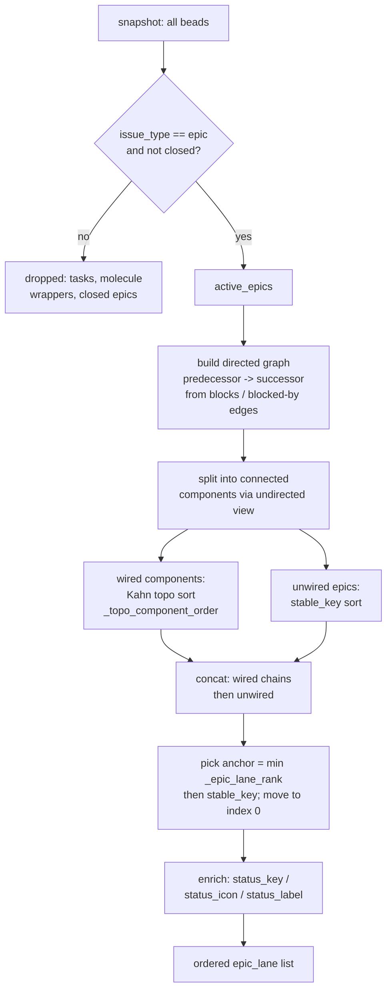

# Epic Lane Sequencing

## What Is It

Epic Lane Sequencing is the rule set that decides **which epics appear in the
horizontal "Epics" strip at the top of the board, and in what left-to-right
order**. Instead of dumping epics in creation order, bdboard reads the
`blocks` / `blocked-by` dependency edges between active epics and lays them out
as a **predecessor → successor reading line**, then slides the one epic you
should care about *right now* (the in-progress one, or the next ready one) to
position 0. The whole thing is a pure function — `derive.epic_lane(beads)` —
that takes a bead snapshot and returns an ordered, status-enriched list.

## Why This Approach

A flat board (every issue in one of five swim lanes) loses the *macro* story:
"which big chunk of work comes after which." Epics are the milestones, and
their dependency wiring already encodes the intended sequence — so the board
should *show* that sequence rather than make the reader reconstruct it from the
dependency graph in their head.

Three problems shaped the design:

1. **Order should follow dependencies, not clocks.** A formula-poured plan
   wires `phase-1 blocks phase-2 blocks phase-3`. Sorting by `created_at` can
   scramble that (a phase authored later may run earlier). A **topological
   sort** respects the wiring and degrades gracefully (stable `created_at`
   tie-break) when epics are unwired or a cycle sneaks in.
2. **The "you are here" epic must be obvious.** Reading a strip of ten epics to
   find the active one is friction. So after ordering, one **anchor** epic is
   promoted to the front by an explicit priority rank.
3. **Determinism for a live, auto-refreshing surface.** The board re-renders on
   every SSE `refresh` and every watcher tick. If ordering jittered between
   identical snapshots, the strip would visibly shuffle. Every tie-break is
   stable (`created_at` asc, then `id` asc), so identical input always yields
   identical output.

## How It Works

`derive.epic_lane(beads)` runs a six-stage pipeline. It only ever *reads* the
snapshot; it never mutates beads or touches `.beads/`.



### Stage 1 — Filter to active epics

Only `issue_type == "epic"` survives (`_is_epic`), and closed epics
(`status in {closed, resolved, done}`, via `_is_closed`) are dropped. Tasks and
formula-pour `molecule` wrappers never reach this function — they belong to the
swim lanes / are hidden entirely. If nothing survives, the function returns
`[]` and the template renders `(no active epics)`.

### Stage 2 — Build the directed dependency graph

For each active epic, its dependency list is read through the field-normalizing
helpers (`get_dependency_list`, `get_dependency_type`,
`get_dependency_target_id`) so it doesn't matter whether bd serialized the edge
as `deps`/`dependencies`, `type`/`dependency_type`, or
`depends_on_id`/`target`/`id`/`dependsOnId`. Only `blocks` / `blocked-by`
edges count. The semantic is **"current epic depends on predecessor"**, so the
edge is recorded as `predecessor → current` in `succ`, incrementing
`indegree[current]`. Edges that point outside the active-epic set are skipped
for topology (but the closed predecessor is still visible to
`_has_unmet_blocking_dep` because `by_id` is built from *all* beads).

### Stage 3 — Find connected components

An undirected mirror of `succ` is walked (DFS) to bucket epics into connected
components. A component with zero internal edges is "unwired" and set aside;
components with edges are "wired chains." Components are sorted by the earliest
`_stable_key` they contain so output order is deterministic.

### Stage 4 — Topologically order each wired chain

`_topo_component_order` runs **Kahn's algorithm** on a heap keyed by
`(created_at, id)`: zero-indegree nodes drain first, predecessors before
successors. On a dependency **cycle** (where some nodes never reach indegree 0)
the leftovers are appended by stable key so rendering never crashes or hangs —
it just falls back to deterministic order.

### Stage 5 — Append unwired epics, then promote the anchor

Unwired epics (sorted by `_stable_key`) are concatenated after the wired
chains. Then a single **anchor** is chosen as the minimum of
`(_epic_lane_rank(b), created_at, id)` and moved to index 0; everyone else
keeps their relative order. The rank decides "what deserves the spotlight":

| Rank | Meaning | Condition (`_epic_lane_rank`) |
| --- | --- | --- |
| 0 | Actively in progress | `status == "in_progress"` |
| 1 | Next ready | `status == "open"` AND no unmet blocking dep |
| 2 | Blocked | `status == "blocked"` OR (`status == "open"` AND unmet blocking dep) |
| 3 | Deferred | `status == "deferred"` |
| 4 | Anything else | any other status |

### Stage 6 — Enrich for rendering

Each output bead is shallow-copied and given three derived fields the template
consumes. Critically, an `open` epic with an unmet blocker is **displayed** as
`blocked` (its `status_key` becomes `"blocked"`) even though its raw status is
still `open` — `in_progress` is never overridden.

The enriched objects keep their original bead fields and add:

```json
{
  "id": "pair-b",
  "title": "Title pair-b",
  "issue_type": "epic",
  "status": "in_progress",
  "priority": 1,
  "assignee": "Aaron Weegens",
  "dependencies": [{ "depends_on_id": "pair-a", "dependency_type": "blocks" }],
  "status_key": "in_progress",
  "status_icon": "▶",
  "status_label": "In Progress"
}
```

The `(status_icon, status_label)` pair comes from `_STATUS_META`:
`open → ("○" U+25CB, Open)`, `in_progress → ("▶" U+25B6, In Progress)`,
`blocked → ("no-entry" U+26D4, Blocked)`, `deferred → ("⏸" U+23F8, Deferred)`,
`closed/resolved/done → ("check-mark" U+2713, Closed/Resolved/Done)`.

### A concrete example

Given these active epics (one closed, three independent, one wired
`pair-a → pair-b`, one wired chain `chain-a → chain-b → chain-c`):

- `pair-b` — in_progress, depends on `pair-a`
- `pair-a` — deferred
- `chain-a` — open (ready) ; `chain-b` — blocked (deps `chain-a`) ; `chain-c` — deferred (deps `chain-b`)
- `single` — open ; `unwired` — open
- `closed-epic` — closed

`epic_lane` returns this order (verified by
`test_epic_lane_promotes_active_or_next_ready_to_front_and_omits_closed`):

```
pair-b, pair-a, chain-a, chain-b, chain-c, single, unwired
```

`pair-b` (rank 0, in_progress) is the anchor at index 0; its chain partner
`pair-a` follows; then the `chain-a → chain-b → chain-c` topo order; then the
remaining unwired epics by stable key; and `closed-epic` is gone entirely.

### Where the data comes from

`bd list` does not expand dependency arrays, so the
`/api/lanes` route first calls `_hydrate_epic_dependencies`, which fans out one
`bd show <id> --long --json` (`Client.show_long`) per epic and grafts the
`dependencies` / `dependency_count` fields back onto the snapshot copy *before*
`epic_lane` ever sees them. Without that hydration the strip would have no edges
to sequence on.

### Implementation Map

| Responsibility | File path | Symbol |
| --- | --- | --- |
| Main sequencing pipeline | `src/bdboard/derive/lanes.py` | `epic_lane` |
| Kahn topological sort of one chain | `src/bdboard/derive/lanes.py` | `_topo_component_order` |
| Anchor priority rank | `src/bdboard/derive/lanes.py` | `_epic_lane_rank` |
| Epic type predicate | `src/bdboard/derive/lanes.py` | `_is_epic` |
| Closed-status predicate | `src/bdboard/derive/lanes.py` | `_is_closed` |
| Unmet-blocker detection | `src/bdboard/derive/lanes.py` | `_has_unmet_blocking_dep` |
| Deterministic tie-break key | `src/bdboard/derive/lanes.py` | `_stable_key` |
| Dependency field normalization | `src/bdboard/derive/lanes.py` | `get_dependency_list`, `get_dependency_type`, `get_dependency_target_id` |
| Status icon/label lookup | `src/bdboard/derive/lanes.py` | `_STATUS_META` |
| Per-epic dependency hydration | `src/bdboard/app.py` | `_hydrate_epic_dependencies` |
| Endpoint invoking the pipeline | `src/bdboard/app.py` | `api_lanes` |
| Long-view fetch per epic | `src/bdboard/bd.py` | `Client.show_long` |
| Epic strip render | `src/bdboard/templates/partials/lanes.html` | `epic-strip` loop |
| Regression coverage | `tests/test_derive_epics.py` | `test_epic_lane_*` |

## Where Used

- **GET /api/lanes** ([Endpoints index](../Endpoints/index.md)) — the endpoint
  that hydrates epic dependencies and calls `epic_lane` for each board render.
- **Board First Paint** ([Flows index](../Flows/index.md)) — the first-paint
  flow that builds the epic strip from the active-only snapshot.
- **Live Board** ([Features index](../Features/index.md)) — the feature whose
  top strip is this sequenced epic list.
- **Board (/)** ([Views index](../Views/index.md)) — the view that renders the
  `epic-strip` loop in `partials/lanes.html`.
- **Derive Layer** ([Concepts index](index.md)) — `epic_lane` is one of the
  pure derivations this concept belongs to.

## Conventions

> [!IMPORTANT]
> - **Keep it pure.** `epic_lane` and its helpers take a snapshot and return
>   data — no I/O, no caching, no `.beads/` writes. Freshness is the Store's
>   job; all dependency hydration happens *upstream* in
>   `_hydrate_epic_dependencies`.
> - **Read dependency fields only through the normalizers.** Never reach for
>   `bead["deps"]` or `dep["depends_on_id"]` directly — use
>   `get_dependency_list` / `get_dependency_type` / `get_dependency_target_id`
>   so the code survives bd's field-name variations.
> - **Every tie-break must be stable** (`_stable_key` = `created_at` asc then
>   `id` asc). The board re-renders constantly; identical snapshots must
>   produce byte-identical order to avoid visible jitter.
> - **`blocks` and `blocked-by` are the only edges that sequence.** Other
>   dependency types (e.g. `discovered-from`, `parent-child`) are ignored here.
> - **Display status is derived, not raw.** An `open` epic with an unmet
>   blocker shows as `blocked`; `in_progress` is never downgraded.

## Anti-Patterns

> [!CAUTION]
> - **Don't sort the strip by `created_at` alone.** That throws away the
>   dependency sequence the topo sort exists to honor.
> - **Don't let a dependency cycle crash or hang the render.** The cycle
>   fallback in `_topo_component_order` (append leftovers by stable key) is
>   load-bearing — removing it would deadlock Kahn's loop on cyclic input.
> - **Don't render `molecule` wrappers or closed epics in the strip.** The
>   `molecule` grouping wrapper is redundant (its human-readable name lives on
>   the formula's epic root step), and closed epics belong on the History page,
>   not the live macro strip.
> - **Don't call `epic_lane` on a raw `bd list` snapshot.** Without
>   `_hydrate_epic_dependencies` first, there are no edges and every epic falls
>   back to unwired stable order — the sequencing silently no-ops.
> - **Don't mutate the input beads.** Enrichment uses `dict(b)` copies on
>   purpose; writing `status_key` onto the shared snapshot would corrupt the
>   swim-lane derivations that read the same objects.

## Related

- [Concepts index](index.md) — Derive Layer and the other cross-cutting
  concepts.
- [Endpoints index](../Endpoints/index.md) — GET /api/lanes (the caller).
- [Flows index](../Flows/index.md) — Board First Paint.
- [Features index](../Features/index.md) — Live Board.
- [Views index](../Views/index.md) — Board (/).
- [Back to docs index](../index.md)
