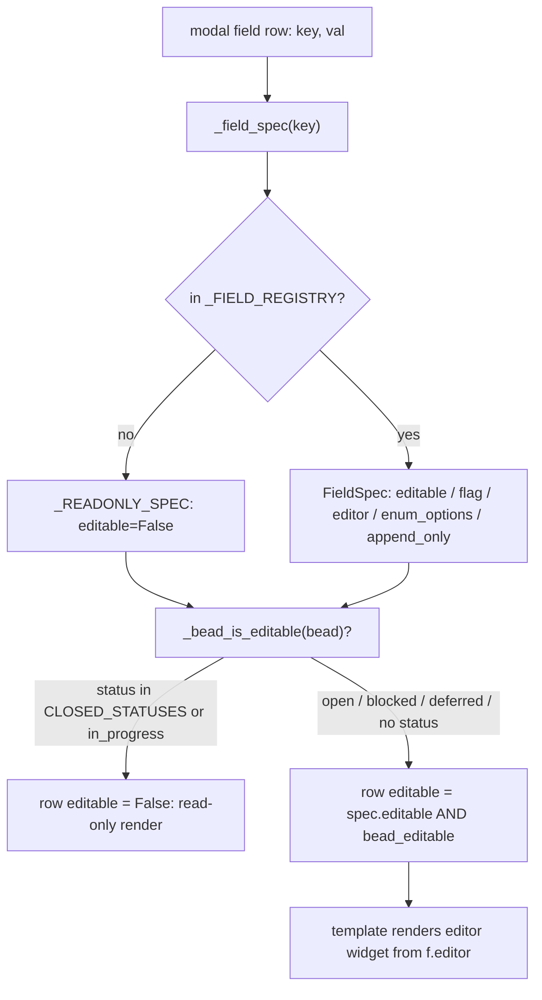
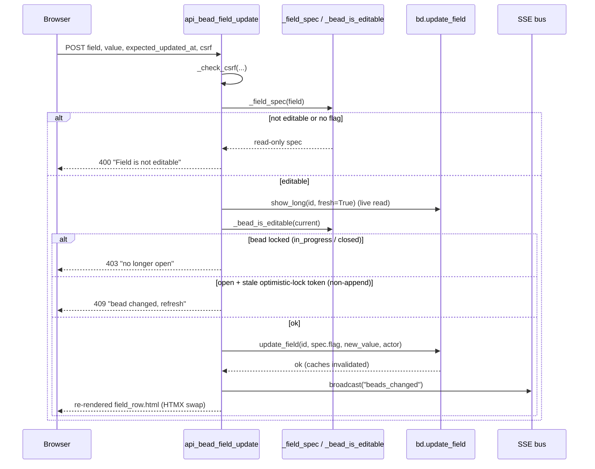

# Field Editability Registry

## What Is It

The Field Editability Registry is the **single source of truth that decides, for
every bd field, whether and how its value may be hand-edited from the bdboard
modal** — and with which exact `bd update` flag and which editor widget. It is a
plain `dict[str, FieldSpec]` (`_FIELD_REGISTRY` in `src/bdboard/app.py`) keyed by
bd field name. Anything *not* in the map is read-only by default. The registry
answers **WHICH** fields are ever editable; a separate status gate
(`_bead_is_editable`) answers **WHEN** (only while a bead is open). Together they
are consulted twice: once on the UI hint pass (`_ordered_fields` decorates each
modal row) and once on the server write guard (`api_bead_field_update` refuses
anything not whitelisted), so the two halves can never drift apart.

## Why This Approach

Manual field editing ([Feature: Manual Field Editing](../Features/index.md)) lets
a human fix a typo'd title or bump a priority straight from the board instead of
dropping to the `bd` CLI. But bdboard is a deliberately **read-mostly observer**
of the `bd`/Dolt source of truth, so opening up *writes* needs tight blast-radius
control. A registry solves three problems at once:

1. **Read-only must be the safe default.** bd emits dozens of fields, many of
   which have no safe in-place edit (`id`, timestamps, derived counts) or would
   mutate shape/graph/lifecycle (`status`, `parent`, `labels`). Whitelisting —
   absence ⇒ non-editable — means a newly-surfaced bd field is automatically
   locked until someone deliberately opts it in.
2. **The client must never choose the write flag.** The flag passed to
   `bd update` (`--title`, `--priority`, `--append-notes`, …) is pinned in the
   registry, not taken from the request. A crafted POST naming `status` or
   `parent` gets bounced because those keys aren't editable entries — the
   request can't widen what's writable.
3. **One place to add a field (DRY / open–closed).** Making a new field editable
   is a *single* dict entry — flag, editor kind, and any enum options all ride
   along — exactly mirroring how the `_KIND_*` render sets add a render kind in
   one place. The template (`partials/field_row.html`) and write path stay
   declarative and just read the hints.

## How It Works

Each entry is a frozen `FieldSpec` dataclass (frozen so the registry is an
immutable source of truth, mirroring `bd.py`'s `CacheEntry`):

```json
{
  "editable": true,
  "flag": "--title",
  "editor": "text",
  "enum_options": null,
  "append_only": false
}
```

- **`editable`** — whether the value may be hand-edited at all.
- **`flag`** — the *exact* `bd update` flag the write path passes; nothing else.
- **`editor`** — the widget kind: `text` | `textarea` | `md` | `select` |
  `number`. The template picks the input from this.
- **`enum_options`** — populated only for `select` editors so the dropdown is
  built server-side from one source (no enum drift).
- **`append_only`** — fields where the safe semantics are *append* not *replace*
  (only `notes`, whose flag is therefore `--append-notes`).

`_field_spec(key)` returns the entry or a shared `_READONLY_SPEC`
(`FieldSpec(editable=False)`) fallback, so every non-whitelisted row points at
the same immutable read-only instance.

The v1 whitelist (spike §5) — the complete editable set — is:

| Field key | editable | flag | editor | enum_options | append_only |
| --- | --- | --- | --- | --- | --- |
| `title` | yes | `--title` | text | — | no |
| `description` | yes | `--description` | md | — | no |
| `acceptance_criteria` | yes | `--acceptance` | md | — | no |
| `design` | yes | `--design` | md | — | no |
| `priority` | yes | `--priority` | select | `0,1,2,3,4` | no |
| `assignee` | yes | `--assignee` | text | — | no |
| `issue_type` | yes | `--type` | select | `bug,feature,task,epic,chore,decision` | no |
| `external_ref` | yes | `--external-ref` | text | — | no |
| `estimate` | yes | `--estimate` | number | — | no |
| `notes` | yes | `--append-notes` | md | — | **yes** |
| *anything else* (`status`, `parent`, `labels`, `metadata`, `id`, `story_points`, `created_at`, `updated_at`, `dependency_count`, …) | no | — | — | — | — |

> [!NOTE]
> `story_points` looks like a harmless scalar but has **no `bd update` flag** —
> "edit anything scalar-looking" is a known foot-gun, which is exactly why the
> registry whitelists rather than blacklists.

The **status gate** is orthogonal. `_bead_is_editable(bead)` returns `False`
when the bead's status is in `_LOCKED_EDIT_STATUSES`
(`derive.CLOSED_STATUSES | {"in_progress"}` — reusing the closed set so it has
ONE definition). So even a registry-editable field renders read-only once a bead
is claimed (`in_progress`) or historical (`closed`/`resolved`/`done`). A bead
with no status falls back to editable (absence ⇒ "open"). The per-row hint is
`spec.editable and bead_editable` — both must be true.



The **write path** (`POST /api/bead/{id}/field`) re-validates everything
server-side so a crafted request can't bypass the UI:



### A concrete example

A user edits a bead's **priority** to P2 in another tab:

1. The modal row was built by `_field_row("priority", 3, bead_editable=True)`,
   which read `FieldSpec(editable=True, flag="--priority", editor="select",
   enum_options=("0","1","2","3","4"))`. The template renders a `<select>` with
   options P0–P4 (labels) posting the bare int.
2. On submit, `api_bead_field_update` runs `_check_csrf`, then `_field_spec
   ("priority")` confirms it's editable with flag `--priority`.
3. A live `show_long(id, fresh=True)` confirms the bead is still `open`
   (`_bead_is_editable` ⇒ True) and that `updated_at` matches the form's
   `expected_updated_at` (optimistic lock passes).
4. `bd.update_field(id, "--priority", "2", actor=_ACTOR)` shells
   `bd update <id> --priority 2 --actor …`, then clears the per-bead show cache
   and invalidates sibling caches so the follow-up read sees the new value.
5. The route broadcasts `beads_changed` over SSE (other tabs refresh) and
   returns the re-rendered `field_row.html` plus an out-of-band priority badge so
   the modal header updates in the same HTMX swap.

Now contrast **notes** (`append_only=True`, flag `--append-notes`): the template
shows an *append* affordance instead of a replace textarea, the optimistic-lock
check is skipped (an append can never clobber), and `bd.update_field` routes the
flag normally. For the long markdown fields **description** (`--description`) and
**design** (`--design`), `bd.update_field` swaps to the stdin variants
(`--body-file -` / `--design-file -`) via `_STDIN_FLAG_ALIASES`, streaming the
value on stdin so a huge body never blows the shell-arg length limit.

### Implementation Map

| Responsibility | File path | Symbol |
| --- | --- | --- |
| The registry (single source of truth) | `src/bdboard/app.py` | `_FIELD_REGISTRY` |
| Per-field edit spec (frozen dataclass) | `src/bdboard/app.py` | `FieldSpec` |
| Read-only fallback spec | `src/bdboard/app.py` | `_READONLY_SPEC` |
| Lookup with safe default | `src/bdboard/app.py` | `_field_spec` |
| Select-editor enum sources | `src/bdboard/app.py` | `_PRIORITY_OPTIONS`, `_ISSUE_TYPE_OPTIONS` |
| Status-gate predicate (WHEN) | `src/bdboard/app.py` | `_bead_is_editable` |
| Locked-status set | `src/bdboard/app.py` | `_LOCKED_EDIT_STATUSES` |
| Reused closed-status set (DRY) | `src/bdboard/derive/__init__.py` | `CLOSED_STATUSES` |
| Build one row's render + edit hints | `src/bdboard/app.py` | `_field_row` |
| Decorate all modal rows | `src/bdboard/app.py` | `_ordered_fields` |
| Server-side write guard + flow | `src/bdboard/app.py` | `api_bead_field_update` |
| Serialized `bd update` write | `src/bdboard/bd.py` | `Client.update_field` |
| Long-markdown stdin flag aliases | `src/bdboard/bd.py` | `_STDIN_FLAG_ALIASES` |
| Declarative row + editor widgets | `src/bdboard/templates/partials/field_row.html` | (template) |
| Registry regression coverage | `tests/test_field_registry.py` | `test_*` |
| Status-gate regression coverage | `tests/test_field_edit_status_gate.py` | `test_*` |

## Where Used

- **Manual Field Editing** ([Features index](../Features/index.md)) — the
  feature whose entire editability surface this registry defines.
- **Field Edit Write Path** ([Flows index](../Flows/index.md)) — the flow that
  validates a submitted edit against the registry and the status gate before
  shelling `bd update`.
- **POST /api/bead/{id}/field** ([Endpoints index](../Endpoints/index.md)) — the
  endpoint that re-checks `_field_spec` + `_bead_is_editable` server-side.
- **Bead Detail Modal** ([Features index](../Features/index.md)) — the modal
  whose `_ordered_fields` rows carry the registry-sourced edit hints.
- **CSRF Protection** ([CSRF Protection](CsrfProtection.md)) — the guard that
  fronts every field write before the registry check runs.

## Conventions

> [!IMPORTANT]
> - **Whitelist, never blacklist.** Absence from `_FIELD_REGISTRY` means
>   read-only. A new editable field is exactly ONE entry; never special-case
>   editability elsewhere.
> - **The registry pins the flag.** The `bd update` flag comes from the
>   `FieldSpec`, never from the request. Don't let the client name a flag.
> - **WHICH vs WHEN are separate.** The registry decides which fields are ever
>   editable; `_bead_is_editable` (the status gate) decides when. Keep both
>   checks — UI hint AND server guard — so they can't disagree.
> - **`append_only` fields append, never replace.** `notes` MUST use
>   `--append-notes`; replacing would nuke agent verification history.
> - **Reuse `derive.CLOSED_STATUSES`.** The locked-status set extends it rather
>   than re-listing closed statuses, so "closed" has ONE definition.

## Anti-Patterns

> [!CAUTION]
> - **Don't read `_FIELD_REGISTRY` to *enforce* writes in the template.** The UI
>   hint is convenience; the authoritative guard is server-side in
>   `api_bead_field_update`. Never trust the client's `field` name.
> - **Don't whitelist shape/graph/lifecycle fields** (`status`, `parent`,
>   `labels`, `metadata`, `id`) — those change structure, not just a value, and
>   belong to dedicated bd commands, not a generic value edit.
> - **Don't add a "scalar-looking" field without a real `bd update` flag.**
>   `story_points` has none; whitelisting it would produce a save button that
>   can't save.
> - **Don't drop the live `fresh=True` re-read in the write path.** Trusting a
>   cached snapshot for the status gate would let a freshly-claimed bead slip an
>   edit through a stale cache.
> - **Don't skip the optimistic-lock check on replace edits.** Without
>   `expected_updated_at`, a stale form silently clobbers a concurrent edit
>   (last-write-wins). Append-only fields are the only safe exception.

## Related

- [Concepts index](index.md) — the other cross-cutting concepts.
- [CSRF Protection](CsrfProtection.md) — the write-path guard that runs first.
- [Features index](../Features/index.md) — Manual Field Editing, Bead Detail Modal.
- [Flows index](../Flows/index.md) — Field Edit Write Path.
- [Endpoints index](../Endpoints/index.md) — POST /api/bead/{id}/field.
- [Back to docs index](../index.md)
