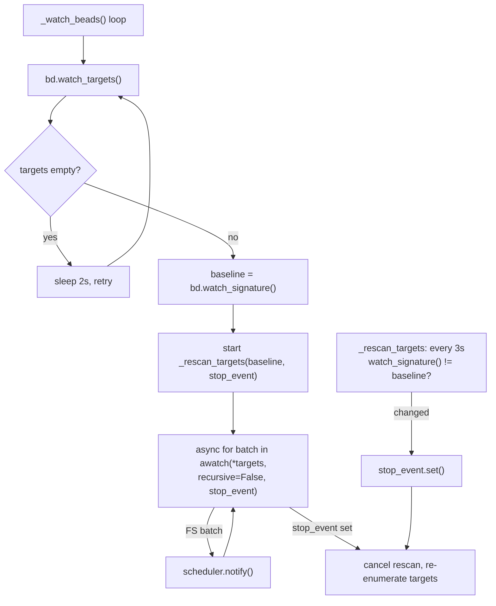
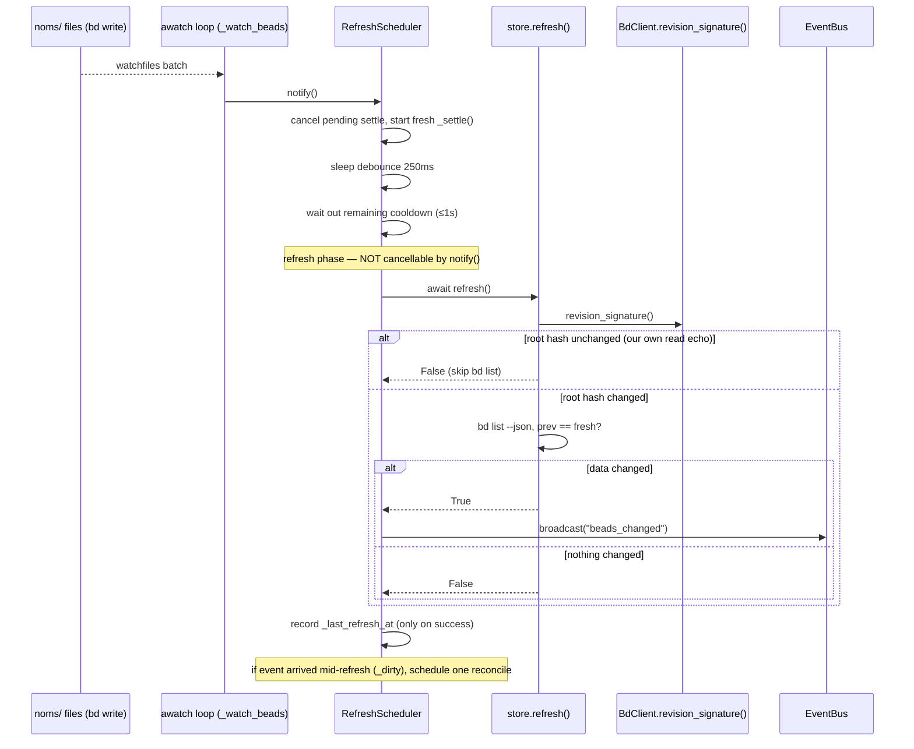

# Filesystem Watcher

## What Is It

The Filesystem Watcher is the background loop that turns raw `bd` writes
landing on disk into a *single* `store.refresh()` per logical mutation. It
observes a tiny, fixed set of dolt object-store directories under `.beads/`
and, when they settle, refreshes the cache and broadcasts an SSE
`beads_changed` event — but only if the bead data actually changed.

It is the engine behind bdboard's "edit a bead in any terminal and the open
board updates within a second, with no Refresh button" behavior.

## Why This Approach

bdboard is a pure **observer** on the dolt-native source of truth: it never
owns the data, it watches `bd` mutate it. That framing creates three hard
problems, and the watcher exists to solve all three at once:

1. **One mutation is many file writes.** A single `bd update` rewrites 3-5
   files inside `.beads/embeddeddolt/<db>/.dolt/noms/` (manifest, journal.idx,
   lock, object files) in quick succession. Refreshing per-file would fire
   3-5 redundant `bd list --json` subprocesses per logical change. A trailing
   **debounce** window collapses the burst into one refresh.

2. **A sustained write storm must not chain-fire refreshes.** dolt commit +
   auto-export fan-out + a git-add hook can keep the FS busy. A
   post-refresh **cooldown** paces the refresh cadence so the board can't
   thrash at full filesystem speed.

3. **Our own read re-triggers the watcher.** `store.refresh()` runs `bd list
   --json`, and even a read-only `bd list` makes dolt re-touch
   `journal.idx`/`manifest` inside the watched `noms/` dir — so the watcher
   fires ~1.3s later for our *own* read. Left unbroken this is an infinite
   refresh→read→event→refresh loop that (on a large `noms/`) cancels every
   in-flight refresh mid-subprocess and freezes the board until relaunch.

The design choice that ties it together: **watch a small fixed set of `noms/`
directories NON-recursively** rather than the whole `.beads/` tree
recursively. The recursive whole-tree watch opened one kqueue fd per
directory on macOS and, against dolt's churning object store, exhausted
`RLIMIT_NOFILE` (often 256) — which then broke subprocess spawning so badly
that `bd list --json` and `bd show` crashed with `OSError [Errno 24] Too many
open files`. Every meaningful `bd` write still touches `manifest` +
`journal.idx` in each db's `noms/` dir, so the non-recursive watch keeps
sub-second latency without the fd blowup.

## How It Works

The watcher is two cooperating pieces:

- **`_watch_beads()`** (in `app.py`) owns the `watchfiles.awatch` loop and
  target enumeration. It feeds every event batch into the scheduler via
  `scheduler.notify()`.
- **`RefreshScheduler`** (in `watcher.py`) owns the timing: debounce, cooldown,
  and the "don't cancel an in-flight refresh" rule. It calls `refresh()` once
  the writes settle and `broadcast()` iff `refresh()` returned `True`.

A background poller, **`_rescan_targets()`**, watches the *identity* of the
target set (via `watch_signature()`) and trips `awatch`'s `stop_event` when
a new db appears or a `noms/` dir is atomically replaced — forcing a clean
re-enumeration without a process restart.

### Watcher loop (target enumeration + event ingest)



### Settle cycle (debounce → cooldown → refresh → broadcast)



### A concrete example

A maintainer runs `bd update bdboard-x --priority 1` in a terminal while the
board sits open in a browser tab:

1. dolt rewrites `manifest` + `journal.idx` + object files inside
   `.beads/embeddeddolt/<db>/.dolt/noms/`. `awatch` yields 2-3 batches over
   ~50-150ms; each calls `scheduler.notify()`, which cancels the prior pending
   settle and starts a new one — so the burst collapses to a single in-flight
   `_settle()`.
2. After 250ms of quiet, debounce expires. The settle waits out any remaining
   1s cooldown from a previous refresh, then enters the refresh phase.
3. fresh()` reads `revision_signature()`; the manifest root hash
   **changed**, so it runs `bd list --json`, sees `priority` differ, returns
   `True`. The scheduler calls `broadcast("beads_changed")`; every open tab
   re-fetches its HTMX partials and shows priority 1.
4. ~1.3s later the read-only `bd list` from step 3 has itself jiggled the
   `noms/` files, so `awatch` fires again. This time `revision_signature()`
   matches the last-seen value, `store.refresh()` takes the cheap skip path
   and returns `False` — no subprocess, no redundant broadcast. The loop is
   severed.

### Key Data Shapes

`watch_targets()` returns the directories handed to `awatch` (non-recursive):

```json
[
  ".beads/embeddeddolt/bdboard/.dolt/noms",
  ".beads"
]
```

`watch_signature()` is the *identity* fingerprint that the rescan poller
compares — a frozenset of `(path, st_dev, st_ino)` tuples. A new db adds a
tuple; an inode swap changes `st_ino` for the same path:

```json
{
  "watch_signature": [
    [".beads/embeddeddolt/bdboard/.dolt/noms", 16777220, 12345678],
    [".beads", 16777220, 11112222]
  ]
}
```

`revision_signature()` is the *content* fingerprint that severs the
self-feedback loop — a frozenset of `(manifest_path, manifest_bytes)`. The
manifest payload is dolt's current root hash, so it flips only on a real
write:

```json
{
  "revision_signature": [
    [".beads/embeddeddolt/bdboard/.dolt/noms/manifest", "<manifest bytes (root hash)>"]
  ]
}
```

The watchfiles batch the loop consumes is a set of `(Change, path)` pairs,
which the scheduler discards (it only needs the *fact* that something
changed):

```json
[
  ["Change.modified", ".beads/embeddeddolt/bdboard/.dolt/noms/manifest"],
  ["Change.added", ".beads/embeddeddolt/bdboard/.dolt/noms/journal.idx"]
]
```

### Implementation Map

| Responsibility | File path | Symbol |
| --- | --- | --- |
| Watcher loop: enumerate targets + ingest events | `src/bdboard/app.py` | `_watch_beads` |
| Rescan poller: trip `stop_event` on target identity change | `src/bdboard/app.py` | `_rescan_targets` |
| App-boot startup/shutdown of the watcher task | `src/bdboard/app.py` | `lifespan` |
| Scheduler wiring (refresh + broadcast + timings) | `src/bdboard/app.py` | `RefreshScheduler(refresh=store.refresh, broadcast=lambda: bus.broadcast("beads_changed"), ...)` |
| Debounce constant | `src/bdboard/app.py` | `WATCHER_DEBOUNCE_S` |
| Cooldown constant | `src/bdboard/app.py` | `WATCHER_COOLDOWN_S` |
| Target re-resolution cadence | `src/bdboard/app.py` | `WATCHER_RESCAN_S` |
| Debounce + cooldown + no-cancel-in-flight scheduling | `src/bdboard/watcher.py` | `RefreshScheduler` |
| Record an FS-change batch (cancel/reschedule or set dirty) | `src/bdboard/watcher.py` | `RefreshScheduler.notify` |
| One settle cycle: debounce → cooldown → refresh → broadcast | `src/bdboard/watcher.py` | `RefreshScheduler._settle` |
| Inline single-cycle settle (test seam) | `src/bdboard/watcher.py` | `RefreshScheduler.settle_now` |
| In-flight guard flag (don't cancel mid-subprocess) | `src/bdboard/watcher.py` | `RefreshScheduler._refreshing` |
| Mid-refresh event marker for one reconcile pass | `src/bdboard/watcher.py` | `RefreshScheduler._dirty` |
| Cooldown clock (advanced only on success) | `src/bdboard/watcher.py` | `RefreshScheduler._last_refresh_at` |
| Default debounce / cooldown | `src/bdboard/watcher.py` | `DEFAULT_DEBOUNCE_S`, `DEFAULT_COOLDOWN_S` |
| Enumerate non-recursive watch targets | `src/bdboard/bd.py` | `BdClient.watch_targets` |
| Target identity fingerprint (new-db / inode-swap) | `src/bdboard/bd.py` | `BdClient.watch_signature` |
| Content fingerprint (root hash) to skip self-echo | `src/bdboard/bd.py` | `BdClient.revision_signature` |
| The observed `.beads/` directory | `src/bdboard/bd.py` | `BdClient.beads_dir` |
| Refresh callback the scheduler drives | `src/bdboard/store.py` | `Store.refresh` |
| SSE fan-out triggered on a real change | `src/bdboard/events.py` | `EventBus.broadcast` |

## Configuration

| Key | Default | Effect |
| --- | --- | --- |
| `WATCHER_DEBOUNCE_S` (`src/bdboard/app.py`) | `0.25` s | Trailing quiet-window that collapses one write's multi-file/multi-batch burst into a single `refresh()`. Longer than dolt's burst, far shorter than human perception. |
| `WATCHER_COOLDOWN_S` (`src/bdboard/app.py`) | `1.0` s | Post-refresh suppression window that paces refresh cadence under a sustained write storm. A settle landing inside it waits out the remainder rather than dropping the event. |
| `WATCHER_RESCAN_S` (`src/bdboard/app.py`) | `3.0` s | How often `_rescan_targets` re-checks `watch_signature()` to catch a new db or an atomically-replaced `noms/` inode and re-enter `awatch` with fresh targets. |
| `DEFAULT_DEBOUNCE_S` (`src/bdboard/watcher.py`) | `0.25` s | `RefreshScheduler` default debounce when `app.py` doesn't override it. |
| `DEFAULT_COOLDOWN_S` (`src/bdboard/watcher.py`) | `1.0` s | `RefreshScheduler` default cooldown when `app.py` doesn't override it. |
| `recursive` (arg to `awatch`) | `False` | Watch the fixed `noms/` dirs only, never the whole `.beads/` subtree — the fix for the macOS fd-exhaustion crash. |

## Where Used

- **Live Updates** ([Features index](../Features/index.md)) — the watcher is
  the upstream half of live sync; its broadcast is what makes open tabs
  re-fetch without a manual refresh.
- **Live Board** ([Features index](../Features/index.md)) — board edits made in
  any terminal show up because the watcher refreshes the active snapshot the
  board reads.
- **Watcher Refresh Cycle** ([Flows index](../Flows/index.md)) — the end-to-end
  flow whose timing this concept implements (debounce → cooldown → refresh).
- **SSE Live Update** ([Flows index](../Flows/index.md)) — consumes the
  `beads_changed` broadcast the watcher gates behind `refresh()`'s `changed`.
- **Board First Paint** ([Flows index](../Flows/index.md)) — unaffected by the
  watcher on first load, but every subsequent live update rides this path.
- **GET /api/events** ([Endpoints index](../Endpoints/index.md)) — the SSE
  endpoint whose stream the watcher's broadcast pushes into.
- **Store Snapshot & Change Detection**
  ([Store Snapshot & Change Detection](StoreSnapshotChangeDetection.md)) — the
  `refresh()` the scheduler calls, including the revision-skip that this
  concept's self-feedback fix depends on.
- **SSE Event Bus** ([SSE Event Bus](SseEventBus.md)) — the bus the watcher
  broadcasts through when (and only when) the bead data changed.
- **Subprocess Serialization & Caching**
  ([Concepts index](index.md)) — the `BdClient` layer that owns
  `watch_targets` / `watch_signature` / `revision_signature` and the
  detail caches a real change invalidates.

## Conventions

> [!IMPORTANT]
> - **Watch non-recursively, by inode-bearing directory.** Hand `awatch` the
>   fixed `noms/` dirs (plus `.beads/` as a catch-all) with `recursive=False`.
>   A recursive `.beads/` watch exhausts `RLIMIT_NOFILE` on macOS and crashes
>   subprocess spawning — do not reintroduce it.
> - **Debounce the burst, then cooldown the cadence.** One logical write is
>   many file writes; one busy period is many logical writes. Keep both
>   controls — they solve different problems.
> - **Never cancel an in-flight refresh.** Only the cancellable
>   debounce/cooldown *sleep* may be pre-empted by a newer event. Once the
>   `bd list` subprocess starts it must run to completion; a concurrent event
>   sets `_dirty` for exactly one reconcile pass instead of killing the
>   refresh.
> - **Advance the cooldown clock only on a successful refresh.** A transient
>   `bd list` failure must leave `_last_refresh_at` untouched so the next event
>   retries promptly instead of being swallowed by a cooldown it never earned.
> - **Compare identity to re-enumerate, content to skip.** Use
>   `watch_signature()` (path + dev + ino) to detect a new db or inode swap and
>   restart `awatch`; use `revision_signature()` (manifest root hash) to skip
>   the refresh when an event is just our own read echoing back.
> - **Treat "no dolt signal" as "always refresh."** When the workspace has no
>   embedded dolt dbs, the signatures return empty sets so callers refresh
>   rather than silently skip forever.

## Anti-Patterns

> [!CAUTION]
> - **Don't watch `.beads/` recursively.** It opens one fd per directory and,
>   against dolt's churning object store, blows past the soft fd limit —
>   breaking `bd list --json` and `bd show` with `OSError [Errno 24]`
>   (bdboard-xbc7). This is the bug the whole non-recursive design exists to
>   prevent.
> - **Don't drop an event that lands inside the cooldown window.** The old
>   `_settle_task` returned early without refreshing *and* without
>   rescheduling, so the last (or only) write of a burst was silently lost
>   until some unrelated future write happened to land outside cooldown
>   (bdboard-xbc7 root cause #1). Wait out the remainder instead.
> - **Don't cancel the refresh on every event.** The old `notify()` cancelled
>   the in-flight refresh — including the self-induced event `bd list` itself
>   triggers — so on a large `noms/` the refresh was killed mid-subprocess
>   every time and never completed, freezing the board until relaunch
>   (bdboard-ywep).
> - **Don't enumerate targets once and assume they're stable.** `awatch` only
>   re-reads its paths on (re)entry; without the `watch_signature()` rescan a
>   post-startup new db or a `noms/` inode swap silently stops producing events
>   (bdboard-xbc7 root cause #2).
> - **Don't advance cooldown on failure.** Earning a cooldown without actually
>   syncing lets a single transient `bd list` hiccup wedge live-sync until an
>   out-of-cooldown write appears (bdboard-xbc7 root cause #3).
> - **Don't poll `refresh()` on a timer as a "safety net."** The watcher is
>   the trigger; a parallel timer just reintroduces the per-call `bd list` cost
>   and dolt-lock contention the observer model exists to avoid.

## Related

- [Concepts index](index.md) — the other cross-cutting concepts.
- [Store Snapshot & Change Detection](StoreSnapshotChangeDetection.md) — the
  `refresh()` the scheduler drives and its revision-skip fast path.
- [SSE Event Bus](SseEventBus.md) — the bus the watcher broadcasts through on a
  real change.
- [Subprocess Serialization & Caching](index.md) — the `BdClient` layer that
  owns the watch/revision signatures (see Concepts index until its page lands).
- [bd CLI as Source of Truth](index.md) — the dolt-native source the watcher
  observes rather than owns (see Concepts index until its page lands).
- [Features index](../Features/index.md) — Live Updates, Live Board.
- [Flows index](../Flows/index.md) — Watcher Refresh Cycle, SSE Live Update,
  Board First Paint.
- [Endpoints index](../Endpoints/index.md) — GET /api/events.
- [Back to docs index](../index.md)
