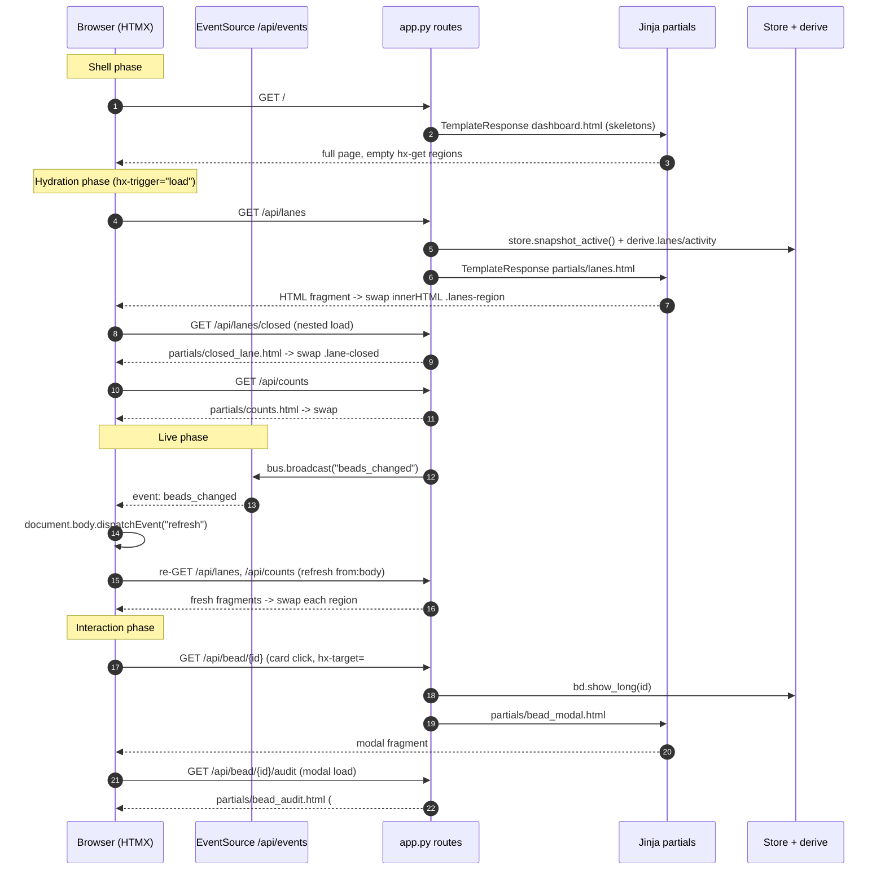

# HTMX + Server-Rendered Partials

## What Is It

bdboard is a server-rendered application with no client-side framework, no
build step, and no JSON-over-the-wire view layer. Every page is a thin Jinja2
shell that paints **instant skeletons**, then hydrates each data region by
fetching an **HTML fragment** (a "partial") over HTTP and swapping it into the
DOM. The only client library is HTMX (`htmx.org@1.9.12`, loaded from a CDN in
[`templates/base.html`](../../src/bdboard/templates/base.html)); a small amount
of hand-written vanilla JS handles theme, filters, focus, and the SSE bridge.

Concretely: routes declared with `@app.get(..., response_class=HTMLResponse)`
in [`src/bdboard/app.py`](../../src/bdboard/app.py) return
`TEMPLATES.TemplateResponse(request, "partials/<name>.html", {...})` — raw HTML,
not JSON. Elements opt into fetching those fragments with `hx-get` / `hx-post` /
`hx-delete` attributes, and HTMX inserts the response per `hx-swap`
(`innerHTML` / `outerHTML`) at the `hx-target` (or the triggering element).

## Why This Approach

The problem: a `bd`-backed dashboard needs live, interactive views (board
lanes, a bead-detail modal, inline field edits, history charts, a memory
curator) **without** the operational weight of an SPA. A React/Vue front end
would add a bundler, a node toolchain, a client router, a state store, and a
JSON API surface to keep in sync with the templates — all for a single-user,
read-mostly localhost tool.

HTMX + server-rendered partials collapses that stack:

- **One rendering authority.** The same Jinja partial renders on first paint
  *and* on every subsequent swap, so there is no "API shape vs. template shape"
  drift to maintain — the wire format *is* the markup.
- **No build step.** HTMX is a single `<script>` tag; Tailwind-free CSS ships
  as one static file. `git clone && uv sync && bdboard` just works.
- **Cheap, symmetric page routes.** `/`, `/memory`, and `/history` each return a
  skeleton shell instantly (no `bd` subprocess on the critical path), then each
  data region self-fetches — uniform time-to-first-paint across pages.
- **Live updates for free.** Server-Sent Events push a `beads_changed` signal;
  a tiny JS bridge re-dispatches it as a DOM `refresh` event, and every region
  wired with `hx-trigger="refresh from:body"` re-fetches its own partial. No
  diffing, no client state to reconcile.

> [!NOTE]
> This is recorded as ADR `docs/decisions/0002-dashboard-architecture.md`
> (HTMX over an SPA) and reinforced by `0005-live-refresh-architecture.md`.
> This concept doc describes the *behavior*; the ADR captures *why the call
> was made*.

## How It Works

Three render phases drive everything:

1. **Shell phase.** A page route (`index`, `page_memory`, `page_history` in
   `app.py`) returns a full document extending
   [`base.html`](../../src/bdboard/templates/base.html). The body contains
   skeleton placeholders and *empty* swap targets carrying
   `hx-get="/api/…" hx-trigger="load, refresh from:body"`. No `bd` call runs on
   this path, so the page paints immediately.
2. **Hydration phase.** HTMX fires each region's trigger, GETs the
   partial route, and swaps the returned HTML in (`hx-swap="innerHTML"`),
   replacing the skeleton. Partial routes (`api_lanes`, `api_counts`,
   `api_history`, `api_memory`) are where the real `Store.snapshot*()` +
   `derive.*` cost lives.
3. **Live + interaction phase.** SSE `beads_changed` → DOM `refresh` → every
   `refresh from:body` region re-fetches. User actions (open a bead, edit a
   field, pour a formula, create/delete a memory) issue their own
   `hx-get`/`hx-post`/`hx-delete`, and the route returns just the affected
   fragment for an in-place swap. Mutating routes also `bus.broadcast`, so other
   tabs reconcile too.

**Concrete example — the board (`/`):**

`GET /` → `index()` returns `dashboard.html` (skeletons only). The
`.lanes-region` element fires its `load` → `GET /api/lanes` → `api_lanes()`
renders `partials/lanes.html` from `store.snapshot_active()`. That partial *also*
contains the lazy closed lane (`hx-get="/api/lanes/closed"`), which fires its
own `load` → `GET /api/lanes/closed` → `api_lanes_closed()` renders
`partials/closed_lane.html`. Meanwhile the masthead `#counts` strip hydrates via
`GET /api/counts`. When a file changes under `.beads/`, the watcher broadcasts
`beads_changed`; the SSE bridge in `base.html` dispatches `refresh`, and all
three regions re-GET their partials. Clicking any bead card
(`partials/bead_card.html`, `hx-target="#bead-modal"`) GETs
`/api/bead/{id}` → `partials/bead_modal.html`, whose audit section then
self-fetches `/api/bead/{id}/audit`; that response uses an **out-of-band**
swap (`hx-swap-oob="true"` on `#lifecycle-slot`) to fill two targets from one
fetch.



### Swap targets, triggers & semantics

| HTMX attribute | Where it lives (file) | Value used | Effect |
| --- | --- | --- | --- |
| `hx-get` | `dashboard.html` `.lanes-region` | `/api/lanes` | Hydrate active lanes |
| `hx-trigger` | `dashboard.html` `#counts` | `load, refresh from:body` | Hydrate on paint + on every SSE refresh |
| `hx-swap` | `dashboard.html` `.lanes-region` | `innerHTML` | Replace region contents with fragment |
| `hx-get` | `partials/lanes.html` `.lane-closed` | `/api/lanes/closed` | Lazy-load heavy closed lane after first paint |
| `hx-get` + `hx-target` | `partials/bead_card.html` | `/api/bead/{{ b.id }}` → `#bead-modal` | Open bead modal into the shared host |
| `hx-disabled-elt` | `partials/bead_card.html` | `this` | Disable the card while its fetch is in flight |
| `hx-post` + `hx-target` | `partials/field_row.html` (`field_form` macro) | `/api/bead/{id}/field` → `#field-row-{key}` | Inline field edit, swap just that row |
| `hx-swap` | `partials/field_row.html` (`field_form` macro) | `outerHTML` | Replace the whole `<div id="field-row-…">` element |
| `hx-headers` | `partials/field_row.html` (`field_form` macro) | `{"X-CSRF-Token": "…"}` | Send the per-process CSRF token on writes |
| `hx-swap-oob` | `partials/bead_audit.html` `#lifecycle-slot` | `true` | One fetch fills two DOM targets (lifecycle + audit) |
| `hx-swap-oob` | `partials/bead_priority_badge.html` | `true` (when `oob`) | Field-edit response also refreshes the modal header badge |
| `hx-post` + `hx-target` | `partials/formula_form.html` | `/api/formulas/{name}/pour` → `#formula-pour-result` | Pour formula, render outcome outside the form region |
| `hx-trigger` | `templates/memory.html` search input | `keyup changed delay:250ms, search` | Debounced live search re-render |
| `hx-delete` + `hx-target` | `templates/memory.html` confirm button | `/api/memory/{key}` → `#memory-list` | Forget a memory, re-render the list |

### Partial-rendering routes (impl map)

| Responsibility | File path | Symbol |
| --- | --- | --- |
| Jinja env + filters + CSRF/asset globals | `src/bdboard/app.py` | `TEMPLATES` (`Jinja2Templates`) |
| Board shell (skeletons only) | `src/bdboard/app.py` | `index` |
| Memory page shell | `src/bdboard/app.py` | `page_memory` |
| History page shell | `src/bdboard/app.py` | `page_history` |
| Active lanes + activity fragment | `src/bdboard/app.py` | `api_lanes` |
| Closed lane fragment (lazy) | `src/bdboard/app.py` | `api_lanes_closed` |
| Counts strip fragment | `src/bdboard/app.py` | `api_counts` |
| History region fragment | `src/bdboard/app.py` | `api_history` |
| Memory list fragment (GET/search) | `src/bdboard/app.py` | `api_memory` |
| Memory create (POST → list fragment) | `src/bdboard/app.py` | `api_memory_create` |
| Memory delete (DELETE → list fragment) | `src/bdboard/app.py` | `api_memory_delete` |
| Bead-detail modal fragment | `src/bdboard/app.py` | `api_bead` |
| Audit + lifecycle (OOB) fragment | `src/bdboard/app.py` | `api_bead_audit` |
| Inline field-edit write + row re-render | `src/bdboard/app.py` | `api_bead_field_update` |
| Formula picker / form / pour fragments | `src/bdboard/app.py` | `api_formulas`, `api_formula_form`, `api_formula_pour` |
| SSE event stream (the live signal) | `src/bdboard/app.py` | `sse_events` |
| SSE → DOM `refresh` bridge | `src/bdboard/templates/base.html` | inline `EventSource('/api/events')` IIFE |
| Shared bead card markup | `src/bdboard/templates/partials/bead_card.html` | template |
| Shared field-form wire contract | `src/bdboard/templates/partials/field_row.html` | `field_form` macro |

### Key Data Shapes

Most fragments take **derived view dicts** (shaped by `derive/`), not raw `bd`
JSON. The wire bodies that *do* carry named fields are the write paths
(everything posts `multipart/form-data`, parsed by `python-multipart`):

Inline field-edit request body — `POST /api/bead/{bead_id}/field`
(`api_bead_field_update`):

```json
{
  "field": "priority",
  "value": "2",
  "expected_updated_at": "2026-06-02T13:48:02Z",
  "csrf_token": "<per-process token, also sent as X-CSRF-Token header>"
}
```

Memory create request body — `POST /api/memory` (`api_memory_create`):

```json
{
  "key": "dep-edge-direction",
  "body": "bd reports 'blocks' on both sides; label depends on direction.",
  "csrf_token": "<per-process token>"
}
```

Formula pour request body — `POST /api/formulas/{name}/pour`
(one `var_<name>` field per declared formula variable):

```json
{
  "var_epic_title": "Refactor auth",
  "var_owner": "code-puppy-957aba",
  "csrf_token": "<per-process token>"
}
```

> [!IMPORTANT]
> Responses to all of the above are **HTML fragments**, not JSON. The only
> JSON-returning route in the app is `GET /api/bead/{id}/raw`
> (`api_bead_raw`), an explicit escape hatch that dumps `bd ... --json`.

## Where Used

This pattern is the spine of the entire UI; every feature, flow, view, and
endpoint listed in [`_Manifest.md`](../_Manifest.md) rides on it:

- **Features:** [LiveAutoRefresh](../Features/LiveAutoRefresh.md) (SSE →
  `refresh` re-fetch), [SwimLaneBoard](../Features/SwimLaneBoard.md) (lane +
  closed-lane fragments), [BeadDetailAndInlineEditing](../Features/BeadDetailAndInlineEditing.md)
  (modal fetch + `outerHTML` row swap + OOB badge),
  [HistoryAndTrends](../Features/HistoryAndTrends.md) (`#history-region` swap +
  OOB stats), [MemoryManagement](../Features/MemoryManagement.md)
  (debounced search, POST/DELETE → list re-render),
  [FormulaPour](../Features/FormulaPour.md) (two-step dialog fragments).
- **Flows:** [LiveRefreshPipeline](../Flows/LiveRefreshPipeline.md),
  [FieldEditWritePath](../Flows/FieldEditWritePath.md),
  [FormulaPourFanout](../Flows/FormulaPourFanout.md).
- **Views:** [BoardPage](../Views/BoardPage.md),
  [HistoryPage](../Views/HistoryPage.md), [MemoryPage](../Views/MemoryPage.md)
  — all three are skeleton shells hydrated by partials.
- **Endpoints:** [SseEvents](../Endpoints/SseEvents.md) (the live signal),
  [LanesApi](../Endpoints/LanesApi.md), [HistoryApi](../Endpoints/HistoryApi.md),
  [MemoryApi](../Endpoints/MemoryApi.md), [FormulasApi](../Endpoints/FormulasApi.md),
  [BeadDetailApi](../Endpoints/BeadDetailApi.md),
  [BeadFieldEditApi](../Endpoints/BeadFieldEditApi.md) — every partial-returning
  route.
- **Related concepts:** [StoreSnapshotCache](StoreSnapshotCache.md) and
  [DeriveLayer](DeriveLayer.md) supply the data each partial renders;
  [WatcherScheduling](WatcherScheduling.md) and
  [BdCliSourceOfTruth](BdCliSourceOfTruth.md) feed the live-refresh signal that
  triggers re-swaps.

## Conventions

> [!IMPORTANT]
> **A partial is the swap unit AND the first-paint unit.** Any region that can
> change must render its initial state from the same Jinja partial the swap
> route returns. Never render a region's content inline in the page shell *and*
> separately in a partial — that splits the source of truth. The board shell
> only ships skeletons; the real markup lives in `partials/lanes.html` etc.

> [!IMPORTANT]
> **Live regions use the canonical trigger** `hx-trigger="load, refresh from:body"`
> and `hx-swap="innerHTML"`. `load` covers first hydration; `refresh from:body`
> hooks the SSE bridge. Do not invent per-region SSE listeners — fire the single
> body `refresh` event (see `base.html`) and let regions opt in declaratively.

> [!IMPORTANT]
> **All mutations carry the CSRF token both ways.** Forms include a hidden
> `csrf_token` input *and* set `hx-headers='{"X-CSRF-Token": "…"}'`; routes call
> `_check_csrf(x_csrf_token, csrf)`. Reuse the shared `field_form` macro in
> `partials/field_row.html` rather than re-typing the wire contract — that macro
> is the single source of the header + hidden inputs so the two write paths
> (edit / add-note) can never drift.

> [!IMPORTANT]
> **Use out-of-band swaps to update sibling targets from one fetch.** The audit
> fetch fills both `#lifecycle-slot` (via `hx-swap-oob="true"`) and the in-place
> audit section; a priority edit appends an OOB
> `partials/bead_priority_badge.html` so the modal header badge stays in sync.
> Prefer one OOB-carrying response over a second round trip.

> [!IMPORTANT]
> **Errors render as small HTML fragments, not JSON envelopes.** Write routes
> return `HTMLResponse('<p class="field-error" role="alert">…</p>', status_code=4xx)`.
> The `htmx:beforeSwap` handler in `base.html` cancels the row swap on a 4xx/5xx
> from a field-edit form and shows the message in the row's `aria-live` region,
> so a failed save never wipes the row.

## Anti-Patterns

> [!CAUTION]
> **Don't return JSON for view data and re-render on the client.** That
> reintroduces the SPA template/serializer split this architecture exists to
> avoid. The only legitimate JSON route is `GET /api/bead/{id}/raw`
> (a debugging escape hatch). Everything else returns HTML.

> [!CAUTION]
> **Don't block a page-shell route on a `bd` subprocess.** `index`,
> `page_memory`, and `page_history` must stay cheap and paint skeletons
> instantly; the `bd`/snapshot/derive cost belongs in the `/api/*` partial
> routes that hydrate via `load`. (Regression history: `/` used to await
> `store.snapshot()` + per-epic `bd show` before returning a single pixel.)

> [!CAUTION]
> **Don't hand-write the CSRF header/inputs per form.** Bypassing the
> `field_form` macro risks one write path drifting from the other; a mismatched
> or missing token gets rejected by `_check_csrf` with a confusing 4xx.

> [!CAUTION]
> **Don't bind JS listeners directly to swapped-in elements.** Anything inside a
> swap target is destroyed and recreated on every fetch. Delegate from
> `document` (the `<head>` scripts in `base.html` do this deliberately — binding
> to `document.body` there throws because `<body>` doesn't exist yet) so handlers
> survive swaps.

> [!CAUTION]
> **Don't replace append-only fields with `--notes`.** The notes field is
> `append_only` in the registry; the UI frames it as "Add a note" and the route
> pins `--append-notes`. A naive replace-style edit form would nuke agent
> verification history — exactly the trap `partials/field_row.html` is shaped to
> prevent.

## Related

- [Architecture](../Architecture.md) — system diagram, tech stack, full API
  surface (this concept is the "Front-end interactivity: HTMX + SSE" row).
- [Concepts index](index.md) — sibling cross-cutting concepts.
- [Manifest](../_Manifest.md) — catalog of every documented item this pattern
  underpins.
- [StoreSnapshotCache](StoreSnapshotCache.md) — the cache each partial renders.
- [DeriveLayer](DeriveLayer.md) — pure view shaping feeding the partials.
- [WatcherScheduling](WatcherScheduling.md) — debounce/cooldown behind the SSE
  `refresh` signal.
- [LiveAutoRefresh](../Features/LiveAutoRefresh.md) — the user-facing feature
  this concept powers.
- [SseEvents](../Endpoints/SseEvents.md) — the endpoint that emits the live
  `beads_changed` signal driving every `refresh from:body` re-swap.
- [BeadFieldEditApi](../Endpoints/BeadFieldEditApi.md) — the field-edit endpoint
  that returns `partials/field_row.html` for an in-place `outerHTML` swap (incl.
  the OOB priority-badge idiom and `htmx:beforeSwap` error routing).
