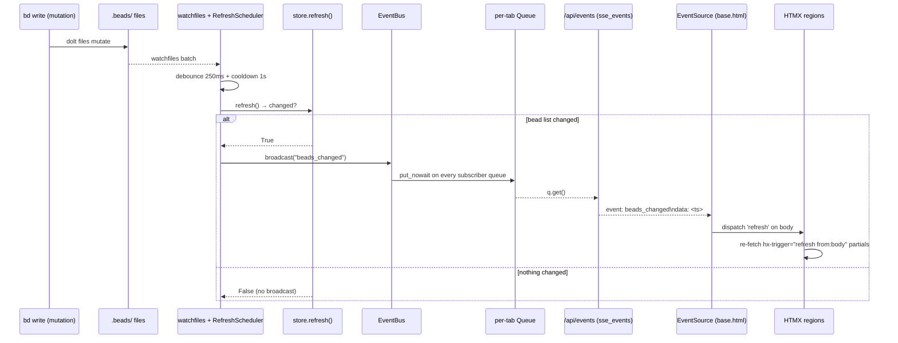
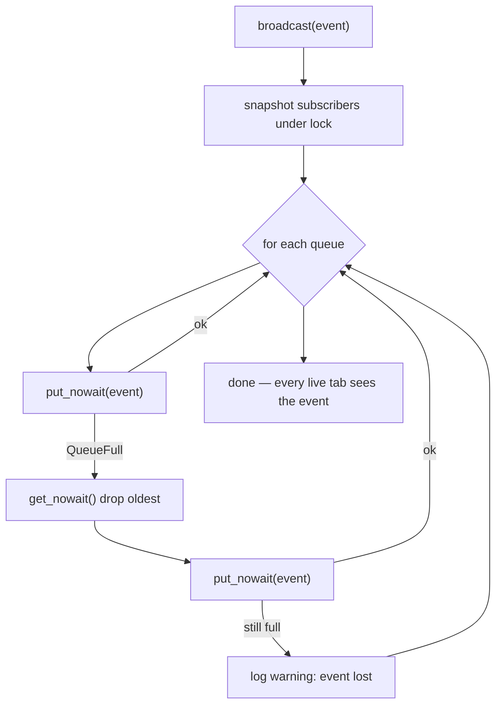

# SSE Event Bus

## What Is It

The SSE Event Bus is bdboard's **in-process pub/sub fan-out** that turns a
single "the workspace changed" signal into a live refresh on every open browser
tab. It is one `EventBus` instance (`bus` in `src/bdboard/app.py`) that owns a
**set of per-subscriber `asyncio.Queue`s** — one queue per open
Server-Sent-Events connection. `EventBus.broadcast("beads_changed")`
(`src/bdboard/events.py`) pushes the same string onto every queue; the
`/api/events` endpoint (`sse_events` in `src/bdboard/app.py`) drains each
subscriber's own queue and writes `text/event-stream` frames down its
long-lived HTTP connection. In the browser, a single `EventSource('/api/events')`
in `base.html` listens for the `beads_changed` event and dispatches a synthetic
`refresh` DOM event on `<body>`, which every region wired with
`hx-trigger="load, refresh from:body"` reacts to by re-fetching its HTML
partial. Reads never broadcast; only state changes do.

There are exactly two things that broadcast `beads_changed`:

1. **The watcher** (the indirect, authoritative path): a `bd` write mutates
   files under `.beads/`, `watchfiles` fires, `RefreshScheduler` debounces and
   runs `store.refresh()`, and **iff the bead list actually changed** it calls
   the wired `broadcast` (`src/bdboard/watcher.py` → `bus.broadcast`).
2. **The four write endpoints** (the optimistic path): `api_memory_create`,
   `api_memory_delete`, `api_formula_pour`, and `api_bead_field_update` each
   broadcast immediately after their `bd` mutation so the **acting** tab updates
   without waiting out the watcher's debounce+cooldown.

## Why This Approach

bdboard is a single-user localhost observer with **no client JS framework and
no polling**. The design goal is "the board reflects `bd` reality within a
second of any change, in every tab, with the least machinery." A tiny
in-process bus hits that target without a message broker, a database table, or
client-side state:

1. **Fan-out needs one queue per consumer.** A single shared queue can only
   hand each item to one consumer — open two tabs and one would steal the
   other's events. Per-subscriber queues let every tab see *every* event
   independently. The cost is O(N) pushes per broadcast, which is trivial at
   our real scale (dozens of tabs, not thousands).
2. **A slow client must never block the broadcaster.** Each queue is bounded
   (`_QUEUE_SIZE = 16`) with a **drop-oldest-on-overflow** policy. If a tab
   falls behind, we lose a stale event rather than back up the watcher task —
   and because every `beads_changed` triggers the *same* full re-fetch, a
   dropped event is only a freshness blip, never a correctness bug. The next
   event re-syncs the UI completely.
3. **SSE over WebSockets/polling.** The data flow is strictly server→client
   ("something changed, go re-fetch"), so the simplex SSE channel is a perfect
   fit: it rides plain HTTP, auto-reconnects with exponential backoff in the
   browser for free, and needs no handshake protocol. Polling would either lag
   or hammer `bd list`; WebSockets would add a bidirectional protocol we never
   use.
4. **The event is a dumb trigger, not a payload.** We broadcast the bare string
   `"beads_changed"`, not a diff. Pushing diffs would couple the bus to every
   view's shape and invite drift between "what the event said" and "what the
   board shows." Instead the event just says *go re-read the source of truth*,
   and HTMX re-fetches the canonical partials. That keeps the bus oblivious to
   what changed (DRY: the rendering logic lives in one place — the endpoints).

## How It Works

The bus is a process-lifetime singleton, created once at module import in
`src/bdboard/app.py`:

```python
bus = EventBus()
```

`EventBus` holds a `set` of queues guarded by an `asyncio.Lock`. A subscriber
is registered via an async context manager so cleanup is automatic when the
connection closes:

```python
@asynccontextmanager
async def subscribe(self) -> AsyncIterator[asyncio.Queue[str]]:
    q: asyncio.Queue[str] = asyncio.Queue(maxsize=_QUEUE_SIZE)
    async with self._lock:
        self._subscribers.add(q)
    try:
        yield q
    finally:
        async with self._lock:
            self._subscribers.discard(q)
```

Broadcasting is non-blocking per subscriber — a full queue drops its oldest
item to make room rather than awaiting:

```python
async def broadcast(self, event: str) -> None:
    async with self._lock:
        subs = list(self._subscribers)
    for q in subs:
        try:
            q.put_nowait(event)
        except asyncio.QueueFull:
            try:
                q.get_nowait()   # drop oldest
            except asyncio.QueueEmpty:
                pass
            try:
                q.put_nowait(event)
            except asyncio.QueueFull:
                log.warning("event bus subscriber queue is hot; event lost")
```

The `/api/events` endpoint subscribes once, emits an immediate `bootstrap`
frame so a freshly-connected tab renders without waiting for the first change,
then alternates between draining the queue and a 15-second heartbeat that keeps
proxies from killing the idle connection:

```python
async def stream():
    async with bus.subscribe() as q:
        yield "event: beads_changed\ndata: bootstrap\n\n"
        while True:
            if await request.is_disconnected():
                break
            try:
                event = await asyncio.wait_for(q.get(), timeout=15.0)
                yield f"event: {event}\ndata: {int(time.time())}\n\n"
            except TimeoutError:
                yield ": heartbeat\n\n"   # comment line; fires no client handler
```

### The wire frames

The bus speaks the SSE `text/event-stream` framing. Three frame shapes cross
the wire (`\n\n` terminates each):

```text
event: beads_changed\ndata: bootstrap\n\n      # one-shot on connect
event: beads_changed\ndata: 1748900000\n\n     # a real change (data = unix ts)
: heartbeat\n\n                                # keep-alive comment, every 15s idle
```

The `data` value is intentionally inert — the browser only cares that a
`beads_changed` event *arrived*, not what it carries. The endpoint sets
`Cache-Control: no-cache` and `X-Accel-Buffering: no` so neither the browser
nor an nginx proxy buffers the stream.

### The client side

A single IIFE in `base.html` owns the one `EventSource` for the whole page and
maps connection state onto the masthead's live indicator:

```javascript
const es = new EventSource('/api/events');
es.addEventListener('open',  () => setStatus('live · push', 'live-on'));
es.addEventListener('error', () => setStatus('reconnecting…', 'live-off'));
es.addEventListener('beads_changed', () => {
  document.body.dispatchEvent(new CustomEvent('refresh'));
});
```

Every live region listens for that bubbled `refresh` and re-fetches itself —
e.g. `dashboard.html`'s counts strip and lanes region, `history.html`'s
history region, and `memory.html`'s memory list all carry
`hx-trigger="load, refresh from:body"`.

### A concrete example

A user clicks **save** on an inline priority edit in the bead modal in **Tab A**
while **Tab B** sits on the board:

1. Tab A POSTs `/api/bead/{id}/field`. `api_bead_field_update` runs the CSRF
   guard, the registry whitelist, the optimistic lock, then `bd update`.
2. The handler calls `await bus.broadcast("beads_changed")` (after refreshing
   the store) — the **optimistic** path. The bus pushes `"beads_changed"` onto
   both Tab A's and Tab B's queues.
3. Both `/api/events` streams pop the event and write
   `event: beads_changed\ndata: <ts>\n\n`. Each tab's `EventSource` fires its
   `beads_changed` handler, dispatches `refresh` on `<body>`, and every
   `refresh from:body` region re-fetches — so **Tab B updates within ~a frame**,
   not after the watcher's debounce.
4. Meanwhile the `bd update` also mutated `.beads/` files. ~1s later the watcher
   debounces, `store.refresh()` runs, finds the bead list already reflects the
   change, and `RefreshScheduler` broadcasts again only **iff** something is
   different. If the optimistic refresh already captured it, the watcher's
   `changed` is `False` and **no redundant broadcast fires** — the two paths
   reconcile rather than double-fire.

### Full pipeline



### Broadcast fan-out & backpressure



### Implementation Map

| Responsibility | File path | Symbol |
| --- | --- | --- |
| The pub/sub bus (one instance per app) | `src/bdboard/events.py` | `EventBus` |
| Fan-out push (drop-oldest on overflow) | `src/bdboard/events.py` | `EventBus.broadcast` |
| Subscription lifecycle (auto-cleanup) | `src/bdboard/events.py` | `EventBus.subscribe` |
| Diagnostics: live subscriber count | `src/bdboard/events.py` | `EventBus.subscriber_count` |
| Per-subscriber queue bound | `src/bdboard/events.py` | `_QUEUE_SIZE` |
| Process-lifetime bus singleton | `src/bdboard/app.py` | `bus = EventBus()` |
| SSE stream endpoint (bootstrap + heartbeat) | `src/bdboard/app.py` | `sse_events` (`GET /api/events`) |
| Watcher → broadcast wiring | `src/bdboard/app.py` | `RefreshScheduler(broadcast=lambda: bus.broadcast("beads_changed"))` |
| Broadcast iff `refresh()` reported change | `src/bdboard/watcher.py` | `RefreshScheduler._settle` (`self._broadcast()`) |
| Optimistic broadcast: memory create | `src/bdboard/app.py` | `api_memory_create` |
| Optimistic broadcast: memory delete | `src/bdboard/app.py` | `api_memory_delete` |
| Optimistic broadcast: formula pour | `src/bdboard/app.py` | `api_formula_pour` |
| Optimistic broadcast: field edit | `src/bdboard/app.py` | `api_bead_field_update` |
| Client subscriber (one per page) | `src/bdboard/templates/base.html` | `new EventSource('/api/events')` |
| Live-status indicator markup | `src/bdboard/templates/base.html` | `#live-dot`, `#live-status` |
| Board regions that re-fetch on `refresh` | `src/bdboard/templates/dashboard.html`, `src/bdboard/templates/partials/lanes.html` | `hx-trigger="load, refresh from:body"` |
| History/Memory regions that re-fetch | `src/bdboard/templates/history.html`, `src/bdboard/templates/memory.html` | `hx-trigger="load, refresh from:body"` |
| SSE-broadcast regression coverage | `tests/test_memory_mutations.py` | `test_create_memory_broadcasts_sse_on_success`, `test_delete_memory_broadcasts_sse_on_success` |

### Configuration

| Key | Default | Effect |
| --- | --- | --- |
| `_QUEUE_SIZE` (`src/bdboard/events.py`) | `16` | Per-subscriber queue depth; a tab more than 16 events behind starts dropping its oldest (lossy but safe). |
| heartbeat timeout (`sse_events`) | `15.0` s | Idle interval before a `: heartbeat\n\n` comment is sent to keep proxies/LBs from closing the stream. |
| `WATCHER_DEBOUNCE_S` (`src/bdboard/app.py`) | `0.25` s | Quiet-window that collapses one `bd` write's file burst into a single refresh before the watcher path can broadcast. |
| `WATCHER_COOLDOWN_S` (`src/bdboard/app.py`) | `1.0` s | Post-refresh suppression window that paces the watcher broadcast cadence under a write storm. |

## Where Used

- **Live Updates** ([Features index](../Features/index.md)) — the feature whose
  entire promise (every tab reflects `bd` reality with no reload) is delivered
  by this bus.
- **Memory Curation** ([Features index](../Features/index.md)) — both
  `bd remember` and `bd forget` end with `bus.broadcast("beads_changed")`.
- **Formula Pour** ([Features index](../Features/index.md)) — the pour endpoint
  refreshes the store then broadcasts so the acting tab shows new beads
  immediately.
- **Manual Field Editing** ([Features index](../Features/index.md)) — every
  successful field write broadcasts on the optimistic path.
- **SSE Live Update** ([SSE Live Update](../Flows/SseLiveUpdate.md)) — the flow that traces
  a single change from broadcast to the browser re-fetch.
- **Watcher Refresh Cycle** ([Flows index](../Flows/index.md)) — the upstream
  flow whose terminal step is *broadcast iff changed*.
- **GET /api/events** ([GET /api/events](../Endpoints/GetApiEvents.md)) — the endpoint
  that is the bus's sole subscriber surface to the browser.
- **Filesystem Watcher** ([Filesystem Watcher](FilesystemWatcher.md)) — the authoritative
  trigger that decides when the watcher path broadcasts.
- **Store Snapshot & Change Detection** ([Store Snapshot & Change Detection](StoreSnapshotChangeDetection.md)) — supplies
  the `changed` boolean that gates the watcher broadcast.
- **CSRF Protection** ([CSRF Protection](CsrfProtection.md)) — the guard that
  fronts each of the four write paths *before* they reach their optimistic
  `bus.broadcast`.

## Conventions

> [!IMPORTANT]
> - **Broadcast the bare `"beads_changed"` string, never a payload.** The event
>   is a *go re-read* trigger; the canonical data comes from re-fetching the
>   HTMX partial. Don't smuggle diffs through the bus — that recouples it to
>   every view's shape.
> - **One bus, one EventSource.** There is exactly one `EventBus` singleton
>   (`bus`) and exactly one `EventSource('/api/events')` per page. Don't open a
>   second stream per region — fan-out happens server-side via per-subscriber
>   queues.
> - **Subscribe only via the `subscribe()` context manager.** It registers and
>   *guarantees* removal of the queue on disconnect; never add to
>   `_subscribers` by hand.
> - **Write paths broadcast AFTER the mutation (and after `store.refresh()`
>   where the view reads cache).** The pour and field paths refresh the store
>   first so the optimistic re-fetch sees fresh data instead of racing the
>   watcher.
> - **Let the watcher gate its broadcast on `changed`.** The watcher path only
>   broadcasts when `store.refresh()` reports a real change, so it reconciles
>   with (rather than duplicates) the optimistic broadcast.

## Anti-Patterns

> [!CAUTION]
> - **Don't make `broadcast` block on a slow subscriber.** The drop-oldest
>   policy exists precisely so one stuck tab can't back up the watcher task.
>   Never replace `put_nowait` with an awaiting `put` — that reintroduces
>   head-of-line blocking on the broadcaster.
> - **Don't use a single shared queue for fan-out.** One queue means one
>   consumer wins each item and other tabs go dark. Keep the per-subscriber
>   queue set.
> - **Don't add a write path that mutates `bd` without a broadcast.** A new
>   `POST`/`DELETE` that forgets `bus.broadcast("beads_changed")` leaves the
>   acting tab stale until the watcher happens to catch up — a silent freshness
>   regression for that one endpoint.
> - **Don't treat a dropped event as data loss.** Because every event triggers
>   the same full re-fetch, a dropped frame is a freshness blip the next event
>   heals. Don't add per-event acknowledgements or replay buffers this app
>   doesn't need (YAGNI).
> - **Don't remove the heartbeat.** The 15s `: heartbeat` comment is what keeps
>   proxies and load balancers from culling the idle long-lived stream; without
>   it live-sync silently dies behind a reverse proxy.

## Related

- [Concepts index](index.md) — the other cross-cutting concepts.
- [Filesystem Watcher](FilesystemWatcher.md) — the upstream trigger for the watcher
  broadcast path.
- [Store Snapshot & Change Detection](StoreSnapshotChangeDetection.md) — supplies the `changed` gate
  that dedups this bus's broadcast.
- [CSRF Protection](CsrfProtection.md) — the guard each write path passes before
  its optimistic broadcast.
- [Features index](../Features/index.md) — Live Updates, Memory Curation,
  Formula Pour, Manual Field Editing.
- [Flows index](../Flows/index.md) — SSE Live Update, Watcher Refresh Cycle,
  [Field Edit Write Path](../Flows/FieldEditWritePath.md).
- [Endpoints index](../Endpoints/index.md) — [GET /api/events](../Endpoints/GetApiEvents.md), plus the four
  write endpoints that broadcast, including
  [POST /api/formulas/{name}/pour](../Endpoints/PostApiFormulaPour.md).
- [Memory (/memory)](../Views/MemoryView.md) — the view whose list re-fetches on
  every `beads_changed` (`refresh from:body`) and whose writes broadcast.
- [Back to docs index](../index.md)
