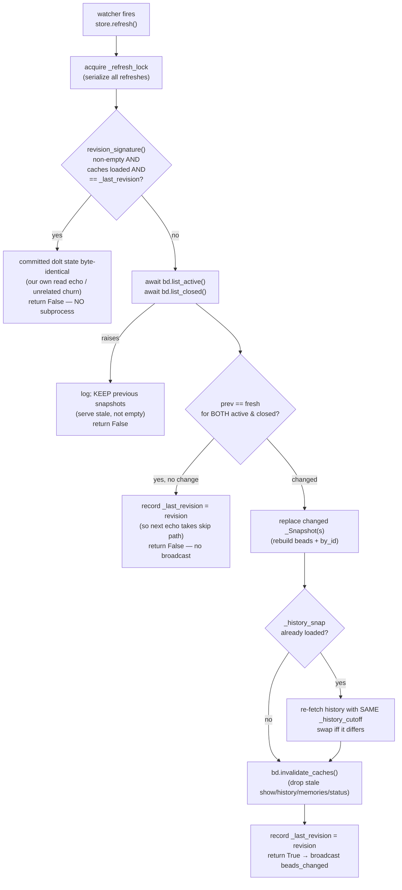

# Store Snapshot Cache (& change detection)

## What Is It

`Store` ([`src/bdboard/store.py`](../../src/bdboard/store.py)) is bdboard's
**in-memory cache of bead snapshots** plus the **change-detection** logic that
decides whether a re-read of `bd` actually altered anything. It sits between the
[`bd list --json`](BdCliSourceOfTruth.md) subprocess wrapper
([`BdClient`](../../src/bdboard/bd.py)) and every HTTP route in
[`app.py`](../../src/bdboard/app.py): routes read from RAM (fast, lock-free),
and the only thing that ever re-populates that RAM is `Store.refresh()`, which
the [watcher](WatcherScheduling.md) calls when `.beads/` changes.

It does two jobs:

1. **Cache** — hold the last-known-good bead lists in memory so a
   `/api/lanes`, `/api/counts`, or `/` render is a dict read, not a ~700ms
   subprocess that piles up against bd's dolt single-writer lock. The cache is
   **three-way** (active / board-closed / history-closed, see
   [How It Works](#how-it-works)) so the fast initial paint never pays for the
   long closed table, and lazy-loaded so nothing is fetched until first asked.
2. **Change detection** — on every refresh, compare the freshly-fetched lists
   against the cached ones with structural equality (`==`) and return `True`
   **iff** something actually changed. That boolean is the dedup signal that
   gates the [`beads_changed`](../Endpoints/SseEvents.md) SSE broadcast, so the
   board only re-swaps partials on a *real* mutation — not on every filesystem
   tremor.

The whole concept exists to make ["a `bd` write the user can see, and nothing
else, triggers exactly one UI refresh"](../Flows/LiveRefreshPipeline.md) true
while keeping reads instant.

## Why This Approach

bdboard is a pure, **read-mostly observer** of a `bd` workspace. The naive
design — "every HTTP route shells `bd list --json` on demand" — falls over in
three measured ways that this cache-plus-diff design each answer directly:

- **Subprocess cost per request.** A `bd list --json` on a real workspace is
  ~700ms (process spawn + dolt read + JSON serialize). The board fires several
  of these per page (`/api/lanes`, `/api/lanes/closed`, `/api/counts`,
  bead-modal fs). Serving them from a RAM snapshot turns each into a
  microsecond dict access. The cache lazy-loads once, then the watcher keeps it
  warm.
- **dolt single-writer lock contention.** `bd` is dolt-backed and serializes
  writes through one lock; a fan of concurrent `bd list` subprocesses competes
  with each other and with real writes. `Store` funnels *all* refreshes through
  a single `asyncio.Lock` (`_refresh_lock`), so a burst of watcher events — or a
  watcher event racing a lazy load — collapses into **one** `bd list` call, not
  N parallel ones.
- **Broadcast storms.** The watcher fires on filesystem churn that often does
  **not** change any bead (dolt's own internal writes, a memory-only
  `bd remember`, or — the nasty one — the noms/ jiggle from *our own* read-only
  `bd list`). Without a content diff, every tremor would broadcast and every
  client would re-fetch every partial. Structural equality answers "did any
  issue field change" cheaply, and a manifest-root-hash **revision skip** avoids
  even spawning the subprocess when the committed dolt state is byte-identical to
  the last refresh (the [self-feedback loop-breaker](WatcherScheduling.md)).

Structural equality is the right diff because `bd list --json` returns a
**deterministically-sorted** list of dicts: Python's `==` compares lists/dicts
recursively, so `prev == new` directly answers "did anything change" in O(n) —
no field-by-field special-casing, and cheap for expected workspace sizes. The
[derive layer](DeriveLayer.md)'s determinism is what makes this safe: identical
input always shapes to identical output, so a no-op refresh never spuriously
broadcasts.

> [!NOTE]
> This concept describes *behavior*. The three-cache split and its motivating
> beads are recorded in `bdboard-zdz` (active/closed split), `bdboard-0yy`
> (lazy-load the closed lane), `bdboard-p8v` (board-closed window == header KPI),
> `bdboard-a194` (History is count-uncapped), and `bdboard-gp06` (History is
> window-bounded + window-aware cache). The revision-skip loop-breaker is
> `bdboard-ywep`. See also [Architecture](../Architecture.md) → "Live-refresh
> pipeline".

## How It Works

There is one cache record type, three cache slots, a serializing lock, a
revision oracle, and one diff-and-dedup refresh path. Reads lazy-load their slot
on first touch; the watcher's `refresh()` keeps every populated slot warm.

### The three caches

| Cache slot (`Store` field) | Holds | Fetched by | Bound | Powers | Bead |
| --- | --- | --- | --- | --- | --- |
| `_active_snap` | open / in_progress / blocked / deferred issues (~5KB) | `bd.list_active()` | none (all active) | `/api/lanes` fast first paint, header counts | `bdboard-zdz` |
| `_closed_snap` | closed issues inside the board's date window | `bd.list_closed()` | `BOARD_CLOSED_WINDOW_DAYS` (date) | Closed lane **and** the header CLOSED KPI (so the two agree) | `bdboard-0yy`, `bdboard-p8v` |
| `_history_snap` | the long-window closed record for the History page | `bd.list_closed_history()` | `closed_after` cutoff (date), **never count-capped** | `/api/history` | `bdboard-a194`, `bdboard-gp06` |

Each slot is a `_Snapshot` dataclass — the bead list plus a pre-indexed `by_id`
map so `bead(id)` lookups are O(1) instead of a linear scan:

```python
@dataclass
class _Snapshot:
    beads: list[dict[str, Any]]            # the raw bd list --json dicts, as returned
    by_id: dict[str, dict[str, Any]]       # {bead["id"]: bead} for O(1) bead(id) lookups
```

The cached bead dicts are the **raw** `bd list --json` records — bdboard never
reshapes them on the way in (that is the [derive layer](DeriveLayer.md)'s job at
read time). The fields callers downstream depend on include:

```json
{
  "id": "bdboard-mol-bfs.22",
  "title": "Concept: Store snapshot cache & change detection",
  "status": "in_progress",
  "issue_type": "task",
  "priority": 2,
  "assignee": "Aaron Weegens",
  "created_by": "Aaron Weegens",
  "created_at": "2026-06-04T00:00:00Z",
  "started_at": "2026-06-04T00:00:00Z",
  "updated_at": "2026-06-04T00:00:00Z",
  "closed_at": null,
  "dependencies": []
}
```

### Internal state (the change-detection contract)

```python
self._active_snap:   _Snapshot | None              # active cache (None == not loaded yet)
self._closed_snap:   _Snapshot | None              # board-closed cache
self._history_snap:  _Snapshot | None              # history-closed cache
self._history_cutoff: datetime | None              # closed_after the history cache was fetched with
                                                   #   (None == unbounded "all" fetch) — powers window-aware reuse
self._last_revision: frozenset[tuple[str, bytes]] | None  # dolt manifest root-hash sig at last refresh
self._refresh_lock:  asyncio.Lock                  # serializes refresh()/loads → exactly one bd list at a time
```

### The refresh decision path



### Concrete example — a field edit, then the watcher echo

1. You inline-edit a bead's priority in the modal. The
   [field-edit write path](../Flows/FieldEditWritePath.md) shells the `bd update`,
   then calls `await store.refresh()` **before** broadcasting so the HTMX
   re-fetch sees fresh data (app.py, the refresh-before-broadcast at the POST
   `/api/bead/{id}/field` handler).
2. `refresh()` takes the lock. `revision_signature()` differs from
   `_last_revision` (a real write bumped the dolt root hash), so the skip path
   is **not** taken. `bd.list_active()` + `bd.list_closed()` run.
3. The active list now differs (`prev_active != fresh_active`), so `_active_snap`
   is rebuilt (new `beads` + `by_id`), `bd.invalidate_caches()` drops the stale
   `bd show`/`bd history` detail caches, `_last_revision` is recorded, and
   `refresh()` returns `True`. The handler broadcasts `beads_changed`; every
   `hx-trigger="refresh from:body"` region re-fetches its partial and the new
   priority appears.
4. ~1.3s later the watcher fires **again** — dolt re-touched `noms/` for *our
   own* `bd list` read in step 2. `refresh()` runs, but now
   `revision_signature()` is byte-identical to `_last_revision`, so it takes the
   **skip path**: no subprocess, returns `False`, no broadcast. The
   read→event→refresh loop is severed right there.

### Access patterns

| Method | Returns | Lazy-loads | Hot path / caller |
| --- | --- | --- | --- |
| `snapshot_active()` | active issues only (~5KB) | `_load_active()` on first call | `/api/lanes` fast first paint (app.py) |
| `snapshot_closed()` | board-closed issues only | `_load_closed()` on first call | `/api/lanes/closed` background load |
| `snapshot()` | active + board-closed | `refresh()` if either missing | `/api/counts`, bead-modal cached fallback |
| `snapshot_history(closed_after)` | active + history-closed, bounded by `closed_after` | active + `_load_history()` on first/uncovered call | `/api/history` |
| `refresh()` | `bool` — `True` iff beads changed | re-fetches all populated caches | the [watcher](WatcherScheduling.md); refresh-before-broadcast on writes |
| `bead(id)` | single bead dict or `None` (sync) | no (reads existing `by_id`) | bead-modal fallback when live `bd show` fails |

### Window-aware history reuse

The History cache is the one slot with a non-trivial reuse rule. It is fetched
with `--closed-after <cutoff>` (the page's range / custom-date lower bound, or
`None` for the unbounded "all" view), and `_history_covers(requested_cutoff)`
decides whether a request can be served from cache without re-querying `bd`:

- an **unbounded** cache (`_history_cutoff is None`) covers any request;
- a **bounded** cache covers a request only when the request is also bounded and
  its bound is **no earlier** (`_history_cutoff <= requested_cutoff`) — i.e. a
  sub-window of what we already hold;
- an **unbounded request** (`None`) is *not* covered by a bounded cache → re-query.

Serving a wider superset is correct because the [derive layer](DeriveLayer.md)
re-applies the exact bounds at read time; reuse merely avoids a redundant `bd`
query (`bdboard-gp06`). On a watcher `refresh()`, the history slot is re-fetched
with the **same** `_history_cutoff` it currently holds — never silently widened
to unbounded — and only if it was already lazy-loaded (no point paying for a
long-window fetch nobody has asked for yet).

### Implementation map

| Responsibility | File path | Symbol |
| --- | --- | --- |
| The cache + change-detection object | `src/bdboard/store.py` | `Store` |
| One cached list + its `by_id` index | `src/bdboard/store.py` | `_Snapshot` |
| Active fast-path read (lazy) | `src/bdboard/store.py` | `Store.snapshot_active` |
| Board-closed background read (lazy) | `src/bdboard/store.py` | `Store.snapshot_closed` |
| Active + board-closed read (lazy) | `src/bdboard/store.py` | `Store.snapshot` |
| Window-bounded History read (lazy, window-aware) | `src/bdboard/store.py` | `Store.snapshot_history` |
| Window-coverage check (cache reuse rule) | `src/bdboard/store.py` | `Store._history_covers` |
| Lazy loaders (lock + double-check) | `src/bdboard/store.py` | `Store._load_active`, `_load_closed`, `_load_history` |
| Refresh: revision-skip + diff + dedup broadcast signal | `src/bdboard/store.py` | `Store.refresh` |
| O(1) cached single-bead lookup (sync) | `src/bdboard/store.py` | `Store.bead` |
| Active list fetch (`bd list --limit 0`) | `src/bdboard/bd.py` | `BdClient.list_active` |
| Board-closed fetch (`--closed-after`, date-windowed) | `src/bdboard/bd.py` | `BdClient.list_closed` |
| History-closed fetch (count-uncapped, window-bounded) | `src/bdboard/bd.py` | `BdClient.list_closed_history` |
| Content fingerprint for the revision skip | `src/bdboard/bd.py` | `BdClient.revision_signature` |
| Drop stale show/history/memories/status detail caches | `src/bdboard/bd.py` | `BdClient.invalidate_caches` |
| Board-closed window constant | `src/bdboard/derive/lanes.py` | `BOARD_CLOSED_WINDOW_DAYS` |
| Constructs `Store(bd)`; wires `refresh=store.refresh` into the watcher | `src/bdboard/app.py` | `create_app`, `_watch_beads` |
| Refresh-before-broadcast on the inline-edit write path | `src/bdboard/app.py` | the `POST /api/bead/{id}/field` handler |

### Failure & edge handling

| Trigger | Behavior | Result |
| --- | --- | --- |
| `bd list` raises mid-`refresh()` (transient hiccup) | Logged; snapshots **not** mutated; returns `False` | Serves last-known-good data — never flashes empty (`store.refresh` `except`) |
| `bd list_active` raises during a lazy `_load_active()` | Logged; that cache stays empty; returns `[]` | The other caches/paths are unaffected |
| Watcher fires but no issue field changed (dolt-internal write, `bd remember`) | `prev == fresh` → records `_last_revision`, returns `False` | No broadcast; next identical-state echo can take the cheap skip path |
| Watcher fires for our own read-only `bd list` echo | `revision_signature() == _last_revision` (+ caches loaded) → skip subprocess | Loop severed; `False`, no broadcast (`bdboard-ywep`) |
| Empty `revision_signature()` (legacy JSONL-only workspace) | Skip path never taken — "no signal" means "always refresh" | Live-sync still works where there is no dolt signal |
| Burst of watcher events / event racing a lazy load | `_refresh_lock` serializes them | Exactly one `bd list` runs; no dolt-lock pile-up |
| History request narrower than the cached window | `_history_covers()` returns `True` | Served from cache; no redundant `bd` query (`bdboard-gp06`) |
| History request reaches further back than cached | `_history_covers()` returns `False` → `_load_history()` re-queries | Wider window fetched with the lower (or absent) bound |
| `bead(id)` called before any snapshot loaded | Both `by_id` maps are `None` → returns `None` | Caller (modal fallback) degrades gracefully to the live/error path |

## Where Used

- **Flows:**
  [LiveRefreshPipeline](../Flows/LiveRefreshPipeline.md) — `Store.refresh`'s
  `True/False` return is the change-dedup that gates the broadcast at the center
  of that pipeline;
  [FieldEditWritePath](../Flows/FieldEditWritePath.md) — calls `store.refresh()`
  *before* broadcasting so the HTMX re-fetch can't race ahead of the cache;
  [ServerStartup](../Flows/ServerStartup.md) — `create_app` builds the `Store`
  and the `lifespan`/`_watch_beads` task wires `refresh=store.refresh`.
- **Features:**
  [LiveAutoRefresh](../Features/LiveAutoRefresh.md) — the "board updates itself"
  behavior the change-detection makes correct and non-flickery;
  [SwimLaneBoard](../Features/SwimLaneBoard.md) — reads the active + board-closed
  snapshots;
  [HistoryAndTrends](../Features/HistoryAndTrends.md) — reads the window-bounded
  history snapshot.
- **Endpoints:**
  [LanesApi](../Endpoints/LanesApi.md) — `snapshot_active`/`snapshot_closed`;
  [HistoryApi](../Endpoints/HistoryApi.md) — `snapshot_history`;
  [BeadDetailApi](../Endpoints/BeadDetailApi.md) — `snapshot()` + `bead(id)`
  cached fallback;
  [SseEvents](../Endpoints/SseEvents.md) — the `beads_changed` stream a `True`
  refresh broadcasts on.
- **Views:**
  [BoardPage](../Views/BoardPage.md) — reads `snapshot_active` (lanes/strip/
  activity), `snapshot_closed` (closed lane), and `snapshot()` (counts strip);
  [HistoryPage](../Views/HistoryPage.md) — reads the window-bounded
  `snapshot_history` cache for its closed list, charts, and KPIs.
- **Related concepts:**
  [BdCliSourceOfTruth](BdCliSourceOfTruth.md) — `Store` caches the output of
  `bd list --json`, and its read-only-yet-file-touching nature is why the
  revision-skip exists;
  [WatcherScheduling](WatcherScheduling.md) — owns the timing that decides *when*
  `refresh()` runs; this concept owns *what `refresh()` does* and the revision
  oracle it consults;
  [DeriveLayer](DeriveLayer.md) — re-shapes each cached snapshot at read time;
  its deterministic output is what lets `refresh()` dedup with `==`;
  [HtmxPartialsArchitecture](HtmxPartialsArchitecture.md) — the
  `refresh from:body` re-swaps a `True` refresh ultimately triggers.

## Conventions

> [!IMPORTANT]
> **The cache is read-mostly: routes READ snapshots, only `refresh()` WRITES
> them.** HTTP handlers must call `snapshot_*()`/`bead()` and never re-shell
> `bd list` themselves. The single write path keeps the dolt lock uncontended
> and the change-detection diff meaningful.

> [!IMPORTANT]
> **Refresh the store BEFORE broadcasting on an in-app write.** A `bd update`
> from the UI must `await store.refresh()` *then* broadcast `beads_changed`. If
> you broadcast first, the client's HTMX re-fetch races ahead of the
> watcher→refresh cycle and reads stale cache (app.py field-edit handler).

> [!IMPORTANT]
> **Diff with structural `==` against the deterministically-sorted bd output.**
> `bd list --json` is stably ordered, so `prev == fresh` is a correct, O(n)
> "did anything change". Don't replace it with field-by-field comparison or a
> set/hash that loses ordering — and don't sort/mutate the cached list, or the
> diff (and the derive layer's determinism) breaks.

> [!IMPORTANT]
> **Only a real content change rebuilds a snapshot; record `_last_revision` on
> every settled refresh.** Set `_last_revision = revision` both when something
> changed and when nothing did, so the next echo can take the cheap skip path.
> Never record it on the `bd list` *failure* path (that would skip a real
> pending change).

> [!IMPORTANT]
> **On `bd list` failure, keep the previous snapshot.** A blank board with no
> explanation is worse than slightly-stale data plus a grep-able log line.
> `refresh()` and the lazy loaders all leave caches intact on exception.

> [!IMPORTANT]
> **Re-fetch History with the cutoff it already holds — never silently widen
> it.** On a watcher refresh, pass `self._history_cutoff` back to
> `list_closed_history`, and only touch the slot if it was already loaded.
> Widening to unbounded would slurp the whole closed table on every refresh.

## Anti-Patterns

> [!CAUTION]
> **Don't shell `bd list --json` per HTTP request.** Each call is ~700ms and
> contends on dolt's single-writer lock; doing it per route makes the board
> sluggish and starves real writes. Read the cache; let the watcher keep it
> warm.

> [!CAUTION]
> **Don't broadcast on every watcher fire.** Most fires change no bead (dolt
> internals, `bd remember`, or our own read echo). Broadcasting unconditionally
> makes every client re-fetch every partial on idle FS churn. Gate the broadcast
> on `refresh()` returning `True`.

> [!CAUTION]
> **Don't use mtime/inode to decide "did the data change".** The watched
> `journal.idx`/`noms/` churn on read-only `bd list`, so a timestamp- or
> inode-based oracle mistakes our own echo for a write and never breaks the loop.
> Compare the dolt `manifest` **content** via `revision_signature()`.

> [!CAUTION]
> **Don't let lazy loads or refreshes run concurrently without the lock.**
> Dropping `_refresh_lock` lets a watcher burst (or an event racing a lazy load)
> fire N parallel `bd list` subprocesses that pile up against the dolt lock and
> may clobber each other's snapshot writes.

> [!CAUTION]
> **Don't count-cap the History fetch.** A static `--limit N` truncates to the
> newest N closures and makes anything older permanently unreachable regardless
> of filters (`bdboard-a194`). Bound History by *window* (`closed_after`), never
> by count.

> [!CAUTION]
> **Don't forget to `bd.invalidate_caches()` after a real change.** The
> `bd show`/`bd history`/memories/status detail caches outlive a mutation; skip
> the invalidation and the next modal click serves pre-mutation values.

## Related

- [Architecture](../Architecture.md) — system diagram (the `store.py — Store`
  node) and the "Live-refresh pipeline" walkthrough this cache sits inside.
- [Concepts index](index.md) — sibling cross-cutting concepts.
- [Manifest](../_Manifest.md) — catalog of every documented item.
- [BdCliSourceOfTruth](BdCliSourceOfTruth.md) — the `bd list --json` output this
  caches.
- [WatcherScheduling](WatcherScheduling.md) — decides *when* `refresh()` runs and
  shares the revision-signature loop-breaker.
- [DeriveLayer](DeriveLayer.md) — shapes each cached snapshot at read time.
- [HtmxPartialsArchitecture](HtmxPartialsArchitecture.md) — the partial re-swaps a
  `True` refresh triggers.
- [LiveRefreshPipeline](../Flows/LiveRefreshPipeline.md) — the end-to-end flow the
  change-dedup gates.
- [FieldEditWritePath](../Flows/FieldEditWritePath.md) — the write path that
  refreshes before broadcasting.
- [BeadFieldEditApi](../Endpoints/BeadFieldEditApi.md) — the field-edit endpoint
  whose `fresh=True` re-read and post-edit re-render depend on this cache's
  invalidation.
- [LanesApi](../Endpoints/LanesApi.md) · [HistoryApi](../Endpoints/HistoryApi.md)
  · [BeadDetailApi](../Endpoints/BeadDetailApi.md) — endpoints that read the
  caches.
- [SseEvents](../Endpoints/SseEvents.md) — the stream a `True` refresh broadcasts
  on.
