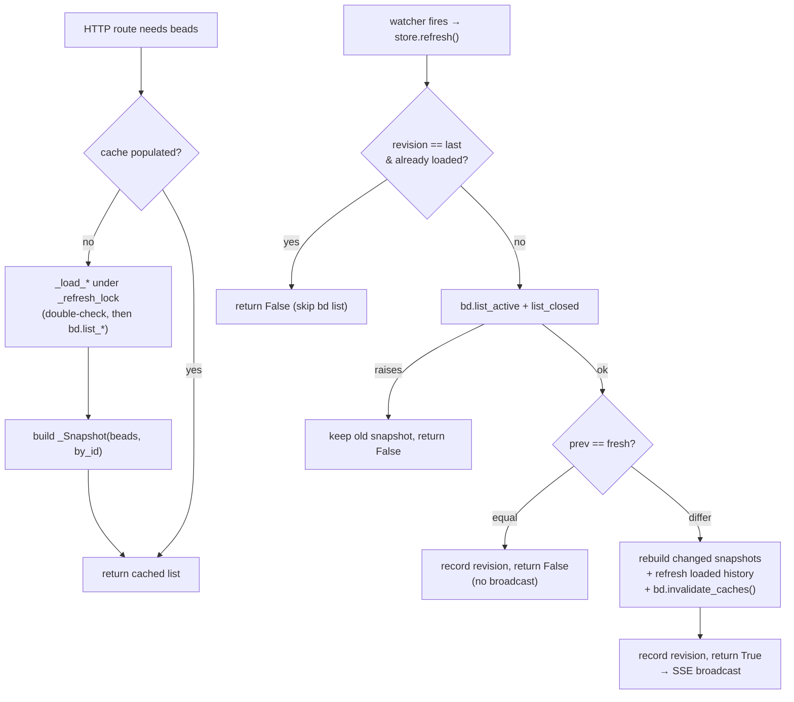
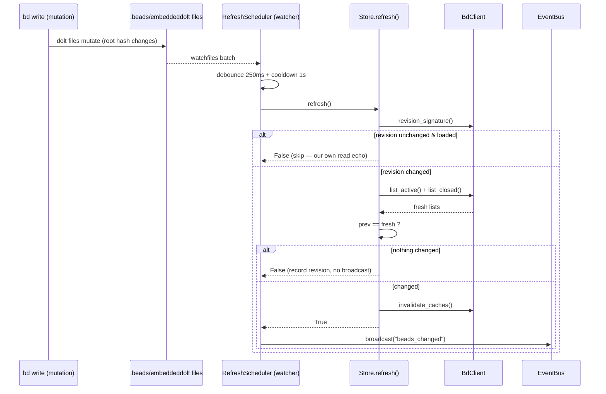

# Store Snapshot & Change Detection

## What Is It

The Store is bdboard's **in-memory cache of bead lists with change detection**.
It is one `Store` instance (`store = Store(bd)` in `src/bdboard/app.py`) that
wraps the subprocess `BdClient` and keeps the last-known-good output of
`bd list --json` in process memory so HTTP routes read RAM instead of shelling
out on every request. `Store` (`src/bdboard/store.py`) holds **three
independent snapshot caches** — active, board-closed, and history-closed — each
an immutable `_Snapshot` dataclass of `beads: list[dict]` plus a pre-built
`by_id: dict[str, dict]` index for O(1) single-bead lookups.

Reads are **lazy**: `snapshot_active()`, `snapshot_closed()`, `snapshot()`, and
`snapshot_history(closed_after)` each populate their cache on first call and
return the cached list thereafter. Writes are driven from the *outside*: the
filesystem watcher calls `Store.refresh()` after a `bd` mutation. `refresh()`
re-fetches all populated caches, compares the fresh lists against the previous
ones with plain structural equality (`prev == new`), and returns a single
`bool` — `True` iff something actually changed. That boolean is the **change
detection** half of the name: it gates the SSE broadcast so a watcher fire that
didn't alter any issue state never triggers a browser re-fetch.

Two cheap guards keep `refresh()` from doing pointless work:

1. **Revision skip** (`bdboard-ywep`): before paying for `bd list`, `refresh()`
   compares the dolt manifest root-hash signature (`bd.revision_signature()`)
   against the last one it refreshed at. If the committed dolt state is
   byte-identical, the database can't have changed, so it skips the subprocess
   entirely and reports "no change". This breaks the refresh→read→event→refresh
   self-feedback loop that a read-only `bd list` would otherwise spin forever.
2. **Window coverage** (`bdboard-gp06`): the history cache is *window-aware* — a
   cached snapshot fetched with a lower (or absent) `--closed-after` bound
   already covers any narrower sub-window, so `snapshot_history()` only
   re-queries `bd` when the request reaches further back than what is held.

## Why This Approach

bdboard is a single-user localhost **observer** over the `bd` (beads) CLI, which
is backed by a Dolt database under a single-writer lock. The design goal is "the
board renders instantly and reflects `bd` reality within ~a second of any
change, without hammering the CLI." A subprocess `bd list --json` costs roughly
700 ms and contends with the dolt writer lock; doing it on every `/`,
`/api/lanes`, and `/api/counts` render would make the board sluggish and starve
real writes. An in-memory snapshot cache hits the target with minimal
machinery:

1. **Read RAM, not a subprocess.** The hot paths (`/api/lanes`, `/api/counts`)
   are read-mostly and fire constantly. Serving them from a cached list turns a
   ~700 ms subprocess into a dict lookup; the cache only refills when the
   watcher says the underlying data moved.

2. **Split caches enable lazy first paint.** The board's first paint
   (`/api/lanes`) needs only **active** issues (~5 KB), so `snapshot_active()`
   is a separate cache that loads alone and fast. The Closed lane and its
   matching header KPI come from a **board-closed** cache that loads in the
   background (`/api/lanes/closed`). The long-window **history-closed** cache is
   a third, independent path that only pays its (potentially large) fetch when
   the History page actually asks. Three caches means each surface pays only for
   the data it shows (`bdboard-zdz`, `bdboard-0yy`, `bdboard-p8v`).

3. **Structural equality is the cheapest correct change test.** `bd list --json`
   returns a deterministically-sorted list of dicts, so Python's `==` compares
   them structurally and directly answers "did any issue field change". It is
   O(n) and trivially cheap at our workspace sizes — no per-field diffing, no
   hashing scheme, no change-log table. The resulting `bool` deduplicates SSE
   broadcasts so idle watcher churn never re-renders the browser.

4. **The revision skip avoids a self-inflicted infinite loop.** A read-only
   `bd list` itself re-touches dolt's `noms/` files (new inode, bumped mtime),
   so the watcher fires for *our own read*. Comparing the manifest *content*
   (root hash) — which only flips on a real write — lets `refresh()`
   distinguish "dolt actually changed" from "our read jiggled the files" and
   skip the expensive subprocess, which is what stops the loop (`bdboard-ywep`).

5. **Window-aware history avoids slurping the whole closed table.** A naive
   History fetch would read every closed bead ever on each snapshot. Pushing
   the active range's lower bound down to `--closed-after`, and reusing a wider
   cached window for narrower sub-windows, keeps a 7-day view from paying for an
   all-time read (`bdboard-gp06`, `bdboard-a194`).

## How It Works

### The three caches

| Cache | Field | Filled by | Fetched via | Bound | Powers |
| --- | --- | --- | --- | --- | --- |
| Active | `_active_snap` | `_load_active()` | `bd.list_active()` | none (all open/in_progress/blocked/deferred) | `/api/lanes` first paint, header counts, bead-lookup fallback |
| Board-closed | `_closed_snap` | `_load_closed()` | `bd.list_closed()` | date window `BOARD_CLOSED_WINDOW_DAYS` (3) via `--closed-after` | `/api/lanes/closed` (Closed lane) + header CLOSED KPI |
| History-closed | `_history_snap` | `_load_history()` | `bd.list_closed_history(closed_after)` | window-bounded (`_history_cutoff`), count-uncapped (`--limit 0`) | `/api/history` (History page) |

Each cache is a frozen-at-build `_Snapshot`:

```python
@dataclass
class _Snapshot:
    beads: list[dict[str, Any]]
    by_id: dict[str, dict[str, Any]]  # pre-indexed for O(1) bead(id) lookups
```

### Read paths (lazy load)

The four public readers populate-then-return. The active reader is the
canonical shape:

```python
async def snapshot_active(self) -> list[dict[str, Any]]:
    if self._active_snap is None:
        await self._load_active()
    return self._active_snap.beads if self._active_snap else []
```

- `snapshot_active()` → active only (fast path, lazy via `_load_active`).
- `snapshot_closed()` → board-closed only (background, lazy via `_load_closed`).
- `snapshot()` → `active + board-closed` (lazy-loads both via `refresh()` when
  either is cold); used by header counts and the bead-modal fallback.
- `snapshot_history(closed_after)` → `active + history-closed`, bounded by
  `closed_after`; re-queries when `_history_covers(closed_after)` is False.

The lazy loaders take the shared `_refresh_lock` and double-check the cache
after acquiring it, so a burst of concurrent first-callers results in exactly
one `bd list` rather than N piling up against dolt's lock:

```python
async def _load_active(self) -> None:
    async with self._refresh_lock:
        if self._active_snap is not None:
            return  # another coroutine loaded while we waited
        try:
            fresh = await self.bd.list_active()
        except Exception:
            log.exception("store: bd list_active failed; active cache stays empty")
            return
        self._active_snap = _Snapshot(
            beads=fresh,
            by_id={b["id"]: b for b in fresh if isinstance(b.get("id"), str)},
        )
```

### History window

`_history_covers()` decides whether the cached history snapshot already
satisfies a request without a re-query. The cache was fetched with
`--closed-after self._history_cutoff` (`None` == unbounded "all"):

```python
def _history_covers(self, requested_cutoff: datetime | None) -> bool:
    if self._history_snap is None:
        return False                       # nothing cached yet
    if self._history_cutoff is None:
        return True                        # unbounded cache covers any request
    if requested_cutoff is None:
        return False                       # bounded cache can't serve "all"
    return self._history_cutoff <= requested_cutoff   # request is a sub-window
```

A wider cached window is a correct superset for any narrower request because the
derive layer re-applies the exact bounds in memory — serving the superset just
skips a redundant `bd` query.

### The write path: `refresh()` and change detection

The watcher calls `refresh()`. It is the only mutator of the caches and the
sole source of the SSE-dedup `bool`:

```python
async def refresh(self) -> bool:
    async with self._refresh_lock:
        revision = self.bd.revision_signature()
        already_loaded = self._active_snap is not None and self._closed_snap is not None
        if revision and already_loaded and revision == self._last_revision:
            return False                   # our own read echoing back — skip
        try:
            fresh_active = await self.bd.list_active()
            fresh_closed = await self.bd.list_closed()
        except Exception:
            log.exception("store: bd list failed; keeping previous snapshot")
            return False                   # serve stale rather than flash empty

        prev_active = self._active_snap.beads if self._active_snap else None
        prev_closed = self._closed_snap.beads if self._closed_snap else None
        active_changed = prev_active is None or prev_active != fresh_active
        closed_changed = prev_closed is None or prev_closed != fresh_closed

        if not active_changed and not closed_changed:
            self._last_revision = revision  # record so next skip can fire
            return False                    # nothing changed → no broadcast
        # ... rebuild changed snapshots, refresh populated history,
        #     bd.invalidate_caches(), record revision ...
        self.bd.invalidate_caches()
        self._last_revision = revision
        return True
```

Three properties matter:

- **Failure preserves the cache.** On a `bd list` exception the snapshots are
  left untouched — better to serve stale data than flash an empty board on a
  transient hiccup.
- **History is refreshed only if already loaded**, and re-fetched with the
  *same* `_history_cutoff` it currently holds, so a refresh never silently
  widens the History page's window.
- **Detail caches are invalidated** (`bd.invalidate_caches()`) on a real change
  so the next bead-modal click hits fresh `bd show` / `bd history` output
  instead of pre-mutation values.

### Concrete example

A `bd update bdboard-x --priority 1` runs (from a CLI or the field-edit
endpoint), then the board sits idle:

1. The mutation rewrites dolt files in `.beads/embeddeddolt/`. `watchfiles`
   fires; `RefreshScheduler` debounces 250 ms and calls `store.refresh()`.
2. `refresh()` reads `revision_signature()`. The manifest root hash **changed**
   (a real write), so it does *not* take the skip path.
3. It re-fetches `list_active()` + `list_closed()`. `prev_active != fresh_active`
   (priority differs) → `active_changed = True`. The active snapshot is
   rebuilt, `bd.invalidate_caches()` runs, `_last_revision` is updated, and
   `refresh()` returns **`True`**.
4. The watcher sees `True` and calls `bus.broadcast("beads_changed")`; every
   open tab re-fetches its HTMX partials and shows priority 1.
5. Moments later the read-only `bd list` from step 3 has itself jiggled the
   `noms/` files, so the watcher fires *again*. This time `revision_signature()`
   matches `_last_revision` and the caches are already loaded, so `refresh()`
   takes the **skip path** and returns `False` — no subprocess, no redundant
   broadcast. The loop is broken.

### Read vs. refresh lifecycle



### Refresh + broadcast sequence



### Key Data Shapes

`refresh()` and the loaders consume raw `bd list --json` objects. Each bead dict
carries (real field names from `bd ... --json`):

```json
{
  "id": "bdboard-mol-q7j.34",
  "title": "FlowDoc maintainer: Concept: Store Snapshot & Change Detection",
  "status": "in_progress",
  "priority": 2,
  "issue_type": "task",
  "assignee": "Aaron Weegens",
  "owner": "aaron.weegens@walmart.com",
  "created_at": "2026-06-05T02:38:08Z",
  "updated_at": "2026-06-05T03:32:37Z",
  "started_at": "2026-06-05T03:32:37Z",
  "closed_at": null,
  "labels": ["discover", "docs", "flowdoc"],
  "dependencies": []
}
```

The cached `_Snapshot` wraps a list of those, plus an index keyed on `id`:

```json
{
  "beads": [ { "id": "bdboard-x", "status": "open", "priority": 1 } ],
  "by_id": { "bdboard-x": { "id": "bdboard-x", "status": "open", "priority": 1 } }
}
```

The revision signature is a content fingerprint, not bead data:

```json
{
  "revision_signature": [
    [".beads/embeddeddolt/<db>/.dolt/noms/manifest", "<manifest bytes (root hash)>"]
  ]
}
```

### Implementation Map

| Responsibility | File path | Symbol |
| --- | --- | --- |
| The cache holder (three snapshots + lock) | `src/bdboard/store.py` | `Store` |
| Immutable snapshot value (`beads` + `by_id`) | `src/bdboard/store.py` | `_Snapshot` |
| Process-lifetime store instance | `src/bdboard/app.py` | `store = Store(bd)` |
| Active read (lazy, fast path) | `src/bdboard/store.py` | `Store.snapshot_active` |
| Board-closed read (lazy, background) | `src/bdboard/store.py` | `Store.snapshot_closed` |
| Active + board-closed read | `src/bdboard/store.py` | `Store.snapshot` |
| History read (window-bounded) | `src/bdboard/store.py` | `Store.snapshot_history` |
| History window coverage test | `src/bdboard/store.py` | `Store._history_covers` |
| Active cache loader (double-checked) | `src/bdboard/store.py` | `Store._load_active` |
| Board-closed cache loader | `src/bdboard/store.py` | `Store._load_closed` |
| History cache loader + cutoff record | `src/bdboard/store.py` | `Store._load_history` |
| Refresh + change-detect + skip logic | `src/bdboard/store.py` | `Store.refresh` |
| Single-bead O(1) lookup (sync) | `src/bdboard/store.py` | `Store.bead` |
| Refresh serialization lock | `src/bdboard/store.py` | `Store._refresh_lock` |
| Last-refreshed revision marker | `src/bdboard/store.py` | `Store._last_revision` |
| Cached history lower-bound marker | `src/bdboard/store.py` | `Store._history_cutoff` |
| Active fetch (`bd list --limit 0`) | `src/bdboard/bd.py` | `BdClient.list_active` |
| Board-closed fetch (date-windowed) | `src/bdboard/bd.py` | `BdClient.list_closed` |
| History fetch (count-uncapped) | `src/bdboard/bd.py` | `BdClient.list_closed_history` |
| Dolt root-hash content fingerprint | `src/bdboard/bd.py` | `BdClient.revision_signature` |
| Detail-cache invalidation on change | `src/bdboard/bd.py` | `BdClient.invalidate_caches` |
| Board-closed window constant (3 days) | `src/bdboard/derive/lanes.py` | `BOARD_CLOSED_WINDOW_DAYS` |
| Watcher → `store.refresh` wiring | `src/bdboard/app.py` | `RefreshScheduler(refresh=store.refresh, ...)` |

### Configuration

| Key | Default | Effect |
| --- | --- | --- |
| `BOARD_CLOSED_WINDOW_DAYS` (`src/bdboard/derive/lanes.py`) | `3` | Look-back window for the board-closed cache; the Closed lane and the header CLOSED KPI both reflect this date-bounded set. |
| `LIST_TIMEOUT_S` (`src/bdboard/bd.py`) | `15.0` s | Per-`bd list` subprocess timeout for every cache fetch (active, closed, history). |
| `WATCHER_DEBOUNCE_S` (`src/bdboard/app.py`) | `0.25` s | Quiet-window that collapses one write's file burst into a single `refresh()` call. |
| `WATCHER_COOLDOWN_S` (`src/bdboard/app.py`) | `1.0` s | Post-refresh suppression window that paces refresh cadence under a write storm. |
| `closed_after` (arg to `snapshot_history`) | `None` | History lower bound; `None` is the unbounded "all" full-table read, a value bounds the fetch to that sub-window. |

## Where Used

- **Live Board** ([Features index](../Features/index.md)) — `/api/lanes` and
  `/api/counts` read `snapshot_active()` / `snapshot()` instead of shelling out.
- **History & Analytics** ([Features index](../Features/index.md)) — the History
  page reads `snapshot_history(closed_after=cutoff)` through the window-aware
  cache.
- **Live Updates** ([Live Updates](../Features/LiveUpdates.md)) — `refresh()`'s
  `changed` boolean is what dedups the SSE broadcast that drives live refresh.
- **Bead Detail Modal** ([Features index](../Features/index.md)) — the modal's
  fallback path uses `store.bead(id)` for O(1) lookup in the cached `by_id`
  index.
- **[Board First Paint](../Flows/BoardFirstPaint.md)** — relies on the
  lazy-loaded active cache for the ~5 KB fast first paint.
- **Watcher Refresh Cycle** ([Watcher Refresh Cycle](../Flows/WatcherRefreshCycle.md)) — the upstream
  flow whose terminal step calls `store.refresh()` and broadcasts iff it
  returns `True`.
- **SSE Live Update** ([Flows index](../Flows/index.md)) — consumes the
  `changed` gate this concept produces.
- **GET /api/lanes**, **GET /api/lanes/closed**, **GET /api/counts**,
  **GET /api/history** ([Endpoints index](../Endpoints/index.md)) — every read
  endpoint sources its beads from a Store cache.
- **Filesystem Watcher** ([Filesystem Watcher](FilesystemWatcher.md)) — the trigger that
  decides when `refresh()` runs.
- **bd CLI as Source of Truth** ([bd CLI as Source of Truth](BdCliSourceOfTruth.md)) — the
  Store caches the output of `bd list --json`; it never reads `.beads/` files
  directly.
- **Subprocess Serialization & Caching**
  ([Subprocess Serialization & Caching](SubprocessSerializationAndCaching.md)) — the `BdClient` layer the
  Store fetches through and whose detail caches it invalidates.
- **Derive Layer** ([Derive Layer](DeriveLayer.md)) — the pure functions that
  shape the Store snapshot into lanes/counts/history; the Store owns freshness,
  derive owns shaping.
- **SSE Event Bus** ([SSE Event Bus](SseEventBus.md)) — the bus that fans out
  the broadcast gated by `refresh()`'s `changed` boolean.

## Conventions

> [!IMPORTANT]
> - **Reads are lazy; writes come only from `refresh()`.** The public
>   `snapshot_*` methods populate-then-return; nothing else mutates a cache.
>   `refresh()` is invoked by the watcher (and by `snapshot()` / optimistic
>   write paths) — never poll it on a timer.
> - **Compare with structural equality.** Change detection is `prev == new` on
>   the deterministically-sorted `bd list --json` lists. Keep the fetch
>   deterministic; don't introduce per-request sorting or field shuffling that
>   would make equal data compare unequal and spam broadcasts.
> - **Build a fresh `_Snapshot` on change; never mutate in place.** Rebuild
>   `beads` and `by_id` together so the index can never drift from the list.
> - **Preserve the cache on fetch failure.** On a `bd list` exception, leave the
>   snapshots untouched and return `False` — stale data beats a flashed-empty
>   board.
> - **Refresh history with its current cutoff.** When `refresh()` re-fetches the
>   history cache, pass `closed_after=self._history_cutoff` so the page's window
>   isn't silently widened to unbounded.
> - **Record `_last_revision` on every refresh outcome.** Both the "no change"
>   and "changed" paths must record the revision so the next identical-state
>   event can take the cheap skip path.

## Anti-Patterns

> [!CAUTION]
> - **Don't read `bd list` directly from a route.** That reintroduces the
>   ~700 ms-per-request cost and dolt-lock contention the Store exists to
>   eliminate. Read a `snapshot_*` method instead.
> - **Don't remove the revision skip.** Without the `revision_signature()`
>   compare, a read-only `bd list` re-triggers the watcher, which re-runs
>   `refresh()` forever — the refresh→read→event→refresh loop that starves real
>   updates (`bdboard-ywep`).
> - **Don't make `refresh()` always return `True`.** Broadcasting on every
>   watcher fire (including dolt's internal write churn and memory-only
>   `bd remember`) re-renders every tab needlessly. The `changed` gate is the
>   whole point.
> - **Don't widen the history window on refresh.** Re-fetching history with
>   `closed_after=None` instead of the held cutoff turns a 7-day page into an
>   all-time full-table read on every mutation (`bdboard-gp06`).
> - **Don't drop the `_refresh_lock`.** It collapses a burst of watcher events
>   (and concurrent lazy loads) into one `bd list` call; removing it lets N
>   parallel fetches pile up against dolt's single-writer lock.
> - **Don't cap the history fetch with a static count.** History is
>   count-uncapped (`--limit 0`); a static cap would silently truncate to the
>   newest N closures and make older beads unreachable regardless of filters
>   (`bdboard-a194`).

## Related

- [Concepts index](index.md) — the other cross-cutting concepts.
- [Derive Layer](DeriveLayer.md) — the pure layer that shapes the snapshot this
  cache supplies.
- [SSE Event Bus](SseEventBus.md) — consumes the `changed` boolean to fan out
  `beads_changed`.
- [Filesystem Watcher](FilesystemWatcher.md) — the trigger that calls `refresh()`.
- [bd CLI as Source of Truth](BdCliSourceOfTruth.md) — the data source the Store caches (see
  Concepts index until its page lands).
- [Subprocess Serialization & Caching](SubprocessSerializationAndCaching.md) — the `BdClient` fetch + detail
  caches the Store drives.
- [Features index](../Features/index.md) — Live Board, History & Analytics, Live
  Updates, Bead Detail Modal.
- [Board First Paint](../Flows/BoardFirstPaint.md),
  [Watcher Refresh Cycle](../Flows/WatcherRefreshCycle.md),
  [SSE Live Update](../Flows/SseLiveUpdate.md) — the three flows that exercise
  the Store's snapshot and refresh paths.
- [Endpoints index](../Endpoints/index.md) — GET /api/lanes, /api/lanes/closed,
  /api/counts, /api/history.
- [Back to docs index](../index.md)
