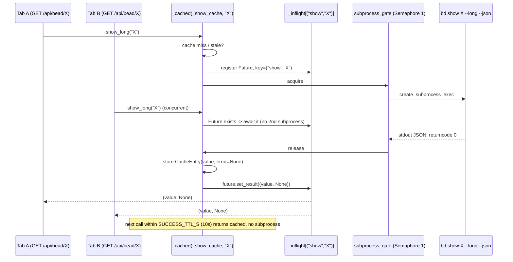
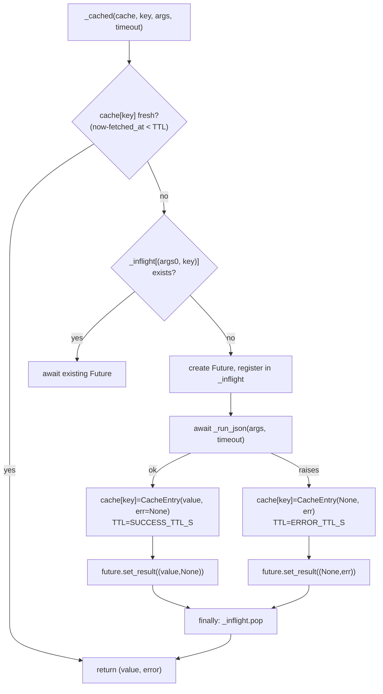
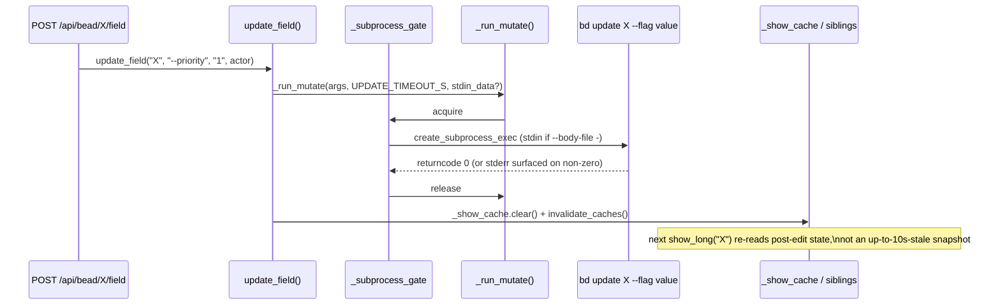

# Subprocess Serialization & Caching

## What Is It

Subprocess Serialization & Caching is the discipline `BdClient`
(`src/bdboard/bd.py`) imposes on every conversation with the `bd` CLI. bdboard
never reads `.beads/` directly — it shells out to `bd … --json` and parses
stdout. Because those subprocesses talk to bd's embedded **single-writer**
dolt server, `BdClient` funnels *every* invocation through one
`asyncio.Semaphore(1)` gate, layers a short TTL cache over the read commands,
and de-duplicates concurrent identical reads so two browser tabs asking for the
same bead share a single subprocess.

It is the machinery behind bdboard's "many open tabs, many HTMX partials, all
hammering `/api/*` at once, yet bd never deadlocks and the board never melts the
dolt lock" behavior.

## Why This Approach

bdboard is a read-mostly **observer** (see [bd CLI as Source of
Truth](BdCliSourceOfTruth.md)): every
`/api/lanes`, `/api/counts`, bead-modal
open, and live refresh is ultimately a `bd` subprocess. That framing creates
four hard problems, and this concept exists to solve all four at once:

1. **bd's dolt store is single-writer and lock-prone.** Fire several `bd`
   invocations concurrently and they contend on dolt's lock; one slow command
   can deadlock its peers and stall the whole board. A process-wide
   `asyncio.Semaphore(1)` (`_subprocess_gate`) serializes *every* read and
   write so at most one `bd` process runs at a time — correctness over raw
   parallelism, because bd can't safely do parallel anyway.

2. **A naive call-per-request is ruinously expensive.** A cold `bd list --json`
   on a real workspace is ~700ms and returns ~500KB. Rendering `/`, `/api/lanes`
   and `/api/counts` per HTTP hit would burn that cost three times and pile the
   calls up against the dolt lock. The board-snapshot path lives in
   [Store Snapshot & Change Detection](StoreSnapshotChangeDetection.md); the
   *detail* path (`show`/`history`/`memories`/`status`) is cached here with a
   short TTL (`SUCCESS_TTL_S = 10s`, `ERROR_TTL_S = 30s`) so repeat clicks and
   re-renders are nearly free.

3. **Duplicate concurrent reads race each other.** Two tabs open the same bead
   modal in the same instant; without coordination that's two `bd show`
   subprocesses for identical data. An **in-flight dedup** map keyed by
   `(subcommand, key)` lets the second caller await the first's `Future` rather
   than spawn a redundant process.

4. **Interrupted subprocesses leak file descriptors.** `create_subprocess_exec`
   with `PIPE` opens fds that only close when `communicate()` finishes. The
   watcher's debounce can `CancelledError` a refresh mid-flight; a timeout can
   fire; under uvloop killing an already-dead pid raises `ProcessLookupError`.
   Each unclean exit leaks ~3 fds (stdin/stdout/stderr) until `RLIMIT_NOFILE`
   is exhausted and *all* subprocess spawning fails. So every helper calls
   `communicate()` on **every** exit path, and `_safe_kill()` swallows the
   stray `ProcessLookupError` so the draining `communicate()` still runs and
   the real (cancellation) error still propagates.

The design choice that ties it together: **one gate, two cache flavors.** Read
commands go through `_cached()` (TTL + dedup) wrapping `_run_json()`; mutations
go through `_run_mutate()` and then *invalidate* the relevant caches so the next
read reflects the write. Both flavors share the single `_subprocess_gate`, so
reads and writes never run concurrently against dolt.

## How It Works

`BdClient` is built from a handful of cooperating pieces:

- **`_run_json()`** — runs `bd <args> --json` under the gate, enforces a
  per-command timeout, drains pipes on every exit path, and parses stdout.
  Raises on non-zero exit / timeout / bad JSON.
- **`_cached()`** — the TTL cache + in-flight dedup wrapper around
  `_run_json()`. Returns `(value, error)` and caches *both* (failures get the
  longer `ERROR_TTL_S` so a flaky bd isn't hammered).
- **`_run_mutate()`** — the write sibling: runs a `bd` mutation (no `--json`,
  exit-code only), streams long markdown over stdin via `--body-file -` /
  `--design-file -`, then the caller invalidates caches.
- **`_safe_kill()`** — module helper that kills a subprocess tolerating an
  already-exited pid (the uvloop `ProcessLookupError` trap).

Read methods (`show_long`, `history`, `memories`, `status_summary`) each own a
small `dict[str, CacheEntry]` and call `_cached()` with a distinct key. The
heavy board reads (`list_active`, `list_closed`, `list_closed_history`) skip the
TTL cache deliberately — the [Store](StoreSnapshotChangeDetection.md) owns
their snapshot lifecycle — but still ride the same `_subprocess_gate` via
`_run_json()`.

### Gate + cache + in-flight dedup (a cached read)



### `_cached()` decision path



### Mutate-then-invalidate (a field edit)



### A concrete example

A maintainer changes a bead's priority in the modal while a teammate has the
same bead open in another tab:

1. The teammate's tab already loaded `bd show bdboard-X --long` a few seconds
   ago, so `_show_cache["bdboard-X"]` is fresh; their re-renders hit the cache
   and spawn no subprocess.
2. The maintainer POSTs `/api/bead/bdboard-X/field`. `update_field()` calls
   `_run_mutate(["update", "bdboard-X", "--priority", "1", "--actor", …])`.
   The gate serializes it behind any in-flight read.
3. On success `update_field()` runs `self._show_cache.clear()` then
   `invalidate_caches()`, dropping the now-stale show/history/memories/status
   entries.
4. The route's follow-up `show_long("bdboard-X", fresh=True)` pops the cache
   key first (the optimistic-lock precondition needs a guaranteed-live read),
   re-runs `bd show`, and renders priority 1.
5. The [Filesystem Watcher](FilesystemWatcher.md) also fires from the dolt
   write and broadcasts `beads_changed`; the teammate's tab re-fetches and now
   sees priority 1 too. The cache invalidation in step 3 guarantees that
   re-fetch can't lose the race against the optimistic re-render and serve
   stale data.

### Key Data Shapes

A `CacheEntry` is the unit stored in every read cache. `fresh()` picks the TTL
by entry kind — successes expire fast, errors linger to spare a flaky bd:

```json
{
  "fetched_at": 12345.678,
  "value": { "id": "bdboard-X", "title": "…", "priority": 1 },
  "error": null
}
```

The in-flight dedup map is keyed by `(subcommand, key)` so a `show` and a
`history` request for the same bead never collide:

```json
{
  "_inflight": {
    "['show', 'bdboard-X']": "<asyncio.Future>",
    "['history', 'bdboard-X']": "<asyncio.Future>"
  }
}
```

`show_long()` unwraps bd's JSON array to a single bead dict:

```json
{
  "id": "bdboard-X",
  "title": "Example bead",
  "status": "in_progress",
  "priority": 1,
  "issue_type": "task",
  "updated_at": "2026-06-04T21:00:00Z"
}
```

`memories()` strips the `schema_version` sentinel from bd's flat key->body
object and returns a sorted list of `{key, body}`:

```json
[
  { "key": "dep-edge-direction", "body": "bd reports 'blocks' on both sides…" },
  { "key": "flowdoc-pour-gate", "body": "re-pour spawns a disconnected epic…" }
]
```

`pour_formula()` returns the mutation result that the pour route consumes:

```json
{
  "new_epic_id": "bdboard-mol-abc",
  "id_mapping": { "step-1": "bdboard-mol-abc.1", "step-2": "bdboard-mol-abc.2" },
  "created": 7
}
```

### Implementation Map

| Responsibility | File path | Symbol |
| --- | --- | --- |
| Async wrapper around the bd CLI | `src/bdboard/bd.py` | `BdClient` |
| Process-wide serialization gate | `src/bdboard/bd.py` | `BdClient._subprocess_gate` |
| In-flight dedup map (subcommand, key) -> Future | `src/bdboard/bd.py` | `BdClient._inflight` |
| TTL cache unit (fetched_at / value / error) | `src/bdboard/bd.py` | `CacheEntry` |
| Per-entry TTL selection (success vs error) | `src/bdboard/bd.py` | `CacheEntry.fresh` |
| Run `bd … --json`, gate + timeout + fd-safe drain + parse | `src/bdboard/bd.py` | `BdClient._run_json` |
| TTL cache + in-flight dedup wrapper | `src/bdboard/bd.py` | `BdClient._cached` |
| Run a mutation (exit-only, stdin streaming), fd-safe | `src/bdboard/bd.py` | `BdClient._run_mutate` |
| Kill tolerating an already-exited pid (uvloop trap) | `src/bdboard/bd.py` | `_safe_kill` |
| Cached bead detail (`bd show --long`, `fresh=` bypass) | `src/bdboard/bd.py` | `BdClient.show_long` |
| Cached audit history (`bd history`) | `src/bdboard/bd.py` | `BdClient.history` |
| Cached memories browse/search (`bd memories`) | `src/bdboard/bd.py` | `BdClient.memories` |
| Cached aggregate status summary (`bd status`) | `src/bdboard/bd.py` | `BdClient.status_summary` |
| Uncached board reads (gate only, Store-owned lifecycle) | `src/bdboard/bd.py` | `BdClient.list_active`, `BdClient.list_closed`, `BdClient.list_closed_history` |
| Memory write + targeted cache clear | `src/bdboard/bd.py` | `BdClient.remember`, `BdClient.forget` |
| Field edit + per-bead + sibling cache invalidation | `src/bdboard/bd.py` | `BdClient.update_field` |
| Long-markdown stdin flag aliases | `src/bdboard/bd.py` | `BdClient._STDIN_FLAG_ALIASES` |
| Hybrid pour (mutate + parse JSON) + invalidate | `src/bdboard/bd.py` | `BdClient.pour_formula` |
| Title rename for the poured epic + invalidate | `src/bdboard/bd.py` | `BdClient.rename_bead` |
| Drop show/history/memories/status caches | `src/bdboard/bd.py` | `BdClient.invalidate_caches` |
| Per-bead show cache (drop on edit) | `src/bdboard/bd.py` | `BdClient._show_cache` |
| Detail / history / memories / status caches | `src/bdboard/bd.py` | `BdClient._history_cache`, `BdClient._memories_cache`, `BdClient._status_cache` |
| Store-side single-flight refresh lock over BdClient | `src/bdboard/store.py` | `Store._refresh_lock` |
| Post-watcher cache invalidation hook | `src/bdboard/store.py` | `Store.refresh` (calls `bd.invalidate_caches`) |

## Configuration

| Key | Default | Effect |
| --- | --- | --- |
| `SUCCESS_TTL_S` (`src/bdboard/bd.py`) | `10.0` s | How long a successful read stays cached before a re-fetch. Long enough to absorb burst re-renders, short enough that a watcher invalidation isn't usually even needed. |
| `ERROR_TTL_S` (`src/bdboard/bd.py`) | `30.0` s | How long a cached *failure* is served, throttling retries against a flaky bd instead of hammering it per request. |
| `LIST_TIMEOUT_S` (`src/bdboard/bd.py`) | `15.0` s | Timeout for `bd list` reads (active/closed/history) — generous for large workspaces. |
| `SHOW_TIMEOUT_S` (`src/bdboard/bd.py`) | `8.0` s | Timeout for `bd show --long` bead detail. |
| `HISTORY_TIMEOUT_S` (`src/bdboard/bd.py`) | `8.0` s | Timeout for `bd history` audit reads. |
| `MEMORIES_TIMEOUT_S` (`src/bdboard/bd.py`) | `8.0` s | Timeout for `bd memories` browse/search. |
| `STATUS_TIMEOUT_S` (`src/bdboard/bd.py`) | `8.0` s | Timeout for `bd status` summary. |
| `REMEMBER_TIMEOUT_S` / `FORGET_TIMEOUT_S` (`src/bdboard/bd.py`) | `10.0` s | Timeout for memory writes (dolt commit can be slower than a read). |
| `UPDATE_TIMEOUT_S` (`src/bdboard/bd.py`) | `10.0` s | Timeout for `bd update` field edits / renames (dolt commit, possibly long markdown over stdin). |
| `FORMULA_LIST_TIMEOUT_S` (`src/bdboard/bd.py`) | `8.0` s | Timeout for `bd formula list`. |
| `POUR_TIMEOUT_S` (`src/bdboard/bd.py`) | `30.0` s | Timeout for `bd mol pour` — it cooks the formula inline and materializes a whole bead tree. |
| `SCHEMA_VERSION_KEY` (`src/bdboard/bd.py`) | `"schema_version"` | Sentinel stripped from `bd memories --json`; a payload of *only* this key means zero results. |
| `_subprocess_gate` concurrency | `asyncio.Semaphore(1)` | One `bd` process at a time, process-wide. Do not raise — dolt is single-writer. |

## Where Used

- **Bead Detail Modal** ([Features index](../Features/index.md)) — every modal
  open is a cached `show_long` + `history`; the in-flight dedup is what lets two
  tabs open the same bead without doubling the subprocess load.
- **Memory Curation** ([Features index](../Features/index.md)) — `memories`
  (cached search) plus `remember` / `forget` writes that clear `_memories_cache`.
- **Formula Pour** ([Features index](../Features/index.md)) — `list_formulas`,
  `read_formula_detail` / `read_formula_variables`, then the hybrid
  `pour_formula` + `rename_bead`, all gate-serialized and cache-invalidating.
- **Manual Field Editing** ([Features index](../Features/index.md)) —
  `update_field` writes through the gate and invalidates the per-bead cache so
  the optimistic re-render reads post-edit state.
- **History & Analytics** ([Features index](../Features/index.md)) —
  `status_summary` (cached optional KPI) and `list_closed_history` (uncached,
  Store-owned) both ride the gate.
- **Field Edit Write Path** ([Flows index](../Flows/index.md)) — the end-to-end
  edit whose mutate-then-invalidate sequence this concept implements.
- **Formula Pour Pipeline** ([Flows index](../Flows/index.md)) — the pour flow
  built on `pour_formula`'s hybrid mutate+parse contract.
- **GET /api/bead/{id}** ([Endpoints index](../Endpoints/index.md)) — served by
  `show_long`; the canonical cached-read consumer.
- **GET /api/memory** / **POST /api/memory** / **DELETE /api/memory/{key}**
  ([Endpoints index](../Endpoints/index.md)) — the `memories` / `remember` /
  `forget` trio.
- **Store Snapshot & Change Detection**
  ([Store Snapshot & Change Detection](StoreSnapshotChangeDetection.md)) — owns
  the board-snapshot lifecycle over `list_active` / `list_closed`, drives
  `invalidate_caches()` after a watcher fire, and adds its own single-flight
  refresh lock on top of this gate.
- **Filesystem Watcher** ([Filesystem Watcher](FilesystemWatcher.md)) — the
  layer that owns `watch_targets` / `watch_signature` / `revision_signature`
  also lives on `BdClient`; a real change is what triggers the cache
  invalidation here.
- **bd CLI as Source of Truth** ([bd CLI as Source of Truth](BdCliSourceOfTruth.md)) — the
  observer posture that makes *every* data access a serialized,
  cached subprocess in the first place.

## Conventions

> [!IMPORTANT]
> - **One gate, no exceptions.** Every read and write goes through
>   `_subprocess_gate` (`Semaphore(1)`). bd's dolt server is single-writer;
>   serialize first, optimize with caching second.
> - **Drain pipes on every exit path.** In `_run_json`, `_run_mutate`, and
>   `pour_formula`, always call `communicate()` even when killing the process
>   (timeout) or unwinding (`CancelledError`). Skipping it leaks ~3 fds per
>   interrupted call until `RLIMIT_NOFILE` is gone.
> - **Kill with `_safe_kill`, never raw `proc.kill()`.** Under uvloop, killing
>   an already-dead pid raises `ProcessLookupError`, which masks the real
>   cancellation and skips the draining `communicate()`. Swallow it — a dead
>   process is exactly what `kill()` wanted.
> - **Cache both successes and failures.** A failed read becomes a
>   `CacheEntry(error=…)` with the longer `ERROR_TTL_S` so a flaky bd is
>   throttled, not hammered.
> - **Invalidate after every mutation.** `remember`/`forget` clear
>   `_memories_cache`; `update_field` clears `_show_cache` then
>   `invalidate_caches()`; `pour_formula`/`rename_bead` call
>   `invalidate_caches()`. The next read must see post-write state, not an
>   up-to-10s-stale entry.
> - **Use `fresh=True` for precondition reads.** The optimistic-lock check in
>   the field-edit route calls `show_long(..., fresh=True)` to pop the cache
>   first; a stale `updated_at` would let a concurrent edit slip through and
>   clobber another writer.
> - **Stream long markdown over stdin.** Description/design values go through
>   `--body-file -` / `--design-file -` (the `_STDIN_FLAG_ALIASES`) so we dodge
>   shell-arg length limits and quoting fragility. Everything else is a plain
>   arg — already safe because we use `create_subprocess_exec` (no shell).
> - **Read formula variables from the `*.formula.json` file, not the CLI.**
>   `formula show --json` omits `variables` and the `vars` count in
>   `formula list --json` is always 0; the on-disk template is the only
>   reliable source.

## Anti-Patterns

> [!CAUTION]
> - **Don't raise the gate's concurrency.** A `Semaphore(2+)` lets two `bd`
>   processes contend on dolt's single-writer lock and can deadlock the board —
>   the exact failure the gate exists to prevent.
> - **Don't return early without draining on timeout/cancel.** The original fd
>   leak: a `TimeoutError`/`CancelledError` path that skipped `communicate()`
>   leaked the three pipe fds every time, and the watcher's debounce cancels
>   refreshes constantly — `RLIMIT_NOFILE` (often 256) is gone in minutes.
> - **Don't let `proc.kill()`'s `ProcessLookupError` escape.** It's a plain
>   `Exception`, so it propagates through `list_active` into `Store.refresh`'s
>   `except Exception`, which logs "keeping previous snapshot" and returns
>   `False` — no SSE broadcast fires and the board silently stops syncing.
> - **Don't skip cache invalidation after a write.** Leaving a stale
>   `_show_cache` entry after `update_field` lets the optimistic re-render serve
>   the pre-edit value and lose the race against the watcher re-fetch.
> - **Don't add a TTL cache to the board reads.** `list_active` / `list_closed`
>   are owned by the [Store](StoreSnapshotChangeDetection.md)'s snapshot +
>   change-detection lifecycle; double-caching them here would fight the
>   revision-skip fast path and serve doubly-stale lanes.
> - **Don't trust `--dry-run` or the `vars` count for formulas.** `vars` is
>   reported as 0 even when variables exist; read the template file. (And per
>   project memory, `bd create --graph --dry-run` is silently ignored — a
>   sibling gotcha in the same CLI surface.)
> - **Don't spawn a duplicate subprocess for an in-flight read.** Bypassing the
>   `_inflight` dedup means N tabs opening the same bead fire N `bd show`
>   processes serialized behind the gate — slow *and* pointless when one result
>   serves all.

## Related

- [Concepts index](index.md) — the other cross-cutting concepts.
- [bd CLI as Source of Truth](BdCliSourceOfTruth.md) — the observer posture that makes every
  data access a serialized subprocess.
- [Store Snapshot & Change Detection](StoreSnapshotChangeDetection.md) — the
  board-snapshot lifecycle over the uncached `list_*` reads, plus the
  post-watcher `invalidate_caches()` call.
- [Filesystem Watcher](FilesystemWatcher.md) — owns the watch/revision
  signatures on `BdClient` and triggers the cache invalidation here.
- [SSE Event Bus](SseEventBus.md) — the fan-out a real change drives once the
  caches are invalidated.
- [Features index](../Features/index.md) — Bead Detail Modal, Memory Curation,
  Formula Pour, Manual Field Editing, History & Analytics.
- [Flows index](../Flows/index.md) — Field Edit Write Path, Formula Pour
  Pipeline.
- [Endpoints index](../Endpoints/index.md) — GET /api/bead/{id}, GET/POST
  /api/memory, DELETE /api/memory/{key}.
- [POST /api/formulas/{name}/pour](../Endpoints/PostApiFormulaPour.md) — the
  pour + rename writes serialized on the same `_subprocess_gate` this concept
  governs.
- [GET /api/bead/{id}/audit](../Endpoints/GetApiBeadAudit.md) — served by the
  cached `BdClient.history` read this concept governs (gate + `_history_cache`
  TTL + in-flight dedup).
- [Memory (/memory)](../Views/MemoryView.md) — the view whose list reads go
  through `BdClient.memories` (gate + TTL cache + in-flight dedup).
- [Back to docs index](../index.md)
