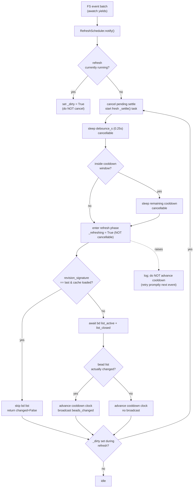

# Watcher Scheduling (debounce / cooldown & self-feedback skip)

## What Is It

bdboard is a pure **observer** of a `bd` workspace: it never writes beads, it
watches the `.beads/` dolt files and re-reads `bd list --json` when they change.
Watcher scheduling is the thin timing layer that sits between raw filesystem
events and the (relatively expensive) `Store.refresh()` subprocess. It does two
jobs:

1. **Debounce + cooldown** — collapse the burst of file writes a single `bd`
   command produces into exactly **one** `store.refresh()`, and throttle
   sustained write storms so refreshes can't chain-fire at full FS speed. This
   lives in [`src/bdboard/watcher.py`](../../src/bdboard/watcher.py)'s
   `RefreshScheduler`.
2. **Self-feedback skip** — recognise that a *read-only* `bd list` itself
   touches the watched dolt files (so the watcher fires for our **own** read)
   and suppress that echo before it spins into an infinite refresh loop. This is
   a two-part defence: `BdClient.revision_signature()` +
   `Store.refresh()`'s revision-unchanged skip path
   ([`src/bdboard/bd.py`](../../src/bdboard/bd.py),
   [`src/bdboard/store.py`](../../src/bdboard/store.py)), plus the scheduler's
   rule that an in-flight refresh is **never** cancelled by a new event.

The whole concept exists to make ["one logical `bd` write → exactly one UI
refresh"](../Flows/LiveRefreshPipeline.md) true, reliably, on macOS, without the
board freezing or melting.

## Why This Approach

The naive approach — "FS event fires → call `store.refresh()`" — breaks in three
distinct, painful ways that were all hit in production (`bdboard-xbc7`,
`bdboard-ywep`):

- **Write bursts.** A single `bd update` rewrites 3-5 files inside
  `.beads/embeddeddolt/<db>/.dolt/noms/` (`manifest`, `journal.idx`, lock files)
  in quick succession, often spanning 2-3 `watchfiles` batches. Without
  debouncing, one user action triggers a fistful of redundant `bd list`
  subprocesses.
- **Write storms.** `bd`'s dolt commit + auto-export fan-out + git-add hook can
  emit a sustained stream of FS events. Without a cooldown, refreshes
  chain-fire at full filesystem speed and starve the event loop.
- **Self-feedback.** `store.refresh()` runs `bd list --json`. Even though that
  is read-only at the bead level, dolt re-touches `journal.idx` and rewrites
  `manifest` inside the watched `noms/` dir — so the watcher fires ~1.3s later
  **for our own read**. Pre-fix, that echo chained refreshes forever; worse,
  because `bd list` on a large `noms/` is *slower* than the self-trigger
  latency, the old `notify()` cancelled each in-flight refresh before it
  finished, so the board never updated until a manual relaunch.

A timing layer with debounce, post-refresh cooldown, a content-based revision
oracle, and a non-cancellable refresh phase collapses all three failure modes
into one small, **unit-testable** module that needs no FastAPI, no `watchfiles`,
and no real bd workspace to verify
([`tests/test_watcher_scheduler.py`](../../tests/test_watcher_scheduler.py),
[`tests/test_watcher_self_feedback.py`](../../tests/test_watcher_self_feedback.py)).

> [!NOTE]
> This concept describes *behavior*. The decision to build live-refresh this way
> is recorded in ADR `docs/decisions/0005-live-refresh-architecture.md`; the
> watch-scope and self-feedback fixes are tracked in beads `bdboard-xbc7`
> (debounce/cooldown + watch-target identity) and `bdboard-ywep` (self-feedback
> loop). See also [Architecture](../Architecture.md) → "Live-refresh pipeline".

## How It Works

There are two timing controls (debounce, cooldown) and two loop-breakers
(revision skip, non-cancellable refresh). The scheduler is fed by the
`watchfiles.awatch` loop in [`app.py`](../../src/bdboard/app.py) `_watch_beads`,
which calls `scheduler.notify()` for every batch.



### Concrete example — one `bd update` while the board is open

1. You run `bd update bdboard-mol-bfs.24 --status in_progress`. dolt rewrites
   `manifest` + `journal.idx` in `.beads/embeddeddolt/bdboard/.dolt/noms/` across
   2-3 `watchfiles` batches over ~80ms.
2. `_watch_beads` calls `scheduler.notify()` once per batch. The first creates a
   `_settle()` task; each later one **cancels and reschedules** it, so the
   250ms debounce timer keeps resetting until the writes stop.
3. ~250ms after the last write, debounce elapses. No prior refresh ran recently,
   so there's no cooldown remainder. `_refreshing` flips `True` and the refresh
   phase begins.
4. `revision_signature()` differs from the last refresh (real write → new dolt
   root hash), so `bd list --json` runs. The active list changed, so the
   cooldown clock is armed and `bus.broadcast("beads_changed")` fires → the SSE
   bridge dispatches `refresh` → every `hx-trigger="refresh from:body"` region
   re-fetches its partial.
5. ~1.3s later the watcher fires **again** — this is dolt re-touching `noms/` for
   *our own* `bd list` read in step 4. `notify()` schedules a settle; when it
   reaches the refresh phase, `revision_signature()` is **byte-identical** to
   the last refresh, so `Store.refresh()` takes the skip path, spawns no
   subprocess, returns `False`, and **no broadcast** happens. The loop is severed
   right there.

### Timing controls

| Control | Constant (`app.py`) | Default | What it does | Why this value |
| --- | --- | --- | --- | --- |
| Debounce | `WATCHER_DEBOUNCE_S` | `0.25` s | Trailing quiet-window; every `notify()` resets it, collapsing a multi-batch burst into one refresh | Longer than a `bd` write burst, far shorter than human perception |
| Cooldown | `WATCHER_COOLDOWN_S` | `1.0` s | After a *successful* refresh, the next refresh waits out the remainder of this window | Throttles dolt-commit/auto-export/git-add storms so refreshes don't chain at FS speed |
| Rescan | `WATCHER_RESCAN_S` | `3.0` s | Cadence at which `_rescan_targets` re-checks `watch_signature()` to catch inode swaps / new dbs | A handful of `stat()`s; cheap enough to poll, fast enough to recover |

The scheduler defaults live in `watcher.py` as `DEFAULT_DEBOUNCE_S = 0.25` and
`DEFAULT_COOLDOWN_S = 1.0`; `_watch_beads` passes the `app.py` constants
through `RefreshScheduler(debounce_s=..., cooldown_s=...)`.

### Key timing fields

`RefreshScheduler` carries no JSON wire shape (it's an in-process coordinator),
but its internal state is the contract the timing rules turn on:

```python
self._last_refresh_at: float       # monotonic time of last SUCCESSFUL refresh; gates cooldown
self._pending: asyncio.Task | None # the in-flight _settle() task (cancellable sleep phase)
self._refreshing: bool             # True while bd list runs; notify() must NOT cancel
self._dirty: bool                  # event arrived mid-refresh; reconcile once more after
```

The two filesystem fingerprints `bd.py` exposes — both `frozenset`s, compared by
value — are the loop-breaker oracles:

```python
watch_signature()    -> frozenset[tuple[str, int, int]]   # (path, st_dev, st_ino) per target — IDENTITY
revision_signature() -> frozenset[tuple[str, bytes]]      # (manifest_path, manifest_bytes) per db — CONTENT
```

> [!IMPORTANT]
> `revision_signature()` compares the **content** of each db's `manifest` (dolt's
> ~150-byte committed root hash), which only changes on a real write.
> `watch_signature()` compares the **identity** (`st_dev`, `st_ino`) of each
> watched directory, which changes when dolt replaces a `noms/` inode or a new db
> appears. They solve different problems — don't confuse them.

### Implementation map

| Responsibility | File path | Symbol |
| --- | --- | --- |
| Debounce/cooldown coalescing + non-cancellable refresh phase | `src/bdboard/watcher.py` | `RefreshScheduler` |
| Record an FS-event batch (cancel sleep, or set `_dirty` mid-refresh) | `src/bdboard/watcher.py` | `RefreshScheduler.notify` |
| The settle cycle: debounce → cooldown remainder → refresh → broadcast | `src/bdboard/watcher.py` | `RefreshScheduler._settle` |
| Inline single-cycle entry point (tests) | `src/bdboard/watcher.py` | `RefreshScheduler.settle_now` |
| Scheduler defaults | `src/bdboard/watcher.py` | `DEFAULT_DEBOUNCE_S`, `DEFAULT_COOLDOWN_S` |
| `awatch` loop that feeds the scheduler + wires constants | `src/bdboard/app.py` | `_watch_beads` |
| Lifespan hook that starts/stops the watcher task | `src/bdboard/app.py` | `lifespan` |
| Inode-swap / new-db rescan poller (trips `awatch` `stop_event`) | `src/bdboard/app.py` | `_rescan_targets` |
| Watcher timing/rescan constants | `src/bdboard/app.py` | `WATCHER_DEBOUNCE_S`, `WATCHER_COOLDOWN_S`, `WATCHER_RESCAN_S` |
| Non-recursive watch-target enumeration (fd-blowup guard) | `src/bdboard/bd.py` | `BdClient.watch_targets` |
| Target-set identity fingerprint (inode/new-db detection) | `src/bdboard/bd.py` | `BdClient.watch_signature` |
| Content fingerprint (manifest root hash) for self-feedback skip | `src/bdboard/bd.py` | `BdClient.revision_signature` |
| Revision-unchanged skip + change-dedup on refresh | `src/bdboard/store.py` | `Store.refresh` |

### Failure & edge handling

| Trigger | Behavior | Result |
| --- | --- | --- |
| Event settles inside cooldown window | Waits out the **remaining** cooldown, then refreshes (does NOT drop the event) | Trailing/isolated write still refreshes ~debounce+cooldown later (`bdboard-xbc7` #1) |
| `store.refresh()` raises (transient `bd list` error) | Logged; cooldown clock **not** advanced; cache preserved | Next event retries promptly — no permanent wedge (`bdboard-xbc7` #3) |
| Event arrives while refresh's `bd list` is running | `notify()` sets `_dirty`; does NOT cancel | Refresh completes, then one reconcile pass runs (`bdboard-ywep`) |
| Refresh re-reads dolt → watcher echoes our own read | `revision_signature()` unchanged → `Store.refresh` skips `bd list`, returns `False` | Loop severed; no broadcast, no subprocess |
| dolt atomically replaces `noms/` inode, or new db appears | `_rescan_targets` sees `watch_signature()` change → sets `stop_event` | `awatch` re-enumerates fresh targets (`bdboard-xbc7` #2) |
| Recursive watch of whole `.beads/` tree | Avoided entirely; only `noms/` dirs + `.beads/` watched non-recursively | No `RLIMIT_NOFILE` blowup / `OSError [Errno 24]` |
| Empty `revision_signature()` (legacy JSONL-only workspace) | Skip path is never taken | Live-sync still works where there's no dolt signal |

## Where Used

- **Flows:**
  [LiveRefreshPipeline](../Flows/LiveRefreshPipeline.md) — this concept *is* the
  debounce + cooldown + self-feedback-skip middle of that pipeline;
  [ServerStartup](../Flows/ServerStartup.md) — `lifespan` starts the watcher task
  that owns the scheduler.
- **Features:**
  [LiveAutoRefresh](../Features/LiveAutoRefresh.md) — the user-facing "the board
  updates itself" behavior this scheduling makes correct and non-spinning.
- **Endpoints:**
  [SseEvents](../Endpoints/SseEvents.md) — the scheduler's `broadcast` callback
  is `bus.broadcast("beads_changed")`, which fans out on this stream.
- **Related concepts:**
  [BdCliSourceOfTruth](BdCliSourceOfTruth.md) — `bd list --json` is the refresh
  the scheduler coalesces, and its read-only-yet-file-touching nature is the
  reason the self-feedback skip exists;
  [StoreSnapshotCache](StoreSnapshotCache.md) — `Store.refresh` (which the
  scheduler calls) holds the revision oracle and change-dedup;
  [HtmxPartialsArchitecture](HtmxPartialsArchitecture.md) — the `refresh from:body`
  re-swaps that a successful broadcast triggers.

## Conventions

> [!IMPORTANT]
> **Feed the scheduler one `notify()` per FS batch — let it own the timing.**
> `_watch_beads` must do nothing but call `scheduler.notify()` inside the
> `async for ... in awatch(...)` loop. All debounce/cooldown/skip decisions live
> in `RefreshScheduler`; do not add ad-hoc sleeps or refresh calls in `app.py`.

> [!IMPORTANT]
> **Only a *successful* refresh advances the cooldown clock.** Set
> `_last_refresh_at` after `refresh()` returns without raising — never on the
> failure path. A cooldown "earned" without actually syncing swallows the next
> real event and wedges live-sync (`bdboard-xbc7` #3).

> [!IMPORTANT]
> **Never cancel an in-flight refresh from `notify()`.** Once `_refreshing` is
> `True`, an arriving event sets `_dirty` and reconciles afterward. Cancelling
> mid-`bd list` is exactly what froze the board: the read-induced self-trigger
> killed each refresh before it finished (`bdboard-ywep`). Only the
> debounce/cooldown **sleep** is cancellable.

> [!IMPORTANT]
> **Compare dolt `manifest` *content*, not mtime/inode, to detect real change.**
> `revision_signature()` reads the manifest root hash. mtime and `journal.idx`
> churn on read-only `bd list`, so anything timestamp- or inode-based would
> mistake our own echo for a real write and never break the loop.

> [!IMPORTANT]
> **Watch the `noms/` dirs non-recursively, and poll `watch_signature()` to
> recover from inode swaps / new dbs.** Recursive whole-tree watching exhausts
> `RLIMIT_NOFILE` on macOS (one kqueue fd per dir), which then breaks subprocess
> spawning for `bd list`/`bd show`. The 3s rescan poll re-enters `awatch` with
> fresh targets when the target identity changes.

## Anti-Patterns

> [!CAUTION]
> **Don't refresh directly on every FS event.** Skipping the debounce turns one
> `bd update` (3-5 file writes across 2-3 batches) into a fistful of redundant
> `bd list --json` subprocesses and a thrashing event loop.

> [!CAUTION]
> **Don't drop an event that lands inside the cooldown window.** The old
> `_settle_task` returned early ("a later FS event will retrigger"), but the
> last write of a burst — or a single isolated write — has no later event, so
> the change was silently lost until some unrelated future write. Always wait out
> the remaining cooldown and refresh.

> [!CAUTION]
> **Don't watch the whole `.beads/` tree recursively.** dolt's content-addressed
> `noms/` object store is a large, churning fileset; one kqueue fd per directory
> blows past the (often 256) soft fd limit and surfaces as `OSError [Errno 24]
> Too many open files` when `bd list`/`bd show` try to spawn.

> [!CAUTION]
> **Don't treat `bd list` as side-effect-free for watch purposes.** It's
> read-only at the bead level but dolt still re-touches `journal.idx`/`manifest`,
> so the watcher fires for your own read. Without the revision-skip oracle you
> get an infinite refresh→read→event→refresh loop.

> [!CAUTION]
> **Don't enumerate watch targets once and assume they're stable.** dolt
> atomically replaces `noms/` (rename-over → dead inode on macOS) and new dbs can
> appear after startup; without `_rescan_targets` the watch silently stops firing.

## Related

- [Architecture](../Architecture.md) — system diagram (`watcher.py —
  RefreshScheduler` node) and the "Live-refresh pipeline" walkthrough this
  concept implements.
- [Concepts index](index.md) — sibling cross-cutting concepts.
- [Manifest](../_Manifest.md) — catalog of every documented item.
- [LiveRefreshPipeline](../Flows/LiveRefreshPipeline.md) — the end-to-end flow
  this scheduling sits in the middle of.
- [LiveAutoRefresh](../Features/LiveAutoRefresh.md) — the user-facing feature.
- [SseEvents](../Endpoints/SseEvents.md) — the stream a successful refresh
  broadcasts on.
- [BdCliSourceOfTruth](BdCliSourceOfTruth.md) — the `bd list` refresh being
  coalesced (and the read that self-triggers).
- [StoreSnapshotCache](StoreSnapshotCache.md) — the cache + revision oracle the
  scheduler's `refresh()` drives.
- [HtmxPartialsArchitecture](HtmxPartialsArchitecture.md) — the `refresh from:body`
  re-swaps the broadcast triggers.
