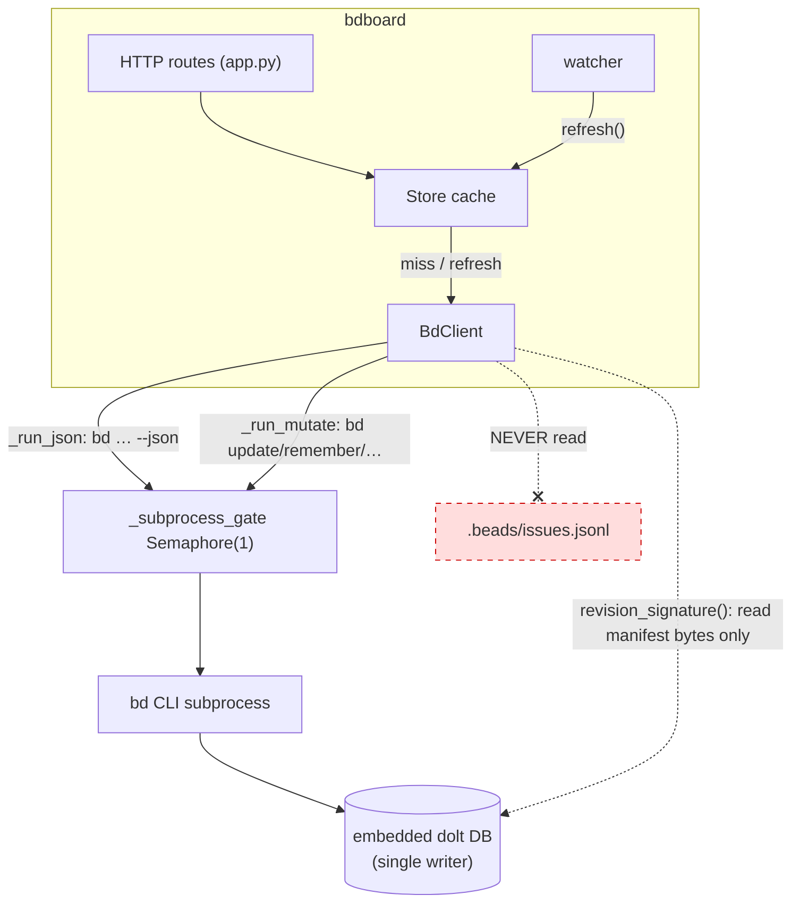

# Concept: bd CLI as runtime source of truth

## What is it

bdboard treats the **`bd` command-line tool as its one and only runtime data
backend**: every read shells out to `bd … --json` and every write is a
`bd update` / `bd remember` / `bd forget` / formula `pour` subprocess. bdboard
never opens the dolt database directly and never reads or writes
`.beads/issues.jsonl` — that file is a passive export, not the wire it talks to.
All of this lives behind one async wrapper,
[`BdClient`](../../src/bdboard/bd.py).

## Why this approach

`bd` issues are stored in an **embedded dolt database**
(`.beads/embeddeddolt/<db>/.dolt/`), a content-addressed, single-writer store
with its own commit/merge semantics and a JSON wire format that evolves across
`bd` releases. bdboard could in principle reach past `bd` and read the dolt
tables (or the `issues.jsonl` export) itself, but every alternative was rejected
for a concrete reason:

- **Reading `.beads/issues.jsonl` directly** — the JSONL is a *secondary
  export* that may be absent (modern dolt-backed workspaces don't require it),
  stale (it only refreshes on certain `bd` operations), or schema-skewed from
  the live DB. Treating it as truth means rendering a board that disagrees with
  what `bd ready` / `bd show` report. So `validate()` deliberately does **not**
  require the JSONL to exist — only a `.beads/` dir and a working `bd` binary.
- **Linking a dolt client and querying tables ourselves** — it couples bdboard
  to dolt's storage internals and to `bd`'s schema, duplicates `bd`'s derivation
  logic (dependency resolution, status rollups, lead-time math), and races
  `bd`'s single-writer lock from outside `bd`'s own serialization. We'd be
  re-implementing `bd` badly.
- **Going through `bd` via `--json`** — `bd` already owns the schema, the
  derivations, and the write lock. By shelling out we inherit *exactly* what the
  agents using `bd` on the command line see, for free, across `bd` version bumps.
  The cost is subprocess latency (~700 ms per `bd list` on a real workspace),
  which we pay for with the in-memory [Store cache](store-snapshot-cache.md)
  rather than by bypassing `bd`.

The trade is deliberate: **correctness and version-resilience over raw speed**,
with the speed clawed back by caching reads, not by changing the source of truth.

## How it works

`BdClient` is a thin async wrapper that turns each bdboard concern into a `bd`
subcommand. Reads run `bd … --json` through `_run_json`, parse stdout, and
(for detail views) sit behind a TTL cache with in-flight dedup (`_cached`).
Writes run through `_run_mutate` (no `--json`, exit-code checked, bd's stderr
surfaced) and then invalidate the relevant caches so the next read reflects the
mutation.

Two cross-cutting invariants hold the whole thing together:

1. **One subprocess at a time.** Every read and write acquires
   `_subprocess_gate`, an `asyncio.Semaphore(1)`. `bd`'s embedded dolt server is
   single-writer and can lock-wait under concurrent CLI invocations, so
   process-wide serialization keeps a burst of requests reliable instead of
   deadlocking on the dolt lock.
2. **Drain pipes on every exit path.** `create_subprocess_exec` with `PIPE`
   opens file descriptors that only close when `communicate()` finishes. Because
   the [watcher/debounce](watcher-scheduling.md) machinery can cancel a refresh
   mid-flight, `_run_json` / `_run_mutate` call `communicate()` even on
   timeout/cancellation (via `_safe_kill`, which swallows `ProcessLookupError`
   from an already-dead pid) — otherwise each cancellation leaks ~3 fds until
   `RLIMIT_NOFILE` is exhausted and *every* new subprocess starts failing.

```python
# The shape of a read: bd <args> --json, serialized, drained on every path.
# (src/bdboard/bd.py, abridged)
async def _run_json(self, args: list[str], timeout: float) -> Any:
    async with self._subprocess_gate:                # bd dolt is single-writer
        proc = await asyncio.create_subprocess_exec(
            self.bd_bin, *args, "--json",
            cwd=str(self.workspace),
            stdout=asyncio.subprocess.PIPE,
            stderr=asyncio.subprocess.PIPE,
        )
        try:
            stdout, stderr = await asyncio.wait_for(
                proc.communicate(), timeout=timeout
            )
        except BaseException:                         # incl. CancelledError
            _safe_kill(proc)                          # tolerate dead pid
            await proc.communicate()                  # MUST drain → no fd leak
            raise
        if proc.returncode != 0:
            raise RuntimeError("Could not load bead data right now.")
        return json.loads(stdout)                     # bd --json is the truth
```

The read surface is split by *shape and cost*, not by table:

- `list_active` — `bd list --no-pager --limit 0` (active issues only, the fast
  ~5 KB first-paint path).
- `list_closed` — `bd list --status closed --closed-after <iso> --sort closed`
  (board Closed lane, bounded by a date *window*, not a count cap).
- `list_closed_history` — count-uncapped (`--limit 0`) closed record for the
  long-window History page, window-bounded via `--closed-after`.
- `show_long` / `history` — `bd show <id> --long` / `bd history <id>` for bead
  detail, cached with TTL + in-flight dedup.
- `status_summary`, `memories`, `list_formulas` — workspace-global reads.

Crucially, even a *read-only* `bd list` makes dolt re-touch the watched
`noms/` files, so the watcher fires for our own read. `revision_signature()`
(the dolt manifest root-hash, read directly off disk — the one place we touch
dolt files, and only to *fingerprint* them, never to read issue data) lets the
[Store](store-snapshot-cache.md) tell "dolt really changed" from "our own read
jiggled the files" and skip the redundant subprocess.

The write surface is the same gate in reverse:

- `update_field` — `bd update <id> <flag> <value>`; long markdown
  (`--description` / `--design`) is streamed on **stdin** via `--body-file -` /
  `--design-file -` (see `_STDIN_FLAG_ALIASES`) to dodge shell-arg length limits.
  `--actor` is forwarded so the human edit is attributed correctly in the audit
  trail.
- `remember` / `forget` — `bd remember "<body>" --key <key>` / `bd forget`.
- `rename_bead`, `pour_formula` — retitle and formula materialization.



## Where used

| Consumer | How |
| --- | --- |
| [`Store.refresh` / `_load_active` / `_load_closed` / `_load_history`](../../src/bdboard/store.py) | call `list_active` / `list_closed` / `list_closed_history` to populate the in-memory snapshots |
| [`Store`](../../src/bdboard/store.py) self-feedback skip | calls `revision_signature()` + `invalidate_caches()` to gate refreshes — see [store snapshot cache](store-snapshot-cache.md) |
| [`app.py` bead modal / audit / raw](../../src/bdboard/app.py) | `show_long(id, fresh=…)` and `history(id)` for bead detail — see [bead detail API](../Endpoints/bead-detail-api.md) |
| [`app.py` field-edit route](../../src/bdboard/app.py) | `update_field(...)` then a `fresh=True` `show_long` re-read — see [field-edit write path](../Flows/field-edit-write-path.md) |
| [`app.py` memory page/API](../../src/bdboard/app.py) | `memories()`, `remember()`, `forget()` — see [memory API](../Endpoints/memory-api.md) |
| [`app.py` formulas / pour](../../src/bdboard/app.py) | `list_formulas()`, `read_formula_*`, `pour_formula()`, `rename_bead()` — see [formula pour fan-out](../Flows/formula-pour-fanout.md) |
| [`app.py` history headline](../../src/bdboard/app.py) | `status_summary()` for bd's own point-in-time KPIs — see [history API](../Endpoints/history-api.md) |
| [`cli.py`](../../src/bdboard/cli.py) | resolves the workspace + `bd` binary path (`--dir`, `--bd`) that construct the `BdClient` at startup — see [server startup](../Flows/server-startup.md) |
| [`watcher`](../../src/bdboard/watcher.py) | observes `watch_targets()` / `watch_signature()` (the dolt `noms/` dirs `bd` writes touch) to know *when* to re-read — see [watcher scheduling](watcher-scheduling.md) |

## Conventions

> [!IMPORTANT]
> When touching the `bd`-access layer, preserve these invariants:
> - **All `bd` access goes through `BdClient`.** Routes, the Store, and the
>   watcher never spawn `bd` themselves — one wrapper owns the gate, the caches,
>   and the error mapping.
> - **Serialize every subprocess on `_subprocess_gate`.** Reads *and* writes
>   take the `Semaphore(1)`; `bd`'s dolt store is single-writer and lock-waits
>   under concurrency.
> - **Drain pipes on every exit path.** Always `communicate()` after
>   `_safe_kill` on timeout/cancellation, or you leak fds until subprocess
>   creation fails wholesale.
> - **Invalidate caches after a mutation.** Every write method calls
>   `invalidate_caches()` (and clears `_show_cache`) so the next read returns
>   post-mutation state instead of an up-to-`SUCCESS_TTL_S`-stale snapshot.
> - **Stream long markdown on stdin.** Use the `_STDIN_FLAG_ALIASES` file-flag
>   variants (`--body-file -` / `--design-file -`) for `--description` /
>   `--design`; never pass large bodies as positional args.
> - **Validate `bd --json` shapes.** `bd` returns a JSON array even for
>   single-bead `show`; check `isinstance(..., list)` / unwrap, and treat a
>   non-list / malformed payload as an error, not a crash.
> - **Surface `bd`'s stderr on write failure.** `_run_mutate` raises with the
>   decoded stderr so users see *why* `bd update`/`forget` rejected the edit.

## Anti-patterns

> [!CAUTION]
> Mistakes that break correctness or stability — don't do these:
> - **Don't read `.beads/issues.jsonl` as truth.** It can be absent, stale, or
>   schema-skewed; the live `bd … --json` output is the only source of truth.
>   `validate()` intentionally does not even require the JSONL to exist.
> - **Don't open the dolt DB directly for issue data.** The only sanctioned
>   direct file touch is `revision_signature()` reading the tiny `manifest` bytes
>   to *fingerprint* state — never to read issues. Querying dolt tables yourself
>   duplicates `bd`'s logic and races its write lock from outside its
>   serialization.
> - **Don't spawn `bd` with `shell=True` or string-built commands.** Always use
>   `create_subprocess_exec` with an arg list — it's shell-safe (no quoting
>   fragility, no injection) and is what lets non-stdin flags pass values
>   directly.
> - **Don't run `bd` concurrently outside the gate.** Parallel CLI invocations
>   serialize on dolt's lock anyway and can deadlock; bypassing
>   `_subprocess_gate` reintroduces exactly that hazard.
> - **Don't skip the draining `communicate()` on the error path.** A bare
>   `proc.kill()` (or letting `ProcessLookupError` escape) leaks the pipe fds and
>   masks the original `CancelledError`, eventually wedging all subprocess
>   creation.
> - **Don't `bd list --json` on every HTTP request.** That's the ~700 ms,
>   dolt-lock-contending regression the [Store cache](store-snapshot-cache.md)
>   exists to prevent — read from the cache, let the watcher trigger refreshes.
> - **Don't forget to invalidate after a write.** A mutation that leaves the
>   read caches warm serves pre-edit data for up to the cache TTL.

## Related

- [Concept: Store snapshot cache & change detection](store-snapshot-cache.md)
- [Concept: Watcher debounce/cooldown & self-feedback skip](watcher-scheduling.md)
- [Concept: Derive layer (pure view shaping)](derive-layer.md)
- [Concept: HTMX + server-rendered partials](htmx-partials-architecture.md)
- [Flow: Server startup & workspace resolution](../Flows/server-startup.md)
- [Flow: Inline field-edit write path](../Flows/field-edit-write-path.md)
- [Flow: Formula pour fan-out](../Flows/formula-pour-fanout.md)
- [Endpoint: Bead detail API (/api/bead/{id}, /audit, /raw)](../Endpoints/bead-detail-api.md)
- [Endpoint: Memory API (/api/memory GET/POST/DELETE)](../Endpoints/memory-api.md)
- [Endpoint: Formulas API (/api/formulas, form, pour)](../Endpoints/formulas-api.md)
- [Feature: Live auto-refresh](../Features/live-auto-refresh.md)
- [Architecture](../Architecture.md)
- Source: [`src/bdboard/bd.py`](../../src/bdboard/bd.py),
  [`src/bdboard/cli.py`](../../src/bdboard/cli.py),
  [`src/bdboard/store.py`](../../src/bdboard/store.py)
- Tests: [`tests/test_safe_kill.py`](../../tests/test_safe_kill.py)
  (fd-safe subprocess cleanup),
  [`tests/test_bd_closed_history.py`](../../tests/test_bd_closed_history.py)
  (count-uncapped, window-bounded closed reads),
  [`tests/test_bd_status_summary.py`](../../tests/test_bd_status_summary.py)
  (`bd status --json` parsing),
  [`tests/test_bd_memories.py`](../../tests/test_bd_memories.py)
  (memory reads + schema-sentinel stripping),
  [`tests/test_memory_mutations.py`](../../tests/test_memory_mutations.py)
  (`remember`/`forget` write paths),
  [`tests/test_field_edit.py`](../../tests/test_field_edit.py)
  (`update_field` flag routing + stdin streaming)
