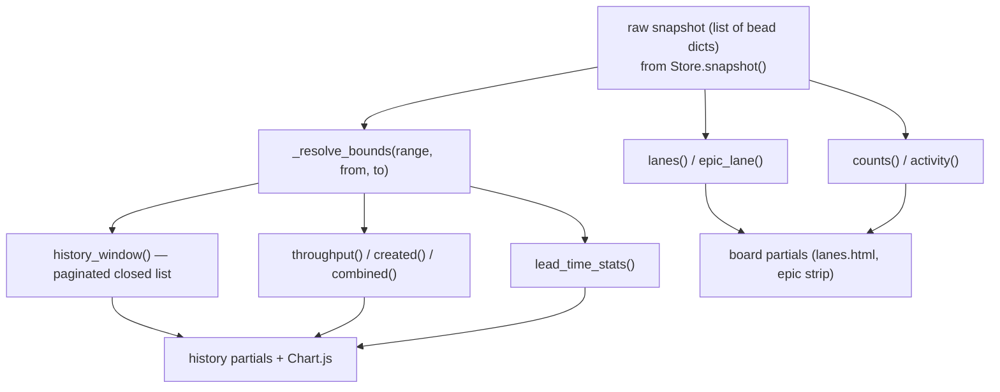

# Concept: Derive layer (pure view shaping)

## What is it

The **derive layer** ([`src/bdboard/derive/`](../../src/bdboard/derive/)) is the
set of *pure functions* that turn a raw list of bead dicts — exactly as `bd list
--json` emits them — into the view-shaped data structures the templates render:
swim lanes, the epic strip, the masthead counts, the activity feed, and every
History-page series and KPI. It owns **no I/O, no caching, and no global
state**: each function takes the snapshot list (plus optional plain arguments
like a range key or page number) and returns a fresh value. Freshness is the
Store's job; *talking to bd* is the `Bd` client's job; the derive layer's only
job is **shaping**. (The Store and `Bd` client each get their own Concept doc —
`store-snapshot-cache.md` and `bd-cli-source-of-truth.md`, manifest items 022
and 021 — once those beads land; see [Related](#related).)

## Why this approach

bdboard deliberately separates three concerns that a naïve dashboard would
tangle together: fetching data, caching it, and shaping it for the screen.
Pinning all the shaping logic into one side-effect-free layer buys several
things that were each learned to matter:

- **Testability without a workspace.** Because the functions are pure over a
  list of dicts, the whole board/History logic is unit-testable with
  hand-built fixtures — no FastAPI app, no `awatch`, no real `bd` workspace, no
  dolt DB. See [`tests/test_derive_counts.py`](../../tests/test_derive_counts.py),
  [`tests/test_derive_epics.py`](../../tests/test_derive_epics.py), and
  [`tests/test_derive_history.py`](../../tests/test_derive_history.py).
- **One snapshot, many views.** A single `bd list` snapshot feeds `lanes`,
  `epic_lane`, `activity`, and `counts` for the board, and the History page
  derives *all* of its series (`throughput`, `created`, `combined`),
  pagination (`history_window`), and KPIs (`lead_time_stats`) from the same
  in-memory list — **no extra `bd` call per chart or per page** (design §D5).
  This is what keeps the single-writer dolt gate happy and the UI cheap.
- **One definition per rule (DRY).** "What counts as closed", "what the board's
  closed window is", and "how the History window resolves range vs. custom
  dates" each live in exactly one place and are imported everywhere else —
  including back into [`bd.py`](../../src/bdboard/bd.py) (which imports
  `BOARD_CLOSED_WINDOW_DAYS`) and [`app.py`](../../src/bdboard/app.py) (which
  builds `_LOCKED_EDIT_STATUSES` from `derive.CLOSED_STATUSES`). When the fetch
  filter and the in-memory slice must agree, they call the *same* resolver
  (`resolve_history_bounds`) so there is no off-by-one between them.

Rejected alternative: shaping inside the route handlers or the Jinja templates.
That would scatter the lane rules, the closed-set definition, and the
percentile math across HTML and req code where they could drift apart and
could only be tested by booting the app and scraping rendered markup. Keeping
shaping pure and central makes the rules auditable and the templates dumb
renderers (see [HTMX + server-rendered partials](htmx-partials-architecture.md)).

## How it works

The package was split out of a single `derive.py` once it crossed the project's
600-line guideline, but the public import surface is preserved verbatim:
`from bdboard import derive` and `from bdboard.derive import <name>` keep working
because [`derive/__init__.py`](../../src/bdboard/derive/__init__.py) re-exports
every symbol (including the underscore-prefixed helpers the tests import) from
three focused submodules:

| Submodule | Owns |
| --- | --- |
| [`timeutil.py`](../../src/bdboard/derive/timeutil.py) | ISO-8601 parsing (`_epoch`, `_parse_dt`, `_day_bucket`) and humanization (`humanize_ts`, `humanize_hours`) |
| [`lanes.py`](../../src/bdboard/derive/lanes.py) | Board shaping: `epic_lane`, `lanes`, `activity`, `counts`, the dependency-field accessors, and the closed-set constants |
| [`history.py`](../../src/bdboard/derive/history.py) | History page: `history_window`, `throughput`, `created`, `combined`, `lead_time_stats`, `status_timeline`, and window/bounds resolution |

The split is purely organizational — every function stays pure over the
snapshot list, and the three submodules lean on `timeutil` rather than on each
other (`history` imports only `_is_closed` from `lanes`).

A concrete example — bucketing a snapshot into swim lanes. `lanes()` excludes
epics (they live in the epic strip) and molecule wrappers (redundant
formula-pour grouping nodes), then assigns each remaining bead to a lane by
status, treating an `open` bead with an unmet blocking dependency as `blocked`:

```python
from bdboard import derive

snapshot = [
    {"id": "a", "status": "open", "priority": 1, "updated_at": "2026-06-02T10:00:00Z"},
    {"id": "b", "status": "open", "priority": 0,
     "deps": [{"type": "blocks", "depends_on_id": "a"}]},  # a is not closed → blocked
    {"id": "c", "status": "in_progress"},
    {"id": "d", "status": "closed", "closed_at": "2026-06-01T09:00:00Z"},
]

buckets = derive.lanes(snapshot)
# buckets["ready"]       -> [a]   (open, no unmet blocker; P-then-recency sorted)
# buckets["blocked"]     -> [b]   (open but blocked-by an open bead)
# buckets["in_progress"] -> [c]
# buckets["closed"]      -> [d]   (sorted by closed_at desc)
```

The History side composes from one shared pipeline. `_resolve_bounds()` is the
single source of truth for the window: an explicit `from_date`/`to_date` custom
selection supersedes the `range_key` preset, otherwise the preset cutoff applies
with no upper bound. `throughput` and `created` are
[`functools.partial`](../../src/bdboard/derive/history.py) specializations of
one `_daily_count_series` pipeline (pre-binding the date field and the window
filter) so the two series stay in lock-step by construction rather than by
duplicated code, and both gap-fill missing days to zero so the charts read as
continuous lines.



## Where used

| Consumer | How |
| --- | --- |
| [`app.py:api_lanes`](../../src/bdboard/app.py) | `derive.epic_lane(...)`, `derive.lanes(beads)`, `derive.activity(beads)` shape the board view |
| [`app.py:_hydrate_epic_dependencies`](../../src/bdboard/app.py) | `derive.get_dependency_list(full)` reads each epic's dep edges before `epic_lane`; called from `api_lanes` |
| [`app.py:api_counts`](../../src/bdboard/app.py) | `derive.counts(await store.snapshot())` powers the masthead KPI strip |
| [`app.py:api_history`](../../src/bdboard/app.py) | `resolve_history_bounds` / `clamp_page_size` / `history_window` / `throughput` / `created` / `combined` / `lead_time_stats` build the entire History page; `HISTORY_RANGES` / `HISTORY_PAGE_SIZES` populate the filter controls |
| [`app.py:api_bead_audit`](../../src/bdboard/app.py) | `derive.status_timeline(entries)` enriches the audit view with the per-bead status-transition timeline |
| [`app.py` Jinja filters](../../src/bdboard/app.py) | `humanize_ts` / `humanize_hours` registered as template filters |
| [`app.py` edit guard](../../src/bdboard/app.py) | `_LOCKED_EDIT_STATUSES = derive.CLOSED_STATUSES \| {"in_progress"}` — one definition of "closed" |
| [`bd.py`](../../src/bdboard/bd.py) | Imports `BOARD_CLOSED_WINDOW_DAYS` to bound the board's closed fetch (`--closed-after`) consistently with the lane derivation |
| [`tests/test_derive_counts.py`](../../tests/test_derive_counts.py), [`test_derive_epics.py`](../../tests/test_derive_epics.py), [`test_derive_history.py`](../../tests/test_derive_history.py) | Unit-test the pure functions directly against fixtures |

## Conventions

> [!IMPORTANT]
> When touching the derive layer, preserve these invariants:
> - **Stay pure.** No `bd` calls, no file reads, no caching, no `datetime.now()`
>   baked into business logic. Time-dependent functions (`_range_to_cutoff`,
>   `throughput`, `lead_time_stats`, …) take an injectable `now` so tests are
>   deterministic. Freshness belongs to the Store (`store-snapshot-cache.md`);
>   fetching belongs to the `Bd` client (`bd-cli-source-of-truth.md`).
> - **Read fields through the accessors.** bd's JSON shape varies — deps live
>   under `deps` *or* `dependencies`, a dep type under `type` *or*
>   `dependency_type`, a target under `depends_on_id` / `target` / `id` /
>   `dependsOnId`. Always go through `get_dependency_list`,
>   `get_dependency_type`, and `get_dependency_target_id` instead of indexing
>   raw keys.
> - **Keep "closed" defined once.** Use `CLOSED_STATUSES` / `_is_closed`
>   everywhere; never inline a `status == "closed"` check that would miss
>   `resolved` / `done`.
> - **Resolve the History window in one place.** Call `resolve_history_bounds`
>   (a.k.a. `_resolve_bounds`) so the bd fetch filter and every in-memory slice
>   agree on the same `(cutoff, ceiling)` — `cutoff` inclusive, `ceiling`
>   exclusive — with no off-by-one. Custom from/to supersedes the preset range.
> - **Add new derivations to `__init__.__all__`.** The package re-exports its
>   whole surface (including `_`-prefixed helpers the tests import) so callers
>   keep using `derive.<name>`; a new symbol that isn't re-exported silently
>   isn't part of the contract.
> - **Gap-fill day series.** New per-day charts must zero-fill missing days via
>   `_fill_daily_series` / `_iter_day_span` so the timeline is continuous, not
>   jagged.

## Anti-patterns

> [!CAUTION]
> Things that re-tangle the layers — don't do these:
> - **Don't shape data in route handlers or templates.** That scatters the lane
>   rules and the closed-set definition where they can't be unit-tested and
>   drift apart. The handler's job is to call a derive function and hand the
>   result to a dumb template.
> - **Don't issue a `bd` call per view, per chart, or per page.** Every History
>   series and the paginated closed list are pure slices over the *one*
>   snapshot — adding a fetch per series would multiply subprocesses and fight
>   the single-writer dolt gate (design §D5).
> - **Don't reach into raw dep keys.** Indexing `bead["deps"]` or
>   `dep["target"]` directly breaks on the other field-name variants; use the
>   accessors.
> - **Don't re-implement the closed window or the range resolver.** Duplicating
>   `BOARD_CLOSED_WINDOW_DAYS` or the from/to-vs-range precedence is how the
>   header CLOSED KPI and the Closed lane count drifted apart before
>   (`bdboard-p8v`). Import the constant / call the resolver.
> - **Don't smuggle in I/O or mutable module state for a "quick" cache.** It
>   destroys testability and duplicates the Store's job; the layer's whole value
>   is that a function's output depends only on its arguments.
> - **Don't measure the final status-timeline dwell against `now`.** The last
>   stop is the bead's *current* state with an open-ended dwell — leave it
>   `None` (purity again: no wall-clock in the shaping).

## Related

- Concept: bd CLI as runtime source of truth — `Concepts/bd-cli-source-of-truth.md`
  *(forthcoming; manifest item 021)*
- Concept: Store snapshot cache & change detection — `Concepts/store-snapshot-cache.md`
  *(forthcoming; manifest item 022)*
- [Concept: Watcher debounce/cooldown & self-feedback skip](watcher-scheduling.md)
- [Concept: HTMX + server-rendered partials](htmx-partials-architecture.md)
- [Architecture](../Architecture.md)
- Source: [`src/bdboard/derive/__init__.py`](../../src/bdboard/derive/__init__.py),
  [`derive/lanes.py`](../../src/bdboard/derive/lanes.py),
  [`derive/history.py`](../../src/bdboard/derive/history.py),
  [`derive/timeutil.py`](../../src/bdboard/derive/timeutil.py)
- Tests: [`tests/test_derive_counts.py`](../../tests/test_derive_counts.py),
  [`tests/test_derive_epics.py`](../../tests/test_derive_epics.py),
  [`tests/test_derive_history.py`](../../tests/test_derive_history.py)
