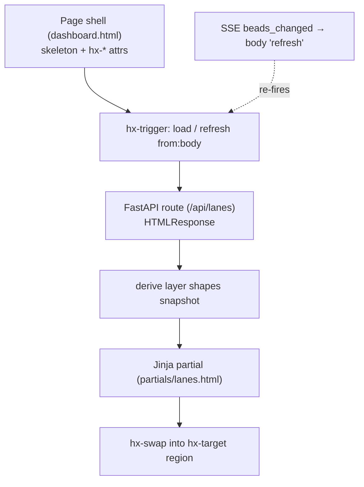

# Concept: HTMX + server-rendered partials

## What is it

bdboard's entire UI is built with **HTMX over server-rendered Jinja2
partials**: the browser loads one HTML shell per page, then HTMX fetches small
HTML fragments from FastAPI routes and swaps them into the DOM. There is no
client-side framework, no JSON-to-DOM rendering layer, and no build step — the
server is the single renderer of truth and HTML is the wire format.

## Why this approach

The alternative — a SPA (React/Vue/etc.) talking to a JSON API — would force
bdboard to maintain *two* renderers: one server-side for the data and one
client-side for the markup, with a JSON contract glued between them. For a
single-user localhost dashboard that mostly *reflects* `bd` workspace state,
that is pure ceremony. HTMX lets the server keep ownership of all rendering, so:

- **One renderer.** A bead card looks the same whether it arrives on first
  paint or via a live SSE-triggered refresh, because the same Jinja partial
  (`partials/bead_card.html`) emits it both times. No drift between an
  "initial render" path and an "update" path.
- **No build toolchain.** HTMX is a single `<script>` tag pulled from a CDN
  ([`base.html`](../../src/bdboard/templates/base.html) →
  `https://unpkg.com/htmx.org@1.9.12`). There is no bundler, no transpile, no
  `node_modules`.
- **HTML is the API.** Endpoints return HTML fragments, not JSON. The
  [Endpoint docs](../Endpoints/index.md) describe `/api/lanes`, `/api/counts`,
  `/api/history`, etc. — every one of them renders a partial. This keeps the
  contract human-inspectable with `curl`.
- **Cheap, non-blocking first paint.** Page routes (`/`, `/memory`,
  `/history`) return an instant shell with skeleton placeholders; the
  expensive `bd`-backed data hydrates afterward via HTMX `load` triggers. See
  the [server-startup flow](../Flows/server-startup.md) and
  [live-refresh pipeline](../Flows/live-refresh-pipeline.md).
- **Progressive enhancement for free.** Mutations carry both an
  `hx-headers` CSRF token *and* a hidden form field, so the write paths
  degrade to plain `<form>` POSTs if JS is unavailable.

## How it works

Each page is a thin **shell** (``) containing one or
more **swap regions**. A swap region is just an element carrying HTMX
attributes that declare *when* to fetch (`hx-trigger`), *what* to fetch
(`hx-get`/`hx-post`), *where* to put the result (`hx-target`), and *how* to
insert it (`hx-swap`). The matching FastAPI route renders a Jinja **partial**
under `templates/partials/` and returns it as `HTMLResponse`.

The flow for the board's swim lanes:

1. `GET /` returns `dashboard.html` — a shell whose `.lanes-region` ships a
   skeleton and declares `hx-get="/api/lanes" hx-trigger="load, refresh from:body"`.
2. On `load`, HTMX fetches `/api/lanes`. The route
   ([`app.py:api_lanes`](../../src/bdboard/app.py)) shapes a snapshot via the
   [derive layer](derive-layer.md) and renders `partials/lanes.html`.
3. HTMX swaps that HTML into `.lanes-region` (`hx-swap="innerHTML"`).
4. When the filesystem changes, the [watcher](watcher-scheduling.md) → Store →
   SSE pipeline pushes a `beads_changed` event; `base.html`'s `EventSource`
   handler dispatches a synthetic `refresh` DOM event on `<body>`; the
   `refresh from:body` trigger re-fetches `/api/lanes` and re-swaps — same
   partial, live data.



A minimal illustrative example — the route returns *HTML*, not JSON:

```python
# src/bdboard/app.py (shape)
@app.get("/api/counts", response_class=HTMLResponse)
async def api_counts(request: Request) -> HTMLResponse:
    return TEMPLATES.TemplateResponse(
        request,
        "partials/counts.html",                       # a fragment, not a page
        {"counts": derive.counts(await store.snapshot())},
    )
```

```html
<!-- dashboard.html: the swap region that consumes it -->
<div class="masthead-counts" id="counts"
     aria-busy="true"
     hx-get="/api/counts"
     hx-trigger="load, refresh from:body"
     hx-swap="innerHTML">
     <!-- instant placeholder -->
</div>
```

Two patterns recur and are worth naming:

- **Out-of-band (OOB) swaps.** A single response can update *more than one*
  region. The History endpoint returns the `#history-region` body **and** an
  `hx-swap-oob="true"` stats fragment (`partials/history_stats.html`) that
  HTMX peels off and swaps into the masthead `#history-stats` by id. The
  bead detail audit (`partials/bead_audit.html`) and the modal priority badge
  (`partials/bead_priority_badge.html`) use the same trick to update a
  sibling region from one fetch.
- **`htmx:configRequest` interception.** `base.html` listens for
  `htmx:configRequest` to inject parameters that aren't in the markup — e.g.
  the persisted History page-size and the active date window — so bare `load`
  / SSE-`refresh` fetches don't silently reset user state. This is the seam
  where client-side state is reconciled with server-rendered requests.

## Where used

| Consumer | How |
| --- | --- |
| Board swim lanes ([`dashboard.html`](../../src/bdboard/templates/dashboard.html)) | `.lanes-region` `hx-get="/api/lanes"` on `load, refresh from:body`; closed lane lazy-loads via `/api/lanes/closed` |
| Counts strip ([`partials/counts.html`](../../src/bdboard/templates/partials/counts.html)) | `#counts` `hx-get="/api/counts"`, swapped on `load` + SSE refresh |
| Bead detail modal ([`partials/bead_modal.html`](../../src/bdboard/templates/partials/bead_modal.html)) | Card `hx-get="/api/bead/{id}"` → `hx-target="#bead-modal"`; instant skeleton painted on `htmx:beforeRequest` |
| Inline field edit ([`partials/field_row.html`](../../src/bdboard/templates/partials/field_row.html)) | `hx-post="/api/bead/{id}/field"` → `hx-swap="outerHTML"` on the row; see [field-edit write path](../Flows/field-edit-write-path.md) |
| History page ([`history.html`](../../src/bdboard/templates/history.html)) | `#history-region` `hx-get="/api/history"`; range/pager links re-swap; stats delivered OOB |
| Memory page ([`memory.html`](../../src/bdboard/templates/memory.html)) | Search box `hx-get="/api/memory"` on debounced `keyup`; create form `hx-post="/api/memory"` |
| Formula pour ([`partials/formula_form.html`](../../src/bdboard/templates/partials/formula_form.html)) | Dialog loads picker (`/api/formulas`), then variable form, then `hx-post=".../pour"`; see [formula pour fan-out](../Flows/formula-pour-fanout.md) |
| Live updates ([`base.html`](../../src/bdboard/templates/base.html)) | `EventSource('/api/events')` → `body` `refresh` event drives every `refresh from:body` region |

## Conventions

> [!IMPORTANT]
> When adding or touching HTMX UI, follow the patterns already in the tree:
> - **Render fragments, never pages, from `/api/*` routes.** Return a
>   `partials/*.html` via `TEMPLATES.TemplateResponse(... response_class=HTMLResponse)`.
>   Page routes (`/`, `/memory`, `/history`) return the shell only.
> - **One partial, two callers.** First paint and SSE refresh must render the
>   *same* partial so they can't drift. Wire live regions with
>   `hx-trigger="load, refresh from:body"`.
> - **Skeleton-first.** Give every async region an `aria-busy="true"`
>   placeholder (`partials/*_skeleton.html`); the `htmx:afterSettle` handler in
>   `base.html` flips `aria-busy` to `false` once real content lands.
> - **Mutations carry CSRF twice.** Every write form includes
>   `hx-headers='{"X-CSRF-Token": "{{ csrf_token }}"}'` **and** a hidden
>   `csrf_token` input; the server validates either via
>   [`_check_csrf`](../../src/bdboard/app.py). Keep both for JS-off fallback.
> - **Inject hidden state in `htmx:configRequest`, not the markup**, when a
>   bare `load`/`refresh` fetch must preserve client-side state (page size,
>   active window). Explicit user requests already carrying the param must win.
> - **Use OOB swaps to update siblings from one response** rather than firing a
>   second request. Mark the extra fragment `hx-swap-oob="true"` and target it
>   by stable `id`.
> - **Pin the HTMX version** in `base.html` (`htmx.org@1.9.12`) so behavior is
>   reproducible; bump deliberately, not implicitly.

## Anti-patterns

> [!CAUTION]
> Things that break the HTMX-partials model — don't do these:
> - **Don't add a client-side framework or JSON render layer.** That
>   reintroduces the two-renderer split this architecture exists to avoid. If
>   you're rendering markup from JSON in the browser, you've left the pattern.
> - **Don't return a full page from an `/api/*` route.** Returning a
>   `` document into an `innerHTML` swap nests a whole
>   page (duplicate `<head>`, re-loaded HTMX) inside a region. Return the
>   fragment only.
> - **Don't poll on a timer for "live" updates.** Live data rides the existing
>   SSE → `refresh from:body` pipeline (see
>   [watcher-scheduling](watcher-scheduling.md)). Adding `hx-trigger="every Ns"`
>   duplicates work the EventBus already does and hammers the `bd` CLI.
> - **Don't bind JS listeners directly to swap-target elements.** They're
>   replaced on every swap, so the listener dies. Delegate from `document`
>   (not `document.body` in `<head>` scripts, which is still `null` there) —
>   this exact bug killed the History custom-range toggle once already.
> - **Don't drop CSRF on a new write path.** A POST/DELETE without the
>   `X-CSRF-Token` header *and* hidden field will 403 via `_check_csrf`.
> - **Don't let a 4xx/5xx silently wipe a row.** HTMX won't swap non-2xx by
>   default, but render the server's error into the region's `aria-live`
>   feedback slot (see the `htmx:beforeSwap` handler in `base.html`) instead of
>   losing it.

## Related

- [Concept: Derive layer (pure view shaping)](derive-layer.md)
- [Concept: Store snapshot cache & change detection](store-snapshot-cache.md)
- [Concept: Watcher debounce/cooldown & self-feedback skip](watcher-scheduling.md)
- [Concept: bd CLI as runtime source of truth](bd-cli-source-of-truth.md)
- [Flow: Live-refresh pipeline](../Flows/live-refresh-pipeline.md)
- [Flow: Inline field-edit write path](../Flows/field-edit-write-path.md)
- [Endpoint: SSE events (/api/events)](../Endpoints/sse-events.md)
- [Endpoint: Lanes API (/api/lanes, /api/lanes/closed, /api/counts)](../Endpoints/lanes-api.md)
- [Feature: Live auto-refresh](../Features/live-auto-refresh.md)
- [Architecture](../Architecture.md)
