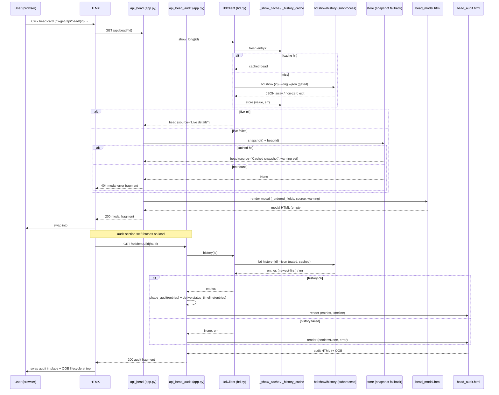

# GET /api/bead/{bead_id} · /audit · /raw

The **read trio** behind the bead modal. Three sibling `GET` routes that turn a
single bead id into, respectively: the rendered detail modal (`/api/bead/{id}`),
its lazily-loaded lifecycle timeline + audit trail (`/api/bead/{id}/audit`), and
an unstyled raw-JSON dump of every field bd knows (`/api/bead/{id}/raw`). They
are the **read** counterpart to the lone write route
([`POST /api/bead/{id}/field`](BeadFieldEditApi.md)) and share the same
`BdClient.show_long` source and `partials/field_row.html` row markup, so what you
read here is byte-identical to what you edit there.

All three are deliberately **failure-tolerant**: the modal falls back to the
cached list snapshot when the live `bd show` is unavailable, the audit endpoint
renders a friendly "unavailable" partial instead of breaking the already-open
modal, and `/raw` returns an `{"error": …}` object rather than a 5xx. The only
hard failure is a genuinely unknown bead, which yields a `404` modal-error
fragment.

## Overview

| Method | Path | Auth | Purpose |
| --- | --- | --- | --- |
| GET | `/api/bead/{bead_id}` | None (localhost single-user; no token, read-only) | Render the bead detail modal (`partials/bead_modal.html`) from `bd show {id} --long --json`, falling back to the cached snapshot when live data is down; `404` HTML fragment if the bead is unknown |
| GET | `/api/bead/{bead_id}/audit` | None | Lazily render the lifecycle timeline + field-by-field audit trail (`partials/bead_audit.html`) from `bd history {id} --json`; the timeline swaps out-of-band into `#lifecycle-slot`. Always `200` — bd failures render a graceful "unavailable" partial |
| GET | `/api/bead/{bead_id}/raw` | None | Escape hatch: dump the full bead object as raw JSON (`bd show {id} --long --json`), falling back to the snapshot, then to `{"error": …}`. The **only** JSON-returning route in bdboard |

> [!NOTE]
> Like every bdboard route, these are **localhost, single-user, read-only**
> > endpoints with no login, no cookie, and no per-user authorization. Being GETs
> with no side effects, they carry **no CSRF token** (unlike the mutating
> [field-edit route](BeadFieldEditApi.md)).

## Request

All three are plain `GET`s — no request body, no `Content-Type`, no form fields.
The handlers are `api_bead`, `api_bead_audit`, and `api_bead_raw` in
`src/bdboard/app.py`. The browser issues the HTMX (`hx-get`) for the modal
flow; `/raw` is normally opened in a new tab from the modal header's "raw JSON"
link.

### Path/Query Params

| Name | In | Type | Required | Notes |
| --- | --- | --- | --- | --- |
| `bead_id` | path | string | Yes | The bead to read, e.g. `bdboard-mol-bfs.16`. Passed straight to `bd show {bead_id} --long` / `bd history {bead_id}` and, on the fallback path, to `store.bead(bead_id)`. An unknown id is not an error to bd's subprocess per se — it surfaces as an empty/None result that the handler converts to a `404` (modal) or an `{"error": …}` object (raw). |

There are no query params on any of the three routes.

### Headers

| Header | Required | Notes |
| --- | --- | --- |
| `HX-Request` | No | Sent automatically by HTMX on the modal/audit fetches. Not inspected by these handlers — the response is the same fragment regardless, so a bare `curl` works identically. |
| `Accept` | No | Ignored. `/api/bead/{id}` and `/audit` always return `text/html` (`HTMLResponse`); `/raw` always returns `application/json` (`JSONResponse`). Content type is fixed per route, not content-negotiated. |

There are no required headers — these are unauthenticated reads.

### Body

None. All three routes are `GET` with no request body. For completeness, the
*shape the modal flow exchanges* is: the client sends only a path, and the
server returns HTML (or JSON for `/raw`). There is no JSON request skeleton to
document.

```json
{}
```

### Validation Rules

These reads validate **availability**, not input — there is no user-supplied
body to whitelist or sanitize. The "rules" are the fallback/escalation ladder
each handler applies to the `(value, error)` pair returned by `BdClient`:

| Field | Rule | Error |
| --- | --- | --- |
| `bead_id` (modal) | `show_long` must return a bead **or** the cached `store.bead(bead_id)` must resolve | `404` HTML — `<div class='modal-error'>We couldn't find that bead. Please refresh the board and try again.</div>` |
| live vs cached (modal) | If `show_long` failed (`full is None and err`) **but** the cached snapshot resolved, render the cached bead with a `warning` banner | No error — `200` with `source="Cached snapshot"` and a `modal-warning` banner |
| `bead_id` (audit) | `history` returning `None` is **not** a hard error — render `bead_audit.html` with `entries=None`, `error=<msg>` | Inline partial — `Audit history is temporarily unavailable.` (still `200`) |
| `bead_id` (raw) | `show_long` returning `None` falls back to `store.bead(bead_id)`, then to a synthesized error object | `200` JSON — `{"error": "<bd err or 'not found'>"}` |

### Rate Limit

| Limit | Window | Scope |
| --- | --- | --- |
| None explicit; reads are TTL-cached (`SUCCESS_TTL_S=10s`, `ERROR_TTL_S=30s`) and in-flight-deduped, and all `bd` subprocesses are serialized by `BdClient._subprocess_gate` | per-process | A burst of identical reads for one bead collapses to a single `bd` subprocess (cache hit or in-flight await); concurrent reads for *different* beads queue on the single-writer gate rather than running in parallel |

## Response

`/api/bead/{id}` and `/audit` return **HTML fragments** (`HTMLResponse`) for
HTMX to swap; `/raw` returns **JSON** (`JSONResponse`). None return a JSON
envelope around the HTML — the HTML *is* the body.

### Success

**`200 OK` — `GET /api/bead/{bead_id}`** renders `partials/bead_modal.html`: the
modal header (id, priority badge, status chip, title, optional cached-data
warning, and a "raw JSON" link), an empty `#lifecycle-slot` (filled later by the
out-of-band audit swap), the `field-grid` of `_ordered_fields(bead)` rows, and an
audit `<section>` that self-fetches `/audit` via `hx-trigger="load"`.
Conceptually:

```json
{
  "status": 200,
  "content_type": "text/html",
  "body": "<div class=\"modal-backdrop\"><article class=\"modal\"><header class=\"modal-head\">…id, priority badge, status chip, title…<div class=\"modal-source muted\">view: Live details · <a href=\"/api/bead/{id}/raw\">raw JSON</a></div></header><div class=\"modal-scroll\"><div id=\"lifecycle-slot\"></div><section class=\"modal-body\">…field_row.html per field…</section><section hx-get=\"/api/bead/{id}/audit\" hx-trigger=\"load\">…loading history…</section></div></article></div>"
}
```

The template context the handler passes is:

```json
{
  "bead": { "id": "…", "title": "…", "status": "…", "updated_at": "…", "...": "…all bd fields…" },
  "fields": [ { "key": "title", "val": "…", "kind": "scalar", "editable": true, "editor": "text", "flag": "--title", "enum_options": null, "append_only": false } ],
  "source": "Live details",
  "warning": null
}
```

> [!NOTE]
> `source` is `"Live details"` on the happy path and `"Cached snapshot"` on the
> fallback path. `warning` is non-null only when live data failed **and** a
> cached copy was served: `"Showing cached details while live data is
> temporarily unavailable."`

**`200 OK` — `GET /api/bead/{bead_id}/audit`** renders `partials/bead_audit.html`,
which carries an out-of-band `#lifecycle-slot` swap (the lifecycle timeline) plus
the in-place audit trail. The template context:

```json
{
  "entries": [ { "when": "2026-06-04T10:24:56Z", "who": "Aaron Weegens", "what": "status: open → in_progress, set started_at", "commit": "4272e1fa" } ],
  "timeline": [ { "status": "open", "when": "2026-06-04T09:00:00Z", "who": "Aaron Weegens", "commit": "deadbeef", "dwell_h": 1.4 }, { "status": "in_progress", "when": "2026-06-04T10:24:56Z", "who": "Aaron Weegens", "commit": "4272e1fa", "dwell_h": null } ],
  "error": null
}
```

> [!IMPORTANT]
> `entries` (newest-first, no-op dolt commits filtered by `_shape_audit`) and
> `timeline` (oldest-first, status-only stops with `dwell_h` from
> `derive.status_timeline`) are derived from the **same** `bd history` payload —
> one subprocess call feeds both views. See
> [Derive layer](../Concepts/DeriveLayer.md).

**`200 OK` — `GET /api/bead/{bead_id}/raw`** returns the full bead object exactly
as `bd show {id} --long --json` emits it (after unwrapping the single-element
array). Real top-level field names:

```json
{
  "id": "bdboard-mol-bfs.16",
  "title": "FlowDoc maintainer: Endpoint: Bead detail API (/api/bead/{id})",
  "description": "Write __docs/Endpoints/BeadDetailApi.md …",
  "acceptance_criteria": "file exists at the PascalCase path …",
  "issue_type": "task",
  "status": "in_progress",
  "priority": 2,
  "assignee": "Aaron Weegens",
  "owner": "Aaron Weegens",
  "created_by": "Aaron Weegens",
  "created_at": "2026-06-04T09:00:00Z",
  "started_at": "2026-06-04T10:24:56Z",
  "updated_at": "2026-06-04T10:24:56Z",
  "closed_at": null,
  "close_reason": null,
  "parent": "bdboard-mol-bfs",
  "labels": ["discover", "docs", "flowdoc"],
  "external_ref": null,
  "estimate": null,
  "dependencies": [],
  "dependents": [],
  "dependency_count": 0,
  "dependent_count": 0,
  "comments": [],
  "comment_count": 0,
  "metadata": {}
}
```

When live and cache both fail, `/raw` instead returns `{"error": "<bd error or 'not found'>"}` — still `200`.

### Errors

| Status | Code (response body / detail) | When |
| --- | --- | --- |
| 404 | `<div class='modal-error'>We couldn't find that bead. Please refresh the board and try again.</div>` | `GET /api/bead/{id}`: `show_long` returned `None` **and** the cached `store.bead(bead_id)` lookup also returned `None` (unknown id, or bd down with an empty snapshot). |
| 200 (degraded) | `partials/bead_modal.html` with `source="Cached snapshot"` + `modal-warning` banner | `GET /api/bead/{id}`: live `show_long` failed but the cached snapshot had the bead — served stale rather than failing. |
| 200 (degraded) | `partials/bead_audit.html` → `Audit history is temporarily unavailable.` | `GET /api/bead/{id}/audit`: `bd history` failed/timed out (`entries is None`). Deliberately not a 5xx so the already-open modal is never broken by a flaky history call. |
| 200 (degraded) | `{"error": "<bd err or 'not found'>"}` | `GET /api/bead/{id}/raw`: both live and cached lookups failed. |
| (caught upstream) | `RuntimeError("Request timed out …")` / `RuntimeError("Could not load bead data …")` | A `bd` subprocess timed out (`SHOW_TIMEOUT_S`/`HISTORY_TIMEOUT_S` = 8s) or exited non-zero inside `_run_json`; `_cached` converts it to the `(None, err)` pair the handlers degrade on — never raised to the client. |

> [!WARNING]
> Because `_cached` stores **failures** too (with the longer `ERROR_TTL_S=30s`),
> a bead that just 404'd or whose `bd show` errored stays in the degraded state
> for up to 30s even if bd recovers immediately. The live-refresh SSE pulse and
> `invalidate_caches()` (fired on detected workspace changes) are what clear it
> early. See [Store snapshot cache & change detection](../Concepts/StoreSnapshotCache.md).

## Implementation Map

| Responsibility | File path | Symbol |
| --- | --- | --- |
| Modal route handler (live → cached fallback → 404) | `src/bdboard/app.py` | `api_bead` |
| Audit/lifecycle route handler (history → shape + timeline → graceful partial) | `src/bdboard/app.py` | `api_bead_audit` |
| Raw-JSON escape-hatch handler | `src/bdboard/app.py` | `api_bead_raw` |
| Live full-detail read (`bd show {id} --long --json`, array-unwrapped, cache-bypass via `fresh=`) | `src/bdboard/bd.py` | `BdClient.show_long` |
| Audit history read (`bd history {id} --json`, newest-first) | `src/bdboard/bd.py` | `BdClient.history` |
| TTL cache + in-flight dedup wrapper | `src/bdboard/bd.py` | `BdClient._cached` / `_show_cache` / `_history_cache` |
| Serialized JSON subprocess (single-writer gate, fd-leak-safe drain) | `src/bdboard/bd.py` | `BdClient._run_json` / `_subprocess_gate` |
| Cache TTLs / per-call timeouts | `src/bdboard/bd.py` | `SUCCESS_TTL_S` / `ERROR_TTL_S` / `SHOW_TIMEOUT_S` / `HISTORY_TIMEOUT_S` |
| Cached-snapshot fallback source | `src/bdboard/store.py` | `store.snapshot` / `store.bead` |
| Modal field ordering + render/editability hints | `src/bdboard/app.py` | `_ordered_fields` / `_field_row` / `_classify_field` / `_FIELD_ORDER` |
| Audit diff shaping (skip no-op dolt commits, force origin "created" row) | `src/bdboard/app.py` | `_shape_audit` / `_diff_issue` / `_short` |
| Status-transition timeline + dwell time (pure over the same history payload) | `src/bdboard/derive/history.py` | `status_timeline` |
| Modal template (header, lifecycle slot, field grid, async audit section) | `src/bdboard/templates/partials/bead_modal.html` | whole template |
| Per-field row markup (shared with the field-edit route) | `src/bdboard/templates/partials/field_row.html` | `field_form` macro + `#field-row-<key>` |
| Audit/lifecycle template (OOB `#lifecycle-slot` + in-place audit list) | `src/bdboard/templates/partials/bead_audit.html` | whole template |
| Priority badge in modal header | `src/bdboard/templates/partials/bead_priority_badge.html` | whole template |
| Regression tests (audit fragment, card `hx-get`) | `tests/test_api_history.py` | bead/audit render assertions |



## Example

Open the modal fragment for a bead (what HTMX does on a card click):

```bash
curl -i 'http://127.0.0.1:8765/api/bead/bdboard-mol-bfs.16' \
  -H 'HX-Request: true'
```

Returns `200` with the `<div class="modal-backdrop">…</div>` modal fragment. An
unknown id returns `404` with the `<div class='modal-error'>…</div>` fragment.

Fetch the lazily-loaded lifecycle timeline + audit trail (what the modal's audit
section self-fetches on load):

```bash
curl -i 'http://127.0.0.1:8765/api/bead/bdboard-mol-bfs.16/audit'
```

Returns `200` with the `#lifecycle-slot` OOB timeline plus the in-place audit
list — or, if `bd history` is down, the friendly "Audit history is temporarily
unavailable" partial (still `200`).

Dump the full raw bead JSON (the modal header's "raw JSON" link), pretty-printed:

```bash
curl -s 'http://127.0.0.1:8765/api/bead/bdboard-mol-bfs.16/raw' | jq .
```

Returns the complete `bd show --long` object, or `{"error": "not found"}` for an
unknown id.

## Related

- [Bead field-edit API (`POST /api/bead/{id}/field`)](BeadFieldEditApi.md) — the
  **write** sibling that edits the very field rows this trio renders; both share
  `BdClient.show_long` and `partials/field_row.html`.
- [Board page (`/`)](../Views/BoardPage.md) — opens the shared `#bead-modal` from
  epic chips, bead cards, and activity rows via `hx-get="/api/bead/{id}"`.
- [History page (`/history`)](../Views/HistoryPage.md) — opens the same modal for
  closed beads via `hx-get="/api/bead/{id}"`.
- [bd CLI as runtime source of truth](../Concepts/BdCliSourceOfTruth.md) — why
  the modal/audit/raw reads bottom out in `bd show` / `bd history` rather than a
  re-implemented store.
- [Store snapshot cache & change detection](../Concepts/StoreSnapshotCache.md) —
  the TTL cache, error caching, and the `snapshot()`/`bead(id)` fallback the
  modal and raw routes degrade onto.
- [Derive layer (pure view shaping)](../Concepts/DeriveLayer.md) — the
  `status_timeline` enrichment the audit endpoint renders alongside the
  field-diff audit rows.
- [HTMX + server-rendered partials](../Concepts/HtmxPartialsArchitecture.md) —
  the `hx-get`/`hx-trigger="load"` modal-then-audit pattern and the out-of-band
  `#lifecycle-slot` swap idiom; also documents `/raw` as the sole JSON route.
- [Endpoints index](index.md) · [Architecture](../Architecture.md#api-surface) ·
  [Manifest](../_Manifest.md) — the API surface and doc catalog this item sits in.
