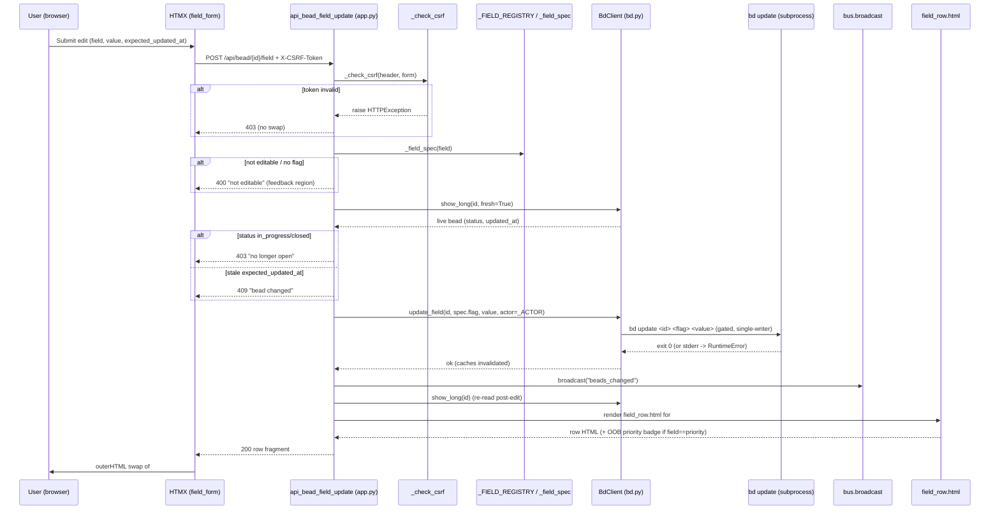

# POST /api/bead/{bead_id}/field

The **write half** of manual bead-field editing. Given one whitelisted field
and its new value, this endpoint runs a single `bd update` mutation and returns
the **re-rendered field row** as an HTML fragment for an in-place HTMX swap — no
full-page reload, no JSON envelope. It is the only route in bdboard that lets a
human change bead *content* (everything else is read-only or lifecycle-only),
and it is deliberately hedged with a registry whitelist, a CSRF guard, a
status gate, and an optimistic-lock precondition so a crafted or stale submit
can never silently clobber a concurrent change.

## Overview

| Method | Path | Auth | Purpose |
| --- | --- | --- | --- |
| POST | `/api/bead/{bead_id}/field` | None (localhost single-user); mutating POST guarded by per-process CSRF token | Edit ONE whitelisted bead field value via `bd update` and return the re-rendered `partials/field_row.html` fragment for an in-place HTMX swap |

> [!NOTE]
> Like every bdboard mutation, this is a **localhost, single-user** tool with
> no login. The only write-side protection is a per-process CSRF token (see
> [CSRF guard](#implementation-map)); there is no cookie/session and no
> per-user authorization.

## Request

`Content-Type: application/x-www-form-urlencoded` — the inline-edit and
add-note `<form>`s post standard form fields (HTMX, not JSON). The handler
signature is `api_bead_field_update(...)` in `src/bdboard/app.py`.

### Path/Query Params

| Name | In | Type | Required | Notes |
| --- | --- | --- | --- | --- |
| `bead_id` | path | string | Yes | The bead to edit, e.g. `bdboard-mol-bfs.17`. Passed straight to `bd update <bead_id>`; a bad id surfaces as a 500 with bd's stderr. |

There are no query params.

### Headers

| Header | Required | Notes |
| --- | --- | --- |
| `X-CSRF-Token` | Yes¹ | The per-process CSRF token. HTMX sends it via `hx-headers='{"X-CSRF-Token": "…"}'` (see `partials/field_row.html` → `field_form` macro). Must equal the server's `_CSRF_TOKEN`. |
| `Content-Type` | Yes | `application/x-www-form-urlencoded` (the form post). |

¹ The CSRF token may instead ride in the `csrf_token` **form field** (fallback
for non-JS posts). At least one of header/form must match or the request is
rejected `403` before any work happens.

### Body

Form-encoded fields (not JSON). Field names are exactly what the handler binds
via `Form(...)`:

```json
{
  "field": "title",
  "value": "New bead title",
  "expected_updated_at": "2026-06-04T10:24:56Z",
  "csrf_token": "<per-process-token, optional if X-CSRF-Token header sent>"
}
```

| Form field | Required | Meaning |
| --- | --- | --- |
| `field` | Yes | The bd field key to edit (e.g. `title`, `description`, `priority`, `notes`). Validated against `_FIELD_REGISTRY`. |
| `value` | No (defaults `""`) | The new value. For `md` editors it is kept verbatim; for every other editor it is `.strip()`ped. For append-only `notes` it is the text to **append**, never a replace. |
| `expected_updated_at` | No | Optimistic-lock token: the bead's `updated_at` at render time. Ignored for append-only fields. |
| `csrf_token` | No (if header sent) | CSRF fallback form field. |

### Validation Rules

| Field | Rule | Error |
| --- | --- | --- |
| `X-CSRF-Token` / `csrf_token` | One must equal `_CSRF_TOKEN` | `403` (HTTPException) — `"Invalid or missing CSRF token. Please refresh the page and try again."` |
| `field` | Must resolve (via `_field_spec`) to a `FieldSpec` with `editable=True` **and** a non-empty `flag` | `400` — `<p class="field-error">Field "<field>" is not editable.</p>` |
| `value` | If the field is `append_only` (notes), the trimmed value must be non-empty | `400` — `<p class="field-error">Nothing to add.</p>` |
| bead `status` | Live-read bead must be editable — i.e. status NOT in `_LOCKED_EDIT_STATUSES` (`in_progress` + `derive.CLOSED_STATUSES`) | `403` — `<p class="field-error">This bead is <status> and can no longer be edited — only open beads are editable.</p>` |
| `expected_updated_at` | For replace-semantics fields, must match the bead's LIVE `updated_at` (when both present) | `409` — `<p class="field-error">This bead changed since you opened it — please refresh and re-apply your edit…</p>` |

### Rate Limit

| Limit | Window | Scope |
| --- | --- | --- |
| None explicit; writes are **serialized** by `BdClient._subprocess_gate` (single-writer asyncio lock) | per-process | All bd mutations across all tabs/clients share the one gate — concurrent POSTs queue rather than run in parallel |

## Response

All responses are **HTML fragments** (`response_class=HTMLResponse`), never
JSON. On success the fragment is the re-rendered `partials/field_row.html` for
`#field-row-<field>`; HTMX swaps it via `hx-swap="outerHTML"`.

### Success

`200 OK` — the re-rendered field row. Conceptually:

```json
{
  "status": 200,
  "content_type": "text/html",
  "body": "<div id=\"field-row-title\" class=\"field field-kind-scalar field-wide\" data-field-key=\"title\" data-editable=\"1\">…re-rendered row with the new value and a fresh expected_updated_at…</div>"
}
```

Variants (all `200`, all HTML):

- **Priority edit:** the row HTML is followed by an **out-of-band** copy of
  `partials/bead_priority_badge.html` (`oob=True`) so the modal-header badge
  updates in the same swap — same OOB idiom the audit endpoint uses for
  `#lifecycle-slot`.
- **Saved but field no longer rendered** (e.g. cleared to empty and filtered
  out of `_ordered_fields`): `<p class="field-saved" role="status">Saved.</p>`.
- **Saved but re-read failed:** `<p class="field-error">Saved, but could not
  refresh — reopen the bead to see the change.</p>` (still `200` — the write
  committed; the SSE-driven refresh will reconcile).

### Errors

| Status | Code (response body / detail) | When |
| --- | --- | --- |
| 403 | `HTTPException` JSON detail: `"Invalid or missing CSRF token…"` | CSRF token missing or mismatched (raised by `_check_csrf`). |
| 400 | `<p class="field-error">Field "<field>" is not editable.</p>` | `field` not in the editable whitelist (or whitelisted but missing a flag). |
| 400 | `<p class="field-error">Nothing to add.</p>` | Append-only field (`notes`) submitted with empty content. |
| 403 | `<p class="field-error">This bead is <status> and can no longer be edited…</p>` | Live bead status is `in_progress` or closed (status gate). |
| 409 | `<p class="field-error">This bead changed since you opened it…</p>` | Stale `expected_updated_at` vs LIVE `updated_at` (optimistic-lock fail) on a replace-semantics field. |
| 500 | `<p class="field-error">Could not save: <bd stderr></p>` | `bd update` subprocess failed (bad value, bd error) — surfaced from `RuntimeError`. |

> [!IMPORTANT]
> The `4xx`/`5xx` field-error fragments are **rendered into the form's
> `[data-edit-feedback]` aria-live region** by the `htmx:beforeSwap` handler in
> `base.html`, which sets `e.detail.shouldSwap = false` so a failed save never
> wipes the row. Only `2xx` actually swaps the row.

## Implementation Map

| Responsibility | File path | Symbol |
| --- | --- | --- |
| Route handler (orchestrates the whole write path) | `src/bdboard/app.py` | `api_bead_field_update` |
| CSRF guard (header-or-form token check) | `src/bdboard/app.py` | `_check_csrf` / `_CSRF_TOKEN` |
| Field editability whitelist (the only place that knows a field's flag/editor) | `src/bdboard/app.py` | `_FIELD_REGISTRY` / `FieldSpec` / `_field_spec` |
| Status gate (open-vs-locked decision, shared with the UI hint pass) | `src/bdboard/app.py` | `_bead_is_editable` / `_LOCKED_EDIT_STATUSES` |
| Human-edit audit attribution | `src/bdboard/app.py` | `_ACTOR` |
| LIVE cache-bypassing re-read (status gate + optimistic lock + re-render) | `src/bdboard/bd.py` | `BdClient.show_long` (`fresh=True`) |
| Serialized `bd update` mutation (single-writer, stdin streaming for long md) | `src/bdboard/bd.py` | `BdClient.update_field` / `_run_mutate` / `_STDIN_FLAG_ALIASES` |
| SSE fan-out so other tabs re-render | `src/bdboard/app.py` | `bus.broadcast("beads_changed")` |
| Row re-render (single source of row markup; byte-identical to modal grid) | `src/bdboard/templates/partials/field_row.html` | `field_form` macro + `#field-row-<key>` div |
| Field ordering / row dict used for re-render | `src/bdboard/app.py` | `_ordered_fields` |
| Priority badge OOB refresh | `src/bdboard/templates/partials/bead_priority_badge.html` | (`oob=True`) |
| Client-side error routing + a11y focus/announce | `src/bdboard/templates/base.html` | `htmx:beforeSwap` / `htmx:afterSwap` handlers |
| Regression tests | `tests/test_field_edit.py`, `tests/test_field_edit_status_gate.py` | CSRF, registry whitelist, append-only, status-gate, optimistic-lock cases |



## Example

A real `curl` invocation editing the `title` of a bead. The CSRF token is the
per-process value the page was rendered with (read it from the page's
`hx-headers`/hidden `csrf_token` input). Note the form encoding and the
`X-CSRF-Token` header:

```bash
curl -i -X POST 'http://127.0.0.1:8765/api/bead/bdboard-mol-bfs.17/field' \
  -H 'X-CSRF-Token: 7r2c9q…(the per-process token)…Xy' \
  -H 'Content-Type: application/x-www-form-urlencoded' \
  --data-urlencode 'field=title' \
  --data-urlencode 'value=FlowDoc maintainer: Bead field-edit API' \
  --data-urlencode 'expected_updated_at=2026-06-04T10:24:56Z'
```

Success returns `200` with the re-rendered `<div id="field-row-title">…</div>`
fragment. Omitting/mismatching the token yields `403`; a non-editable `field`
(e.g. `status`, `parent`, `id`) yields `400 Field "status" is not editable.`;
a stale `expected_updated_at` yields `409`.

Appending a note instead (append-only semantics — never a replace):

```bash
curl -i -X POST 'http://127.0.0.1:8765/api/bead/bdboard-mol-bfs.17/field' \
  -H 'X-CSRF-Token: 7r2c9q…Xy' \
  -H 'Content-Type: application/x-www-form-urlencoded' \
  --data-urlencode 'field=notes' \
  --data-urlencode 'value=Verified BeadFieldEditApi.md against fresh source.'
```

## Related

- [Bead detail API (`/api/bead/{id}`, `/audit`, `/raw`)](BeadDetailApi.md) — the
  **read** sibling that renders the bead modal whose rows this endpoint edits;
  both share `BdClient.show_long` and `partials/field_row.html`.
- [Inline field-edit write path (Flow)](../Flows/FieldEditWritePath.md) — the
  end-to-end flow this endpoint is the HTTP entry point for.
- [Bead detail & inline editing (Feature)](../Features/BeadDetailAndInlineEditing.md) —
  the user-facing feature this route powers.
- [Board page (`/`)](../Views/BoardPage.md) — opens the shared bead modal whose
  per-field rows carry the inline edit/add-note affordances posting here.
- [bd CLI as runtime source of truth](../Concepts/BdCliSourceOfTruth.md) — why
  the write bottoms out in `bd update` and how `update_field` is built.
- [Store snapshot cache & change detection](../Concepts/StoreSnapshotCache.md) —
  the refresh-before-broadcast posture and cache invalidation this route relies
  on for an accurate optimistic re-render.
- [HTMX + server-rendered partials](../Concepts/HtmxPartialsArchitecture.md) —
  the `field_form` macro, OOB swap, and `htmx:beforeSwap` error-routing idiom.
- [Endpoints index](index.md) · [Architecture](../Architecture.md#api-surface) ·
  [Manifest](../_Manifest.md) — the API surface and doc catalog this item sits in.
