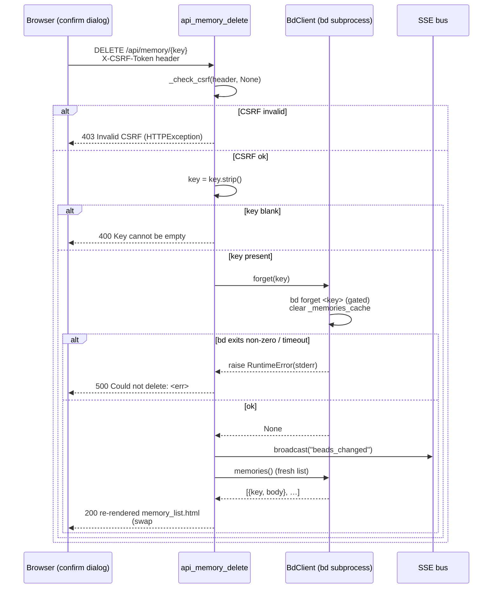

# DELETE /api/memory/{key}

> [!NOTE]
> The route is registered as `DELETE /api/memory/{key:path}`
> (`@app.delete("/api/memory/{key:path}")`). The `:path` converter is
> deliberate: memory keys can contain slashes (e.g. `flowdoc/pour-gate`), so the
> key must be captured as a whole path segment rather than a single
> non-slash token. This is the **forget half** of
> [Memory Curation](../Features/index.md): it deletes ONE `bd` memory via
> `bd forget` and returns the re-rendered memory list for an HTMX swap. It is the
> destructive sibling of the upsert path POST /api/memory (see the
> [Endpoints index](index.md)).

## Overview

| Method | Path | Auth | Purpose |
| --- | --- | --- | --- |
| DELETE | `/api/memory/{key:path}` | CSRF token (header `X-CSRF-Token` **only** — no form fallback); no cookies/session | Delete one `bd` memory by key via `bd forget <key>`, broadcast an SSE `beads_changed`, then return the re-rendered `partials/memory_list.html` for an in-place HTMX swap of `#memory-list` |

## Request

`DELETE` with no request body. The key travels in the URL path; the CSRF token
travels in the `X-CSRF-Token` header (HTMX sends it via `hx-headers`). There is
no form payload — the confirm dialog's "Yes, Forget It" button fires
`hx-delete="/api/memory/<urlencoded key>"`.

### Path/Query Params

| Name | In | Type | Required | Notes |
| --- | --- | --- | --- | --- |
| `key` | path | string (`:path` converter) | yes | The memory key to forget. Captured whole-path so keys with `/` survive; the browser URL-encodes it (`encodeURIComponent`) and FastAPI decodes it back. `.strip()`'d in the handler; passed straight to `bd forget <key>`. An unknown key is not a 4xx here — `bd forget` exits non-zero and surfaces as a `500` (see Errors). |

### Headers

| Header | Required | Notes |
| --- | --- | --- |
| `X-CSRF-Token` | yes | Process-lifetime CSRF token. HTMX sends it via `hx-headers='{"X-CSRF-Token": "{{ csrf_token }}"}'` on the confirm button. `_check_csrf(x_csrf_token, None)` is called with **no form fallback** (DELETE carries no form body), so the header is the only accepted channel — see [CSRF Protection](../Concepts/CsrfProtection.md). |

### Body

No request body. (Shown here for template completeness — the wire request has an
empty body; the only inputs are the path `key` and the CSRF header.)

```json
{}
```

### Validation Rules

| Field | Rule | Error |
| --- | --- | --- |
| `X-CSRF-Token` | Must equal the process `_CSRF_TOKEN` (form fallback is passed as `None`, so the header alone must match) | `403` (HTTPException) `Invalid or missing CSRF token. Please refresh the page and try again.` |
| `key` | Must be non-blank after `.strip()` | `400` `Key cannot be empty.` |
| `key` existence | NOT validated here — `bd forget` is the authority; a non-existent key exits non-zero | `500` `Could not delete: <bd stderr>` |

### Rate Limit

| Limit | Window | Scope |
| --- | --- | --- |
| None (no rate limiter) | — | bdboard is a single-user localhost dashboard. There is no token-bucket / IP throttle; the only throttle is structural: every `bd` mutation is serialized on `BdClient._subprocess_gate` (Dolt is single-writer), so a concurrent forget/remember queues behind the in-flight one rather than racing. |

## Response

`Content-Type: text/html` (`response_class=HTMLResponse`). The body is an HTML
**fragment**, not JSON — bdboard is server-rendered HTMX, so the route returns
the re-rendered memory list that HTMX swaps into `#memory-list` via
`hx-swap="innerHTML"`.

### Success

`200 OK` — the re-rendered `partials/memory_list.html` (built from a fresh
`bd.memories()` read with an empty query, so the full list returns minus the
forgotten key). Shape:

```html
<p class="memory-count" role="status" aria-live="polite">
  3 memories
</p>
<ul class="memory-list" role="list">
  <li class="memory-card">
    <div class="memory-card-head">
      <h3 class="memory-key">flowdoc-pour-gate</h3>
      <div class="memory-card-actions">
        <button type="button" class="memory-action-btn memory-edit-btn"
                aria-label="Edit flowdoc-pour-gate" title="Edit"
                data-key="flowdoc-pour-gate" data-body="…"
                onclick="editMemory(this.dataset.key, this.dataset.body)"></button>
        <button type="button" class="memory-action-btn memory-forget-btn"
                aria-label="Forget flowdoc-pour-gate" title="Forget"
                onclick="confirmForget('flowdoc-pour-gate')"></button>
      </div>
    </div>
    <div class="memory-body prose"><!-- markdown-rendered body --></div>
  </li>
  <!-- … remaining cards … -->
</ul>
```

> [!IMPORTANT]
> On success the handler ALSO calls `bus.broadcast("beads_changed")` BEFORE
> re-reading the list. That SSE event makes every *other* open tab re-fetch
> `GET /api/memory` (via `refresh from:body`), while the swap returned to *this*
> tab is an optimistic refresh so the acting user sees the deletion immediately
> without waiting for the watcher debounce.

If the list is now empty, `memory_list.html` renders the empty state instead of
`<ul>`:

```html
<p class="memory-count" role="status" aria-live="polite">0 memories</p>
<p class="memory-empty muted">
  No memories yet — click <strong>+ New Memory</strong> or run
  <code>bd remember</code> to add one.
</p>
```

### Errors

| Status | Code | When |
| --- | --- | --- |
| `403` | `Invalid or missing CSRF token. Please refresh the page and try again.` | `_check_csrf(x_csrf_token, None)` failed — the `X-CSRF-Token` header was absent or stale (e.g. a server restart minted a new token). Raised as `HTTPException`; no `bd` mutation runs. |
| `400` | `<p class="memory-error" role="alert">Key cannot be empty.</p>` | The path `key` was blank after `.strip()`. |
| `500` | `<p class="memory-error" role="alert">Could not delete: <bd stderr></p>` | `bd.forget` raised `RuntimeError` — `bd forget <key>` exited non-zero (e.g. key-not-found surfaces bd's stderr) or timed out (`FORGET_TIMEOUT_S = 10.0s` → "Request timed out while saving. Please try again."). |

## Implementation Map

| Responsibility | File path | Symbol |
| --- | --- | --- |
| Route handler (validate → forget → broadcast → re-render) | `src/bdboard/app.py` | `api_memory_delete` |
| CSRF guard (header only; form arg passed `None`) | `src/bdboard/app.py` | `_check_csrf`, `_CSRF_TOKEN` |
| Serialized `bd forget <key>` write | `src/bdboard/bd.py` | `BdClient.forget` |
| Generic gated mutation runner (drain-safe subprocess) | `src/bdboard/bd.py` | `BdClient._run_mutate` |
| Forget timeout budget | `src/bdboard/bd.py` | `FORGET_TIMEOUT_S` |
| Memories cache invalidation after the write | `src/bdboard/bd.py` | `BdClient.forget` (clears `self._memories_cache`) |
| Fresh post-delete list read for the swap | `src/bdboard/bd.py` | `BdClient.memories` |
| SSE broadcast so other tabs refresh | `src/bdboard/events.py` | `bus.broadcast("beads_changed")` |
| Re-rendered list partial returned for the swap | `src/bdboard/templates/partials/memory_list.html` | (list markup + empty states) |
| Confirm-before-forget dialog + `hx-delete` wiring | `src/bdboard/templates/memory.html` | `#memory-forget-dialog`, `confirmForget()` |
| Markdown rendering of each memory body | `src/bdboard/md.py` | `render` (the `md` Jinja filter) |
| Endpoint regression coverage | `tests/test_memory_mutations.py` | `test_delete_memory_*` |



## Example

Forget the memory keyed `flowdoc-pour-gate` (CSRF via header; no body). The key
is URL-encoded in the path — slashes in a key would be `%2F`-encoded by the
browser, but the `:path` converter also accepts a literal slash:

```bash
curl -i -X DELETE "http://127.0.0.1:8000/api/memory/flowdoc-pour-gate" \
  -H "X-CSRF-Token: $CSRF_TOKEN"
```

A successful call returns `200` with the re-rendered memory list (the forgotten
key absent); HTMX swaps it into `#memory-list` via `hx-swap="innerHTML"`, and
every other open tab re-fetches `GET /api/memory` off the `beads_changed` SSE.

Forgetting an unknown key surfaces bd's own error as a `500` fragment:

```bash
curl -i -X DELETE "http://127.0.0.1:8000/api/memory/does-not-exist" \
  -H "X-CSRF-Token: $CSRF_TOKEN"
# → 500  <p class="memory-error" role="alert">Could not delete: …</p>
```

## Related

- [Endpoints index](index.md) — every route bdboard exposes.
- [POST /api/memory](index.md) — the upsert sibling (see the Endpoints index
  until its own doc lands); shares the exact CSRF + serialized-mutation +
  SSE-broadcast plumbing and returns the same `memory_list.html` partial (the
  create path *does* accept a form CSRF fallback; this delete path does not).
- [GET /api/memory](index.md) — the read half that renders the list this
  endpoint mutates (see the Endpoints index until its own doc lands); it's what
  other tabs re-fetch on the `beads_changed` SSE.
- [POST /api/bead/{id}/field](PostApiBeadField.md) — the other CSRF-guarded,
  serialized `bd`-mutation write path; same `_check_csrf` + gate + broadcast idiom.
- [Memory (/memory)](../Views/MemoryView.md) — the page surface whose
  confirm-before-forget dialog fires this DELETE.
- [Feature: Memory Curation](../Features/index.md) — the feature this endpoint
  implements.
- [CSRF Protection](../Concepts/CsrfProtection.md) — the token guard fronting
  this destructive write.
- [Subprocess Serialization & Caching](../Concepts/SubprocessSerializationAndCaching.md)
  — the semaphore + cache-invalidation behind `BdClient.forget`.
- [SSE Event Bus](../Concepts/SseEventBus.md) — the `beads_changed` broadcast
  that keeps every tab's list live after a forget.
- [bd CLI as Source of Truth](../Concepts/BdCliSourceOfTruth.md) — why this path
  shells `bd forget` instead of touching `.beads/` directly.
- [Back to docs index](../index.md)
