# GET /api/formulas · GET /api/formulas/{name}/form · POST /api/formulas/{name}/pour

The **formula-pour trio** behind the *"Pour a Formula"* dialog. Three sibling
routes that drive a deliberate two-step-then-commit flow: pick a formula from a
dropdown (`GET /api/formulas`), fill in its declared variables
(`GET /api/formulas/{name}/form`), then materialize the whole bead tree onto the
board (`POST /api/formulas/{name}/pour`). The first two are read-only HTMX swap
targets; the third is the **only** formula write path and is hedged with a CSRF
guard, a server-side required-variable pre-flight, count-honesty reconciliation,
and a best-effort grouping-node rename.

All three are **failure-tolerant**: a `bd formula list` outage degrades to a
friendly inline message rather than 500-ing the swap, an unknown formula name is
a clean `404` fragment, and a rename failure after a successful pour is a soft
warning — never a lost pour. The two read routes lean on a deliberate quirk:
because the bd CLI does **not** expose a formula's variables/steps reliably,
bdboard reads the on-disk `*.formula.json` template file directly (the absolute
path comes from `source` in the list payload).

## Overview

| Method | Path | Auth | Purpose |
| --- | --- | --- | --- |
| GET | `/api/formulas` | None (localhost single-user; read-only, no token) | Render the formula picker `<select>` (`partials/formula_list.html`) from `bd formula list --json` (name + description). A bd failure degrades to a friendly inline message (still `200`) |
| GET | `/api/formulas/{name}/form` | None (read-only) | Render the variable form + collapsed step disclosure (`partials/formula_form.html`) by **parsing the `*.formula.json` file directly** via `BdClient.read_formula_detail`. `404` fragment for an unknown formula |
| POST | `/api/formulas/{name}/pour` | None (localhost single-user); mutating POST guarded by per-process CSRF token | Pour the formula onto the board via `bd mol pour --json`, rename the grouping node to `<formula> <id>`, refresh the store, broadcast `beads_changed`, and return the pour-result acknowledgement (`partials/formula_pour_result.html`) |

> [!NOTE]
> Like every bdboard route, these are **localhost, single-user** endpoints with
> no login, no cookie, and no per-user authorization. The two `GET`s carry **no
> CSRF token** (read-only, no side effects). The mutating `POST /pour` is the
> only one guarded, via the per-process `_CSRF_TOKEN` (header *or* form field).

## Request

The picker (`api_formulas`) and variable form (`api_formula_form`) are plain
HTMX `GET`s — no body, no `Content-Type`. The pour (`api_formula_pour`) is a
`application/x-www-form-urlencoded` POST: the `formula_form.html` `<form>` posts
standard form fields (one `var_<name>` per declared variable, plus the CSRF
token), never JSON. All three handlers live in `src/bdboard/app.py`
(`api_formulas`, `api_formula_form`, `api_formula_pour`).

### Path/Query Params

| Name | In | Type | Required | Notes |
| --- | --- | --- | --- | --- |
| `name` | path | string | Yes (form + pour) | The formula name, e.g. `code-health-audit`. Matched against the `name` field of each `bd formula list --json` entry via `next((f for f in formulas if f.get("name") == name), None)`. URL-encoded by the client (`encodeURIComponent` / `name \| urlencode`); `.strip()`ed server-side on the pour path. No such match → `404`. |

There are no query params on any of the three routes. `GET /api/formulas` takes
no path params either.

### Headers

| Header | Required | Notes |
| --- | --- | --- |
| `X-CSRF-Token` | Yes¹ (pour only) | The per-process CSRF token. `formula_form.html` sends it via `hx-headers='{"X-CSRF-Token": "{{ csrf_token }}"}'`. Validated by `_check_csrf` against `_CSRF_TOKEN`. Not used by the two `GET`s. |
| `Content-Type` | Yes (pour only) | `application/x-www-form-urlencoded` for the pour POST. The two `GET`s send no body. |
| `HX-Request` | No | Sent automatically by HTMX on all three fetches. Not inspected by the handlers — a bare `curl` works identically. |

¹ The CSRF token may instead ride in the `csrf_token` **form field** (hidden
`<input>` fallback for non-JS posts). `_check_csrf` accepts a match from *either*
the header or the form field; if neither matches the request is rejected `403`
before any work happens.

### Body

Only `POST /api/formulas/{name}/pour` has a body — form-encoded, not JSON. The
fields are exactly the hidden CSRF input plus one `var_<name>` text input per
declared variable (rendered by `formula_form.html`). Conceptually:

```json
{
  "csrf_token": "<per-process-token, optional if X-CSRF-Token header sent>",
  "var_repo": "bdboard",
  "var_scope": "src/bdboard"
}
```

| Form field | Required | Meaning |
| --- | --- | --- |
| `csrf_token` | No (if header sent) | CSRF fallback form field (`Form(None, alias="csrf_token")`). |
| `var_<name>` | Per-variable | One field per formula variable. The handler reads `form.get(f"var_{var_name}")`, `.strip()`s it, and falls back to the variable's `default` when blank. Required (no-default) variables left blank trigger the pre-flight `400`. Unknown `var_*` fields are simply not collected (only declared variables are forwarded to bd). |

> [!NOTE]
> The handler only forwards variables it actually parsed from the
> `*.formula.json` file (`bd.read_formula_variables`). A crafted POST with an
> extra `var_bogus` is harmless — it is never collected into `submitted`, so bd
> never sees it.

### Validation Rules

| Field | Rule | Error |
| --- | --- | --- |
| `X-CSRF-Token` / `csrf_token` | One must equal `_CSRF_TOKEN` (pour only) | `403` (HTTPException) — `"Invalid or missing CSRF token. Please refresh the page and try again."` |
| `name` | Must match an entry's `name` in `bd formula list --json` (form + pour) | `404` — `<p class="formula-error" role="alert">No such formula.</p>` |
| `var_<name>` (required) | Every variable with `required=True` (i.e. no `default`) must resolve to a non-empty value after the default-fallback | `400` — `<p class="formula-error" role="alert">Please fill required variable(s): <names>.</p>` |
| `source` (`*.formula.json`) | File must be readable + valid JSON object (raises `RuntimeError` otherwise) | `200`/`500` graceful inline error (see Errors table) — never an unhandled 5xx |

> [!IMPORTANT]
> The required-variable pre-flight is the **server-side mirror** of the form's
> HTML `required` attribute. The browser blocks the submit button, but a crafted
> POST can bypass that — so the handler re-checks `missing` server-side and
> returns `400` before ever calling `bd mol pour`. Belt and suspenders.

### Rate Limit

| Limit | Window | Scope |
| --- | --- | --- |
| None explicit; the pour's `bd mol pour` and the follow-up `rename_bead` are **serialized** by `BdClient._subprocess_gate` (single-writer asyncio lock — bd's embedded dolt is single-writer) | per-process | All bd mutations across all tabs/clients share the one gate; concurrent pours queue rather than run in parallel. Read routes (`list_formulas`) are not gated but are subject to their per-call timeouts (`FORMULA_LIST_TIMEOUT_S=8.0`, `POUR_TIMEOUT_S=30.0`). |

## Response

All three routes return **HTML fragments** (`response_class=HTMLResponse`),
never JSON. HTMX swaps each into its target region in `dashboard.html`'s pour
dialog: the picker into `#formula-list`, the variable form into `#formula-form`,
and the pour result into `#formula-pour-result`.

### Success

**`GET /api/formulas` — `200 OK`** — the rendered `partials/formula_list.html`
picker. Conceptually:

```json
{
  "status": 200,
  "content_type": "text/html",
  "body": "<div class=\"formula-picker\"><select id=\"formula-select\" …><option value=\"\">Choose a formula…</option><option value=\"code-health-audit\" title=\"…\">code-health-audit — …</option>…</select></div>"
}
```

When `bd formula list` returns an empty array, the body is instead the
empty-state `<p class="formula-empty muted">No formulas found — …</p>`.

**`GET /api/formulas/{name}/form` — `200 OK`** — the rendered
`partials/formula_form.html`: the formula title, full (untruncated) description,
a collapsed `<details>` step disclosure, and one `var_<name>` input per declared
variable (no-default variables marked `required`). Conceptually:

```json
{
  "status": 200,
  "content_type": "text/html",
  "body": "<form class=\"formula-form\" hx-post=\"/api/formulas/code-health-audit/pour\" …><input type=\"hidden\" name=\"csrf_token\" value=\"…\"/><h3 class=\"formula-form-title\">code-health-audit</h3>…<input name=\"var_repo\" value=\"bdboard\" …/>…<button type=\"submit\">Pour onto board</button></form>"
}
```

**`POST /api/formulas/{name}/pour` — `200 OK`** — the rendered
`partials/formula_pour_result.html` acknowledgement. The `created` value is the
**visible** count (`bd`'s raw `created` minus the one hidden molecule wrapper):

```json
{
  "status": 200,
  "content_type": "text/html",
  "body": "<p class=\"formula-pour-ok\" role=\"status\"> Poured <strong>code-health-audit</strong> — 3 beads added to the board.</p>"
}
```

Variants (all `200`, all HTML):

- **Rename soft-failed:** the OK message is suffixed with the `rename_warning`
  — `" (poured, but couldn’t rename the grouping node — it will show under the
  bare formula name)."`. The pour itself succeeded; only the cosmetic retitle
  failed.
- **Partial materialization** (`fully_materialized=False`, i.e. bd reported more
  `created` nodes than its `id_mapping` mapped to real ids): the body is the
  `formula-error` warning — ` Partial pour of <name> — only N beads
  materialized; some of the formula's steps did not land. …` — so a partial pour
  is never dressed up as a clean win.

### Errors

| Status | Code (response body / detail) | When |
| --- | --- | --- |
| 403 | `HTTPException` JSON detail: `"Invalid or missing CSRF token…"` | Pour POST with missing/mismatched CSRF token (raised by `_check_csrf`). |
| 404 | `<p class="formula-error" role="alert">No such formula.</p>` | `name` not found in `bd formula list --json` (form route → `404`; pour route → `404`). |
| 400 | `<p class="formula-error" role="alert">Please fill required variable(s): <names>.</p>` | Pour POST left a required (no-default) variable blank (server-side pre-flight). |
| 200 | `<p class="formula-empty muted" role="status" aria-live="polite">Couldn't load formulas right now. …</p>` | `GET /api/formulas` and `bd formula list` raised `RuntimeError` — degrades, does not 500. |
| 200 | `<p class="formula-error" role="alert">Couldn't load that formula right now. …</p>` | `GET …/form` and `bd formula list` raised `RuntimeError`. |
| 200 | `<p class="formula-error" role="alert">Couldn't read this formula's details. …</p>` | `GET …/form` and `read_formula_detail` raised (missing/invalid `*.formula.json`). |
| 500 | `<p class="formula-error" role="alert">Couldn't load the formula. Please try again.</p>` | Pour POST and `bd formula list` raised `RuntimeError`. |
| 500 | `<p class="formula-error" role="alert">Couldn't read this formula's variables. Please try again.</p>` | Pour POST and `read_formula_variables` raised `RuntimeError`. |
| 500 | `<p class="formula-error" role="alert">Pour failed: <bd stderr></p>` | `bd mol pour` exited non-zero — bd's real stderr surfaced verbatim (the `--dry-run`-can't-catch case). |

> [!WARNING]
> A pour failure (`500`) leaves **zero** new beads: `bd mol pour` is atomic and
> rolls back on a non-zero exit. The board is never left with orphan wrapper
> epics. The historical "empty wrapper epics accumulating while the UI cried
> success" bug is guarded against by the `fully_materialized` reconciliation,
> not by the pour itself.

> [!CAUTION]
> `bd mol pour --dry-run` does **not** catch every pour-blocker (e.g. a formula
> whose steps try to have a task block an epic). That is exactly why the handler
> still surfaces bd's live stderr on a real pour — pre-flight validation is
> necessary but **not sufficient**.

## Implementation Map

| Responsibility | File path | Symbol |
| --- | --- | --- |
| Picker route (lists formulas, degrades on bd failure) | `src/bdboard/app.py` | `api_formulas` |
| Variable-form route (parses `*.formula.json` for desc/vars/steps) | `src/bdboard/app.py` | `api_formula_form` |
| Pour route (CSRF → pre-flight → pour → rename → refresh → broadcast) | `src/bdboard/app.py` | `api_formula_pour` |
| CSRF guard (header-or-form token check) | `src/bdboard/app.py` | `_check_csrf` / `_CSRF_TOKEN` |
| Pour-title disambiguator (suffix after last `-`) | `src/bdboard/app.py` | `_short_pour_id` |
| Count-honesty reconciliation (hide wrapper, detect partial pour) | `src/bdboard/app.py` | `_pour_counts` |
| List formulas via `bd formula list --json` | `src/bdboard/bd.py` | `BdClient.list_formulas` |
| Parse variables from the on-disk template | `src/bdboard/bd.py` | `BdClient.read_formula_variables` / `_parse_variables` |
| Parse description + variables + steps in one read | `src/bdboard/bd.py` | `BdClient.read_formula_detail` / `_load_formula_json` / `_parse_steps` |
| Pour via `bd mol pour <name> --var k=v … --json` (gated, atomic) | `src/bdboard/bd.py` | `BdClient.pour_formula` |
| Rename the grouping node via `bd update <id> --title` (best-effort) | `src/bdboard/bd.py` | `BdClient.rename_bead` |
| Single-writer serialization for both mutations | `src/bdboard/bd.py` | `BdClient._subprocess_gate` |
| Timeouts (list 8s / pour 30s / update 10s) | `src/bdboard/bd.py` | `FORMULA_LIST_TIMEOUT_S` / `POUR_TIMEOUT_S` / `UPDATE_TIMEOUT_S` |
| Store refresh before broadcast (anti-race) | `src/bdboard/app.py` | `store.refresh` |
| SSE fan-out so all tabs re-render | `src/bdboard/app.py` | `bus.broadcast("beads_changed")` |
| Picker markup (`<select>` + empty state) | `src/bdboard/templates/partials/formula_list.html` | `formula-picker` / `#formula-select` |
| Variable-form markup (steps disclosure + per-var inputs) | `src/bdboard/templates/partials/formula_form.html` | `formula-form` / `var_<name>` |
| Pour-result markup (visible-count ack / partial warning) | `src/bdboard/templates/partials/formula_pour_result.html` | `formula-pour-ok` / `formula-error` |
| Dialog shell + swap regions | `src/bdboard/templates/dashboard.html` | `#formula-dialog` / `#formula-list` / `#formula-form` / `#formula-pour-result` |
| Regression tests | `tests/test_formula_pour.py` | picker/form/pour cases (CSRF, pre-flight, rename, count-honesty, stderr) |

```mermaid
sequenceDiagram
    participant U as User (browser)
    participant H as HTMX (dialog)
    participant FList as api_formulas (app.py)
    participant FForm as api_formula_form (app.py)
    participant FPour as api_formula_pour (app.py)
    participant C as _check_csrf
    participant BD as BdClient (bd.py)
    participant FS as *.formula.json (disk)
    participant Proc as bd mol pour (subprocess)
    participant St as store.refresh
    participant Bus as bus.broadcast

    U->>H: Open "Pour a Formula" dialog
    H->>FList: GET /api/formulas
    FList->>BD: list_formulas() (bd formula list --json)
    BD-->>FList: [{name, description, source}, …]
    FList-->>H: 200 formula_list.html (<select>)

    U->>H: Pick a formula
    H->>FForm: GET /api/formulas/{name}/form
    FForm->>BD: list_formulas() → match by name
    alt no match
        FForm-->>H: 404 "No such formula."
    end
    FForm->>BD: read_formula_detail(source)
    BD->>FS: read *.formula.json
    FS-->>BD: {description, variables, steps}
    BD-->>FForm: parsed detail
    FForm-->>H: 200 formula_form.html (vars + steps)

    U->>H: Submit (var_* + csrf)
    H->>FPour: POST /api/formulas/{name}/pour + X-CSRF-Token
    FPour->>C: _check_csrf(header, form)
    alt token invalid
        C-->>FPour: raise HTTPException
        FPour-->>H: 403 (no swap)
    end
    FPour->>BD: list_formulas() → match by name
    FPour->>BD: read_formula_variables(source)
    BD->>FS: read *.formula.json
    FPour->>FPour: collect var_*, default-fill, check required
    alt required var missing
        FPour-->>H: 400 "Please fill required variable(s)…"
    end
    FPour->>BD: pour_formula(name, vars)
    BD->>Proc: bd mol pour … --json (gated, atomic)
    alt non-zero exit
        Proc-->>BD: stderr
        BD-->>FPour: raise RuntimeError
        FPour-->>H: 500 "Pour failed: <stderr>"
    end
    Proc-->>BD: {new_epic_id, id_mapping, created}
    FPour->>BD: rename_bead(new_epic_id, "<name> <id>")
    note over FPour: rename failure → soft warning, pour kept
    FPour->>FPour: _pour_counts() (hide wrapper, detect partial)
    FPour->>St: store.refresh()  (before broadcast — anti-race)
    FPour->>Bus: broadcast("beads_changed")
    FPour-->>H: 200 formula_pour_result.html (visible count)
    H->>U: swap #formula-pour-result + board re-fetches via SSE
```



## Example

A real two-step-then-pour sequence with `curl`. The CSRF token is the
per-process value the page was rendered with (read it from the dialog's hidden
`csrf_token` input / `hx-headers`).

```bash
# 1. List formulas (picker)
curl -s 'http://127.0.0.1:8765/api/formulas'

# 2. Load one formula's variable form
curl -s 'http://127.0.0.1:8765/api/formulas/code-health-audit/form'

# 3. Pour it onto the board (CSRF + one var)
curl -i -X POST 'http://127.0.0.1:8765/api/formulas/code-health-audit/pour' \
  -H 'X-CSRF-Token: 7r2c9q…(the per-process token)…Xy' \
  -H 'Content-Type: application/x-www-form-urlencoded' \
  --data-urlencode 'var_repo=bdboard'
```

Step 3 returns `200` with ` Poured code-health-audit — N beads added to the
board.` and triggers a `beads_changed` SSE broadcast that refreshes every open
tab. Omitting/mismatching the token yields `403`; an unknown formula yields
`404 No such formula.`; a blank required variable yields `400 Please fill
required variable(s): …`; a bd-layer pour failure yields `500 Pour failed:
<bd stderr>`.

## Related

- [Formula pour fan-out (Flow)](../Flows/FormulaPourFanout.md) — the end-to-end
  flow this pour route is the HTTP entry point for (pre-flight → `bd mol pour` →
  rename → refresh → broadcast).
- [Formula pour (Feature)](../Features/FormulaPour.md) — the user-facing feature
  this trio powers (the "Pour a Formula" dialog).
- [Board page (`/`)](../Views/BoardPage.md) — hosts the pour dialog
  (`#formula-dialog`) and re-renders the lanes when the pour's `beads_changed`
  broadcast lands.
- [SSE events (`/api/events`)](SseEvents.md) — the channel the post-pour
  `beads_changed` broadcast rides so every tab re-fetches the freshly poured
  beads.
- [Bead field-edit API (`POST /api/bead/{id}/field`)](BeadFieldEditApi.md) — the
  sibling write route; both share `_check_csrf`/`_CSRF_TOKEN` and the
  refresh-before-broadcast posture.
- [Memory API (`/api/memory`)](MemoryApi.md) — another sibling write trio built
  on the same `_check_csrf`/`_CSRF_TOKEN` guard, `_run_mutate` single-writer
  gate, and failure-tolerant inline-message degradation.
- [bd CLI as runtime source of truth](../Concepts/BdCliSourceOfTruth.md) — why
  the pour bottoms out in `bd mol pour` and why variables/steps are read from the
  on-disk `*.formula.json` (the CLI doesn't expose them reliably).
- [Store snapshot cache & change detection](../Concepts/StoreSnapshotCache.md) —
  the `store.refresh()`-before-`broadcast` anti-race this route depends on so
  clients don't fetch a stale snapshot that omits the new beads.
- [HTMX + server-rendered partials](../Concepts/HtmxPartialsArchitecture.md) —
  the two-step swap flow, CSRF header idiom, and `hx-disabled-elt` double-submit
  guard the dialog uses.
- [Endpoints index](index.md) · [Architecture](../Architecture.md#api-surface) ·
  [Manifest](../_Manifest.md) — the API surface and doc catalog this item sits in.
