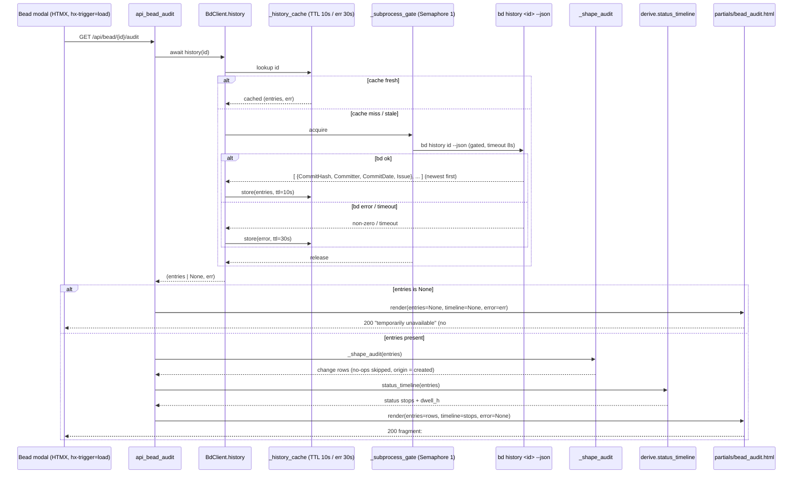

# GET /api/bead/{id}/audit

> [!NOTE]
> The route is registered as `GET /api/bead/{bead_id}/audit`
> (`@app.get("/api/bead/{bead_id}/audit", response_class=HTMLResponse)`). The
> path parameter is the bead id (`bdboard-x1`, `bdboard-mol-q7j.25`, …). This is
> the **lazily-loaded second fetch** of the
> [Bead Detail Modal](../Features/index.md): the modal renders instantly from
> `GET /api/bead/{id}`, then this endpoint fires on `hx-trigger="load"` to
> render TWO views over a single `bd history <id>` payload — the **lifecycle
> timeline** (status-transition stops, swapped out-of-band into the modal
> header region) and the **audit trail** (the field-by-field change log). It is
> a pure read — no CSRF, no mutation, no SSE broadcast — and it degrades
> gracefully so a history failure never blocks the already-rendered modal.

## Overview

| Method | Path | Auth | Purpose |
| --- | --- | --- | --- |
| GET | `/api/bead/{bead_id}/audit` | None (single-user localhost dashboard; no cookies/session/CSRF) | Render the bead's **lifecycle timeline** + **audit trail** as one HTML fragment, both derived from a single cached `bd history <bead_id> --json` read (one subprocess, two render targets) |

## Request

A bare `GET` — no body, no required headers. The browser never types this URL;
the bead modal issues it via HTMX
(`partials/bead_modal.html`:
`hx-get="/api/bead/{{ bead.id }}/audit" hx-trigger="load" hx-swap="innerHTML"`),
so the audit panel loads *after* and *independently of* the modal shell.

### Path/Query Params

| Name | In | Type | Required | Notes |
| --- | --- | --- | --- | --- |
| `bead_id` | path | string | yes | The bead whose history to render (e.g. `bdboard-mol-q7j.25`). Passed straight to `bd history <bead_id> --json` via `BdClient.history`. An unknown id does **not** raise a 4xx — bd returns no/empty history and the panel renders the friendly "no recorded history yet" / "temporarily unavailable" states (still HTTP `200`). |

### Headers

| Header | Required | Notes |
| --- | --- | --- |
| _(none)_ | no | No auth, CSRF, or content negotiation. The handler always responds `text/html` (`response_class=HTMLResponse`) regardless of the request `Accept` header. HTMX adds its usual `HX-Request: true` header, but the handler ignores it. |

### Body

```json
(none — GET request carries no body)
```

### Validation Rules

| Field | Rule | Error |
| --- | --- | --- |
| `bead_id` | None enforced at the route. Existence is delegated to `bd history`; a miss or a bd failure degrades to a graceful partial rather than a 4xx/5xx | None — a bd failure renders the "temporarily unavailable" panel at `200`; an empty history renders the "no recorded history yet" note at `200` |

### Rate Limit

| Limit | Window | Scope |
| --- | --- | --- |
| None (no rate limiter) | — | bdboard is a single-user localhost dashboard. The only throttle is structural: `bd history` reads are serialized on `BdClient._subprocess_gate` (`asyncio.Semaphore(1)`, Dolt is single-writer), memoized in `_history_cache` (`SUCCESS_TTL_S = 10.0s`, `ERROR_TTL_S = 30.0s`), and **in-flight-deduped** — two tabs opening the same bead share one `bd history` subprocess. The read is bounded by `HISTORY_TIMEOUT_S = 8.0s`. |

## Response

`Content-Type: text/html` (`response_class=HTMLResponse`). The body is an HTML
**fragment** (`partials/bead_audit.html`), not JSON — bdboard is server-rendered
HTMX. The fragment carries two render targets:

1. An **out-of-band** `<div id="lifecycle-slot" hx-swap-oob="true">` that HTMX
   lifts up into the modal header region (above "Bead details"), rendering the
   status-transition timeline.
2. The **in-place** audit-trail list that swaps into the triggering
   `<section>` via `hx-swap="innerHTML"`.

Both are driven by the SAME `bd history` payload, so one fetch costs exactly one
`bd history` subprocess.

### Success

`200 OK` — the rendered `partials/bead_audit.html`. A representative fragment
for a bead that went `open → in_progress → closed`:

```html
<div id="lifecycle-slot" hx-swap-oob="true">
  <section class="modal-body">
    <h3 class="modal-section-title">Lifecycle</h3>
    <ol class="timeline-list" aria-label="Status-transition timeline">
      <li class="timeline-row">
        <span class="timeline-marker status-open" aria-hidden="true"></span>
        <span class="timeline-status status-open">open</span>
        <span class="timeline-when" title="2026-06-05T02:37:36Z">2d ago</span>
        <span class="timeline-dwell muted">for 6.4h</span>
        <span class="timeline-who muted">Aaron Weegens</span>
      </li>
      <li class="timeline-row">
        <span class="timeline-marker status-in_progress" aria-hidden="true"></span>
        <span class="timeline-status status-in_progress">in_progress</span>
        <span class="timeline-when" title="2026-06-05T09:00:00Z">2d ago</span>
        <span class="timeline-dwell muted">current</span>
        <span class="timeline-who muted">Aaron Weegens</span>
      </li>
    </ol>
  </section>
</div>

<h3 class="modal-section-title">Audit trail</h3>
<ol class="audit-list">
  <li class="audit-row">
    <span class="audit-when">14m ago</span>
    <span class="audit-who">Aaron Weegens</span>
    <span class="audit-what">status: open → in_progress, set assignee</span>
    <span class="audit-commit muted">ce242a87</span>
  </li>
  <li class="audit-row">
    <span class="audit-when">2d ago</span>
    <span class="audit-who">Aaron Weegens</span>
    <span class="audit-what">created</span>
    <span class="audit-commit muted">a194b0d3</span>
  </li>
</ol>
```

The fragment is built from two shaped lists. The **audit row** shape produced by
`_shape_audit` (real field names):

```json
{
  "when": "2026-06-05T09:00:00Z",
  "who": "Aaron Weegens",
  "what": "status: open → in_progress, set assignee",
  "commit": "ce242a87"
}
```

The **timeline stop** shape produced by `derive.status_timeline` (real field
names; `dwell_h` is `null` for the current/open-ended status):

```json
{
  "status": "in_progress",
  "when": "2026-06-05T09:00:00Z",
  "who": "Aaron Weegens",
  "commit": "ce242a87",
  "dwell_h": null
}
```

Both are projections of bd's raw history payload — one full issue snapshot per
Dolt commit, **newest first** — whose relevant keys are:

```json
{
  "CommitHash": "ce242a879f1c4d2b...",
  "Committer": "Aaron Weegens",
  "CommitDate": "2026-06-05T09:00:00Z",
  "Issue": {
    "status": "in_progress",
    "priority": 2,
    "assignee": "Aaron Weegens",
    "title": "FlowDoc maintainer: Endpoint: GET /api/bead/{id}/audit"
  }
}
```

> [!NOTE]
> `_shape_audit` walks the snapshots and emits one row **per change**, not per
> commit. No-op Dolt commits (auto-export re-serializing identical content)
> produce an empty diff via `_diff_issue` and are **skipped** for
> signal-to-noise. The oldest snapshot (last in bd's newest-first list) is
> always emitted as `created` so the trail has a legitimate origin row.
> `_diff_issue` deliberately ignores `updated_at` (it changes on every commit)
> and renders high-signal keys (`status`, `priority`, `assignee`) as
> `old → new`, other keys as `set <k>` / `cleared <k>` / `changed <k>`.

> [!NOTE]
> `derive.status_timeline` collapses the SAME payload to only the commits where
> `status` actually changed, computing `dwell_h` as the gap to the next
> transition. The final stop is the current state, so its `dwell_h` is left
> `null` ("current") rather than measured against "now". This costs **no** extra
> `bd history` call — it reuses the entries the audit view already fetched.

The graceful-degradation bodies (all still `200`, because the route never
raises):

```html
<!-- bd history failed (entries is None): -->
<div class="audit-error">
   Audit history is temporarily unavailable.
  <div class="muted">You can still review bead details and try loading history again in a moment.</div>
</div>
```

```html
<!-- bd ok but no recorded history yet (entries == []): -->
<h3 class="modal-section-title">Audit trail</h3>
<p class="muted">no recorded history yet</p>
```

> [!WARNING]
> When `bd history` fails, **both** views are suppressed: the template short-
> circuits on `error`, so the out-of-band `#lifecycle-slot` is NOT emitted and
> the modal header's empty lifecycle placeholder simply stays empty. A failure
> here is non-fatal by design — the modal already rendered from
> `GET /api/bead/{id}`; only the audit panel shows the "temporarily
> unavailable" strip.

### Errors

| Status | Code | When |
| --- | --- | --- |
| `200` | "temporarily unavailable" partial | `bd history` failed (non-zero exit / `HISTORY_TIMEOUT_S` timeout / parse error) — `entries is None`, so the handler renders `bead_audit.html` with `error=<bd error string>`. Never a 5xx. |
| `200` | "no recorded history yet" partial | `bd history` succeeded but returned an empty list (`entries == []`) — e.g. a brand-new bead with a single commit that diffs to nothing but the origin row, or an unknown id bd reports with no history. |
| `200` | rendered timeline + audit trail | The normal path: `entries` is a non-empty list; `_shape_audit` + `derive.status_timeline` render both views. |
| `500` | (FastAPI default) | Only if an unexpected exception escapes the handler (not expected — `BdClient.history` converts bd failures into `(None, err)` tuples rather than raising). |

> [!IMPORTANT]
> This endpoint intentionally **never returns 404 or 5xx for a missing/typo'd
> bead or a flaky bd**. It is a progressive-enhancement fetch behind an
> already-rendered modal, so every failure mode collapses to a friendly inline
> partial at `200`. Don't build alerting that keys off the status code here —
> inspect the rendered partial (`audit-error` vs `audit-list`) instead.

## Implementation Map

| Responsibility | File path | Symbol |
| --- | --- | --- |
| Route handler (fetch → shape → render two views) | `src/bdboard/app.py` | `api_bead_audit` |
| Cached `bd history <id> --json` read (gate + TTL + in-flight dedup) | `src/bdboard/bd.py` | `BdClient.history` |
| Subprocess gate + cache wrapper + JSON run | `src/bdboard/bd.py` | `BdClient._cached`, `BdClient._run_json`, `BdClient._subprocess_gate` |
| History timeout + cache TTLs | `src/bdboard/bd.py` | `HISTORY_TIMEOUT_S`, `SUCCESS_TTL_S`, `ERROR_TTL_S`, `CacheEntry` |
| Per-bead history cache (cleared on mutation) | `src/bdboard/bd.py` | `BdClient._history_cache`, `BdClient.invalidate_caches` |
| Audit-trail diff shaping (one row per change, skip no-ops) | `src/bdboard/app.py` | `_shape_audit`, `_diff_issue`, `_short` |
| Status-transition timeline + dwell time (pure, reuses payload) | `src/bdboard/derive/history.py` | `status_timeline` (re-exported as `derive.status_timeline`) |
| Rendered fragment (lifecycle OOB + audit trail) | `src/bdboard/templates/partials/bead_audit.html` | template (`#lifecycle-slot` `hx-swap-oob`) |
| Lazy-load trigger + lifecycle drop target in the modal | `src/bdboard/templates/partials/bead_modal.html` | `hx-get=".../audit"`, `<div id="lifecycle-slot">` |
| Relative-time / duration Jinja filters | `src/bdboard/derive/timeutil.py` | `humanize_ts`, `humanize_hours` |
| Route + lifecycle/timeline regression coverage | `tests/test_api_bead_audit.py` | `test_lifecycle_timeline_renders_transitions_and_dwell`, `test_audit_error_skips_both_views`, `test_no_history_shows_empty_note_without_timeline` |



## Example

Fetch the rendered audit + lifecycle fragment for `bdboard-mol-q7j.25` (the
endpoint returns HTML, so pipe through a formatter if you like):

```bash
curl -s http://127.0.0.1:8000/api/bead/bdboard-mol-q7j.25/audit
```

Confirm the graceful-miss behavior for an unknown id (note: still `200`, with a
friendly partial, not a 404):

```bash
curl -s -o /dev/null -w '%{http_code}\n' \
  http://127.0.0.1:8000/api/bead/bdboard-does-not-exist/audit
# -> 200
curl -s http://127.0.0.1:8000/api/bead/bdboard-does-not-exist/audit
# -> renders "no recorded history yet" (or the "temporarily unavailable" strip
#    if bd itself errored)
```

Pull just the lifecycle timeline out of the fragment with a quick grep (handy
when eyeballing dwell times):

```bash
curl -s http://127.0.0.1:8000/api/bead/bdboard-mol-q7j.25/audit \
  | grep -A1 'timeline-status'
```

## Related

- [Endpoints index](index.md) — every route bdboard exposes, including the
  curated **modal** read [GET /api/bead/{id}](GetApiBead.md) that triggers this fetch on load.
- [GET /api/bead/{id}/raw](GetApiBeadRaw.md) — the sibling escape hatch on the
  same bead; both are lazily fetched by the modal and share the
  gate-serialized, TTL-cached `BdClient` read machinery (it caches `show`, this
  caches `history`).
- [POST /api/bead/{id}/field](PostApiBeadField.md) — the modal's write half;
  borrows the SAME out-of-band-swap idiom this endpoint uses for
  `#lifecycle-slot` (it OOB-swaps the priority badge), and its writes
  `invalidate_caches()` so the next audit fetch reflects the edit.
- [Concept: Derive Layer](../Concepts/DeriveLayer.md) — home of
  `status_timeline`, the pure projection that turns the `bd history` payload
  into the lifecycle stops rendered here.
- [Concept: Subprocess Serialization & Caching](../Concepts/SubprocessSerializationAndCaching.md)
  — the `_subprocess_gate` + `_history_cache` + in-flight-dedup machinery behind
  `BdClient.history`.
- [Concept: bd CLI as Source of Truth](../Concepts/BdCliSourceOfTruth.md) — why
  the audit trail is literally a diff over `bd history --json` snapshots.
- [Feature: Bead Detail Modal](../Features/index.md) — the feature whose modal
  lazy-loads this endpoint into the lifecycle + audit panels.
- [Back to docs index](../index.md)
