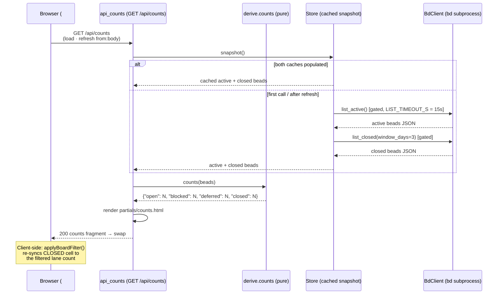

# GET /api/counts

> [!NOTE]
> The route is registered as `GET /api/counts`
> (`@app.get("/api/counts", response_class=HTMLResponse)`). It renders the
> **masthead counts strip** — the four KPI cells (Open / Blocked / Deferred /
> Closed) displayed in the top row of the
> [Board (/)](../Views/BoardView.md) masthead. The strip hydrates lazily
> via HTMX (`hx-get="/api/counts"` on `load` and `refresh from:body`) so
> the shell paints instantly without blocking on `store.snapshot()`. The
> handler does **no `bd` mutation** — it pulls the full snapshot (active +
> board-windowed closed) and passes it through the pure
> [Derive Layer](../Concepts/DeriveLayer.md) `counts` function, then
> renders `partials/counts.html`.

## Overview

| Method | Path | Auth | Purpose |
| --- | --- | --- | --- |
| GET | `/api/counts` | None (reads are unauthenticated — bdboard is a single-user localhost dashboard; CSRF guards only the `POST`/`DELETE` write paths) | Render the masthead counts strip (`partials/counts.html`) — a `<dl>` of status KPI cells (Open / Blocked / Deferred / Closed) derived from `derive.counts` over the full `store.snapshot()`. Swapped into `#counts` by HTMX on `load` and on every SSE-driven `refresh from:body`. |

## Request

`GET` with no request body and no query parameters. The `#counts` host in
`dashboard.html` fires this on `load` (first paint hydration) and on
`refresh from:body` (SSE live-update re-fetch after a `beads_changed`
broadcast). There is no user-driven parameterisation — the counts strip
always renders the full snapshot.

### Path/Query Params

| Name | In | Type | Required | Notes |
| --- | --- | --- | --- | --- |
| _(none)_ | — | — | — | This endpoint accepts no path or query parameters. |

### Headers

| Header | Required | Notes |
| --- | --- | --- |
| `HX-Request` | No | Sent automatically by HTMX on every `hx-get`. Not inspected by the handler — the route always returns the same fragment. |
| `X-CSRF-Token` | No | **Not** required. CSRF is enforced only on `POST`/`DELETE` mutation paths (see [CSRF Protection](../Concepts/CsrfProtection.md)); this read carries no token. |

### Body

No request body. (Shown for template completeness — the wire request has an
empty body.)

```json
{}
```

### Validation Rules

| Field | Rule | Error |
| --- | --- | --- |
| _(none)_ | No user inputs to validate. | — |

### Rate Limit

| Limit | Window | Scope |
| --- | --- | --- |
| None (no rate limiter) | — | Single-user localhost dashboard — no token-bucket / IP throttle. Structural throttles: the shared `BdClient._subprocess_gate` semaphore serializes every `bd` subprocess; `Store.snapshot()` lazy-loads on first call then serves the in-memory cache; the watcher refresh cycle (`Store.refresh`) is debounced — see [Store Snapshot & Change Detection](../Concepts/StoreSnapshotChangeDetection.md). |

## Response

`Content-Type: text/html` (`response_class=HTMLResponse`). The body is an HTML
**fragment**, not JSON — bdboard is server-rendered HTMX. HTMX swaps the
fragment into `#counts` via `hx-swap="innerHTML"`.

### Success

`200 OK` — the re-rendered `partials/counts.html`. It contains a `<dl
class="counts">` with one `<div class="counts-cell">` per status. Each cell
carries a `data-count-status` attribute (the stable hook the board time-filter
JS uses to target the CLOSED cell — see `applyBoardFilter()` /
`syncMastheadClosedCount()` in `base.html`). A cell whose count is `0`
receives the `counts-cell-zero` CSS class for muted styling.

The handler hands the template this context:

```json
{
  "counts": {
    "open": 12,
    "blocked": 3,
    "deferred": 5,
    "closed": 42
  }
}
```

`counts` is an **ordered dict** with a **fixed key set** — the four statuses
always appear in this order (`open`, `blocked`, `deferred`, `closed`), even
when a count is zero, to prevent layout jitter. Any non-standard status that
actually exists in the snapshot (e.g. `"unknown"`) is appended after the
fixed four.

> [!NOTE]
> **`in_progress` is intentionally omitted.** bdboard is a single-flight
> workflow tool — only one item is in-progress at a time, so displaying 0
> or 1 is noise that clutters the header. The In Progress swim lane already
> surfaces the one active bead.

> [!IMPORTANT]
> The **CLOSED cell is re-synced client-side** by the board time filter.
> The server renders the full-snapshot closed count, but the client-side
> `applyBoardFilter()` / `syncMastheadClosedCount()` JS overwrites the
> CLOSED cell's text content to match the client-filtered Closed lane
> (12h / 1d / 3d window). This avoids a second server round-trip and
> eliminates client-now vs server-now skew (bdboard-de4z). Only CLOSED is
> touched: Open / Blocked / Deferred are window-invariant and keep their
> server-rendered totals.

Rendered fragment shape:

```html
<dl class="counts">
  <div class="counts-cell" data-count-status="open">
    <dt class="counts-label">open</dt>
    <dd class="counts-value">12</dd>
  </div>
  <div class="counts-cell" data-count-status="blocked">
    <dt class="counts-label">blocked</dt>
    <dd class="counts-value">3</dd>
  </div>
  <div class="counts-cell counts-cell-zero" data-count-status="deferred">
    <dt class="counts-label">deferred</dt>
    <dd class="counts-value">0</dd>
  </div>
  <div class="counts-cell" data-count-status="closed">
    <dt class="counts-label">closed</dt>
    <dd class="counts-value">42</dd>
  </div>
</dl>
```

Before the first swap lands, the `#counts` host shows a shimmer skeleton
(`partials/counts_skeleton.html` — 4 placeholder cells with `aria-hidden`,
`counts-skeleton` class) so the masthead reserves layout space and paints
instantly.

### Errors

| Status | Code | When |
| --- | --- | --- |
| `500` | Unhandled exception | If `store.snapshot()` raises (e.g. `bd list` exits non-zero, times out at `LIST_TIMEOUT_S = 15.0s`, or returns non-list JSON), the exception propagates and FastAPI returns a 500. The store's `_load_active` / `_load_closed` paths each `log.exception` on failure and leave their cache empty (returning `[]`), so a partial failure degrades to incomplete counts rather than a hard crash — only a very early or catastrophic bd failure triggers a 500 here. |
| _(no `403`)_ | — | Reads are unauthenticated; there is no CSRF gate on this path. |
| _(no `422`)_ | — | No user inputs to validate — there are no query parameters or body fields. |

## Implementation Map

| Responsibility | File path | Symbol |
| --- | --- | --- |
| Route handler (snapshot → derive → render) | `src/bdboard/app.py` | `api_counts` |
| Pure status counting with fixed order + zero-fill | `src/bdboard/derive/lanes.py` | `counts` |
| Fixed status order constant | `src/bdboard/derive/lanes.py` | `status_order` (local in `counts`) |
| Full snapshot (active + board-windowed closed, cached) | `src/bdboard/store.py` | `Store.snapshot` (→ `_load_active` + `_load_closed`) |
| Active issue fetch (`bd list --no-pager --limit 0`) | `src/bdboard/bd.py` | `BdClient.list_active` |
| Board-windowed closed fetch (`bd list --status closed --closed-after ...`) | `src/bdboard/bd.py` | `BdClient.list_closed` |
| Board closed window constant (3 days) | `src/bdboard/derive/lanes.py` | `BOARD_CLOSED_WINDOW_DAYS` |
| Gated JSON subprocess runner + timeout | `src/bdboard/bd.py` | `BdClient._run_json`, `BdClient._subprocess_gate`, `LIST_TIMEOUT_S` |
| Counts strip partial (the `<dl>` with `data-count-status` cells) | `src/bdboard/templates/partials/counts.html` | (Jinja `` loop) |
| Counts skeleton (shimmer placeholder before first swap) | `src/bdboard/templates/partials/counts_skeleton.html` | (`counts-skeleton`, 4-cell `aria-hidden` placeholder) |
| `#counts` host + HTMX wiring (`hx-get`, `load, refresh from:body`) | `src/bdboard/templates/dashboard.html` | (`.masthead-counts` `#counts` div) |
| Client-side CLOSED cell re-sync after board time filter | `src/bdboard/templates/base.html` | `syncMastheadClosedCount`, `applyBoardFilter` |
| After-settle re-sync (if `#counts` hydrates after the closed lane) | `src/bdboard/templates/base.html` | `htmx:afterSettle` handler (`target.id === 'counts'`) |
| Unit tests for derive.counts (fixed set, order, in_progress exclusion) | `tests/test_derive_counts.py` | `test_counts_returns_fixed_status_set_even_when_empty`, `test_counts_excludes_in_progress`, `test_counts_preserves_status_order_with_mixed_data` |
| Markup/wiring tests for data-count-status hook + filter sync | `tests/test_board_counts_filter_sync.py` | `test_counts_cells_carry_status_hook`, `test_closed_cell_pairs_hook_with_value`, `test_sync_helper_targets_closed_cell_by_hook`, `test_sync_mirrors_zero_state_muting`, `test_apply_filter_feeds_visible_count_to_masthead`, `test_masthead_sync_guarded_by_real_closed_lane`, `test_counts_strip_resync_on_independent_settle` |
| Board shell hydration test (lazy hx-get /api/counts) | `tests/test_snappy_transitions.py` | `test_board_shell_hydrates_lanes_and_counts_lazily` |



## Example

Default fetch — exactly what the `#counts` host fires on `load`:

```bash
curl -i "http://127.0.0.1:7332/api/counts"
```

A successful call returns `200` with the `<dl class="counts">` fragment; HTMX
swaps it into `#counts` (the `.masthead-counts` host). The client-side board
time filter then re-syncs the CLOSED cell to match the filtered Closed lane.

## Related

- [Endpoints index](index.md) — every route bdboard exposes.
- [Board (/)](../Views/BoardView.md) — the page surface whose `#counts` host
  lazy-loads from **this** endpoint on `load` and re-fetches on every SSE
  `refresh from:body`; the counts strip sits in the masthead top row.
- [GET /api/lanes](index.md) — the board's swim-lane region endpoint; both
  are derived from `Store.snapshot()` and rendered as HTMX HTML fragments
  (see the Endpoints index until its own doc lands).
- [GET /api/lanes/closed](GetApiLanesClosed.md) — the heavy Closed lane, split for fast
  first paint; its visible count drives the client-side re-sync of the CLOSED
  cell in this strip.
- [GET /api/events](GetApiEvents.md) — the SSE stream whose `beads_changed` event
  drives the `refresh from:body` re-fetch of this strip across tabs (see the
  Endpoints index until its own doc lands).
- [Derive Layer](../Concepts/DeriveLayer.md) — the pure `derive.counts`
  function that shapes the snapshot into the fixed-order status dict.
- [Store Snapshot & Change Detection](../Concepts/StoreSnapshotChangeDetection.md)
  — the cached `snapshot()` (active + board-windowed closed) that this route
  reads without shelling out on every request.
- [Subprocess Serialization & Caching](../Concepts/SubprocessSerializationAndCaching.md)
  — the semaphore + cache behind `list_active` and `list_closed`.
- [CSRF Protection](../Concepts/CsrfProtection.md) — why this read path
  carries no `X-CSRF-Token`.
- [SSE Event Bus](../Concepts/SseEventBus.md) — the `beads_changed`
  broadcast that keeps this strip live across tabs.
- [bd CLI as Source of Truth](../Concepts/BdCliSourceOfTruth.md) — why this
  path shells `bd list` instead of reading `.beads/` directly.
- [Back to docs index](../index.md)
