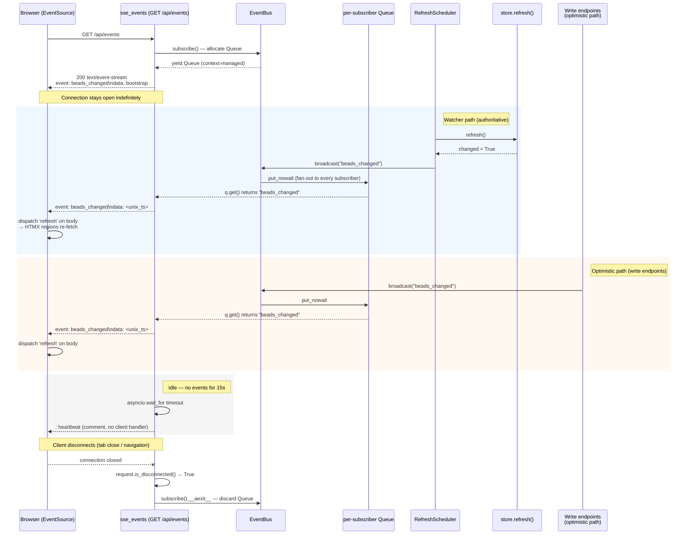

# GET /api/events

> [!NOTE]
> The route is registered as `GET /api/events`
> (`@app.get("/api/events")`). It opens a **Server-Sent Events (SSE)**
> stream — a long-lived `text/event-stream` connection over which the server
> pushes `beads_changed` events whenever the watched workspace data changes
> under `.beads/`. Every page in bdboard opens exactly one `EventSource`
> subscription to this endpoint (wired in `base.html`); on receiving
> `beads_changed`, the client dispatches a synthetic `refresh` DOM event on
> `<body>`, and every HTMX region wired with
> `hx-trigger="load, refresh from:body"` re-fetches its HTML partial. This
> is the **sole server→client push channel** — there is no polling, no
> WebSocket, and no client-side state diffing. The handler does **no `bd`
> mutation** — it subscribes to the in-process
> [SSE Event Bus](../Concepts/SseEventBus.md), drains its per-subscriber
> queue, and writes SSE-framed text down the wire.

## Overview

| Method | Path | Auth | Purpose |
| --- | --- | --- | --- |
| GET | `/api/events` | None (reads are unauthenticated — bdboard is a single-user localhost dashboard; CSRF guards only the `POST`/`DELETE` write paths) | Open a long-lived SSE stream. Pushes `beads_changed` events (fired by the filesystem watcher or by write-endpoint optimistic broadcasts) so every open browser tab can re-fetch its HTMX partials in real time. Also sends a one-shot `bootstrap` event on connect and periodic `: heartbeat` keep-alive comments. |

## Request

`GET` with no request body and no query parameters. The browser's
`EventSource('/api/events')` constructor (in `base.html`) opens this
connection once per page load. The browser keeps the connection alive
indefinitely; if it drops, `EventSource` auto-reconnects with built-in
exponential backoff — no application-level retry logic is needed.

### Path/Query Params

| Name | In | Type | Required | Notes |
| --- | --- | --- | --- | --- |
| _(none)_ | — | — | — | This endpoint accepts no path or query parameters. |

### Headers

| Header | Required | Notes |
| --- | --- | --- |
| `Accept` | No | The browser's `EventSource` sends `Accept: text/event-stream` automatically. The handler does not inspect it — it always returns `text/event-stream` regardless. |
| `HX-Request` | No | Not sent. This is a raw `EventSource` call, not an HTMX fetch. |
| `X-CSRF-Token` | No | **Not** required. CSRF is enforced only on `POST`/`DELETE` mutation paths (see [CSRF Protection](../Concepts/CsrfProtection.md)); this read carries no token. |

### Body

No request body. (Shown for template completeness — the wire request has an
empty body.)

```json
{}
```

### Validation Rules

| Field | Rule | Error |
| --- | --- | --- |
| _(none)_ | No user inputs to validate. | — |

### Rate Limit

| Limit | Window | Scope |
| --- | --- | --- |
| None (no rate limiter) | — | Single-user localhost dashboard — no token-bucket / IP throttle. Each connection consumes one `asyncio.Queue` in the `EventBus._subscribers` set (bounded at `_QUEUE_SIZE = 16` items). The practical limit is the process's file-descriptor cap, but at the real scale (a handful of browser tabs) this is never a concern. |

## Response

`Content-Type: text/event-stream`. The body is a **never-ending stream** of
SSE frames, not a single JSON or HTML payload. The connection stays open until
the client disconnects (tab close, navigation, network drop) or the server
shuts down.

### Success

`200 OK` — the response is a `StreamingResponse` with `media_type="text/event-stream"`.
Two additional headers are set:

| Header | Value | Why |
| --- | --- | --- |
| `Cache-Control` | `no-cache` | Prevents the browser (or any intermediate cache) from buffering or caching the event stream. |
| `X-Accel-Buffering` | `no` | Tells nginx (if the app is proxied) to disable response buffering so SSE frames flush immediately. |

Three frame shapes cross the wire (each terminated by `\n\n`):

**1. Bootstrap event** — sent exactly once, immediately on connect, so a
freshly-opened tab triggers its first HTMX re-fetch without waiting for an
actual workspace change:

```text
event: beads_changed
data: bootstrap

```

**2. Change event** — sent whenever `EventBus.broadcast("beads_changed")` fires
(either from the filesystem watcher's change-detected path or from a write
endpoint's optimistic broadcast). The `data` field carries the current Unix
timestamp (epoch seconds as an integer), but the client ignores it — only the
event name matters:

```text
event: beads_changed
data: 1748900000

```

**3. Heartbeat comment** — sent every 15 seconds of idle (no real events). SSE
comment lines (prefixed with `:`) are silently discarded by `EventSource` and
fire no client-side handler. Their sole purpose is to keep proxies and load
balancers from closing the idle long-lived connection (typical idle timeout is
30–60s, so 15s has comfortable margin):

```text
: heartbeat

```

> [!NOTE]
> The `data` value in change events is intentionally inert — the browser only
> cares that a `beads_changed` event *arrived*, not what it carries. The event
> is a "go re-read" trigger; the canonical data comes from the HTMX partial
> re-fetches that follow. This keeps the bus decoupled from every view's shape
> (DRY: rendering logic lives in one place — the partial endpoints).

> [!WARNING]
> **Backpressure / dropped events.** Each subscriber's queue is bounded at
> `_QUEUE_SIZE = 16`. If a tab falls more than 16 events behind (e.g. a
> stalled or background tab), the oldest event is silently dropped to make
> room for the newest. This is a correctness-safe tradeoff: because every
> `beads_changed` triggers the *same* full re-fetch, a dropped event is only
> a freshness blip — the next event re-syncs the UI completely.

### Errors

| Status | Code | When |
| --- | --- | --- |
| _(no HTTP errors)_ | — | The handler cannot fail with a meaningful HTTP error. If `bus.subscribe()` raises (which it won't under normal operation — it only allocates a queue), FastAPI would return a generic 500. The stream itself is resilient: a queue-get timeout produces a heartbeat, a client disconnect breaks the loop cleanly, and a broadcast failure on a full queue drops the oldest event rather than raising. |
| _(no `403`)_ | — | Reads are unauthenticated; there is no CSRF gate on this path. |
| _(no `422`)_ | — | No user inputs to validate — there are no query parameters or body fields. |

## Implementation Map

| Responsibility | File path | Symbol |
| --- | --- | --- |
| Route handler (subscribe → stream → heartbeat loop) | `src/bdboard/app.py` | `sse_events` |
| In-process pub/sub bus (fan-out to per-subscriber queues) | `src/bdboard/events.py` | `EventBus` |
| Broadcast push (drop-oldest on overflow) | `src/bdboard/events.py` | `EventBus.broadcast` |
| Subscription lifecycle (context-managed auto-cleanup) | `src/bdboard/events.py` | `EventBus.subscribe` |
| Per-subscriber queue depth bound | `src/bdboard/events.py` | `_QUEUE_SIZE` (`16`) |
| Diagnostics: live subscriber count | `src/bdboard/events.py` | `EventBus.subscriber_count` |
| Process-lifetime bus singleton | `src/bdboard/app.py` | `bus = EventBus()` |
| Watcher → broadcast wiring (broadcast iff `refresh()` reported change) | `src/bdboard/app.py` | `RefreshScheduler(broadcast=lambda: bus.broadcast("beads_changed"))` |
| Debounce + cooldown scheduling for watcher broadcasts | `src/bdboard/watcher.py` | `RefreshScheduler` |
| Settle logic (debounce wait → cooldown wait → refresh → broadcast) | `src/bdboard/watcher.py` | `RefreshScheduler._settle` |
| Optimistic broadcast: memory create | `src/bdboard/app.py` | `api_memory_create` |
| Optimistic broadcast: memory delete | `src/bdboard/app.py` | `api_memory_delete` |
| Optimistic broadcast: formula pour | `src/bdboard/app.py` | `api_formula_pour` |
| Optimistic broadcast: field edit | `src/bdboard/app.py` | `api_bead_field_update` |
| Client-side EventSource subscriber (one per page) | `src/bdboard/templates/base.html` | `new EventSource('/api/events')` |
| Live-status indicator markup (`#live-dot` / `#live-status`) | `src/bdboard/templates/base.html` | `setStatus()` IIFE |
| Board regions that re-fetch on `refresh from:body` | `src/bdboard/templates/dashboard.html` | `.lanes-region`, `#counts` |
| History region that re-fetches on `refresh from:body` | `src/bdboard/templates/history.html` | `#history-region` |
| Memory region that re-fetches on `refresh from:body` | `src/bdboard/templates/memory.html` | `#memory-list` |
| SSE broadcast regression: memory create | `tests/test_memory_mutations.py` | `test_create_memory_broadcasts_sse_on_success` |
| SSE broadcast regression: memory delete | `tests/test_memory_mutations.py` | `test_delete_memory_broadcasts_sse_on_success` |
| SSE broadcast regression: field edit | `tests/test_field_edit.py` | `test_field_update_broadcasts_sse_and_renders_row` |
| SSE broadcast regression: formula pour | `tests/test_formula_pour.py` | (asserts `"beads_changed" in broadcasts`) |
| Watcher scheduler unit tests (debounce, cooldown, broadcast gating) | `tests/test_watcher_scheduler.py` | `test_isolated_event_refreshes_and_broadcasts`, `test_trailing_event_after_cooldown_still_refreshes` |
| Watcher self-feedback loop prevention | `tests/test_watcher_self_feedback.py` | `test_inflight_refresh_is_not_cancelled_by_self_event` |
| History region re-fetches on SSE refresh | `tests/test_page_history.py` | `test_history_region_refetches_on_sse_refresh` |



## Example

Open an SSE connection — exactly what the browser's `EventSource` constructor
does on every page load:

```bash
curl -N -H "Accept: text/event-stream" "http://127.0.0.1:7332/api/events"
```

The `-N` flag disables curl's output buffering so frames print as they arrive.
Expected output (a bootstrap event followed by heartbeats every ~15s, with
change events interspersed whenever the workspace mutates):

```text
event: beads_changed
data: bootstrap

: heartbeat

: heartbeat

event: beads_changed
data: 1748900042

: heartbeat

```

Press `Ctrl-C` to disconnect. The server cleans up the subscriber queue
automatically via the `EventBus.subscribe()` context manager.

## Related

- [Endpoints index](index.md) — every route bdboard exposes.
- [SSE Event Bus](../Concepts/SseEventBus.md) — the in-process pub/sub
  bus that this endpoint subscribes to; documents the fan-out architecture,
  backpressure policy, and broadcast conventions.
- [Filesystem Watcher](../Concepts/FilesystemWatcher.md) — the upstream
  trigger: `watchfiles` detects `.beads/` mutations, `RefreshScheduler`
  debounces, and broadcasts `beads_changed` iff the bead list changed.
- [Store Snapshot & Change Detection](../Concepts/StoreSnapshotChangeDetection.md)
  — supplies the `changed` boolean that gates the watcher broadcast and the
  revision-signature skip that prevents the refresh→read→event→refresh
  self-feedback loop.
- [Board (/)](../Views/BoardView.md) — the dashboard page whose
  `.lanes-region` and `#counts` re-fetch on every `refresh from:body`
  driven by this stream.
- [History (/history)](../Views/HistoryView.md) — the history page whose
  `#history-region` re-fetches on `refresh from:body`.
- [Memory (/memory)](../Views/MemoryView.md) — the memory page whose
  `#memory-list` re-fetches on `refresh from:body`.
- [GET /api/lanes](GetApiLanes.md) — the active swim lanes partial
  re-fetched by the board on every SSE-driven refresh.
- [GET /api/lanes/closed](GetApiLanesClosed.md) — the closed lane partial,
  also re-fetched on `refresh from:body`.
- [GET /api/counts](GetApiCounts.md) — the masthead counts strip,
  re-fetched on `refresh from:body`.
- [GET /api/history](GetApiHistory.md) — the history partial, re-fetched
  on `refresh from:body`.
- [GET /api/memory](GetApiMemory.md) — the memory list partial,
  re-fetched on `refresh from:body`.
- [POST /api/memory](PostApiMemory.md) — one of the four write endpoints
  that broadcasts `beads_changed` on the optimistic path.
- [DELETE /api/memory/{key}](DeleteApiMemory.md) — optimistic broadcaster.
- [POST /api/formulas/{name}/pour](PostApiFormulaPour.md) — optimistic
  broadcaster.
- [POST /api/bead/{id}/field](PostApiBeadField.md) — optimistic
  broadcaster.
- [CSRF Protection](../Concepts/CsrfProtection.md) — why this read path
  carries no `X-CSRF-Token`.
- [bd CLI as Source of Truth](../Concepts/BdCliSourceOfTruth.md) — why
  the event bus broadcasts a dumb trigger rather than a data payload:
  the canonical state comes from `bd` via the partial endpoints.
- [Subprocess Serialization & Caching](../Concepts/SubprocessSerializationAndCaching.md)
  — the semaphore + cache behind the `bd` subprocesses that the watcher's
  `store.refresh()` triggers before broadcasting.
- [Back to docs index](../index.md)
