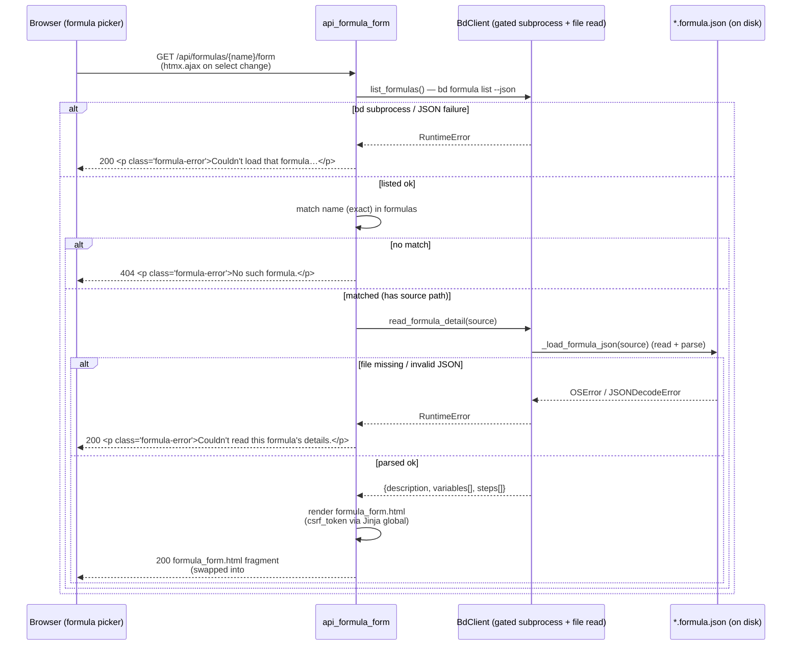

# GET /api/formulas/{name}/form

> [!NOTE]
> The route is registered as `GET /api/formulas/{name}/form`
> (`@app.get("/api/formulas/{name}/form")`). The path parameter is the formula
> **name** (e.g. `flowdoc-html`, `code-health-audit`), NOT a bead id. This is
> the **second read half** of [Formula Pour](../Features/index.md): the user
> picks a formula from [GET /api/formulas](GetApiFormulas.md) (the picker list — see the
> [Endpoints index](index.md)), and
> *that* selection fires this endpoint to render the variable form the user then
> submits to [POST /api/formulas/{name}/pour](PostApiFormulaPour.md). It is a
> pure read — it never mutates the board. Its one job is to turn a formula's
> on-disk `*.formula.json` template into an HTMX `<form>` whose wire contract
> (one `var_<name>` field per declared variable) matches exactly what the pour
> endpoint expects.

## Overview

| Method | Path | Auth | Purpose |
| --- | --- | --- | --- |
| GET | `/api/formulas/{name}/form` | None (no CSRF on reads; no cookies/session — bdboard is single-user localhost) | Resolve the formula by `name` via `bd formula list --json`, read its `*.formula.json` `source` fresh via `BdClient.read_formula_detail` (full description + ordered variables + step list), and return the rendered `partials/formula_form.html` fragment for an in-place HTMX swap into `#formula-form`. The rendered form posts to [POST /api/formulas/{name}/pour](PostApiFormulaPour.md). |

## Request

This is a `GET` with **no request body** and **no query string** — the only
input is the `name` path parameter. The browser never calls it directly: the
`<select id="formula-select">` rendered by `partials/formula_list.html` fires
`htmx.ajax('GET', '/api/formulas/' + encodeURIComponent(value) + '/form', …)`
on `change`, swapping the response into `#formula-form`.

### Path/Query Params

| Name | In | Type | Required | Notes |
| --- | --- | --- | --- | --- |
| `name` | path | string | yes | The formula name (e.g. `flowdoc-html`). Matched against `bd formula list --json` by exact `name` (`next((f for f in formulas if f.get("name") == name), None)`). An unknown name returns `404`. It is also threaded into the rendered form's `hx-post="/api/formulas/{{ name \| urlencode }}/pour"` and the `<h3>` title. The client URL-encodes the value before the request (`encodeURIComponent`). |

### Headers

| Header | Required | Notes |
| --- | --- | --- |
| `HX-Request` | no | HTMX sets this automatically on its AJAX calls. The handler does not branch on it — the response is always the bare `formula_form.html` fragment (no full-page shell), so a plain `curl` gets the same partial. |
| — (no auth header) | — | This is a read endpoint: there is **no** `X-CSRF-Token` requirement (unlike the [POST pour](PostApiFormulaPour.md) write). See [CSRF Protection](../Concepts/CsrfProtection.md) — the token guards mutations only. |

### Body

`GET` request — **no body is sent**. (Shown here for template completeness; the
request carries no payload at all.)

```json
{}
```

### Validation Rules

| Field | Rule | Error |
| --- | --- | --- |
| `name` | Must match a `name` returned by `bd formula list --json` | `404` (HTMLResponse) `<p class="formula-error" role="alert">No such formula.</p>` |
| formula source | `bd.list_formulas()` must succeed (bd subprocess + valid JSON array) | `200` with a soft inline `<p class="formula-error">` — *not* a 5xx (graceful degrade so the HTMX swap never breaks the dialog) |
| formula detail | `bd.read_formula_detail(source)` must read + parse the `*.formula.json` at `source` | `200` with a soft inline `<p class="formula-error">Couldn't read this formula's details.</p>` (also a graceful degrade, not a 5xx) |

> [!IMPORTANT]
> Variables are read by **parsing the `*.formula.json` file directly** (path from
> the `source` field of `formula list --json`), NOT from the bd CLI's structured
> output. This is deliberate: `bd formula show <name> --json` *omits* the
> `variables` block entirely, and the `vars` count in `formula list --json` is
> unreliable (reports `0` even when variables exist). The list payload's
> `description` is also **truncated** (trailing `…`), so the full description
> comes from the file too. See [bd CLI as Source of Truth](../Concepts/BdCliSourceOfTruth.md).

### Rate Limit

| Limit | Window | Scope |
| --- | --- | --- |
| None (no rate limiter) | — | bdboard is a single-user localhost dashboard with no token-bucket / IP throttle. The only structural throttle is that `bd.list_formulas()` is a subprocess call serialized on `BdClient._subprocess_gate` (single-writer Dolt), TTL-cached via `_run_json`/`_run_json_cached`; `read_formula_detail` is a synchronous local file read (no subprocess). The list call carries an 8s subprocess timeout (`FORMULA_LIST_TIMEOUT_S = 8.0`). |

## Response

`Content-Type: text/html` (`response_class=HTMLResponse`). The body is an HTML
**fragment**, not JSON — bdboard is server-rendered HTMX. The route returns the
rendered `partials/formula_form.html`, which HTMX swaps into `#formula-form`
(`hx-swap="innerHTML"`) inside the "+ Pour Formula" dialog on the
[Board view](../Views/BoardView.md).

### Success

`200 OK` — the rendered `partials/formula_form.html`. The shape depends on what
the formula declares. For a formula **with** variables (e.g. `flowdoc-html`,
which declares one variable `target` defaulting to `both`), each variable
becomes a labelled text input named `var_<name>`; a variable with no `default`
is marked `required` (`required aria-required="true"`). Steps render in a
collapsed `<details>` disclosure. Abridged structure:

```html
<form
  class="formula-form"
  hx-post="/api/formulas/flowdoc-html/pour"
  hx-target="#formula-pour-result"
  hx-swap="innerHTML"
  hx-disabled-elt="find button[type='submit']"
  hx-headers='{"X-CSRF-Token": "<process CSRF token>"}'
  hx-on::after-request="… reset picker on 2xx …"
>
  <input type="hidden" name="csrf_token" value="<process CSRF token>" />
  <h3 class="formula-form-title">flowdoc-html</h3>
  <p class="formula-form-desc muted">Build the static HTML documentation site(s) …</p>

  <details class="formula-steps">
    <summary class="formula-steps-summary">Show all steps <span class="formula-steps-count">(3)</span></summary>
    <ol class="formula-steps-list">
      <li class="formula-step">
        <div class="formula-step-head">
          <span class="formula-step-title">FlowDoc: build HTML site (both)</span>
          <span class="formula-step-type">epic</span>
        </div>
        <p class="formula-step-desc">Umbrella for building the static HTML doc site(s)…</p>
      </li>
      <!-- one <li> per step (build, validate) -->
    </ol>
  </details>

  <div class="formula-fields">
    <div class="formula-field">
      <label class="formula-field-label" for="var-target">target</label>
      <p class="formula-field-help" id="help-target">both = build maintainer …; maintainer or user = build just one.</p>
      <input type="text" id="var-target" name="var_target" class="formula-input"
             value="both" aria-describedby="help-target" autocomplete="off" spellcheck="false" />
    </div>
  </div>

  <div class="formula-form-actions">
    <button type="submit" class="formula-btn formula-btn-primary">Pour onto board</button>
  </div>
</form>
```

For a formula that declares **no** variables, the `#formula-fields` block is
replaced by a single notice and the form posts with just the CSRF token:

```html
<p class="formula-no-vars muted">This formula takes no variables.</p>
```

If the formula has **no steps**, the `<details>` disclosure is omitted entirely.

> [!NOTE]
> The `csrf_token` value is injected as a Jinja **global**
> (`TEMPLATES.env.globals["csrf_token"] = _CSRF_TOKEN` in `app.py`), so this
> read handler doesn't pass it explicitly in the template context — it is
> baked into every rendered template. The rendered form carries it (hidden
> input + `hx-headers`) so the *subsequent* pour POST is CSRF-valid.

### Errors

| Status | Code | When |
| --- | --- | --- |
| `404` | `<p class="formula-error" role="alert">No such formula.</p>` | `name` did not match any formula returned by `bd formula list --json`. |
| `200` | `<p class="formula-error" role="alert">Couldn't load that formula right now. Please try again.</p>` | `bd.list_formulas()` raised `RuntimeError` (bd subprocess failure / malformed JSON). Returned as `200` so the HTMX swap degrades gracefully into the dialog instead of breaking it. |
| `200` | `<p class="formula-error" role="alert">Couldn't read this formula's details. Please try again.</p>` | `bd.read_formula_detail(source)` raised `RuntimeError` (formula file missing / invalid JSON / non-object top level). Also `200` for the same graceful-degrade reason. |

> [!WARNING]
> Two of the three failure modes return **HTTP 200** with an error *fragment*,
> not a 4xx/5xx. This is intentional: HTMX swaps the response body into
> `#formula-form` regardless of status, and a hard 5xx would either blank the
> region or trip HTMX's error handling and leave the dialog in a broken state.
> Returning a styled `formula-error` paragraph at `200` keeps the dialog usable
> and tells the user to retry. Only the genuine "wrong name" case uses `404`.

## Implementation Map

| Responsibility | File path | Symbol |
| --- | --- | --- |
| Route handler (resolve → read detail → render fragment) | `src/bdboard/app.py` | `api_formula_form` |
| List + resolve formula by name (`bd formula list --json`) | `src/bdboard/bd.py` | `BdClient.list_formulas`, `FORMULA_LIST_TIMEOUT_S` |
| Parse full description + variables + steps from the file (one read) | `src/bdboard/bd.py` | `BdClient.read_formula_detail` |
| Shared `*.formula.json` loader (read + JSON parse + type guard) | `src/bdboard/bd.py` | `BdClient._load_formula_json` |
| Variable descriptor extraction (name/description/default/required) | `src/bdboard/bd.py` | `BdClient._parse_variables` |
| Step descriptor extraction (id/title/description/type/priority) | `src/bdboard/bd.py` | `BdClient._parse_steps` |
| TTL-cached, gated subprocess runner behind `list_formulas` | `src/bdboard/bd.py` | `BdClient._run_json`, `_run_json_cached`, `_subprocess_gate` |
| CSRF token injected as a Jinja global (baked into the rendered form) | `src/bdboard/app.py` | `_CSRF_TOKEN`, `TEMPLATES.env.globals["csrf_token"]` |
| Variable form template returned for the swap | `src/bdboard/templates/partials/formula_form.html` | (template) |
| Picker `<select>` whose `change` fires this GET | `src/bdboard/templates/partials/formula_list.html` | `#formula-select` (`hx-on:change` → `htmx.ajax`) |
| Dialog host (`#formula-form` swap target, `#formula-pour-result` sibling) | `src/bdboard/templates/dashboard.html` | "+ Pour Formula" dialog |
| Endpoint regression coverage | `tests/test_formula_pour.py` | `test_api_formula_form_renders_variables`, `test_api_formula_form_disables_button_in_flight`, `test_api_formula_form_resets_picker_on_success_only`, `test_api_formula_form_404_for_unknown`, `test_api_formula_form_shows_full_description_and_steps`, `test_api_formula_form_no_steps_block_when_empty` |
| Detail-parsing unit coverage | `tests/test_bd_formulas.py` | `test_read_formula_detail_returns_description_vars_and_steps`, `test_read_formula_detail_no_steps_or_vars_is_empty`, `test_read_formula_detail_skips_malformed_steps`, `test_read_formula_detail_missing_file_raises` |



## Example

Fetch the variable form for the `flowdoc-html` formula (it declares one
variable, `target`, defaulting to `both`):

```bash
curl -i http://127.0.0.1:8000/api/formulas/flowdoc-html/form
```

A `200` returns the `#formula-form` HTML fragment: an `<h3>flowdoc-html</h3>`
title, the full untruncated description, a collapsed `<details>` listing the 3
steps (`root` epic, `build`, `validate`), a single `<input name="var_target"
value="both">` text field, and a "Pour onto board" submit button wired to
`hx-post="/api/formulas/flowdoc-html/pour"`. HTMX swaps this into `#formula-form`
when the user selects `flowdoc-html` in the picker; submitting it fires
[POST /api/formulas/{name}/pour](PostApiFormulaPour.md).

Request a name that does not exist (note the `404`):

```bash
curl -i http://127.0.0.1:8000/api/formulas/does-not-exist/form
# HTTP/1.1 404 Not Found
# <p class="formula-error" role="alert">No such formula.</p>
```

## Related

- [Endpoints index](index.md) — every route bdboard exposes.
- [GET /api/formulas](GetApiFormulas.md) — the **first** read half of the pour
  flow: the picker list whose `<select>` change fires *this* endpoint.
- [POST /api/formulas/{name}/pour](PostApiFormulaPour.md) — the **write** half:
  the form this endpoint renders submits there to materialize the bead tree.
- [CSRF Protection](../Concepts/CsrfProtection.md) — why this read needs no
  token, but the form it renders bakes one in for the subsequent pour POST.
- [bd CLI as Source of Truth](../Concepts/BdCliSourceOfTruth.md) — why variables
  + the full description are read from the `*.formula.json` file rather than the
  bd CLI's structured output.
- [Subprocess Serialization & Caching](../Concepts/SubprocessSerializationAndCaching.md)
  — the `_subprocess_gate` + TTL cache fronting `list_formulas`.
- [Feature: Formula Pour](../Features/index.md) — the feature this endpoint
  helps drive (pick → fill form → pour).
- [Flow: Formula Pour Pipeline](../Flows/index.md) — the end-to-end pick → form
  → pour → refresh flow.
- [Board (/)](../Views/BoardView.md) — the view whose "+ Pour Formula" dialog
  hosts the `#formula-form` swap target this endpoint fills.
- [Back to docs index](../index.md)
