# GET /api/formulas

> [!NOTE]
> This is the **first read half** of [Formula Pour](../Features/FormulaPour.md). When
> the user opens the "+ Pour Formula" dialog on the [Board view](../Views/BoardView.md),
> its `#formula-list` region fires this endpoint (`hx-get="/api/formulas"` on a
> custom `load-formulas` trigger) and swaps in a single `<select>` picker of
> every available formula. Choosing one then fires
> [GET /api/formulas/{name}/form](GetApiFormulaForm.md) (the **second** read
> half), and submitting that form POSTs to
> [POST /api/formulas/{name}/pour](PostApiFormulaPour.md) (the **write** half).
> This endpoint is a pure read — it never mutates the board. Its one job is to
> turn `bd formula list --json` into the picker `<select>` an operator scans to
> choose what to pour.

## Overview

| Method | Path | Auth | Purpose |
| --- | --- | --- | --- |
| GET | `/api/formulas` | None (no CSRF on reads; no cookies/session — bdboard is single-user localhost) | List the available formulas via `bd formula list --json` (each carrying `name` + `description`) and return the rendered `partials/formula_list.html` fragment — a single `<select id="formula-select">` picker — for an in-place HTMX swap into `#formula-list`. On a bd failure it degrades to a friendly inline message at `200` rather than breaking the dialog swap. |

## Request

This is a `GET` with **no request body**, **no query string**, and **no path
parameters** — the endpoint takes no input at all. The browser never calls it
on initial page load: the `#formula-list` region carries
`hx-trigger="load-formulas"`, and `openFormulaDialog()` in `dashboard.html`
fires that custom event (`htmx.trigger('#formula-list', 'load-formulas')`) only
when the dialog opens — so the formula list is fetched **fresh on every open**
(a newly-added formula shows up without a page reload).

### Path/Query Params

| Name | In | Type | Required | Notes |
| --- | --- | --- | --- | --- |
| _(none)_ | — | — | — | This endpoint declares no path or query parameters. `api_formulas(request: Request)` binds nothing but the FastAPI `Request`. All input — selecting a specific formula — happens on the *next* hop ([GET /api/formulas/{name}/form](GetApiFormulaForm.md)), which carries the `name` path param. |

### Headers

| Header | Required | Notes |
| --- | --- | --- |
| `HX-Request` | no | HTMX sets this automatically on its AJAX calls. The handler does **not** branch on it — the response is always the bare `formula_list.html` fragment (no full-page shell), so a plain `curl` gets the identical partial. |
| — (no auth header) | — | This is a read endpoint: there is **no** `X-CSRF-Token` requirement (unlike the [POST pour](PostApiFormulaPour.md) write). See [CSRF Protection](../Concepts/CsrfProtection.md) — the token guards mutations only. |

### Body

`GET` request — **no body is sent**. (Shown here for template completeness; the
request carries no payload at all.)

```json
{}
```

### Validation Rules

| Field | Rule | Error |
| --- | --- | --- |
| _(no input fields)_ | There is nothing to validate on the rest — the endpoint takes no params. | — |
| formula list | `bd.list_formulas()` must succeed: the `bd formula list --json` subprocess must exit cleanly AND return a JSON **array** (it raises `RuntimeError` on a non-list payload). | `200` with a soft inline `<p class="formula-empty muted" role="status" aria-live="polite">` ("Couldn't load formulas right now. Please try in a moment.") — *not* a 5xx (graceful degrade so the HTMX swap never breaks the dialog). |

> [!IMPORTANT]
> The picker uses only the `name` (the `<option value>`) and `description` (the
> `<option>` label + `title` tooltip) fields from each formula. It does **not**
> use the payload's `vars` count — that field is unreliable (bd reports `0` even
> when a formula declares variables), so variable enumeration is deferred to
> [GET /api/formulas/{name}/form](GetApiFormulaForm.md), which reads the
> `*.formula.json` file at `source` directly. See
> [bd CLI as Source of Truth](../Concepts/BdCliSourceOfTruth.md).

### Rate Limit

| Limit | Window | Scope |
| --- | --- | --- |
| None (no rate limiter) | — | bdboard is a single-user localhost dashboard with no token-bucket / IP throttle. The only structural throttle is that `bd.list_formulas()` runs through `BdClient._run_json`, serialized on the `_subprocess_gate` `asyncio.Semaphore(1)` (bd's embedded Dolt store is single-writer). Note: unlike the bead/memory read paths, `list_formulas` calls `_run_json` directly and is **not** TTL-cached — every open re-shells `bd formula list`. The call carries an 8s subprocess timeout (`FORMULA_LIST_TIMEOUT_S = 8.0`). |

## Response

`Content-Type: text/html` (`response_class=HTMLResponse`). The body is an HTML
**fragment**, not JSON — bdboard is server-rendered HTMX. The route returns the
rendered `partials/formula_list.html`, which HTMX swaps into `#formula-list`
(`hx-swap="innerHTML"`) inside the "+ Pour Formula" dialog on the
[Board view](../Views/BoardView.md).

### Success

`200 OK` — the rendered `partials/formula_list.html`. When at least one formula
is found, the fragment is a labelled `<select>` picker with one `<option>` per
formula (the placeholder option is selected by default). Each option's `value`
is the formula `name` and its label/`title` is `name — description`. Choosing an
option fires `htmx.ajax('GET', '/api/formulas/' + encodeURIComponent(value) +
'/form', {target: '#formula-form', swap: 'innerHTML'})`. Abridged structure:

```html
<div class="formula-picker">
  <label class="formula-picker-label" for="formula-select">Formula</label>
  <select
    id="formula-select"
    class="formula-select"
    aria-label="Choose a formula to pour"
    autocomplete="off"
    hx-on:change="if (this.value) htmx.ajax('GET', '/api/formulas/' + encodeURIComponent(this.value) + '/form', {target: '#formula-form', swap: 'innerHTML'})"
  >
    <option value="" selected>Choose a formula…</option>
    <option value="flowdoc-html" title="Build the static HTML documentation site(s)…">
      flowdoc-html — Build the static HTML documentation site(s)…
    </option>
    <!-- one <option> per formula returned by bd formula list --json -->
  </select>
</div>
```

The underlying `bd formula list --json` payload each option is built from looks
like this (real field names — `name`, `description`, `source` are consumed
downstream; `type`, `steps`, `vars` are present but unused/unreliable here):

```json
[
  {
    "name": "flowdoc-html",
    "type": "workflow",
    "description": "Build the static HTML documentation site(s) from the FlowDoc…",
    "source": "/Users/you/repo/.beads/formulas/flowdoc-html.formula.json",
    "steps": 3,
    "vars": 0
  }
]
```

When **no** formulas exist, the picker is replaced by an empty-state notice:

```html
<p class="formula-empty muted">
  No formulas found — add one under <code>.beads/formulas/</code> or run
  <code>bd formula</code> to create one.
</p>
```

> [!NOTE]
> The empty state (zero formulas) and the bd-failure state (`list_formulas`
> raised) both render a `<p class="formula-empty muted">` paragraph, but from
> **different places**: the empty list is owned by the *template*
> (`formula_list.html`'s `` branch), while the failure message is
> emitted by the *route* (`api_formulas`'s `except RuntimeError`). Both return
> `200` so the HTMX swap always lands cleanly.

### Errors

| Status | Code | When |
| --- | --- | --- |
| `200` | `<p class="formula-empty muted" role="status" aria-live="polite">Couldn't load formulas right now. Please try again in a moment.</p>` | `bd.list_formulas()` raised `RuntimeError` — the `bd formula list --json` subprocess failed (non-zero exit / timeout) or returned a non-array JSON payload. Returned as `200` so the HTMX swap degrades gracefully into the dialog instead of breaking it (symmetric with `/api/memory`). |

> [!WARNING]
> The failure mode returns **HTTP 200** with an error *fragment*, not a 4xx/5xx.
> This is intentional: HTMX swaps the response body into `#formula-list`
> regardless of status, and a hard 5xx would either blank the region or trip
> HTMX's error handling and leave the dialog broken. Returning a styled
> `formula-empty` paragraph at `200` keeps the dialog usable and tells the user
> to retry. There is no `404`/`400` path here because the endpoint takes no
> input that could be "not found" or malformed.

## Implementation Map

| Responsibility | File path | Symbol |
| --- | --- | --- |
| Route handler (list → render fragment, graceful degrade on failure) | `src/bdboard/app.py` | `api_formulas` |
| List formulas (`bd formula list --json`, type-guarded to a JSON array) | `src/bdboard/bd.py` | `BdClient.list_formulas`, `FORMULA_LIST_TIMEOUT_S` |
| Gated subprocess runner behind `list_formulas` (not TTL-cached on this path) | `src/bdboard/bd.py` | `BdClient._run_json`, `_subprocess_gate` |
| Picker template returned for the swap (populated + empty states) | `src/bdboard/templates/partials/formula_list.html` | (template) |
| Dialog host + open hook that fires the `load-formulas` trigger on open | `src/bdboard/templates/dashboard.html` | `#formula-list` region, `openFormulaDialog()` |
| Next hop the `<select>` change fires (variable form) | `src/bdboard/app.py` | `api_formula_form` (`GET /api/formulas/{name}/form`) |
| CSRF token injected as a Jinja global (baked into templates) | `src/bdboard/app.py` | `_CSRF_TOKEN`, `TEMPLATES.env.globals["csrf_token"]` |
| Endpoint regression coverage | `tests/test_formula_pour.py` | `test_api_formulas_renders_picker`, `test_api_formulas_renders_dropdown_not_buttons`, `test_api_formulas_empty_state`, `test_api_formulas_degrades_on_bd_failure` |
| List unit coverage (array type guard, payload shape) | `tests/test_bd_formulas.py` | `test_list_formulas_shells_formula_list_and_returns_list`, `test_list_formulas_rejects_non_list_payload` |

```mermaid
sequenceDiagram
    participant Browser as Browser ("+ Pour Formula" dialog)
    participant Route as api_formulas
    participant BD as BdClient (gated subprocess)
    participant CLI as bd formula list --json
    Browser->>Route: GET /api/formulas<br/>(hx-get on load-formulas trigger, dialog open)
    Route->>BD: list_formulas()
    BD->>CLI: _run_json(["formula", "list"], timeout=8s)<br/>(serialized on _subprocess_gate)
    alt bd subprocess / non-array JSON failure
        CLI-->>BD: error / non-list
        BD-->>Route: RuntimeError
        Route-->>Browser: 200 <p class="formula-empty">Couldn't load formulas…</p>
    else listed ok
        CLI-->>BD: [{name, description, source, …}, …]
        BD-->>Route: formulas[]
        alt formulas non-empty
            Route-->>Browser: 200 formula_list.html<br/>(<select> picker, swapped into #formula-list)
        else zero formulas
            Route-->>Browser: 200 formula_list.html<br/>(<p class="formula-empty"> "No formulas found…")
        end
    end
    Note over Browser: choosing an <option> fires<br/>GET /api/formulas/{name}/form
```



## Example

Fetch the formula picker fragment:

```bash
curl -i http://127.0.0.1:8000/api/formulas
```

A `200` returns the `#formula-list` HTML fragment: a `<label>Formula</label>`
plus a `<select id="formula-select">` whose first option is the
`Choose a formula…` placeholder, followed by one `<option value="<name>">` per
formula (`code-health-audit`, `flowdoc-html`, `flowdoc-generate`, …) carrying a
`name — description` label and a matching `title` tooltip. HTMX swaps this into
`#formula-list` when the "+ Pour Formula" dialog opens; selecting an option then
fires [GET /api/formulas/{name}/form](GetApiFormulaForm.md).

When the workspace has no formula templates, the same `200` returns the empty
state instead:

```bash
curl -s http://127.0.0.1:8000/api/formulas
# <p class="formula-empty muted">
#   No formulas found — add one under <code>.beads/formulas/</code> or run
#   <code>bd formula</code> to create one.
# </p>
```

## Related

- [Endpoints index](index.md) — every route bdboard exposes.
- [GET /api/formulas/{name}/form](GetApiFormulaForm.md) — the **second** read
  half: selecting an option in this picker fires that endpoint to render the
  variable form.
- [POST /api/formulas/{name}/pour](PostApiFormulaPour.md) — the **write** half:
  the form rendered after this picker submits there to materialize the bead tree.
- [CSRF Protection](../Concepts/CsrfProtection.md) — why this read needs no
  token, but the form the next hop renders bakes one in for the pour POST.
- [bd CLI as Source of Truth](../Concepts/BdCliSourceOfTruth.md) — why the picker
  trusts only `name`/`description`/`source` and ignores the unreliable `vars`
  count.
- [Subprocess Serialization & Caching](../Concepts/SubprocessSerializationAndCaching.md)
  — the `_subprocess_gate` fronting `list_formulas` (note: this path is *not*
  TTL-cached, it re-shells on every dialog open).
- [Feature: Formula Pour](../Features/FormulaPour.md) — the feature this endpoint
  helps drive (pick → fill form → pour).
- [Flow: Formula Pour Pipeline](../Flows/FormulaPourPipeline.md) — the end-to-end
  pick → form → pour → refresh flow.
- [Board (/)](../Views/BoardView.md) — the view whose "+ Pour Formula" dialog
  hosts the `#formula-list` swap target this endpoint fills.
- [Back to docs index](../index.md)
