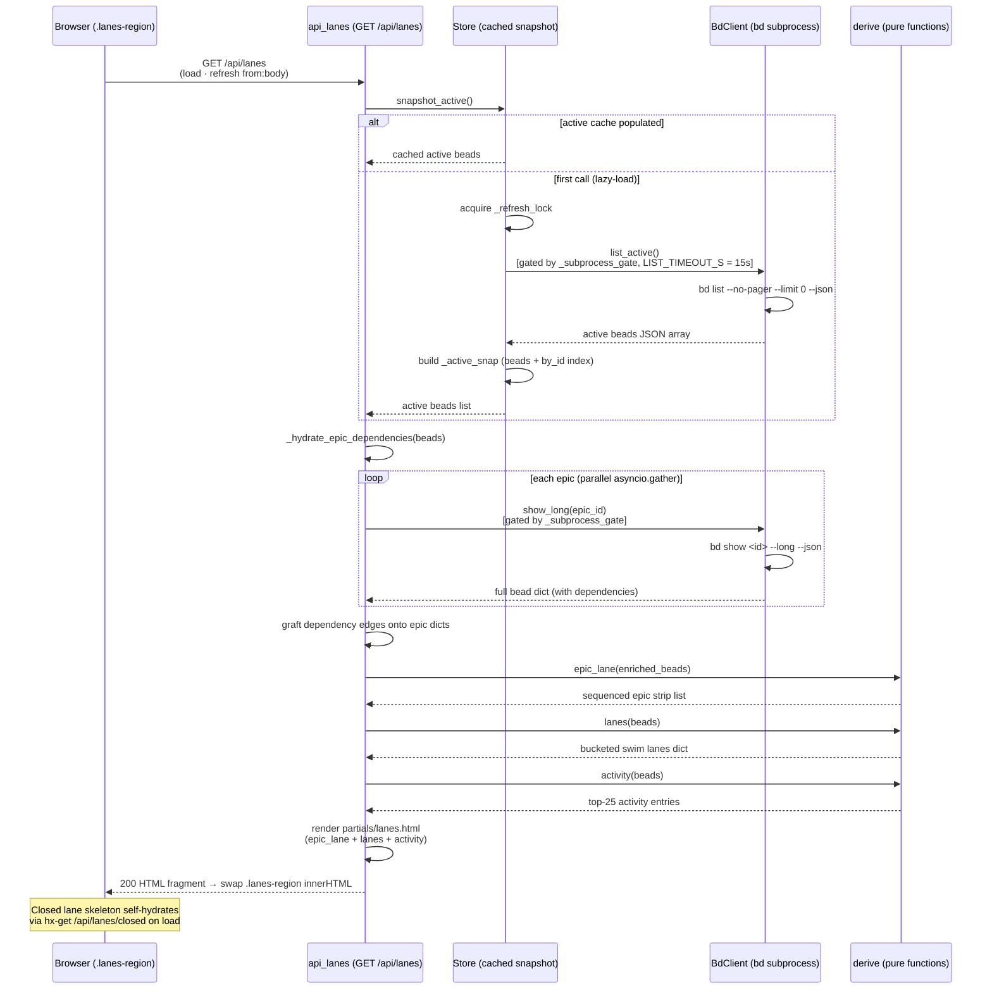

# GET /api/lanes

> [!NOTE]
> The route is registered as `GET /api/lanes`
> (`@app.get("/api/lanes", response_class=HTMLResponse)`). It renders the
> **active swim lanes** (Deferred / Blocked / Ready / In Progress), the
> horizontal **epic strip**, and the **Activity feed** — the three main
> regions of the [Board (/)](../Views/BoardView.md). This endpoint is the
> **fast first-paint path** (bdboard-0yy): it fetches ONLY active issues
> (~5 KB) via `store.snapshot_active()` instead of the full snapshot
> (~500 KB). The heavy Closed lane loads separately via
> [GET /api/lanes/closed](GetApiLanesClosed.md) after the active content
> is visible. The handler does **no `bd` mutation** — it reads the cached
> active snapshot, enriches epics with dependency edges via per-epic
> `bd show --long` calls, runs three pure derive functions
> (`epic_lane`, `lanes`, `activity`), and renders `partials/lanes.html`.

## Overview

| Method | Path | Auth | Purpose |
| --- | --- | --- | --- |
| GET | `/api/lanes` | None (reads are unauthenticated — bdboard is a single-user localhost dashboard; CSRF guards only the `POST`/`DELETE` write paths) | Render the active swim lanes, epic strip, and Activity feed (`partials/lanes.html`) — an `<section class="epic-lane">` with horizontally scrolling epic chips, a `<div class="lanes">` with four active swim lane columns (Deferred / Blocked / Ready / In Progress) plus a Closed lane skeleton (which self-hydrates from `/api/lanes/closed` on `load`), and an Activity feed column. Swapped into `.lanes-region` by HTMX on `load` (first paint) and on every SSE-driven `refresh from:body`. |

## Request

`GET` with no request body and no query parameters. The `.lanes-region`
section in `dashboard.html` fires this on `load` (first paint hydration) and
on `refresh from:body` (SSE live-update re-fetch after a `beads_changed`
broadcast). There is no user-driven parameterisation — the endpoint always
renders all active beads from the snapshot.

### Path/Query Params

| Name | In | Type | Required | Notes |
| --- | --- | --- | --- | --- |
| _(none)_ | — | — | — | This endpoint accepts no path or query parameters. |

### Headers

| Header | Required | Notes |
| --- | --- | --- |
| `HX-Request` | No | Sent automatically by HTMX on every `hx-get`. Not inspected by the handler — the route always returns the same fragment. |
| `X-CSRF-Token` | No | **Not** required. CSRF is enforced only on `POST`/`DELETE` mutation paths (see [CSRF Protection](../Concepts/CsrfProtection.md)); this read carries no token. |

### Body

No request body. (Shown for template completeness — the wire request has an
empty body.)

```json
{}
```

### Validation Rules

| Field | Rule | Error |
| --- | --- | --- |
| _(none)_ | No user inputs to validate. | — |

### Rate Limit

| Limit | Window | Scope |
| --- | --- | --- |
| None (no rate limiter) | — | Single-user localhost dashboard — no token-bucket / IP throttle. Structural throttles: the shared `BdClient._subprocess_gate` semaphore serializes every `bd` subprocess; `Store.snapshot_active()` lazy-loads on first call then serves the in-memory cache; the watcher refresh cycle (`Store.refresh`) is debounced — see [Store Snapshot & Change Detection](../Concepts/StoreSnapshotChangeDetection.md). The per-epic `bd show --long` calls for epic dependency hydration are parallel (`asyncio.gather`) but each individual call passes through the same semaphore. |

## Response

`Content-Type: text/html` (`response_class=HTMLResponse`). The body is an HTML
**fragment**, not JSON — bdboard is server-rendered HTMX. HTMX swaps the
fragment into the `.lanes-region` section via `hx-swap="innerHTML"`, replacing
the `lanes_skeleton.html` shimmer placeholders that were rendered during
the shell's initial paint.

### Success

`200 OK` — the rendered `partials/lanes.html`. The fragment contains three
top-level regions:

1. **Epic strip** (`<section class="epic-lane">`) — a `<h2>` title with the
   epic count, followed by a `<ul class="epic-strip">` of `<li class="epic-chip">`
   elements. Each chip shows the bead ID, priority badge, title, derived
   status (icon + label — `status_key` / `status_icon` / `status_label`),
   and assignee. Clicking a chip fires `hx-get="/api/bead/{id}"` to open
   the bead detail modal. When no active epics exist, a single
   `<li class="lane-empty muted">(no active epics)</li>` renders instead.

2. **Active swim lanes** (`<div class="lanes">`) — four columns iterated
   from `["deferred", "blocked", "ready", "in_progress"]`, each with a
   `<h2 class="lane-title">` (lane name + count) and a `<ul class="lane-list">`
   of `bead_card.html` includes. Empty lanes render a
   `<li class="lane-empty muted">(empty)</li>`. After the four active lanes,
   a **Closed lane skeleton** (`.lane-closed[data-lane="closed"]`) renders
   with three `bead_card_skeleton.html` shimmer placeholders — this skeleton
   immediately self-hydrates via its own
   `hx-get="/api/lanes/closed"` + `hx-trigger="load, refresh from:body"`.

3. **Activity feed** (`<div class="lane lane-activity">`) — a column showing
   the 25 most recent events (by `updated_at` / `closed_at` / `created_at`),
   each as an `<li class="activity-row">` with timestamp, verb, actor, and
   title. Clicking a row opens the bead modal.

The handler passes this template context:

```json
{
  "epic_lane": [
    {
      "id": "proj-abc",
      "title": "Epic title",
      "status": "in_progress",
      "issue_type": "epic",
      "priority": 1,
      "assignee": "Alice",
      "status_key": "in_progress",
      "status_icon": "▶",
      "status_label": "In Progress",
      "dependencies": []
    }
  ],
  "lanes": {
    "deferred": [],
    "ready": [
      {
        "id": "proj-xyz",
        "title": "Task title",
        "status": "open",
        "type": "task",
        "priority": 2,
        "assignee": "Bob"
      }
    ],
    "in_progress": [],
    "blocked": [],
    "closed": []
  },
  "activity": [
    {
      "id": "proj-xyz",
      "title": "Task title",
      "actor": "Bob",
      "verb": "updated",
      "ts": "2026-06-04T14:30:00Z",
      "ts_epoch": 1780671000.0,
      "priority": 2
    }
  ]
}
```

**`epic_lane`** is a list of enriched epic dicts produced by
`derive.epic_lane()`. Each epic is augmented with `status_key` (the
effective display status — an `open` epic with unmet blocking dependencies
becomes `"blocked"`), `status_icon` (e.g. `▶`, ``, `○`), and
`status_label` (e.g. "In Progress", "Blocked", "Ready"). The list is
topologically sorted by dependency edges (predecessor → successor
left-to-right) with the active or next-ready epic anchored at position 0.
Closed epics are omitted; molecule wrappers are omitted. Dependency edges
are hydrated per-epic via `_hydrate_epic_dependencies()` calling
`bd show --long` — the list snapshot from `bd list` omits expanded
dependency arrays.

**`lanes`** is a dict mapping lane keys (`"deferred"`, `"ready"`,
`"in_progress"`, `"blocked"`, `"closed"`) to lists of bead dicts, produced
by `derive.lanes()`. Epics and molecule wrappers are excluded (they live in
the strip). Lane assignment rules:
- `in_progress` → status == `"in_progress"`
- `blocked` → status == `"blocked"` OR (status == `"open"` AND has unmet
  `blocks`/`blocked-by` dependency with a non-closed target)
- `ready` → status == `"open"` AND no unmet blocking dependencies
- `deferred` → everything else open-ish (including unknown statuses)
- `closed` → status in `CLOSED_STATUSES` (`closed`, `resolved`, `done`)

Active lanes (deferred/ready/in_progress/blocked) are sorted by
`priority` asc (P0 first) then `updated_at` desc. The `closed` bucket is
populated from the active-only snapshot (which contains no closed beads), so
it is effectively empty on first paint — the real Closed lane content
arrives from [GET /api/lanes/closed](GetApiLanesClosed.md).

**`activity`** is a list of the 25 most recent activity entries produced by
`derive.activity()`, sorted by `ts_epoch` desc (newest first). Each entry
synthesizes a verb from the bead's current status: `"closed"` / `"in progress"`
/ `"blocked"` / `"created"` / `"updated"`.

> [!WARNING]
> **Blocked-by detection caveat.** On first paint, `/api/lanes` fetches
> only active issues. Any active bead depending on a **closed** bead will
> conservatively show as blocked (the unknown target is treated as unmet).
> This is an acceptable tradeoff for the ~100× payload reduction. The UI
> self-corrects on the next SSE-driven `refresh from:body`, which uses
> the full snapshot (active + closed).

> [!NOTE]
> **Activity on first paint is active-only.** Because the handler uses
> `store.snapshot_active()`, the Activity feed shows only events from
> active beads on first paint. Closed-bead events appear after the SSE
> refresh when the full snapshot is available.

### Errors

| Status | Code | When |
| --- | --- | --- |
| `500` | Unhandled exception | If `store.snapshot_active()` raises (e.g. `bd list` exits non-zero, times out at `LIST_TIMEOUT_S = 15.0s`, or returns non-list JSON), the exception propagates and FastAPI returns a 500. The store's `_load_active` path `log.exception`s on failure and leaves the cache empty (returning `[]`), so only a very early or catastrophic `bd` failure triggers a 500 here — a partial failure degrades to empty lanes. |
| `500` | Unhandled exception | If any `bd show --long` call in `_hydrate_epic_dependencies` fails, the exception can propagate. However, the `_load` helper inside the gather catches per-epic failures gracefully — a missing or erroring epic simply won't have its dependency edges hydrated, and the strip renders without sequencing. |
| _(no `403`)_ | — | Reads are unauthenticated; there is no CSRF gate on this path. |
| _(no `422`)_ | — | No user inputs to validate — there are no query parameters or body fields. |

## Implementation Map

| Responsibility | File path | Symbol |
| --- | --- | --- |
| Route handler (snapshot → hydrate epics → derive → render) | `src/bdboard/app.py` | `api_lanes` |
| Active-only snapshot (cached, lazy-loaded on first call) | `src/bdboard/store.py` | `Store.snapshot_active` |
| Load active beads into cache (under refresh lock, dedup) | `src/bdboard/store.py` | `Store._load_active` |
| Full refresh (active + closed caches, drives SSE dedup) | `src/bdboard/store.py` | `Store.refresh` |
| Active issue fetch (`bd list --no-pager --limit 0 --json`) | `src/bdboard/bd.py` | `BdClient.list_active` |
| Epic dependency hydration (`bd show --long` per epic, parallel gather) | `src/bdboard/app.py` | `_hydrate_epic_dependencies` |
| Per-epic long view (`bd show <id> --long --json`) | `src/bdboard/bd.py` | `BdClient.show_long` |
| Epic strip builder (topo-sort, status enrichment, anchor) | `src/bdboard/derive/lanes.py` | `epic_lane` |
| Epic lane rank (in_progress=0, ready=1, blocked=2, deferred=3) | `src/bdboard/derive/lanes.py` | `_epic_lane_rank` |
| Topological component ordering (stable tie-break, cycle-safe) | `src/bdboard/derive/lanes.py` | `_topo_component_order` |
| Swim lane bucketing (non-epic beads → deferred/ready/in_progress/blocked/closed) | `src/bdboard/derive/lanes.py` | `lanes` |
| Blocked-by dependency detection | `src/bdboard/derive/lanes.py` | `_has_unmet_blocking_dep` |
| Activity feed builder (top-25, verb from status, `ts_epoch` desc) | `src/bdboard/derive/lanes.py` | `activity` |
| Lane key constants | `src/bdboard/derive/lanes.py` | `LANES` |
| Closed statuses set (`closed`, `resolved`, `done`) | `src/bdboard/derive/lanes.py` | `CLOSED_STATUSES` |
| Status metadata (icon + label lookup) | `src/bdboard/derive/lanes.py` | `_STATUS_META` |
| Epic / molecule type guards | `src/bdboard/derive/lanes.py` | `_is_epic`, `_is_molecule` |
| Dependency field access helpers | `src/bdboard/derive/lanes.py` | `get_dependency_list`, `get_dependency_type`, `get_dependency_target_id` |
| Gated JSON subprocess runner + timeout | `src/bdboard/bd.py` | `BdClient._run_json`, `BdClient._subprocess_gate`, `LIST_TIMEOUT_S` |
| Lanes partial (epic strip + four active lanes + closed skeleton + activity) | `src/bdboard/templates/partials/lanes.html` | (Jinja `` loop + `bead_card.html` include + `.lane-closed` skeleton) |
| Bead card include (shared tile for lane items) | `src/bdboard/templates/partials/bead_card.html` | (bead-card `<li>` with `hx-get="/api/bead/{id}"`) |
| Lanes skeleton (shimmer placeholders shown until swap) | `src/bdboard/templates/partials/lanes_skeleton.html` | (five lane shimmer columns + epic strip shimmer, `aria-hidden`) |
| Board shell (`.lanes-region` host, fires `hx-get="/api/lanes"` on `load`) | `src/bdboard/templates/dashboard.html` | (`section.lanes-region` with `hx-get="/api/lanes"` + `hx-trigger="load, refresh from:body"`) |
| Board shell hydration test (lazy hx-get /api/lanes + /api/counts) | `tests/test_snappy_transitions.py` | `test_board_shell_hydrates_lanes_and_counts_lazily` |
| Lane bucketing tests (deferred fallback, epic exclusion) | `tests/test_deferred_fallback.py` | `test_deferred_status_lands_in_deferred_lane`, `test_unknown_status_falls_back_to_deferred_lane` |
| Epic strip derivation tests (exclusion, promotion, blocked badge) | `tests/test_derive_epics.py` | `test_lanes_excludes_epics_from_main_columns`, `test_lanes_excludes_molecule_wrapper_from_main_columns`, `test_epic_lane_excludes_molecule_wrapper`, `test_epic_lane_promotes_active_or_next_ready_to_front_and_omits_closed`, `test_epic_lane_promotes_ready_when_no_active_epic`, `test_epic_lane_displays_blocked_badge_for_open_epics_with_unmet_blockers` |



## Example

Default fetch — exactly what the `.lanes-region` section fires on `load`:

```bash
curl -i "http://127.0.0.1:7332/api/lanes"
```

A successful call returns `200` with the full lanes fragment: epic strip
section + four active swim lane columns + Closed skeleton + Activity feed.
HTMX swaps the fragment into `.lanes-region` (replacing the
`lanes_skeleton.html` shimmer), and the embedded `.lane-closed` skeleton
immediately fires its own `hx-get="/api/lanes/closed"` to load the heavy
Closed lane in the background.

## Related

- [Endpoints index](index.md) — every route bdboard exposes.
- [Board (/)](../Views/BoardView.md) — the page surface whose
  `.lanes-region` lazy-loads from **this** endpoint on `load` and re-fetches
  on every SSE `refresh from:body`; the lanes region is the board's main
  content area alongside the masthead counts strip.
- [GET /api/lanes/closed](GetApiLanesClosed.md) — the Closed lane endpoint;
  both are HTMX HTML fragments that together compose the board's full
  swim-lane region, split so the lighter active data (~5 KB) paints first
  while the heavy closed data (~495 KB) loads in the background (bdboard-0yy).
- [GET /api/counts](GetApiCounts.md) — the masthead counts strip endpoint;
  loads in parallel with this endpoint on first paint via its own `hx-get`
  on `load`.
- [GET /api/bead/{id}](GetApiBead.md) — the shared bead detail modal
  opened when an epic chip, lane card, or activity row is clicked.
- [GET /api/events](GetApiEvents.md) — the SSE stream whose `beads_changed`
  event drives the `refresh from:body` re-fetch of this endpoint across tabs.
- [Derive Layer](../Concepts/DeriveLayer.md) — the pure `derive.lanes`
  module where `epic_lane`, `lanes`, `activity`, and lane assignment logic
  live.
- [Store Snapshot & Change Detection](../Concepts/StoreSnapshotChangeDetection.md)
  — the cached `snapshot_active()` that this route reads without shelling
  out on every request; the watcher-driven `refresh()` invalidates it on
  file changes.
- [Subprocess Serialization & Caching](../Concepts/SubprocessSerializationAndCaching.md)
  — the semaphore + cache behind `list_active` and `show_long`.
- [CSRF Protection](../Concepts/CsrfProtection.md) — why this read path
  carries no `X-CSRF-Token`.
- [SSE Event Bus](../Concepts/SseEventBus.md) — the `beads_changed`
  broadcast that keeps this endpoint live across tabs.
- [bd CLI as Source of Truth](../Concepts/BdCliSourceOfTruth.md) — why this
  path shells `bd list` and `bd show` instead of reading `.beads/` directly.
- [Epic Lane Sequencing](../Concepts/EpicLaneSequencing.md) — the
  topological sorting and rank-based anchoring logic that orders the epic
  strip rendered by this endpoint.
- [Back to docs index](../index.md)
