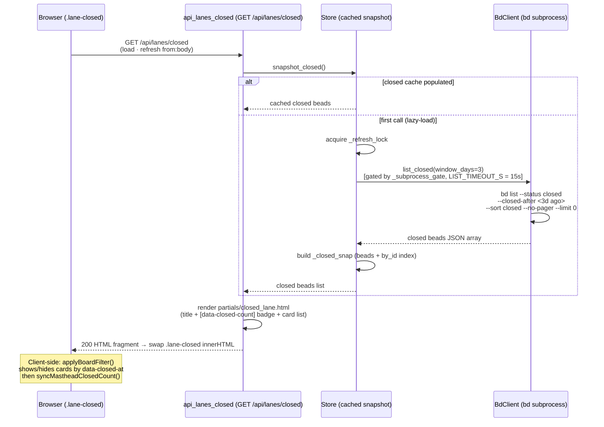

# GET /api/lanes/closed

> [!NOTE]
> The route is registered as `GET /api/lanes/closed`
> (`@app.get("/api/lanes/closed", response_class=HTMLResponse)`). It renders
> the **Closed swim lane content** — the title + count badge + card list for
> beads closed within the board's date window
> (`BOARD_CLOSED_WINDOW_DAYS = 3`). This endpoint exists purely as a
> **performance split** (bdboard-0yy): the Closed lane is the heaviest
> part of the board (~495 KB on large workspaces), so it loads *after* the
> active lanes paint, reducing time-to-first-paint from ~500 KB to ~5 KB.
> The handler does **no `bd` mutation** — it pulls the board-windowed closed
> snapshot from `store.snapshot_closed()` and renders
> `partials/closed_lane.html`.

## Overview

| Method | Path | Auth | Purpose |
| --- | --- | --- | --- |
| GET | `/api/lanes/closed` | None (reads are unauthenticated — bdboard is a single-user localhost dashboard; CSRF guards only the `POST`/`DELETE` write paths) | Render the Closed swim lane content (`partials/closed_lane.html`) — a `<h2>` title with a `[data-closed-count]` badge + `<ul>` of `bead_card.html` includes, each carrying a `data-closed-at` attribute for client-side time filtering. Swapped into the `.lane-closed` skeleton placeholder by HTMX on `load` (immediately after `lanes.html` swaps in) and on every SSE-driven `refresh from:body`. |

## Request

`GET` with no request body and no query parameters. The `.lane-closed`
placeholder div in `partials/lanes.html` fires this on `load` (right after
the active lanes swap in) and on `refresh from:body` (SSE live-update
re-fetch after a `beads_changed` broadcast). There is no user-driven
parameterisation — the endpoint always returns all beads closed within the
board date window (`BOARD_CLOSED_WINDOW_DAYS = 3` days). The 12h/1d/3d
time-filter narrowing happens entirely client-side via `applyBoardFilter()`
in `base.html`, which shows/hides cards by their `data-closed-at` attribute.

### Path/Query Params

| Name | In | Type | Required | Notes |
| --- | --- | --- | --- | --- |
| _(none)_ | — | — | — | This endpoint accepts no path or query parameters. |

### Headers

| Header | Required | Notes |
| --- | --- | --- |
| `HX-Request` | No | Sent automatically by HTMX on every `hx-get`. Not inspected by the handler — the route always returns the same fragment. |
| `X-CSRF-Token` | No | **Not** required. CSRF is enforced only on `POST`/`DELETE` mutation paths (see [CSRF Protection](../Concepts/CsrfProtection.md)); this read carries no token. |

### Body

No request body. (Shown for template completeness — the wire request has an
empty body.)

```json
{}
```

### Validation Rules

| Field | Rule | Error |
| --- | --- | --- |
| _(none)_ | No user inputs to validate. | — |

### Rate Limit

| Limit | Window | Scope |
| --- | --- | --- |
| None (no rate limiter) | — | Single-user localhost dashboard — no token-bucket / IP throttle. Structural throttles: the shared `BdClient._subprocess_gate` semaphore serializes every `bd` subprocess; `Store.snapshot_closed()` lazy-loads on first call then serves the in-memory cache; the watcher refresh cycle (`Store.refresh`) is debounced — see [Store Snapshot & Change Detection](../Concepts/StoreSnapshotChangeDetection.md). |

## Response

`Content-Type: text/html` (`response_class=HTMLResponse`). The body is an HTML
**fragment**, not JSON — bdboard is server-rendered HTMX. HTMX swaps the
fragment into the `.lane-closed` div via `hx-swap="innerHTML"`, replacing the
skeleton placeholder that was shown since initial paint.

### Success

`200 OK` — the re-rendered `partials/closed_lane.html`. It replaces the lane
skeleton (title shimmer + three `bead_card_skeleton.html` placeholders) with
real content: a `<h2 class="lane-title">` containing the lane name + a
`<span data-closed-count="total">` badge showing the total count, followed by
a `<ul class="lane-list">` of bead cards. Each card is rendered via
`` with `show_closed_at_attr = true`,
which stamps each `<li>` with a `data-closed-at` attribute carrying the
bead's `closed_at` ISO timestamp. When the closed list is empty, a single
`<li class="lane-empty muted">(empty)</li>` renders instead.

The handler hands the template this context:

```json
{
  "closed": [
    {
      "id": "proj-abc",
      "title": "Implement widget",
      "status": "closed",
      "type": "task",
      "priority": 2,
      "assignee": "Alice",
      "closed_at": "2026-06-04T14:30:00Z",
      "close_reason": "completed"
    }
  ]
}
```

`closed` is a **list of bead dicts** returned directly by
`store.snapshot_closed()`. The list is pre-sorted by `closed_at` descending
(newest first) — the `bd list --sort closed` flag in `BdClient.list_closed`
handles this at query time. The list contains every bead whose status is in
`CLOSED_STATUSES` (`closed`, `resolved`, `done`) AND whose `closed_at` falls
within the last `BOARD_CLOSED_WINDOW_DAYS` (3) days from fetch time. The
handler does **no additional filtering or sorting** — it passes the snapshot
straight to the template.

> [!IMPORTANT]
> The `data-closed-count="total"` badge in the response carries the
> **full 3-day window count**. The client-side `applyBoardFilter()` in
> `base.html` then re-syncs the masthead CLOSED KPI cell to the
> **visible** count after applying the 12h/1d/3d filter. The guard
> (`closedLane.querySelector('[data-closed-count]')`) prevents the
> sync from firing against the skeleton (which has no badge), avoiding a
> stale-zero flash (see `test_masthead_sync_guarded_by_real_closed_lane`
> in `tests/test_board_counts_filter_sync.py`).

> [!NOTE]
> **Blocked-by detection caveat.** On the very first paint, the active
> lanes load without closed beads (they come from this separate endpoint).
> Any active bead depending on a closed bead will conservatively show as
> blocked until this endpoint's response swaps in and the SSE refresh
> re-derives the lanes with the full snapshot. This is an acceptable
> tradeoff for the ~100x payload reduction.

Rendered fragment shape:

```html
<h2 class="lane-title">
  <span class="lane-name">Closed</span>
  <span class="lane-count" data-closed-count="total">42</span>
</h2>
<ul class="lane-list">
  <li class="bead-card"
      data-closed-at="2026-06-04T14:30:00Z"
      hx-get="/api/bead/proj-abc"
      hx-target="#bead-modal"
      hx-swap="innerHTML">
    <!-- bead card content (id, priority, title, assignee, type) -->
  </li>
  <!-- ... more cards ... -->
</ul>
```

Before the first swap lands, the `.lane-closed` host shows a skeleton
(three `bead_card_skeleton.html` placeholders + a shimmer count, all
`aria-hidden`) so the Closed column reserves layout space and paints
instantly alongside the active lanes.

### Errors

| Status | Code | When |
| --- | --- | --- |
| `500` | Unhandled exception | If `store.snapshot_closed()` raises (e.g. `bd list --status closed` exits non-zero, times out at `LIST_TIMEOUT_S = 15.0s`, or returns non-list JSON), the exception propagates and FastAPI returns a 500. The store's `_load_closed` path `log.exception`s on failure and leaves the cache empty (returning `[]`), so only a very early or catastrophic `bd` failure triggers a 500 here — a partial failure degrades to an empty closed lane. |
| _(no `403`)_ | — | Reads are unauthenticated; there is no CSRF gate on this path. |
| _(no `422`)_ | — | No user inputs to validate — there are no query parameters or body fields. |

## Implementation Map

| Responsibility | File path | Symbol |
| --- | --- | --- |
| Route handler (snapshot → render) | `src/bdboard/app.py` | `api_lanes_closed` |
| Board-closed snapshot (cached, lazy-loaded on first call) | `src/bdboard/store.py` | `Store.snapshot_closed` |
| Load closed beads into cache (under refresh lock, dedup) | `src/bdboard/store.py` | `Store._load_closed` |
| Full refresh (active + closed caches, drives SSE dedup) | `src/bdboard/store.py` | `Store.refresh` |
| Board-windowed closed fetch (`bd list --status closed --closed-after <cutoff> --sort closed --no-pager --limit 0`) | `src/bdboard/bd.py` | `BdClient.list_closed` |
| Board closed window constant (3 days) | `src/bdboard/derive/lanes.py` | `BOARD_CLOSED_WINDOW_DAYS` |
| Closed statuses set (`closed`, `resolved`, `done`) | `src/bdboard/derive/lanes.py` | `CLOSED_STATUSES` |
| Gated JSON subprocess runner + timeout | `src/bdboard/bd.py` | `BdClient._run_json`, `BdClient._subprocess_gate`, `LIST_TIMEOUT_S` |
| Closed lane partial (title + count badge + card list) | `src/bdboard/templates/partials/closed_lane.html` | (Jinja `` loop with `bead_card.html` include) |
| Bead card include (shared tile, `data-closed-at` stamped via `show_closed_at_attr`) | `src/bdboard/templates/partials/bead_card.html` | (`data-closed-at`) |
| Closed lane skeleton placeholder (shimmer, fires `hx-get` on `load`) | `src/bdboard/templates/partials/lanes.html` | (`.lane-closed` div with `hx-get="/api/lanes/closed"` + `hx-trigger="load, refresh from:body"`) |
| Client-side time filter (shows/hides cards by `data-closed-at`, re-syncs masthead CLOSED cell) | `src/bdboard/templates/base.html` | `applyBoardFilter`, `syncMastheadClosedCount` |
| `[data-closed-count]` guard (prevents sync against skeleton) | `src/bdboard/templates/base.html` | `closedLane.querySelector('[data-closed-count]')` |
| Board shell hydration test (lazy hx-get /api/lanes + /api/counts) | `tests/test_snappy_transitions.py` | `test_board_shell_hydrates_lanes_and_counts_lazily` |
| Masthead sync guard test (no sync against skeleton) | `tests/test_board_counts_filter_sync.py` | `test_masthead_sync_guarded_by_real_closed_lane` |



## Example

Default fetch — exactly what the `.lane-closed` placeholder fires on `load`:

```bash
curl -i "http://127.0.0.1:7332/api/lanes/closed"
```

A successful call returns `200` with the `<h2>` title + `<ul>` card list
fragment; HTMX swaps it into the `.lane-closed` div (replacing the skeleton).
The client-side `applyBoardFilter()` then shows/hides cards based on the
active time-window filter (12h/1d/3d) and re-syncs the masthead CLOSED KPI
cell to the visible count.

## Related

- [Endpoints index](index.md) — every route bdboard exposes.
- [Board (/)](../Views/BoardView.md) — the page surface whose `.lane-closed`
  placeholder lazy-loads from **this** endpoint on `load` and re-fetches on
  every SSE `refresh from:body`; the Closed lane sits alongside the four
  active lanes and the Activity feed.
- [GET /api/lanes](GetApiLanes.md) — the active lanes + epic strip + activity
  endpoint; both are HTMX HTML fragments that together compose the board's
  swim-lane region, split so the lighter active data (~5 KB) paints first
  while the heavy closed data (~495 KB) loads in the background (bdboard-0yy).
- [GET /api/counts](GetApiCounts.md) — the masthead counts strip endpoint;
  the Closed lane's visible count drives the client-side re-sync of the
  CLOSED cell in that strip via `syncMastheadClosedCount()`.
- [GET /api/events](GetApiEvents.md) — the SSE stream whose `beads_changed` event
  drives the `refresh from:body` re-fetch of this lane across tabs (see the
  Endpoints index until its own doc lands).
- [Derive Layer](../Concepts/DeriveLayer.md) — the pure `derive.lanes`
  module where `BOARD_CLOSED_WINDOW_DAYS` and `CLOSED_STATUSES` are defined.
- [Store Snapshot & Change Detection](../Concepts/StoreSnapshotChangeDetection.md)
  — the cached `snapshot_closed()` (date-bounded by `BOARD_CLOSED_WINDOW_DAYS`
  at fetch time) that this route reads without shelling out on every request.
- [Subprocess Serialization & Caching](../Concepts/SubprocessSerializationAndCaching.md)
  — the semaphore + cache behind `list_closed`.
- [CSRF Protection](../Concepts/CsrfProtection.md) — why this read path
  carries no `X-CSRF-Token`.
- [SSE Event Bus](../Concepts/SseEventBus.md) — the `beads_changed`
  broadcast that keeps this lane live across tabs.
- [bd CLI as Source of Truth](../Concepts/BdCliSourceOfTruth.md) — why this
  path shells `bd list` instead of reading `.beads/` directly.
- [Epic Lane Sequencing](../Concepts/EpicLaneSequencing.md) — how the board's
  epic strip is sequenced (the active lanes endpoint, not this one, renders
  it; linked for board-wide context).
- [Back to docs index](../index.md)
