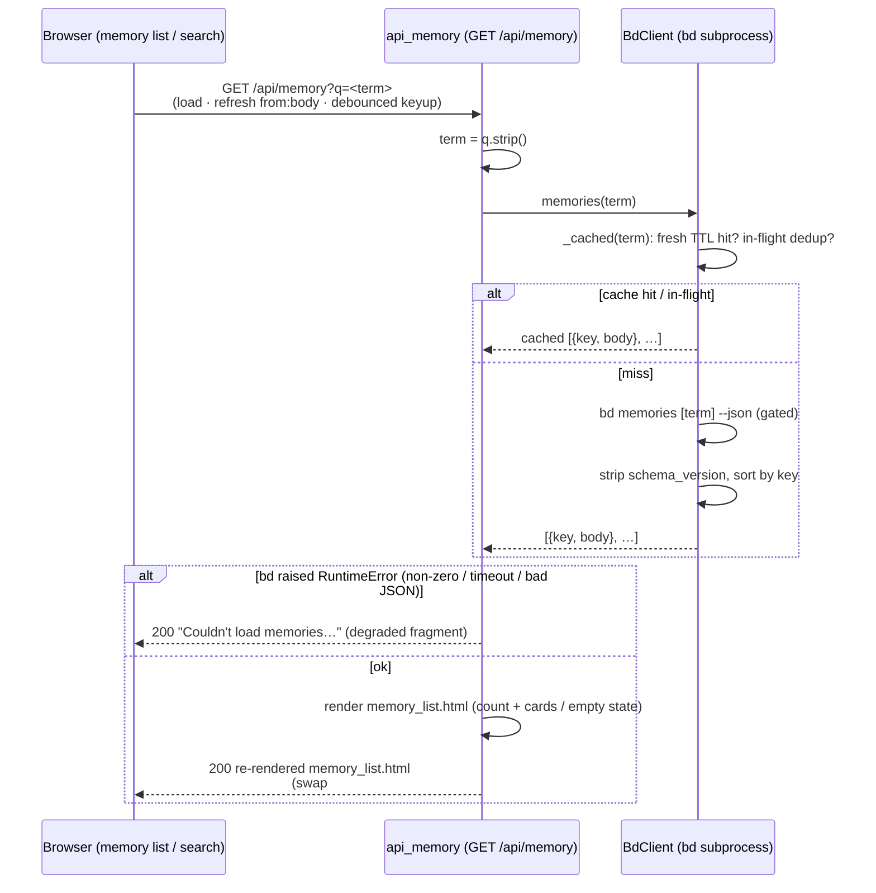

# GET /api/memory

> [!NOTE]
> The route is registered as `GET /api/memory`
> (`@app.get("/api/memory", response_class=HTMLResponse)`). This is the
> **read half** of [Memory Curation](../Features/index.md): it lists (or
> searches) the `bd` memories that are injected at `bd prime` and returns the
> re-rendered `partials/memory_list.html` fragment for an HTMX swap of
> `#memory-list`. It is the non-mutating sibling of the upsert path
> [POST /api/memory](PostApiMemory.md) and the destructive path
> [DELETE /api/memory/{key}](DeleteApiMemory.md) — those two re-render the
> *same* partial, and after either mutation broadcasts `beads_changed`, every
> open tab re-fetches **this** endpoint via `refresh from:body`.

## Overview

| Method | Path | Auth | Purpose |
| --- | --- | --- | --- |
| GET | `/api/memory` | None (reads are unauthenticated; only the CSRF-guarded `POST`/`DELETE` writes require a token. Single-user localhost dashboard, no cookies/session) | List or search `bd` memories via `bd memories [term] --json`, then return the re-rendered `partials/memory_list.html` fragment for an in-place HTMX swap of `#memory-list`. An empty/whitespace `q` lists everything; a non-empty `q` runs bd's own server-side case-insensitive substring match across key + body |

## Request

`GET` with no request body. The only input is the optional `q` query-string
parameter (the search term). The list region in `memory.html` fires this on
`load`, on `refresh from:body` (the SSE-driven re-fetch), and the search input
fires it on debounced `keyup`/`search` — all via `hx-get="/api/memory"`
targeting `#memory-list` with `hx-swap="innerHTML"`.

### Path/Query Params

| Name | In | Type | Required | Notes |
| --- | --- | --- | --- | --- |
| `q` | query | string | No (defaults to `""`) | The search term. Bound as `q: str = ""` in `api_memory`, then `.strip()`'d to `term`. Empty/whitespace → `bd memories --json` (list all); a non-empty term → `bd memories <term> --json`, which performs bd's own **server-side, case-insensitive substring match** across both key and body — bdboard reuses that match rather than re-implementing it in the browser. The search input sends it via `name="q"` with `hx-sync="this:replace"` so a newer keystroke cancels the in-flight request. |

### Headers

| Header | Required | Notes |
| --- | --- | --- |
| `HX-Request` | No | Sent automatically by HTMX on every `hx-get`. Not inspected by this handler — the route always returns the same fragment whether or not HTMX is driving it (it's a partial, not a full page). |
| `X-CSRF-Token` | No | **Not** required for reads. CSRF is enforced only on the `POST`/`DELETE` mutation paths (see [CSRF Protection](../Concepts/CsrfProtection.md)); a `GET` carries no token. |

### Body

No request body. (Shown here for template completeness — the wire request has an
empty body; the only input is the `q` query-string parameter.)

```json
{}
```

### Validation Rules

| Field | Rule | Error |
| --- | --- | --- |
| `q` | None — any string is accepted. It is `.strip()`'d in the handler; an empty result means "list all", never an error. | — (no validation error path) |
| `q` substring matching | NOT done in-process — the non-empty term is forwarded verbatim to `bd memories <term> --json`, which owns the case-insensitive substring match across key + body. | — (delegated to `bd`) |
| `bd` subprocess result | Must be a JSON **object** (`dict`); `bd.memories` raises `RuntimeError` on a non-object payload or malformed JSON. The handler catches `RuntimeError` and degrades to a friendly inline message (HTTP `200`), so a bad payload never 500s the swap. | inline degraded fragment (status `200`) — see Errors |

### Rate Limit

| Limit | Window | Scope |
| --- | --- | --- |
| None (no rate limiter) | — | bdboard is a single-user localhost dashboard, so there is no token-bucket / IP throttle. The only structural throttle on the read path is the shared `BdClient._subprocess_gate` semaphore plus an 8 s TTL cache (`MEMORIES_TIMEOUT_S`) with in-flight de-duplication in `BdClient._cached`: a burst of debounced searches for the same term coalesces onto one in-flight subprocess instead of spawning a `bd` process per keystroke. |

## Response

`Content-Type: text/html` (`response_class=HTMLResponse`). The body is an HTML
**fragment**, not JSON — bdboard is server-rendered HTMX, so the route returns
the re-rendered memory list that HTMX swaps into `#memory-list` via
`hx-swap="innerHTML"`.

### Success

`200 OK` — the re-rendered `partials/memory_list.html`, built from
`bd.memories(term)`. The result count is rendered in an `aria-live="polite"`
status line (so screen readers hear filter updates), followed by the memory
cards. Each card shows the key as a monospace heading, the markdown-rendered
body (via the shared `md` Jinja filter), and edit/forget affordances. Shape
(full list, no search term):

```html
<p class="memory-count" role="status" aria-live="polite">
  4 memories
</p>
<ul class="memory-list" role="list">
  <li class="memory-card">
    <div class="memory-card-head">
      <h3 class="memory-key">dev-workflow</h3>
      <div class="memory-card-actions">
        <button type="button" class="memory-action-btn memory-edit-btn"
                aria-label="Edit dev-workflow" title="Edit"
                data-key="dev-workflow" data-body="…"
                onclick="editMemory(this.dataset.key, this.dataset.body)"></button>
        <button type="button" class="memory-action-btn memory-forget-btn"
                aria-label="Forget dev-workflow" title="Forget"
                onclick="confirmForget('dev-workflow')"></button>
      </div>
    </div>
    <div class="memory-body prose"><!-- markdown-rendered body --></div>
  </li>
  <!-- … remaining cards (sorted alphabetically by key) … -->
</ul>
```

> [!NOTE]
> `bd.memories` returns `{"key", "body"}` dicts **sorted alphabetically by
> key**, and strips the `schema_version` sentinel from bd's raw flat
> key→body object. A payload of *only* the sentinel (the empty / no-match
> shape) yields an empty list, which renders one of the empty states below.

When a non-empty `q` is supplied, the count line and (on no match) the empty
state echo the term:

```html
<p class="memory-count" role="status" aria-live="polite">
  2 matching "workflow"
</p>
```

If the search matches nothing, the partial renders the *query-scoped* empty
state (distinct from the no-memories-at-all state):

```html
<p class="memory-count" role="status" aria-live="polite">0 matching "zzz"</p>
<p class="memory-empty muted">No memories matching "zzz".</p>
```

If there are no memories at all (empty `q`, nothing stored), the partial renders
the onboarding empty state instead of `<ul>`:

```html
<p class="memory-count" role="status" aria-live="polite">0 memories</p>
<p class="memory-empty muted">
  No memories yet — click <strong>+ New Memory</strong> or run
  <code>bd remember</code> to add one.
</p>
```

### Errors

| Status | Code | When |
| --- | --- | --- |
| `200` | `<p class="memory-empty muted" role="status" aria-live="polite">Couldn't load memories right now. Please try again in a moment.</p>` | `bd.memories` raised `RuntimeError` — `bd memories [term] --json` exited non-zero, timed out (`MEMORIES_TIMEOUT_S = 8.0s`), or returned malformed / non-object JSON. The handler **catches** this and returns the friendly inline fragment at HTTP `200` (logged as `log.warning("bd memories failed: %s", err)`), so a broken read degrades gracefully inside the swap target rather than surfacing an HTTP 5xx to HTMX. |
| `422` | FastAPI request-validation error | Only if `q` is sent with a type that fails coercion to `str` — in practice unreachable since query strings are always strings; listed for completeness. |
| _(no `403`)_ | — | Reads are unauthenticated; there is no CSRF gate on this path (contrast the `POST`/`DELETE` siblings). |

## Implementation Map

| Responsibility | File path | Symbol |
| --- | --- | --- |
| Route handler (strip `q` → read → render, degrade on failure) | `src/bdboard/app.py` | `api_memory` |
| `q` query-param binding (`q: str = ""`) | `src/bdboard/app.py` | `api_memory` signature |
| Friendly degraded fragment on bd failure | `src/bdboard/app.py` | `api_memory` (the `except RuntimeError` branch) |
| Serialized `bd memories [term] --json` read | `src/bdboard/bd.py` | `BdClient.memories` |
| TTL cache + in-flight dedup around the subprocess | `src/bdboard/bd.py` | `BdClient._cached`, `BdClient._memories_cache` |
| Read timeout budget | `src/bdboard/bd.py` | `MEMORIES_TIMEOUT_S` |
| `schema_version` sentinel strip + alphabetical sort | `src/bdboard/bd.py` | `BdClient.memories`, `SCHEMA_VERSION_KEY` |
| Gated JSON subprocess runner | `src/bdboard/bd.py` | `BdClient._run_json`, `BdClient._subprocess_gate` |
| Rendered list partial (count, cards, empty states) | `src/bdboard/templates/partials/memory_list.html` | (count status + card loop + two empty states) |
| Instant skeleton shown before the first swap | `src/bdboard/templates/partials/memory_skeleton.html` | (perceived-perf placeholder) |
| Markdown rendering of each memory body | `src/bdboard/md.py` | `render` (the `md` Jinja filter) |
| Page shell + search/list HTMX wiring | `src/bdboard/templates/memory.html` | `#memory-q` (search), `#memory-list` (`hx-get`, `load, refresh from:body`) |
| Endpoint regression coverage | `tests/test_api_memory.py` | `test_full_list_renders_count_and_cards`, `test_search_passes_query_and_renders_matching_copy`, `test_bd_failure_degrades_gracefully`, … |



## Example

List every memory (empty `q` → full list, sorted alphabetically by key):

```bash
curl -i "http://127.0.0.1:8000/api/memory"
```

A successful call returns `200` with the re-rendered memory list fragment; HTMX
swaps it into `#memory-list` via `hx-swap="innerHTML"`. This is exactly what
every open tab re-fetches when a `POST`/`DELETE` broadcasts `beads_changed` over
the SSE bus (`refresh from:body`).

Search for memories mentioning `workflow` (bd's case-insensitive substring match
across key + body):

```bash
curl -i "http://127.0.0.1:8000/api/memory?q=workflow"
# → 200  <p class="memory-count" …>2 matching "workflow"</p> …cards…
```

A term that matches nothing returns the query-scoped empty state (still `200`):

```bash
curl -i "http://127.0.0.1:8000/api/memory?q=zzz-nope"
# → 200  <p class="memory-empty muted">No memories matching "zzz-nope".</p>
```

If `bd` itself is unavailable (non-zero exit / timeout / malformed JSON), the
read degrades to a friendly inline message — still HTTP `200`, never a 5xx:

```bash
curl -i "http://127.0.0.1:8000/api/memory"
# → 200  <p class="memory-empty muted" …>Couldn't load memories right now.
#         Please try again in a moment.</p>
```

## Related

- [Endpoints index](index.md) — every route bdboard exposes.
- [POST /api/memory](PostApiMemory.md) — the upsert (remember) sibling; it
  mutates the list **this** endpoint reads, then broadcasts `beads_changed` so
  every tab re-fetches here. Both render the same `memory_list.html` partial.
- [DELETE /api/memory/{key}](DeleteApiMemory.md) — the destructive (forget)
  sibling; same story — it mutates the list this endpoint reads and triggers a
  `refresh from:body` re-fetch of this route.
- [GET /api/events](index.md) — the SSE stream whose `beads_changed` event
  drives the `refresh from:body` re-fetch of this endpoint across tabs (see the
  Endpoints index until its own doc lands).
- [Memory (/memory)](../Views/MemoryView.md) — the page surface whose search
  strip and list region issue this `GET` (on `load`, on debounced search, and
  on SSE refresh).
- [Feature: Memory Curation](../Features/index.md) — the feature this endpoint's
  read half implements.
- [Subprocess Serialization & Caching](../Concepts/SubprocessSerializationAndCaching.md)
  — the semaphore + TTL cache + in-flight dedup behind `BdClient.memories`.
- [SSE Event Bus](../Concepts/SseEventBus.md) — the `beads_changed` broadcast
  that keeps this list live across tabs after a write.
- [bd CLI as Source of Truth](../Concepts/BdCliSourceOfTruth.md) — why this path
  shells `bd memories` instead of reading `.beads/` directly.
- [Back to docs index](../index.md)
