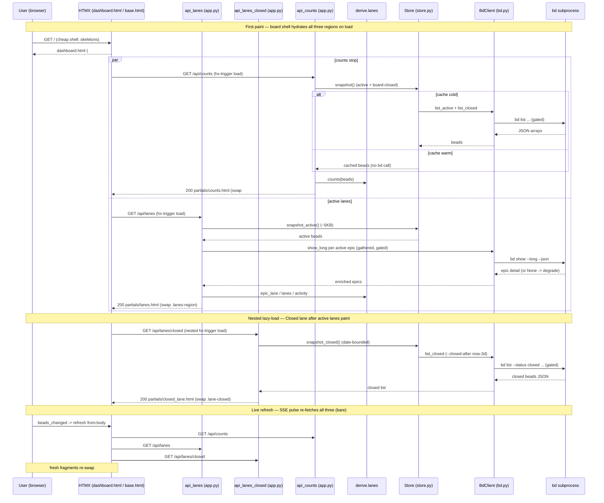

# GET /api/lanes · GET /api/lanes/closed · GET /api/counts

The three **board hydration endpoints** behind the `/` dashboard. The board
route itself renders only a cheap shell (skeletons); these read-only HTMX targets
fill it in:

- **`GET /api/lanes`** — the active swim lanes. Fetches the **active-only**
  snapshot (~5KB), derives the horizontal **Epics** strip, the **Deferred /
  Blocked / Ready / In Progress** lanes, and the **Activity** feed, and renders
  `partials/lanes.html` into `.lanes-region`. The Closed lane is a lazy-loading
  placeholder inside that fragment.
- **`GET /api/lanes/closed`** — the **Closed** lane only. The heaviest part of
  the board (~495KB on large workspaces), so it loads *after* the active lanes
  paint. Renders `partials/closed_lane.html` into the `.lane-closed` placeholder.
- **`GET /api/counts`** — the masthead **counts** strip (Open / Blocked /
  Deferred / Closed KPIs). Renders `partials/counts.html` into `#counts`.

All three are **pure derivation over a snapshot** (the Store handles freshness):
no mutation, no request body, no CSRF token, and — on the cache-warm path — no
new `bd` subprocess. `/api/lanes` is the one exception that does *extra* work: it
hydrates per-epic dependency edges via `bd show --long` so the epic strip can be
sequenced predecessor→successor.

Like every bdboard route they return **HTML fragments**
(`response_class=HTMLResponse`), never JSON. Each is wired with
`hx-trigger="load, refresh from:body"`, so they hydrate once on first paint and
re-fetch on every SSE `beads_changed → refresh from:body` pulse, keeping the
board live as the workspace changes underneath it.

## Overview

| Method | Path | Auth | Purpose |
| --- | --- | --- | --- |
| GET | `/api/lanes` | None (localhost single-user tool); read-only, no body, no CSRF token | Render the active swim lanes: hydrate epic dependencies, derive the Epics strip + Deferred/Blocked/Ready/In Progress lanes + Activity feed from the active-only snapshot, and return `partials/lanes.html` (with the lazy Closed-lane placeholder inside). |
| GET | `/api/lanes/closed` | None (localhost single-user tool); read-only, no body, no CSRF token | Render only the Closed lane from the date-bounded closed snapshot (`BOARD_CLOSED_WINDOW_DAYS=3`). Loaded after the active lanes paint for ~100x faster TTFP. Returns `partials/closed_lane.html`. |
| GET | `/api/counts` | None (localhost single-user tool); read-only, no body, no CSRF token | Render the masthead counts strip — Open/Blocked/Deferred/Closed KPIs (intentionally *not* In Progress) — over the full `active + board-closed` snapshot. Returns `partials/counts.html`. |

> [!NOTE]
> All three are **read-only** routes — no `bd` mutation, no request body, and
> therefore **no CSRF token** (unlike the sibling write routes such as
> [Memory API](MemoryApi.md) and [Bead field-edit API](BeadFieldEditApi.md)).
> Being localhost single-user, they carry no login or per-user authorization.

> [!IMPORTANT]
> The board is split into **two closed data paths on purpose**. `/api/lanes`
> fetches active-only (`bd list --no-pager --limit 0`, no `--all`) so the
> Closed bucket it derives is *empty* — the Closed lane is hydrated separately
> by `/api/lanes/closed` from a **date-bounded** snapshot
> (`--closed-after now-3d`). The header CLOSED KPI from `/api/counts` counts the
> *same* date-bounded board set, so the two numbers always agree (bdboard-p8v).
> Older closed work lives on the [History page](../Views/HistoryPage.md), which
> has its own unbounded data path.

## Request

None of the three routes take **any** input — no path params, no query params,
no required headers, and no body. The board's 12h/1d/3d recency filter is applied
**client-side** (`applyBoardFilter` in `base.html`), not via a query param, so a
narrower window never triggers a re-fetch. The dashboard fires each `hx-get` on
`load` and again on every `refresh from:body` (the SSE pulse); the requests are
always parameter-free and the same response is correct for a plain browser GET.

### Path/Query Params

| Name | In | Type | Required | Notes |
| --- | --- | --- | --- | --- |
| _(none on `/api/lanes`)_ | — | — | — | Takes no params. Always renders the Epics strip + Deferred/Blocked/Ready/In Progress lanes + Activity from the active-only snapshot. |
| _(none on `/api/lanes/closed`)_ | — | — | — | Takes no params. Always renders the Closed lane from the date-bounded closed snapshot; the 12h/1d/3d window is narrowed client-side, not server-side. |
| _(none on `/api/counts`)_ | — | — | — | Takes no params. Always renders the fixed Open/Blocked/Deferred/Closed cells (plus any non-standard status with a non-zero count) over `active + board-closed`. |

### Headers

| Header | Required | Notes |
| --- | --- | --- |
| _(none required)_ | No | Read-only GETs — no `X-CSRF-Token`, no `Content-Type` (no body). HTMX adds its usual `HX-Request: true` / `HX-Trigger` / `HX-Target` headers, but all three handlers ignore them; the same fragment is correct for a bare browser GET. |

### Body

None. All three are `GET` requests with no body — and, unlike the mutating
sibling routes (`POST /api/memory`, `POST /api/bead/{id}/field`), they carry no
form payload at all.

```json
// No request body — bare parameter-free GETs:
//   GET /api/lanes
//   GET /api/lanes/closed
//   GET /api/counts
```

### Validation Rules

There is nothing to validate — no params, no body. The only "degrade-don't-error"
behavior lives downstream in the Store: a `bd` read failure leaves the relevant
cache empty/stale rather than raising, so the worst case is an empty lane, not a
4xx (see Errors).

| Field | Rule | Behavior on violation |
| --- | --- | --- |
| _(no request fields)_ | N/A — none of the three routes accept path/query/body input | Nothing to reject. A `bd list` failure degrades to an empty/stale fragment in `Store`, never a validation error. |

### Rate Limit

| Limit | Window | Scope |
| --- | --- | --- |
| None explicit. On a cache-warm snapshot `/api/lanes/closed` and `/api/counts` make **zero** bd calls (pure derive over the cached snapshot). `/api/lanes` additionally fires one `bd show --long` per active **epic** (`_hydrate_epic_dependencies`, run concurrently via `asyncio.gather`) for dependency sequencing. Every bd subprocess is **serialized** by `BdClient._subprocess_gate` (`asyncio.Semaphore(1)`) and bounded by its own timeout (`LIST_TIMEOUT_S=15.0`, `SHOW_TIMEOUT_S` for the epic-hydration calls). | per-process | All bd reads/writes across all tabs share the single-writer gate, so concurrent board loads queue behind any in-flight bd subprocess rather than racing dolt. The Store caches mean a refresh only re-queries bd when the watcher reports a real `.beads/` change. |

## Response

Each route returns a single **HTML fragment** (`text/html`,
`response_class=HTMLResponse`), never JSON, for an `innerHTML` swap into its
target host.

### Success

**`GET /api/lanes` → `200 OK`** — `partials/lanes.html` (swaps into
`.lanes-region`). Template context from `api_lanes` (real keys):

```json
{
  "epic_lane": [
    {
      "id": "bdboard-mol-bfs",
      "title": "FlowDoc maintainer: discover & scaffold...",
      "priority": 1,
      "status": "in_progress",
      "issue_type": "epic",
      "assignee": "Aaron Weegens",
      "dependencies": [ { "type": "blocks", "depends_on_id": "bdboard-..." } ],
      "status_key": "in_progress",
      "status_icon": "▶",
      "status_label": "In Progress"
    }
  ],
  "lanes": {
    "deferred": [],
    "ready": [ { "id": "bdboard-...", "title": "...", "priority": 2, "status": "open", "updated_at": "..." } ],
    "in_progress": [ { "id": "bdboard-mol-bfs.12", "title": "...", "status": "in_progress" } ],
    "blocked": [],
    "closed": []
  },
  "activity": [
    { "id": "bdboard-...", "title": "...", "actor": "Aaron Weegens", "verb": "closed", "ts": "2026-06-04T03:47:00Z", "ts_epoch": 1780000020.0, "priority": 2 }
  ]
}
```

Rendered, this is the `.epic-lane` strip (each chip carries
`status_key`/`status_icon`/`status_label`), the `div.lanes` columns for the four
active lanes, the lazy-loading `div.lane-closed[data-lane=closed]` placeholder
(its own `hx-get="/api/lanes/closed"` on `load, refresh from:body` plus three
skeleton cards), and the `div.lane-activity` feed.

> [!NOTE]
> The `lanes.closed` bucket is **always empty** in this response. `/api/lanes`
> fetches active-only, so `derive.lanes` has no closed beads to bucket; the
> Closed lane is filled by the nested `/api/lanes/closed` fetch instead. The
> `closed` key still exists in the dict because `derive.lanes` always returns
> all of `LANES = ("deferred", "ready", "in_progress", "blocked", "closed")`.

> [!WARNING]
> Because active-only excludes closed beads, a bead whose only blocker is a
> *closed* bead will conservatively render as **blocked** on first paint
> (`_has_unmet_blocking_dep` treats an unknown target as unmet). It self-corrects
> on the first full-snapshot SSE refresh. This is the deliberate tradeoff for the
> ~100x payload reduction (bdboard-0yy).

**`GET /api/lanes/closed` → `200 OK`** — `partials/closed_lane.html` (swaps into
`.lane-closed`). Template context from `api_lanes_closed`:

```json
{
  "closed": [
    { "id": "bdboard-mol-bfs.13", "title": "FlowDoc maintainer: Endpoint: History API", "status": "closed", "priority": 2, "closed_at": "2026-06-04T03:47:00Z", "updated_at": "..." }
  ]
}
```

Rendered, this replaces the lane chrome with the real Closed `lane-title` (count
via `data-closed-count="total"`) and the `lane-list` of `bead_card.html` cards
(rendered with `show_closed_at_attr = true` so the recency filter can read each
card's `data-closed-at`), sorted `closed_at` desc — most recent wins first.

**`GET /api/counts` → `200 OK`** — `partials/counts.html` (swaps into `#counts`).
Template context from `api_counts`:

```json
{
  "counts": { "open": 12, "blocked": 0, "deferred": 3, "closed": 18 }
}
```

Rendered, this is the `<dl class="counts">` masthead strip — one
`div.counts-cell[data-count-status="<status>"]` per status (the
`data-count-status` hook keeps the CLOSED cell in lockstep with the client-side
filtered Closed lane via `applyBoardFilter`). Zero-value cells get
`counts-cell-zero` rather than being dropped, so the header geometry never jumps.

> [!NOTE]
> `counts` is a **fixed-order** dict — `["open", "blocked", "deferred",
> "closed"]` — to stop header jitter when a count hits zero. `in_progress` is
> intentionally **omitted**: bdboard is a single-flight workflow tool (one bead
> in progress at a time), so a 0/1 cell would be noise — the In Progress swim
> lane already surfaces the active bead. Any *non-standard* status with a
> non-zero count is appended after the fixed four.

### Errors

All three are failure-tolerant by construction: a bd outage degrades to an empty
or stale fragment (handled in `Store`) rather than a 5xx. None of them parse
input, so there are no `422` param-coercion errors either.

| Status | Code | When |
| --- | --- | --- |
| 200 (degraded — empty) | Empty lanes / empty Closed lane / zeroed counts on a **cold** cache | The relevant `Store` load (`_load_active` / `_load_closed` / `refresh`) caught a `bd list` failure (logs e.g. `store: bd list_active failed; active cache stays empty`) and the cache is still empty → the derive functions shape an empty list/dict and the templates render their `(empty)` / `no activity yet` / zero states. |
| 200 (degraded — stale) | Previous lanes/closed/counts served unchanged after a **warm** cache hiccup | `Store.refresh` caught a `bd list` failure and *preserved* the existing snapshot (logs `store: bd list failed; keeping previous snapshot`) → the route re-renders the last-known-good data rather than flashing empty. |
| 200 (partial) | Epic strip rendered without dependency sequencing | `_hydrate_epic_dependencies` got a `None` from `bd show --long` for an epic (the `_err` is swallowed); that epic keeps its un-enriched fields and `derive.epic_lane` falls back to stable created-at ordering for it. The strip still renders. |
| 500 | FastAPI default `Internal Server Error` | Only on an unexpected exception escaping a handler (e.g. a bug in a derive function on malformed snapshot data). The normal bd-failure paths are caught upstream in `Store`/`_hydrate_epic_dependencies` and never reach here. |

> [!CAUTION]
> Because bd-read failures degrade to **empty** fragments (not errors), a
> transient `bd list` timeout on a cold load can momentarily blank a lane or
> zero the counts. The next successful SSE `refresh from:body` repaints them.
> Don't mistake a degraded blank for "no beads" — check the logs for
> `store: bd list_active failed` / `store: bd list failed; keeping previous`.

## Implementation Map

| Responsibility | File path | Symbol |
| --- | --- | --- |
| Active-lanes handler (hydrate epics, derive strip/lanes/activity, render) | `src/bdboard/app.py` | `api_lanes` |
| Closed-lane handler (fetch date-bounded closed snapshot, render) | `src/bdboard/app.py` | `api_lanes_closed` |
| Counts handler (derive masthead KPIs over full snapshot, render) | `src/bdboard/app.py` | `api_counts` |
| Per-epic dependency hydration via `bd show --long` (concurrent `asyncio.gather`) | `src/bdboard/app.py` | `_hydrate_epic_dependencies` |
| Full-page board shell that lazy-loads these regions via HTMX `load` + SSE `refresh` | `src/bdboard/app.py` | `index` |
| Epic-strip ordering (topo-sequenced wired chains, then unwired; status enrichment) | `src/bdboard/derive/lanes.py` | `epic_lane` / `_topo_component_order` / `_epic_lane_rank` |
| Lane bucketing (deferred/ready/in_progress/blocked/closed; priority-then-recency sort) | `src/bdboard/derive/lanes.py` | `lanes` / `LANES` / `CLOSED_STATUSES` |
| Functional-blocked detection (open + unmet blocking dep → blocked) | `src/bdboard/derive/lanes.py` | `_has_unmet_blocking_dep` |
| Dependency field-name normalization (`deps`/`dependencies`, `type`/`dependency_type`, target id) | `src/bdboard/derive/lanes.py` | `get_dependency_list` / `get_dependency_type` / `get_dependency_target_id` |
| Epic / molecule-wrapper exclusion from the main lanes | `src/bdboard/derive/lanes.py` | `_is_epic` / `_is_molecule` |
| Activity feed synthesis (state-as-event from updated/closed/created timestamps) | `src/bdboard/derive/lanes.py` | `activity` |
| Masthead counts (fixed-order, zero-stable; `in_progress` omitted) | `src/bdboard/derive/lanes.py` | `counts` |
| Board closed-window constant (3 days) shared by fetch + comment-of-record | `src/bdboard/derive/lanes.py` | `BOARD_CLOSED_WINDOW_DAYS` |
| Active-only snapshot (fast first paint, ~5KB; lazy-loaded, cached) | `src/bdboard/store.py` | `Store.snapshot_active` / `Store._load_active` |
| Board-closed snapshot (date-bounded; lazy-loaded, cached) | `src/bdboard/store.py` | `Store.snapshot_closed` / `Store._load_closed` |
| Full snapshot (active + board-closed) for the counts derive | `src/bdboard/store.py` | `Store.snapshot` / `Store.refresh` |
| Active fetch (`bd list --no-pager --limit 0`, no `--all`) | `src/bdboard/bd.py` | `BdClient.list_active` / `LIST_TIMEOUT_S` |
| Board-closed fetch (`bd list --status closed --closed-after now-3d --sort closed --no-pager --limit 0`) | `src/bdboard/bd.py` | `BdClient.list_closed` |
| Per-epic detail fetch used by hydration | `src/bdboard/bd.py` | `BdClient.show_long` |
| Single-writer serialization for every bd subprocess (dolt is single-writer) | `src/bdboard/bd.py` | `BdClient._subprocess_gate` |
| Active-lanes template (epic strip, 4 active lanes, lazy Closed placeholder, Activity) | `src/bdboard/templates/partials/lanes.html` | `.epic-lane` / `.lanes` / `.lane-closed` / `.lane-activity` |
| Closed-lane template (title + card list, `data-closed-count`, `show_closed_at_attr`) | `src/bdboard/templates/partials/closed_lane.html` | `.lane-closed` body |
| Counts template (`<dl>` cells with `data-count-status`, zero-stable) | `src/bdboard/templates/partials/counts.html` | `dl.counts` / `.counts-cell` |
| Board shell hosts + `load`/`refresh from:body` triggers + skeletons | `src/bdboard/templates/dashboard.html` | `.lanes-region` / `#counts` |
| Shared clickable card (opens the bead modal; honors `show_closed_at_attr`) | `src/bdboard/templates/partials/bead_card.html` | `bead_card` |
| Client-side 12h/1d/3d recency filter (keeps CLOSED KPI == filtered lane) | `src/bdboard/templates/base.html` | `applyBoardFilter` |
| Regression tests | `tests/test_derive_epics.py`, `tests/test_deferred_fallback.py`, `tests/test_board_counts_filter_sync.py`, `tests/test_snappy_transitions.py` | epic exclusion / lane bucketing / counts↔lane sync / lazy-hydration coverage |



## Example

Active lanes — the Epics strip + Deferred/Blocked/Ready/In Progress lanes +
Activity (what the board fires on `load` and every SSE refresh):

```bash
curl -i 'http://127.0.0.1:8765/api/lanes'
```

Closed lane only — the date-bounded (`now-3d`) closed snapshot, loaded after the
active lanes paint:

```bash
curl -i 'http://127.0.0.1:8765/api/lanes/closed'
```

Masthead counts — Open/Blocked/Deferred/Closed KPIs over the full
`active + board-closed` snapshot:

```bash
curl -i 'http://127.0.0.1:8765/api/counts'
```

All three return `200` with an HTML fragment (no JSON) for an `innerHTML` swap
into `.lanes-region`, `.lane-closed`, and `#counts` respectively. None accept
query params (the 12h/1d/3d window is applied client-side), and a bd outage
degrades to an empty/stale fragment rather than an error status.

## Related

- [Swim-lane board (Feature)](../Features/SwimLaneBoard.md) — the behavior-first
  feature overview these three endpoints power: the Epics strip, the
  Deferred/Blocked/Ready/In Progress/Closed lanes, and the masthead counts.
- [Board page (`/`)](../Views/BoardPage.md) — the full-page view these three
  endpoints hydrate. Its `.lanes-region`, `#counts`, and nested `.lane-closed`
  hosts fire the `load` + `refresh from:body` fetches documented here, and its
  client-side 12h/1d/3d recency filter narrows the rendered lanes/KPI in the
  browser (`applyBoardFilter`) without re-hitting these routes.
- [History page (`/history`)](../Views/HistoryPage.md) — the long-window
  retrospective surface that holds closed work *older* than this board's
  3-day `BOARD_CLOSED_WINDOW_DAYS` window; the board and History split the
  closed record between them deliberately (bdboard-p8v / bdboard-a194).
- [History API (`/api/history`)](HistoryApi.md) — the symmetric read-only swap
  target modelled on `/api/lanes` (pure derive over a snapshot, HTML fragment,
  no mutation); its closed list uses the uncapped, `--closed-after`-bounded
  `list_closed_history` path rather than this board's date-capped `list_closed`.
- [SSE events (`/api/events`)](SseEvents.md) — the live-refresh stream whose
  `beads_changed` event fires `refresh from:body`, re-fetching all three of
  these regions so the board updates as the workspace changes.
- [Bead detail API (`/api/bead/{id}`, …)](BeadDetailApi.md) — the modal opened
  when an epic chip, a lane card (`bead_card.html`), or an Activity row is
  clicked.
- [Formulas API (`/api/formulas`, form, pour)](FormulasApi.md) — the only
  mutating action reachable from the board view (the **+ Pour Formula** dialog);
  a successful pour lands new beads that arrive live through the same
  watcher→`Store.refresh`→SSE pipeline that re-fetches these lanes.
- [bd CLI as runtime source of truth](../Concepts/BdCliSourceOfTruth.md) — why
  these routes bottom out in `bd list`/`bd show` subprocesses serialized by
  `_subprocess_gate` rather than touching the dolt store directly.
- [Store snapshot cache & change detection](../Concepts/StoreSnapshotCache.md) —
  the three-way active / board-closed / history cache split, the lazy-load + the
  watcher-driven `refresh` change detection these routes rely on.
- [Derive layer (pure view shaping)](../Concepts/DeriveLayer.md) — the pure
  `derive.lanes` functions (`epic_lane`, `lanes`, `activity`, `counts`) that
  shape these responses with zero I/O.
- [HTMX + server-rendered partials](../Concepts/HtmxPartialsArchitecture.md) —
  the `hx-get` + `innerHTML` swap idiom and the lazy nested-load pattern
  (`/api/lanes` → nested `/api/lanes/closed`) these endpoints embody.
- [Watcher debounce/cooldown & self-feedback skip](../Concepts/WatcherScheduling.md)
  — how the `refresh from:body` pulse that re-fetches these regions is debounced
  and prevented from looping on bdboard's own reads.
- [Endpoints index](index.md) · [Architecture](../Architecture.md#api-surface) ·
  [Manifest](../_Manifest.md) — the API surface and doc catalog this item sits in.
