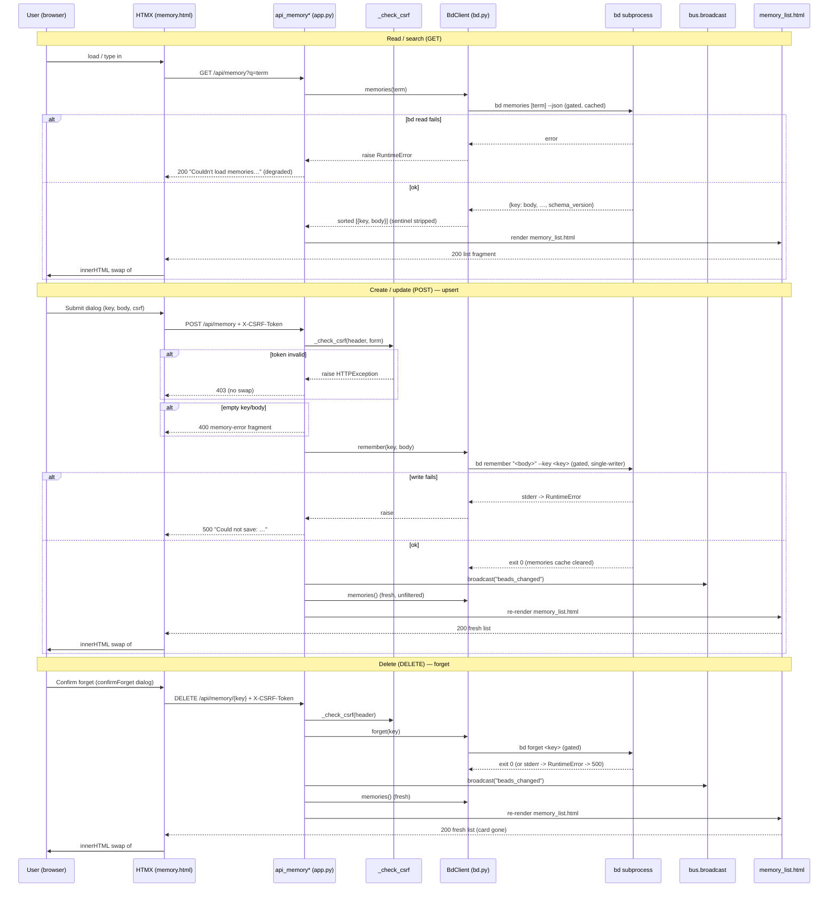

# GET /api/memory · POST /api/memory · DELETE /api/memory/{key:path}

The **memory CRUD trio** behind the `/memory` page. Three sibling routes that
list/search, create-or-update, and delete bd memories — the persistent notes bd
injects at `bd prime`. `GET /api/memory` is a read-only HTMX swap target that
renders the searchable memory list; `POST /api/memory` is an **upsert** (create
a new key or replace an existing key's body) via `bd remember`; and
`DELETE /api/memory/{key:path}` forgets a memory via `bd forget`. Both mutating
routes are hedged with a CSRF guard, degrade a bd outage to a friendly inline
message rather than 500-ing the swap, and **re-render the full list** after the
write so the acting tab sees its change instantly (an SSE `beads_changed`
broadcast fans the update out to other tabs).

All three return **HTML fragments** (`response_class=HTMLResponse`), never JSON:
the read and both writes share the same `partials/memory_list.html` render, so a
successful create/delete simply swaps the freshly-listed region into place — the
exact same markup the search box produces.

## Overview

| Method | Path | Auth | Purpose |
| --- | --- | --- | --- |
| GET | `/api/memory` | None (localhost single-user) | Render the memory list region (HTMX swap target); server-side search via `bd memories [q] --json` — empty `q` lists all. Returns `partials/memory_list.html`. |
| POST | `/api/memory` | None; mutating POST guarded by per-process CSRF token | Upsert a memory via `bd remember "<body>" --key <key>` (create new key, or replace existing key's body). Broadcasts SSE, returns the freshly re-rendered list. |
| DELETE | `/api/memory/{key:path}` | None; mutating DELETE guarded by per-process CSRF token | Forget a memory via `bd forget <key>`. `:path` so keys containing `/` survive. Broadcasts SSE, returns the freshly re-rendered list. |

> [!NOTE]
> Like every bdboard mutation, these are **localhost, single-user** routes with
> no login. The only write-side protection is the per-process CSRF token (see
> [`_check_csrf`](#implementation-map)); there is no cookie/session and no
> per-user authorization. `GET /api/memory` is unguarded (read-only).

> [!CAUTION]
> `DELETE` is **irreversible** and destructive across sessions: memories are
> injected at `bd prime`, so forgetting one silently degrades every future
> agent session that relied on it. The UI deliberately gates the call behind a
> confirm-before-forget `<dialog>` (`confirmForget()` in `memory.html`) — the
> endpoint itself does no confirmation, it forgets on the first authorized call.

## Request

`GET /api/memory` takes an optional `q` query param (the search term). The two
mutating routes use different transports:

- **`POST /api/memory`** — `Content-Type: application/x-www-form-urlencoded`;
  the create/edit `<dialog>` form posts `key`, `body`, and `csrf_token` (the
  handler binds them via `Form(...)`). The CSRF token also rides the
  `X-CSRF-Token` header (HTMX `hx-headers`).
- **`DELETE /api/memory/{key:path}`** — the key is in the path (URL-encoded by
  the client via `encodeURIComponent`); the CSRF token rides the `X-CSRF-Token`
  header only (no form body on a DELETE).

### Path/Query Params

| Name | In | Type | Required | Notes |
| --- | --- | --- | --- | --- |
| `q` | query (GET) | string | No (defaults `""`) | Search term. `.strip()`ped, then passed to `bd memories <term> --json` for bd's own server-side case-insensitive substring match across key+body. Empty/omitted lists all memories. Sent by the debounced `#memory-q` search input's `hx-get`. |
| `key` | path (DELETE) | string | Yes | The memory key to forget. Route param is `{key:path}` so keys containing `/` survive routing; client URL-encodes via `encodeURIComponent`. `.strip()`ped server-side; empty → `400`. |

### Headers

| Header | Required | Notes |
| --- | --- | --- |
| `X-CSRF-Token` | POST: Yes¹ · DELETE: Yes · GET: No | The per-process CSRF token. HTMX sends it via `hx-headers='{"X-CSRF-Token": "{{ csrf_token }}"}'` on both the create/edit form and the forget-confirm button. Must equal the server's `_CSRF_TOKEN`. |
| `Content-Type` | POST: Yes | `application/x-www-form-urlencoded` (the dialog form post). Not used by GET/DELETE. |

¹ For `POST`, the CSRF token may instead ride in the `csrf_token` **form field**
(fallback for non-JS posts). At least one of header/form must match or the
request is rejected `403` before any bd work happens. `DELETE` has no form body,
so it relies on the `X-CSRF-Token` header exclusively.

### Body

`GET` and `DELETE` have no body. `POST /api/memory` is form-encoded (not JSON);
field names are exactly what the handler binds via `Form(...)`:

```json
{
  "key": "dev-workflow",
  "body": "Run `uv run pytest` before every commit. Markdown is supported.",
  "csrf_token": "<per-process-token, optional if X-CSRF-Token header sent>"
}
```

| Form field | Required | Meaning |
| --- | --- | --- |
| `key` | Yes (`Form(...)`) | The memory key (short slug, e.g. `dev-workflow`). `.strip()`ped; empty → `400`. On edit the dialog makes this field `readonly` (you cannot rename a key via `bd remember`; upsert keys on identity). |
| `body` | Yes (`Form(...)`) | The memory content (markdown supported; rendered through the shared `md` Jinja filter on read). `.strip()`ped; empty → `400`. |
| `csrf_token` | No (if `X-CSRF-Token` header sent) | CSRF fallback form field; bound as `csrf: str = Form(None, alias="csrf_token")`. |

### Validation Rules

| Field | Rule | Error |
| --- | --- | --- |
| `X-CSRF-Token` / `csrf_token` (POST) | One must equal `_CSRF_TOKEN` | `403` (HTTPException) — `"Invalid or missing CSRF token. Please refresh the page and try again."` |
| `X-CSRF-Token` (DELETE) | Header must equal `_CSRF_TOKEN` (no form fallback) | `403` (HTTPException) — same detail string |
| `key` (POST) | `key.strip()` must be non-empty | `400` — `<p class="memory-error" role="alert">Key cannot be empty.</p>` |
| `body` (POST) | `body.strip()` must be non-empty | `400` — `<p class="memory-error" role="alert">Body cannot be empty.</p>` |
| `key` (DELETE) | `key.strip()` must be non-empty | `400` — `<p class="memory-error" role="alert">Key cannot be empty.</p>` |

### Rate Limit

| Limit | Window | Scope |
| --- | --- | --- |
| None explicit; writes are **serialized** by `BdClient._subprocess_gate` (single-writer asyncio gate shared by every bd subprocess) | per-process | All bd reads and mutations across all tabs/clients share the one gate — concurrent POST/DELETE/GET calls queue rather than run in parallel, so two tabs can't race a dolt write. |

## Response

All responses are **HTML fragments** (`response_class=HTMLResponse`), never
JSON. The happy path for all three routes is `partials/memory_list.html` — the
read renders it directly; create/delete re-render it from a fresh `bd.memories()`
read so the HTMX swap shows post-mutation state immediately (optimistic refresh).

### Success

**`GET /api/memory` → `200 OK`** — the memory list region. Conceptually:

```json
{
  "status": 200,
  "content_type": "text/html",
  "body": "<p class=\"memory-count\" role=\"status\" aria-live=\"polite\">2 memories</p><ul class=\"memory-list\" role=\"list\"><li class=\"memory-card\">…cards rendered from sorted {key, body} dicts; body via the `md` filter…</li></ul>"
}
```

The template receives `{"memories": [{"key": ..., "body": ...}, …], "query": "<term>"}`.
Empty results render a context-aware empty state: `No memories matching "<q>".`
when searching, or the `No memories yet — click + New Memory…` prompt otherwise.

**`POST /api/memory` → `200 OK`** — the **same** `partials/memory_list.html`,
re-rendered from a fresh unfiltered `bd.memories()` read (`query` reset to `""`)
so the new/updated card is visible in the swap target `#memory-list`.

**`DELETE /api/memory/{key:path}` → `200 OK`** — identical posture: the freshly
re-rendered full list (the forgotten card now absent).

> [!IMPORTANT]
> A bd **read** failure on `GET /api/memory` does **not** 500 — the handler
> catches `RuntimeError` and returns a `200` friendly fragment
> (`Couldn't load memories right now. Please try again in a moment.`) so a
> transient `bd memories` hiccup never blanks the page or breaks the HTMX swap.
> bd **write** failures DO surface as `500` fragments (see Errors).

### Errors

| Status | Code (response body / detail) | When |
| --- | --- | --- |
| 403 | `HTTPException` JSON detail: `"Invalid or missing CSRF token. Please refresh the page and try again."` | POST/DELETE with missing/mismatched CSRF token (raised by `_check_csrf` before any bd call). |
| 400 | `<p class="memory-error" role="alert">Key cannot be empty.</p>` | POST/DELETE with a blank key. |
| 400 | `<p class="memory-error" role="alert">Body cannot be empty.</p>` | POST with a blank body. |
| 200 | `<p class="memory-empty muted" role="status" aria-live="polite">Couldn't load memories right now. Please try again in a moment.</p>` | GET when `bd memories` raises `RuntimeError` (timeout/non-zero exit/bad JSON) — degraded, NOT an error status. |
| 500 | `<p class="memory-error" role="alert">Could not save: <bd stderr></p>` | POST when `bd.remember` raises `RuntimeError` (e.g. `bd remember` subprocess failure/timeout). |
| 500 | `<p class="memory-error" role="alert">Could not delete: <bd stderr></p>` | DELETE when `bd.forget` raises `RuntimeError` (includes key-not-found — `bd forget` exits non-zero with descriptive stderr). |

## Implementation Map

| Responsibility | File path | Symbol |
| --- | --- | --- |
| List/search route handler (read; failure-tolerant) | `src/bdboard/app.py` | `api_memory` |
| Create/update route handler (upsert; CSRF + validate + broadcast + re-list) | `src/bdboard/app.py` | `api_memory_create` |
| Delete route handler (forget; CSRF + validate + broadcast + re-list) | `src/bdboard/app.py` | `api_memory_delete` |
| CSRF guard (header-or-form token check) | `src/bdboard/app.py` | `_check_csrf` / `_CSRF_TOKEN` |
| Search/list bd read (`bd memories [term] --json`, strips `schema_version`, sorts by key) | `src/bdboard/bd.py` | `BdClient.memories` / `SCHEMA_VERSION_KEY` / `MEMORIES_TIMEOUT_S` |
| TTL-cache + in-flight dedup + timeout wrapper for the read | `src/bdboard/bd.py` | `BdClient._cached` / `BdClient._run_json` |
| Upsert mutation (`bd remember "<body>" --key <key>`, then clear memories cache) | `src/bdboard/bd.py` | `BdClient.remember` / `REMEMBER_TIMEOUT_S` |
| Delete mutation (`bd forget <key>`, then clear memories cache) | `src/bdboard/bd.py` | `BdClient.forget` / `FORGET_TIMEOUT_S` |
| Serialized single-writer subprocess runner (drains pipes on every exit path) | `src/bdboard/bd.py` | `BdClient._run_mutate` / `_subprocess_gate` |
| Post-watcher cache invalidation (drops memories cache so reads see fresh state) | `src/bdboard/bd.py` | `BdClient.invalidate_caches` |
| SSE fan-out so other tabs re-render | `src/bdboard/app.py` | `bus.broadcast("beads_changed")` |
| List render (shared by read + both writes; cards, count, empty states) | `src/bdboard/templates/partials/memory_list.html` | `memory-list` / `memory-card` / `memory-count` |
| Search input, create/edit `<dialog>`, forget-confirm `<dialog>` + JS wiring | `src/bdboard/templates/memory.html` | `#memory-q` / `#memory-form-dialog` / `confirmForget` / `editMemory` |
| Regression tests | `tests/test_api_memory.py`, `tests/test_memory_mutations.py` | GET list/search/degrade; POST/DELETE CSRF, empty-key/body, upsert, forget, error cases |



## Example

List all memories (what the page fires on load), then search:

```bash
# Full list — empty q lists everything
curl -i 'http://127.0.0.1:8765/api/memory'

# Server-side search (bd's own case-insensitive substring match over key+body)
curl -i 'http://127.0.0.1:8765/api/memory?q=workflow'
```

Both return `200` with the `partials/memory_list.html` fragment for an
`innerHTML` swap into `#memory-list`.

Create or update a memory (upsert — same call creates a new key or replaces an
existing key's body). The CSRF token is the per-process value the page was
rendered with (read it from the hidden `csrf_token` input / `hx-headers`):

```bash
curl -i -X POST 'http://127.0.0.1:8765/api/memory' \
  -H 'X-CSRF-Token: 7r2c9q…(the per-process token)…Xy' \
  -H 'Content-Type: application/x-www-form-urlencoded' \
  --data-urlencode 'key=dev-workflow' \
  --data-urlencode 'body=Run `uv run pytest` before every commit.'
```

Success returns `200` with the re-rendered list. Omitting/mismatching the token
yields `403`; an empty `key` or `body` yields `400`.

Forget a memory (the UI gates this behind a confirm dialog). The key is
URL-encoded into the path; the CSRF token rides the header:

```bash
curl -i -X DELETE 'http://127.0.0.1:8765/api/memory/dev-workflow' \
  -H 'X-CSRF-Token: 7r2c9q…Xy'
```

Success returns `200` with the freshly re-rendered list (the card now absent);
a non-existent key yields `500 Could not delete: <bd stderr>`.

## Related

- [Memory page (`/memory`)](../Views/MemoryPage.md) — the full-page view whose
  search box, create/edit dialog, and forget-confirm dialog drive every call to
  these routes; the page shell renders, then hydrates `#memory-list` from
  `GET /api/memory`.
- [Bead field-edit API (`POST /api/bead/{id}/field`)](BeadFieldEditApi.md) — a
  **sibling write route**; shares the identical `_check_csrf`/`_CSRF_TOKEN`
  guard and the refresh-before-broadcast posture (re-read fresh, then
  `broadcast("beads_changed")`).
- [Formulas API (`/api/formulas`, form, pour)](FormulasApi.md) — another sibling
  write route built on the same CSRF guard, `_run_mutate` single-writer gate,
  and failure-tolerant inline-message degradation.
- [bd CLI as runtime source of truth](../Concepts/BdCliSourceOfTruth.md) — why
  these routes bottom out in `bd memories`/`bd remember`/`bd forget` rather than
  touching the dolt store directly.
- [Store snapshot cache & change detection](../Concepts/StoreSnapshotCache.md) —
  the memories TTL-cache, `_subprocess_gate` serialization, and
  `invalidate_caches` post-watcher cache drop these routes rely on for accurate
  optimistic re-renders.
- [HTMX + server-rendered partials](../Concepts/HtmxPartialsArchitecture.md) —
  the `hx-get`/`hx-post`/`hx-delete` + `innerHTML` swap idiom, `hx-headers` CSRF
  wiring, and shared-partial render pattern these routes embody.
- [Endpoints index](index.md) · [Architecture](../Architecture.md#api-surface) ·
  [Manifest](../_Manifest.md) — the API surface and doc catalog this item sits in.
