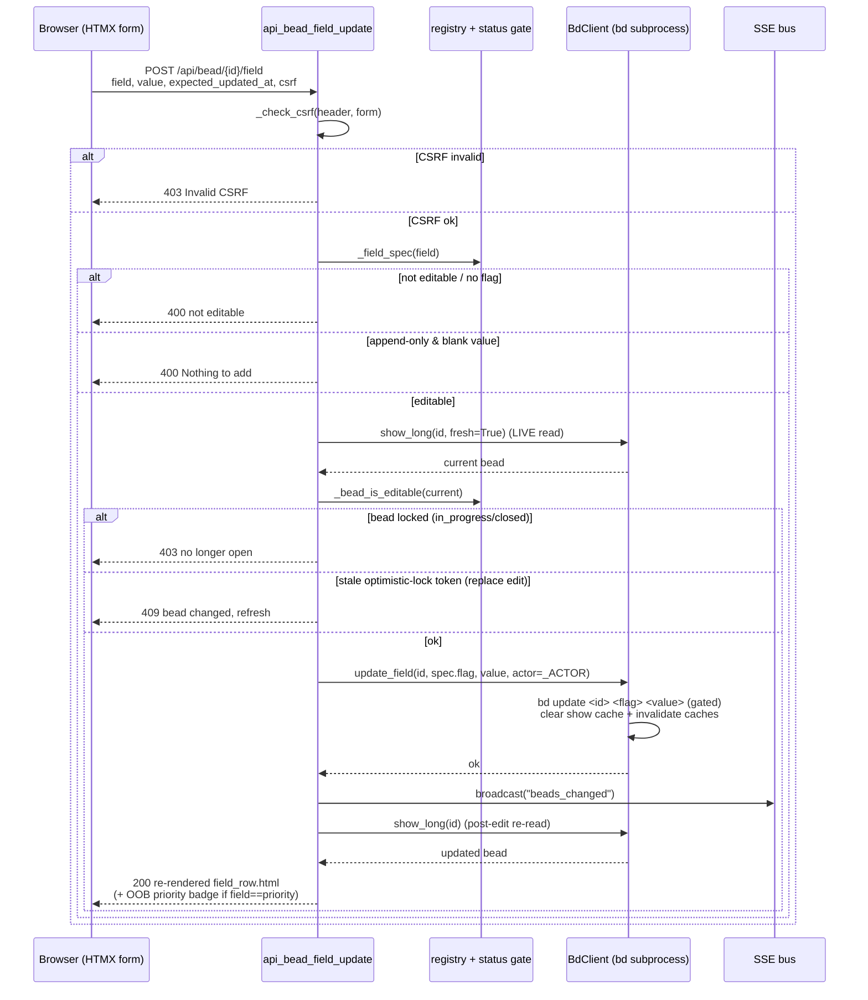

# POST /api/bead/{id}/field

> [!NOTE]
> The route is registered as `POST /api/bead/{bead_id}/field`
> (`@app.post("/api/bead/{bead_id}/field")`). The path parameter is the bead id
> (`bdboard-x1`, `bdboard-mol-q7j.27`, …). This is the **write half** of
> [Manual Field Editing](../Features/index.md): it edits ONE whitelisted bead
> field value via `bd update` and returns the re-rendered field row for an
> in-place HTMX swap. It never writes shape/graph/lifecycle fields.

## Overview

| Method | Path | Auth | Purpose |
| --- | --- | --- | --- |
| POST | `/api/bead/{bead_id}/field` | CSRF token (header `X-CSRF-Token` **or** form `csrf_token`); no cookies/session | Edit one whitelisted bead field value via `bd update`, then return the re-rendered `field_row.html` partial for an in-place HTMX swap of `#field-row-<field>` |

## Request

`Content-Type: application/x-www-form-urlencoded` — the handler binds form fields
via FastAPI `Form(...)`. HTMX submits the `<form>` in `partials/field_row.html`
(the shared `field_form` macro), so the wire contract is single-sourced.

### Path/Query Params

| Name | In | Type | Required | Notes |
| --- | --- | --- | --- | --- |
| `bead_id` | path | string | yes | The bead whose field is edited (e.g. `bdboard-x1`). Passed straight to `bd update <bead_id>`; bd validates existence and surfaces an error if unknown. |

### Headers

| Header | Required | Notes |
| --- | --- | --- |
| `X-CSRF-Token` | conditional | Process-lifetime CSRF token. HTMX sends it via `hx-headers='{"X-CSRF-Token": "…"}'`. Either this header **or** the `csrf_token` form field must match `_CSRF_TOKEN` — see [CSRF Protection](../Concepts/CsrfProtection.md). |
| `Content-Type` | yes | `application/x-www-form-urlencoded` (form post). |

### Body

Form-encoded fields (shown here as a JSON object for clarity — the real wire
format is `application/x-www-form-urlencoded`, not JSON):

```json
{
  "field": "priority",
  "value": "2",
  "expected_updated_at": "2026-06-05T12:34:56Z",
  "csrf_token": "<process CSRF token>"
}
```

- **`field`** — the bd field key to edit. Looked up in `_FIELD_REGISTRY` via
  `_field_spec(field)`; must resolve to an `editable` spec with a `flag`.
- **`value`** — the new value. For `md` editors it is kept verbatim; for every
  other editor it is `.strip()`'d. For append-only `notes` it is the text to
  **append** (never a replacement).
- **`expected_updated_at`** — optimistic-lock token: the bead's `updated_at` as
  rendered into the form. Checked only for non-append (replace) edits. Empty/
  absent ⇒ lock skipped (degrades to last-write-wins).
- **`csrf_token`** — fallback CSRF token for non-JS form posts (the header is
  preferred for HTMX).

> [!NOTE]
> The client **cannot choose the `bd update` flag**. The flag is pinned in the
> registry (`spec.flag`) keyed by `field`; the request only names the field.
> A crafted POST naming `status`/`parent`/`id` is bounced because those keys
> are not editable entries — see the
> [Field Editability Registry](../Concepts/FieldEditabilityRegistry.md).

### Validation Rules

| Field | Rule | Error |
| --- | --- | --- |
| `csrf_token` / `X-CSRF-Token` | One must equal the process `_CSRF_TOKEN` | `403` (HTTPException) `Invalid or missing CSRF token. Please refresh the page and try again.` |
| `field` | Must resolve to a `FieldSpec` with `editable=True` and a non-empty `flag` (else `_READONLY_SPEC`) | `400` `Field "<field>" is not editable.` |
| `value` (append-only `notes`) | Must be non-blank after strip — an empty append is a no-op, not a clobber | `400` `Nothing to add.` |
| bead status | Bead must be editable: status NOT in `_LOCKED_EDIT_STATUSES` (`derive.CLOSED_STATUSES ∪ {in_progress}`); checked via a LIVE `show_long(fresh=True)` read | `403` `This bead is <status> and can no longer be edited — only open beads are editable.` |
| `expected_updated_at` (replace edits only) | If present and the live `updated_at` has moved on, reject | `409` `This bead changed since you opened it — please refresh and re-apply your edit…` |

### Rate Limit

| Limit | Window | Scope |
| --- | --- | --- |
| None (no rate limiter) | — | bdboard is a single-user localhost dashboard. There is no token-bucket / IP throttle; the only throttle is structural: all `bd` mutations are serialized on `BdClient._subprocess_gate` (Dolt is single-writer), so concurrent writes queue rather than race. |

## Response

`Content-Type: text/html` (`response_class=HTMLResponse`). The body is an HTML
**fragment**, not JSON — bdboard is server-rendered HTMX, so the route returns
the re-rendered field row that HTMX swaps in place.

### Success

`200 OK` — the re-rendered `partials/field_row.html` for `#field-row-<field>`,
swapped via `hx-swap="outerHTML"`:

```html
<div id="field-row-priority" class="field field-kind-scalar field-short"
     data-field-key="priority" data-editable="1">
  <dt class="field-key">priority</dt>
  <dd class="field-val">2</dd>
  <details class="field-edit" data-field-edit ontoggle="…">
    <summary class="field-edit-summary">
      <span class="field-edit-summary-label">Edit priority</span>
    </summary>
    <form class="field-edit-form" hx-post="/api/bead/bdboard-x1/field"
          hx-target="#field-row-priority" hx-swap="outerHTML"
          hx-headers='{"X-CSRF-Token": "…"}'>
      <input type="hidden" name="csrf_token" value="…" />
      <input type="hidden" name="field" value="priority" />
      <input type="hidden" name="expected_updated_at" value="2026-06-05T12:35:10Z" />
      <!-- select / input / textarea per f.editor … -->
    </form>
  </details>
</div>
```

> [!IMPORTANT]
> When `field == "priority"`, the response **also appends an out-of-band copy**
> of `partials/bead_priority_badge.html` (`oob=True`) so HTMX updates the
> modal-header priority badge in the SAME swap — otherwise the header badge
> would stay stale until the modal is reopened. This mirrors the OOB idiom the
> audit endpoint uses for `#lifecycle-slot`.

Two degraded `200` variants exist when the post-edit re-read can't render a row
(the write already succeeded):

- `<p class="field-saved" role="status">Saved.</p>` — saved, but the field is no
  longer in the rendered set (e.g. cleared to empty and filtered out).
- `<p class="field-error" role="alert">Saved, but could not refresh — reopen the
  bead to see the change.</p>` — saved, but neither the live read nor the cached
  snapshot could re-fetch the bead.

### Errors

| Status | Code | When |
| --- | --- | --- |
| `403` | `Invalid or missing CSRF token.` | `_check_csrf` failed — neither header nor form token matched. Raised as `HTTPException`. |
| `400` | `Field "<field>" is not editable.` | `field` not whitelisted in `_FIELD_REGISTRY`, or whitelisted but missing a `flag` (registry bug). |
| `400` | `Nothing to add.` | Append-only field (`notes`) submitted with blank value. |
| `403` | `This bead is <status> and can no longer be edited…` | Live read shows the bead is `in_progress` or closed (`_bead_is_editable` ⇒ False). |
| `409` | `This bead changed since you opened it…` | Replace edit whose `expected_updated_at` no longer matches the live `updated_at` (optimistic-lock failure). |
| `500` | `Could not save: <bd stderr>` | `bd.update_field` raised `RuntimeError` (bd subprocess non-zero exit or timeout); bd's stderr is surfaced. |

## Implementation Map

| Responsibility | File path | Symbol |
| --- | --- | --- |
| Route handler (validate → write → re-render) | `src/bdboard/app.py` | `api_bead_field_update` |
| CSRF guard (header or form token) | `src/bdboard/app.py` | `_check_csrf`, `_CSRF_TOKEN` |
| Editability lookup (WHICH fields, pinned flag) | `src/bdboard/app.py` | `_field_spec`, `_FIELD_REGISTRY`, `FieldSpec`, `_READONLY_SPEC` |
| Status gate (WHEN — open only) | `src/bdboard/app.py` | `_bead_is_editable`, `_LOCKED_EDIT_STATUSES` |
| Reused closed-status set (DRY) | `src/bdboard/derive/__init__.py` | `CLOSED_STATUSES` |
| Human-edit audit attribution | `src/bdboard/app.py` | `_ACTOR` |
| Live (cache-bypassing) re-read for gate + lock | `src/bdboard/bd.py` | `BdClient.show_long` (`fresh=True`) |
| Serialized `bd update <id> <flag> <value>` write | `src/bdboard/bd.py` | `BdClient.update_field` |
| Long-markdown stdin flag aliases (`--body-file`/`--design-file`) | `src/bdboard/bd.py` | `_STDIN_FLAG_ALIASES`, `BdClient._run_mutate` |
| SSE broadcast so other tabs refresh | `src/bdboard/events.py` | `bus.broadcast("beads_changed")` |
| Re-rendered row partial returned for the swap | `src/bdboard/templates/partials/field_row.html` | `field_form` macro / row markup |
| Out-of-band priority badge (header sync) | `src/bdboard/templates/partials/bead_priority_badge.html` | (template, `oob=True`) |
| Row field shaping (kind + edit hints) | `src/bdboard/app.py` | `_ordered_fields`, `_field_row` |
| Endpoint regression coverage | `tests/test_field_edit.py` | `test_field_update_*`, `test_*_row_*` |
| Status-gate coverage | `tests/test_field_edit_status_gate.py` | `test_*` |
| Optimistic-lock / concurrency coverage | `tests/test_field_edit_concurrency.py` | `test_*` |
| Registry coverage | `tests/test_field_registry.py` | `test_*` |



## Example

Edit bead `bdboard-x1`'s priority to **P2** with the optimistic-lock token
(form-encoded, CSRF via header):

```bash
curl -i -X POST http://127.0.0.1:8000/api/bead/bdboard-x1/field \
  -H "X-CSRF-Token: $CSRF_TOKEN" \
  -H "Content-Type: application/x-www-form-urlencoded" \
  --data-urlencode "field=priority" \
  --data-urlencode "value=2" \
  --data-urlencode "expected_updated_at=2026-06-05T12:34:56Z"
```

Append a note (append-only — no `expected_updated_at` needed; the server pins
`--append-notes`):

```bash
curl -i -X POST http://127.0.0.1:8000/api/bead/bdboard-x1/field \
  -H "X-CSRF-Token: $CSRF_TOKEN" \
  -H "Content-Type: application/x-www-form-urlencoded" \
  --data-urlencode "field=notes" \
  --data-urlencode "value=Verified fix: all tests green."
```

A successful call returns `200` with the re-rendered `#field-row-priority`
(or `#field-row-notes`) HTML fragment; HTMX swaps it in place via
`hx-swap="outerHTML"`.

## Related

- [Endpoints index](index.md) — every route bdboard exposes, including the read
  half [GET /api/bead/{id}](GetApiBead.md) (renders the modal whose field rows this endpoint
  edits), [GET /api/bead/{id}/audit](GetApiBeadAudit.md) (same OOB-swap idiom for the badge), and
  the sibling write path `POST /api/memory` (shares the exact CSRF +
  serialized-mutation + SSE-broadcast plumbing).
- [GET /api/bead/{id}/raw](GetApiBeadRaw.md) — the raw-JSON escape hatch for the
  same bead; uses the cached `show_long` read this write path bypasses with
  `fresh=True`.
- [Field Editability Registry](../Concepts/FieldEditabilityRegistry.md) —
  decides WHICH fields are editable and pins the `bd update` flag.
- [CSRF Protection](../Concepts/CsrfProtection.md) — the token guard that fronts
  this write.
- [Feature: Manual Field Editing](../Features/index.md) — the feature this
  endpoint implements.
- [Flow: Field Edit Write Path](../Flows/index.md) — the end-to-end validate →
  write → re-render flow.
- [Back to docs index](../index.md)
```
