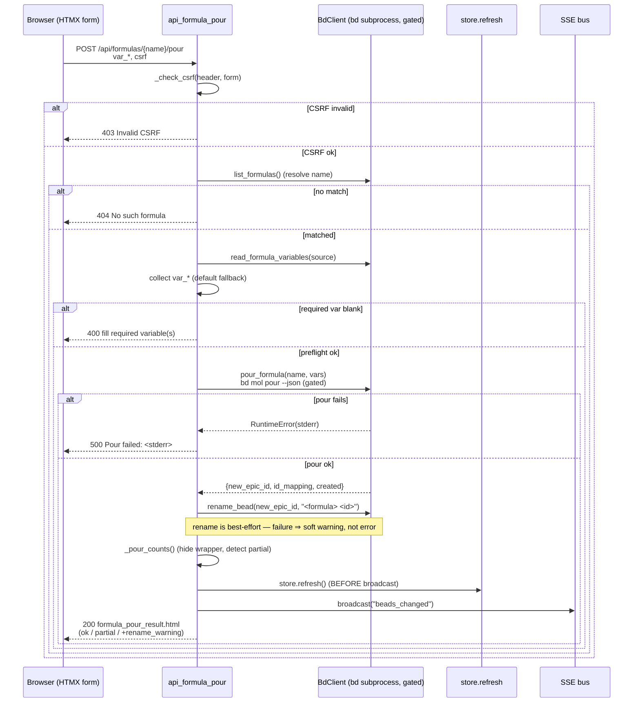

# POST /api/formulas/{name}/pour

> [!NOTE]
> The route is registered as `POST /api/formulas/{name}/pour`
> (`@app.post("/api/formulas/{name}/pour")`). The path parameter is the formula
> **name** (e.g. `code-health-audit`, `flowdoc-html`), NOT a bead id. This is
> the **write half** of [Formula Pour](../Features/index.md): it materializes a
> whole formula's bead tree onto the board in one atomic `bd mol pour`, renames
> the grouping epic so repeat pours are distinguishable, then refreshes the
> store and broadcasts an SSE event so every open tab re-fetches. It is the only
> bdboard endpoint that creates *new* beads (every other write edits or appends).

## Overview

| Method | Path | Auth | Purpose |
| --- | --- | --- | --- |
| POST | `/api/formulas/{name}/pour` | CSRF token (header `X-CSRF-Token` **or** form `csrf_token`); no cookies/session | Pre-flight the formula's required variables, pour its bead tree via `bd mol pour <name> --var k=v … --json`, rename the grouping epic to `<formula> <id>`, refresh the store + broadcast `beads_changed`, and return the `formula_pour_result.html` partial for an in-place HTMX swap of `#formula-pour-result` |

## Request

`Content-Type: application/x-www-form-urlencoded` — the handler reads form data
via `await request.form()` (each declared formula variable arrives as a
`var_<name>` field) plus the CSRF token via FastAPI `Form(alias="csrf_token")`.
HTMX submits the `<form>` rendered by `partials/formula_form.html`, so the wire
contract is single-sourced with the variable form returned by
[GET /api/formulas/{name}/form](index.md) (item `059`, not yet written).

### Path/Query Params

| Name | In | Type | Required | Notes |
| --- | --- | --- | --- | --- |
| `name` | path | string | yes | The formula name (e.g. `code-health-audit`). `.strip()`'d, then matched against `bd formula list --json` by exact `name`. An unknown name returns `404`. Forwarded to `bd mol pour <name>`. |

### Headers

| Header | Required | Notes |
| --- | --- | --- |
| `X-CSRF-Token` | conditional | Process-lifetime CSRF token. HTMX sends it via `hx-headers='{"X-CSRF-Token": "…"}'` (see `formula_form.html`). Either this header **or** the `csrf_token` form field must equal `_CSRF_TOKEN` — see [CSRF Protection](../Concepts/CsrfProtection.md). |
| `Content-Type` | yes | `application/x-www-form-urlencoded` (form post). |

### Body

Form-encoded fields (shown here as a JSON object for clarity — the real wire
format is `application/x-www-form-urlencoded`, not JSON). One `var_<name>` field
per variable the formula declares in its `*.formula.json` `variables` block,
plus the CSRF fallback token:

```json
{
  "csrf_token": "<process CSRF token>",
  "var_target": "both"
}
```

- **`var_<name>`** — the submitted value for the formula variable `<name>` (e.g.
  the `target` variable of `flowdoc-html` arrives as `var_target`). Each value
  is `.strip()`'d. A blank field falls back to that variable's `default` (from
  the formula file); a blank-and-no-default field marks the variable **missing**
  and blocks the pour. Only variables the server actually parsed are forwarded
  to bd — unknown `var_*` fields are ignored.
- **`csrf_token`** — fallback CSRF token for non-JS form posts (the
  `X-CSRF-Token` header is preferred for HTMX).

> [!NOTE]
> The client cannot inject arbitrary `--var` flags. The handler enumerates the
> formula's **declared** variables via `bd.read_formula_variables(source)`
> (parsed from the on-disk `*.formula.json` — the bd CLI omits the `variables`
> block from `formula show --json` and reports `vars: 0` in `formula list`), and
> only forwards values for names it recognises. A formula that declares no
> variables accepts a body with just the CSRF token.

### Validation Rules

| Field | Rule | Error |
| --- | --- | --- |
| `csrf_token` / `X-CSRF-Token` | One must equal the process `_CSRF_TOKEN` | `403` (HTTPException) `Invalid or missing CSRF token. Please refresh the page and try again.` |
| `name` | Must match a `name` returned by `bd formula list --json` | `404` `No such formula.` |
| required variables | Every declared variable with no `default` (`required=True`) must have a non-blank submitted value (after default fallback) | `400` `Please fill required variable(s): <names>.` |
| formula source | The formula's `*.formula.json` must be readable/parseable so variables can be enumerated | `500` `Couldn't read this formula's variables. Please try again.` |
| pour preconditions (bd-layer) | `bd mol pour` must succeed — `--dry-run` can't catch every pour-blocker (e.g. a broken-formula dependency or a missing top-level `pour: true`), so bd's real stderr is surfaced | `500` `Pour failed: <bd stderr>` |

> [!IMPORTANT]
> The required-variable check is the **server-side mirror** of the form's
> `required`/`aria-required` attributes (`formula_form.html`). The browser blocks
> the submit button, but a crafted POST that skips a field is still bounced here
> with `400` — never trust the client to enforce required inputs.

### Rate Limit

| Limit | Window | Scope |
| --- | --- | --- |
| None (no rate limiter) | — | bdboard is a single-user localhost dashboard. There is no token-bucket / IP throttle; the only throttle is structural — every `bd` mutation (the pour and the follow-up rename) is serialized on `BdClient._subprocess_gate` because bd's embedded Dolt is single-writer, so concurrent pours queue rather than race. The pour itself has a 30s subprocess timeout (`POUR_TIMEOUT_S`) because it cooks the formula inline and materializes a whole tree. |

## Response

`Content-Type: text/html` (`response_class=HTMLResponse`). The body is an HTML
**fragment**, not JSON — bdboard is server-rendered HTMX, so the route returns
the rendered `partials/formula_pour_result.html` that HTMX swaps into
`#formula-pour-result` (which lives in the dialog, OUTSIDE `#formula-form`, so
the post-pour picker reset can't wipe the confirmation).

### Success

`200 OK` — the rendered `partials/formula_pour_result.html` acknowledgement. The
`created` value is the **VISIBLE** count: bd's raw `created` node count minus the
one hidden molecule wrapper (so it matches what actually appears on the board).
The board itself updates separately via the `beads_changed` SSE broadcast.

Healthy (fully materialized) pour:

```html
<p class="formula-pour-ok" role="status">
  &#10003; Poured <strong>code-health-audit</strong> — 5 beads added to the board.
</p>
```

If the grouping-node rename failed (best-effort — the pour itself still
succeeded), a soft `rename_warning` is appended:

```html
<p class="formula-pour-ok" role="status">
  &#10003; Poured <strong>code-health-audit</strong> — 5 beads added to the board.
  (poured, but couldn’t rename the grouping node — it will show under the
  bare formula name).
</p>
```

> [!WARNING]
> A **partial** pour (bd reported more nodes than it actually mapped to real
> ids — `len(id_mapping) != created`) still returns `200`, but renders the
> `formula-error` alert variant instead of dressing the shortfall up as a clean
> win. The user is told only N beads materialized and is asked to check the
> formula's top-level `pour: true` and the server log, then remove the
> incomplete epic before retrying:
>
> ```html
> <p class="formula-error" role="alert">
>   &#9888; Partial pour of <strong>code-health-audit</strong> — only 3 beads
>   materialized; some of the formula’s steps did not land. …
> </p>
> ```

### Errors

| Status | Code | When |
| --- | --- | --- |
| `403` | `Invalid or missing CSRF token.` | `_check_csrf` failed — neither header nor form token matched. Raised as `HTTPException`. |
| `404` | `No such formula.` | `name` did not match any formula from `bd formula list --json`. |
| `400` | `Please fill required variable(s): <names>.` | One or more declared no-default variables were left blank (the server-side required-var pre-flight). |
| `500` | `Couldn't load the formula. Please try again.` | `bd.list_formulas()` raised `RuntimeError` (bd subprocess failure / malformed JSON) while resolving the formula. |
| `500` | `Couldn't read this formula's variables. Please try again.` | `bd.read_formula_variables(source)` raised `RuntimeError` (formula file missing / invalid JSON). |
| `500` | `Pour failed: <bd stderr>` | `bd.pour_formula` raised `RuntimeError` (non-zero exit, timeout, or malformed JSON). bd's verbatim stderr is surfaced. The pour is atomic, so a failure leaves zero new beads. |

## Implementation Map

| Responsibility | File path | Symbol |
| --- | --- | --- |
| Route handler (CSRF → preflight → pour → rename → refresh → render) | `src/bdboard/app.py` | `api_formula_pour` |
| CSRF guard (header or form token) | `src/bdboard/app.py` | `_check_csrf`, `_CSRF_TOKEN` |
| Resolve formula by name | `src/bdboard/bd.py` | `BdClient.list_formulas` (`bd formula list --json`) |
| Enumerate declared variables (for preflight + forwarding) | `src/bdboard/bd.py` | `BdClient.read_formula_variables`, `_load_formula_json`, `_parse_variables` |
| Serialized `bd mol pour <name> --var … --json` write | `src/bdboard/bd.py` | `BdClient.pour_formula`, `POUR_TIMEOUT_S` |
| Title disambiguator for repeat pours | `src/bdboard/app.py` | `_short_pour_id` |
| Rename grouping epic to `<formula> <id>` | `src/bdboard/bd.py` | `BdClient.rename_bead` (`bd update <id> --title`) |
| Count honesty (hide wrapper) + partial-pour detection | `src/bdboard/app.py` | `_pour_counts` |
| Store refresh BEFORE broadcast (beats the race) | `src/bdboard/store.py` | `store.refresh` |
| SSE broadcast so every tab re-fetches | `src/bdboard/events.py` | `bus.broadcast("beads_changed")` |
| Subprocess serialization (single-writer Dolt) | `src/bdboard/bd.py` | `BdClient._subprocess_gate`, `_safe_kill` |
| Cache invalidation after mutation | `src/bdboard/bd.py` | `BdClient.invalidate_caches` |
| Result partial returned for the swap | `src/bdboard/templates/partials/formula_pour_result.html` | (template) |
| Variable form that posts here | `src/bdboard/templates/partials/formula_form.html` | `<form hx-post=".../pour">` |
| Endpoint regression coverage | `tests/test_formula_pour.py` | `test_pour_requires_csrf`, `test_pour_blocks_missing_required_var`, `test_pour_success_renames_and_broadcasts`, `test_pour_uses_default_when_field_blank`, `test_pour_surfaces_bd_stderr_on_failure`, `test_pour_soft_warns_when_rename_fails` |



> [!CAUTION]
> The `store.refresh()` MUST run **before** `bus.broadcast("beads_changed")`.
> Without it, the optimistic broadcast races ahead of the watcher→refresh cycle
> and clients re-fetch stale cache data that omits the freshly poured beads
> (regression bdboard-dfl). The broadcast tells every tab "go re-fetch"; the
> refresh guarantees there's fresh data to fetch.

## Example

Pour the `flowdoc-html` formula with its `target` variable set to `both`
(form-encoded, CSRF via header):

```bash
curl -i -X POST http://127.0.0.1:8000/api/formulas/flowdoc-html/pour \
  -H "X-CSRF-Token: $CSRF_TOKEN" \
  -H "Content-Type: application/x-www-form-urlencoded" \
  --data-urlencode "var_target=both"
```

Pour a formula that declares no variables (e.g. `code-health-audit`) — just the
CSRF token, no `var_*` fields:

```bash
curl -i -X POST http://127.0.0.1:8000/api/formulas/code-health-audit/pour \
  -H "X-CSRF-Token: $CSRF_TOKEN" \
  -H "Content-Type: application/x-www-form-urlencoded"
```

A successful call returns `200` with the `#formula-pour-result` HTML fragment
(`&#10003; Poured … — N beads added to the board.`); HTMX swaps it into the dialog via
`hx-swap="innerHTML"`, and the board itself updates moments later when the
`beads_changed` SSE event arrives.

## Related

- [Endpoints index](index.md) — every route bdboard exposes, including the two
  read halves of the pour flow: `GET /api/formulas` (the picker list) and
  `GET /api/formulas/{name}/form` (the variable form whose submit fires this
  endpoint) — both listed in the index, docs pending. It shares the exact CSRF +
  serialized-mutation + SSE-broadcast plumbing with
  [POST /api/bead/{id}/field](PostApiBeadField.md).
- [GET /api/bead/{id}/raw](GetApiBeadRaw.md) — a sibling read endpoint; the
  pour write path invalidates the same caches its read path relies on.
- [CSRF Protection](../Concepts/CsrfProtection.md) — the token guard that fronts
  this write.
- [bd CLI as Source of Truth](../Concepts/BdCliSourceOfTruth.md) — why pour
  shells out to `bd mol pour` and reads `*.formula.json` directly for variables.
- [Subprocess Serialization & Caching](../Concepts/SubprocessSerializationAndCaching.md)
  — the `_subprocess_gate` that serializes the pour + rename and the cache
  invalidation that follows.
- [SSE Event Bus](../Concepts/SseEventBus.md) — the `beads_changed` broadcast
  that pushes every tab to re-fetch after a pour.
- [Feature: Formula Pour](../Features/index.md) — the feature this endpoint
  implements.
- [Flow: Formula Pour Pipeline](../Flows/index.md) — the end-to-end preflight →
  pour → rename → refresh flow.
- [Board (/)](../Views/BoardView.md) — the view whose "+ Pour Formula" dialog
  drives this endpoint.
- [Back to docs index](../index.md)
