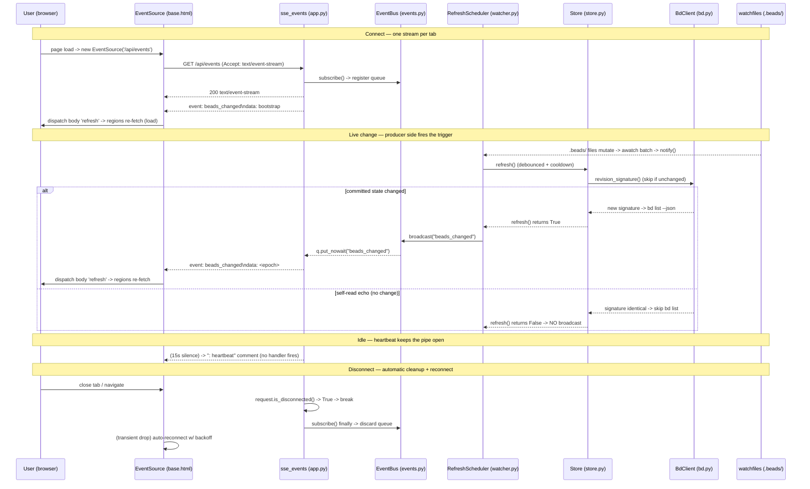

# GET /api/events

The **live signal** behind bdboard's "close-as-you-watch" feel. A single
long-lived **Server-Sent Events** stream over which the server pushes one
`beads_changed` event whenever the `.beads/` workspace changes underneath the
process. The browser opens it **once per page load** (`EventSource('/api/events')`
in `base.html`); each `beads_changed` is translated into a synthetic DOM
`refresh` event on `<body>`, and every region wired with
`hx-trigger="load, refresh from:body"` re-fetches its HTML partial. No
polling, no SPA, no client framework.

Unlike every *other* bdboard route — which return one-shot HTML fragments — this
endpoint returns a `text/event-stream` `StreamingResponse` that never completes
until the client disconnects. It carries **no application data** in its frames:
the event is a pure *trigger*, deliberately content-free, so the actual fresh
state always comes from the regions re-fetching `/api/lanes`, `/api/counts`,
`/api/history`, etc. against the [Store](../Concepts/StoreSnapshotCache.md)
snapshot. That keeps the broadcast path O(1) and the data path single-sourced.

Two timing concerns shape the stream:

- **Bootstrap.** The first frame a freshly-connected client receives is a
  synthetic `beads_changed: bootstrap`, so a brand-new tab paints immediately
  instead of waiting for the first real file change.
- **Heartbeat.** When no event arrives for 15s the server emits an SSE comment
  line (`: heartbeat`) to keep proxies / load balancers from reaping the idle
  long-lived connection (typical idle timeout is 30–60s, so 15s has comfortable
  margin). A comment line fires **no** client-side event handler.

## Overview

| Method | Path | Auth | Purpose |
| --- | --- | --- | --- |
| GET | `/api/events` | None (localhost single-user tool); read-only, no body, no CSRF token | Open a long-lived `text/event-stream` over which the server pushes `beads_changed` events (plus a `bootstrap` on connect and `: heartbeat` comments every 15s). Each `beads_changed` triggers the browser to re-fetch its live HTML regions, giving the board/history/memory pages live updates without polling. |

> [!NOTE]
> This is the **only** bdboard route whose `media_type` is `text/event-stream`
> rather than `text/html`. It also never returns JSON — the SSE frames carry a
> content-free trigger, not application data (the real state is re-fetched by the
> [Lanes](LanesApi.md) / [History](HistoryApi.md) / [Memory](MemoryApi.md)
> regions). The connection is open-ended: it streams until the client
> disconnects or the server shuts down.

> [!IMPORTANT]
> The event is a **dumb trigger by design** (bdboard-ywep / the
> [HTMX partials architecture](../Concepts/HtmxPartialsArchitecture.md)). Pushing
> the actual changed beads down the wire would duplicate the derive/render logic
> that already lives behind the region endpoints and create two sources of truth.
> Keeping the frame content-free means a dropped/coalesced event is never a
> correctness problem — the next re-fetch always reads the current snapshot.

## Request

The request takes **no input** — no path params, no query params, no required
headers, and no body. The browser opens it via the native `EventSource` API
(which only issues a bare `GET` with `Accept: text/event-stream`); a plain
`curl -N` works identically. There is exactly one connection per open tab, and
its lifetime equals the tab's lifetime (`EventSource` auto-reconnects on drop).

### Path/Query Params

| Name | In | Type | Required | Notes |
| --- | --- | --- | --- | --- |
| _(none)_ | — | — | — | `/api/events` accepts no path or query parameters. The stream content is identical for every subscriber — fan-out is per-connection, not per-parameter. The only request-scoped object the handler reads is `request` itself, and only to poll `request.is_disconnected()` for cleanup. |

### Headers

| Header | Required | Notes |
| --- | --- | --- |
| `Accept: text/event-stream` | No (recommended) | Sent automatically by the browser's `EventSource`. The handler does not enforce it — it always responds with `media_type="text/event-stream"` regardless — but it is the correct content negotiation and what `curl -N` should send. |
| `Last-Event-ID` | No | The standard SSE resume header. bdboard does **not** emit `id:` lines, so there is no replay/resume: a reconnect simply re-subscribes and receives a fresh `bootstrap`. The header is ignored if present. |
| _(no `X-CSRF-Token`)_ | No | Read-only stream — no mutation, so no CSRF token (unlike the sibling write routes [Memory API](MemoryApi.md) and [Bead field-edit API](BeadFieldEditApi.md)). Being a localhost single-user tool, it carries no login or per-user authorization. |

### Body

None. `GET /api/events` is a bare request with no body and no form payload.

```json
// No request body — a bare GET that upgrades to a long-lived event stream:
//   GET /api/events
//   Accept: text/event-stream
```

### Validation Rules

There is nothing to validate — no params, no body, no headers consulted for
correctness. The handler cannot return a 4xx for the request shape; the only
runtime decisions are connection lifecycle (disconnect detection) and the 15s
heartbeat fallback.

| Field | Rule | Error |
| --- | --- | --- |
| _(no request fields)_ | N/A — `/api/events` accepts no path/query/body/required-header input | Nothing to reject. There is no validation path and therefore no validation error for this endpoint. |

### Rate Limit

| Limit | Window | Scope |
| --- | --- | --- |
| No explicit limit. The handler spawns **zero** `bd` subprocesses — it only subscribes to the in-process `EventBus` and `yield`s frames, so it never touches the single-writer `_subprocess_gate`. Practical concurrency is bounded by the per-subscriber queue (`events._QUEUE_SIZE = 16`, drop-oldest on overflow) and the 15s heartbeat keep-alive. | per-connection | One `asyncio.Queue` is registered per open connection (`EventBus.subscribe`); `broadcast` is O(N) over subscribers. Designed for dozens of tabs, not thousands — a slow client drops its oldest queued events rather than backpressuring the watcher. |

## Response

A long-lived `200 OK` `text/event-stream`. Frames are emitted incrementally and
the response never completes normally — it ends only when the client disconnects
or the server shuts down (the watcher/lifespan tears down on app stop). There is
**no JSON body** — SSE is a line-oriented wire format; the field names below are
the SSE protocol fields (`event:`, `data:`, comment `:`), not application JSON.

### Success

**`200 OK`** · `Content-Type: text/event-stream` · `Cache-Control: no-cache` ·
`X-Accel-Buffering: no` (disables nginx response buffering if proxied).

The wire payload is a sequence of SSE frames (each terminated by a blank line):

```text
# 1) Bootstrap frame — sent immediately on connect so the tab paints at once:
event: beads_changed
data: bootstrap

# 2) Real change frame — one per watcher-detected .beads/ change.
#    `data` is the server epoch seconds at emit time (int(time.time())):
event: beads_changed
data: 1780000020

# 3) Heartbeat — an SSE *comment* line emitted after 15s of silence.
#    Keeps proxies from reaping the idle connection; fires NO client handler:
: heartbeat
```

| SSE frame field | Example value | Meaning |
| --- | --- | --- |
| `event:` | `beads_changed` | The only event name bdboard emits. The browser binds `es.addEventListener('beads_changed', …)`; the listener dispatches a bubbling `refresh` `CustomEvent` on `<body>`, which every `hx-trigger="refresh from:body"` region observes. |
| `data:` (bootstrap) | `bootstrap` | Literal sentinel on the first frame after connect; lets a fresh tab render immediately rather than waiting for the first file change. |
| `data:` (change) | `1780000020` | `int(time.time())` at emit — a monotonic-ish cache-buster / debug aid. The client ignores the value; the mere arrival of the event is the trigger. |
| `:` (comment) | `: heartbeat` | An SSE comment (line starting with `:`). Keep-alive only; the browser's `EventSource` consumes it without firing any handler. |

> [!NOTE]
> bdboard intentionally emits **no `id:` lines** and no `retry:` directive. There
> is no event replay (`Last-Event-ID` is unused) — on reconnect the client simply
> re-subscribes and gets a fresh `bootstrap`. Reconnect cadence is left to the
> browser's built-in `EventSource` exponential backoff, which heals a transient
> server restart within a few seconds.

> [!WARNING]
> The stream is **lossy under backpressure by design**. Each subscriber has a
> bounded queue (`_QUEUE_SIZE = 16`); if a client falls more than 16 events
> behind, `EventBus.broadcast` drops the **oldest** queued event to make room
> (logging `event bus subscriber queue is hot; event lost` only if even that
> fails). This is safe because the next event re-triggers the same full re-fetch
> — a dropped event costs at most a freshness blip, never correctness.

### Errors

This endpoint has effectively no error surface: the request can't be malformed,
the handler spawns no subprocess, and frame generation degrades to a heartbeat
rather than raising. Connection loss is normal lifecycle, not an error.

| Status | Code | When |
| --- | --- | --- |
| 200 (heartbeat-only) | No `beads_changed` for ≥15s | The `asyncio.wait_for(q.get(), timeout=15.0)` times out (`TimeoutError`) and the stream yields a `: heartbeat` comment instead of an event. This is the steady-state idle behavior, not a failure. |
| _(connection closed)_ | Client disconnect | `request.is_disconnected()` returns `True` (tab closed / navigated / network drop) → the `stream()` generator `break`s, the `bus.subscribe()` context manager exits, and the subscriber queue is discarded (`EventBus.subscribe`'s `finally`). The browser's `EventSource` then auto-reconnects. |
| _(stream end)_ | Server shutdown | On app stop the `lifespan` cancels the watcher task and FastAPI tears down in-flight responses; the stream ends and clients reconnect once the server is back. |
| 500 | FastAPI default `Internal Server Error` | Only if an unexpected exception escapes before the `StreamingResponse` starts streaming (none expected — the handler does no I/O beyond subscribing). Once streaming has begun, a mid-stream error simply closes the connection and the client reconnects. |

> [!CAUTION]
> If a reverse proxy **buffers** the response, clients will appear "stuck on
> connecting" because frames never flush. bdboard sets `X-Accel-Buffering: no`
> and `Cache-Control: no-cache` to defeat nginx buffering, but other proxies may
> need their own flush/SSE config. The footer live-status dot
> (`#live-status` / `#live-dot` in `base.html`) shows `live · push` on `open` and
> `reconnecting…` on `error` — watch it to distinguish a buffering proxy from a
> genuinely dead stream.

## Implementation Map

| Responsibility | File path | Symbol |
| --- | --- | --- |
| SSE endpoint handler — subscribe, yield bootstrap, pump events, 15s heartbeat, disconnect cleanup | `src/bdboard/app.py` | `sse_events` |
| Inner async generator that produces the wire frames | `src/bdboard/app.py` | `sse_events.<locals>.stream` |
| `StreamingResponse` wiring (`media_type`, `Cache-Control: no-cache`, `X-Accel-Buffering: no`) | `src/bdboard/app.py` | `sse_events` return |
| The single app-wide event bus instance | `src/bdboard/app.py` | `bus = EventBus()` |
| In-process pub/sub broadcaster (one queue per connection, O(N) fan-out) | `src/bdboard/events.py` | `EventBus.broadcast` |
| Per-connection subscription (context-managed queue add/discard) | `src/bdboard/events.py` | `EventBus.subscribe` |
| Bounded-queue / drop-oldest backpressure policy | `src/bdboard/events.py` | `EventBus.broadcast` (`QueueFull` branch) / `_QUEUE_SIZE` |
| Subscriber count for diagnostics | `src/bdboard/events.py` | `EventBus.subscriber_count` |
| Watcher → refresh → broadcast wiring (the producer side) | `src/bdboard/app.py` | `_watch_beads` / `lifespan` |
| Debounce/cooldown scheduler whose `broadcast` callback fires `beads_changed` | `src/bdboard/watcher.py` | `RefreshScheduler` (`broadcast=lambda: bus.broadcast("beads_changed")`) |
| Snapshot refresh that gates whether a broadcast fires (returns `True` iff changed) | `src/bdboard/store.py` | `Store.refresh` |
| Self-feedback skip (revision unchanged → no re-list → no broadcast loop) | `src/bdboard/bd.py` | `BdClient.revision_signature` |
| Write routes that fire an **optimistic** `beads_changed` after a mutation | `src/bdboard/app.py` | `api_memory_create` / `api_memory_delete` / `api_formula_pour` / `api_bead_field_update` (`await bus.broadcast("beads_changed")`) |
| Client subscriber — `EventSource('/api/events')`, `beads_changed` → body `refresh` | `src/bdboard/templates/base.html` | inline SSE bridge IIFE (`new EventSource('/api/events')`) |
| Footer live-status indicator updated on `open`/`error` | `src/bdboard/templates/base.html` | `#live-status` / `#live-dot` (`setStatus`) |
| Regions that consume the resulting `refresh` event | `src/bdboard/templates/dashboard.html`, `history.html`, `memory.html` | `hx-trigger="load, refresh from:body"` hosts |
| Scheduler regression tests (broadcast iff changed; no self-feedback wedge) | `tests/test_watcher_scheduler.py`, `tests/test_watcher_self_feedback.py` | `RefreshScheduler` coverage |
| Optimistic-broadcast tests (write routes emit `beads_changed`) | `tests/test_memory_mutations.py`, `tests/test_formula_pour.py` | `test_*_broadcasts_sse_on_success` / `_stub_bus_broadcast` |



## Example

Open the stream and watch frames arrive (`-N` disables curl's buffering so SSE
frames flush live):

```bash
curl -N -H 'Accept: text/event-stream' 'http://127.0.0.1:8765/api/events'
```

Expected output — an immediate bootstrap, then a heartbeat every ~15s of
silence, and a `beads_changed` frame each time you mutate the workspace (e.g.
`bd update <id> --status in_progress` in another terminal):

```text
event: beads_changed
data: bootstrap

: heartbeat

event: beads_changed
data: 1780000020

```

In the browser this is wired natively — no curl needed:

```js
// (already in base.html) — translate each push into a DOM refresh:
const es = new EventSource('/api/events');
es.addEventListener('beads_changed', () => {
  document.body.dispatchEvent(new CustomEvent('refresh'));
});
```

## Related

- [Lanes API (`/api/lanes`, `/api/lanes/closed`, `/api/counts`)](LanesApi.md) —
  the board regions re-fetched on every `beads_changed → refresh from:body`
  pulse this stream emits. They are pure read-only swap targets; this endpoint is
  the signal that drives them.
- [History API (`/api/history`)](HistoryApi.md) — the `#history-region` swap
  target that re-fetches on the same `refresh` event, giving the History page its
  live close-as-you-watch behavior.
- [Memory API (`/api/memory`)](MemoryApi.md) — its write routes
  (`api_memory_create` / `api_memory_delete`) fire an **optimistic**
  `bus.broadcast("beads_changed")` right after mutating, so the change shows up
  on every tab without waiting for the file watcher.
- [Formulas API (`/api/formulas`, form, pour)](FormulasApi.md) — a successful
  pour likewise emits an optimistic `beads_changed` over this stream so the new
  beads arrive live on the board.
- [Formula pour fan-out (Flow)](../Flows/FormulaPourFanout.md) — the end-to-end
  pour flow whose final step is the optimistic `beads_changed` broadcast this
  stream carries to every tab.
- [Bead field-edit API (POST /api/bead/{id}/field)](BeadFieldEditApi.md) — the
  other optimistic-broadcast write path; an inline edit pushes `beads_changed`
  so the card re-renders everywhere.
- [Board page (`/`)](../Views/BoardPage.md) · [History page
  (`/history`)](../Views/HistoryPage.md) · [Memory page (`/memory`)](../Views/MemoryPage.md)
  — the three views that open this `EventSource` (via the shared `base.html`
  bridge) and surface the footer live-status dot.
- [HTMX + server-rendered partials](../Concepts/HtmxPartialsArchitecture.md) —
  why the event is a content-free trigger that fans out to `refresh from:body`
  regions instead of pushing data down the wire.
- [Live-refresh pipeline (Flow)](../Flows/LiveRefreshPipeline.md) — the end-to-end
  producer story (bd write → watcher → refresh → broadcast → client re-fetch)
  that culminates in the events this stream delivers.
- [Watcher debounce/cooldown & self-feedback skip](../Concepts/WatcherScheduling.md)
  — the producer side: how FS events become exactly one `beads_changed`
  broadcast (and how bdboard's own reads are skipped so the stream can't spin).
- [Store snapshot cache & change detection](../Concepts/StoreSnapshotCache.md) —
  the cache `Store.refresh` consults to decide whether anything actually changed
  (and thus whether a broadcast fires at all).
- [bd CLI as runtime source of truth](../Concepts/BdCliSourceOfTruth.md) — why a
  read-only `bd list` still perturbs `.beads/` and triggers the watcher (the
  motivation for the `revision_signature` self-feedback skip).
- [Endpoints index](index.md) · [Architecture](../Architecture.md#api-surface) ·
  [Manifest](../_Manifest.md) — the API surface and doc catalog this item sits in.
