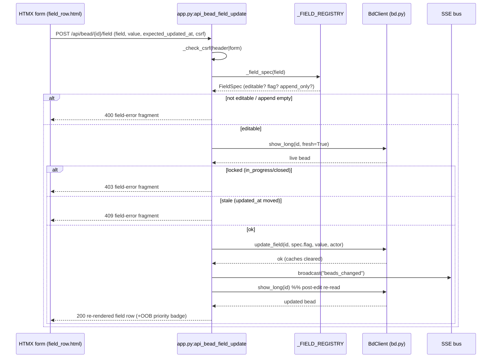

# Endpoint: Bead field-edit API (POST /api/bead/{id}/field)

## Overview

| METHOD | Path | Purpose |
| --- | --- | --- |
| POST | `/api/bead/{bead_id}/field` | Edit **one** bead field's VALUE via `bd update`, then return the re-rendered field row for an in-place HTMX swap. |

This is the **write half** of manual field editing (its read/display half is the
bead-detail modal, see [Bead detail API](bead-detail-api.md)). One POST mutates
exactly one whitelisted field on one bead and echoes back only that field's row
markup so HTMX can swap `#field-row-<field>` without reloading the modal. It
reuses the same plumbing as the memory write paths: a per-process CSRF guard, a
subprocess-serialized `bd update`, an SSE broadcast, and an optimistic
re-render.

> [!IMPORTANT]
> The endpoint is **field-scoped, not bead-scoped**: it can only ever edit the
> VALUE of a field that the server-side registry has explicitly whitelisted as
> editable. It can never change a bead's shape, graph, or lifecycle (labels,
> parent, status, id, timestamps, derived counts). The client supplies a field
> *name*; the server — not the client — decides the `bd update` flag.

## Request

### Headers

| Header | Required | Notes |
| --- | --- | --- |
| `X-CSRF-Token` | One of header **or** form field | Per-process CSRF token minted at startup (`_CSRF_TOKEN`). HTMX sends it via `hx-headers` on the `<form>` in [`partials/field_row.html`](../../src/bdboard/templates/partials/field_row.html). |
| `Content-Type` | Yes | `application/x-www-form-urlencoded` — the body is a standard HTML form post (HTMX default). |

### Params / Query

| Name | Type | Required | Default | Validation |
| --- | --- | --- | --- | --- |
| `bead_id` | path string | Yes | — | Passed straight to `bd update <bead_id> ...`; bd rejects unknown ids. |

(No query-string parameters — everything else travels in the form body.)

### Body

| Field | Type | Required | Validation |
| --- | --- | --- | --- |
| `field` | string | Yes | `.strip()`ed, then looked up in `_FIELD_REGISTRY` via `_field_spec`. Must resolve to a `FieldSpec` with `editable=True` **and** a non-empty `flag`, else `400`. Whitelist (v1): `title`, `description`, `acceptance_criteria`, `design`, `priority`, `assignee`, `issue_type`, `external_ref`, `estimate`, `notes`. |
| `value` | string | No (defaults `""`) | For markdown editors the raw value is kept verbatim; for all other editors it is `.strip()`ed. For append-only fields (`notes`) an empty/whitespace value is rejected `400` ("Nothing to add"). |
| `expected_updated_at` | string | No (defaults `""`) | Optimistic-lock token: the `updated_at` the row was rendered with. When present (and the field is not append-only) it must equal the bead's LIVE `updated_at`, else `409`. Missing/empty ⇒ lock skipped (degrades to write-wins). |
| `csrf_token` | string | One of header **or** form field | Fallback CSRF token for non-JS form posts; checked against `_CSRF_TOKEN` if the header is absent. |

## Response

### Success

**`200 OK`**, body is an **HTML fragment** (not JSON) — the freshly re-rendered
field row from [`partials/field_row.html`](../../src/bdboard/templates/partials/field_row.html),
keyed `id="field-row-<field>"`. HTMX swaps it `outerHTML` into the modal so the
row reflects the saved value (and re-collapses the edit `<details>`).

Two special success shapes degrade gracefully instead of failing:

- If the post-edit re-read returns the bead but the field is no longer present
  in the rendered set (e.g. cleared to empty and filtered out), the body is a
  small `<p class="field-saved" role="status">Saved.</p>` acknowledgement.
- If the edit succeeded but neither the live read **nor** the cached snapshot
  can re-read the bead, the body nudges the user to reopen the bead — still
  `200`, because the write itself committed.

When the edited field is `priority`, the response **also appends an
out-of-band** copy of [`partials/bead_priority_badge.html`](../../src/bdboard/templates/partials/bead_priority_badge.html)
(`oob=True`) so the modal-header badge updates in the same swap rather than
staying stale until the modal is reopened — the same OOB idiom the
[audit endpoint](bead-detail-api.md) uses for `#lifecycle-slot`.

### Errors

| Status | When | Body |
| --- | --- | --- |
| `403` | CSRF token missing/invalid (`_check_csrf` raises `HTTPException`). | FastAPI error: "Invalid or missing CSRF token. Please refresh the page and try again." |
| `400` | `field` is not in the registry, or is whitelisted-but-flagless. | `<p class="field-error" role="alert">Field "<field>" is not editable.</p>` |
| `400` | Append-only field (`notes`) submitted with empty/whitespace value. | `<p class="field-error" role="alert">Nothing to add.</p>` |
| `403` | The bead is locked against editing (status `in_progress` or any closed status — see `_bead_is_editable` / `_LOCKED_EDIT_STATUSES`). | `<p class="field-error" role="alert">This bead is <status> and can no longer be edited — only open beads are editable.</p>` |
| `409` | Optimistic-lock conflict: live `updated_at` moved past `expected_updated_at` (stale tab). | `<p class="field-error" role="alert">This bead changed since you opened it — please refresh and re-apply your edit…</p>` |
| `500` | `bd update` subprocess failed (`RuntimeError`, bd's stderr surfaced). | `<p class="field-error" role="alert">Could not save: <err></p>` |

> [!WARNING]
> Error bodies are HTML fragments with `role="alert"`, not JSON. The client's
> `htmx:beforeSwap` handler (in `base.html`) routes 4xx/5xx bodies into the
> per-row `data-edit-feedback` aria-live region so a failed save **never wipes
> the row** — the edit form stays open with the message announced.

## Implementation Map

| Concern | Where |
| --- | --- |
| Route handler | [`src/bdboard/app.py:api_bead_field_update`](../../src/bdboard/app.py) |
| CSRF guard | [`src/bdboard/app.py:_check_csrf`](../../src/bdboard/app.py) (token `_CSRF_TOKEN`) |
| Field registry (single source of editability) | [`src/bdboard/app.py:_FIELD_REGISTRY` / `FieldSpec` / `_field_spec`](../../src/bdboard/app.py) |
| Lifecycle lock | [`src/bdboard/app.py:_bead_is_editable` / `_LOCKED_EDIT_STATUSES`](../../src/bdboard/app.py) |
| Live read (lock precondition) | [`src/bdboard/bd.py:BdClient.show_long`](../../src/bdboard/bd.py) (`fresh=True`) |
| bd mutation | [`src/bdboard/bd.py:BdClient.update_field`](../../src/bdboard/bd.py) → `_run_mutate` (serialized on `_subprocess_gate`) |
| Actor attribution | [`src/bdboard/app.py:_ACTOR`](../../src/bdboard/app.py) (`$BDBOARD_ACTOR`) → `bd update --actor` |
| SSE broadcast | `bus.broadcast("beads_changed")` (see [SSE events](sse-events.md)) |
| Re-render | [`partials/field_row.html`](../../src/bdboard/templates/partials/field_row.html) + `_ordered_fields` / `_field_row` |
| OOB priority badge | [`partials/bead_priority_badge.html`](../../src/bdboard/templates/partials/bead_priority_badge.html) |

> [!IMPORTANT]
> Adding a newly-editable field is **one entry** in `_FIELD_REGISTRY` — the
> registry is the extensibility seam (open/closed + DRY). The handler never
> hard-codes a field or a flag; it pulls `spec.flag` from the registry. This is
> why a crafted POST asking to write `status` or `story_points` can't succeed:
> those fields simply aren't whitelisted.

## Diagram



## curl example

```sh
# Edit a bead's priority to P1. The token comes from the running page
# (hidden csrf_token input / X-CSRF-Token header); replace TOKEN below.
curl -s -X POST http://127.0.0.1:7332/api/bead/bdboard-mol-gh2/field \
  -H "X-CSRF-Token: TOKEN" \
  --data-urlencode "field=priority" \
  --data-urlencode "value=1" \
  --data-urlencode "expected_updated_at=2026-06-03T10:00:00Z"

# Append a note (append-only field; --append-notes, never replace):
curl -s -X POST http://127.0.0.1:7332/api/bead/bdboard-mol-gh2/field \
  -H "X-CSRF-Token: TOKEN" \
  --data-urlencode "field=notes" \
  --data-urlencode "value=Verified locally; tests green."
```

> [!CAUTION]
> Do **not** try to edit `notes` with a replace-style flag. `bd update --notes`
> REPLACES the whole field and would nuke agent verification / bug-discovery
> history. The registry pins `notes` to `--append-notes` and marks it
> `append_only`; the route and template both honour that. Bypassing the
> endpoint to call `bd update --notes` by hand is the documented anti-pattern.

## Testing

Covered by [`tests/test_field_edit.py`](../../tests/test_field_edit.py), split
across the route and the `BdClient` method:

- **CSRF** — `test_field_update_requires_csrf_token` (403 without a token),
  `test_field_update_accepts_csrf_form_field` (form-field fallback works).
- **Registry validation** — `test_field_update_rejects_non_editable_field`,
  `test_field_update_rejects_unknown_field`,
  `test_field_update_uses_registry_flag_not_client_input` (the bd flag comes
  from the registry, never the client).
- **Append-only safety** — `test_field_update_notes_uses_append_flag`
  (`--append-notes`), `test_field_update_append_only_rejects_empty` (400 on
  empty note), `test_notes_row_has_no_replace_inline_edit_form`.
- **Re-render + SSE** — `test_field_update_broadcasts_sse_and_renders_row`
  (broadcasts `beads_changed` and returns the row),
  `test_priority_edit_appends_oob_header_badge` /
  `test_non_priority_edit_omits_oob_header_badge` (OOB badge only for priority).
- **Error surfacing** — `test_field_update_surfaces_bd_error` (bd failure → 500
  fragment).
- **`BdClient.update_field`** — `test_update_field_passes_value_as_arg`,
  `test_update_field_streams_markdown_via_stdin` (description via `--body-file -`),
  `test_update_field_design_uses_design_file`,
  `test_update_field_omits_actor_when_none`,
  `test_update_field_clears_show_cache`,
  `test_update_field_surfaces_stderr_on_failure`,
  `test_show_long_fresh_bypasses_show_cache` (the lock precondition's live read).

The route tests stub `bd.update_field` / `bd.show_long` / `bus.broadcast` so they
exercise the handler logic without shelling a real `bd`; the client tests
replace the `bd` binary with a fake script to assert exact arg/stdin
construction.

## Related

- [Bead detail API](bead-detail-api.md) — the read/display half (`/api/bead/{id}`, `/audit`, `/raw`) that renders the editable rows this endpoint writes back.
- [Flow: Inline field-edit write path](../Flows/field-edit-write-path.md) — the end-to-end edit flow this endpoint anchors.
- [Feature: Bead detail & inline editing](../Features/bead-detail-and-inline-editing.md) — the capability this endpoint powers.
- [SSE events](sse-events.md) — the `beads_changed` broadcast that fans the edit out to other tabs.
- [Memory API](memory-api.md) — sibling write path sharing the CSRF + serialized-mutation + optimistic-refresh posture.
- [Concept: HTMX + server-rendered partials](../Concepts/htmx-partials-architecture.md) — why the response is an HTML fragment swapped in place (incl. OOB swaps).
- [Concept: bd CLI as runtime source of truth](../Concepts/bd-cli-source-of-truth.md) — why every write is a serialized `bd` subprocess.
- [Concept: Store snapshot cache & change detection](../Concepts/store-snapshot-cache.md) — the cache the mutation invalidates and the lock read bypasses.
- [View: Board page](../Views/board-page.md) — where the bead modal that hosts these field rows lives.
