# Endpoint: Formulas API (`/api/formulas`, `/form`, `/pour`)

## Overview

The Formulas API is the three-call surface behind the **Pour a Formula** dialog
(the `+ Pour Formula` masthead button). A *formula* is an on-disk
`*.beads/formulas/<name>.formula.json` template that, when *poured*, materializes
a whole tree of beads onto the board in one atomic `bd mol pour`. The three
endpoints implement a deliberate **two-step pick-then-pour flow**: list →
parameterise → mutate.

| METHOD | Path | Purpose |
| --- | --- | --- |
| `GET` | `/api/formulas` | Render the formula **picker** (`<select>` of available formulas). HTMX swap target loaded when the dialog opens. |
| `GET` | `/api/formulas/{name}/form` | Render the **variable form** for one formula — full description, collapsible step list, and one input per declared variable. |
| `POST` | `/api/formulas/{name}/pour` | **Pour** the formula: CSRF-check, server-side required-var pre-flight, `bd mol pour`, rename the grouping node, refresh the store, broadcast SSE, and return a result summary. |

> [!IMPORTANT]
> The read calls (`GET`) **never** mutate and **degrade softly** — a bd failure
> returns a friendly inline message with `status_code=200` rather than 500-ing
> the HTMX swap, symmetric with [`/api/memory`](memory-api.md). Only the `POST`
> mutates, and only the `POST` is CSRF-guarded. This split mirrors the
> read/write asymmetry of the [bead-detail](bead-detail-api.md) /
> [bead-field-edit](bead-field-edit-api.md) endpoint pair.

> [!WARNING]
> bd's `formula` CLI has three documented data-shape gotchas that dictate **why**
> bdboard reads the `*.formula.json` file directly instead of trusting the CLI's
> JSON: (1) `formula list --json` reports `vars: 0` even when variables exist;
> (2) `formula show --json` **omits** the `variables` block entirely; (3)
> `formula list --json` **truncates** the description (trailing `…`). The only
> reliable source for the full description + variables + steps is the on-disk
> template, reached via the absolute `source` path the list payload hands us.

## Request

### Headers

| Header | Required | Notes |
| --- | --- | --- |
| `X-CSRF-Token` | **POUR only** — one of header **or** form field | Per-process CSRF token minted at startup (`_CSRF_TOKEN`). The variable form sends it via `hx-headers` (see [`partials/formula_form.html`](../../src/bdboard/templates/partials/formula_form.html)). The two `GET`s require no CSRF. |
| `Content-Type` | POUR only | `application/xform-urlencoded` — the pour body is a standard HTMX form post. |

### Params / Query

| Name | Type | Required | Default | Validation |
| --- | --- | --- | --- | --- |
| `name` (path) | string | Yes (form + pour) | — | `.strip()`ed on pour; matched against `name` in `bd formula list --json`. No match ⇒ `404`. |

There are no query-string parameters on any of the three endpoints.

### Body

Only `POST /api/formulas/{name}/pour` carries a body:

| Field | Type | Required | Validation |
| --- | --- | --- | --- |
| `csrf_token` | string | One of header **or** form field | Fallback CSRF token for non-JS form posts; checked against `_CSRF_TOKEN` by `_check_csrf` when the header is absent. |
| `var_<name>` | string | Per-variable | One field per declared variable, namespaced `var_<name>` (e.g. `var_repo`). Each is `.strip()`ed; if blank and the variable has a `default`, the default is substituted; if blank, no default, and `required`, the pour is blocked `400`. Variables not declared by the formula are ignored (and bd ignores unknown `--var` anyway). |

## Response

### Success

**`GET /api/formulas` → `200`**, HTML fragment from
[`partials/formula_list.html`](../../src/bdboard/templates/partials/formula_list.html):
a labelled `<select id="formula-select">` whose `change` event fires an
`htmx.ajax('GET', '/api/formulas/{name}/form', ...)` into `#formula-form`. With
zero formulas it renders a friendly empty state (no `<select>`) pointing the user
at `.beads/formulas/`.

**`GET /api/formulas/{name}/form` → `200`**, HTML fragment from
[`partials/formula_form.html`](../../src/bdboard/templates/partials/formula_form.html):
the formula title, the **full untruncated** description, a collapsed
`<details>` disclosure of all steps (id/title/type/description), and one text
input per variable. No-default variables get `required` + `aria-required` so the
browser blocks submit until they are filled. A no-variable formula shows a
"This formula takes no variables." note. The `<form>` posts to the pour endpoint,
disables its submit button in-flight (`hx-disabled-elt`) to prevent
double-submits, and on a 2xx resets the picker to its default open state.

**`POST /api/formulas/{name}/pour` → `200`**, HTML fragment from
[`partials/formula_pour_result.html`](../../src/bdboard/templates/partials/formula_pour_result.html):
an acknowledgement of what landed. The reported count is the **visible** count
(`created − 1`, because the hidden molecule wrapper is never shown on the board —
"Option A" count honesty), pluralised. A best-effort rename failure appends a
soft warning. A *partial* pour (more nodes reported than mapped to real ids)
renders an `alert`-role warning instead of dressing it up as a clean win. The
swap target `#formula-pour-result` lives **outside** `#formula-form`, so the
post-pour picker reset never wipes the confirmation.

> [!IMPORTANT]
> The pour's count is reconciled by `_pour_counts(result)`, which returns
> `(visible_count, created, fully_materialized)`. `visible_count = max(created −
> 1, 0)` hides the one molecule wrapper; `fully_materialized = len(id_mapping)
> == created` (treated as `True` when `id_mapping` is absent so we never cry
> wolf). Reporting raw `created` would over-count by one — the count-honesty bug
> this guards against.

### Errors

| Status | When | Body |
| --- | --- | --- |
| `403` | **Pour only** — CSRF token missing/invalid (`_check_csrf` raises `HTTPException`). | FastAPI error: "Invalid or missing CSRF token…" |
| `404` | **Form / pour** — no formula matches `name`. | `<p class="formula-error" role="alert">No such formula.</p>` |
| `400` | **Pour only** — a required (no-default) variable was left blank. | `<p class="formula-error" role="alert">Please fill required variable(s): &lt;names&gt;.</p>` |
| `500` | **Pour only** — `bd mol pour` failed (bd's stderr surfaced verbatim — `--dry-run` can't catch every pour-blocker). | `<p class="formula-error" role="alert">Pour failed: &lt;err&gt;</p>` |
| `500` | **Pour only** — `bd formula list` / `read_formula_variables` failed during pour resolution. | `<p class="formula-error" role="alert">Couldn't load the formula…</p>` / `…read this formula's variables…` |
| `200` (soft) | **List / form** — bd unavailable or formula file unreadable. | Inline `role="status"`/`role="alert"` message — swap never 500s. |
| `200` (soft) | **Pour** — `bd mol pour` succeeded but the grouping-node rename failed. | Success summary **plus** an appended " (poured, but couldn't rename the grouping node…)" warning — the pour is atomic and must not be lost to a cosmetic rename failure. |
| `200` (warn) | **Pour** — under-materialized pour (`id_mapping` count < `created`). | `<p class="formula-error" role="alert"> Partial pour…</p>` advising to check the formula's top-level `pour: true` and remove the incomplete epic. |

> [!CAUTION]
> The required-variable pre-flight is enforced **server-side**, not just by the
> form's `required` attribute. A crafted POST that omits a required variable is
> rejected `400` before `bd mol pour` ever runs — the browser `required` is a
> convenience, the server check is the real gate (the same defense-in-depth
> posture as the field-edit registry whitelist).

## Implementation Map

| Concern | Where |
| --- | --- |
| Picker handler | [`src/bdboard/app.py:api_formulas`](../../src/bdboard/app.py) |
| Variable-form handler | [`src/bdboard/app.py:api_formula_form`](../../src/bdboard/app.py) |
| Pour handler | [`src/bdboard/app.py:api_formula_pour`](../../src/bdboard/app.py) |
| Count reconciliation | [`src/bdboard/app.py:_pour_counts`](../../src/bdboard/app.py) |
| Rename disambiguator | [`src/bdboard/app.py:_short_pour_id`](../../src/bdboard/app.py) |
| CSRF guard | [`src/bdboard/app.py:_check_csrf`](../../src/bdboard/app.py) (token `_CSRF_TOKEN`) |
| List formulas | [`src/bdboard/bd.py:BdClient.list_formulas`](../../src/bdboard/bd.py) (`bd formula list --json`, `FORMULA_LIST_TIMEOUT_S`) |
| Read description + vars + steps | [`src/bdboard/bd.py:BdClient.read_formula_detail`](../../src/bdboard/bd.py) → `_load_formula_json` / `_parse_variables` / `_parse_steps` |
| Read vars (pour pre-flight) | [`src/bdboard/bd.py:BdClient.read_formula_variables`](../../src/bdboard/bd.py) |
| Pour | [`src/bdboard/bd.py:BdClient.pour_formula`](../../src/bdboard/bd.py) (`bd mol pour … --json`, `POUR_TIMEOUT_S`, serialized on `_subprocess_gate`) |
| Grouping-node rename | [`src/bdboard/bd.py:BdClient.rename_bead`](../../src/bdboard/bd.py) (`bd update <id> --title`) |
| Store refresh (pre-broadcast) | `store.refresh()` (see [Concept: Store snapshot cache](../Concepts/store-snapshot-cache.md)) |
| SSE broadcast | `bus.broadcast("beads_changed")` (see [SSE events](sse-events.md)) |
| Picker template | [`partials/formula_list.html`](../../src/bdboard/templates/partials/formula_list.html) |
| Form template | [`partials/formula_form.html`](../../src/bdboard/templates/partials/formula_form.html) |
| Result template | [`partials/formula_pour_result.html`](../../src/bdboard/templates/partials/formula_pour_result.html) |
| Dialog host | [`templates/dashboard.html`](../../src/bdboard/templates/dashboard.html) (`#formula-dialog`, `#formula-list`, `#formula-form`, `#formula-pour-result`) |

> [!IMPORTANT]
> `pour_formula` invalidates caches after a successful pour, and the route then
> calls `store.refresh()` **before** `bus.broadcast("beads_changed")`. Order
> matters: without the explicit refresh the optimistic broadcast races ahead of
> the watcher→refresh cycle and clients re-fetch a stale snapshot that omits the
> freshly poured beads (regression `bdboard-dfl`). See
> [Concept: Watcher debounce/cooldown](../Concepts/watcher-scheduling.md) for
> why we can't rely on the filesystem watcher alone here.

## Diagram

```mermaid
sequenceDiagram
    actor User
    participant Dialog as #formula-dialog (dashboard.html)
    participant App as app.py (formula routes)
    participant BD as BdClient (bd.py)
    participant FS as *.formula.json
    participant Store as store + SSE bus

    User->>Dialog: click "+ Pour Formula"
    Dialog->>App: GET /api/formulas
    App->>BD: list_formulas() (bd formula list --json)
    BD-->>App: [{name, description, source}, ...]
    App-->>Dialog: 200 formula_list.html (<select>)

    User->>Dialog: pick a formula
    Dialog->>App: GET /api/formulas/{name}/form
    App->>BD: list_formulas() (resolve source)
    App->>BD: read_formula_detail(source)
    BD->>FS: read *.formula.json
    FS-->>BD: full desc + variables + steps
    BD-->>App: detail
    App-->>Dialog: 200 formula_form.html (inputs + steps)

    User->>Dialog: fill vars, submit
    Dialog->>App: POST /api/formulas/{name}/pour (csrf, var_*)
    App->>App: _check_csrf + required-var pre-flight
    alt missing required var
        App-->>Dialog: 400 formula-error
    else ok
        App->>BD: pour_formula(name, vars) (bd mol pour --json)
        BD-->>App: {new_epic_id, id_mapping, created}
        App->>BD: rename_bead(new_epic_id, "<name> <suffix>")
        App->>Store: store.refresh()
        App->>Store: bus.broadcast("beads_changed")
        App-->>Dialog: 200 formula_pour_result.html (visible count)
    end
```



## curl example

```sh
# 1. List formulas (picker fragment)
curl -s http://127.0.0.1:7332/api/formulas

# 2. Variable form for a specific formula
curl -s http://127.0.0.1:7332/api/formulas/code-health-audit/form

# 3. Pour it. TOKEN is the per-process CSRF token from the running page
#    (hidden csrf_token input / X-CSRF-Token header). Variables are namespaced
#    var_<name>; required ones must be present or the server rejects with 400.
curl -s -X POST http://127.0.0.1:7332/api/formulas/code-health-audit/pour \
  -H "X-CSRF-Token: TOKEN" \
  --data-urlencode "csrf_token=TOKEN" \
  --data-urlencode "var_repo=bdboard" \
  --data-urlencode "var_scope=src/"
```

## Testing

Covered by [`tests/test_formula_pour.py`](../../tests/test_formula_pour.py),
which stubs `bd.list_formulas` / `read_formula_detail` / `read_formula_variables`
/ `pour_formula` / `rename_bead` and the SSE broadcast so the handler logic is
exercised without shelling a real `bd`:

- **Picker** — `test_api_formulas_renders_picker`,
  `test_api_formulas_renders_dropdown_not_buttons` (a `<select>`, not buttons,
  one `<option>` per formula + placeholder), `test_api_formulas_empty_state`
  (friendly empty state, no `<select>`),
  `test_api_formulas_degrades_on_bd_failure` (soft `200` on bd error).
- **Variable form** — `test_api_formula_form_renders_variables`,
  `test_api_formula_form_disables_button_in_flight` (`hx-disabled-elt`),
  `test_api_formula_form_resets_picker_on_success_only` (2xx-gated reset; result
  partial lives outside the reset region), `test_api_formula_form_404_for_unknown`,
  `test_api_formula_form_shows_full_description_and_steps` (untruncated
  description, no ellipsis, collapsed `<details>` step list),
  `test_api_formula_form_no_steps_block_when_empty`.
- **Pour** — `test_pour_requires_csrf` (403), `test_pour_blocks_missing_required_var`
  (400, never pours), `test_pour_success_renames_and_broadcasts` (renames the
  grouping node to `<name> <suffix>`, broadcasts `beads_changed`, reports the
  **visible** count `created − 1`), `test_pour_uses_default_when_field_blank`
  (default substitution), `test_pour_surfaces_bd_stderr_on_failure` (500 with
  bd's real stderr), `test_pour_soft_warns_when_rename_fails` (pour still
  succeeds; rename failure is a soft warning, not a hard error).

## Related

- [Feature: Formula pour](../Features/formula-pour.md) — the end-user capability these endpoints power.
- [Flow: Formula pour fan-out](../Flows/formula-pour-fanout.md) — the end-to-end pour → materialize → refresh → broadcast flow.
- [View: Board page](../Views/board-page.md) — hosts the `#formula-dialog` and the board the poured beads land on.
- [Bead field-edit API](bead-field-edit-api.md) — sibling write path sharing the CSRF + serialized-mutation + store-refresh-then-broadcast posture.
- [Bead detail API](bead-detail-api.md) — the other read/write endpoint pair following the same soft-degrade read convention.
- [Memory API](memory-api.md) — the soft-degrade `200`-on-failure read pattern these `GET`s mirror.
- [SSE events](sse-events.md) — the `beads_changed` broadcast that fans the pour out to every connected tab.
- [Concept: bd CLI as runtime source of truth](../Concepts/bd-cli-source-of-truth.md) — why pour is a serialized `bd mol pour` subprocess, and why the CLI's formula JSON quirks force the direct file read.
- [Concept: Store snapshot cache & change detection](../Concepts/store-snapshot-cache.md) — the cache the pour invalidates and the explicit `store.refresh()` rebuilds before broadcasting.
- [Concept: Watcher debounce/cooldown & self-feedback skip](../Concepts/watcher-scheduling.md) — why the route refreshes explicitly instead of leaving it to the filesystem watcher.
- [Concept: HTMX + server-rendered partials](../Concepts/htmx-partials-architecture.md) — why every response is an HTML fragment swapped into a dialog region.
