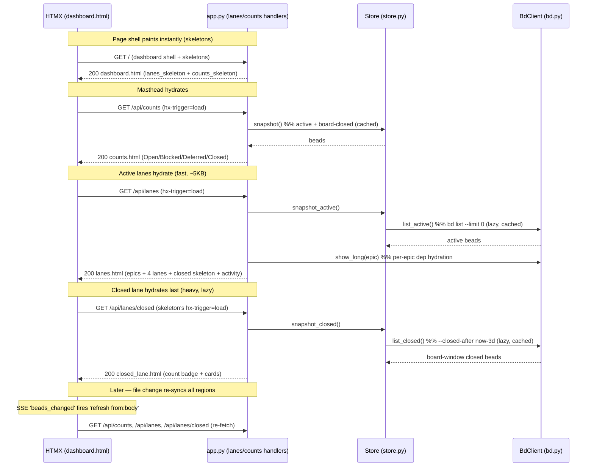

# Endpoint: Lanes API (`/api/lanes`, `/api/lanes/closed`, `/api/counts`)

## Overview

| METHOD | Path | Purpose |
| --- | --- | --- |
| GET | `/api/lanes` | Render the **active** board: the epic strip, the four open swim lanes (Deferred / Blocked / Ready / In Progress), the Closed-lane *skeleton* (a self-firing lazy-load shell), and the Activity feed. Fast path — fetches active-only data (~5KB). HTMX swaps it `innerHTML` into `.lanes-region`. |
| GET | `/api/lanes/closed` | Render the **Closed lane** content only (count + card list). Loaded separately, after the active lanes paint, because it is the heaviest part of the board (~495KB on large workspaces). HTMX swaps it `innerHTML` into the `.lane-closed` placeholder. |
| GET | `/api/counts` | Render the masthead counts strip (Open / Blocked / Deferred / Closed cells, plus any non-standard statuses). HTMX swaps it `innerHTML` into `#counts`. |

These three read-only handlers are the data surface behind the
[Board page](../Views/board-page.md). They exist as **separate** endpoints —
rather than one monolithic board render — because of a deliberate
time-to-first-paint (TTFP) split (`bdboard-0yy`): the `/` route returns an
instant skeleton shell, then HTMX `load` triggers hydrate the masthead
(`/api/counts`), the active lanes (`/api/lanes`), and finally the expensive
closed lane (`/api/lanes/closed`) in sequence. The old design awaited a full
snapshot **and** a per-epic `bd show` hydration pass before returning a single
byte, freezing the board on the bd CLI before painting a pixel. Splitting the
heavy closed payload out of the active fetch cuts the initial wire from ~500KB
to ~5KB — a ~100x reduction — at the cost of one extra background round-trip.

> [!IMPORTANT]
> All three endpoints are **pure reads**: GET only, no CSRF, no body, served
> from the in-memory [Store snapshot cache](../Concepts/store-snapshot-cache.md)
> so a render never shells `bd` on the request path. They never *mutate* bd —
> they only re-shape the cached snapshot through the pure
> [derive layer](../Concepts/derive-layer.md) (`derive.lanes`, `derive.epic_lane`,
> `derive.activity`, `derive.counts`) into HTML fragments. The split into three
> endpoints is a performance contract, not a semantic one: each is independently
> re-fetchable on the SSE `refresh from:body` trigger, so a file change re-syncs
> every region without a full page reload.

## Request

### Headers

| Header | Required | Notes |
| --- | --- | --- |
| — | None required | All three are unauthenticated GET reads. HTMX issues them with its default headers (`HX-Request: true`, `Accept: */*`); the handlers ignore them and always return the same fragment whether hit by HTMX or curl. No `X-CSRF-Token` is checked — only the mutating endpoints (memory / field-edit / pour) guard CSRF. |

> [!IMPORTANT]
> There is intentionally **no** content negotiation. Each handler is declared
> `response_class=HTMLResponse` and always returns a server-rendered HTML
> fragment — never JSON — because the board is built on
> [HTMX + server-rendered partials](../Concepts/htmx-partials-architecture.md):
> the server owns the markup, the client just swaps it in. If you want raw JSON,
> read the bd CLI directly (`bd list --json`), not these endpoints.

### Params / Query

| Name | Type | Required | Default | Validation |
| --- | --- | --- | --- | --- |
| — | — | — | — | None. None of the three endpoints accept query params. The board's time-window filter (12h / 1d / 3d) is **client-side only**: `/api/lanes/closed` always returns the full board-window closed set (bounded at fetch time by `BOARD_CLOSED_WINDOW_DAYS = 3`), and `applyBoardFilter()` in `base.html` shows/hides already-fetched cards and recomputes the visible count. The server is never re-queried on a filter change. |

> [!WARNING]
> The closed set is **date-bounded at fetch time**, not count-capped. `bd.list_closed()`
> queries `--closed-after <now − 3d>`, so the Closed lane and the masthead CLOSED
> KPI reflect the *same* 3-day window and can never disagree (`bdboard-p8v`).
> Anything closed longer than 3 days ago does **not** appear here — it lives on
> the [History page / History API](history-api.md), which has its own unbounded,
> window-aware data path. Don't reach for `/api/lanes/closed` to audit old
> closures; it will silently omit them by design.

### Body

| Field | Type | Required | Validation |
| --- | --- | --- | --- |
| — | — | — | None. All three are GET; there is no request body. |

## Response

### Success

**`GET /api/lanes` → `200 OK`**, an HTML fragment rendered from
[`partials/lanes.html`](../../src/bdboard/templates/partials/lanes.html):

- the **epic strip** (`derive.epic_lane`) — active, non-closed epics sequenced
  predecessor→successor by their `blocks` edges, with the in-progress (or
  next-ready) epic anchored to position 0;
- four **active swim lanes** — Deferred / Blocked / Ready / In Progress
  (`derive.lanes`), each sorted by priority asc then `updated_at` desc;
- the **Closed-lane skeleton** — a `.lane-closed` div carrying
  `hx-get="/api/lanes/closed"` with `hx-trigger="load, refresh from:body"`, so
  it self-fires a background fetch the instant it swaps in, and re-fetches on
  every SSE change;
- the **Activity feed** (`derive.activity`, capped at 25) — one synthesized
  "current-state-as-event" row per active bead, newest first.

**`GET /api/lanes/closed` → `200 OK`**, an HTML fragment from
[`partials/closed_lane.html`](../../src/bdboard/templates/partials/closed_lane.html):
the Closed lane's `<h2>` (with a `data-closed-count="total"` badge the
client-side filter rewrites) and the card list, sorted `closed_at` desc so the
most recent wins are most visible.

**`GET /api/counts` → `200 OK`**, an HTML fragment from
[`partials/counts.html`](../../src/bdboard/templates/partials/counts.html): a
`<dl>` of counts cells in the fixed order **Open, Blocked, Deferred, Closed**
(plus any non-standard statuses appended at the end), each carrying a stable
`data-count-status` hook. Zero-value cells render with `counts-cell-zero` so the
header geometry never jitters as counts drop to zero.

> [!IMPORTANT]
> `in_progress` is **deliberately omitted** from `/api/counts`. bdboard is a
> single-flight workflow tool — only one bead is in progress at a time — so a
> header cell flipping between 0 and 1 is pure noise. The In-Progress swim lane
> already surfaces the one active bead. (See `derive.counts` and
> `tests/test_derive_counts.py::test_counts_excludes_in_progress`.)

> [!IMPORTANT]
> Active lanes use `store.snapshot_active()` while the closed lane uses
> `store.snapshot_closed()`, but the masthead counts use the **combined**
> `store.snapshot()` (active + board-closed). This is why the CLOSED cell and
> the Closed lane share the same date-bounded set: both ultimately derive from
> the same 3-day-bounded `bd.list_closed()` fetch.

### Errors

| Status | When | Body |
| --- | --- | --- |
| `200` | bd `list` fails / cache empty (transient). | Empty-but-valid fragment. None of the three handlers raise on a missing snapshot: the Store logs the bd failure and **preserves the previous cache** (or stays empty on cold start), so the lanes render `(empty)` / `(no active epics)` / zero counts rather than a 500. Stale-but-rendered beats a flashed blank board. |
| `500` | Catastrophic template/handler error. | FastAPI's default error page. In practice unreachable for these read paths — the snapshot accessors swallow bd failures and the derive functions are total over any list shape. |

> [!WARNING]
> A blocked-by edge pointing at a **closed** bead is resolved differently on
> first paint vs after SSE refresh. `/api/lanes` fetches active-only, so
> `_has_unmet_blocking_dep` can't see the closed target in its `by_id` index and
> conservatively treats the unknown target as *unmet* → the dependent bead shows
> as **Blocked**. Once the watcher fires and the full snapshot is available, the
> dependent corrects to **Ready**. This is the explicit tradeoff for the ~100x
> payload reduction (`bdboard-0yy`); it is self-healing, not a bug.

## Implementation Map

| Concern | Where |
| --- | --- |
| `/api/lanes` handler | [`src/bdboard/app.py:api_lanes`](../../src/bdboard/app.py) |
| `/api/lanes/closed` handler | [`src/bdboard/app.py:api_lanes_closed`](../../src/bdboard/app.py) |
| `/api/counts` handler | [`src/bdboard/app.py:api_counts`](../../src/bdboard/app.py) |
| Epic dependency hydration | [`src/bdboard/app.py:_hydrate_epic_dependencies`](../../src/bdboard/app.py) (per-epic `bd show --long` to graft `dependencies` onto the active snapshot; only `/api/lanes` pays this) |
| Active snapshot | [`src/bdboard/store.py:Store.snapshot_active`](../../src/bdboard/store.py) → [`bd.py:BdClient.list_active`](../../src/bdboard/bd.py) (`bd list --limit 0`) |
| Closed snapshot | [`src/bdboard/store.py:Store.snapshot_closed`](../../src/bdboard/store.py) → [`bd.py:BdClient.list_closed`](../../src/bdboard/bd.py) (`bd list --status closed --closed-after <now−3d> --sort closed --limit 0`) |
| Combined snapshot (counts) | [`src/bdboard/store.py:Store.snapshot`](../../src/bdboard/store.py) (active + board-closed) |
| Lane bucketing | [`src/bdboard/derive/lanes.py:lanes`](../../src/bdboard/derive/lanes.py) |
| Epic strip sequencing | [`src/bdboard/derive/lanes.py:epic_lane`](../../src/bdboard/derive/lanes.py) (topo order over `blocks` edges, anchored by `_epic_lane_rank`) |
| Activity feed | [`src/bdboard/derive/lanes.py:activity`](../../src/bdboard/derive/lanes.py) |
| Counts | [`src/bdboard/derive/lanes.py:counts`](../../src/bdboard/derive/lanes.py) |
| Board window constant | `BOARD_CLOSED_WINDOW_DAYS = 3` in [`src/bdboard/derive/lanes.py`](../../src/bdboard/derive/lanes.py) |
| Active-lanes template | [`partials/lanes.html`](../../src/bdboard/templates/partials/lanes.html) |
| Closed-lane template | [`partials/closed_lane.html`](../../src/bdboard/templates/partials/closed_lane.html) |
| Counts template | [`partials/counts.html`](../../src/bdboard/templates/partials/counts.html) |
| Skeleton shells | [`partials/lanes_skeleton.html`](../../src/bdboard/templates/partials/lanes_skeleton.html), [`partials/counts_skeleton.html`](../../src/bdboard/templates/partials/counts_skeleton.html) |
| Page shell + HTMX `load` wiring | [`templates/dashboard.html`](../../src/bdboard/templates/dashboard.html) |
| Client-side time filter + count sync | `applyBoardFilter` / `syncMastheadClosedCount` in [`templates/base.html`](../../src/bdboard/templates/base.html) |

> [!CAUTION]
> Do **not** add a server-side `?window=` query param to `/api/lanes/closed` to
> "support" the 12h/1d/3d filter. The filter is intentionally client-only: the
> server ships the full 3-day window once and `applyBoardFilter()` narrows it in
> the browser, feeding the **same** `visibleCount` into both the Closed-lane
> badge and the masthead CLOSED cell so the two can never drift at the window
> boundary (`bdboard-de4z`). A server param would reintroduce a client-now vs
> server-now skew and a redundant fetch per filter click. See
> `tests/test_board_counts_filter_sync.py`.

> [!CAUTION]
> Do **not** widen `/api/lanes` to fetch the full (active + closed) snapshot
> "to fix" the blocked-by edge cases above. That re-merges the ~495KB closed
> payload into the first paint and undoes the entire `bdboard-0yy` TTFP win. The
> conservative-blocked-then-correct-on-SSE behavior is the accepted price.

## Diagram



## curl example

```sh
# Active board: epic strip + 4 open lanes + closed skeleton + activity.
curl -s "http://127.0.0.1:7332/api/lanes"

# Closed lane only (the heavy, lazy-loaded fragment).
curl -s "http://127.0.0.1:7332/api/lanes/closed"

# Masthead counts strip (Open / Blocked / Deferred / Closed cells).
curl -s "http://127.0.0.1:7332/api/counts"
```

> [!IMPORTANT]
> All three return HTML *fragments*, not full pages — they're designed to be
> swapped into an existing DOM by HTMX. Hitting them with curl is great for
> eyeballing the shape, but you'll get bare `<section>`/`<div>`/`<dl>` markup
> with no `<html>` wrapper. `7332` is bdboard's default port (it auto-scans
> 7332..7351 if taken — see [`cli.py`](../../src/bdboard/cli.py)); adjust if the
> server picked a different one.

## Testing

The pure derive functions these endpoints render are covered directly (no
TestClient needed, because the handlers are thin wrappers over the cache + derive):

- **Counts** — [`tests/test_derive_counts.py`](../../tests/test_derive_counts.py):
  fixed status set even when empty, `in_progress` exclusion, stable order with
  mixed data, custom statuses appended at the end, case-insensitivity.
- **Lane bucketing** — [`tests/test_deferred_fallback.py`](../../tests/test_deferred_fallback.py):
  `deferred` status lands in the Deferred lane and any *unknown* status falls
  back to Deferred (catch-all), with a comprehensive all-statuses bucketing test.
- **Epic strip** — [`tests/test_derive_epics.py`](../../tests/test_derive_epics.py):
  `epic_lane` sequencing (predecessor→successor topo order), anchoring of the
  in-progress / next-ready epic, and exclusion of closed epics.
- **Filter ↔ count sync (markup/wiring)** —
  [`tests/test_board_counts_filter_sync.py`](../../tests/test_board_counts_filter_sync.py):
  asserts `counts.html` carries the `data-count-status` hooks and that
  `base.html`'s `applyBoardFilter` feeds the same `visibleCount` into both the
  Closed-lane badge and the masthead CLOSED cell (so header and lanes can't
  diverge at the window boundary), gated behind the real closed-lane content.
- **Closed-window data path** —
  [`tests/test_bd_closed_history.py`](../../tests/test_bd_closed_history.py) and
  [`tests/test_store_history_window.py`](../../tests/test_store_history_window.py)
  exercise the board-closed vs history-closed split that `snapshot_closed()`
  relies on.

## Related

- [View: Board page](../Views/board-page.md) — the page these three endpoints hydrate (skeleton shell, HTMX `load` triggers, client-side time filter).
- [Endpoint: History API](history-api.md) — the long-window retrospective surface for closures older than the board's 3-day window; complements `/api/lanes/closed`.
- [Endpoint: Bead detail API](bead-detail-api.md) — what every lane card / epic chip / activity row opens when clicked (`hx-get="/api/bead/{id}"`).
- [Concept: bd CLI as runtime source of truth](../Concepts/bd-cli-source-of-truth.md) — why the snapshot is a `bd list` subprocess, not a direct DB read.
- [Concept: Store snapshot cache & change detection](../Concepts/store-snapshot-cache.md) — the active / board-closed / history caches these handlers read, and the lazy-load + refresh machinery behind them.
- [Concept: Derive layer (pure view shaping)](../Concepts/derive-layer.md) — the pure `lanes` / `epic_lane` / `activity` / `counts` functions that shape the snapshot into board data.
- [Concept: Watcher debounce/cooldown & self-feedback skip](../Concepts/watcher-scheduling.md) — the watcher that fires the `beads_changed` SSE event driving the `refresh from:body` re-fetch of all three regions.
- [Concept: HTMX + server-rendered partials](../Concepts/htmx-partials-architecture.md) — why every response is an HTML fragment swapped in place, and why the board is split into three lazy-hydrated regions.
