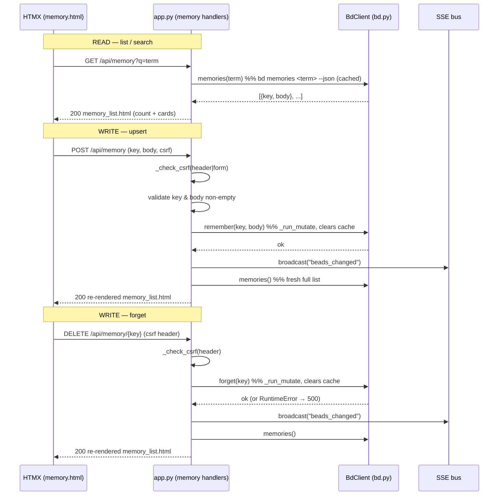

# Endpoint: Memory API (`/api/memory` GET / POST / DELETE)

## Overview

| METHOD | Path | Purpose |
| --- | --- | --- |
| GET | `/api/memory?q=<term>` | Render the memory-list region (HTMX swap target). Empty `q` lists all memories; a non-empty `q` runs bd's own server-side search. |
| POST | `/api/memory` | **Upsert** one memory via `bd remember` (create if the key is new, replace its body if the key exists), then re-render the full list for an HTMX swap. |
| DELETE | `/api/memory/{key}` | **Forget** one memory via `bd forget`, then re-render the full list for an HTMX swap. |

These three handlers are the read + write surface behind the
[Memory page](../Views/memory-page.md). They exist because bd "memories" are
injected at `bd prime` — they shape every future agent session — so curating
them needs a first-class UI rather than only the `bd remember` / `bd forget`
CLI. The write half is bdboard's **first** write path to bd; it set the posture
(per-process CSRF guard + serialized subprocess mutation + optimistic re-render
+ SSE broadcast) that the [bead field-edit API](bead-field-edit-api.md) and the
[Formulas pour API](formulas-api.md) later reused.

> [!IMPORTANT]
> The server never trusts the client to decide bd semantics. The GET handler
> always delegates substring matching to bd (`bd memories <term> --json`) rather
> than filtering in the browser, so the displayed set is exactly what the CLI
> would show. POST is **upsert by key** — there is no separate "edit" endpoint;
> the edit dialog simply re-POSTs with the same key and a readonly key field,
> because `bd remember` already replaces an existing key's body.

## Request

### Headers

| Header | Required | Notes |
| --- | --- | --- |
| `X-CSRF-Token` | POST/DELETE: one of header **or** form field. GET: not required. | Per-process CSRF token minted at startup (`_CSRF_TOKEN`). HTMX sends it via `hx-headers` on the create form and the forget-confirm button in [`templates/memory.html`](../../src/bdboard/templates/memory.html). |
| `Content-Type` | POST only | `application/x-www-form-urlencoded` — the create dialog is a standard HTML form post (HTMX default). |

> [!IMPORTANT]
> GET is a pure read and carries **no** CSRF requirement — only the two mutating
> verbs (POST, DELETE) call `_check_csrf`. DELETE accepts the token **only** via
> the `X-CSRF-Token` header (`_check_csrf(x_csrf_token, None)`); it has no form
> body, so there is no form-field fallback for deletes.

### Params / Query

| Name | Type | Required | Default | Validation |
| --- | --- | --- | --- | --- |
| `q` (GET) | query string | No | `""` | `.strip()`ed. Empty ⇒ list all. Non-empty ⇒ passed verbatim to `bd memories <term> --json`, which performs a case-insensitive substring match across key and body. No client-side regex/sanitisation — bd owns the match semantics. |
| `key` (DELETE) | path string (`{key:path}`) | Yes | — | Declared as `:path` so keys containing `/` survive routing. `.strip()`ed in the handler; empty ⇒ `400`. Passed to `bd forget <key>`; a non-existent key makes bd exit non-zero → surfaced as `500`. |

### Body

POST form fields (the create/edit dialog):

| Field | Type | Required | Validation |
| --- | --- | --- | --- |
| `key` | string | Yes (`Form(...)`) | `.strip()`ed; empty/whitespace ⇒ `400` "Key cannot be empty." Used as the `--key` flag value for `bd remember`. |
| `body` | string | Yes (`Form(...)`) | `.strip()`ed; empty/whitespace ⇒ `400` "Body cannot be empty." Passed as the positional body argument to `bd remember`. Rendered later through the shared `md` Jinja filter, so markdown is supported. |
| `csrf_token` | string | One of header **or** this field | Fallback CSRF token for non-JS form posts; checked against `_CSRF_TOKEN` when the `X-CSRF-Token` header is absent. |

## Response

### Success

**GET → `200 OK`**, body is an **HTML fragment** rendered from
[`partials/memory_list.html`](../../src/bdboard/templates/partials/memory_list.html):
an `aria-live` result-count line followed by either the memory cards (each with
an edit and a forget affordance) or a context-appropriate empty state
("No memories matching …" vs the first-run "No memories yet…" nudge). HTMX
swaps it `innerHTML` into `#memory-list`.

**POST → `200 OK`** on a successful upsert: the handler broadcasts SSE, then
re-reads via `bd.memories()` (no query) and returns the **full** re-rendered
`memory_list.html`. This optimistic refresh means the acting user sees their new
or updated card immediately, without waiting for the watcher's debounced SSE
round-trip.

**DELETE → `200 OK`** on a successful forget: same shape — SSE broadcast, then a
fresh full-list render so the deleted card disappears at once.

> [!IMPORTANT]
> Both mutations re-render the **unfiltered** list (`query=""`), not the
> filtered view the user may have been searching. This is a deliberate
> simplification: after a write, the UI returns to the canonical full list
> rather than trying to re-apply a stale search term server-side.

### Errors

| Status | When | Body |
| --- | --- | --- |
| `403` | POST/DELETE with missing/invalid CSRF token (`_check_csrf` raises `HTTPException`). | FastAPI error: "Invalid or missing CSRF token. Please refresh the page and try again." |
| `400` | POST with empty/whitespace `key`. | `<p class="memory-error" role="alert">Key cannot be empty.</p>` |
| `400` | POST with empty/whitespace `body`. | `<p class="memory-error" role="alert">Body cannot be empty.</p>` |
| `400` | DELETE with empty `key` (after strip). | `<p class="memory-error" role="alert">Key cannot be empty.</p>` |
| `500` | POST: `bd remember` subprocess failed (`RuntimeError`, bd's stderr surfaced). | `<p class="memory-error" role="alert">Could not save: <err></p>` |
| `500` | DELETE: `bd forget` failed — including **key-not-found**, which bd reports as a non-zero exit. | `<p class="memory-error" role="alert">Could not delete: <err></p>` |

> [!WARNING]
> The **GET** handler never returns an error status. If `bd.memories()` raises
> (subprocess failure / malformed JSON), the handler logs a warning and returns
> a friendly **`200`** placeholder ("Couldn't load memories right now. Please
> try again in a moment.") so a transient bd hiccup degrades gracefully instead
> of leaving a broken swap target. Error bodies for the mutating verbs are HTML
> fragments with `role="alert"`, not JSON.

## Implementation Map

| Concern | Where |
| --- | --- |
| GET handler | [`src/bdboard/app.py:api_memory`](../../src/bdboard/app.py) |
| POST handler | [`src/bdboard/app.py:api_memory_create`](../../src/bdboard/app.py) |
| DELETE handler | [`src/bdboard/app.py:api_memory_delete`](../../src/bdboard/app.py) |
| CSRF guard | [`src/bdboard/app.py:_check_csrf`](../../src/bdboard/app.py) (token `_CSRF_TOKEN`) |
| Read wrapper | [`src/bdboard/bd.py:BdClient.memories`](../../src/bdboard/bd.py) (cached, in-flight deduped; strips the `schema_version` sentinel; sorts by key) |
| Create wrapper | [`src/bdboard/bd.py:BdClient.remember`](../../src/bdboard/bd.py) → `bd remember <body> --key <key>` |
| Delete wrapper | [`src/bdboard/bd.py:BdClient.forget`](../../src/bdboard/bd.py) → `bd forget <key>` |
| Mutation runner | [`src/bdboard/bd.py:BdClient._run_mutate`](../../src/bdboard/bd.py) (serialized on `_subprocess_gate`) |
| Cache invalidation | `self._memories_cache.clear()` inside `remember` / `forget` |
| SSE broadcast | `bus.broadcast("beads_changed")` (the watcher fires the same event on `.beads/` change — see [Concept: Watcher debounce/cooldown & self-feedback skip](../Concepts/watcher-scheduling.md)) |
| List partial | [`partials/memory_list.html`](../../src/bdboard/templates/partials/memory_list.html) |
| Page + client wiring | [`templates/memory.html`](../../src/bdboard/templates/memory.html) (search, create dialog, confirm-before-forget dialog) |

> [!CAUTION]
> Do **not** add a client-side or in-`memories()` substring filter "for speed".
> The single source of truth for what a search term matches is bd itself
> (`bd memories <term> --json`). Re-implementing the match in the browser or in
> Python would drift from the CLI and silently show a different set than
> `bd memories` would — defeating the whole point of mirroring bd. See
> [Concept: bd CLI as runtime source of truth](../Concepts/bd-cli-source-of-truth.md).

## Diagram



## curl example

```sh
# 1) List all memories (HTML fragment).
curl -s "http://127.0.0.1:7332/api/memory"

# 2) Search memories whose key/body contain "workflow".
curl -s "http://127.0.0.1:7332/api/memory?q=workflow"

# 3) Upsert a memory. TOKEN is the per-process CSRF token from the running
#    page (hidden csrf_token input / X-CSRF-Token header); replace it.
curl -s -X POST "http://127.0.0.1:7332/api/memory" \
  -H "X-CSRF-Token: TOKEN" \
  --data-urlencode "key=dev-workflow" \
  --data-urlencode "body=Always run ruff before committing." \
  --data-urlencode "csrf_token=TOKEN"

# 4) Forget a memory (header-only CSRF; key is path-encoded).
curl -s -X DELETE "http://127.0.0.1:7332/api/memory/dev-workflow" \
  -H "X-CSRF-Token: TOKEN"
```

> [!WARNING]
> `bd forget` is irreversible and memories feed `bd prime`, so a stray delete
> silently degrades every future agent session that relied on that memory. The
> UI deliberately gates deletes behind a confirm-before-forget `<dialog>`
> (see [`memory.html`](../../src/bdboard/templates/memory.html)); scripts hitting
> this endpoint directly bypass that friction — handle with care.

## Testing

Route behaviour is covered by
[`tests/test_memory_mutations.py`](../../tests/test_memory_mutations.py), which
stubs `bd.remember` / `bd.forget` / `bd.memories` / `bus.broadcast` so the
handler logic runs without shelling a real `bd`:

- **CSRF** — `test_create_memory_requires_csrf_token` and
  `test_delete_memory_requires_csrf_token` (403 without a token);
  `test_create_memory_accepts_valid_csrf_header` /
  `test_create_memory_accepts_valid_csrf_form_field` (header and form-field
  paths both work);
  `test_delete_memory_accepts_valid_csrf_and_forgets` (header path forwards the
  exact key to `bd.forget`).
- **Validation** — `test_create_memory_rejects_empty_key` and
  `test_create_memory_rejects_empty_body` (400 + inline error fragment).
- **SSE fan-out** — `test_create_memory_broadcasts_sse_on_success` and
  `test_delete_memory_broadcasts_sse_on_success` assert `beads_changed` is
  broadcast after a successful write.
- **Error surfacing** — `test_create_memory_shows_error_on_bd_failure` (500 +
  "Could not save") and `test_delete_memory_shows_error_on_bd_failure` (500 +
  "Could not delete", including the bd "key not found" stderr).

The `BdClient.memories` read path (cached + dedup + `schema_version` stripping +
sorting) is exercised through the shared `_cached` machinery the rest of the
client relies on.

## Related

- [View: Memory page](../Views/memory-page.md) — the page these handlers read into and write back to (search, create/edit dialog, confirm-before-forget dialog).
- [Endpoint: Bead field-edit API](bead-field-edit-api.md) — sibling write path that inherited this endpoint's CSRF + serialized-mutation + optimistic-refresh posture.
- [Endpoint: Formulas API](formulas-api.md) — the other write surface sharing the same `_run_mutate` + SSE-broadcast pattern.
- [Concept: bd CLI as runtime source of truth](../Concepts/bd-cli-source-of-truth.md) — why every read and write is a `bd` subprocess and search is delegated to bd.
- [Concept: Store snapshot cache & change detection](../Concepts/store-snapshot-cache.md) — the cache layer `memories()` uses and `remember`/`forget` invalidate.
- [Concept: Watcher debounce/cooldown & self-feedback skip](../Concepts/watcher-scheduling.md) — the watcher that fires the `beads_changed` SSE event when `.beads/` changes, fanning memory writes out to other tabs and complementing the optimistic re-render.
- [Concept: HTMX + server-rendered partials](../Concepts/htmx-partials-architecture.md) — why every response is an HTML fragment swapped in place.
