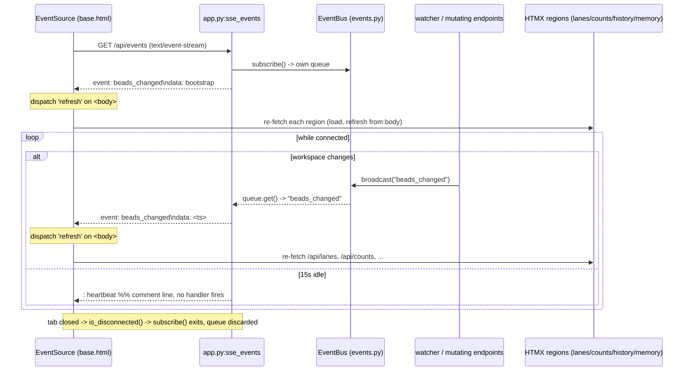

# Endpoint: SSE events (`/api/events`)

## Overview

| METHOD | Path | Purpose |
| --- | --- | --- |
| GET | `/api/events` | Open a long-lived **Server-Sent Events** stream. The browser subscribes **once per page load**; every workspace data change pushes a `beads_changed` event that makes the page re-fetch its live regions (lanes, counts, closed lane, history, memory) without a full reload. A periodic heartbeat keeps the connection alive through idle-killing proxies. |

This is the single push channel behind bdboard's live auto-refresh. Instead of
every region long-polling the bd CLI on a timer, the server watches the
workspace once (see the [watcher](../Concepts/watcher-scheduling.md)) and
fans a single `beads_changed` signal out to all connected tabs over this
stream. The client turns that one server event into a synthetic `refresh`
DOM event on `<body>`, and every HTMX region wired with
`hx-trigger="... refresh from:body"` re-fetches its own HTML partial. The
result is sub-second, push-driven freshness with exactly one watcher and one
stream per tab — not N pollers per region.

> [!IMPORTANT]
> `/api/events` is the *transport*, not the *data*. It never carries bead
> payloads — only a content-free `beads_changed` signal (plus heartbeats). The
> actual refreshed markup is pulled by the region endpoints
> ([`/api/lanes`, `/api/counts`, `/api/lanes/closed`](lanes-api.md),
> [`/api/history`](history-api.md), [`/api/memory`](memory-api.md)) when they
> hear the `refresh` DOM event. Decoupling the signal from the data keeps the
> stream tiny and lets each region decide independently what (and whether) to
> re-render. This is the same [HTMX + server-rendered partials](../Concepts/htmx-partials-architecture.md)
> contract the rest of the app follows.

## Request

### Headers

| Header | Required | Notes |
| --- | --- | --- |
| `Accept: text/event-stream` | No (advisory) | The browser's `EventSource` sends this automatically. The handler does not enforce it — it always responds with `media_type="text/event-stream"` regardless — but it documents intent and lets intermediaries treat the response as a stream. |
| — | None required | The endpoint is an **unauthenticated GET**. No `X-CSRF-Token`, no cookies, no custom headers are read. CSRF is irrelevant here: the stream is read-only and mutates nothing (only the memory / field-edit / pour endpoints guard CSRF). |

> [!IMPORTANT]
> The handler sets two response headers deliberately:
> `Cache-Control: no-cache` (an SSE stream must never be cached) and
> `X-Accel-Buffering: no` (tells nginx **not** to buffer the response, so events
> arrive immediately rather than being held until a buffer fills). Without the
> latter, a proxied deployment can sit on events for seconds and the live dot
> will look stalled even though the server is pushing.

### Params / Query

| Name | Type | Required | Default | Validation |
| --- | --- | --- | --- | --- |
| — | — | — | — | None. `/api/events` accepts **no** query params. The stream is identical for every client; there is no filtering, no cursor, and no per-tab customization. A tab that wants different data fetches a different region endpoint when it hears the signal — the stream itself is one-size-fits-all. |

### Body

| Field | Type | Required | Validation |
| --- | --- | --- | --- |
| — | — | — | None. This is a GET; there is no request body. |

## Response

### Success

**`GET /api/events` → `200 OK`**, `Content-Type: text/event-stream`, an
**unbounded streaming response** (`StreamingResponse` over an async generator).
The stream emits three kinds of line-framed records:

1. **Bootstrap event** — emitted exactly once, the instant a client connects:

   ```
   event: beads_changed
   data: bootstrap

   ```

   This makes a freshly connected tab render immediately rather than waiting
   for the first file change. The client's `beads_changed` listener fires a
   `refresh`, so every region hydrates from real data on connect.

2. **Change events** — emitted whenever the watcher broadcasts `beads_changed`
   (a debounced file change) or a mutating endpoint broadcasts after a
   successful write. `data` carries a unix timestamp purely as a unique,
   monotonic marker (the client ignores its value — any `beads_changed` means
   "re-fetch"):

   ```
   event: beads_changed
   data: 1717327496

   ```

3. **Heartbeat** — emitted every `15.0` seconds of silence as an SSE
   **comment line** (a line starting with `:`). Comment lines keep the TCP
   connection and any intermediaries alive **without** triggering any
   client-side event handler, so a heartbeat never causes a refresh:

   ```
   : heartbeat

   ```

The generator loops until `request.is_disconnected()` returns true (tab closed
/ navigated away), at which point the `async with bus.subscribe()` context exits
and the subscriber queue is discarded from the [EventBus](../../src/bdboard/events.py).

> [!IMPORTANT]
> The 15s heartbeat is chosen against a typical proxy/load-balancer idle
> timeout of 30–60s, leaving comfortable margin so the connection is refreshed
> at least twice before any intermediary would consider it idle. It is *not* a
> data poll — it carries no information beyond "still here".

### Errors

| Status | When | Body |
| --- | --- | --- |
| `200` | Normal case — including a totally idle workspace. | The stream stays open and emits only heartbeats until something changes. There is no "no data" error; quiet is the success state. |
| `200` (then closes) | Client disconnects (tab closed, navigation, network drop). | The generator's `request.is_disconnected()` check breaks the loop, the `subscribe()` context tears down, and the connection closes cleanly server-side. The browser's `EventSource` auto-reconnects with exponential backoff — no server action needed. |
| (dropped event) | A subscriber's bounded queue (size 16) overflows because the client fell far behind. | **Not surfaced as an HTTP error.** The [EventBus](../../src/bdboard/events.py) drops the *oldest* queued event to make room (lossy-but-safe backpressure). Losing an event is harmless: the *next* `beads_changed` triggers the same full region re-fetch, so a dropped signal only costs a brief freshness blip, never correctness. |

> [!WARNING]
> Events are **fire-and-forget and lossy by design**. The per-subscriber queue
> is intentionally small (`_QUEUE_SIZE = 16` in
> [`events.py`](../../src/bdboard/events.py)); a slow client is allowed to miss
> events rather than back-pressure the watcher. Do **not** build any client
> logic that assumes it sees *every* `beads_changed` or that `data`'s timestamp
> forms a gap-free sequence. The contract is "you will be told, eventually, that
> something changed" — react by re-fetching whole regions, never by trying to
> apply a delta.

> [!CAUTION]
> Do **not** widen this endpoint to push bead *data* (lane HTML, JSON diffs,
> etc.) down the stream. That would re-couple the transport to the view, defeat
> the per-region lazy-fetch split, and turn a tiny signal into a fat,
> per-tab-customized payload — reintroducing exactly the monolithic-render cost
> the region-endpoint split (`bdboard-0yy`) exists to avoid. The stream stays a
> dumb doorbell; the regions stay the data surface.

## Implementation Map

| Concern | Where |
| --- | --- |
| Handler / stream generator | [`src/bdboard/app.py:sse_events`](../../src/bdboard/app.py) |
| Event bus (pub/sub fanout) | [`src/bdboard/events.py:EventBus`](../../src/bdboard/events.py) (`subscribe()` async-context queue, `broadcast()` non-blocking push) |
| Bus instance | `bus = EventBus()` in [`src/bdboard/app.py`](../../src/bdboard/app.py) |
| Heartbeat interval | `asyncio.wait_for(..., timeout=15.0)` inside `sse_events` ([`app.py`](../../src/bdboard/app.py)) |
| Subscriber queue size | `_QUEUE_SIZE = 16` in [`src/bdboard/events.py`](../../src/bdboard/events.py) |
| Watcher → broadcast wiring | `broadcast=lambda: bus.broadcast("beads_changed")` in the watcher's `RefreshScheduler` ([`app.py`](../../src/bdboard/app.py), [`watcher.py`](../../src/bdboard/watcher.py)) |
| Mutation → broadcast call sites | `await bus.broadcast("beads_changed")` after memory write/delete, field-edit, and formula pour in [`app.py`](../../src/bdboard/app.py) |
| Client subscription + dispatch | `new EventSource('/api/events')` → fires `refresh` on `<body>` in [`templates/base.html`](../../src/bdboard/templates/base.html) |
| Live-status indicator | `#live-dot` / `#live-status` markup + `open`/`error` listeners in [`templates/base.html`](../../src/bdboard/templates/base.html) |
| Region re-fetch triggers | `hx-trigger="load, refresh from:body"` on `.lanes-region`, `#counts`, `.lane-closed`, `#history-region`, `#memory-list` (dashboard / history / memory templates) |

> [!IMPORTANT]
> There is **one** `EventBus` and **one** watcher per server process, but **one
> stream (and one subscriber queue) per open tab**. `broadcast()` is O(N) over
> open tabs — fine for the dozens-of-tabs scale bdboard targets, not thousands.
> Every tab sees every event independently because each holds its own queue;
> that is the whole reason the bus uses per-subscriber queues instead of a
> single shared one.

## Diagram



## curl example

```sh
# Tail the live event stream. -N disables curl's output buffering so you see
# events as they arrive. You'll get an immediate `beads_changed / bootstrap`,
# then a `: heartbeat` every 15s, then a `beads_changed` each time you touch
# the workspace (e.g. run `bd update <id> ...` in another shell).
curl -sN "http://127.0.0.1:7332/api/events"
```

> [!IMPORTANT]
> This stream **never terminates on its own** — `curl` will hang open by
> design until you Ctrl-C it or the server stops. `7332` is bdboard's default
> port (it auto-scans 7332..7351 if taken — see
> [`cli.py`](../../src/bdboard/cli.py)); adjust if the server picked another.

## Related

- [Endpoint: Lanes API (`/api/lanes`, `/api/lanes/closed`, `/api/counts`)](lanes-api.md) — the board regions this stream triggers to re-fetch on `refresh from:body`.
- [Endpoint: History API (`/api/history`)](history-api.md) — another region that re-renders on the `beads_changed` signal (preserving its active window).
- [Endpoint: Memory API (`/api/memory`)](memory-api.md) — a *producer* of `beads_changed` (broadcasts after a write/delete) **and** a consumer (its list re-fetches on the signal).
- [Endpoint: Bead field-edit API (`POST /api/bead/{id}/field`)](bead-field-edit-api.md) — broadcasts `beads_changed` after a successful inline edit so all tabs converge.
- [Endpoint: Formulas API (`/api/formulas`, form, pour)](formulas-api.md) — broadcasts `beads_changed` after a pour fans out new beads.
- [Concept: Watcher debounce/cooldown & self-feedback skip](../Concepts/watcher-scheduling.md) — the filesystem watcher whose debounced output is the primary source of `beads_changed` broadcasts.
- [Concept: HTMX + server-rendered partials](../Concepts/htmx-partials-architecture.md) — why the stream carries a signal and the regions own the markup, not the other way around.
- [Concept: Store snapshot cache & change detection](../Concepts/store-snapshot-cache.md) — the cache the region endpoints read when a `beads_changed`-driven re-fetch lands.
- [Concept: bd CLI as runtime source of truth](../Concepts/bd-cli-source-of-truth.md) — why a file change (not a DB notification) is what ultimately wakes this stream.
- [View: Board page](../Views/board-page.md) — the page that opens this stream and binds its regions to the `refresh` event.
