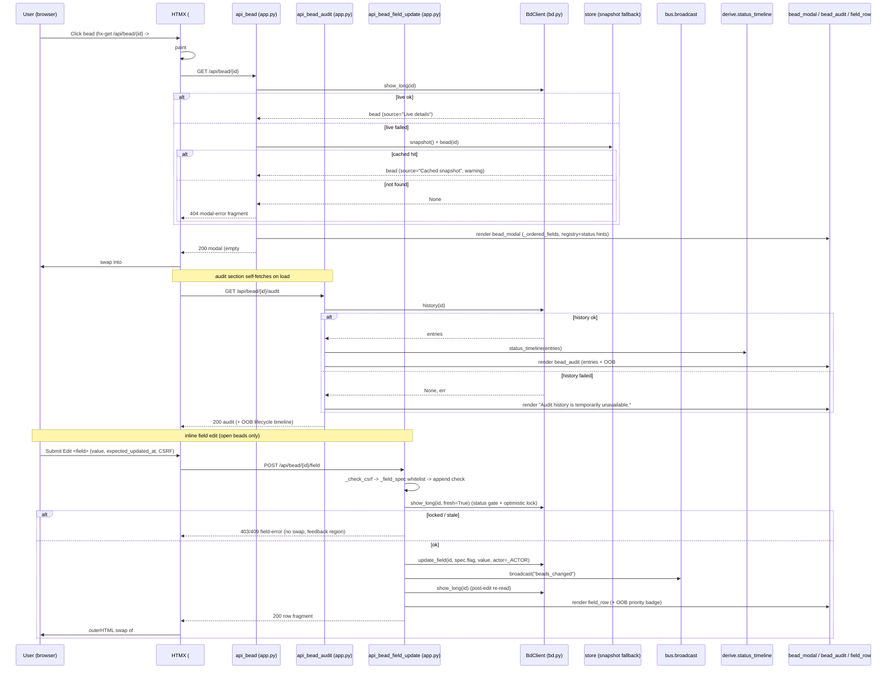

# Bead Detail & Inline Editing

## What It Does

Click any bead — a card on the board, an epic chip, a dependency link, an
activity row, or a closed card on `/history` — and a modal opens showing **every
field bd knows** about it, a lazily-loaded lifecycle timeline + audit trail, and
a "raw JSON" escape hatch. For **open** beads, each whitelisted field carries an
inline editor (and `notes` an append-only "Add a note" box) that saves a single
field via `bd update` and swaps just that row back in place — no full-page
reload, no JSON on the wire.

## Why It Exists

The board and history surfaces are deliberately terse — a card shows id, title,
priority, status, and a timestamp, nothing more. But a bead carries far richer
content (description, acceptance criteria, dependency graph, notes, audit
history) that you frequently need to *read in full* and occasionally need to
*correct* without dropping to a terminal. This feature is the single place that
satisfies both needs from one shared `#bead-modal` host:

- **One read source, many entry points.** Every clickable bead reference across
  the app (`hx-get="/api/bead/{id}" hx-target="#bead-modal"`) opens the *same*
  modal, so there is exactly one bead-detail render path to reason about and
  test — not one per surface.
- **Edit in place, safely.** Manual field editing is the *only* path in bdboard
  that mutates bead **content** (everything else is read-only or
  lifecycle-only). Because that's where a human can clobber data, it's fenced on
  every axis: a **registry whitelist** decides *which* fields are editable and
  *which* `bd update` flag to use (the client never picks the flag), a **status
  gate** decides *when* (only open beads), an **optimistic lock** stops a stale
  tab from silently overwriting a concurrent edit, a **CSRF token** guards the
  mutating POST, and `notes` is pinned to **append-only** so verification
  history is never replaced.
- **Failure-tolerant by design.** A flaky `bd show` degrades to the cached
  snapshot with a warning banner rather than a blank modal; a flaky `bd history`
  renders a friendly "unavailable" partial instead of breaking the open modal;
  `/raw` returns an `{"error": …}` object rather than a 5xx. Only a genuinely
  unknown bead is a hard `404`.

It reuses the same `bd`-as-source-of-truth, snapshot-cache, pure-derive (for the
lifecycle timeline), HTMX-partial, and SSE live-refresh machinery as the rest of
the app, so the whole feature is one shared modal region with zero bespoke
infrastructure.

## How It Works

### User Perspective

- **Open a bead.** Click a card / epic chip / dependency id / activity row (on
  `/`) or a closed card (on `/history`). HTMX paints an instant skeleton into
  `#bead-modal` (from the `<template id="bead-modal-skeleton">` in `base.html`),
  then swaps in the rendered modal from `GET /api/bead/{id}`: a header (id,
  priority badge, status chip, title, optional cached-data warning, and a "raw
  JSON" link), an empty lifecycle slot, the `field-grid` of every field, and an
  audit section that self-fetches.
- **See the lifecycle + audit trail.** The audit `<section>` fires
  `hx-trigger="load"` → `GET /api/bead/{id}/audit`, which paints the
  field-by-field change log **and** swaps a status-transition timeline
  (open → in_progress → closed with dwell times) **out-of-band** into the
  `#lifecycle-slot` at the top of the modal. One fetch, two render targets.
- **Read raw JSON.** The header's "raw JSON" link opens
  `GET /api/bead/{id}/raw` in a new tab — every field bd emits, unstyled.
- **Edit an open bead's field.** Each editable field row has an `Edit <field>`
  `<details>` disclosure. Open it (focus jumps into the control), change the
  value, and **Save**. The row swaps in place showing the new value; a
  `priority` edit also refreshes the modal-header badge in the same swap.
- **Add a note.** The `notes` row offers `+ Add a note` — a fresh, empty box
  whose content is **appended** below the existing notes (never a replace), so
  agent verification history is preserved.
- **What you can't edit.** Lifecycle/shape/immutable fields (`status`,
  `parent`, `id`, `story_points`, timestamps, `labels`, derived counts) render
  read-only with no editor. A claimed (`in_progress`) or closed bead shows *no*
  edit affordances at all — even on otherwise-editable fields.
- **Errors never wipe your work.** A rejected save (CSRF/stale/locked/bd error)
  shows the server's message in a polite aria-live region under the form; the
  row is left intact for a retry.
- **It stays live.** A field edit (or any `.beads/` change) broadcasts a
  `beads_changed` SSE pulse so other open tabs re-fetch their regions.

### System Perspective

Every clickable bead reference targets `#bead-modal` with
`hx-get="/api/bead/{id}"`. The **read** route `api_bead` (`src/bdboard/app.py`)
prefers a live `bd show {id} --long --json` via `BdClient.show_long`; if that
fails it falls back to the cached `store.bead(id)` snapshot (setting
`source="Cached snapshot"` and a warning banner), and only if *both* miss does
it return a `404` modal-error fragment. It renders `partials/bead_modal.html`
with `_ordered_fields(bead)` — each row decorated with render hints
(`_classify_field`) **and** editability hints from the `_FIELD_REGISTRY`
(`_field_spec`), gated by the bead's lifecycle status (`_bead_is_editable`). The
modal's audit section self-fetches `api_bead_audit`, which reads
`bd history {id} --json` once and feeds **both** the diffed change rows
(`_shape_audit` → `_diff_issue`) and the pure status-transition timeline
(`derive.status_timeline`) — one subprocess, two views.

The **write** route `api_bead_field_update` runs a fixed, heavily-hedged
pipeline: `_check_csrf` → `_field_spec` editability whitelist → append-only
emptiness check → a **single LIVE (cache-bypassing) re-read** that does double
duty as the status gate (`_bead_is_editable`) **and** the optimistic-lock
precondition (`expected_updated_at` vs live `updated_at`) → one serialized
`bd update <id> <flag> <value>` (`BdClient.update_field`, long markdown streamed
on stdin) → `bus.broadcast("beads_changed")` → optimistic re-read →
re-render of just the affected `partials/field_row.html` (plus an out-of-band
priority badge when `field == "priority"`). All responses are HTML fragments;
`base.html`'s `htmx:beforeSwap` cancels the swap on any `4xx`/`5xx` so a failed
save routes its error into the row's `[data-edit-feedback]` region without
wiping the row.



## Key Data Shapes

The feature is HTML-fragment in/out on the wire (except `/raw`, which is JSON),
but these internal shapes carry it. Real field names below.

The **raw bead object** (`bd show {id} --long --json`, array-unwrapped — exactly
what `/raw` returns and what the modal renders from):

```json
{
  "id": "bdboard-mol-bfs.2",
  "title": "FlowDoc maintainer: Feature: Bead detail & inline editing",
  "description": "Write __docs/Features/BeadDetailAndInlineEditing.md …",
  "acceptance_criteria": "file exists at the PascalCase path …",
  "design": null,
  "issue_type": "task",
  "status": "in_progress",
  "priority": 2,
  "assignee": "Aaron Weegens",
  "owner": "Aaron Weegens",
  "created_by": "Aaron Weegens",
  "created_at": "2026-06-04T09:00:00Z",
  "started_at": "2026-06-04T10:24:56Z",
  "updated_at": "2026-06-04T10:24:56Z",
  "closed_at": null,
  "close_reason": null,
  "parent": "bdboard-mol-bfs",
  "labels": ["discover", "docs", "flowdoc"],
  "external_ref": null,
  "estimate": null,
  "story_points": null,
  "dependencies": [],
  "dependents": [],
  "dependency_count": 0,
  "dependent_count": 0,
  "comments": [],
  "comment_count": 0,
  "metadata": {}
}
```

A single **field row** (`_field_row` → `_ordered_fields`; the unit the modal grid
and the post-save swap both render from):

```json
{
  "key": "priority",
  "val": 2,
  "kind": "scalar",
  "short_meta": true,
  "editable": true,
  "editor": "select",
  "flag": "--priority",
  "enum_options": ["0", "1", "2", "3", "4"],
  "append_only": false
}
```

The **modal template context** `api_bead` hands `partials/bead_modal.html`:

```json
{
  "bead": { "id": "…", "title": "…", "status": "…", "updated_at": "…", "...": "…all bd fields…" },
  "fields": [ { "key": "title", "val": "…", "kind": "scalar", "short_meta": false, "editable": true, "editor": "text", "flag": "--title", "enum_options": null, "append_only": false } ],
  "source": "Live details",
  "warning": null
}
```

The **audit template context** `api_bead_audit` hands `partials/bead_audit.html`
(both derived from the same `bd history` payload):

```json
{
  "entries": [ { "when": "2026-06-04T10:24:56Z", "who": "Aaron Weegens", "what": "status: open → in_progress, set started_at", "commit": "4272e1fa" } ],
  "timeline": [ { "status": "open", "when": "2026-06-04T09:00:00Z", "who": "Aaron Weegens", "commit": "deadbeef", "dwell_h": 1.4 }, { "status": "in_progress", "when": "2026-06-04T10:24:56Z", "who": "Aaron Weegens", "commit": "4272e1fa", "dwell_h": null } ],
  "error": null
}
```

The **field-edit form** posts `application/x-www-form-urlencoded` (not JSON);
the fields the route binds via `Form(...)`:

```json
{
  "field": "title",
  "value": "New bead title",
  "expected_updated_at": "2026-06-04T10:24:56Z",
  "csrf_token": "<per-process token, optional if X-CSRF-Token header sent>"
}
```

## API Surface

| Method | Path | Purpose | → Endpoint doc |
| --- | --- | --- | --- |
| GET | `/api/bead/{id}` | Render the bead detail modal (`partials/bead_modal.html`) from `bd show {id} --long --json`, falling back to the cached snapshot with a warning; `404` modal-error fragment if unknown. | [BeadDetailApi](../Endpoints/BeadDetailApi.md) |
| GET | `/api/bead/{id}/audit` | Lazily render the lifecycle timeline (OOB into `#lifecycle-slot`) + field-diff audit trail from `bd history {id} --json`. Always `200` — bd failures render a graceful "unavailable" partial. | [BeadDetailApi](../Endpoints/BeadDetailApi.md) |
| GET | `/api/bead/{id}/raw` | Escape hatch: dump the full bead object as raw JSON (the only JSON-returning route in bdboard), falling back to the snapshot then to `{"error": …}`. | [BeadDetailApi](../Endpoints/BeadDetailApi.md) |
| POST | `/api/bead/{id}/field` | Edit ONE whitelisted field via `bd update` and return the re-rendered `partials/field_row.html` (+ OOB priority badge) for an in-place HTMX swap. CSRF-guarded, status-gated, optimistic-locked. | [BeadFieldEditApi](../Endpoints/BeadFieldEditApi.md) |
| GET | `/api/events` | Long-lived SSE stream; the edit's `beads_changed` broadcast fires a `refresh from:body` so other tabs re-fetch their live regions. | [SseEvents](../Endpoints/SseEvents.md) |

## Implementation Map

| Responsibility | File path | Symbol |
| --- | --- | --- |
| Modal read route (live → cached fallback → 404) | `src/bdboard/app.py` | `api_bead` |
| Audit/lifecycle route (history → shape + timeline → graceful partial) | `src/bdboard/app.py` | `api_bead_audit` |
| Raw-JSON escape-hatch route | `src/bdboard/app.py` | `api_bead_raw` |
| Field-edit write route (CSRF → whitelist → gate → lock → mutate → re-render) | `src/bdboard/app.py` | `api_bead_field_update` |
| CSRF guard (header-or-form token check) | `src/bdboard/app.py` | `_check_csrf` / `_CSRF_TOKEN` |
| Field editability registry (the ONLY place that knows a field's flag/editor) | `src/bdboard/app.py` | `_FIELD_REGISTRY` / `FieldSpec` / `_field_spec` / `_READONLY_SPEC` |
| Enum option sources for select editors | `src/bdboard/app.py` | `_PRIORITY_OPTIONS` / `_ISSUE_TYPE_OPTIONS` |
| Status gate (open-vs-locked, shared by UI hint pass + write guard) | `src/bdboard/app.py` | `_bead_is_editable` / `_LOCKED_EDIT_STATUSES` |
| Human-edit audit attribution | `src/bdboard/app.py` | `_ACTOR` |
| Field ordering + per-row render/editability hints | `src/bdboard/app.py` | `_ordered_fields` / `_field_row` / `_classify_field` / `_is_short_meta_field` |
| Field display order / hidden / render-kind sets | `src/bdboard/app.py` | `_FIELD_ORDER` / `_HIDDEN` / `_KIND_CHIPS` / `_KIND_DEPS` / `_KIND_COMMENTS` / `_KIND_MARKDOWN` / `_SHORT_META_FIELDS` |
| Audit diff shaping (skip no-op dolt commits, force origin "created" row) | `src/bdboard/app.py` | `_shape_audit` / `_diff_issue` / `_short` |
| Dependency-edge relationship label (direction × type) | `src/bdboard/app.py` | `_dep_label` |
| Live full-detail read (`bd show {id} --long --json`, cache-bypass via `fresh=`) | `src/bdboard/bd.py` | `BdClient.show_long` |
| Audit history read (`bd history {id} --json`, newest-first) | `src/bdboard/bd.py` | `BdClient.history` |
| Serialized `bd update` mutation (long md streamed on stdin) | `src/bdboard/bd.py` | `BdClient.update_field` / `_run_mutate` / `_STDIN_FLAG_ALIASES` |
| TTL cache + in-flight dedup + cache invalidation | `src/bdboard/bd.py` | `BdClient._cached` / `_show_cache` / `_history_cache` / `invalidate_caches` |
| Single-writer subprocess gate (dolt is single-writer) | `src/bdboard/bd.py` | `BdClient._subprocess_gate` / `_run_json` |
| Cached-snapshot fallback source | `src/bdboard/store.py` | `Store.snapshot` / `Store.bead` |
| Status-transition timeline + dwell time (pure over history payload) | `src/bdboard/derive/history.py` | `status_timeline` |
| SSE fan-out so other tabs re-render | `src/bdboard/events.py` | `EventBus.broadcast` (`bus.broadcast`) |
| Modal template (header, lifecycle slot, field grid, async audit section) | `src/bdboard/templates/partials/bead_modal.html` | whole template |
| Per-field row markup + shared HTMX form macro (edit + add-note) | `src/bdboard/templates/partials/field_row.html` | `field_form` macro + `#field-row-<key>` div |
| Audit/lifecycle template (OOB `#lifecycle-slot` + in-place audit list) | `src/bdboard/templates/partials/bead_audit.html` | whole template |
| Priority badge (modal header + OOB refresh on edit) | `src/bdboard/templates/partials/bead_priority_badge.html` | whole template |
| Modal host, instant skeleton, error-routing + focus handlers | `src/bdboard/templates/base.html` | `#bead-modal` / `#bead-modal-skeleton` / `htmx:beforeSwap` / `htmx:afterSwap` |
| Card / epic-chip / dependency / activity click targets | `src/bdboard/templates/partials/{bead_card,lanes}.html`, `field_row.html` | `hx-get="/api/bead/{id}" hx-target="#bead-modal"` |
| Regression tests | `tests/` | `test_field_edit.py`, `test_field_edit_status_gate.py`, `test_field_edit_concurrency.py`, `test_field_registry.py`, `test_api_bead_audit.py` |

## Configuration

| Key | Default | Effect |
| --- | --- | --- |
| `_FIELD_REGISTRY` (`src/bdboard/app.py`) | v1 whitelist (`title`, `description`, `acceptance_criteria`, `design`, `priority`, `assignee`, `issue_type`, `external_ref`, `estimate`, `notes`) | The single source of *which* fields are editable, *which* `bd update` flag each uses, *which* editor kind renders, and which is append-only. Anything absent is read-only. |
| `_LOCKED_EDIT_STATUSES` (`src/bdboard/app.py`) | `derive.CLOSED_STATUSES | {"in_progress"}` | Statuses that lock a bead against ALL field edits. Open and pre-work states (`blocked`/`deferred`) stay editable. |
| `_CSRF_TOKEN` (`src/bdboard/app.py`) | `secrets.token_urlsafe(32)` (per-process, generated at import) | The token the edit/add-note forms must echo (header `X-CSRF-Token` or form `csrf_token`). Rotates on every server restart — stale pages 403 until reloaded. |
| `_ACTOR` (`src/bdboard/app.py`) | `$BDBOARD_ACTOR` or `None` | The `--actor` forwarded to `bd update` for audit attribution. When `None`, bd falls back to `$BEADS_ACTOR` / git `user.name` / `$USER`. |
| `SHOW_TIMEOUT_S` (`src/bdboard/bd.py`) | `8.0` s | Per-`bd show --long` subprocess timeout (modal read + the LIVE precondition re-read). On timeout the read returns `(None, err)` and the modal degrades / the gate+lock are skipped. |
| `HISTORY_TIMEOUT_S` (`src/bdboard/bd.py`) | `8.0` s | Per-`bd history` timeout for the audit/lifecycle fetch. On timeout the audit renders the "unavailable" partial (still `200`). |
| `UPDATE_TIMEOUT_S` (`src/bdboard/bd.py`) | `10.0` s | Per-`bd update` mutation timeout (dolt commit, possibly long markdown). On timeout the save returns `500 "Request timed out while saving…"`. |
| `SUCCESS_TTL_S` / `ERROR_TTL_S` (`src/bdboard/bd.py`) | `10.0` s / `30.0` s | Read-cache TTLs; failures are cached too, so a 404'd / errored read stays degraded up to 30s unless an SSE pulse / `invalidate_caches()` clears it. The edit's `fresh=True` precondition read bypasses this. |
| `BDBOARD_WORKSPACE` (env) | `$PWD` / cwd | Workspace whose `.beads/` the reads/writes target. |
| `BDBOARD_BD_BIN` (env) | `bd` | The `bd` binary the subprocesses invoke; must resolve. |

> [!NOTE]
> The registry, the locked-status set, and the bd timeouts/TTLs are
> **module-level constants**, not environment variables — change them in source
> (and re-run the field-edit tests). Only `BDBOARD_*` (and `_ACTOR`'s
> `BDBOARD_ACTOR`) are runtime-configurable.

## Edge Cases

> [!WARNING]
> **The registry, not the client, chooses the `bd update` flag.** The POST only
> carries a `field` *key*; `_field_spec` maps it to the flag. A crafted POST for
> a non-whitelisted field (`status`, `parent`, `id`, `story_points`, timestamps,
> `labels`, derived counts) is refused `400` server-side even though the UI
> never renders an editor for it. "Edit anything scalar-looking" is a known
> foot-gun — `story_points` has no `bd update` flag at all.

> [!WARNING]
> **`notes` is append-only — never a replace.** The registry pins `notes` to
> `--append-notes` (not `--notes`, which REPLACES and would nuke agent
> verification/bug-discovery history). The UI is framed as "Add a note" with a
> fresh empty box, and an empty submit is rejected `400 "Nothing to add."`.
> Append-only edits also **skip the optimistic lock** (an append can't clobber).

> [!WARNING]
> **A claimed or closed bead is fully read-only.** `_bead_is_editable` locks
> editing the moment a bead is `in_progress` or in `CLOSED_STATUSES`. The modal
> renders no edit affordances, and the write route re-checks the **LIVE** status
> (`fresh=True`) so a freshly-claimed bead can't slip an edit through a stale
> cache. A bead with no status falls back to editable ("absence = open").

> [!WARNING]
> **The optimistic lock can fire `409` even though "you" didn't change
> anything.** `expected_updated_at` is the bead's `updated_at` at render time; if
> another tab/agent moved it on, the save is rejected with "refresh and re-apply"
> rather than overwriting the newer value. A missing/empty token degrades to
> last-write-wins rather than blocking edits outright.

> [!CAUTION]
> **A degraded modal can show *stale* data without obvious failure.** When live
> `bd show` fails, the modal silently serves the cached snapshot — flagged only
> by the `source="Cached snapshot"` line and a warning banner. Likewise a failed
> precondition read **degrades open** (gate + lock skipped, write proceeds) since
> blocking edits on a transient bd hiccup is worse than the bounded risk the
> registry whitelist already caps. Watch the banner and the logs.

## Error Scenarios

| Trigger | Behavior | User sees |
| --- | --- | --- |
| `GET /api/bead/{id}` and live `bd show` fails but snapshot has it | `api_bead` renders cached bead with `source="Cached snapshot"` + warning | `200` (degraded) — modal with ` Showing cached details…` banner |
| `GET /api/bead/{id}` and both live + cached miss (unknown id) | `api_bead` returns the modal-error fragment | `404` — `We couldn't find that bead. Please refresh the board and try again.` |
| `GET /api/bead/{id}/audit` and `bd history` fails/times out | `api_bead_audit` renders `entries=None` partial | `200` (degraded) — `Audit history is temporarily unavailable.` (modal stays intact) |
| `GET /api/bead/{id}/raw` and both live + cached miss | `api_bead_raw` returns synthesized error object | `200` — `{"error": "<bd err or 'not found'>"}` |
| `POST …/field` with missing/mismatched CSRF token | `_check_csrf` raises `HTTPException(403)` before any work | `403` — `Invalid or missing CSRF token. Please refresh the page and try again.` |
| `POST …/field` for a non-whitelisted/non-editable field | `api_bead_field_update` refuses pre-write | `400` — `Field "<field>" is not editable.` |
| `POST …/field` append-only `notes` with blank content | Emptiness check | `400` — `Nothing to add.` |
| `POST …/field` while bead is `in_progress`/closed | Status gate (LIVE re-read) | `403` — `This bead is <status> and can no longer be edited — only open beads are editable.` |
| `POST …/field` with stale `expected_updated_at` (replace-semantics) | Optimistic-lock precondition | `409` — `This bead changed since you opened it — please refresh…` |
| `POST …/field` and `bd update` exits non-zero / times out | `RuntimeError` surfaced from `update_field` | `500` — `Could not save: <bd stderr>` (or `Request timed out…`) |
| `POST …/field` saved but post-edit re-read fails | Write already committed; re-render best-effort | `200` — `Saved, but could not refresh — reopen the bead to see the change.` |
| `POST …/field` saved but field filtered out of rendered set (e.g. cleared empty) | `_ordered_fields` no longer includes the row | `200` — `Saved.` acknowledgement |
| `POST …/field` missing required `field` form param | FastAPI `Form(...)` validation rejects before handler | `422` — `RequestValidationError` JSON `{"detail": [...]}` |

## Testing

- **Field-edit happy + sad paths** — `tests/test_field_edit.py` (the big one)
  covers CSRF accept/reject, the registry whitelist (non-editable refusal),
  value normalization, append-only `notes` (append flag, empty-reject), the
  re-rendered row swap, and the OOB priority badge.
- **Status gate** — `tests/test_field_edit_status_gate.py` covers the LIVE
  open-vs-locked decision: open/blocked/deferred editable, `in_progress`/closed
  rejected `403`.
- **Optimistic lock / concurrency** — `tests/test_field_edit_concurrency.py`
  covers the `expected_updated_at` precondition (stale → `409`, append-only
  skips the lock, missing token degrades to last-write-wins).
- **Registry** — `tests/test_field_registry.py` pins the v1 whitelist's
  flags/editors/append-only semantics and that absent fields default read-only.
- **Audit/lifecycle render** — `tests/test_api_bead_audit.py` covers the
  diffed audit rows (`_shape_audit`/`_diff_issue`), the OOB lifecycle timeline,
  and the graceful "unavailable" partial on a `bd history` failure.
- **Manual check** — start the server, open `/`, click a bead. Confirm the
  skeleton → modal swap, the lazily-loaded audit + lifecycle timeline, the "raw
  JSON" link, an inline edit (row swaps in place; priority badge updates), and
  an "Add a note" append. From a terminal:
  ```bash
  curl -i 'http://127.0.0.1:8765/api/bead/bdboard-mol-bfs.2' -H 'HX-Request: true'
  curl -i 'http://127.0.0.1:8765/api/bead/bdboard-mol-bfs.2/audit'
  curl -s 'http://127.0.0.1:8765/api/bead/bdboard-mol-bfs.2/raw' | jq .
  curl -i -X POST 'http://127.0.0.1:8765/api/bead/bdboard-mol-bfs.2/field' \
    -H 'X-CSRF-Token: <per-process token>' \
    -H 'Content-Type: application/x-www-form-urlencoded' \
    --data-urlencode 'field=title' --data-urlencode 'value=New title' \
    --data-urlencode 'expected_updated_at=2026-06-04T10:24:56Z'
  ```
  Expect modal/audit HTML fragments, raw JSON, and a re-rendered field row;
  an unknown id yields `404`, a bad/absent CSRF token `403`, a non-editable
  `field` `400`, and a stale `expected_updated_at` `409`.

## Related

- [Bead detail API (`/api/bead/{id}`, `/audit`, `/raw`)](../Endpoints/BeadDetailApi.md)
  — the read trio (modal, lazy audit/lifecycle, raw JSON) this feature is the
  behavior-first overview of.
- [Bead field-edit API (`POST /api/bead/{id}/field`)](../Endpoints/BeadFieldEditApi.md)
  — the lone content-write route powering the inline editors and "Add a note".
- [Inline field-edit write path (Flow)](../Flows/FieldEditWritePath.md) — the
  end-to-end CSRF → whitelist → gate → lock → mutate → re-render pipeline this
  feature's edit affordance triggers.
- [Board page (`/`)](../Views/BoardPage.md) — the short-window surface whose
  cards, epic chips, dependency links, and activity rows open the shared
  `#bead-modal` documented here.
- [History page (`/history`)](../Views/HistoryPage.md) — the long-window surface
  whose closed cards open the same modal.
- [SSE events (`/api/events`)](../Endpoints/SseEvents.md) — the live-refresh
  stream the post-edit `beads_changed` broadcast rides so other tabs re-render.
- [Live auto-refresh (Feature)](LiveAutoRefresh.md) — the SSE `beads_changed →
  refresh from:body` mechanism this feature's edits feed.
- [bd CLI as runtime source of truth](../Concepts/BdCliSourceOfTruth.md) — why
  the modal/audit/raw reads and the edit write bottom out in `bd show` /
  `bd history` / `bd update` subprocesses serialized by `_subprocess_gate`.
- [Store snapshot cache & change detection](../Concepts/StoreSnapshotCache.md) —
  the TTL cache, error caching, `fresh=True` cache-bypass, and the
  `snapshot()`/`bead(id)` fallback this feature degrades onto.
- [Derive layer (pure view shaping)](../Concepts/DeriveLayer.md) — the pure
  `status_timeline` enrichment the audit endpoint renders alongside the
  field-diff rows.
- [HTMX + server-rendered partials](../Concepts/HtmxPartialsArchitecture.md) —
  the `hx-get`/`hx-trigger="load"` modal-then-audit pattern, the OOB
  `#lifecycle-slot`/priority-badge swaps, the `field_form` macro, and the
  `htmx:beforeSwap` error-routing idiom this feature embodies (also the home of
  `/raw` as the sole JSON route).
- [Features index](index.md) · [Architecture](../Architecture.md#api-surface) ·
  [Manifest](../_Manifest.md) — the feature catalog and system view this sits in.
