# Formula Pour

## What It Does

Lets you stamp a whole **tree of related beads** onto the board from a reusable
template ("formula") in one action: open the *"+ Pour Formula"* dialog, pick a
formula, fill its variables, click **Pour onto board**, and N dependency-wired
child beads appear under a single grouping node — live, in every open tab.

## Why It Exists

Some units of work are not one bead but a *recurring shape* of beads — an audit
epic with a scan task, a fix task, and a verify task; a docs-validation tree; a
release checklist. Hand-creating that shape every time is slow, error-prone, and
drifts (people forget a step, miswire a dependency, retype the same titles). bd
already solves the *authoring* side with formula templates (`*.formula.json`) and
`bd mol pour`, but that lives on the CLI. The Formula Pour feature surfaces it
inside the board so the person looking at the work can materialize a standard
work-tree without leaving the UI or memorizing pour syntax — and so the new beads
show up everywhere instantly via the same live-refresh pipeline the rest of the
board rides. It also adds three things the raw CLI doesn't give a UI: a
**two-step-then-commit** flow (pick → fill → pour) that reads the template's real
variables, a **CSRF-guarded** write path, and **count honesty** (it hides bd's
internal molecule wrapper and refuses to dress a partial pour up as a clean win).

## How It Works

### User Perspective

- Click **+ Pour Formula** in the board masthead. A native `<dialog>` opens and
  loads the formula picker (`GET /api/formulas`) — a single `<select>` of every
  formula bd knows about, each option showing `name — description`.
- Pick a formula. Its variable form swaps in (`GET /api/formulas/{name}/form`):
  the full (untruncated) description, a collapsed *"Show all steps (N)"*
  disclosure listing each step the pour will create, and one text input per
  declared variable. Variables with a default are prefilled; variables with no
  default are marked `*` (required) and block the submit button until filled.
- Click **Pour onto board**. The button disables (no double-submit) while the
  pour runs. On success the dialog's result region shows
  *" Poured `<formula>` — N beads added to the board."* and the new beads appear
  on the board behind the dialog — and in every other open tab — without a reload.
- The picker resets to its default state after a successful pour (so you can pour
  again), while the confirmation message survives. A failure (bad CSRF, blank
  required var, bd-layer pour error) leaves the form intact with an inline error
  so you can fix and retry.

### System Perspective

The dialog drives three sibling routes (`src/bdboard/app.py`). The two `GET`s are
read-only HTMX swap targets; the `POST` is the only write path. The picker lists
formulas via `bd formula list --json`. The variable form reads the formula's
**on-disk `*.formula.json`** directly (the absolute path comes from `source` in
the list payload) because the bd CLI doesn't expose variables/steps/full
description reliably. The pour route runs a fixed pipeline: CSRF guard →
required-variable pre-flight → `bd mol pour … --json` (the *fan-out*: one template
cooks inline into N dependency-wired beads plus one hidden molecule wrapper) →
best-effort rename of that wrapper to `<formula> <id>` → count-honesty
reconciliation (`visible = created - 1`, `fully_materialized = len(id_mapping) ==
created`) → `store.refresh()` **before** `bus.broadcast("beads_changed")` → an
HTML acknowledgement fragment swapped back into the dialog. The optimistic
broadcast plus the file watcher both fan the change out over SSE so every tab
re-fetches its live regions.

```mermaid
sequenceDiagram
    participant U as User (browser)
    participant H as HTMX (dialog)
    participant FL as api_formulas (app.py)
    participant FF as api_formula_form (app.py)
    participant FP as api_formula_pour (app.py)
    participant BD as BdClient (bd.py)
    participant FS as *.formula.json (disk)
    participant Proc as bd mol pour (subprocess)
    participant St as store.refresh
    participant Bus as bus.broadcast (SSE)

    U->>H: Click "+ Pour Formula"
    H->>FL: GET /api/formulas
    FL->>BD: list_formulas() (bd formula list --json)
    BD-->>FL: [{name, description, source}, …]
    FL-->>H: 200 formula_list.html (<select>)

    U->>H: Pick a formula
    H->>FF: GET /api/formulas/{name}/form
    FF->>BD: list_formulas() → match by name
    FF->>BD: read_formula_detail(source)
    BD->>FS: read *.formula.json
    FS-->>BD: {description, variables, steps}
    BD-->>FF: parsed detail
    FF-->>H: 200 formula_form.html (vars + steps disclosure)

    U->>H: Fill vars, click "Pour onto board"
    H->>FP: POST /api/formulas/{name}/pour (var_* + X-CSRF-Token)
    FP->>FP: _check_csrf → pre-flight required vars
    FP->>BD: pour_formula(name, submitted)
    BD->>Proc: bd mol pour … --json (gated, atomic)
    alt non-zero exit
        Proc-->>BD: stderr
        BD-->>FP: raise RuntimeError
        FP-->>H: 500 "Pour failed: <stderr>" (0 beads)
    else success
        Proc-->>BD: {new_epic_id, id_mapping, created}
        FP->>BD: rename_bead(new_epic_id, "<name> <id>")
        Note over FP: rename failure → soft warning, pour kept
        FP->>FP: _pour_counts() (hide wrapper, detect partial)
        FP->>St: store.refresh()  (before broadcast — anti-race)
        FP->>Bus: broadcast("beads_changed")
        FP-->>H: 200 formula_pour_result.html (visible count)
        Bus-->>H: every tab re-fetches lanes/counts
    end
```



## Key Data Shapes

The pour is form-encoded in and HTML-fragment out (never JSON on the wire), but
three internal shapes carry the feature: the parsed variable descriptors the form
renders, the form POST body, and the parsed `bd mol pour --json` result the
reconciliation reads. Real field names below.

A declared variable descriptor — `BdClient.read_formula_variables` /
`read_formula_detail`, parsed from the `*.formula.json` `variables` block
(`required` is derived as `default is None`):

```json
{
  "name": "repo",
  "description": "Repository to audit",
  "default": "bdboard",
  "required": false
}
```

A step descriptor surfaced in the collapsed disclosure — `_parse_steps`:

```json
{
  "id": "demo.scan",
  "title": "Scan the repo",
  "description": "Walk every file.",
  "type": "task",
  "priority": 2
}
```

The pour POST body (`application/x-www-form-urlencoded`) — the hidden CSRF field
plus one `var_<name>` per declared variable; the CSRF token may instead ride the
`X-CSRF-Token` header:

```json
{
  "csrf_token": "<per-process token, optional if X-CSRF-Token header sent>",
  "var_repo": "bdboard",
  "var_scope": "src/bdboard"
}
```

The parsed `bd mol pour --json` result — `BdClient.pour_formula`. `new_epic_id`
is the hidden molecule wrapper, `id_mapping` maps each stepId (plus the wrapper)
to a real bead id, `created` is bd's raw node count:

```json
{
  "new_epic_id": "bdboard-mol-u72",
  "id_mapping": {
    "demo": "bdboard-mol-u72",
    "demo.scan": "bdboard-mol-aa1",
    "demo.fix": "bdboard-mol-bb2",
    "demo.verify": "bdboard-mol-cc3"
  },
  "created": 4
}
```

The template context the acknowledgement fragment renders — `created` here is the
**visible** count (`_pour_counts` returns `(visible_count, created,
fully_materialized)`; visible = `max(created - 1, 0)`):

```json
{
  "name": "demo",
  "created": 3,
  "fully_materialized": true,
  "rename_warning": ""
}
```

## API Surface

| Method | Path | Purpose | → Endpoint doc |
| --- | --- | --- | --- |
| GET | `/api/formulas` | Render the formula picker `<select>` (`partials/formula_list.html`) from `bd formula list --json`. A bd failure degrades to a friendly inline message (still `200`). | [FormulasApi](../Endpoints/FormulasApi.md) |
| GET | `/api/formulas/{name}/form` | Render the variable form + step disclosure (`partials/formula_form.html`) by parsing the `*.formula.json` directly. `404` fragment for an unknown formula. | [FormulasApi](../Endpoints/FormulasApi.md) |
| POST | `/api/formulas/{name}/pour` | The only write path: CSRF guard → pre-flight → `bd mol pour --json` → rename → refresh → broadcast → acknowledgement (`partials/formula_pour_result.html`). | [FormulasApi](../Endpoints/FormulasApi.md) |
| GET | `/api/lanes` | Active swim-lanes partial re-fetched on the post-pour `beads_changed → refresh` pulse so the new beads appear. | [LanesApi](../Endpoints/LanesApi.md) |
| GET | `/api/counts` | Counts strip re-fetched on the same `refresh` pulse so totals reflect the poured beads. | [LanesApi](../Endpoints/LanesApi.md) |
| GET | `/api/events` | Long-lived SSE stream the post-pour optimistic `beads_changed` broadcast rides to every open tab. | [SseEvents](../Endpoints/SseEvents.md) |

## Implementation Map

| Responsibility | File path | Symbol |
| --- | --- | --- |
| Picker route (lists formulas, degrades on bd failure) | `src/bdboard/app.py` | `api_formulas` |
| Variable-form route (parses `*.formula.json` for desc/vars/steps) | `src/bdboard/app.py` | `api_formula_form` |
| Pour route (CSRF → pre-flight → pour → rename → refresh → broadcast) | `src/bdboard/app.py` | `api_formula_pour` |
| CSRF guard (header-or-form token check) | `src/bdboard/app.py` | `_check_csrf` / `_CSRF_TOKEN` |
| Per-process CSRF token minted at import | `src/bdboard/app.py` | `_CSRF_TOKEN = secrets.token_urlsafe(32)` |
| Pour-title disambiguator (suffix after last `-`) | `src/bdboard/app.py` | `_short_pour_id` |
| Count-honesty reconciliation (hide wrapper, detect partial) | `src/bdboard/app.py` | `_pour_counts` |
| Store refresh before broadcast (anti-race) | `src/bdboard/app.py` | `store.refresh` (inside `api_formula_pour`) |
| Optimistic SSE fan-out so all tabs re-render | `src/bdboard/app.py` | `bus.broadcast("beads_changed")` |
| List formulas via `bd formula list --json` | `src/bdboard/bd.py` | `BdClient.list_formulas` |
| Parse variables from the on-disk template | `src/bdboard/bd.py` | `BdClient.read_formula_variables` / `_parse_variables` |
| Parse description + variables + steps in one read | `src/bdboard/bd.py` | `BdClient.read_formula_detail` / `_load_formula_json` / `_parse_steps` |
| Pour via `bd mol pour <name> --var k=v … --json` (gated, atomic) | `src/bdboard/bd.py` | `BdClient.pour_formula` |
| Rename the grouping node via `bd update <id> --title` (best-effort) | `src/bdboard/bd.py` | `BdClient.rename_bead` |
| Single-writer serialization for both mutations | `src/bdboard/bd.py` | `BdClient._subprocess_gate` |
| Picker markup (`<select>` + empty state) | `src/bdboard/templates/partials/formula_list.html` | `formula-picker` / `#formula-select` |
| Variable-form markup (steps disclosure + per-var inputs + reset hook) | `src/bdboard/templates/partials/formula_form.html` | `formula-form` / `var_<name>` |
| Pour-result markup (visible-count ack / partial warning) | `src/bdboard/templates/partials/formula_pour_result.html` | `formula-pour-ok` / `formula-error` |
| Dialog shell + swap regions + open handler | `src/bdboard/templates/dashboard.html` | `#formula-dialog` / `#formula-list` / `#formula-form` / `#formula-pour-result` / `openFormulaDialog()` |

## Configuration

| Key | Default | Effect |
| --- | --- | --- |
| `FORMULA_LIST_TIMEOUT_S` (`src/bdboard/bd.py`) | `8.0` s | Per-`bd formula list` subprocess timeout used by the picker and both pre-flight reads. On timeout the picker/form degrade to a friendly inline message. |
| `POUR_TIMEOUT_S` (`src/bdboard/bd.py`) | `30.0` s | `bd mol pour` timeout — generous because the pour cooks the template **and** materializes the whole tree in one dolt commit. On timeout the user sees a distinct "Pour timed out…" message. |
| `UPDATE_TIMEOUT_S` (`src/bdboard/bd.py`) | `10.0` s | `bd update --title` timeout for the best-effort grouping-node rename. A timeout/failure becomes a soft warning, not a lost pour. |
| `_CSRF_TOKEN` (`src/bdboard/app.py`) | `secrets.token_urlsafe(32)` per process | The token the pour POST must echo (header or form field). Regenerated on every server restart, so a stale tab's pour gets `403` until it reloads. |
| `BDBOARD_WORKSPACE` (env) | `$PWD` / cwd | Workspace whose `.beads/` the pour writes into and whose formulas the picker lists. |
| `BDBOARD_BD_BIN` (env) | `bd` | The `bd` binary the picker/pour subprocesses invoke; must resolve. |

> [!NOTE]
> The three timeouts and the CSRF token are **module-level constants**, not
> environment variables — change them in source (and re-run the formula tests).
> Only the `BDBOARD_*` keys are runtime-configurable via the environment.

## Edge Cases

> [!WARNING]
> **The molecule wrapper is hidden, so the visible count is `created - 1`.**
> `bd mol pour` materializes one extra grouping node that bdboard deliberately
> keeps off the board. `_pour_counts` reports `max(created - 1, 0)` so the
> acknowledgement never over-counts. A count that looks "one short" of what bd
> created is expected, not a bug.

> [!WARNING]
> **A partial pour is surfaced, never masked.** If `len(id_mapping) != created`,
> `_pour_counts` returns `fully_materialized=False` and the result fragment shows
> a "Partial pour…" warning telling the user to check the formula's top-level
> `pour: true` and remove the incomplete epic before retrying. bdboard does not
> auto-clean a partial pour.

> [!WARNING]
> **Unknown `var_*` fields are ignored.** The handler only collects variables it
> actually parsed from the `*.formula.json`; a crafted POST with an extra
> `var_bogus` is harmless — it never reaches `bd mol pour`.

> [!WARNING]
> **A blank field falls back to the variable's default before the required
> check.** `value = form.get("var_<name>").strip()`; if blank and a `default`
> exists it becomes the default; only a still-blank **required** (no-default)
> variable triggers the `400` pre-flight.

> [!WARNING]
> **The rename is best-effort and never rolls back the pour.** `bd mol pour` is
> already committed and atomic; if the follow-up `rename_bead` fails the handler
> appends a soft warning and the beads simply show under the bare formula name.

> [!CAUTION]
> **`bd mol pour --dry-run` does not catch every pour-blocker** (e.g. a formula
> whose steps try to have a task block an epic). That is why the handler still
> surfaces bd's live stderr on a real pour — the required-variable pre-flight is
> necessary but **not** sufficient. Never assume a pre-flight pass guarantees a
> successful pour.

## Error Scenarios

| Trigger | Behavior | User sees |
| --- | --- | --- |
| Pour POST with missing/mismatched CSRF token | `_check_csrf` raises `HTTPException(403)` before any I/O; nothing created | `403` — no swap; reload the page to pick up the current `_CSRF_TOKEN` |
| `name` not found in `bd formula list --json` | Clean fragment; nothing created | `404` — `No such formula.` (form route and pour route) |
| A required (no-default) variable left blank | Server-side pre-flight blocks before `bd mol pour` runs | `400` — `Please fill required variable(s): <names>.` |
| `bd formula list` raises during the pour | Logged `bd formula list failed during pour`; nothing created | `500` — `Couldn't load the formula. Please try again.` |
| `read_formula_variables` raises during the pour | Logged `read_formula_variables failed during pour` | `500` — `Couldn't read this formula's variables. Please try again.` |
| `bd mol pour` exits non-zero | Atomic rollback to zero beads; bd's stderr surfaced verbatim | `500` — `Pour failed: <bd stderr>` |
| `bd mol pour` exceeds `POUR_TIMEOUT_S` (30s) | Subprocess killed + drained; distinct timeout message (pour may still be materializing) | `500` — `Pour timed out. … refresh in a moment.` |
| `rename_bead` fails after a successful pour | Pour kept; soft warning appended to the success message | `200` — ` Poured … (poured, but couldn't rename the grouping node …).` |
| `len(id_mapping) != created` (partial materialization) | Logged `pour … under-materialized`; reported, not masked | `200` — ` Partial pour of <name> — only N beads materialized …` |
| `GET /api/formulas` and `bd formula list` raises | Degrades rather than 500-ing the swap | `200` — `Couldn't load formulas right now. …` |
| `GET …/form` and `read_formula_detail` raises | Graceful inline error | `200` — `Couldn't read this formula's details. …` |
| Post-pour `store.refresh()` fails | Prior snapshot kept; the broadcast still fires; the watcher reconciles | Transparent; board heals on the next refresh |

## Testing

- **Route behavior** — `tests/test_formula_pour.py` covers all three routes
  against stubbed `BdClient`/`bus`: picker render (`<select>`, not buttons),
  empty state, and bd-failure degrade; variable-form render (vars + required
  attribute, full untruncated description, collapsed `<details>` step
  disclosure, no-steps degrade, `hx-disabled-elt` double-submit guard,
  success-only picker reset, `404` for unknown); and the pour path — CSRF `403`,
  required-var `400` pre-flight (`pour_calls == []`), success → rename
  (`demo u72`) → `beads_changed` broadcast with the **visible** count
  (`4 created → "3"`, asserts `"4 beads" not in body`), default fallback for a
  blank field, bd stderr surfaced on failure, and the soft rename warning.
- **Manual check** — start the server, click **+ Pour Formula**, pick a formula,
  fill the variables, and pour; confirm N beads appear on the board (and in a
  second tab) and the dialog shows the visible count. From a terminal:
  `curl -i -X POST 'http://127.0.0.1:8765/api/formulas/<name>/pour'
  -H 'X-CSRF-Token: <token>' -H 'Content-Type: application/x-www-form-urlencoded'
  --data-urlencode 'var_repo=bdboard'` — expect `200` with the acknowledgement,
  `403` if the token is omitted, `404` for an unknown formula, and `400` for a
  blank required variable.

## Related

- [Formula pour fan-out (Flow)](../Flows/FormulaPourFanout.md) — the end-to-end
  producer story (pre-flight → `bd mol pour` → rename → refresh → broadcast) this
  feature is the behavior-first overview of.
- [Formulas API (`/api/formulas`, form, pour)](../Endpoints/FormulasApi.md) — the
  HTTP contract for the three routes (request/response shapes, validation, errors).
- [SSE events (`/api/events`)](../Endpoints/SseEvents.md) — the channel the
  post-pour optimistic `beads_changed` broadcast rides so every tab re-fetches
  the freshly poured beads.
- [Lanes API (`/api/lanes`, `/api/lanes/closed`, `/api/counts`)](../Endpoints/LanesApi.md)
  — the board regions re-fetched on the post-pour `refresh` pulse.
- [Live auto-refresh (Feature)](LiveAutoRefresh.md) — the live-update mechanism a
  pour rides; a pour fires an optimistic `beads_changed` so new beads arrive live.
- [Board page (`/`)](../Views/BoardPage.md) — hosts the *"+ Pour Formula"*
  `<dialog>` (`#formula-dialog` / `#formula-list` / `#formula-form` /
  `#formula-pour-result`) this feature starts and ends in, and re-renders its
  lanes when the broadcast lands.
- [bd CLI as runtime source of truth](../Concepts/BdCliSourceOfTruth.md) — why the
  fan-out bottoms out in `bd mol pour` and why variables/steps are read from the
  on-disk `*.formula.json` (the CLI doesn't expose them reliably).
- [Store snapshot cache & change detection](../Concepts/StoreSnapshotCache.md) —
  the `store.refresh()`-before-`broadcast` anti-race this feature depends on so
  clients don't fetch a stale snapshot that omits the new beads.
- [Watcher debounce/cooldown & self-feedback skip](../Concepts/WatcherScheduling.md)
  — the producer side that turns the pour's `.beads/` mutation into exactly one
  `beads_changed` pulse without spinning on bdboard's own reads.
- [HTMX + server-rendered partials](../Concepts/HtmxPartialsArchitecture.md) — the
  two-step-then-commit dialog swap flow, the CSRF header idiom, and the
  content-free `refresh from:body` fan-out this pour relies on.
- [Features index](index.md) · [Architecture](../Architecture.md#key-flows) ·
  [Manifest](../_Manifest.md) — the feature catalog and system view this sits in.
