# Formula Pour

## What It Does

The Formula Pour feature lets a user select a reusable bead-tree template
(a `*.formula.json` file managed by `bd`), fill in any declared variables,
and atomically materialize the whole tree onto the board — creating an epic
with child tasks in one shot. It is bdboard's **only write path that creates
new beads**; every other mutation edits or appends to existing ones.

## Why It Exists

`bd` formulas encode repeatable workflows as JSON templates (sprint
ceremonies, doc scaffolds, release checklists). Without a UI, pouring one
requires the CLI incantation `bd mol pour <name> --var k=v …` — the user
must know the formula name, remember which variables it declares (and their
names), and mentally reconcile the `created` count against what actually
appears on the board. Formula Pour surfaces all of this inside a two-step
dialog: pick a formula, fill any variables, pour. The board refreshes live
with the new beads within ~1 second.

## How It Works

### User Perspective

1. **Open** — click the **+ Pour Formula** button in the masthead. A native
   `<dialog>` opens with a dropdown picker and a hint line.
2. **Pick** — select a formula from the `<select>` dropdown. The dialog
   loads the formula's full (untruncated) description, a collapsible step
   list (`<details>` disclosure), and one text input per declared variable
   (prefilled with defaults where they exist, marked `required` where they
   don't).
3. **Fill** — enter values for any required variables. The browser's
   `required` attribute gates the submit button; the server re-checks
   server-side after submission.
4. **Pour** — click **Pour onto board**. The button disables in-flight
   (`hx-disabled-elt`) to prevent double-submits. On success:
   - A confirmation line appears in the `#formula-pour-result` region
     (e.g. " Poured **flowdoc-html** — 5 beads added to the board.").
   - The picker resets to its default state (no formula selected, form
     cleared) but the result stays visible (it lives outside `#formula-form`).
   - The board re-renders with the new beads in their lanes (~1 s via SSE).
5. **Failure** — an inline error appears in-place (no page navigation).
   The form stays populated so the user can fix and retry.

### System Perspective

The feature is a three-endpoint pipeline (two reads → one write) wired
together by HTMX partial swaps inside a native `<dialog>`:

1. **Picker load** (`GET /api/formulas`) — shells `bd formula list --json`,
   renders `formula_list.html` (a `<select>` dropdown). Fires when the
   dialog opens via a custom `load-formulas` trigger, so the list is always
   fresh (a newly-added formula shows up without a page reload).

2. **Form render** (`GET /api/formulas/{name}/form`) — resolves the formula
   by name from the list, reads its `*.formula.json` file directly via
   `BdClient.read_formula_detail` (a single synchronous file read), and
   renders `formula_form.html`. The file read is necessary because `bd
   formula show --json` omits the `variables` block and the `vars` count in
   `formula list --json` is unreliable (always 0).

3. **Pour** (`POST /api/formulas/{name}/pour`) — the write path:
   CSRF check → re-resolve formula + variables server-side → pre-flight
   required-variable validation → `bd mol pour <name> --var k=v … --json`
   (serialized on `_subprocess_gate`, 30 s timeout, atomic) → best-effort
   rename of the grouping epic → count reconciliation → `store.refresh()`
   → `bus.broadcast("beads_changed")` → render `formula_pour_result.html`.

```mermaid
sequenceDiagram
    participant U as User
    participant D as <dialog>
    participant HX as HTMX
    participant API as FastAPI routes
    participant BD as BdClient
    participant CLI as bd CLI / *.formula.json
    participant S as Store
    participant Bus as EventBus
    participant SSE as /api/events

    U->>D: clicks "+ Pour Formula"
    D->>D: showModal(), clear prior state
    D->>HX: trigger "load-formulas"
    HX->>API: GET /api/formulas
    API->>BD: list_formulas()
    BD->>CLI: bd formula list --json
    CLI-->>BD: [{name, description, source}, …]
    BD-->>API: formula list
    API-->>HX: formula_list.html (<select> dropdown)
    HX->>D: swap into #formula-list

    U->>D: selects formula from dropdown
    D->>HX: hx-on:change → GET /api/formulas/{name}/form
    HX->>API: GET /api/formulas/{name}/form
    API->>BD: read_formula_detail(source)
    BD->>CLI: read *.formula.json (sync file read)
    CLI-->>BD: {description, variables, steps}
    BD-->>API: detail dict
    API-->>HX: formula_form.html (inputs + steps disclosure)
    HX->>D: swap into #formula-form

    U->>D: fills variables, clicks "Pour onto board"
    D->>HX: hx-post /api/formulas/{name}/pour
    HX->>API: POST /api/formulas/{name}/pour (form-encoded + CSRF)
    API->>API: _check_csrf()
    API->>BD: read_formula_variables(source)
    BD->>CLI: read *.formula.json (sync file read)
    CLI-->>BD: [{name, default, required}, …]
    API->>API: pre-flight: collect vars, apply defaults, check required
    API->>BD: pour_formula(name, submitted)
    BD->>CLI: bd mol pour <name> --var k=v … --json (30s, gated)
    CLI-->>BD: {new_epic_id, id_mapping, created}
    BD->>BD: invalidate_caches()
    BD-->>API: result dict
    API->>BD: rename_bead(new_epic_id, "<formula> <suffix>")
    BD->>CLI: bd update <id> --title "…" (best-effort)
    API->>API: _pour_counts() → (visible_count, created, fully_materialized)
    API->>S: store.refresh()
    API->>Bus: broadcast("beads_changed")
    Bus->>SSE: push to all subscriber queues
    SSE-->>U: event: beads_changed (all tabs re-fetch)
    API-->>HX: formula_pour_result.html
    HX->>D: swap into #formula-pour-result
    HX->>D: reset picker + form (2xx only)
```



## Key Data Shapes

**Formula list entry** (`bd formula list --json` → one element)

```json
{
  "name": "flowdoc-html",
  "description": "Generate FlowDoc HTML site from __docs/ Markdown",
  "source": "/absolute/path/to/.beads/formulas/flowdoc-html.formula.json",
  "vars": 0
}
```

> [!NOTE]
> The `vars` count is **always 0** regardless of how many variables the
> formula declares — a known bd CLI bug. bdboard ignores it and reads the
> `*.formula.json` file directly instead.

**Formula detail** (parsed from `*.formula.json` via `read_formula_detail`)

```json
{
  "description": "Full, untruncated description of the formula",
  "variables": [
    { "name": "target", "description": "Which audience to generate for",
      "default": "both", "required": false },
    { "name": "branch", "description": "Git branch for the output",
      "default": null, "required": true }
  ],
  "steps": [
    { "id": "scaffold", "title": "Scaffold __docs/", "description": "Create directory structure",
      "type": "task", "priority": 2 },
    { "id": "generate", "title": "Generate HTML", "description": "Run the build",
      "type": "task", "priority": 2 }
  ]
}
```

**Pour result** (`bd mol pour … --json` stdout)

```json
{
  "new_epic_id": "myproject-mol-u72",
  "id_mapping": {
    "root": "myproject-mol-u72",
    "scaffold": "myproject-abc",
    "generate": "myproject-def"
  },
  "created": 3
}
```

- `new_epic_id` — the molecule wrapper's bead id (renamed to
  `<formula> <suffix>` post-pour).
- `id_mapping` — step template id → real bead id; used for count honesty.
- `created` — total nodes including the hidden wrapper.

**Visible count tuple** (`_pour_counts` return)

```json
{
  "visible_count": 2,
  "created": 3,
  "fully_materialized": true
}
```

`visible_count = max(created − 1, 0)` — the molecule wrapper is hidden from
the board. `fully_materialized = (len(id_mapping) == created)`.

**Pour result template context**

```json
{
  "name": "flowdoc-html",
  "created": 2,
  "rename_warning": "",
  "fully_materialized": true
}
```

## API Surface

| Method | Path | Purpose | -> Endpoint doc |
| --- | --- | --- | --- |
| GET | `/api/formulas` | List available formulas (dropdown picker) | [GET /api/formulas](../Endpoints/GetApiFormulas.md) |
| GET | `/api/formulas/{name}/form` | Render variable form + step disclosure for one formula | [GET /api/formulas/{name}/form](../Endpoints/GetApiFormulaForm.md) |
| POST | `/api/formulas/{name}/pour` | CSRF-checked write: pour formula onto the board | [POST /api/formulas/{name}/pour](../Endpoints/PostApiFormulaPour.md) |

## Implementation Map

| Responsibility | File path | Symbol |
| --- | --- | --- |
| Masthead "+ Pour Formula" button | `src/bdboard/templates/dashboard.html` | `formula-open-btn` |
| `<dialog>` structure (picker + form + result regions) | `src/bdboard/templates/dashboard.html` | `#formula-dialog` |
| Dialog open logic (clear + showModal + trigger) | `src/bdboard/templates/dashboard.html` | `openFormulaDialog()` |
| Picker template (`<select>` dropdown + empty state) | `src/bdboard/templates/partials/formula_list.html` | — |
| Variable form template (inputs + steps disclosure + CSRF + submit) | `src/bdboard/templates/partials/formula_form.html` | — |
| Pour result template (success / partial-pour alert) | `src/bdboard/templates/partials/formula_pour_result.html` | — |
| Picker endpoint | `src/bdboard/app.py` | `api_formulas` |
| Form endpoint | `src/bdboard/app.py` | `api_formula_form` |
| Pour endpoint (write path) | `src/bdboard/app.py` | `api_formula_pour` |
| CSRF guard | `src/bdboard/app.py` | `_check_csrf` |
| Short disambiguator for pour title | `src/bdboard/app.py` | `_short_pour_id` |
| Count reconciliation (hide wrapper, detect partial) | `src/bdboard/app.py` | `_pour_counts` |
| List formulas (shells `bd formula list --json`) | `src/bdboard/bd.py` | `BdClient.list_formulas` |
| Read formula detail (description + variables + steps) | `src/bdboard/bd.py` | `BdClient.read_formula_detail` |
| Read formula variables only | `src/bdboard/bd.py` | `BdClient.read_formula_variables` |
| Load + parse `*.formula.json` (shared) | `src/bdboard/bd.py` | `BdClient._load_formula_json` |
| Parse variable descriptors from formula data | `src/bdboard/bd.py` | `BdClient._parse_variables` |
| Parse step descriptors from formula data | `src/bdboard/bd.py` | `BdClient._parse_steps` |
| Pour via `bd mol pour … --json` (mutating, gated) | `src/bdboard/bd.py` | `BdClient.pour_formula` |
| Rename bead title (`bd update --title`) | `src/bdboard/bd.py` | `BdClient.rename_bead` |
| Cache invalidation after pour/rename | `src/bdboard/bd.py` | `BdClient.invalidate_caches` |
| Store refresh (re-snapshot before broadcast) | `src/bdboard/store.py` | `Store.refresh` |
| SSE broadcast (`beads_changed`) | `src/bdboard/events.py` | `EventBus.broadcast` |
| Dialog + form styling | `src/bdboard/static/styles.css` | `.formula-dialog`, `.formula-form`, `.formula-picker`, etc. |
| BdClient unit tests (list, variables, detail, pour) | `tests/test_bd_formulas.py` | `test_list_formulas_*`, `test_read_formula_*`, `test_pour_formula_*` |
| Route integration tests (picker, form, pour) | `tests/test_formula_pour.py` | `test_api_formulas_*`, `test_api_formula_form_*`, `test_pour_*` |

## Configuration

| Key | Default | Effect |
| --- | --- | --- |
| `FORMULA_LIST_TIMEOUT_S` (`src/bdboard/bd.py`) | `8.0` s | Subprocess timeout for `bd formula list --json`. |
| `POUR_TIMEOUT_S` (`src/bdboard/bd.py`) | `30.0` s | Subprocess timeout for `bd mol pour`. Generous because pour cooks the formula inline and materializes a full tree. |
| `UPDATE_TIMEOUT_S` (`src/bdboard/bd.py`) | `10.0` s | Subprocess timeout for the post-pour rename (`bd update --title`). |
| `_CSRF_TOKEN` (`src/bdboard/app.py`) | Random `secrets.token_urlsafe(32)` | Process-lifetime CSRF token injected into every template via `TEMPLATES.env.globals`. A server restart rotates it — stale tabs must reload. |
| `_subprocess_gate` (`src/bdboard/bd.py`) | `asyncio.Semaphore(1)` | Single-writer serialization gate. The pour and rename are both gated because bd's embedded Dolt is single-writer. |

## Edge Cases

> [!WARNING]
> **`bd formula show --json` omits variables.** bdboard does NOT use
> `formula show` to enumerate variables — it reads the `*.formula.json`
> file directly via `_load_formula_json`. If a future bd release fixes this
> omission, `read_formula_variables` can switch to the CLI and drop the file
> read. See memory `bd-formula-cli-gotchas`.

> [!WARNING]
> **`vars` count is always 0.** The `vars` field in `bd formula list --json`
> is unreliable (always reports 0 regardless of actual variables). bdboard
> ignores it entirely and parses the source file for variable enumeration.
> See memory `bd-formula-var-default-ignored`.

> [!WARNING]
> **Partial materialization (vapor-pour regression).** If a formula's root
> step lacks `pour: true`, `bd mol pour` materializes only the wrapper node
> without its children. `_pour_counts` detects this (`len(id_mapping) !=
> created`) and the result template renders a `formula-error` alert instead
> of a success message. See memory `formula-vapor-pour-gotcha`.

> [!WARNING]
> **`bd mol pour --dry-run` is unreliable.** It does NOT catch every
> pour-blocking condition (e.g. broken formula dependencies). The server-side
> pre-flight required-variable check is necessary but not sufficient — bd's
> real stderr is surfaced verbatim on failure. See memory
> `bd-graph-no-dry-run`.

> [!WARNING]
> **Store refresh must precede broadcast.** If `bus.broadcast("beads_changed")`
> fires before `store.refresh()`, the SSE-triggered re-fetch serves stale
> cache data that omits the freshly poured beads. The order is enforced
> inline in `api_formula_pour` (regression bdboard-dfl).

> [!WARNING]
> **Rename is best-effort.** A rename failure does NOT roll back the pour —
> the beads are already on the board. The result template appends a soft
> `rename_warning` so the user knows the grouping epic shows under the bare
> formula name rather than the expected `<formula> <suffix>`.

> [!WARNING]
> **bd requires `--var` for every variable.** bd 1.0.4 `mol pour` requires
> `--var` for EVERY `{{var}}` referenced in a template and IGNORES the
> variables-block `default`. bdboard's pre-flight fills blank fields from
> parsed defaults before building the `--var` argv so the pour sees every
> variable regardless of whether the user typed a value. See memory
> `bd-formula-var-default-ignored`.

## Error Scenarios

| Trigger | Behavior | User sees |
| --- | --- | --- |
| CSRF token mismatch (stale tab or crafted POST) | `_check_csrf` raises `HTTPException(403)` | "Invalid CSRF token" — refresh the page |
| `bd formula list` subprocess fails | `RuntimeError` caught → `200` (picker) or `500` (pour) inline fragment | "Couldn't load formulas right now" / "Couldn't load the formula" |
| Formula name not found in list | No match → `404` inline fragment | "No such formula" |
| `*.formula.json` missing or unparseable | `_load_formula_json` raises `RuntimeError` → `200` (form) or `500` (pour) | "Couldn't read this formula's details" |
| Required variable left blank | Pre-flight collects `missing` → `400` inline fragment | "Please fill required variable(s): branch, …" |
| `bd mol pour` non-zero exit | `RuntimeError` with bd stderr → `500` | "Pour failed: \<bd stderr\>" |
| `bd mol pour` 30 s timeout | Process killed (`_safe_kill`), pipes drained → `RuntimeError` → `500` | "Pour timed out. The formula may still be materializing — refresh in a moment." |
| Pour returns non-JSON / non-object | `json.JSONDecodeError` or type check → `RuntimeError` → `500` | "Pour succeeded but returned an unexpected response" |
| Rename fails | `RuntimeError` caught, logged, soft `rename_warning` appended | " Poured — N beads added (poured, but couldn't rename the grouping node — it will show under the bare formula name)." |
| Partial materialization | `_pour_counts` detects `id_mapping` / `created` mismatch → `fully_materialized=False` | " Partial pour — only N beads materialized; some steps did not land. Check pour: true and the server log." |

## Testing

The feature is tested across two dedicated test files:

**BdClient unit tests** (`tests/test_bd_formulas.py`) — tests for the
formula methods on `BdClient` in isolation:

- `test_list_formulas_shells_formula_list_and_returns_list` — verifies the
  `bd formula list --json` subprocess call and list return.
- `test_list_formulas_rejects_non_list_payload` — non-list JSON raises
  `RuntimeError`.
- `test_read_formula_variables_parses_defaults_and_required` — variable
  descriptors from a real `*.formula.json` file, including required
  detection.
- `test_read_formula_variables_no_block_is_empty` — missing `variables`
  block → empty list (valid no-input pour).
- `test_read_formula_variables_missing_file_raises` — non-existent source
  path → `RuntimeError`.
- `test_read_formula_variables_bad_json_raises` — invalid JSON →
  `RuntimeError`.
- `test_read_formula_detail_returns_description_vars_and_steps` — full
  detail parse with description, variables, and steps.
- `test_read_formula_detail_no_steps_or_vars_is_empty` — formula with
  neither block → empty lists.
- `test_read_formula_detail_skips_malformed_steps` — non-dict step entries
  are skipped, not raised.
- `test_read_formula_detail_missing_file_raises` — non-existent source →
  `RuntimeError`.
- `test_pour_formula_builds_var_args_and_returns_json` — `--var k=v` argv
  construction and JSON result parsing.
- `test_pour_formula_surfaces_stderr_on_failure` — non-zero exit surfaces
  bd's stderr as `RuntimeError`.
- `test_pour_formula_rejects_non_object_json` — non-object stdout →
  `RuntimeError`.

**Route integration tests** (`tests/test_formula_pour.py`) — HTTP-level
tests via `httpx.AsyncClient` against the FastAPI app:

- `test_api_formulas_renders_picker` — `GET /api/formulas` renders the
  picker HTML.
- `test_api_formulas_renders_dropdown_not_buttons` — verifies the `<select>`
  dropdown (not radio buttons).
- `test_api_formulas_empty_state` — empty formula list renders the empty
  state message.
- `test_api_formulas_degrades_on_bd_failure` — bd failure → friendly inline
  degradation at `200`.
- `test_api_formula_form_renders_variables` — variable inputs rendered with
  correct names, defaults, and required attributes.
- `test_api_formula_form_disables_button_in_flight` — `hx-disabled-elt`
  prevents double-submits.
- `test_api_formula_form_resets_picker_on_success_only` — form reset fires
  only on 2xx, not on errors.
- `test_api_formula_form_404_for_unknown` — unknown formula name → 404.
- `test_api_formula_form_shows_full_description_and_steps` — untruncated
  description and step disclosure rendered.
- `test_api_formula_form_no_steps_block_when_empty` — no steps → no
  `<details>` block.
- `test_pour_requires_csrf` — missing CSRF → 403.
- `test_pour_blocks_missing_required_var` — blank required variable → 400.
- `test_pour_success_renames_and_broadcasts` — full happy path: pour +
  rename + SSE broadcast.
- `test_pour_uses_default_when_field_blank` — blank field with declared
  default → default applied.
- `test_pour_surfaces_bd_stderr_on_failure` — bd stderr surfaced in error
  response.
- `test_pour_soft_warns_when_rename_fails` — rename failure → soft warning,
  not hard error.

Run the tests:

```bash
pytest tests/test_bd_formulas.py tests/test_formula_pour.py -v
```

## Related

- [Formula Pour Pipeline](../Flows/FormulaPourPipeline.md) — the end-to-end
  flow from form submission through pour, rename, store refresh, and SSE
  broadcast.
- [GET /api/formulas](../Endpoints/GetApiFormulas.md) — the picker endpoint
  that lists available formulas.
- [GET /api/formulas/{name}/form](../Endpoints/GetApiFormulaForm.md) — the
  form endpoint that reads the `*.formula.json` and renders variable inputs.
- [POST /api/formulas/{name}/pour](../Endpoints/PostApiFormulaPour.md) — the
  write endpoint that pours the formula onto the board.
- [Board (/)](../Views/BoardView.md) — the view whose masthead button and
  `<dialog>` host the Formula Pour UI.
- [Live Updates](LiveUpdates.md) — the SSE pipeline that pushes poured beads
  to every open tab.
- [bd CLI as Source of Truth](../Concepts/BdCliSourceOfTruth.md) — why the
  pipeline shells out to `bd mol pour` and reads `*.formula.json` directly.
- [Subprocess Serialization & Caching](../Concepts/SubprocessSerializationAndCaching.md)
  — the `_subprocess_gate` that serializes the pour + rename, and the cache
  invalidation that follows.
- [CSRF Protection](../Concepts/CsrfProtection.md) — the token guard that
  fronts the pour POST.
- [Store Snapshot & Change Detection](../Concepts/StoreSnapshotChangeDetection.md)
  — the `store.refresh()` that must precede the SSE broadcast.
- [SSE Event Bus](../Concepts/SseEventBus.md) — the `beads_changed` broadcast
  that pushes every tab to re-fetch after a pour.
- [Field Edit Write Path](../Flows/FieldEditWritePath.md) — the other CSRF-
  gated write flow (edits existing beads, does not create new ones).
- [Features index](index.md)
- [Back to docs index](../index.md)
