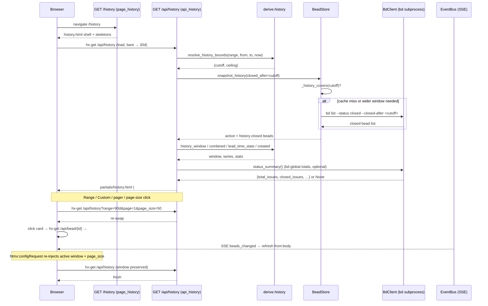

# History & Analytics

## What It Does

The History & Analytics feature is bdboard's long-window retrospective surface
— it answers "what got done, how fast, and at what rate?" over configurable
time windows (7d / 30d / 90d / all time / custom date range). A masthead KPI
strip, a grouped "Created vs closed" per-day bar chart, and a paginated
newest-closed-first bead list give a maintainer the throughput, cycle-time, and
backlog-burn picture that the board's short 12h/1d/3d live-now view does not.

## Why It Exists

The board's dashboard view is optimised for live triage: it shows active lanes,
a 50-cap recently-closed lane, and a short window filter. That is the wrong
tool for sprint retrospectives, burn-down reviews, or "are we getting faster?"
questions. History & Analytics fills that gap: it provides an unbounded,
range-scoped view of every closed bead in the workspace, enriched with lead /
cycle-time KPIs and daily throughput charts, so a maintainer can evaluate
trends, spot bottlenecks, and measure improvement without leaving bdboard.

## How It Works

### User Perspective

The user navigates to `/history`. The page paints instantly (a thin shell plus
shimmer skeletons in both the masthead and the region), then HTMX lazy-loads
`GET /api/history` with the default 30-day window. From that point:

- **Range selection** — preset badges (`7d` / `30d` / `90d` / `All`) switch the
  window with one click; a **Custom** badge opens a popover with `from`/`to`
  date inputs plus Apply and Clear.
- **KPI strip** — six cells in the masthead show workspace-global `bd` totals
  (Total, Closed all-time — only when `bd status` is available) and
  range-scoped KPIs (Avg lead, Closed in range, Median lead, Throughput).
  Each cell has an info-icon popover explaining what the metric measures.
- **Created vs closed chart** — a day-bucketed grouped-bar chart with created
  (violet, hatched for colour-blind safety) and closed (blue) per day on one
  shared y-axis, so net flow / backlog burn reads at a glance. Per-day count
  labels sit above each bar.
- **Closed-bead list** — a paginated, newest-closed-first stack of clickable
  cards. Clicking a card opens the shared bead detail modal. The pager (Newer /
  Older) and a per-page selector (`25` / `50` / `100`) control pagination; the
  selected page size persists in `localStorage` across reloads and navigation.
- **Live updates** — the page subscribes to the shared SSE bus (`/api/events`);
  a `beads_changed` event re-fetches the region with the active window
  preserved (the `base.html` `htmx:configRequest` hook re-injects the range and
  page size onto bare fetches so SSE does not snap back to 30d).

### System Perspective

All of the rendering is server-side (HTMX partials, zero client framework).
The route handler resolves the window once, pulls a window-bounded snapshot,
derives every view from that snapshot in memory, and renders one HTML response
that carries both the region body and an OOB masthead stats fragment.

1. **Window resolution.** `derive.resolve_history_bounds` is the single source
   of truth for `(cutoff, ceiling)`. A valid custom `from_date`/`to_date`
   supersedes the preset `range` key; inverted dates are swapped. Unknown or
   missing range keys degrade to `30d`.

2. **Window-aware snapshot.** `store.snapshot_history(closed_after=cutoff)`
   pushes the resolved lower bound down to the `bd` query
   (`--closed-after <iso>`) so a narrow range fetches only its slice. The
   store's `_history_covers()` check reuses a previously cached wider window
   when the request is a sub-window of what is already held — avoiding a
   redundant `bd` subprocess.

3. **Pure derive.** The four derive functions — `history_window`,
   `combined`, `lead_time_stats`, and `created` — each take the snapshot plus
   the resolved bounds and return UI-ready dicts. No I/O, no caching, no
   `.beads/` writes. Each applies `_closed_in_window` / `_created_in_window`
   with the same `(cutoff, ceiling)` so all views agree on the same set.

4. **Template render.** `partials/history.html` receives the range control
   state, the chart series, the paginated window, and the stats. It includes
   `partials/history_stats.html` with `hx-swap-oob="true"` so HTMX peels it
   off and swaps it into the masthead `#history-stats` host — one fetch keeps
   both surfaces current.

5. **SSE refresh.** On `beads_changed`, every open tab re-fetches the region.
   The `htmx:configRequest` hook preserves the user's active window and page
   size so the view does not snap back to defaults.



## Key Data Shapes

**Paginated closed-bead window** (`derive.history_window` return)

```json
{
  "items": [{"id": "bdboard-abc", "status": "closed", "closed_at": "2026-06-01T12:00:00Z", "...": "..."}],
  "page": 1,
  "page_size": 50,
  "total": 127,
  "has_more": true
}
```

**Combined created-vs-closed series** (`derive.combined` return)

```json
[
  {"day": "2026-05-20", "created": 3, "closed": 1},
  {"day": "2026-05-21", "created": 0, "closed": 2},
  {"day": "2026-05-22", "created": 1, "closed": 0}
]
```

The series spans the union of days that saw a creation *or* a close; each
metric is zero-filled across that span so the grouped bars stay aligned.

**Lead-time / cycle-time stats** (`derive.lead_time_stats` return)

```json
{
  "n": 42,
  "median_lead_h": 36.5,
  "p90_lead_h": 120.0,
  "median_cycle_h": 8.2,
  "p90_cycle_h": 48.3,
  "avg_cycle_h": 14.7
}
```

- **lead time** = `created_at` → `closed_at` (filing to done).
- **cycle time** = `started_at` → `closed_at` (active work).
- Hour values are rounded to 1 dp; `None` when there is no data. Beads without
  a parseable `started_at` are excluded from cycle metrics; negative/zero
  durations from clock skew are dropped.

**bd status summary** (`BdClient.status_summary` return, optional)

```json
{
  "total_issues": 152,
  "closed_issues": 127,
  "in_progress_issues": 8,
  "average_lead_time_hours": 52.3
}
```

Returns `None` on any `bd` hiccup; the template omits the Total/Closed-all-time
KPI cells and the range-derived KPIs remain the primary surface.

**Template context (passed to `partials/history.html`)**

```json
{
  "range_key": "30d",
  "active_range": "30d",
  "is_custom": false,
  "from_date": "",
  "to_date": "",
  "ranges": ["7d", "30d", "90d", "all"],
  "page_size": 50,
  "page_sizes": [25, 50, 100],
  "window": {"items": [], "page": 1, "page_size": 50, "total": 0, "has_more": false},
  "created_total": 15,
  "combined_series": [],
  "combined_peak": 5,
  "stats": {"n": 0, "median_lead_h": null, "p90_lead_h": null, "median_cycle_h": null, "p90_cycle_h": null, "avg_cycle_h": null},
  "avg_per_day": 0,
  "bd_summary": null
}
```

## API Surface

| Method | Path | Purpose | -> Endpoint doc |
| --- | --- | --- | --- |
| GET | `/history` | Full-page shell — masthead + `#history-region` skeleton; never blocks on `bd` | [History (/history)](../Views/HistoryView.md) |
| GET | `/api/history` | Region endpoint — range control, chart, KPI strip (OOB), paginated list | [GET /api/history](../Endpoints/GetApiHistory.md) |
| GET | `/api/bead/{id}` | Shared bead modal opened when a closed-bead card is clicked | [GET /api/bead/{id}](../Endpoints/GetApiBead.md) |
| GET | `/api/events` | SSE stream — drives `refresh from:body` so the view stays live | [GET /api/events](../Endpoints/GetApiEvents.md) |

## Implementation Map

| Responsibility | File path | Symbol |
| --- | --- | --- |
| Page route (cheap shell, no `bd` call) | `src/bdboard/app.py` | `page_history` (`GET /history`) |
| Region endpoint (resolve → snapshot → derive → render) | `src/bdboard/app.py` | `api_history` (`GET /api/history`) |
| Window resolver (single source of truth for cutoff/ceiling) | `src/bdboard/derive/history.py` | `resolve_history_bounds`, `_resolve_bounds` |
| Custom from/to parsing + inverted-swap | `src/bdboard/derive/history.py` | `custom_bounds`, `_parse_date` |
| Range preset → UTC cutoff | `src/bdboard/derive/history.py` | `_range_to_cutoff` |
| Closed-in-window filter | `src/bdboard/derive/history.py` | `_closed_in_window` |
| Created-in-window filter | `src/bdboard/derive/history.py` | `_created_in_window` |
| Paginated closed list (newest-closed first) | `src/bdboard/derive/history.py` | `history_window` |
| Closed-per-day series (gap-filled) | `src/bdboard/derive/history.py` | `throughput` (partial of `_daily_count_series`) |
| Created-per-day series (gap-filled) | `src/bdboard/derive/history.py` | `created` (partial of `_daily_count_series`) |
| Combined created+closed per day | `src/bdboard/derive/history.py` | `combined` |
| Lead-time / cycle-time KPIs | `src/bdboard/derive/history.py` | `lead_time_stats`, `_percentile` |
| Per-day bucketing + gap-filling | `src/bdboard/derive/history.py` | `_bucket_by_day`, `_fill_daily_series`, `_iter_day_span` |
| Page-size clamp (25/50/100 allowed set) | `src/bdboard/derive/history.py` | `clamp_page_size` |
| Per-bead status timeline (audit enrichment) | `src/bdboard/derive/history.py` | `status_timeline` |
| Window-aware history snapshot cache | `src/bdboard/store.py` | `BeadStore.snapshot_history`, `_load_history`, `_history_covers` |
| Count-uncapped closed-bead fetch (`--closed-after`) | `src/bdboard/bd.py` | `BdClient.list_closed_history` |
| bd aggregate summary (`bd status --json`) | `src/bdboard/bd.py` | `BdClient.status_summary` |
| Timestamp parsing + humanization | `src/bdboard/derive/timeutil.py` | `_parse_dt`, `_epoch`, `_day_bucket`, `humanize_ts`, `humanize_hours` |
| Page shell template (masthead + region skeleton) | `src/bdboard/templates/history.html` | `#history-region`, `#history-stats` |
| Region partial (range control, chart, list, pager) | `src/bdboard/templates/partials/history.html` | `.history-region-inner` |
| Masthead KPI strip (OOB swap) | `src/bdboard/templates/partials/history_stats.html` | `hx-swap-oob="true"` → `#history-stats` |
| Region skeleton (shimmer) | `src/bdboard/templates/partials/history_skeleton.html` | `aria-busy="true"` placeholder |
| Shared bead card (closed-bead tile) | `src/bdboard/templates/partials/bead_card.html` | `meta="history"`, `show_closed_when=true` |
| Window/size persistence + snap-back prevention | `src/bdboard/templates/base.html` | `htmx:configRequest` listener, `localStorage['bdboard-history-page-size']` |
| SSE fan-out for live refresh | `src/bdboard/events.py` | `EventBus.broadcast` → `beads_changed` |
| Derive tests (62 tests) | `tests/test_derive_history.py` | `test_history_window_*`, `test_throughput_*`, `test_combined_*`, `test_lead_time_stats_*`, `test_clamp_page_size_*`, `test_custom_bounds_*` |
| API integration tests (32 tests) | `tests/test_api_history.py` | `test_api_history_*` |
| Page route tests (9 tests) | `tests/test_page_history.py` | `test_history_page_*`, `test_history_region_*` |

## Configuration

| Key | Default | Effect |
| --- | --- | --- |
| `HISTORY_RANGES` (`derive/history.py`) | `{"7d": 7d, "30d": 30d, "90d": 90d, "all": None}` | Preset windows the range control offers. `"all"` maps to `None` (unbounded). |
| `DEFAULT_HISTORY_RANGE` (`derive/history.py`) | `"30d"` | Fallback when `range=` is missing/invalid. |
| `HISTORY_PAGE_SIZE` (`derive/history.py`) | `50` | Default closed-list page size when missing/invalid. |
| `HISTORY_PAGE_SIZES` (`derive/history.py`) | `(25, 50, 100)` | Allowed page sizes; any other value clamps to `HISTORY_PAGE_SIZE`. |
| `LIST_TIMEOUT_S` (`bd.py`) | `15.0` s | Subprocess timeout for `bd list` (used by `list_closed_history`). |
| `STATUS_TIMEOUT_S` (`bd.py`) | `8.0` s | Subprocess timeout for `bd status --json` (used by `status_summary`). |
| `localStorage['bdboard-history-page-size']` | _(unset → 50)_ | Client-side page-size persistence; `base.html` JS injects it onto bare fetches. |

## Edge Cases

> [!WARNING]
> **Filter snap-back on SSE refresh (bdboard-li44).** The region's
> `hx-trigger="load, refresh from:body"` fires on every SSE `beads_changed`.
> A bare re-fetch URL (no query params) resolves to the default 30d window,
> silently discarding the user's selected range or custom dates. The fix is
> the `base.html` `htmx:configRequest` listener, which re-injects the active
> window (`range` or `from_date`/`to_date`) and persisted `page_size` onto
> bare `refresh from:body` fetches.

> [!WARNING]
> **Uncapped closed-bead data (bdboard-a194).** The History path is
> count-uncapped: `list_closed_history` uses `--limit 0` so the `all` range
> can reach every closed bead. A large workspace with thousands of closures
> will load them all into memory. The window-aware cache mitigates this for
> narrow ranges, but `all` is a genuine full-table read by design.

> [!WARNING]
> **Window-aware cache reuse (bdboard-gp06).** `_history_covers()` lets a
> cached 90d snapshot serve a 30d or 7d request without re-querying `bd`.
> Switching from a narrow to a wider window (e.g. 7d → 90d) triggers a
> re-fetch; switching the other way reuses the cache. An unbounded (`all`)
> cache covers any request; a bounded cache cannot cover an unbounded request.

> [!WARNING]
> **Custom date inversion.** `custom_bounds` auto-swaps inverted `from`/`to`
> inputs (where `from` is after `to`) so the window stays meaningful instead
> of collapsing to empty. The `to_date` is treated as an exclusive
> start-of-next-day ceiling, so a `to` of `2026-05-30` includes everything
> stamped on the 30th.

> [!WARNING]
> **Created series counts open beads.** The `created` series filters by
> `created_at`, not by status. A still-open bead filed within the window
> counts on the "Created" chart bar, which is correct — it measures inflow
> regardless of resolution.

## Error Scenarios

| Trigger | Behavior | User sees |
| --- | --- | --- |
| `bd status --json` fails or returns malformed data | `status_summary()` returns `None`; template omits the Total/Closed-all-time cells | Range-derived KPIs remain; masthead degrades gracefully (no error) |
| `bd list --status closed` subprocess fails | `_load_history` logs the exception; previous cache preserved (stale-but-present) | Stale data from the last successful fetch; self-heals on next watcher refresh |
| Empty window (no beads created or closed) | `combined_series` is `[]`; chart section shows empty-state message | *"No beads created or closed to chart in \<window\>."* |
| No closed beads in window (chart has data but list is empty) | `window.total` is `0`; list section shows empty-state message | *"Nothing closed in the last \<window\> — try a wider range."* |
| Page past the end (`page > 1` but slice is empty) | `items` is `[]`, `has_more` is `false` | *"Nothing on page N —"* with a **"back to page 1"** link button |
| Negative / zero durations from clock skew | `lead_time_stats` drops them silently (only `h >= 0` appended) | KPIs exclude the outlier; no error shown |
| Unparseable `closed_at` on a closed bead | `_closed_in_window` excludes the bead (can't place on timeline) | Bead omitted from chart and list; no error shown |
| Unparseable `from_date` / `to_date` | `_parse_date` returns `None`; custom bounds → `(None, None)`; falls back to preset range | User sees the preset window as if Custom was never set |

## Testing

The feature is tested across three dedicated test files with 103 tests total:

**Derive unit tests** (`tests/test_derive_history.py` — 62 tests) — pure
function tests over fabricated bead lists with injectable `now`:

- `test_history_window_*` — closed filtering, range scoping, sort order,
  pagination, out-of-range pages, missing `closed_at`, empty input, page/size
  clamping, custom range filtering.
- `test_throughput_*` — day bucketing, gap-filling, empty window, range
  scoping, ascending continuity, custom range superseding preset.
- `test_combined_*` — created+closed merge, union span, open-bead created
  counts, empty window, range respect.
- `test_lead_time_stats_*` — hour computation, empty window, missing
  `started_at` (skips cycle only), negative duration drops, range scoping,
  custom range superseding preset.
- `test_clamp_page_size_*` — default fallback, allowed values, out-of-set
  rejection, missing/garbage handling.
- `test_custom_bounds_*` — inclusive end-of-day, open-ended sides, inverted
  date swap.

**API integration tests** (`tests/test_api_history.py` — 32 tests) — exercising
`GET /api/history` via the `TestClient` with mocked `bd` subprocess:

- Range parameter handling, page-size clamping, template context assertions,
  OOB stats fragment presence, custom date precedence, empty/error scenarios.

**Page route tests** (`tests/test_page_history.py` — 9 tests) — exercising
`GET /history` and the lazy-load HTMX wiring:

- Full document render, `#history-region` skeleton presence, `hx-get` attribute
  targeting `/api/history`, masthead stats skeleton, workspace validation.

Run all tests:

```bash
pytest tests/test_derive_history.py tests/test_api_history.py tests/test_page_history.py -v
```

## Related

- [History (/history)](../Views/HistoryView.md) — the full View doc for the
  History page; documents URL params, components, state management, data flow,
  accessibility, and responsive behavior.
- [GET /api/history](../Endpoints/GetApiHistory.md) — the region endpoint this
  feature lazy-loads, paginates, range-filters, and SSE-refreshes from.
- [GET /api/bead/{id}](../Endpoints/GetApiBead.md) — the shared bead detail
  modal opened when a closed-bead card is clicked.
- [GET /api/events](../Endpoints/GetApiEvents.md) — the SSE stream whose
  `beads_changed` event drives the `refresh from:body` re-fetch.
- [Derive Layer](../Concepts/DeriveLayer.md) — the pure `derive.history`
  functions that shape every view from one snapshot.
- [Store Snapshot & Change Detection](../Concepts/StoreSnapshotChangeDetection.md)
  — the window-aware history cache (`snapshot_history`, `_history_covers`).
- [Subprocess Serialization & Caching](../Concepts/SubprocessSerializationAndCaching.md)
  — the `_subprocess_gate` semaphore and TTL cache behind
  `list_closed_history` and `status_summary`.
- [bd CLI as Source of Truth](../Concepts/BdCliSourceOfTruth.md) — why the
  pipeline shells `bd list` / `bd status` instead of reading `.beads/` directly.
- [SSE Event Bus](../Concepts/SseEventBus.md) — the `beads_changed` pub/sub
  that keeps the view live across tabs.
- [Live Updates](LiveUpdates.md) — the cross-tab live refresh pipeline this
  page participates in via `refresh from:body`.
- [Board (/)](../Views/BoardView.md) — the live-now sibling whose short
  12h/1d/3d window and 50-cap closed lane hand off to this long-window view.
- [Features index](index.md)
- [Back to docs index](../index.md)
