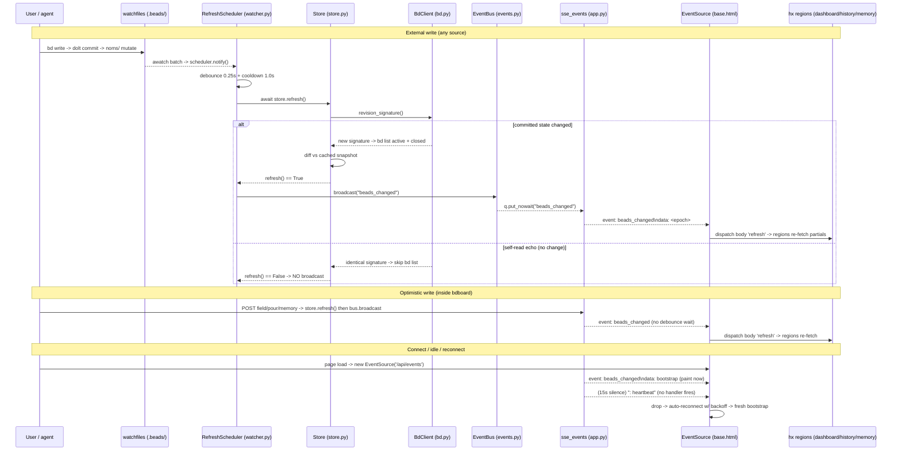

# Live Auto-Refresh

## What It Does

Every open bdboard tab repaints itself the instant the `.beads/` workspace
changes — a `bd` write from any terminal, agent, or sibling tab — without
polling, without a websocket, and without a page reload. The server watches the
filesystem, decides whether anything actually changed, and pushes a single
content-free `beads_changed` event down one long-lived Server-Sent Events
stream; each tab translates that into a DOM `refresh` and re-fetches just its
live HTML regions (counts strip, swim lanes, closed lane, history, memory).

## Why It Exists

bd is the runtime source of truth, and it gets written from *many* places at
once: a developer in one terminal, an AI agent in another, a formula pour or an
inline edit inside bdboard itself. A static board would be lying within seconds.
The naive fixes are all worse: client polling burns CPU and lags behind writes;
a websocket adds a stateful protocol and reconnection logic for a one-way
trigger; pushing the changed beads down the wire duplicates the
derive/render logic that already lives behind the region endpoints and creates a
second source of truth. Live auto-refresh solves "the board must always reflect
the workspace" with the cheapest possible mechanism: a dumb trigger over SSE
plus HTMX re-fetches that single-source the actual state from the
[Store](../Concepts/StoreSnapshotCache.md) snapshot.

## How It Works

### User Perspective

- You open the board (`/`), History (`/history`), or Memory (`/memory`) page.
- A footer status dot reads **`connecting…`**, then flips to **`live · push`**
  once the `EventSource` connects.
- The moment anyone writes to the workspace — you close a bead in a terminal, an
  agent updates a field, you pour a formula in another tab — the relevant
  regions silently re-render with the fresh state. Cards move lanes, counts
  tick, the closed lane grows. No spinner takeover, no scroll jump, no reload.
- If the connection drops (server restart, laptop sleep), the dot shows
  **`reconnecting…`** and the browser auto-reconnects with exponential backoff;
  on reconnect a `bootstrap` event repaints fresh data immediately.
- Your own optimistic actions (inline edit, formula pour, memory add/delete)
  appear instantly — they don't wait out the file-watcher's debounce.

### System Perspective

End to end: a `bd` write commits dolt, which mutates `manifest` + `journal.idx`
inside each db's `.beads/embeddeddolt/<db>/.dolt/noms/` dir. `watchfiles.awatch`
(watching a small, fixed, **non-recursive** target set) fires; the
`RefreshScheduler` debounces the burst into exactly one `store.refresh()`. The
refresh first consults `revision_signature()` to skip its own read-echoes, then
re-lists active + closed beads, diffs against the cached snapshot, and returns
`True` **iff** the lists actually changed. Only on `True` does the scheduler call
`bus.broadcast("beads_changed")`, fanning the bare string out to one
`asyncio.Queue` per connected tab. Each tab's `/api/events` stream yields an SSE
frame; the browser's `EventSource` dispatches a synthetic `refresh` `CustomEvent`
on `<body>`, and every region wired `hx-trigger="load, refresh from:body"`
re-fetches its partial. Write routes inside bdboard *also* fire an optimistic
`beads_changed` right after their own `store.refresh()`, so the acting tab and
its siblings update without waiting for the watcher.



## Key Data Shapes

The feature is deliberately **content-free on the wire** — the SSE frame carries
a trigger, never bead payload. The shapes that matter are the SSE frames, the
internal revision signature that gates a broadcast, and the bead dicts the
regions re-fetch (rendered to HTML, never sent over the SSE channel).

The SSE wire frames (line-oriented `text/event-stream`, not JSON):

```text
# Bootstrap — first frame on connect, so a fresh tab paints at once:
event: beads_changed
data: bootstrap

# Live change — one per detected, real .beads/ change. `data` is int(time.time()):
event: beads_changed
data: 1780000020

# Heartbeat — an SSE comment after 15s of silence. Fires NO client handler:
: heartbeat
```

The internal revision signature that decides whether a broadcast fires (one
entry per embedded dolt db; identical signature → no re-list, no broadcast):

```json
{
  "signature": [
    [".beads/embeddeddolt/bdboard/.dolt/noms/manifest", "<root-hash bytes>"]
  ]
}
```

A bead dict as re-listed by `bd list --json` and diffed by `Store.refresh`
(rendered into the re-fetched partials, never serialized onto the SSE stream):

```json
{
  "id": "bdboard-mol-bfs.6",
  "title": "Feature: Live auto-refresh",
  "status": "in_progress",
  "priority": 2,
  "issue_type": "task",
  "updated_at": "2026-06-04T00:00:00Z",
  "closed_at": null,
  "labels": ["docs", "flowdoc"],
  "dependencies": []
}
```

## API Surface

| Method | Path | Purpose | → Endpoint doc |
| --- | --- | --- | --- |
| GET | `/api/events` | Long-lived `text/event-stream`; the server pushes `beads_changed` (plus a `bootstrap` on connect and `: heartbeat` every 15s) — the live signal this feature is built on. | [SseEvents](../Endpoints/SseEvents.md) |
| GET | `/api/counts` | Counts strip partial re-fetched on every `refresh from:body` pulse. | [LanesApi](../Endpoints/LanesApi.md) |
| GET | `/api/lanes` | Active swim-lanes partial re-fetched on `refresh`. | [LanesApi](../Endpoints/LanesApi.md) |
| GET | `/api/lanes/closed` | Closed-lane partial re-fetched on `refresh`. | [LanesApi](../Endpoints/LanesApi.md) |
| GET | `/api/history` | History region re-fetched on `refresh` (same window the user is viewing). | [HistoryApi](../Endpoints/HistoryApi.md) |
| GET | `/api/memory` | Memory list re-fetched on `refresh` so other tabs' mutations appear live. | [MemoryApi](../Endpoints/MemoryApi.md) |
| POST | `/api/bead/{id}/field` | Inline edit; fires an **optimistic** `beads_changed` after its own refresh. | [BeadFieldEditApi](../Endpoints/BeadFieldEditApi.md) |
| POST | `/api/formulas/{name}/pour` | Formula pour; fires an **optimistic** `beads_changed` after fan-out. | [FormulasApi](../Endpoints/FormulasApi.md) |
| POST/DELETE | `/api/memory` | Memory add/delete; fires an **optimistic** `beads_changed` after mutating. | [MemoryApi](../Endpoints/MemoryApi.md) |

## Implementation Map

| Responsibility | File path | Symbol |
| --- | --- | --- |
| Spawn the watcher task on boot; cancel + await it on shutdown | `src/bdboard/app.py` | `lifespan` |
| Watch loop: resolve targets, open `awatch(..., recursive=False)`, `notify()` per batch, crash-restart | `src/bdboard/app.py` | `_watch_beads` |
| Background poller that trips `awatch`'s `stop_event` on a `noms/` inode swap / new db | `src/bdboard/app.py` | `_rescan_targets` |
| Resolve the non-recursive watch target set (`noms/` dirs + `.beads/`) | `src/bdboard/bd.py` | `BdClient.watch_targets` |
| `(path, st_dev, st_ino)` fingerprint that detects target-set drift | `src/bdboard/bd.py` | `BdClient.watch_signature` |
| Debounce + cooldown scheduler; calls `refresh`, then `broadcast` iff changed | `src/bdboard/watcher.py` | `RefreshScheduler.notify` / `RefreshScheduler._settle` |
| Snapshot refresh: revision-skip, re-list, diff, swap, invalidate; returns `True` iff changed | `src/bdboard/store.py` | `Store.refresh` |
| Self-feedback skip oracle (skip `bd list` when committed state is unchanged) | `src/bdboard/bd.py` | `BdClient.revision_signature` |
| Re-list active / closed beads the diff compares | `src/bdboard/bd.py` | `BdClient.list_active` / `BdClient.list_closed` |
| In-process pub/sub broadcaster (one queue per tab, drop-oldest backpressure) | `src/bdboard/events.py` | `EventBus.broadcast` / `EventBus.subscribe` |
| The single app-wide event bus instance | `src/bdboard/app.py` | `bus = EventBus()` |
| SSE endpoint: subscribe, yield bootstrap, pump events, 15s heartbeat, disconnect cleanup | `src/bdboard/app.py` | `sse_events` / `sse_events.<locals>.stream` |
| Optimistic broadcast after a write (skip the watcher debounce) | `src/bdboard/app.py` | `api_bead_field_update` / `api_formula_pour` / `api_memory_create` / `api_memory_delete` (`await bus.broadcast("beads_changed")`) |
| Client bridge: `EventSource('/api/events')` → body `refresh` `CustomEvent` | `src/bdboard/templates/base.html` | inline SSE IIFE (`new EventSource('/api/events')`) |
| Footer live-status dot updated on `open` / `error` | `src/bdboard/templates/base.html` | `#live-dot` / `#live-status` (`setStatus`) |
| Counts + lanes regions that re-fetch on `refresh from:body` | `src/bdboard/templates/dashboard.html` | `#counts`, `#lanes` (`hx-trigger="load, refresh from:body"`) |
| Closed-lane region that re-fetches on `refresh` | `src/bdboard/templates/partials/lanes.html` | `#closed-lane` host (`hx-trigger="load, refresh from:body"`) |
| History region that re-fetches the current window on `refresh` | `src/bdboard/templates/history.html` | `#history-region` (`hx-trigger="load, refresh from:body"`) |
| Memory list region that re-fetches on `refresh` | `src/bdboard/templates/memory.html` | `#memory-list` (`hx-trigger="load, refresh from:body"`) |

## Configuration

| Key | Default | Effect |
| --- | --- | --- |
| `WATCHER_DEBOUNCE_S` (`src/bdboard/app.py`) | `0.25` | Quiet-window that collapses the 3–5 file writes of one logical `bd` mutation into a single `store.refresh()`. Longer = fewer refreshes but laggier; shorter = snappier but more redundant re-lists. |
| `WATCHER_COOLDOWN_S` (`src/bdboard/app.py`) | `1.0` | Minimum gap after a successful refresh before the next one, capping a sustained write storm at ~one refresh/sec. Advanced **only** on success, so a failed refresh retries promptly. |
| `WATCHER_RESCAN_S` (`src/bdboard/app.py`) | `3.0` | How often `_rescan_targets` re-fingerprints the watch targets to catch a `noms/` inode swap or a new db appearing post-startup. |
| `_QUEUE_SIZE` (`src/bdboard/events.py`) | `16` | Per-subscriber queue depth. A client falling >16 events behind drops its oldest event (lossy by design — the next refresh re-triggers the same re-fetch). |
| heartbeat timeout (`src/bdboard/app.py:sse_events`) | `15.0` s | Idle interval after which the stream emits a `: heartbeat` comment to keep proxies from reaping the connection. |
| `LIST_TIMEOUT_S` (`src/bdboard/bd.py`) | `15.0` s | Per-`bd list` subprocess timeout during a refresh; on timeout the refresh degrades to the stale snapshot and broadcasts nothing. |
| `BDBOARD_WORKSPACE` (env) | `$PWD` / cwd | Workspace root whose `.beads/` is watched. Changing it changes which dolt dbs feed the live signal. |
| `BDBOARD_BD_BIN` (env) | `bd` | The `bd` binary the refresh subprocesses invoke; must resolve for the pipeline to re-list. |
| `BDBOARD_ACTOR` (env) | `None` | Actor recorded on writes that emit the optimistic broadcasts; does not affect the watcher path. |

> [!NOTE]
> The watcher/queue/heartbeat tunables are **module-level constants**, not
> environment variables — change them in source (and re-run the watcher tests).
> Only the `BDBOARD_*` keys are runtime-configurable via the environment.

## Edge Cases

> [!WARNING]
> **Self-feedback loop.** Even a read-only `bd list` perturbs `noms/`, so the
> watcher fires for bdboard's *own* refresh ~1.3s later. `revision_signature()`
> short-circuits this: an unchanged signature skips the `bd list` subprocess and
> returns `False`, so the pipeline can't spin on itself (bdboard-ywep).

> [!WARNING]
> **Memory-only mutations don't repaint the board.** A `bd remember`/`forget`
> doesn't change the active/closed lists, so `Store.refresh` returns `False` and
> no `beads_changed` fires for the board. The Memory page's own
> `refresh from:body` region still picks up memory changes on the next trigger.

> [!WARNING]
> **Burst writes coalesce to one refresh.** A single `bd update` spans 2–3
> `awatch` batches; the `DEBOUNCE_S` window intentionally collapses them into one
> `store.refresh()`. Do not assume one refresh per file event.

> [!WARNING]
> **SSE is lossy under backpressure by design.** A slow tab's bounded queue
> drops its oldest event rather than blocking the broadcaster. This is safe — the
> event is content-free, so the next refresh re-fires the identical re-fetch.

> [!WARNING]
> **Target-set drift on macOS.** kqueue watches the inode, not the path; dolt
> atomically replacing a `noms/` dir (or a new db appearing) would leave a dead
> watch. `_rescan_targets` trips `stop_event` to force a clean re-enumeration
> within one `WATCHER_RESCAN_S` tick (bdboard-xbc7 root cause #2).

> [!CAUTION]
> **Never switch `awatch` to `recursive=True`.** Watching the churning `noms/`
> object store recursively opens one kqueue fd per dir and exhausts
> `RLIMIT_NOFILE` (`OSError [Errno 24] Too many open files`), which then breaks
> the very `bd list` subprocesses the refresh depends on. Keep it non-recursive.

## Error Scenarios

| Trigger | Behavior | User sees |
| --- | --- | --- |
| `bd list` subprocess errors or returns malformed JSON during a refresh | `Store.refresh` logs `store: bd list failed; keeping previous snapshot`, returns `False`, mutates nothing — degrade to stale, never empty; no broadcast | Board keeps showing last-known state (no flash to empty); next change retries |
| `bd list` exceeds `LIST_TIMEOUT_S` (15s) | Subprocess timeout caught as a list failure; snapshot preserved, `False` returned | Board stays on prior state until a later refresh succeeds |
| `store.refresh()` raises unexpectedly | Scheduler logs `watcher: refresh raised; will retry on next change` and does **not** advance the cooldown clock | Transparent; the next FS event retries promptly instead of being swallowed |
| Unhandled exception in the watch loop | `_watch_beads` logs `watcher crashed; restarting in 2s`, sleeps 2s, re-enters `awatch` with fresh targets | Brief gap in live updates; self-heals within ~2s |
| Subscriber falls >16 events behind | `EventBus.broadcast` drops the oldest queued event; logs `event bus subscriber queue is hot; event lost` only if even that fails | At most a freshness blip on that one tab; healed by the next refresh |
| `EventSource` connection drops (server restart / proxy idle / network) | Browser fires `error`; built-in exponential backoff reconnects; a fresh `bootstrap` repaints on reconnect | Footer dot shows `reconnecting…`, then `live · push`; data repaints |
| Reverse proxy buffers the stream | Frames never flush; bdboard sends `X-Accel-Buffering: no` + `Cache-Control: no-cache` to defeat nginx, but other proxies may still buffer | Dot appears stuck "connecting"; configure the proxy to not buffer SSE |
| A region's partial re-fetch fails after a `refresh` | HTMX error swap on that region only | That region keeps its last content until the next successful refresh |

## Testing

- **Scheduler timing** — `tests/test_watcher_scheduler.py` exercises the
  debounce/cooldown collapse, the broadcast-iff-changed gate, and the
  cooldown-advances-only-on-success rule against `RefreshScheduler`.
- **Self-feedback skip** — `tests/test_watcher_self_feedback.py` proves a
  read-echo (unchanged `revision_signature`) does not re-list or broadcast, so
  the pipeline can't spin on its own reads.
- **Target resolution / drift** — `tests/test_watch_targets.py` covers
  `watch_targets()` and `watch_signature()` (non-recursive set, inode-swap /
  new-db detection).
- **Optimistic broadcasts** — `tests/test_memory_mutations.py` and
  `tests/test_formula_pour.py` assert the write routes emit `beads_changed`
  after a successful mutation (stubbed bus broadcast).
- **Manual check** — open the board, run
  `curl -N -H 'Accept: text/event-stream' 'http://127.0.0.1:8765/api/events'`
  in one terminal and `bd update <id> --status in_progress` in another; you
  should see a `bootstrap` frame, periodic `: heartbeat`s, and a `beads_changed`
  frame on each write while the board repaints and the footer reads `live · push`.

## Related

- [Live-refresh pipeline (Flow)](../Flows/LiveRefreshPipeline.md) — the
  step-by-step producer story (bd write → watcher → refresh → broadcast → client
  re-fetch) this feature is the behavior-first overview of.
- [SSE events (`/api/events`)](../Endpoints/SseEvents.md) — the HTTP contract for
  the stream (frame format, bootstrap, heartbeat, headers) this feature rides on.
- [Lanes API (`/api/lanes`, `/api/lanes/closed`, `/api/counts`)](../Endpoints/LanesApi.md)
  — the board regions re-fetched on every `beads_changed → refresh` pulse.
- [History API (`/api/history`)](../Endpoints/HistoryApi.md) — the History region
  re-fetched on the same `refresh` event.
- [Memory API (`/api/memory`)](../Endpoints/MemoryApi.md) — re-fetched on
  `refresh`; its write routes fire the optimistic broadcasts.
- [Formulas API (`/api/formulas`, form, pour)](../Endpoints/FormulasApi.md) — a
  pour fires an optimistic `beads_changed` so new beads arrive live.
- [Formula pour (Feature)](FormulaPour.md) — the sibling feature whose pour rides
  this live-refresh mechanism to surface new beads in every tab.
- [History & trends (Feature)](HistoryAndTrends.md) — the sibling feature whose
  `#history-region` re-fetches on every `beads_changed → refresh from:body` pulse
  so a bead closing while you watch appears without a manual reload.
- [Bead field-edit API (POST /api/bead/{id}/field)](../Endpoints/BeadFieldEditApi.md)
  — the other optimistic-broadcast write path.
- [Watcher debounce/cooldown & self-feedback skip](../Concepts/WatcherScheduling.md)
  — the `RefreshScheduler` timing logic behind the producer side.
- [Store snapshot cache & change detection](../Concepts/StoreSnapshotCache.md) —
  the cache + `revision_signature` oracle that decides whether a broadcast fires.
- [HTMX + server-rendered partials](../Concepts/HtmxPartialsArchitecture.md) — why
  the event is a content-free trigger fanning out to `refresh from:body` regions.
- [bd CLI as runtime source of truth](../Concepts/BdCliSourceOfTruth.md) — why a
  read-only `bd list` perturbs `.beads/` (the motivation for the self-feedback skip).
- [Board page (`/`)](../Views/BoardPage.md) · [History page (`/history`)](../Views/HistoryPage.md)
  · [Memory page (`/memory`)](../Views/MemoryPage.md) — the three views that open
  the `EventSource` and surface the live-status dot.
- [Features index](index.md) · [Architecture](../Architecture.md#system-diagram)
  · [Manifest](../_Manifest.md) — the feature catalog and system view this sits in.
