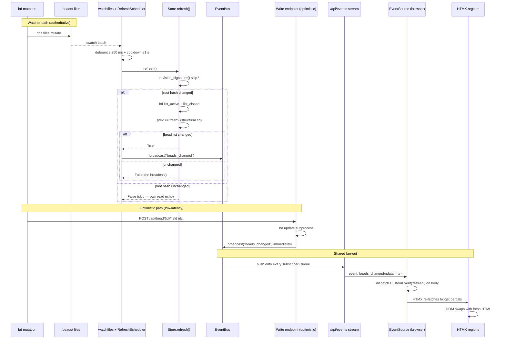

# Live Updates

## What It Does

Every open browser tab reflects the current state of the beads workspace
within ~1 second of any `bd` mutation — CLI, agent, or bdboard write
endpoint — without a page reload, without polling, and without client-side
state diffing. A masthead indicator shows connection health (`live · push` /
`reconnecting…`).

## Why It Exists

bdboard is a read-mostly observer of a Dolt-backed workspace that many tools
write to concurrently (the CLI, bead-chain agents, other terminals). Without
live updates a user would have to manually reload the page to see changes
made elsewhere — or worse, act on stale data (closing a bead that was already
claimed, editing a field that was already updated). The feature closes that
gap: every tab self-heals to reality within about a second of any write,
across all three pages (Board, History, Memory), with zero user intervention.

## How It Works

### User Perspective

The user opens bdboard in a browser tab. A small indicator in the masthead
reads **live · push** with a green dot, confirming the live connection is
healthy. From that point:

- **External change:** the user (or an agent) runs `bd update` in a terminal.
  Within ~1 second the board's swim lanes, counts strip, and any open modal
  reflect the mutation. No reload needed.
- **In-app change:** the user edits a field in the bead modal, creates or
  deletes a memory, or pours a formula. The acting tab updates
  near-instantly; every other open tab updates within ~1 second.
- **Connection loss:** if the server restarts or the network hiccups, the
  indicator flips to **reconnecting…** with an amber dot. The browser's
  built-in `EventSource` auto-reconnect heals the connection within a few
  seconds; on reconnect a bootstrap event triggers an immediate re-fetch so
  no state is missed.
- **Multiple tabs:** every tab subscribes independently. A change in one tab
  propagates to all others via the shared SSE bus.

### System Perspective

Two parallel paths feed a single in-process pub/sub bus; from the bus onward
the path is identical for both:

1. **Watcher path (authoritative):** `.beads/` files mutate →
   `watchfiles.awatch` fires (kqueue on macOS, inotify on Linux) →
   `RefreshScheduler` debounces (250 ms) then waits out any cooldown (1 s)
   → `store.refresh()` re-fetches `bd list --json` → compares with the
   cached snapshot via structural equality → iff something changed,
   `bus.broadcast("beads_changed")`. This path covers *all* mutations (CLI,
   agent, external tool) and is the authoritative refresh.

2. **Optimistic path (low-latency):** the four write endpoints
   (`api_bead_field_update`, `api_memory_create`, `api_memory_delete`,
   `api_formula_pour`) call `bus.broadcast("beads_changed")` **immediately**
   after their `bd` subprocess, so the acting tab updates without waiting
   out the debounce+cooldown. When the watcher catches up ~1 s later,
   `store.refresh()` finds the bead list already matches and returns `False`
   — no redundant broadcast.

3. **Fan-out:** `EventBus.broadcast` pushes the bare string
   `"beads_changed"` onto every per-subscriber `asyncio.Queue` (one per open
   SSE connection, bounded at 16, drop-oldest on overflow).

4. **SSE framing:** the `/api/events` handler drains each queue and writes
   `event: beads_changed\ndata: <unix_ts>\n\n` down the long-lived
   `text/event-stream` connection. A 15 s heartbeat (`: heartbeat\n\n`)
   keeps proxies from culling the idle stream.

5. **Client dispatch:** the browser's `EventSource('/api/events')` fires its
   `beads_changed` listener, which dispatches a synthetic
   `CustomEvent('refresh')` on `<body>`. Every HTMX region wired with
   `hx-trigger="load, refresh from:body"` re-fetches its HTML partial and
   HTMX swaps the content in-place.



## Key Data Shapes

**SSE wire frame (server → browser)**

```json
// Real change or bootstrap
"event: beads_changed\ndata: 1748900042\n\n"

// 15 s idle heartbeat (SSE comment — no client handler fires)
": heartbeat\n\n"
```

The `data` value is intentionally inert — the client ignores it. The event is
a bare "go re-read" trigger; canonical data comes from the HTMX partial
re-fetches.

**EventBus subscriber set (in-memory)**

```json
{
  "_subscribers": "set[asyncio.Queue[str]]  — one bounded queue per open SSE connection",
  "_QUEUE_SIZE": 16
}
```

**Revision signature (dolt manifest fingerprint)**

```json
{
  "frozenset": [
    ["<manifest_path>", "<manifest_bytes ~150B dolt root hash>"]
  ]
}
```

Compared against `Store._last_revision` to skip the expensive `bd list`
subprocess when the watcher fires for its own read echo.

**Watch signature (target identity fingerprint)**

```json
{
  "frozenset": [
    ["<path>", "<st_dev>", "<st_ino>"]
  ]
}
```

Polled every 3 s by `_rescan_targets` to detect inode swaps or new dolt dbs.

## API Surface

| Method | Path | Purpose | -> Endpoint doc |
| --- | --- | --- | --- |
| GET | `/api/events` | SSE stream — sole server→client push channel | [GET /api/events](../Endpoints/GetApiEvents.md) |
| GET | `/api/lanes` | Active swim lanes partial re-fetched on refresh | [GET /api/lanes](../Endpoints/GetApiLanes.md) |
| GET | `/api/lanes/closed` | Closed lane partial re-fetched on refresh | [GET /api/lanes/closed](../Endpoints/GetApiLanesClosed.md) |
| GET | `/api/counts` | Masthead counts strip re-fetched on refresh | [GET /api/counts](../Endpoints/GetApiCounts.md) |
| GET | `/api/history` | History partial re-fetched on refresh | [GET /api/history](../Endpoints/GetApiHistory.md) |
| GET | `/api/memory` | Memory list partial re-fetched on refresh | [GET /api/memory](../Endpoints/GetApiMemory.md) |
| POST | `/api/bead/{id}/field` | Write endpoint — optimistic broadcaster | [POST /api/bead/{id}/field](../Endpoints/PostApiBeadField.md) |
| POST | `/api/memory` | Write endpoint — optimistic broadcaster | [POST /api/memory](../Endpoints/PostApiMemory.md) |
| DELETE | `/api/memory/{key}` | Write endpoint — optimistic broadcaster | [DELETE /api/memory/{key}](../Endpoints/DeleteApiMemory.md) |
| POST | `/api/formulas/{name}/pour` | Write endpoint — optimistic broadcaster | [POST /api/formulas/{name}/pour](../Endpoints/PostApiFormulaPour.md) |

## Implementation Map

| Responsibility | File path | Symbol |
| --- | --- | --- |
| SSE pub/sub bus (one instance per app) | `src/bdboard/events.py` | `EventBus` |
| Fan-out push (drop-oldest on overflow) | `src/bdboard/events.py` | `EventBus.broadcast` |
| Subscription lifecycle (auto-cleanup) | `src/bdboard/events.py` | `EventBus.subscribe` |
| Per-subscriber queue bound | `src/bdboard/events.py` | `_QUEUE_SIZE` (16) |
| Diagnostics: live subscriber count | `src/bdboard/events.py` | `EventBus.subscriber_count` |
| Bus singleton | `src/bdboard/app.py` | `bus = EventBus()` |
| SSE stream endpoint (bootstrap + heartbeat) | `src/bdboard/app.py` | `sse_events` (`GET /api/events`) |
| Filesystem watcher loop | `src/bdboard/app.py` | `_watch_beads` |
| Target re-enumeration poller | `src/bdboard/app.py` | `_rescan_targets` |
| Watcher → scheduler → broadcast wiring | `src/bdboard/app.py` | `RefreshScheduler(broadcast=lambda: bus.broadcast("beads_changed"))` |
| Debounce + cooldown + dirty reconcile | `src/bdboard/watcher.py` | `RefreshScheduler` |
| Notify (schedule or flag dirty) | `src/bdboard/watcher.py` | `RefreshScheduler.notify` |
| Settle (debounce → cooldown → refresh → broadcast) | `src/bdboard/watcher.py` | `RefreshScheduler._settle` |
| Watch targets (non-recursive noms/ dirs) | `src/bdboard/bd.py` | `BdClient.watch_targets` |
| Watch signature (inode identity fingerprint) | `src/bdboard/bd.py` | `BdClient.watch_signature` |
| Revision signature (dolt manifest root hash) | `src/bdboard/bd.py` | `BdClient.revision_signature` |
| Store refresh (re-fetch + change detection) | `src/bdboard/store.py` | `Store.refresh` |
| Per-bead cache invalidation on change | `src/bdboard/bd.py` | `BdClient.invalidate_caches` |
| Optimistic broadcast: field edit | `src/bdboard/app.py` | `api_bead_field_update` |
| Optimistic broadcast: memory create | `src/bdboard/app.py` | `api_memory_create` |
| Optimistic broadcast: memory delete | `src/bdboard/app.py` | `api_memory_delete` |
| Optimistic broadcast: formula pour | `src/bdboard/app.py` | `api_formula_pour` |
| Client EventSource + refresh dispatch | `src/bdboard/templates/base.html` | `new EventSource('/api/events')` IIFE |
| Live indicator (masthead) | `src/bdboard/templates/base.html` | `#live-dot`, `#live-status` |
| Live indicator styling | `src/bdboard/static/styles.css` | `.live-dot`, `.live-dot.live-on`, `.live-dot.live-off` |
| Board regions: counts + lanes | `src/bdboard/templates/dashboard.html` | `hx-trigger="load, refresh from:body"` on `#counts`, `.lanes-region` |
| Closed lane region | `src/bdboard/templates/partials/lanes.html` | `hx-trigger="load, refresh from:body"` |
| History region | `src/bdboard/templates/history.html` | `hx-trigger="load, refresh from:body"` on `#history-region` |
| Memory region | `src/bdboard/templates/memory.html` | `hx-trigger="load, refresh from:body"` on `#memory-list` |
| URL-preservation (prevent filter snap-back) | `src/bdboard/templates/base.html` | `htmx:configRequest` listener |
| Scheduler regression tests | `tests/test_watcher_scheduler.py` | `test_isolated_event_refreshes_and_broadcasts`, `test_trailing_event_after_cooldown_still_refreshes`, `test_burst_collapses_to_single_refresh`, `test_no_change_suppresses_broadcast`, `test_transient_refresh_failure_does_not_wedge_live_sync`, `test_failure_does_not_advance_cooldown_clock` |
| Self-feedback regression tests | `tests/test_watcher_self_feedback.py` | `test_revision_signature_*`, `test_store_refresh_skips_bd_list_when_revision_unchanged`, `test_store_refresh_runs_bd_list_when_revision_changes`, `test_store_refresh_never_skips_without_dolt_signal`, `test_inflight_refresh_is_not_cancelled_by_self_event` |
| SSE broadcast integration tests | `tests/test_memory_mutations.py` | `test_create_memory_broadcasts_sse_on_success`, `test_delete_memory_broadcasts_sse_on_success` |

## Configuration

| Key | Default | Effect |
| --- | --- | --- |
| `WATCHER_DEBOUNCE_S` (`src/bdboard/app.py`) | `0.25` s | Trailing quiet-window that collapses a single `bd` write's 3–5 file burst into one refresh. |
| `WATCHER_COOLDOWN_S` (`src/bdboard/app.py`) | `1.0` s | Post-refresh suppression window that paces the watcher's broadcast cadence under a sustained write storm. |
| `WATCHER_RESCAN_S` (`src/bdboard/app.py`) | `3.0` s | Interval at which `_rescan_targets` polls `watch_signature()` to detect inode swaps or new dolt dbs. |
| `_QUEUE_SIZE` (`src/bdboard/events.py`) | `16` | Per-subscriber queue depth. A tab >16 events behind drops its oldest (lossy but safe). |
| Heartbeat timeout (`sse_events`) | `15.0` s | Idle interval before a `: heartbeat` comment line keeps proxies from culling the stream. |
| `recursive` (arg to `awatch`) | `False` | Watch only the fixed noms/ dirs, never the whole `.beads/` subtree — prevents macOS kqueue fd exhaustion. |

## Edge Cases

> [!WARNING]
> **History page filter snap-back (bdboard-li44).** The history region's
> `hx-trigger="load, refresh from:body"` fires on every SSE `beads_changed`.
> If the re-fetch URL is a bare `/api/history` (no query params), the server
> returns the default 30-day window, discarding any user-selected range or
> custom dates. The `base.html` URL-preservation script
> (`htmx:configRequest` listener) injects the current `range` and
> `page_size` params into bare `refresh from:body` re-fetches to prevent
> this snap-back.

> [!WARNING]
> **Self-feedback loop (bdboard-ywep).** A read-only `bd list` re-touches
> `journal.idx`/`manifest` inside the watched `noms/` dir, so the watcher
> fires for its own read ~1.3 s later. Two mechanisms break the loop:
> (1) `notify()` during `_refreshing` only sets `_dirty` instead of
> cancelling the running subprocess, and (2) `revision_signature()` lets
> `store.refresh()` skip when the dolt root hash is unchanged. Without both
> fixes the board freezes and only a relaunch shows new state.

> [!WARNING]
> **Cooldown-on-failure wedge (bdboard-xbc7).** If `store.refresh()` raises
> (transient `bd list` failure), the cooldown clock must NOT advance — otherwise
> the next real event lands inside cooldown and is swallowed, permanently
> wedging live-sync. The fix: `_last_refresh_at` is only updated after a
> successful refresh.

> [!WARNING]
> **noms/ inode swap (bdboard-xbc7 root cause #2).** On macOS, `awatch`'s
> kqueue backend watches the inode, not the path. If dolt atomically replaces
> a `noms/` dir (or a new db appears after startup), the watch silently goes
> dead. `_rescan_targets` polls `watch_signature()` every 3 s and trips
> `awatch`'s `stop_event` to force a clean re-enumeration.

> [!WARNING]
> **macOS fd exhaustion.** Watching `.beads/` recursively opens one kqueue fd
> per directory in dolt's churning object store (hundreds of dirs), exhausting
> `RLIMIT_NOFILE`. Once fds run out, `asyncio.create_subprocess_exec` can no
> longer open pipes — `bd list --json` and `bd show` crash with
> `OSError [Errno 24]`. The fix: non-recursive watch on a small, fixed set of
> target directories.

## Error Scenarios

| Trigger | Behavior | User sees |
| --- | --- | --- |
| `.beads/` directory vanishes | Watcher catches `FileNotFoundError`, sleeps 2 s, retries the outer loop | Board shows stale data until the directory reappears |
| Watcher loop crashes (unexpected exception) | Logged with traceback, sleeps 2 s, restarts automatically | Temporary stale data (~2 s); self-heals |
| `bd list --json` fails (timeout, non-zero exit) | Exception logged; previous cache preserved (stale-but-present); `False` returned (no broadcast); cooldown NOT advanced | Board shows stale data; next event retries promptly |
| SSE connection dropped (server restart, network) | `EventSource` auto-reconnects with exponential backoff; live indicator flips to `reconnecting…` / amber | Indicator shows `reconnecting…`; heals within seconds; bootstrap event triggers immediate re-fetch on reconnect |
| Subscriber queue full (tab >16 events behind) | Oldest event dropped; newest enqueued; warning logged | Tab shows slightly stale data for one refresh cycle; healed by next event |
| noms/ inode replaced (dolt dir swap) | `_rescan_targets` detects identity change within 3 s, trips `stop_event`, watcher re-enumerates targets | Momentary ~3 s gap in live updates; self-heals |
| History re-fetch fails while active/closed succeeded | History exception logged separately; active/closed caches still update | History page shows stale data; Board/Memory update normally |
| Write endpoint `bd` subprocess fails | No optimistic broadcast fires; watcher path also finds no change | Acting tab sees no update (correct — the mutation didn't land) |

## Testing

The live updates pipeline is tested across three test files:

**Scheduler timing** (`tests/test_watcher_scheduler.py`) — unit tests for
`RefreshScheduler` with tiny debounce/cooldown values and mock
refresh/broadcast callables:

- `test_isolated_event_refreshes_and_broadcasts` — a single event produces
  one refresh + broadcast.
- `test_trailing_event_after_cooldown_still_refreshes` — an event inside
  cooldown waits (not drops) and then refreshes.
- `test_burst_collapses_to_single_refresh` — rapid-fire events collapse to
  one refresh.
- `test_no_change_suppresses_broadcast` — `refresh()` returning `False`
  suppresses the broadcast.
- `test_transient_refresh_failure_does_not_wedge_live_sync` — a failed
  refresh does not block subsequent events.
- `test_failure_does_not_advance_cooldown_clock` — failed refresh leaves
  cooldown unadvanced.

**Self-feedback prevention** (`tests/test_watcher_self_feedback.py`) — tests
for `revision_signature()` and the store's skip path:

- `test_revision_signature_*` — signature shape, stability, and change
  detection.
- `test_store_refresh_skips_bd_list_when_revision_unchanged` — no subprocess
  when root hash is identical.
- `test_store_refresh_runs_bd_list_when_revision_changes` — subprocess runs
  when hash differs.
- `test_store_refresh_never_skips_without_dolt_signal` — legacy JSONL
  workspaces always refresh.
- `test_inflight_refresh_is_not_cancelled_by_self_event` — `notify()` during
  `_refreshing` sets dirty, does not cancel.

**SSE broadcast integration** (`tests/test_memory_mutations.py`) — end-to-end
tests that write through the HTTP API and assert the bus broadcast fires:

- `test_create_memory_broadcasts_sse_on_success`
- `test_delete_memory_broadcasts_sse_on_success`

Run all tests:

```bash
pytest tests/test_watcher_scheduler.py tests/test_watcher_self_feedback.py tests/test_memory_mutations.py -v
```

## Related

- [SSE Live Update](../Flows/SseLiveUpdate.md) — the end-to-end flow from
  mutation to DOM swap; documents every step of both the watcher and optimistic
  paths.
- [Watcher Refresh Cycle](../Flows/WatcherRefreshCycle.md) — the watcher's
  authoritative refresh path in isolation (debounce → cooldown → refresh →
  broadcast).
- [GET /api/events](../Endpoints/GetApiEvents.md) — the SSE endpoint that
  implements the server→browser push; documents wire frame format, heartbeat,
  and backpressure.
- [SSE Event Bus](../Concepts/SseEventBus.md) — the `EventBus` pub/sub that
  fans out broadcasts to per-subscriber queues; documents the drop-oldest
  backpressure policy.
- [Filesystem Watcher](../Concepts/FilesystemWatcher.md) — the upstream
  trigger: watch targets, debounce/cooldown, self-feedback prevention.
- [Store Snapshot & Change Detection](../Concepts/StoreSnapshotChangeDetection.md)
  — the `Store.refresh()` that powers change detection and drives the
  broadcast dedup.
- [Subprocess Serialization & Caching](../Concepts/SubprocessSerializationAndCaching.md)
  — the `_subprocess_gate` semaphore that serializes `bd list` calls and the
  per-bead caches invalidated on change.
- [bd CLI as Source of Truth](../Concepts/BdCliSourceOfTruth.md) — why the
  pipeline re-fetches from `bd list --json` on every change rather than
  diffing files directly.
- [Board (/)](../Views/BoardView.md) — the dashboard whose `.lanes-region`
  and `#counts` are the primary consumers of `refresh from:body`.
- [History (/history)](../Views/HistoryView.md) — the history page whose
  `#history-region` re-fetches on `refresh from:body`.
- [Memory (/memory)](../Views/MemoryView.md) — the memory page whose
  `#memory-list` re-fetches on `refresh from:body`.
- [Field Edit Write Path](../Flows/FieldEditWritePath.md) — a write-path flow
  that includes an optimistic broadcast.
- [Formula Pour Pipeline](../Flows/FormulaPourPipeline.md) — a write-path flow
  that includes a store refresh + optimistic broadcast.
- [CSRF Protection](../Concepts/CsrfProtection.md) — the guard that fronts
  each write endpoint before it reaches its optimistic broadcast.
- [POST /api/bead/{id}/field](../Endpoints/PostApiBeadField.md) — optimistic
  broadcaster (field edit).
- [POST /api/memory](../Endpoints/PostApiMemory.md) — optimistic broadcaster
  (memory create).
- [DELETE /api/memory/{key}](../Endpoints/DeleteApiMemory.md) — optimistic
  broadcaster (memory delete).
- [POST /api/formulas/{name}/pour](../Endpoints/PostApiFormulaPour.md) —
  optimistic broadcaster (formula pour).
- [Features index](index.md)
- [Back to docs index](../index.md)
