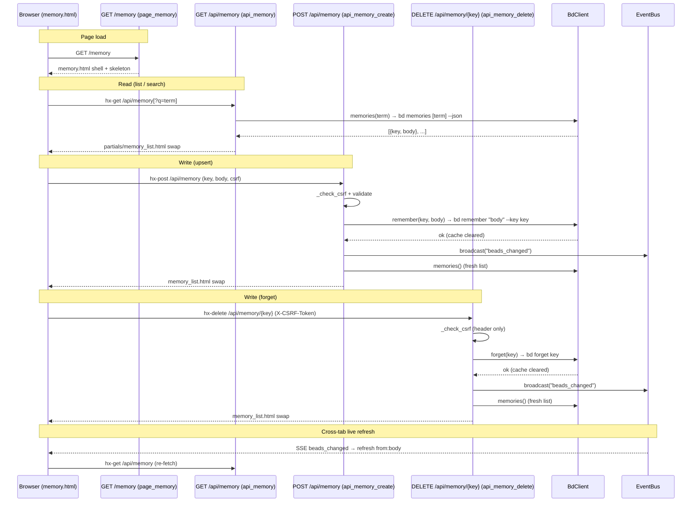

# Memory Curation

## What It Does

Lets a maintainer browse, search, create/update, and delete the workspace's
**`bd` memories** — the persistent `key → body` notes that `bd` re-injects
into every agent session at `bd prime` — entirely from the browser, with
live cross-tab refresh and markdown-rendered card previews.

## Why It Exists

`bd` memories are the long-term knowledge store for the workspace: dev
workflow conventions, CLI gotchas, architectural decisions, and operational
lessons that agents consume at session start. Before this feature the only
way to manage them was the CLI (`bd remember`, `bd forget`, `bd memories`).
Memory Curation surfaces that same data in bdboard so a maintainer can:

- **Audit** what agents will see at prime time without switching to a
  terminal.
- **Edit** a stale or inaccurate memory in-place (upsert by key).
- **Forget** an obsolete memory with a friction-gated confirmation, because
  a stray forget silently degrades every future agent session that relied
  on it.
- **Search** across keys and bodies with bd's own server-side substring
  match, rather than grepping CLI output.

This is bdboard's **first write feature** — the one that introduced the CSRF
guard, the `_run_mutate` path in `BdClient`, and the optimistic SSE
broadcast pattern that Formula Pour and Manual Field Editing later reused.

## How It Works

### User Perspective

The user navigates to `/memory`. The page paints instantly (masthead, search
strip, skeleton cards) then hydrates the real list from `GET /api/memory`
via HTMX.

- **Browse:** every memory appears as a card with a monospace key heading
  and a markdown-rendered body. A live result count reads
  *"N memories"* (or *"N matching \"term\""* when searching).
- **Search:** typing in the search input fires a debounced (250 ms)
  server-side query. `hx-sync="this:replace"` cancels in-flight fetches so
  only the latest term wins. Clearing the input (native ) fires the
  `search` event and returns to the full list.
- **Create:** clicking **"+ New Memory"** opens a native `<dialog>` modal
  (focus-trapped). The user fills a key slug and a markdown body, then
  submits. The list re-renders immediately with the new card.
- **Edit:** clicking the pencil on a card opens the same dialog pre-filled,
  with the key field set to `readonly` (you cannot rename a key via
  `bd remember`; only the body is replaced).
- **Forget:** clicking the trash on a card opens a **separate** confirmation
  dialog that names the key and warns about the consequence. Only the
  explicit "Yes, Forget It" button fires the `DELETE`.
- **Live refresh:** any change from another tab, the CLI, or an agent
  appears within ~1 s via the SSE `beads_changed` broadcast, which
  triggers `refresh from:body` and re-fetches the list.

### System Perspective

Memory Curation spans two categories of work: **reads** (list / search) and
**writes** (create-or-update / delete). Both converge on the same rendered
partial (`memory_list.html`) so the user always sees a consistent list.

**Read path (GET /api/memory):**

1. The search input (or the region's `hx-trigger="load"`) fires
   `hx-get="/api/memory"` with the optional `?q=<term>`.
2. `api_memory` strips and forwards the term to `BdClient.memories(term)`.
3. `BdClient.memories` shells `bd memories [term] --json` through the
   serialized subprocess pipeline (`_cached` → `_subprocess_gate` →
   `_run_json`), with TTL cache (10 s success / 30 s error) and in-flight
   dedup.
4. The raw JSON — a flat `{key: body, schema_version: N}` object — is
   stripped of the `schema_version` sentinel, sorted alphabetically by key,
   and returned as `[{"key": ..., "body": ...}]`.
5. The handler renders `partials/memory_list.html` with the list and the
   query term. On bd failure it degrades to a friendly inline message at
   HTTP 200 (no 5xx, so HTMX swaps stay intact).

**Write path (POST /api/memory — upsert):**

1. The modal form sends `key`, `body`, and `csrf_token` via
   `hx-post="/api/memory"` (plus the `X-CSRF-Token` header from
   `hx-headers`).
2. `api_memory_create` validates CSRF (header or form field), strips and
   validates key/body (both required), then calls
   `BdClient.remember(key, body)`.
3. `BdClient.remember` shells `bd remember "<body>" --key <key>` through
   `_run_mutate` (serialized, not cached), then immediately clears
   `_memories_cache` so the next read picks up the fresh state.
4. The handler broadcasts `beads_changed` via the SSE bus (optimistic
   refresh), then re-fetches the full memory list and returns
   `memory_list.html` for the acting tab's swap.

**Write path (DELETE /api/memory/{key} — forget):**

1. The confirm dialog's button fires `hx-delete="/api/memory/<key>"` with
   the `X-CSRF-Token` header (no form fallback — HTMX-only path).
2. `api_memory_delete` validates CSRF (header only), strips the key, then
   calls `BdClient.forget(key)`.
3. `BdClient.forget` shells `bd forget <key>` through `_run_mutate`,
   then clears `_memories_cache`.
4. Same optimistic broadcast + fresh list return as the upsert path.



## Key Data Shapes

**bd memories --json (raw wire shape from `bd`)**

```json
{
  "schema_version": 1,
  "dev-workflow": "Dev workflow in this repo is make-driven: make venv/install/dev/run/lint/fmt ...",
  "stack-overview": "bdboard is a FastAPI+HTMX dashboard for beads workspaces; ..."
}
```

A flat `{key: body}` object. The `schema_version` sentinel is metadata, not a
memory — `BdClient.memories` strips it before returning.

**Parsed memory list (BdClient.memories return value)**

```json
[
  {"key": "dev-workflow", "body": "Dev workflow in this repo is make-driven ..."},
  {"key": "stack-overview", "body": "bdboard is a FastAPI+HTMX dashboard ..."}
]
```

Sorted alphabetically by `key`. Empty list when no memories exist or when the
search matches nothing.

**POST /api/memory request (form-encoded)**

```
key=dev-workflow&body=Dev+workflow+in+this+repo+...&csrf_token=<token>
```

Plus `X-CSRF-Token: <token>` in the request header (HTMX `hx-headers`).

**Error response (inline HTML partial)**

```html
<p class="memory-error" role="alert">Key cannot be empty.</p>
```

All error responses are HTML fragments (`role="alert"`) swapped into
`#memory-list`, not JSON — the feature is entirely server-rendered.

## API Surface

| Method | Path | Purpose | -> Endpoint doc |
| --- | --- | --- | --- |
| GET | `/api/memory` | List or search memories; returns the `memory_list.html` partial | [GET /api/memory](../Endpoints/GetApiMemory.md) |
| POST | `/api/memory` | Create or update (upsert) a memory via `bd remember` | [POST /api/memory](../Endpoints/PostApiMemory.md) |
| DELETE | `/api/memory/{key:path}` | Delete a memory via `bd forget` | [DELETE /api/memory/{key}](../Endpoints/DeleteApiMemory.md) |
| GET | `/api/events` | SSE stream for cross-tab live refresh | [GET /api/events](../Endpoints/GetApiEvents.md) |

## Implementation Map

| Responsibility | File path | Symbol |
| --- | --- | --- |
| Full-page shell (masthead, search, dialogs) | `src/bdboard/templates/memory.html` | `` |
| Page route (workspace validation, renders shell) | `src/bdboard/app.py` | `page_memory` |
| List/search partial (cards, count, empty states) | `src/bdboard/templates/partials/memory_list.html` | template |
| Skeleton placeholder (shimmer cards, `aria-hidden`) | `src/bdboard/templates/partials/memory_skeleton.html` | template |
| List/search API endpoint (read path) | `src/bdboard/app.py` | `api_memory` |
| Create/update API endpoint (upsert write path) | `src/bdboard/app.py` | `api_memory_create` |
| Delete API endpoint (forget write path) | `src/bdboard/app.py` | `api_memory_delete` |
| CSRF validation helper | `src/bdboard/app.py` | `_check_csrf` |
| Per-process CSRF token | `src/bdboard/app.py` | `_CSRF_TOKEN` |
| bd CLI: read memories (cached, deduped) | `src/bdboard/bd.py` | `BdClient.memories` |
| bd CLI: upsert memory | `src/bdboard/bd.py` | `BdClient.remember` |
| bd CLI: delete memory | `src/bdboard/bd.py` | `BdClient.forget` |
| Memories TTL cache (per-query key) | `src/bdboard/bd.py` | `BdClient._memories_cache` |
| schema_version sentinel key | `src/bdboard/bd.py` | `SCHEMA_VERSION_KEY` |
| Serialized subprocess runner (mutations) | `src/bdboard/bd.py` | `BdClient._run_mutate` |
| Cached/deduped subprocess runner (reads) | `src/bdboard/bd.py` | `BdClient._cached` |
| Subprocess gate semaphore | `src/bdboard/bd.py` | `BdClient._subprocess_gate` |
| Cache invalidation on write | `src/bdboard/bd.py` | `BdClient.invalidate_caches` |
| Markdown rendering (memory body → HTML) | `src/bdboard/md.py` | `render` (registered as `md` Jinja filter) |
| SSE broadcast (optimistic + watcher-driven) | `src/bdboard/events.py` | `EventBus.broadcast` |
| Client-side: confirm-forget dialog wiring | `src/bdboard/templates/memory.html` | `confirmForget(key)` |
| Client-side: edit dialog pre-fill + reset | `src/bdboard/templates/memory.html` | `editMemory(key, body)`, dialog `close` listener |

## Configuration

| Key | Default | Effect |
| --- | --- | --- |
| `MEMORIES_TIMEOUT_S` | `8.0` s | Subprocess timeout for `bd memories --json` reads. |
| `REMEMBER_TIMEOUT_S` | `10.0` s | Subprocess timeout for `bd remember` writes (includes dolt commit). |
| `FORGET_TIMEOUT_S` | `10.0` s | Subprocess timeout for `bd forget` writes (includes dolt commit). |
| `SUCCESS_TTL_S` | `10.0` s | TTL cache window for a successful `memories` fetch; subsequent reads within this window are served from `_memories_cache` without a subprocess. |
| `ERROR_TTL_S` | `30.0` s | TTL cache window for a failed `memories` fetch; avoids hammering a broken `bd` process. |
| `_CSRF_TOKEN` | `secrets.token_urlsafe(32)` | Per-process CSRF secret minted once at startup; lives for the process lifetime. |
| Search debounce | `250ms` (client-side `hx-trigger`) | Quiet-window in the search input before the HTMX fetch fires; set in the template's `hx-trigger="keyup changed delay:250ms, search"`. |

## Edge Cases

> [!WARNING]
> **Upsert, not insert-or-fail.** `bd remember` has upsert semantics: if the
> key exists, its body is silently replaced. The UI makes the key field
> `readonly` when editing, but a hand-crafted `POST` with an existing key will
> overwrite. There is no version conflict detection.

> [!WARNING]
> **Key encoding in DELETE.** Memory keys can contain slashes
> (e.g. `flowdoc/pour-gate`). The route uses FastAPI's `:path` converter so
> the whole key is captured. The client `encodeURIComponent`s the key;
> FastAPI decodes it back. A double-encoded slash (`%252F`) would mismatch.

> [!WARNING]
> **Read-after-write race.** After `remember` or `forget`, the handler
> re-fetches the full list via `bd.memories()`. Because the memories cache was
> just cleared, this always issues a fresh subprocess. However, the watcher may
> also fire and trigger a concurrent `memories()` call before the acting
> handler's response lands. The `_subprocess_gate` serializes these, and the
> TTL cache means the second call reuses the first's result — no race, just a
> brief serialization delay.

> [!WARNING]
> **CSRF token lifetime = process lifetime.** The CSRF token is not rotated.
> A stale page from before a server restart holds an invalid token and will get
> `403` on any write. The error message tells the user to refresh the page.

> [!WARNING]
> **bd failure on read degrades to 200, not 5xx.** If `bd memories` raises,
> `api_memory` returns HTTP 200 with a friendly inline message rather than a
> 500. This keeps the HTMX swap intact (the page chrome stays up), but means
> monitoring that keys on HTTP status codes alone will not catch a broken `bd`.

## Error Scenarios

| Trigger | Behavior | User sees |
| --- | --- | --- |
| `bd memories` subprocess fails (timeout, exit ≠ 0) | `api_memory` catches `RuntimeError`, logs warning, returns HTTP 200 with inline message | *"Couldn't load memories right now. Please try again in a moment."* in the list region |
| `bd memories` returns non-object JSON | `BdClient.memories` raises `RuntimeError` | Same degraded inline message as above |
| Empty key submitted | `api_memory_create` returns HTTP 400 | *"Key cannot be empty."* alert |
| Empty body submitted | `api_memory_create` returns HTTP 400 | *"Body cannot be empty."* alert |
| `bd remember` subprocess fails | `api_memory_create` catches `RuntimeError`, returns HTTP 500 | *"Could not save: \<err\>"* alert |
| Empty key in DELETE path | `api_memory_delete` returns HTTP 400 | *"Key cannot be empty."* alert |
| `bd forget` fails (e.g. key not found) | `api_memory_delete` catches `RuntimeError`, returns HTTP 500 | *"Could not delete: \<err\>"* alert |
| Invalid/missing CSRF token on write | `_check_csrf` raises `HTTPException(403)` | *"Invalid or missing CSRF token. Please refresh the page and try again."* |
| Server restarted (CSRF token rotated) | First write attempt from a stale page gets 403 | Same CSRF error; user refreshes page to get the new token |

## Testing

Memory Curation is tested across four test files:

**bd client contract** (`tests/test_bd_memories.py`) — unit tests for
`BdClient.memories` with `_run_json` stubbed:

- `test_empty_sentinel_only_yields_no_results` — a payload with only
  `schema_version` returns `[]`.
- `test_no_match_search_yields_no_results` — search with no hits returns
  `[]` and forwards the term to `bd memories <term>`.
- `test_search_match_returns_entry` — a matching payload strips the sentinel
  and returns the hit.
- `test_full_list_sorted_by_key` — multiple entries come back sorted
  alphabetically by key.

**List/search endpoint** (`tests/test_api_memory.py`) — route tests for
`GET /api/memory` with `bd.memories` stubbed:

- Full list renders count + cards.
- Search renders filtered count and forwards `q` server-side.
- No-memories empty state (*"No memories yet"*).
- No-match empty state (*"No memories matching"*).
- Body rendered through the `md` markdown filter.
- Key rendered as a monospace `h3` heading.
- Result count in `aria-live="polite"` region.
- bd failure degrades gracefully (no 500).

**Page route** (`tests/test_page_memory.py`) — route tests for
`GET /memory`:

- Returns 200 and extends `base.html` (full page).
- Search strip carries `aria-label="Search memories"`.
- Debounced HTMX search to `/api/memory`.
- List region lazy-loads from `/api/memory`.
- Masthead nav with `aria-current` on the active page.
- Workspace validation failure renders error page.

**Mutation write paths** (`tests/test_memory_mutations.py`) — route tests
for `POST /api/memory` and `DELETE /api/memory/{key}`:

- CSRF validation rejects missing/invalid tokens.
- Remember/forget paths call the bd CLI wrappers.
- Error handling returns degraded responses.
- Optimistic refresh returns the updated list on success.
- Empty key/body validation returns 400.
- `test_create_memory_broadcasts_sse_on_success` — SSE broadcast fires.
- `test_delete_memory_broadcasts_sse_on_success` — SSE broadcast fires.

Run all memory tests:

```bash
pytest tests/test_bd_memories.py tests/test_api_memory.py tests/test_page_memory.py tests/test_memory_mutations.py -v
```

## Related

- [Memory (/memory)](../Views/MemoryView.md) — the full-page view that is the
  UI surface for this feature.
- [GET /api/memory](../Endpoints/GetApiMemory.md) — the read endpoint (list /
  search).
- [POST /api/memory](../Endpoints/PostApiMemory.md) — the upsert endpoint
  (create / update via `bd remember`).
- [DELETE /api/memory/{key}](../Endpoints/DeleteApiMemory.md) — the forget
  endpoint (delete via `bd forget`).
- [GET /api/events](../Endpoints/GetApiEvents.md) — the SSE stream that powers
  cross-tab live refresh.
- [Live Updates](LiveUpdates.md) — the cross-cutting feature whose optimistic
  broadcast + watcher path keeps the memory list live.
- [bd CLI as Source of Truth](../Concepts/BdCliSourceOfTruth.md) — why this
  feature shells `bd memories`/`remember`/`forget` instead of touching
  `.beads/` directly.
- [Subprocess Serialization & Caching](../Concepts/SubprocessSerializationAndCaching.md)
  — the `_subprocess_gate` semaphore + TTL cache behind `BdClient.memories`,
  and the `_run_mutate` path behind `remember`/`forget`.
- [SSE Event Bus](../Concepts/SseEventBus.md) — the `beads_changed` broadcast
  that keeps the memory list live across tabs.
- [CSRF Protection](../Concepts/CsrfProtection.md) — the guard fronting the
  two write endpoints. Memory Curation was the feature that introduced it.
- [Field Edit Write Path](../Flows/FieldEditWritePath.md) — a sibling write
  path that reuses the same CSRF + optimistic broadcast + `_run_mutate`
  plumbing that Memory Curation established.
- [Formula Pour](FormulaPour.md) — another write feature that reuses the same
  CSRF + optimistic broadcast pattern.
- [Back to docs index](../index.md)
