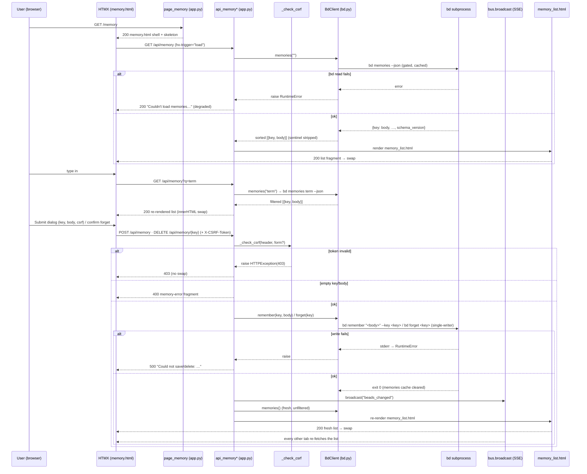

# Memory Management

## What It Does

Gives you a browser surface to **browse, search, create/update, and forget bd
memories** — the persistent notes bd injects into every agent session at
`bd prime` — from the `/memory` page, with every change fanned out live to every
open tab.

## Why It Exists

bd memories are the project's durable, cross-session knowledge: gotchas,
conventions, "why we chose X" decisions that bd re-injects at the top of every
agent session via `bd prime`. Authoring and pruning them on the CLI
(`bd remember`, `bd forget`, `bd memories`) works, but it's invisible to anyone
looking at the board, hard to search/skim, and easy to fat-finger — and a stray
`bd forget` silently degrades *every future agent session* that relied on the
note. Memory Management surfaces the whole memory store inside bdboard so a human
can read the rendered-markdown bodies, search them server-side, upsert one
through a guarded form, and delete one only behind an explicit confirm dialog —
while riding the same live-refresh pipeline as the rest of the app so a memory
edited in one tab (or on the CLI) appears everywhere without a reload. It also
adds three things the raw CLI doesn't give a UI: a **CSRF-guarded** write path, a
**failure-tolerant** read that degrades to a friendly message instead of blanking
the page, and **optimistic re-rendering** (re-read fresh, then broadcast) so the
acting tab never waits on the watcher debounce to see its own change.

## How It Works

### User Perspective

- Open **/memory** (linked from the masthead nav on every page). The page paints
  a four-card shimmer skeleton instantly, then hydrates the list region via an
  HTMX `load` fetch to `GET /api/memory` — a count line (`N memories`) followed
  by one card per memory: a monospace key heading, the markdown-rendered body,
  and edit/forget buttons. Cards are sorted alphabetically by key.
- **Search** — type in the search box; after a 250 ms debounce the list region
  re-fetches `GET /api/memory?q=<term>` and swaps in matches. The term is passed
  straight to `bd memories <term> --json`, so the filtering is bd's own
  case-insensitive substring match across key **and** body. Clearing the input
  returns to the full list; the count line reads `N matching "<q>"`.
- **Create / update** — click **+ New Memory**, fill Key + Body (markdown
  supported), Save. The form POSTs to `/api/memory` as an **upsert**: a new key
  is created, an existing key's body is replaced. The list re-renders in place
  with the new/updated card visible.
- **Edit** — click a card's edit button; the same dialog opens pre-filled, with
  the key field `readonly` (you can't rename a key via `bd remember` — upsert
  keys on identity). Save replaces the body.
- **Forget** — click a card's forget button; a second confirm `<dialog>` opens
  showing the key and a warning. Confirming issues `DELETE /api/memory/<key>` and the card
  disappears. Nothing deletes on a single click — the friction is deliberate
  because a forgotten memory degrades future agent sessions.
- All four operations fan out live: a memory changed in another tab (or by the
  `bd` CLI) arrives via SSE `beads_changed → refresh from:body`, re-fetching the
  list without a manual reload.

### System Perspective

The page route `page_memory` (`src/bdboard/app.py`) renders a cheap shell and
never blocks on a `bd` subprocess — every bd-backed read/write happens on the
three `/api/memory` routes. `GET /api/memory` (`api_memory`) is a read-only HTMX
swap target: it calls `bd.memories(term)` and renders `partials/memory_list.html`,
degrading a `RuntimeError` to a friendly `200` inline message rather than 500-ing
the swap. The two mutating routes are the only write paths and share one shape:
`_check_csrf` (header-or-form token) → strip-and-validate non-empty key/body →
`bd.remember`/`bd.forget` (which run `bd remember`/`bd forget` through the
single-writer `_run_mutate`/`_subprocess_gate` and clear the memories cache) →
`bus.broadcast("beads_changed")` → **re-read** `bd.memories()` fresh and
re-render the same `partials/memory_list.html` for the acting tab's swap. The
optimistic re-render plus the SSE broadcast (and the file watcher, which calls
`invalidate_caches` to drop the stale memories cache) keep the acting tab *and*
every other tab consistent. All three routes return **HTML fragments**, never
JSON — the read and both writes share the identical list render, so a successful
create/delete simply swaps the freshly-listed region into `#memory-list`.



## Key Data Shapes

Memory is form-encoded in and HTML-fragment out (never JSON on the wire), but
three internal shapes carry the feature: the raw bd payload, the per-memory dict
the list template renders, and the upsert POST body. Real field names below.

The raw `bd memories --json` payload — a **flat key→body object** plus a
`schema_version` sentinel that `BdClient.memories` strips (a payload of only the
sentinel is the empty/no-match shape and yields an empty list):

```json
{
  "dep-edge-direction": "bd reports \"blocks\" on both sides; the label depends on direction AND type.",
  "dev-workflow": "Run `uv run pytest` before every commit. Markdown is supported.",
  "schema_version": "1"
}
```

A single memory descriptor — what `BdClient.memories` returns (one per key,
sorted alphabetically, sentinel removed) and what each `memory-card` in
`partials/memory_list.html` renders (`body` through the shared `md` Jinja filter):

```json
{
  "key": "dev-workflow",
  "body": "Run `uv run pytest` before every commit. Markdown is supported."
}
```

The upsert POST body (`application/x-www-form-urlencoded`) — exactly the fields
`api_memory_create` binds via `Form(...)`; the CSRF token may instead ride the
`X-CSRF-Token` header:

```json
{
  "key": "dev-workflow",
  "body": "Run `uv run pytest` before every commit. Markdown is supported.",
  "csrf_token": "<per-process token, optional if X-CSRF-Token header sent>"
}
```

The template context the list fragment renders (shared by the read and both
writes) — `query` is the (stripped) search term, reset to `""` after a mutation:

```json
{
  "memories": [
    { "key": "dep-edge-direction", "body": "…" },
    { "key": "dev-workflow", "body": "…" }
  ],
  "query": ""
}
```

## API Surface

| Method | Path | Purpose | → Endpoint doc |
| --- | --- | --- | --- |
| GET | `/api/memory` | Render the searchable memory list (`partials/memory_list.html`) from `bd memories [q] --json`; empty `q` lists all. A bd read failure degrades to a friendly inline message (still `200`). | [MemoryApi](../Endpoints/MemoryApi.md) |
| POST | `/api/memory` | **Upsert** a memory via `bd remember "<body>" --key <key>`: CSRF guard → validate → mutate → broadcast → re-render fresh list. | [MemoryApi](../Endpoints/MemoryApi.md) |
| DELETE | `/api/memory/{key:path}` | Forget a memory via `bd forget <key>` (`:path` so keys with `/` survive): CSRF guard → validate → mutate → broadcast → re-render fresh list. | [MemoryApi](../Endpoints/MemoryApi.md) |
| GET | `/api/events` | Long-lived SSE stream the post-mutation `beads_changed` broadcast rides so every open tab re-fetches `#memory-list`. | [SseEvents](../Endpoints/SseEvents.md) |

## Implementation Map

| Responsibility | File path | Symbol |
| --- | --- | --- |
| Page shell route (renders shell, surfaces workspace-validation error) | `src/bdboard/app.py` | `page_memory` |
| List/search route (read; failure-tolerant degrade to `200`) | `src/bdboard/app.py` | `api_memory` |
| Create/update route (upsert; CSRF → validate → broadcast → re-list) | `src/bdboard/app.py` | `api_memory_create` |
| Delete route (forget; CSRF → validate → broadcast → re-list) | `src/bdboard/app.py` | `api_memory_delete` |
| CSRF guard (header-or-form token check) | `src/bdboard/app.py` | `_check_csrf` / `_CSRF_TOKEN` |
| Optimistic SSE fan-out so all tabs re-render | `src/bdboard/app.py` | `bus.broadcast("beads_changed")` |
| Search/list bd read (`bd memories [term] --json`, strips sentinel, sorts by key) | `src/bdboard/bd.py` | `BdClient.memories` / `SCHEMA_VERSION_KEY` |
| TTL-cache + in-flight dedup + timeout wrapper for the read | `src/bdboard/bd.py` | `BdClient._cached` / `BdClient._run_json` |
| Upsert mutation (`bd remember "<body>" --key <key>`, then clear memories cache) | `src/bdboard/bd.py` | `BdClient.remember` |
| Delete mutation (`bd forget <key>`, then clear memories cache) | `src/bdboard/bd.py` | `BdClient.forget` |
| Serialized single-writer subprocess runner (drains pipes on every exit) | `src/bdboard/bd.py` | `BdClient._run_mutate` / `_subprocess_gate` |
| Post-watcher cache invalidation (drops memories cache for fresh reads) | `src/bdboard/bd.py` | `BdClient.invalidate_caches` |
| List render (shared by read + both writes; cards, count, empty states) | `src/bdboard/templates/partials/memory_list.html` | `memory-list` / `memory-card` / `memory-count` |
| Loading skeleton (four shimmer cards until first swap; `aria-hidden`) | `src/bdboard/templates/partials/memory_skeleton.html` | `memory-skeleton` |
| Search input, create/edit `<dialog>`, forget-confirm `<dialog>` + JS wiring | `src/bdboard/templates/memory.html` | `#memory-q` / `#memory-form-dialog` / `editMemory` / `confirmForget` |
| Primary nav link to `/memory` (active-page `aria-current`) | `src/bdboard/templates/partials/nav.html` | `nav` |

## Configuration

| Key | Default | Effect |
| --- | --- | --- |
| `MEMORIES_TIMEOUT_S` (`src/bdboard/bd.py`) | `8.0` s | Per-`bd memories` subprocess timeout for the list/search read. On timeout the read raises `RuntimeError`, which `api_memory` catches and degrades to the friendly inline message. |
| `REMEMBER_TIMEOUT_S` (`src/bdboard/bd.py`) | `10.0` s | `bd remember` timeout — longer than the read because the write does a dolt commit. On timeout the user sees `Could not save: …` (`500`). |
| `FORGET_TIMEOUT_S` (`src/bdboard/bd.py`) | `10.0` s | `bd forget` timeout. On timeout/failure the user sees `Could not delete: …` (`500`). |
| `SCHEMA_VERSION_KEY` (`src/bdboard/bd.py`) | `"schema_version"` | The sentinel key `BdClient.memories` strips from the raw payload so it never renders as a memory card. |
| `_CSRF_TOKEN` (`src/bdboard/app.py`) | `secrets.token_urlsafe(32)` per process | The token the POST/DELETE must echo (header or, for POST, form field). Regenerated on every server restart, so a stale tab's write gets `403` until it reloads. |
| `BDBOARD_WORKSPACE` (env) | `$PWD` / cwd | Workspace whose `.beads/` the memory reads/writes target. |
| `BDBOARD_BD_BIN` (env) | `bd` | The `bd` binary the memory subprocesses invoke; must resolve. |

> [!NOTE]
> The three timeouts, the sentinel key, and the CSRF token are **module-level
> constants**, not environment variables — change them in source (and re-run the
> memory tests). Only the `BDBOARD_*` keys are runtime-configurable via the
> environment.

## Edge Cases

> [!WARNING]
> **The `schema_version` sentinel is not a memory.** `bd memories --json`
> returns a flat key→body object that always includes a `schema_version` entry;
> `BdClient.memories` strips it, and a payload of *only* the sentinel is the
> empty shape (yields `[]`). If you ever bypass `BdClient.memories` you'll
> accidentally render `schema_version` as a card — always go through it.

> [!WARNING]
> **`POST /api/memory` is an upsert, not a create.** Posting an existing key
> silently replaces its body — there is no "already exists" error. The edit
> dialog makes the key field `readonly` precisely because you cannot rename a key
> via `bd remember`; a "rename" would just create a second memory and orphan the
> old one.

> [!WARNING]
> **A bd *read* failure degrades; a bd *write* failure surfaces.** `GET` catches
> `RuntimeError` and returns a `200` friendly fragment so a transient hiccup
> never blanks the page or breaks the HTMX swap. `POST`/`DELETE` return `500`
> fragments on failure — the asymmetry is intentional (a silently-swallowed
> write would lie to the user about what's persisted).

> [!WARNING]
> **Forget is irreversible and cross-session destructive.** Memories are
> injected at `bd prime`, so forgetting one degrades every future agent session
> that relied on it. The endpoint forgets on the first authorized call — the only
> safety net is the UI's confirm-before-forget `<dialog>` (`confirmForget`).
> `bd forget` on a non-existent key exits non-zero, surfacing as `Could not
> delete: <stderr>` (`500`).

> [!CAUTION]
> **The CSRF token dies with the process.** `_CSRF_TOKEN` is minted per server
> start; a tab left open across a restart will `403` on its next write until
> reloaded. Never hard-code or persist the token — read it from the rendered
> page's hidden `csrf_token` input / `hx-headers` on each load.

## Error Scenarios

| Trigger | Behavior | User sees |
| --- | --- | --- |
| POST/DELETE with missing/mismatched CSRF token | `_check_csrf` raises `HTTPException(403)` before any bd call; nothing mutated | `403` — no swap; reload the page to pick up the current `_CSRF_TOKEN` |
| POST/DELETE with a blank `key` (`key.strip()` empty) | Validation short-circuits before the mutation | `400` — `Key cannot be empty.` (`role="alert"`) |
| POST with a blank `body` (`body.strip()` empty) | Validation short-circuits before the mutation | `400` — `Body cannot be empty.` (`role="alert"`) |
| `GET /api/memory` and `bd memories` raises `RuntimeError` (timeout / non-zero / bad JSON) | Logged `bd memories failed`; degrades rather than 500-ing the swap | `200` — `Couldn't load memories right now. Please try again in a moment.` (`role="status"`) |
| `POST /api/memory` and `bd remember` raises `RuntimeError` | Logged `bd remember failed`; mutation not persisted | `500` — `Could not save: <bd stderr>` (`role="alert"`) |
| `DELETE /api/memory/{key}` and `bd forget` raises (includes key-not-found) | Logged `bd forget failed` | `500` — `Could not delete: <bd stderr>` (`role="alert"`) |
| `GET /memory` and `_validate_or_warn()` fails (broken workspace) | Page route returns `error.html` instead of an empty shell | `500` — workspace error page |
| Post-mutation `bd.memories()` re-read fails | Re-raises into the route's error handling; the broadcast already fired so other tabs reconcile via the watcher | `500` fragment for the acting tab; board heals on next refresh |

## Testing

- **Read/search** — `tests/test_api_memory.py` covers `GET /api/memory` against
  a stubbed `BdClient`: full list render (count + cards), server-side search
  (term forwarded to `bd.memories`), the empty/no-match states, and the
  bd-failure **degrade** path (asserts `200` + the friendly message, not `500`).
- **Mutations** — `tests/test_memory_mutations.py` covers `POST`/`DELETE`
  against stubbed `BdClient`/`bus`: CSRF `403` (header and form-field token
  paths), empty-`key`/`body` `400`s, successful **upsert** (`bd remember` called,
  `beads_changed` broadcast, fresh list re-rendered), successful **forget**
  (`bd forget` called, card absent in the re-render), and the `bd` write-failure
  `500` fragments for both save and delete.
- **Manual check** — start the server, open `/memory`; confirm the skeleton →
  list swap, type to search, create/edit via the dialog (markdown renders), and
  forget behind the confirm dialog (card vanishes in this tab *and* a second
  tab). From a terminal (token = the per-process value the page rendered with):
  ```bash
  curl -i 'http://127.0.0.1:8765/api/memory?q=workflow'
  curl -i -X POST 'http://127.0.0.1:8765/api/memory' \
    -H 'X-CSRF-Token: <token>' \
    -H 'Content-Type: application/x-www-form-urlencoded' \
    --data-urlencode 'key=dev-workflow' \
    --data-urlencode 'body=Run `uv run pytest` before every commit.'
  curl -i -X DELETE 'http://127.0.0.1:8765/api/memory/dev-workflow' \
    -H 'X-CSRF-Token: <token>'
  ```
  Expect `200` + the re-rendered list on success, `403` if the token is omitted,
  and `400` for a blank required field.

## Related

- [Memory API (`/api/memory` GET/POST/DELETE)](../Endpoints/MemoryApi.md) — the
  HTTP contract for the three routes (request/response shapes, validation rules,
  error table) this feature is the behavior-first overview of.
- [Memory page (`/memory`)](../Views/MemoryPage.md) — the full-page view (search
  box, create/edit dialog, forget-confirm dialog, skeleton) that drives every
  call to these routes; this feature is its functional spec.
- [SSE events (`/api/events`)](../Endpoints/SseEvents.md) — the channel the
  post-mutation optimistic `beads_changed` broadcast rides so every tab
  re-fetches the freshly-changed list.
- [Bead field-edit API (`POST /api/bead/{id}/field`)](../Endpoints/BeadFieldEditApi.md)
  — a **sibling write route** sharing the identical `_check_csrf`/`_CSRF_TOKEN`
  guard and the re-read-fresh-then-`broadcast` posture.
- [Formula pour (Feature)](FormulaPour.md) — the other UI write feature, built on
  the same CSRF guard, `_run_mutate` single-writer gate, and failure-tolerant
  inline-message degradation.
- [Live auto-refresh (Feature)](LiveAutoRefresh.md) — the live-update mechanism a
  memory change rides; each mutation fires an optimistic `beads_changed` so edits
  arrive live in every tab.
- [bd CLI as runtime source of truth](../Concepts/BdCliSourceOfTruth.md) — why
  every memory read/write bottoms out in `bd memories`/`bd remember`/`bd forget`
  rather than touching the dolt store directly.
- [Store snapshot cache & change detection](../Concepts/StoreSnapshotCache.md) —
  the memories TTL-cache, `_subprocess_gate` serialization, and
  `invalidate_caches` post-watcher cache drop these routes rely on for accurate
  optimistic re-renders.
- [Watcher debounce/cooldown & self-feedback skip](../Concepts/WatcherScheduling.md)
  — the producer side that turns a memory's `.beads/` mutation into exactly one
  `beads_changed` pulse without spinning on bdboard's own reads.
- [HTMX + server-rendered partials](../Concepts/HtmxPartialsArchitecture.md) —
  the `hx-get`/`hx-post`/`hx-delete` + `innerHTML` swap idiom, the `hx-headers`
  CSRF wiring, and the shared-partial render pattern these routes embody.
- [Features index](index.md) · [Architecture](../Architecture.md#key-flows) ·
  [Manifest](../_Manifest.md) — the feature catalog and system view this sits in.
